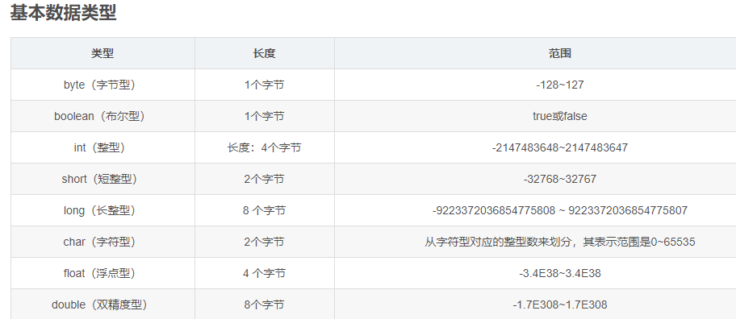
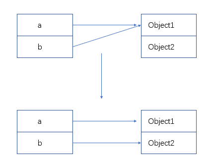
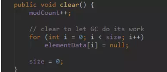

# 1. Java的8种基本类型及取值范围

Java的8种基本类型是什么？各自的字节数和取值范围？

**byte**：8位（1字节），数据范围**-128~127**。

**short**：16位（2字节），数据范围**-32768~32767**。

**int**：32位（4字节），数据范围**-2^31~2^31-1**。

**long**：64位（8字节），数据范围**-2^63~2^63-1**，赋值时数字后加L。

**float**：32位（4字节），单精度，赋值时数字后加f或F。

**double**：64位（8字节），双精度，赋值时可加d或D也可不加。

**boolean**：只有**true**和**false**两个取值，Java虚拟机规范中单个boolean占**4个字节**（编译后用int代替），boolean数组每个占**1个字节**（用byte代替）。

**char**：16位（2字节），存储Unicode码，用单引号赋值。

# 2. 基本类型与引用类型的区别

基本类型与引用类型在内存存储上有什么区别？



**存储位置：**

- **基本类型**：变量的值就是实际的数据值。局部变量在栈中，静态变量在堆中，实例变量随对象存在堆中。
- **引用类型**：变量值是对象的内存地址，对象本身存储在堆中。

# 3. 包装类型的缓存池机制

Java包装类型的缓存池是什么？范围是多少？

**缓存池（Cache Pool）：**

Java为部分包装类型提供了**缓存机制**，在自动装箱时复用缓存范围内的对象，避免频繁创建新对象。

**各类型缓存范围：**

- **Boolean**：缓存true和false两个值
- **Byte**：缓存全部**-128~127**
- **Short**：缓存**-128~127**
- **Integer**：缓存**-128~127**（上限可通过JVM参数调整）
- **Long**：缓存**-128~127**
- **Character**：缓存**0~127**

**典型坑点：**

```java
Integer a = 127;  // 从缓存池取对象
Integer b = 127;  // 从缓存池取对象
a == b;           // true（同一对象）

Integer c = 128;  // new Integer(128)
Integer d = 128;  // new Integer(128)
c == d;           // false（不同对象）
// 应使用 equals() 比较
```

# 4. Java位运算符详解

Java提供了哪些位运算符？各自的规则？

**运算符列表：** 左移(<<)、右移(>>)、无符号右移(>>>)、位与(&)、位或(|)、位非(~)、位异或(^)。除位非(~)是一元操作符外，其他都是二元操作符。

**& 与运算符**：同一位上两个值都是1时结果为1，否则为0。

**| 或运算符**：同一位上两个值只要有一个为1时结果为1，否则为0。

**~ 取反运算符**：对操作数的每一位取反，1变0，0变1。

**^ 异或运算符**：同一位上数值相同为0，不同为1。特殊性质：**a ^ b ^ b = a**（可逆），可用于加密和交换变量值。

**<< 左移运算符**：整体向左移动b位，符号位不变，低位补0，相当于乘以2^b。

**>> 右移运算符**：整体向右移动b位，符号位不变，高位补符号位，相当于除以2^b。

**>>> 无符号右移**：整体向右移动b位，高位统一补0（忽略符号位）。

# 5. 方法重载与返回值的关系

方法重载时，不同返回值但相同方法名和参数可以重载吗？

**语言层面**：Java的overload resolution**只看方法名和参数列表类型，不看返回值类型**。如果方法名+参数列表匹配到多个同等版本，以"冲突"失败。

**JVM层面**：实际允许同一个类中有多个同名同参数、仅返回值类型不同的方法，但Java语言和反射API未暴露此特性，只有**MethodHandle API**能处理。

# 6. BigDecimal的常用方法及比较

BigDecimal有哪些常用方法？如何比较大小？

**常用方法：**

- **add(BigDecimal)**：相加
- **subtract(BigDecimal)**：相减
- **multiply(BigDecimal)**：相乘
- **divide(BigDecimal)**：相除（需指定精度和舍入模式）
- **toString()**：转字符串
- **doubleValue()/floatValue()**：转浮点数
- **longValue()/intValue()**：转整数

**大小比较：**

使用**compareTo**方法比较：`a.compareTo(b)`

- a = **-1**：小于
- a = **0**：等于
- a = **1**：大于

注意：**不要用equals比较**，equals会同时比较精度（scale），如`2.0`和`2.00`用equals返回false，但compareTo返回0。

# 7. Java是值传递还是引用传递？

Java是值传递还是引用传递？为什么？

**Java只有值传递，没有引用传递。**

- **值传递（Pass by Value）**：调用函数时将实参值复制一份传递给被调函数，修改形参不影响实参
- **引用传递（Pass by Reference）**：将实参地址直接传递给被调函数，修改形参会一并修改实参（C语言支持，Java不支持）

**验证：**

```java
public void methodA() {
    Object a = new Object();
    System.out.println("A: " + a);
    methodB(a);
    System.out.println("A: " + a);  // 指向的对象不变
}

public void methodB(Object b) {
    b = new Object();  // 重新赋值不影响原引用
    System.out.println("B: " + b);
}
// 输出：
// A: java.lang.Object@26a1ab54
// B: java.lang.Object@3d646c37
// A: java.lang.Object@26a1ab54
```

调用methodB时，只是把a的**引用拷贝**了一份，两个引用同时指向同一个对象。对形参重新赋值只改变形参指向，不影响实参。



# 8. static关键字的作用和原理

static关键字的作用是什么？静态变量何时加载？

**核心特性：**

**static**修饰的成员属于**类级别**，不依赖任何实例，在类加载时分配并初始化。

**static的作用：**

- **静态变量**：所有实例共享同一份内存，通过类名直接访问
- **静态方法**：属于类，不能直接访问实例变量和实例方法，不能使用this
- **静态代码块**：类加载时执行一次，常用于初始化静态资源
- **静态内部类**：不持有外部类引用，可独立创建实例

**类加载时机（JVM规范规定必须立即初始化的4种情况）：**

1. 遇到**new**、**getstatic**、**putstatic**、**invokestatic**指令时
2. 使用**反射**调用类时
3. 初始化子类时，父类未被初始化则先初始化父类
4. JVM启动时指定**主类**（包含main方法的类）

**注意：** static变量和静态代码块**只会加载一次**，并且随着类的加载而加载，如果类没有被加载，不会初始化static变量或执行static代码块。

# 9. final关键字的作用

final关键字的作用是什么？什么是不可变类？

**final的核心作用：不可变性。**

**修饰对象：**

- **final类**：不能被继承（如String、Integer等包装类）
- **final方法**：不能被子类重写（方法锁定）
- **final变量**：值不能被修改（基本类型值不变，引用类型的引用不变但对象内容可变）

**final与值传递：**

final修饰的引用变量，作为参数传递时只是把引用复制一份，形参重新赋值不影响原引用。final限制的是**引用不能变**，而非对象内容不能变。

```java
final Map<String, String> map = new HashMap<>();
map.put("key", "value");  // 合法，对象内容可改
map = new HashMap<>();    // 编译错误，引用不能变
```

**不可变类（Immutable Class）：**

**创建规则：**
1. 类声明为**final**（防止被子类修改）
2. 所有字段声明为**private final**
3. 不提供修改字段的方法（setter）
4. 构造方法**深度拷贝**可变对象字段
5. getter方法返回**副本**而非原对象

典型案例：**String**、**Integer**、**BigDecimal**等都是不可变类。

# 10. Java异常机制底层原理

Java异常处理机制底层是如何实现的？finally为什么一定会执行？

**异常表（Exception Table）：**

Java编译后，方法体中的代码被编译成字节码存储在Code属性中，异常表存储在Code属性中。异常表包含四个字段：

- **From**：监控开始点
- **To**：监控结束点
- **Target**：异常处理代码起始位置
- **Type**：捕获的异常类型

**异常处理流程：**

触发异常 → 遍历异常表 → 匹配from/to范围 → 匹配type类型
- 匹配成功：跳转到target执行
- 匹配失败：弹出当前栈帧，向上层调用者传递

**finally的字节码实现：**

finally代码块在字节码中被**复制三份**：
1. try路径正常执行完后
2. catch路径执行完后
3. 异常路径（捕获"any"异常，执行完finally后重新抛出）

```java
public static int get() {
    try { return 1; }
    catch (Exception e) { return 2; }
    finally { return 3; }
}
// 结果：返回3（finally覆盖了try/catch的return）
```

**关键规则：**

- 如果finally中有**return**，会覆盖try/catch中的return
- 如果finally抛出异常，会**忽略**catch中捕获的异常（异常抑制）
- 异常表会添加监控try和catch的异常处理器，捕获"any"类型，执行完finally后重新抛出
- try-with-resources会自动关闭资源，底层通过添加suppressed异常实现

# 11. Java四种引用类型

Java有哪几种引用类型？各自的GC表现是什么？

Java中4种引用级别由高到低：**强引用 > 软引用 > 弱引用 > 虚引用**

**强引用（Strong Reference）：**

最常见的引用。只要强引用存在，GC**绝不会回收**该对象。即使内存不足JVM抛出OOM，也不会回收强引用对象。

- 方法内局部变量：方法结束、栈帧弹出后引用消失，对象被回收
- 全局变量：需要手动置null来释放引用

**实践技巧**：ArrayList的clear()方法将elementData数组每个元素置为null，而非elementData=null。既释放了元素对象的引用，又保留了数组的强引用，避免后续add()时重新分配内存。



```java
Object strong = new Object();  // 强引用
```

**软引用（Soft Reference）：**

内存充足时不回收，**内存不足时回收**。GC会在抛出OOM之前回收软引用对象，优先回收长时间闲置不用的软引用对象。

```java
SoftReference<Object> soft = new SoftReference<>(new Object());
```

适用于**缓存实现**，如图片缓存、网页缓存。

**弱引用（Weak Reference）：**

GC线程扫描到弱引用对象时，**不管内存是否充足，都会回收**。但GC优先级较低，不会立即回收。

- 对象没有任何强引用指向，只剩弱引用时才会被回收
- **典型应用**：ThreadLocal中的Entry继承WeakReference，防止ThreadLocal内存泄漏

```java
WeakReference<Object> weak = new WeakReference<>(new Object());
```

**虚引用（Phantom Reference）：**

最弱的引用，**任何时候都可能被回收**。必须与**ReferenceQueue**联合使用。无法通过虚引用获取对象（get()始终返回null）。

主要用来**跟踪对象被回收的活动**，GC回收对象前会将虚引用加入关联的引用队列。常用于NIO的DirectByteBuffer内存回收通知。

```java
ReferenceQueue<Object> queue = new ReferenceQueue<>();
PhantomReference<Object> phantom = new PhantomReference<>(new Object(), queue);
```

# 12. 什么是泛型擦除？

Java泛型的实现机制是什么？什么是泛型擦除？

Java泛型是**伪泛型**，通过**类型擦除**实现：

- 编译时进行类型检查
- 编译后擦除类型信息，替换为**限定类型**（无限定则为Object）
- 必要时插入类型转换指令

```java
// 源码
List<String> list = new ArrayList<>();
String s = list.get(0);

// 编译后（类型擦除）
List list = new ArrayList();
String s = (String) list.get(0);  // 插入强制转换
```

**泛型擦除带来的问题：**
- 运行时无法获取泛型类型参数（list instanceof List\<String\>编译错误）
- 不能创建泛型数组（new T[]编译错误）
- 不能实例化泛型类型（new T()编译错误）

# 13. 反射的底层原理

Java反射机制的原理是什么？主要用途有哪些？

**核心类：**

| 类 | 作用 |
| --- | --- |
| **Class** | 代表类元数据 |
| **Method** | 代表方法 |
| **Field** | 代表字段 |
| **Constructor** | 代表构造方法 |

**底层原理：**

反射通过JVM在运行时生成的**Class对象**访问类的元数据。Class对象在类加载时由JVM创建，包含了类的完整结构信息（方法、字段、注解等）。

```java
// 获取Class对象的三种方式
Class<?> clazz1 = Class.forName("com.example.User");
Class<?> clazz2 = User.class;
Class<?> clazz3 = user.getClass();

// 反射调用方法
Method method = clazz.getMethod("getName");
String name = (String) method.invoke(user);
```

**主要用途：**
- **框架开发**（Spring、MyBatis的依赖注入、ORM映射）
- **动态代理**
- **IDE自动补全**
- **序列化/反序列化**

# 14. 注解的本质是什么？

Java注解的本质是什么？如何自定义注解？

**本质：**

注解本质上是一个**特殊的接口**，继承自`java.lang.annotation.Annotation`接口。使用`@interface`关键字定义，编译后生成接口的class文件。

**元注解：**

- **@Target**：注解作用范围（方法、字段、类等）
- **@Retention**：保留策略（源码/编译/运行时）
- **@Documented**：是否包含在Javadoc中
- **@Inherited**：是否可继承
- **@Repeatable**：是否可重复使用

**保留策略（RetentionPolicy）：**

- **SOURCE**：仅源码，编译后丢弃（如@Override）
- **CLASS**：编译到class文件，运行时不可反射
- **RUNTIME**：运行时可通过反射读取（如Spring注解）

# 15. 枚举的底层实现

Java枚举的底层实现是什么？枚举可以继承其他类吗？

**底层实现：**

Java枚举使用enum关键字定义，编译后JVM会将其转换为**继承自java.lang.Enum的final类**，枚举常量是类的静态final实例。

```java
// 源码
enum Color { RED, GREEN, BLUE }

// 编译后（等价形式）
public final class Color extends Enum<Color> {
    public static final Color RED = new Color("RED", 0);
    public static final Color GREEN = new Color("GREEN", 1);
    public static final Color BLUE = new Color("BLUE", 2);
    private static final Color[] $VALUES = { RED, GREEN, BLUE };
}
```

**关键特性：**
- 枚举不能继承其他类（已继承Enum），但可以实现接口
- 枚举是**线程安全**的（JVM保证实例化唯一性）
- 枚举可以定义字段和方法
- 枚举可以用于switch语句

# 16. Java序列化与反序列化

Java序列化的原理是什么？transient关键字的作用？

**序列化：**

将Java对象转换为字节序列的过程，用于**持久化存储**或**网络传输**。对象必须实现**Serializable**接口（标记接口）。

```java
// 序列化
ObjectOutputStream oos = new ObjectOutputStream(new FileOutputStream("data.ser"));
oos.writeObject(user);

// 反序列化
ObjectInputStream ois = new ObjectInputStream(new FileInputStream("data.ser"));
User user = (User) ois.readObject();
```

**serialVersionUID的作用：**

用于验证序列化和反序列化的版本一致性。如果类定义变化但UID不匹配，反序列化会抛出**InvalidClassException**。

**transient关键字：**

被transient修饰的字段**不会被序列化**，反序列化后为默认值。

# 17. 深浅克隆的区别

什么是浅克隆和深克隆？如何实现深克隆？

**浅克隆（Shallow Clone）：**

复制对象时只复制基本类型字段和引用地址，**不复制引用指向的对象**。原对象和克隆对象共享引用对象。

```java
class Address { String city; }
class User implements Cloneable {
    String name;
    Address address;
    @Override
    protected Object clone() throws CloneNotSupportedException {
        return super.clone();  // 浅克隆
    }
}
// 原对象和克隆对象的address指向同一个Address实例
```

**深克隆（Deep Clone）：**

递归复制所有引用对象，原对象和克隆对象完全独立。

**深克隆实现方式：**
1. **重写clone方法**：递归克隆所有引用字段
2. **序列化方式**：通过Serialization实现
3. **JSON/反序列化**：转换为JSON再转回对象

```java
// 序列化实现深克隆
User deepClone(User user) throws Exception {
    ByteArrayOutputStream bos = new ByteArrayOutputStream();
    ObjectOutputStream oos = new ObjectOutputStream(bos);
    oos.writeObject(user);
    ObjectInputStream ois = new ObjectInputStream(
        new ByteArrayInputStream(bos.toByteArray()));
    return (User) ois.readObject();
}
```

# 18. String、StringBuilder、StringBuffer的区别

String、StringBuilder、StringBuffer三者的区别及适用场景？

**可变性：**

- **String**：不可变，底层是**final char[]**（JDK 9后为byte[]），任何修改都会创建新对象
- **StringBuilder**：可变，底层是**非final char[]**，修改在原数组上操作
- **StringBuffer**：可变，底层也是char[]，方法与StringBuilder相同但加了**synchronized**

**线程安全：**

- **String**：不可变，天然线程安全
- **StringBuffer**：线程安全，方法用**synchronized**修饰
- **StringBuilder**：非线程安全，单线程下使用

**性能：**

- **StringBuilder > StringBuffer > String**（String拼接会产生大量临时对象）

**使用场景：**

- **String**：少量字符串操作或不变化的字符串
- **StringBuilder**：单线程字符串缓冲区（如方法内字符串拼接）
- **StringBuffer**：多线程共享的字符串缓冲区

# 19. ==与equals()和hashCode()的契约关系

==和equals()有什么区别？hashCode()与equals()有什么契约关系？

**==运算符：**

- **基本类型**：比较的是**值**是否相等
- **引用类型**：比较的是**内存地址**是否指向同一个对象

**equals()方法：**

- **Object默认实现**：内部就是==，比较内存地址
- **重写后的行为**：按业务逻辑比较内容是否相等（如String、Integer等都已重写）

**hashCode()与equals()的契约：**

1. **一致性**：同一对象多次调用hashCode()必须返回相同的整数（equals比较中用到的信息没变的前提下）
2. **equals相等 → hashCode必等**：如果`a.equals(b)==true`，则`a.hashCode()==b.hashCode()`**必须成立**
3. **hashCode相等 → equals不一定相等**：即哈希冲突，不同对象计算出相同哈希值是允许的
4. **重写equals必须重写hashCode**：否则违反契约，会导致HashMap/HashSet等哈希集合出现逻辑错误

**典型场景：**

```java
// 未重写hashCode的后果
Map<Person, String> map = new HashMap<>();
map.put(new Person("Tom"), "value");
map.get(new Person("Tom"));  // null！因为两个Person对象hashCode不同
```

# 20. 接口与抽象类的区别

接口和抽象类有什么区别？JDK 8前后接口有什么变化？

**语法层面：**

| 对比项 | 抽象类 | 接口 |
| --- | --- | --- |
| 关键字 | **abstract class** | **interface** |
| 继承/实现 | 单继承（extends） | 多实现（implements） |
| 构造方法 | 可以有 | 不能有 |
| 成员变量 | 各种类型 | **public static final**（常量） |
| 方法类型 | 抽象方法、具体方法 | 抽象方法、default、static（JDK 8+） |
| 访问修饰符 | 任意 | 方法默认**public** |

**设计层面：**

- **抽象类**：描述**是什么**（is-a）关系，代码复用，对共性进行抽象
- **接口**：描述**能做什么**（has-a/can-do）能力，定义行为规范

**JDK 8+接口新特性：**

- 允许**default方法**（提供默认实现，子类可选重写）
- 允许**static方法**（工具方法，接口名直接调用）
- JDK 9允许**private方法**（辅助default方法复用代码）

# 21. 面向对象四大特性

面向对象的四大特性是什么？各自的作用？

**封装：**

将对象的**数据和操作数据的方法**绑定在一起，对外隐藏内部实现细节。通过**访问修饰符**（private/protected/public）控制访问权限。降低复杂度，提高可维护性。

**继承：**

子类**复用**父类的属性和方法，并可以扩展新功能。Java是**单继承**（一个类只能有一个直接父类），但可以通过**多层继承**和**接口多实现**弥补。

**多态：**

同一操作作用于不同对象产生不同的执行结果。Java通过**方法重写**和**接口实现**实现多态，运行时根据**实际对象类型**调用对应方法（动态绑定）。三个必要条件：继承、重写、父类引用指向子类对象。

**抽象：**

从具体事物中**提取共同特征**，忽略非本质细节。通过**抽象类**和**接口**来实现。降低复杂度，提高扩展性。

# 22. 自动装箱与拆箱原理

什么是自动装箱和拆箱？底层是如何实现的？

**自动装箱（Autoboxing）：**

编译器自动将**基本类型**转换为对应的**包装类型**。底层调用包装类型的**valueOf()**方法。

```java
Integer n = 127;  // 编译器自动转为：Integer n = Integer.valueOf(127);
```

**自动拆箱（Unboxing）：**

编译器自动将**包装类型**转换为对应的**基本类型**。底层调用包装类型的**xxxValue()**方法。

```java
int m = n;  // 编译器自动转为：int m = n.intValue();
```

**触发场景：**

1. **赋值**：基本类型赋值给包装类型变量（装箱），反之拆箱
2. **方法调用**：实参与形参类型不匹配时自动转换
3. **运算**：包装类型参与算术运算或比较时自动拆箱

**注意事项：**

- **空指针风险**：包装类型为null时拆箱抛出**NullPointerException**
- **性能开销**：频繁装箱拆箱在循环中会产生大量临时对象
- **缓存池**：Integer默认缓存**-128~127**，此范围内装箱复用缓存对象

```java
Integer a = 100, b = 100;
a == b;  // true（缓存池同一对象）

Integer c = 200, d = 200;
c == d;  // false（各自new对象）
// 比较包装类型值请用 equals()
```

# 23. 内部类（4种）

Java有哪几种内部类？各自的特点？

**成员内部类（Member Inner Class）：**

定义在类内部，作为类的成员。可以访问外部类的所有成员（包括private），持有外部类对象的隐式引用。创建：`outer.new Inner()`。

```java
class Outer {
    private int x;
    class Inner {
        void print() { System.out.println(x); }  // 可直接访问外部类private字段
    }
}
```

**局部内部类（Local Inner Class）：**

定义在**方法或代码块**中。作用域限于所在方法，可访问外部类的所有成员和方法的**final/ effectively final**局部变量。

```java
class Outer {
    void method() {
        int local = 10;
        class LocalInner {
            void print() { System.out.println(local); }
        }
        new LocalInner().print();
    }
}
```

**匿名内部类（Anonymous Inner Class）：**

没有类名的内部类，在创建对象时**一次性定义**并实例化。适用于创建**只需用一次**的类（如事件监听、线程等）。Java 8后常用Lambda替代。

```java
Runnable r = new Runnable() {
    @Override
    public void run() { System.out.println("run"); }
};
// Lambda等效
Runnable r = () -> System.out.println("run");
```

**静态内部类（Static Inner Class）：**

用**static**修饰的内部类。不持有外部类对象的引用，可独立创建。不能直接访问外部类的实例成员（只能访问静态成员）。常用于辅助类定义（如Map.Entry、Builder模式）。
