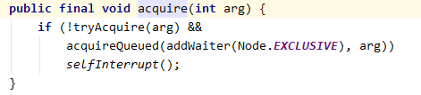
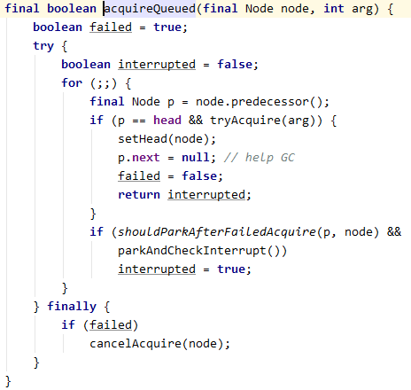
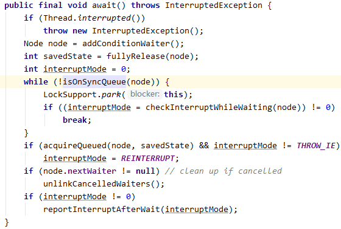

# 1. 竞态条件

什么是竞态条件？它是如何产生的？
**原理分析**
**竞态条件（Race Condition）** 是指多个线程同时访问共享可变资源，最终结果依赖于线程执行的时序和调度顺序，不同运行时机得到不一样的结果。
核心本质：**复合操作不具备原子性**，多线程交替执行产生错乱。
- 多个线程抢着操作同一个共享变量，执行顺序不确定导致结果错乱
- 根源是复合操作不原子，如 `i++` 包含读取、自增、写入三步，可能被其他线程打断

# 2. 锁的类型

Java中有哪些锁的类型？各自的实现原理是什么？
**原理分析**
**1. 乐观锁**
总是假设操作时不会产生并发问题，不上锁。更新时会判断其他线程是否修改过数据：
- **CAS（Compare And Swap）**：CPU原子指令，比较并交换，如 AtomicInteger
- **版本号机制**：数据表加 version 字段，更新时比较版本号，一致则更新、不一致则重试
**2. 悲观锁**
总是假设最坏情况，每次取数据都认为其他线程会修改，所以加锁：
- Java的 synchronized 关键字是典型悲观锁
- MySQL的行锁、表锁等也是悲观锁
**3. 自旋锁**
请求锁的线程没拿到锁时，**不挂起线程**，而是**继续占用处理器执行时间**，使用循环不断尝试获取锁。适用于锁持有时间很短的场景，避免线程切换开销。
**4. 可重入锁**
线程已经获取到锁后，后续方法如果仍需获取锁，可以**直接进入**，不用再等待释放。synchronized 和 ReentrantLock 都是可重入锁。
**5. 公平锁 vs 非公平锁**
- **公平锁**：先到的线程优先获取锁，按 FIFO 顺序，避免饥饿
- **非公平锁**：允许插队，吞吐量更高但可能导致线程饥饿

# 3. AQS的核心原理与实现

AQS的核心原理是什么？它是如何实现锁的？
**原理分析**
**AQS（AbstractQueuedSynchronizer）核心组件：**
1. **state**：`volatile int` 类型同步状态变量，代表共享资源。为0表示锁未被占用，为1表示被占用，支持可重入时递增
2. **Node**：CLH队列节点，存储等待线程及前驱后继引用
3. **CLH队列**：双向 FIFO 等待队列
**state 使用 volatile 的原因：**
- 不加 volatile：线程读取 state 会缓存到寄存器/高速缓存，**看不到其他线程对 state 的最新修改**
- volatile 能**禁止指令重排序**，防止 **state 修改**和 **队列入队/唤醒操作** 顺序被打乱
**Node结构：**
```java
static final class Node {
    volatile int waitStatus;  // 等待状态
    volatile Node prev;       // 前驱节点
    volatile Node next;       // 后继节点
    volatile Thread thread;   // 等待线程
}
```
**获取锁流程（acquire）：**
```java
public final void acquire(int arg) {
    if (!tryAcquire(arg)) {
        acquireQueued(addWaiter(Node.EXCLUSIVE), arg);
    }
}
```
1. `tryAcquire(arg)` - 尝试获取锁（子类实现），一般是判断 state 是否为0，为0则CAS修改 state
2. 失败则 `addWaiter` 创建 Node 加入队列尾部
3. `acquireQueued` 在队列中自旋：
   - 如果当前节点是队首且 `tryAcquire` 成功，出队并返回
   - 否则 **park** 阻塞，等待前驱节点唤醒后继续尝试
**共享锁（acquireShared）：**
- `tryAcquireShared` 返回剩余资源数，负数表示失败，≥0 表示成功
- 资源用完时进入阻塞队列等待，releaseShared 时唤醒
**AQS 两种资源共享方式：**
- **Exclusive（独占）**：只有一个线程能执行，如 ReentrantLock
- **Share（共享）**：多个线程可同时执行，如 Semaphore、CountDownLatch
**自定义同步器需实现的方法：**
- `tryAcquire(int)`：独占方式尝试获取资源
- `tryRelease(int)`：独占方式尝试释放资源
- `tryAcquireShared(int)`：共享方式尝试获取资源
- `tryReleaseShared(int)`：共享方式尝试释放资源
- `isHeldExclusively()`：是否正在独占资源（只有用到 condition 才需要实现）





> 阻塞的线程如何重新获取锁并执行？
如果线程获取锁失败，会加入到阻塞队列尾部并挂起。当已获取锁的线程执行完毕调用 unlock 时，会释放当前线程的锁，并找到阻塞队列中的后继节点，unpark 此线程。该线程由于在 acquireQueued 自旋，被 unpark 后会继续 tryAcquire，成功获取锁后继续执行 lock 后面的代码，依次类推。

# 4. LockSupport的原理与作用

LockSupport 是什么？它的 park/unpark 原理是什么？
**原理分析**
**LockSupport** 是 jdk 中用于 lock 的一个工具类，主要用途是**无条件暂停线程和恢复线程运行**：
- **实现原理**：通过调用 Unsafe 类中的 park 和 unpark 方法，两个方法都是 native 方法
- **park()**：暂停当前线程，直到被 unpark
- **unpark(thread)**：恢复指定线程
**LockSupport 的特点：**
1. **不需要先获取锁**：与 Object.wait/notify 不同，park/unpark 不需要在 synchronized 块中调用
2. **unpark 可以先于 park 调用**：如果 unpark 先调用，后续的 park 不会阻塞
3. **AQS 内部大量使用** LockSupport 来实现线程的阻塞和唤醒
4. **与中断兼容**：park 不会抛出 InterruptedException，但会响应中断

# 5. ReentrantLock的公平锁与非公平锁

ReentrantLock的公平锁和非公平锁有什么区别？各自的实现原理？
**原理分析**
**公平锁和非公平锁的区别：**
| 特性 | 公平锁 | 非公平锁 |
|-----|-------|---------|
| 等待队列 | FIFO，先到先得 | 允许插队 |
| 吞吐量 | 较低 | 较高 |
| 实现 | `hasQueuedPredecessors()` 检查前驱 | 直接 CAS |
**非公平锁优势：**
1. **减少线程切换开销**：持有锁的线程释放后可直接继续执行
2. **减少阻塞/唤醒开销**：线程保持运行状态
3. **吞吐量更高**：允许插队让锁的利用率更高
**实现细节：**
```java
// 非公平锁在调用 lock 后，首先就会调用 CAS 进行一次抢锁
final boolean nonfairTryAcquire(int acquires) {
    Thread current = Thread.currentThread();
    int c = getState();
    if (c == 0) {
        if (compareAndSetState(0, acquires)) {
            setExclusiveOwnerThread(current);
            return true;
        }
    }
    // 可重入逻辑
    if (current == getExclusiveOwnerThread()) {
        int nextc = c + acquires;
        setState(nextc);
        return true;
    }
    return false;
}
```
非公平锁 CAS 失败后，进入 tryAcquire 方法；如果 state == 0，**非公平锁会直接 CAS 抢锁**，而**公平锁会判断等待队列是否有线程在等待，有则排到后面**。
**适用场景：**
- **公平锁**：需要严格 FIFO 顺序、避免线程饥饿、资源分配需要确定性
- **非公平锁**：默认选择，吞吐量优先的通用场景

# 6. Lock 的常用 API

ReentrantLock 提供了哪些获取锁的方式？有什么区别？
**原理分析**
**1. lock()**
获取锁，如果锁已被其他线程获取则等待，直到获取成功。**不响应中断**。
**2. tryLock()**
尝试获取锁，立即返回。获取成功返回 true，失败返回 false。**不会等待**。
```java
Lock lock = new ReentrantLock();
if (lock.tryLock()) {
    try {
        // 处理任务
    } finally {
        lock.unlock();
    }
} else {
    // 做其他事情
}
```
**3. tryLock(long time, TimeUnit unit)**
在指定时间内尝试获取锁，超时返回 false。**可响应中断**。
**4. lockInterruptibly()**
获取锁时能够**响应中断**。如果线程在等待锁过程中被 interrupt()，会抛出 InterruptedException。
```java
public void method() throws InterruptedException {
    lock.lockInterruptibly();
    try {
        // ...
    } finally {
        lock.unlock();
    }
}
```
**注意**：当一个线程获取了锁之后，`interrupt()` 方法不能中断正在运行的过程，只能中断**阻塞中**的线程。

# 7. ReadWriteLock读写锁与写锁饥饿

ReadWriteLock 的读锁和写锁有什么区别？写锁饥饿问题如何解决？
**原理分析**
**读写锁特点：**
- **读锁**：共享锁，多个线程可同时持有
- **写锁**：独占锁，只有一个线程持有
- **读写互斥**：读和写不能同时进行
- **写写互斥**：写和写也不能同时进行
**ReadWriteLock 接口：**
```java
public interface ReadWriteLock {
    Lock readLock();
    Lock writeLock();
}
```
JDK 唯一实现是 `ReentrantReadWriteLock`。
**线程获取读锁的前提：**
- 没有其他线程持有写锁（允许有读锁）
- 在获取写锁的内部可以获取读锁（用于**锁降级**）
**线程获取写锁的前提：**
- 没有其他线程持有读锁或写锁
**读写锁的三个特性：**
1. 支持公平锁和非公平锁，默认非公平锁
2. **读锁和写锁都是可重入锁**
3. 支持**锁降级**（写锁→读锁），不支持锁升级（读锁→写锁）
**写锁饥饿问题：**
当大量读线程持有锁时，写线程可能长期无法获取锁。
**解决方案：**
1. **JDK8 StampedLock**：读不阻塞写，发生写时重读
2. **使用公平锁**：`new ReentrantReadWriteLock(true)` 按 FIFO 分配
> 为什么不支持锁升级？
如果两个读线程都想升级为写锁，会导致**死锁**。而且升级期间没有写线程执行，升级的意义不大。

# 8. StampedLock的乐观读模式

StampedLock 的乐观读是什么？它是如何工作的？
**原理分析**
**StampedLock 的三种模式：**
1. **写模式**：独占锁
2. **乐观读模式**：不获取锁，尝试读取
3. **读模式**：共享锁
**StampedLock 与 ReentrantReadWriteLock 的区别：**
| 特性 | ReentrantReadWriteLock | StampedLock |
|-----|----------------------|-------------|
| 乐观读 | 不支持 | 支持 |
| 锁升级 | 不支持 | 支持 |
| 公平性 | 支持 | 不支持 |
| 读写互斥 | 互斥 | 读不阻塞写 |
**乐观读流程：**
```java
public class Point {
    private final StampedLock sl = new StampedLock();
    double distanceFromOrigin() {
        long stamp = sl.tryOptimisticRead();
        double result = x * x + y * y;
        if (!sl.validate(stamp)) {
            // 乐观读失败，升级为读锁
            stamp = sl.readLock();
            try { result = x * x + y * y; }
            finally { sl.unlockRead(stamp); }
        }
        return result;
    }
}
```
**validate 检查原理：**
```java
public boolean validate(long stamp) {
    return (stamp & SBITS) == (getState() & SBITS);
}
```
执行写操作后 stamp 会改变，validate 返回 false，此时升级为读锁重新读取。
**StampedLock 内部使用 CLH 自旋锁**：
- 如果读失败，不立即挂起读线程，使用自旋重试
- 所有申请锁但没有成功的线程记录到一个等待队列中
- 每个节点保存 locked 标志位，线程循环判断前序节点是否已释放锁
- 自旋一定次数后前序节点仍未释放，则挂起
> 为什么 StampedLock 性能更好？
1. **乐观读不需要加锁**，没有线程阻塞
2. **读多写少场景下**，避免了大量读锁竞争
3. **验证失败时才升级为读锁**，开销较小

# 9. Condition的await与signal原理

Condition 的 await 和 signal 原理是什么？它与 Object 的 wait/notify 有什么区别？
**原理分析**
**Condition 核心原理：**
- Condition 内部维护一个**条件队列**（Condition Queue），存放等待 signal 信号的线程
- AQS 维护一个**同步队列**（Sync Queue），存放等待锁资源的线程
- **每个线程在同一时刻只会存在于其中一个队列**
**await 流程：**
```java
public final void await() throws InterruptedException {
    Node node = addConditionWaiter();    // 1. 将当前线程加入条件队列
    int savedState = fullyRelease(node); // 2. 释放当前线程持有的锁
    while (!isOnSyncQueue(node)) {       // 3. 检查是否已转移到同步队列
        LockSupport.park(this);          // 4. 挂起
    }
    acquireQueued(node, savedState);     // 5. 重新竞争锁
}
```
**signal 流程：**
```java
public final void signal() {
    Node first = firstWaiter;
    if (first != null) doSignal(first);  // 唤醒条件队列头节点
}
private void doSignal(Node first) {
    do {
        firstWaiter = first.nextWaiter;
        if (firstWaiter == null) lastWaiter = null;
    } while (!transferForSignal(first)   // 移到同步队列
             && (first = firstWaiter) != null);
}
```
**节点在两个队列间转移的完整流程：**
1. 线程1调用 `reentrantLock.lock()` → 加入 AQS 同步队列
2. 线程1调用 `condition.await()` → 从同步队列移除（释放锁），加入条件队列，挂起
3. 线程2获取锁 → 加入同步队列
4. 线程2调用 `condition.signal()` → 将条件队列头节点转移到同步队列尾部（此时线程1仍挂起）
5. 线程2调用 `reentrantLock.unlock()` → 释放锁，唤醒同步队列中线程1
6. 线程1被唤醒，继续 tryAcquire 获取锁，成功后从 await 返回继续执行
**与 Object.wait/notify 的区别：**
| 特性 | Object.wait/notify | Condition.await/signal |
|-----|---------------------|----------------------|
| 绑定 | 与 synchronized 绑定 | 与 Lock 绑定 |
| 数量 | 单一 waitSet | 可创建**多个 Condition** |
| 超时等待 | wait(long) | await(long, TimeUnit) |
| 中断响应 | 会抛异常 | 支持 |
| 底层 | JVM 级 | AQS 框架实现 |
> signal 和 signalAll 的区别？
- **signal**：唤醒条件队列中**第一个**非 CANCELLED 节点线程
- **signalAll**：唤醒条件队列中**全部**非 CANCELLED 节点线程
> 为什么 Condition 的 await/signal 必须在 lock 和 unlock 之间调用？
因为 await 会释放锁，signal 需要持有锁才能操作条件队列。不持有锁时操作条件队列会产生线程安全问题。



# 10. Semaphore信号量

Semaphore 的原理是什么？它可以用于哪些场景？
**原理分析**
**Semaphore 核心：**
- 维护一个**计数器（permits）**，代表可用资源数
- **acquire()**：消耗一个许可，没有则等待
- **release()**：归还一个许可
**实现原理（基于 AQS 共享模式）：**
```java
abstract static class Sync extends AbstractQueuedSynchronizer {
    final int tryAcquireShared(int reduces) {
        for (;;) {
            int available = getState();
            int remaining = available - reduces;
            if (remaining < 0 || compareAndSetState(available, remaining))
                return remaining;
        }
    }
    protected final boolean tryReleaseShared(int releases) {
        for (;;) {
            int current = getState();
            int next = current + releases;
            if (compareAndSetState(current, next))
                return true;
        }
    }
}
```
**Semaphore vs 限流算法：**
- Semaphore 是"令牌桶"的简化实现，直接限制并发数
- 令牌桶可按固定速率生成令牌，Semaphore 无法精确控制速率
**应用场景：**
```java
class Pool {
    private final Semaphore permits = new Semaphore(10);
    public void execute(Runnable task) throws InterruptedException {
        permits.acquire();
        try { task.run(); }
        finally { permits.release(); }
    }
}
```
> 如何实现公平 Semaphore？
通过构造函数 `new Semaphore(permits, true)`，公平模式下会检查队列中是否有更早的等待者。

# 11. 锁的公平性与性能权衡

为什么非公平锁性能更好？什么场景需要用公平锁？
**原理分析**
**非公平锁性能好的原因：**
1. **减少上下文切换**：当前持有锁的线程释放后可以直接继续执行，无需唤醒等待线程
   - 非公平：线程A释放 → 线程A继续执行 → 线程B等待
   - 公平：线程A释放 → 线程B获取 → 线程A重新竞争
2. **减少阻塞/唤醒开销**：线程保持运行状态，不需要 park/unpark
3. **提高吞吐量**：允许插队让锁的利用率更高
**公平锁的适用场景：**
1. **需要确定性**：如 FIFO 顺序处理
2. **防止线程饥饿**
3. **资源分配需要严格公平**
> 如何在代码中避免锁饥饿？
1. 使用公平锁
2. 使用 **StampedLock** 代替 ReentrantReadWriteLock（避免写锁饥饿）

# 12. 锁的升级与降级

锁是否可以降级？synchronized 和 Lock 的升降级机制分别是怎样的？
**原理分析**
**synchronized 锁升级（单向不可逆）：**
```
偏向锁 → 轻量级锁 → 重量级锁（单向，不允许降级）
```
- **偏向锁**：同一线程反复进入同步块时，不需要 CAS 操作，只需要替换 ThreadID
- **轻量级锁**：偏向锁被其他线程访问时升级为轻量级锁，通过 CAS 和自旋避免阻塞
- **重量级锁**：自旋超过一定次数或有第三个线程竞争时升级，线程阻塞，依赖 OS 的 Mutex Lock
**ReentrantLock 的锁降级：**
ReentrantLock 不支持真正的锁降级。但 ReadWriteLock 支持写锁降级为读锁（锁降级）：
```java
// 写锁降级为读锁
void process() {
    rwLock.writeLock().lock();
    try {
        // 写操作
        rwLock.readLock().lock(); // 降级为读锁
    } finally {
        rwLock.writeLock().unlock(); // 释放写锁
    }
    try {
        // 继续读取
    } finally {
        rwLock.readLock().unlock();
    }
}
```
锁降级的目的是**提高并发性能**：写完后立即降级为读锁，其他读线程不会被阻塞，同时避免写锁释放后其他写线程插队导致脏读。
**StampedLock 支持降级：**
```java
long stamp = lock.writeLock();
long readStamp = lock.tryConvertToReadLock(stamp); // 写锁转读锁
if (readStamp != 0) {
    lock.unlockRead(readStamp);
} else {
    lock.unlockWrite(stamp);
}
```
> 为什么 synchronized 不支持锁降级？
1. **性能考虑**：降级需要额外开销，可能很快又需要升级
2. **实现复杂性**：降级涉及复杂的状态判断
3. **HotSpot 设计策略**：一旦升级就不再降级，避免额外复杂性

# 13. 可重入锁的可重入次数限制

ReentrantLock 的重入次数有上限吗？如果达到上限会怎样？
**原理分析**
**重入次数上限：**
```java
// ReentrantLock 使用 int 类型存储 state
private volatile int state;
// state 最大值为 Integer.MAX_VALUE（约 21 亿次）
```
**溢出保护：**
```java
protected final boolean tryAcquire(int acquires) {
    Thread current = Thread.currentThread();
    int c = getState();
    int nextc = c + acquires;
    if (nextc < 0)  // overflow
        throw new Error("Maximum lock count exceeded");
}
```
**为什么设置 Integer.MAX_VALUE 上限？**
- int 是最自然的同步状态存储方式
- 使用 long 会增加 CAS 开销（32位系统不支持 long 的 CAS）
- 21亿次重入在实际应用中**不可能达到**

# 14. 死锁的检测与预防

Java 中如何检测和预防死锁？
**原理分析**
**死锁四个必要条件（Coffman 条件）：**
1. **互斥条件**：资源独占
2. **占有并等待**：持有资源同时等待其他资源
3. **不可抢占**：资源不能被强制夺取
4. **循环等待**：形成资源等待环
**检测工具：**
```bash
jstack <pid>         # JStack 检测死锁
jconsole             # 可视化管理工具
```
**预防策略：**
1. **固定加锁顺序**（破坏循环等待）：
```java
void transfer() {
    int hash1 = System.identityHashCode(lock1);
    int hash2 = System.identityHashCode(lock2);
    if (hash1 < hash2) {
        synchronized (lock1) { synchronized (lock2) { } }
    } else {
        synchronized (lock2) { synchronized (lock1) { } }
    }
}
```
2. **tryLock 超时获取**（破坏不可抢占）：
```java
if (!lock1.tryLock(1000, TimeUnit.MILLISECONDS)) return;
try {
    if (!lock2.tryLock(1000, TimeUnit.MILLISECONDS)) return;
} finally { lock2.unlock(); }
finally { lock1.unlock(); }
```
3. **减少持有锁时间**：缩小同步块范围
4. **使用 Lock 替代 synchronized**：tryLock 可超时回退
> 活锁与死锁的区别？
- **死锁**：线程无法继续执行（相互等待，线程状态为 BLOCKED）
- **活锁**：线程在不断执行但无法前进（总是互相让步，线程状态为 RUNNABLE）
解决活锁：**增加随机等待或回退机制**，打破对称性
