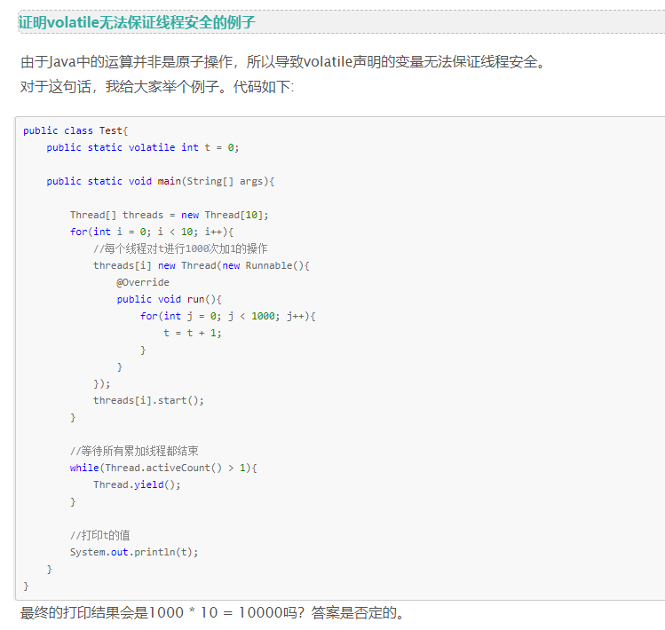
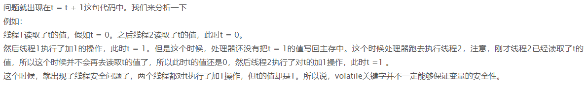
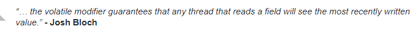
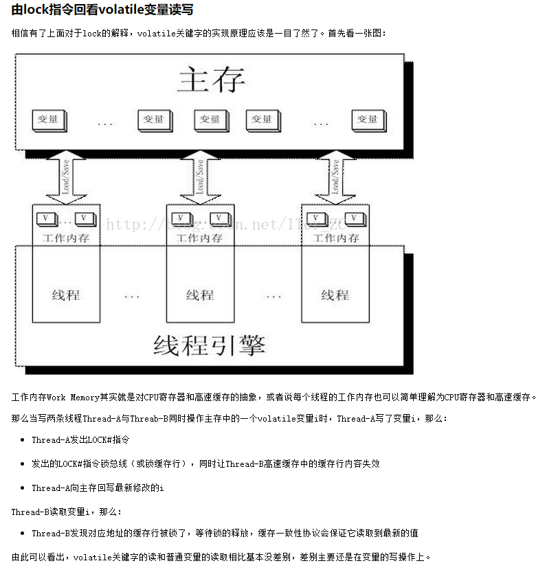
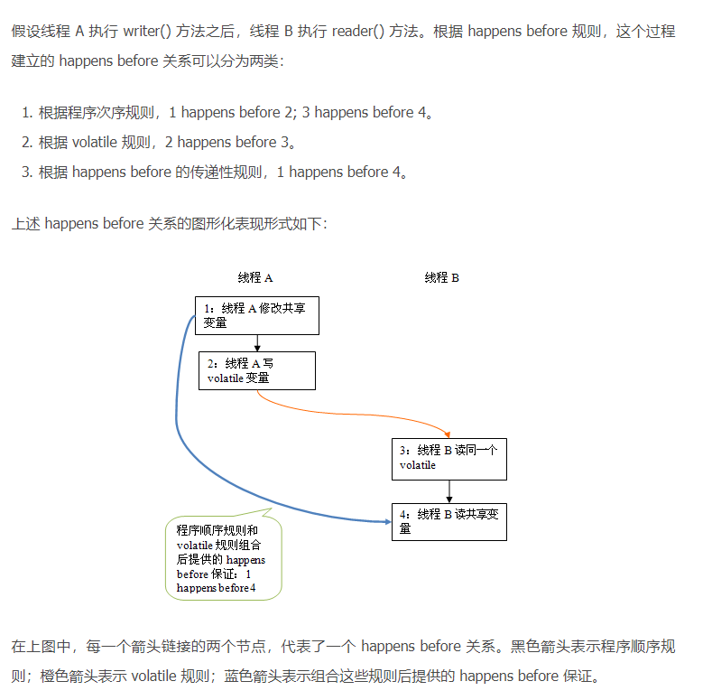
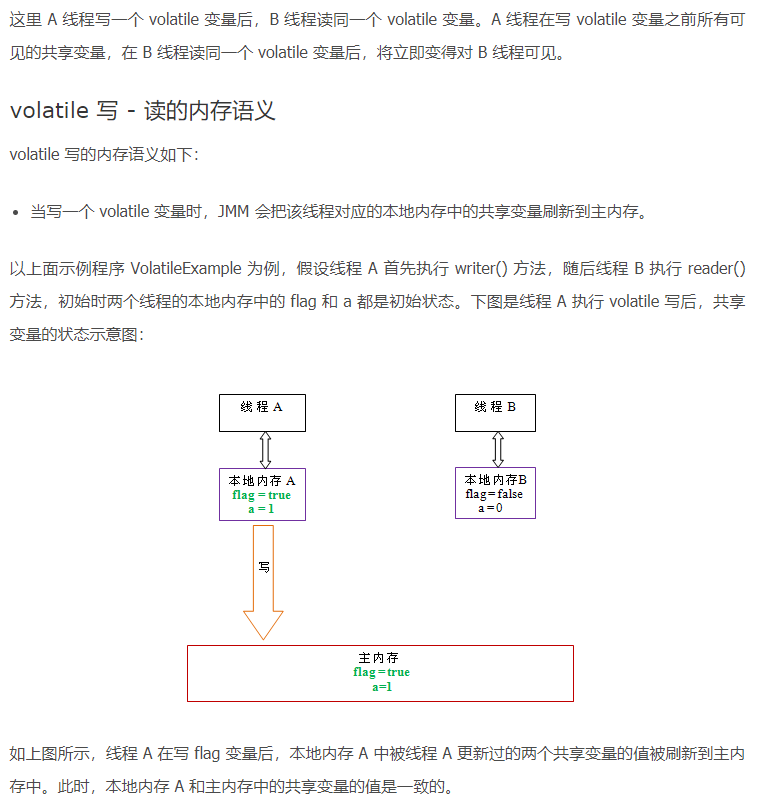
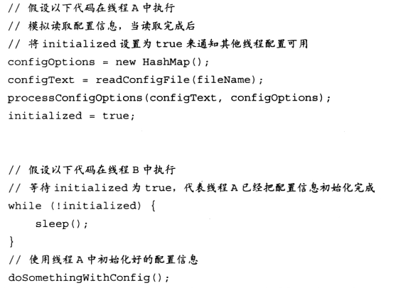
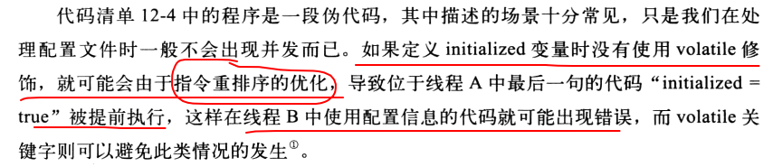

# 1. volatile的底层实现原理

volatile的底层实现原理是什么？它是如何保证可见性和有序性的？
**原理分析**
**底层实现：**
volatile使用**lock**前缀指令（x86架构）实现，汇编层面会生成以下指令：
```asm
movl %eax, [%ebx]  ; 写操作
lock addl $0, 0(%esp)  ; lock前缀指令
```
**字节码层面：** volatile使用**ACC_VOLATILE**访问标志标记变量，供后续操作此变量时判断是否遵循volatile语义处理。
**lock指令的作用：**
1. **锁总线/缓存锁**：阻止其他CPU访问该内存地址
2. **缓存一致性**：将其他CPU缓存中的该地址数据标记为无效（Invalid）
3. **内存屏障**：防止指令重排序
**可见性实现：**
```
线程A写入volatile变量
    ↓
lock指令执行
    ↓
CPU发送RFO (Request For Ownership) 消息给其他CPU
    ↓
其他CPU将缓存中的变量标记为无效
    ↓
线程B读取时发现缓存无效，从主存重新加载
```





**性能影响：**
- volatile写比普通变量慢，因为需要插入内存屏障指令，阻止处理器乱序执行
- 在x86架构下开销相对较小（约比普通变量慢2-3倍），在ARM等架构下更大
- 读操作性能与普通变量几乎没有差别



# 2. Happens-Before规则与volatile的有序性保证

什么是Happens-Before规则？volatile如何利用Happens-Before保证有序性？
**原理分析**
**JMM（Java Memory Model）中的Happens-Before：**
Happens-Before是JMM定义的偏序关系，约束了操作间的可见性和执行顺序。
**8条规则：**
1. **程序顺序规则**：同一线程中，前面的操作Happens-Before后面的操作
2. **监视器锁规则**：解锁操作Happens-Before后续的加锁操作
3. **volatile变量规则**：**volatile写Happens-Before后续的volatile读**
4. **线程启动规则**：`Thread.start()`Happens-Before被启动线程的任何操作
5. **线程终止规则**：线程所有操作Happens-Before其他线程检测到终止
6. **中断规则**：`interrupt()`Happens-Before被中断线程检测到中断
7. **终结规则**：构造函数Happens-Before`finalize()`
8. **传递性**：A Happens-Before B，B Happens-Before C → A Happens-Before C
**volatile变量规则详解：**
英文原文：*A write to a volatile field happens-before every subsequent read of that same field.*
- 这条规则确保：**对一个volatile变量的写操作如果发生于读之前**，JVM保证写操作先完成，随后的读可以读到最新值
- 不仅volatile变量本身可见，线程1写入volatile变量**之前的写操作**都对线程2可见
- 前提是写发生在读之前，它描述的是可见性问题，而不是说写一定发生在读之前




（如果a=1发生在读a之前，那么读a的时候一定能读到a=1）


**volatile的有序性保证：**
```java
// 线程A
volatile boolean flag = true;
volatile int x = 1;
// 线程B
if (flag) {
    int y = x; // 一定能读到x=1
}
```
根据**volatile变量规则**：
- 线程A的`flag = true` Happens-Before `x = 1`
- 线程B的读取 Happens-Before `x` 的读取
- 传递性：线程A写 Happens-Before 线程B读
> Happens-Before是因果关系还是时间先后？
Happens-Before是Java内存模型定义的**偏序关系**，不是实际的时间先后。它定义了**如果A Happens-Before B，Java平台必须保证A的执行结果对B可见**。

# 3. volatile与synchronized的区别

volatile和synchronized有什么区别？它们能互相替代吗？
**原理分析**
**区别对比：**
| 特性 | volatile | synchronized |
|-----|---------|-------------|
| 可见性 | ✓ | ✓ |
| 原子性 | ✗ | ✓ |
| 有序性 | ✓（部分） | ✓ |
| 阻塞 | ✗ | ✓（阻塞） |
| 性能 | 较低 | 较高（需竞争锁） |
**volatile适用场景：**
```java
// 标志位：单一变量的读写
volatile boolean flag = false;
// 场景1：状态标志
class A {
    volatile boolean initialized = false;
    public void init() {
        initialized = true;
    }
    public void process() {
        while (!initialized) {
            // 等待初始化完成
        }
    }
}
```
**volatile不适用场景：**
```java
// 场景2：复合操作（非原子）
volatile int count = 0;
count++; // 包含读取、修改、写入，非原子
// 场景3：先检查后执行
if (obj != null) {
    obj.doSomething(); // 非原子操作
}
```
> volatile能否保证复合操作的原子性？
不能。**`i++`、`count++`、`list.add()`等复合操作都不是原子的**。volatile只保证单次读/写的原子性，不保证"读-改-写"的原子性。
**volatile能保证线程安全的两个条件：**
在同时满足以下两个条件时，volatile可以保证线程安全：
1. **运算结果不依赖变量的当前值**，或者能够确保只有单一的线程修改变量的值
2. **变量不需要与其他状态变量共同参与不变约束**

# 4. volatile的缓存行伪共享问题

volatile变量是否存在缓存行伪共享问题？如何优化？
**原理分析**
**缓存行伪共享原理：**
CPU缓存以缓存行为单位（通常**64字节**），同一缓存行可能被不同核心的变量共享。
```java
class Data {
    volatile long a;
    volatile long b;
}
// 假设a和b在同一缓存行
// 核心1修改a → 缓存行失效 → 核心2读取b也需要从主存加载
```
**性能影响：**
- 单核修改导致其他核缓存失效
- 频繁跨核通信，性能下降
**解决方案：**
1. **字节填充（手动）**
2. **JDK 8+ @Contended注解**
```java
@sun.misc.Contended
class Counter {
    volatile long value;
}
```
> @Contended注解的原理？
注解会指示JVM在对象布局中插入填充字节，使被注解的字段独占缓存行。需添加JVM参数**-XX:-RestrictContended**才能生效。

# 5. volatile的实现：Lock指令与内存屏障详解

volatile的lock指令具体做了什么？内存屏障如何工作？
**原理分析**
**Lock指令在x86下的行为：**
```asm
; 原始操作
movq %rax, [%rdi]  ; 写操作
; 实际生成的指令
lock movq %rax, [%rdi]  ; lock前缀
```
**Lock指令的3个核心作用：**
1. **缓存锁定（Cache Locking）**
   - 当操作的数据在缓存中时，修改缓存行并标记为M（Modified）
   - 发送Invalidate消息到其他CPU
2. **缓存一致性协议（MESI）**
   - 其他CPU将共享状态的缓存行置为I（Invalid）
   - 读操作时从持有者获取或从主存加载
3. **内存屏障（Memory Barrier）**
   - 阻止指令重排序
   - 刷新Store Buffer到主存
**Lock指令的历史演进：**
- **早期CPU**：锁总线方式，遇到Lock指令就由仲裁器选择一个核心独占总线，其他CPU不能与内存通讯
- **P6之后**：改用Ringbus + MESI协议（Cache Locking），数据已被CPU缓存且要写回主存时用缓存锁，否则仍锁总线
**MESI缓存一致性协议详解：**
每个CPU核心有自己的高速缓存（L1/L2），MESI控制缓存行状态：
- **M Modified（已修改）**：缓存值跟主存不一样，脏了
- **E Exclusive（独占）**：只有自己有，和主存一致
- **S Shared（共享）**：多个核心都有这份数据，都一致
- **I Invalid（已失效）**：缓存数据作废，必须重新读主存
**MESI工作流程：**
1. 线程A在CPU1修改变量
2. CPU1缓存行变为**M**
3. 广播通知其他核心：你们的缓存**失效（I）**
4. 其他CPU再读时发现是I状态，必须**重新从主存加载**
**可见性保证流程：**
```
CPU0: volatile write x = 1
    ↓
    lock指令执行
    ↓
    修改本地缓存中x所在缓存行(M状态)
    ↓
    发送Invalidate(x)给其他CPU
    ↓
    等待Ack（确保其他CPU收到）
    ↓
    刷新到主存
CPU1: volatile read x
    ↓
    检测到x的缓存行已失效
    ↓
    发送Read(x)请求
    ↓
    从CPU0或主存获取最新值
```





**内存屏障（Memory Barrier）：**
内存屏障是一组处理器指令，用于**禁止指令重排序、控制缓存读写顺序**。CPU和编译器为了优化性能会乱序执行指令（指令重排），内存屏障就像一堵墙，**墙两边的代码不允许互相穿插、颠倒顺序**。
**JMM定义的4种内存屏障：**
1. **LoadLoad屏障**：前面普通读 → 后面普通读，保证前面读完再执行后面读
2. **StoreStore屏障**：前面普通写 → 后面普通写，保证前面写先落地再后面写
3. **LoadStore屏障**：前面读 → 后面写，禁止颠倒
4. **StoreLoad屏障（最强、开销最大）**：前面写 → 后面读，写强制刷入主存、读强制从主存加载。volatile写后面必加这个
**硬件层面内存屏障：**
- **lfence（Load Barrier）**：在**读指令前**插入，让高速缓存失效，重新从主存加载
- **sfence（Store Barrier）**：在**写指令之后**插入，让写入缓存的最新数据写回到主存
- **mfence**：全屏障，具备lfence和sfence能力
- **Lock前缀**：不是内存屏障但能完成类似功能，先对高速缓存加锁再执行指令，释放锁后刷新缓存到主存
**x86平台特殊优化：**
x86遵循TSO模型，除StoreLoad外其余Barrier均不需显式指令。HotSpot VM选择**LOCK指令**作为StoreLoad屏障，OpenJdk源码中`membar()`方法对MP（多处理器）环境使用`lock addl`实现。

# 6. volatile的读写语义与重排序规则

volatile的读和写的语义是什么？禁止重排序的具体规则有哪些？
**原理分析**
**volatile读写语义：**
| 操作 | 语义 |
|-----|------|
| **volatile读** | 获取前一个volatile写的结果，禁止重排序 |
| **volatile写** | 确保之前的操作全部完成，禁止重排序 |
**volatile禁止重排序的3个场景：**
1. **第二个操作是volatile写**，不管第一个操作是什么都不会重排序
2. **第一个操作是volatile读**，不管第二个操作是什么都不会重排序
3. **第一个操作时volatile写，第二个操作时volatile读**，也不会发生重排序
**读写语义示例：**
```java
class VolatileExample {
    int a = 0;
    volatile int b = 0;
    public void writer() {
        a = 1;      // ①
        b = 2;      // ② volatile写
    }
    public void reader() {
        int y = b;  // ③ volatile读
        int x = a;  // ④
        // y一定是2，x一定是1
    }
}
```
**与普通变量的重排序：**
```java
// volatile写不能与后续的普通写重排序
volatile int v;
int a;
v = 1;  // 不允许重排到 a = 2 之后
a = 2;
// volatile读不能与之前的普通读重排序
int a;
volatile int v;
int b = a;  // 不允许重排到 v = 1 之前
v = 1;
```
> volatile double/long类型是否安全？
在JSR-133（Java 5+）之后，volatile保证**double/long的读写原子性**。x86架构下一次内存操作即可完成64位读写，即使在某些需要分两次32位操作的处理器上，JVM也会通过锁机制保证原子性。

# 7. volatile与CPU内存模型的关系

Java的volatile如何与CPU的内存模型交互？两者是什么关系？
**原理分析**
**CPU内存模型（从强到弱）：**
| 模型 | 特点 | 代表CPU |
|-----|------|-------|
| 顺序一致性 | 仿佛单核，指令不重排序 | - |
| TSO | 允许Store-Load重排序 | **x86/x64** |
| PSO | 允许更多重排序 | SPARC |
| RMO | 几乎不保证顺序 | ARM, PowerPC |
**Java内存模型（JMM）：**
JMM是语言层面的抽象，定义了一套规则来屏蔽硬件差异，使Java程序在所有平台上表现一致。
```
Java代码 → JMM规则 → 硬件相关内存访问
```
**volatile在x86下的优化：**
x86的TSO模型对volatile已经比较友好：
- Store-Load不能重排（x86禁止）
- volatile写后的普通读写可能被重排
但JMM要求更严格：
- 禁止所有**volatile写后的操作**重排序
- 禁止所有**volatile读前的操作**重排序
因此JVM在x86下仍需插入内存屏障。
> 为什么x86的TSO模型不需要StoreLoad屏障？
x86的**mfence**指令成本很高。TSO通过Store Buffer的"写读顺序"保证来避免显式的StoreLoad屏障：
- Store Buffer必须按顺序刷新
- 读操作先检查Store Buffer再检查缓存

# 8. volatile在DCL单例模式中的应用

单例模式中volatile的作用是什么？为什么需要volatile？
**原理分析**
**双重检查锁定（Double-Checked Locking）：**
```java
class Singleton {
    private static volatile Singleton instance;
    public static Singleton getInstance() {
        if (instance == null) {
            synchronized (Singleton.class) {
                if (instance == null) {
                    instance = new Singleton();
                }
            }
        }
        return instance;
    }
}
```
**问题分析（没有volatile）：**
`instance = new Singleton()` 实际分为3步：
```
1. 分配内存
2. 调用构造函数初始化
3. 将引用赋值给instance
```
**可能的问题：** 步骤2和3可能重排序
```
线程A                          线程B
instance = new Singleton();
  ↓
1. 分配内存
  ↓
3. instance = 引用    ← 可能先执行
  ↓
2. 初始化
                            if (instance != null)
                            return instance  // 未初始化完成！
```
> 为什么要用volatile而不是直接加synchronized？
synchronized可以，但性能差：
- 每次`getInstance()`都需要获取锁
- 而volatile+DCL只需要第一次检查时加锁，之后无需加锁

# 9. volatile修饰数组的问题

volatile修饰数组和volatile修饰数组元素有什么区别？
**原理分析**
**两种情况：**
```java
volatile int[] arr;           // 数组引用volatile，元素不volatile
volatile int[] arr2 = {1,2}; // 数组整体volatile
int[] volatileArr = arr;     // 读取的是arr引用的值
arr[0] = 1;                  // 写入的是数组元素，不volatile
```
**区别：**
```java
volatile int[] arr = new int[10];
// arr是volatile
arr = new int[20];  // volatile写，引用的改变对其他线程可见
// arr[i]不是volatile
arr[0] = 1;         // 元素修改不保证对其他线程可见
```
**正确做法：**
```java
// 方案1：使用AtomicIntegerArray
AtomicIntegerArray arr = new AtomicIntegerArray(10);
arr.set(0, 1);  // 原子操作
// 方案2：使用volatile包装的引用+volatile数组
class VolatileArrayWrapper {
    volatile int[] array;
    public void set(int index, int value) {
        array[index] = value;
    }
}
```
> 为什么volatile数组元素不是原子的？
数组元素的操作需要：
1. 根据索引计算内存地址（数组起始地址 + 偏移量）
2. 写入值
这两步不能原子完成。**volatile只保证值本身的读写原子性，不保证计算过程**。
**volatile修饰引用类型：**
volatile保证引用的可见性，但**不保证引用内容的可见性**。当多个线程访问volatile引用时，引用本身是最新的，但引用指向的对象内部的字段不保证可见。

# 10. volatile与final的组合使用

volatile和final能一起使用吗？有什么特殊规则？
**原理分析**
**final与volatile的兼容性：**
```java
// 合法
final volatile int a = 1;
final volatile Object obj = new Object();
```
**规则：**
1. final字段本身是线程安全的（构造函数完成前不能被this引用逃逸）
2. final + volatile 组合提供额外的保证
** Happens-Before规则：**
- 构造函数完成 Happens-Before 读取final字段
- final字段的写入 Happens-Before 读取final字段
```java
class SafeImmutable {
    final int x;
    final int y;
    final volatile int z;
    SafeImmutable(int a, int b, int c) {
        x = a;
        y = b;
        z = c;
    }
}
// 线程A
SafeImmutable obj = new SafeImmutable(1, 2, 3);
// 线程B
// 一定能读取到 x=1, y=2, z=3
```
> 不可变对象是否需要volatile？
**结论：不需要，但推荐使用**
原因：
1. **final**保证对象创建后字段不可变
2. 构造函数结束后，this引用不会逃逸（安全发布）
但使用volatile可以：
- 让引用本身可见（obj引用本身）
- 让代码意图更清晰
最佳实践：使用**final + volatile**实现线程安全的不可变对象（如String、AtomicReference）

# 11. JIT优化与volatile：代码外提问题

为什么没有volatile修饰的`while(!flag)`循环会无法退出？JIT做了什么优化？
**原理分析**
**经典问题：**
```java
boolean flag = true;
// 线程A
while (flag) {
    // 无限循环，即使线程B修改flag为false也无法退出
}
// 线程B
flag = false;
```
**很多人错误的理解：** 以为是JVM主存模型问题——while执行速度太快，修改flag来不及刷主存。
**真正原因：JIT代码外提（Code Hoisting）**
JIT编译器在编译热点代码时，发现`flag`在循环体内没有被修改，就会做优化：
```
优化前：
    while (flag) { ... }
优化后：
    if (flag) { while(true) { ... } }
```
- JIT将`flag`的判断提到循环外面，因为JIT基于**单线程的happen-before关系**做优化
- 一旦`if(flag == true)`判断进入while(true)，另一个线程再怎么修改flag也无济于事
- 本质上是**编译器层面的重排序**
**volatile如何解决：**
- volatile告诉编译器**禁止对该变量做任何重排序优化**
- volatile阻止了JIT将flag判断外提（代码外提）
- 线程B修改flag时，volatile保证修改立即对其他线程可见
> volatile禁止重排序能解决什么层面的问题？
重排序有两种：**编译器层面**和**处理器层面**。volatile标记解决编译器层面的可见性与重排序问题，内存屏障则解决硬件层面的可见性与重排序问题。

# 12. 单核CPU下需要volatile吗

单核CPU上多线程还需要volatile和synchronized吗？
**原理分析**
**可见性方面：**
- 在单核CPU中，同一进程的不同线程共享CPU缓存，volatile的内存可见特性**意义不大**
- 因为不同线程无需通过主内存通信，都访问同一块物理内存区域
- 但是对于多核CPU，每个核心的缓存相互独立，需要通过主内存通信解决缓存一致性问题，volatile的可见性至关重要
**有序性方面：**
- 单核CPU也会对指令进行重排序（如while true的代码外提场景）
- volatile通过插入读写屏障**禁止volatile变量之间的重排序**
- JMM增强了volatile的语义——严格限制编译器和处理器对volatile变量与普通变量的重排序
**线程安全方面（synchronized vs volatile）：**
- synchronized在单核下的**互斥性语义**仍然必要
- 例如`i++`需要三步：读、+1、写，如果A线程在执行+1之后没来得及写，CPU切到B线程执行i++，B完成后切回A，A把之前计算的值写入，会覆盖B的更新
- **除非单核并发不允许抢占式，否则一样会产生线程不安全**
> 总结：单核CPU不需要volatile保证可见性，但仍然需要volatile防止指令重排序，以及synchronized保证互斥。

# 13. 已有缓存一致性协议为什么还需要volatile

MESI（缓存一致性协议）已经能保证缓存一致了，为什么还需要volatile？
**原理分析**
**volatile与MESI隔着多层抽象：**
volatile是Java语言层面的保证，MESI是CPU硬件层面的实现细节，中间要经历**Java编译器、Java虚拟机/JIT、操作系统、CPU核心**多层转换。
**原因1：跨平台——不是所有硬件都支持MESI**
- Java作为跨平台语言，JVM需要提供统一语义
- 有些CPU不支持MESI协议，必须用锁总线或显式fence指令来保证可见性
**原因2：JVM本地内存 ≠ CPU缓存**
- MESI可以解决CPU缓存层面的可见性问题
- volatile解决的是JVM层面的可见性问题（工作内存与主内存的抽象）
**原因3：Store Buffer和Invalidate Queue打破MESI的实时性**
- 由于MESI协议执行成本大，CPU引入**Store Buffer**和**Invalidate Queue**来优化
- 写入数据先进Store Buffer，不直接更新缓存→内存，导致其他核心不能立即看到
- Invalidate Queue暂存失效消息，不立即处理，导致其他核心可能读到过期数据
- 缓存一致性只能保证**最终一致**，不能保证**立刻马上可见**
**原因4：Coherence ≠ Consistency**
- MESI只保证**Coherence（缓存一致性）**：对单个变量的写操作在所有核心上的全局顺序一致
- 但不保证**Consistency（内存一致性）**：对多个变量的操作顺序的一致性没有保证
- 即使有MESI，`x=1; y=2`两个变量之间仍可能被重排序
**原因5：ARM/PowerPC等弱一致性架构**
- ARM和PowerPC架构只保证有依赖关系（控制依赖、数据依赖、地址依赖）的指令顺序
- 对于`x=1; y=2`这种无依赖指令，不保证提交顺序
- volatile编译成ARM/PowerPC能识别的barrier指令，才能按顺序执行
> 总结：volatile是一个高层的抽象意图，MESI只是实现这个抽象的一个底层细节。volatile保证了跨平台的可见性和有序性统一语义，而MESI只是x86等特定架构下的实现手段。
