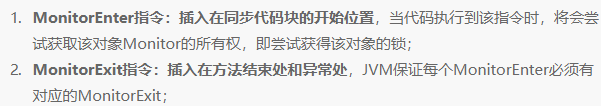
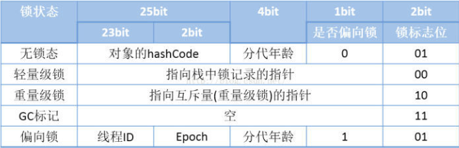
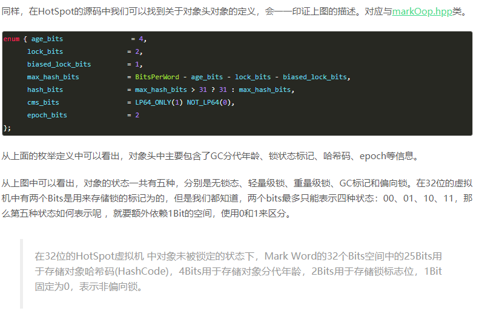
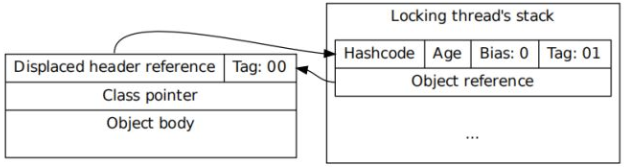
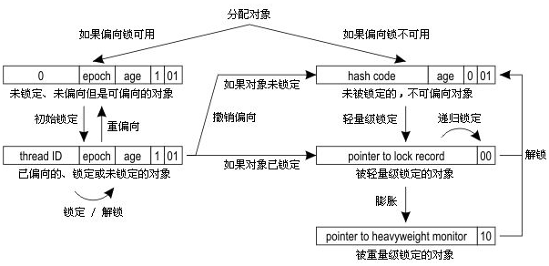
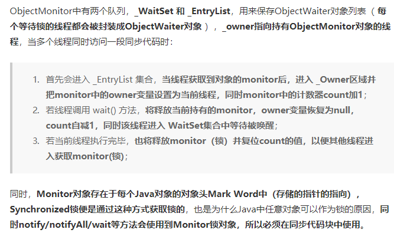
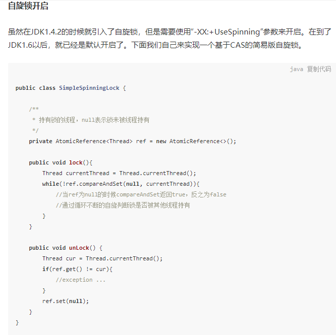
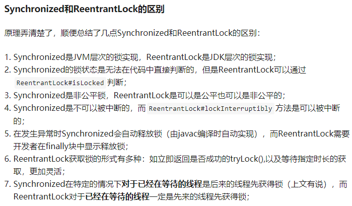

# **1. synchronized 的实现原理是什么？**

synchronized 的底层实现原理是什么？它是怎么保证同步和可见性的？

**synchronized 块：**

javac 在编译时，synchronized 块会生成对应的 **monitorenter** 和 **monitorexit** 指令，分别对应 synchronized 同步块的进入和退出。有两个 monitorexit 指令的原因是：**为了保证抛异常的情况下也能释放锁**，所以 javac 为同步代码块添加了一个隐式的 try-finally，在 finally 中会调用 monitorexit 命令释放锁。

**synchronized 方法：**

javac 为其生成了一个 **ACC_SYNCHRONIZED** 关键字，在 JVM 进行方法调用时，发现调用的方法被 ACC_SYNCHRONIZED 修饰，则会先尝试获得锁。

**内存语义（可见性）：**

synchronized 内存语义进行了分析：当线程获取锁时会从主内存中获取共享变量的最新值，释放锁的时候会将共享变量同步到主内存中。从而，synchronized 具有**可见性**。

在 JVM 底层，对于这两种 synchronized 语义的实现大致相同：



# **2. synchronized锁有几种形式？为什么引入偏向锁和轻量级锁？**

synchronized 的锁有哪几种形式？JDK 1.6 为什么要引入偏向锁和轻量级锁？

**传统锁（重量级锁）：**

传统的锁（也就是下文要说的重量级锁）依赖于系统的同步函数，在 linux 上使用 **mutex 互斥锁**，最底层实现依赖于 **futex**（关于 futex 可以看我之前的文章），这些同步函数都涉及到**用户态和内核态的切换**、进程的上下文切换，成本较高。对于加了 synchronized 关键字但运行时并没有多线程竞争，或两个线程接近于交替执行的情况，使用传统锁机制无疑效率是会比较低的。传统锁一般使用 cpu 硬件提供的 **CMPXCHG + lock** 实现。

**JDK 1.6 前后对比：**

- 在 JDK 1.6 之前，synchronized 只有传统的锁机制，因此给开发者留下了 synchronized 关键字相比于其他同步机制性能不好的印象。
- 在 JDK 1.6 引入了两种新型锁机制：**偏向锁**和**轻量级锁**，它们的引入是为了解决在没有多线程竞争或基本没有竞争的场景下因使用传统锁机制带来的性能开销问题。

在看这几种锁机制的实现前，我们先来了解下**对象头**，它是实现多种锁机制的基础。

# **3. 什么是对象头？Mark Word 的作用是什么？**

什么是对象头？Mark Word 里存了哪些信息？

**对象在内存中的组成：**

Java 对象保存在内存中时，由以下三部分组成：

1. 对象头
2. 实例数据
3. 对齐填充字节

**为什么锁信息存在对象头中：**

Java 中任意对象都可以用作锁，因此必定要有一个映射关系，存储该对象以及其对应的锁信息（比如当前哪个线程持有锁，哪些线程在等待）。如果用全局 map，会有一些问题：

- 需要对 map 做线程安全保障
- 不同的 synchronized 之间会相互影响，性能差
- 当同步对象较多时，该 map 可能会占用比较多的内存

可以将这个映射关系存储在对象头中，因为对象头本身也有一些 hashcode、GC 相关的数据。在 JVM 中，对象在内存中除了本身的数据外还会有个对象头，对于普通对象而言，其对象头中有两类信息：**mark word** 和**类型指针**。另外对于数组而言还会有一份记录数组长度的数据。

类型指针是指向该对象所属类对象的指针，mark word 用于存储对象的 **HashCode、GC 分代年龄、锁状态**等信息。在 32 位系统上 mark word 长度为 32bit，64 位系统上长度为 64bit。为了能在有限的空间里存储下更多的数据，其存储格式是不固定的，在 32 位系统上各状态的格式如下：



**锁信息在 mark word 中的存储：**

当对象状态为偏向锁（biasable）时，mark word 存储的是偏向的线程 ID；当状态为轻量级锁（lightweight locked）时，mark word 存储的是指向线程栈中 **Lock Record** 的指针；当状态为重量级锁（inflated）时，为指向堆中的 monitor 对象的指针。在 Java 虚拟机（HotSpot）中，**Monitor 是由 ObjectMonitor 实现的**，C++ 实现。

**hashCode 与偏向锁的关系：**

升级为偏向锁、轻量级或者重量级锁后，hashcode 会存放到其他地方。

- **偏向锁状态**：
  - 对象刚创建、没执行过 obj.hashCode()，MarkWord 里压根不存 HashCode
  - 一旦主动调用了 hashCode()，会直接废掉偏向锁：对象直接进入无锁 → 跳过偏向锁，直接走轻量级锁，不会再进入偏向锁状态，空间被占满，放不下 HashCode。只要对象生成了 HashCode，就直接禁用偏向锁
- **偏向锁 → 轻量级锁**：JVM 会在当前加锁线程的栈帧中，开辟一块 Lock Record（锁记录），把原对象 MarkWord 完整拷贝进去
- **轻量级锁 → 重量级锁**：
  - 旧的 MarkWord 信息依然保留在线程栈锁记录
  - 对象 MarkWord 改写为：指向 ObjectMonitor 监视器地址 + 重量级锁标记
  - 等锁释放、变回无锁状态时，再回填恢复到对象 Mark Word

**Lock Record：**

Lock Record 是线程私有的数据结构，每一个线程都有一个可用 Lock Record 列表，同时还有一个全局的可用列表。每一个被锁住的对象 Mark Word 都会和一条 Lock Record 关联（对象头的 MarkWord 中的 Lock Word 指向 Lock Record 的起始地址），同时 Lock Record 中有一个 Owner 字段存放拥有该锁的线程的唯一标识（或者 object mark word），表示该锁被这个线程占用。

HotSpot 对对象头的定义如下图：



**内部锁（Monitor）：**

与一切皆对象一样，所有的 Java 对象是天生的 Monitor，每一个 Java 对象都有成为 Monitor 的潜质。因为在 Java 的设计中，每一个 Java 对象自打娘胎里出来就带了一把看不见的锁，它叫做**内部锁**或者 **Monitor 锁**，也就是通常说 Synchronized 的对象锁，MarkWord 锁标识位为 10，其中指针指向的是 Monitor 对象的起始地址。在 Java 虚拟机（HotSpot）中，Monitor 是由 ObjectMonitor 实现的，其主要数据结构（位于 HotSpot 虚拟机源码 ObjectMonitor.hpp 文件，C++ 实现的）见后文「重量级锁」与「Monitor 机制」部分（monitor 其实就是该数据结构的实例，Java 中每个对象都会有一个 monitor）。

**锁升级过程（概览）：**

1. **偏向锁**是指当一段同步代码一直被同一个线程所访问时，即不存在多个线程的竞争时，那么该线程在后续访问时便会自动获得锁，从而降低获取锁带来的消耗，即提高性能。
2. **轻量级锁**是指当锁是偏向锁的时候，却被另外的线程所访问，此时偏向锁就会升级为轻量级锁。
3. 如果轻量级锁的更新操作失败了，虚拟机首先会检查对象的 Mark Word 是否指向当前线程的栈帧，如果是就说明当前线程已经拥有了这个对象的锁，那就可以直接进入同步块继续执行，否则说明多个线程竞争锁。若当前只有一个等待线程，则该线程将通过**自旋**进行等待。但是当自旋超过一定的次数时，轻量级锁便会升级为重量级锁（**锁膨胀**）。另外，当一个线程已持有锁，另一个线程在自旋，而此时又有第三个线程来访时，轻量级锁也会升级为重量级锁（锁膨胀）。

# **4. 重量级锁的实现原理是什么？**

重量级锁是怎么实现的？为什么说它开销大？

重量级锁是我们常说的传统意义上的锁，其利用操作系统底层的同步机制去实现 Java 中的线程同步。

**monitor 对象的关键字段：**

重量级锁的状态下，对象的 mark word 为指向一个堆中 **monitor 对象的指针**。一个 monitor 对象包括这么几个关键字段：**cxq 竞争队列**（下图中的 ContentionList）、**EntryList 入口队列**、**WaitSet**、**owner**。其中 cxq、EntryList、WaitSet 都是由 **ObjectWaiter** 的链表结构，owner 指向持有锁的线程。


**加锁流程：**

1. 当一个线程尝试获得锁时，如果该锁已经被占用，则会将该线程封装成一个 ObjectWaiter 对象插入到 cxq 的队列尾部，然后暂停当前线程。
2. 当持有锁的线程释放锁前，会将 cxq 中的所有元素移动到 EntryList 入口队列中去，并唤醒 EntryList 的队首线程。
3. 尝试获取锁，可能会失败，原因是非公平队列，新线程会首先尝试 **CAS** 获取锁，可能恰好获取成功。

**wait/notify 的状态流转：**

如果一个线程在同步块中调用了 Object#wait 方法，会将该线程对应的 ObjectWaiter 从 EntryList 移除并加入到 WaitSet 中，然后释放锁。当 wait 的线程被 notify 之后，会将对应的 ObjectWaiter 从 WaitSet 移动到 EntryList 中。

**重量级锁的本质（依赖 OS 的 Mutex Lock）：**

- 重量级锁是指当有一个线程获取锁之后，其余所有等待获取该锁的线程都会处于阻塞状态。
- 重量级锁通过对象内部的监视器（monitor）实现，而其中 monitor 的本质是依赖于底层操作系统的 **Mutex Lock（互斥锁）**实现，操作系统实现线程之间的切换需要从**用户态切换到内核态**，切换成本非常高。
- 简言之，就是所有的控制权都交给了操作系统，由操作系统来负责线程间的调度和线程的状态变更。而这样会出现频繁地对线程运行状态的切换，线程的挂起和唤醒，从而消耗大量的系统资源，导致性能低下。

# **5. 轻量级锁的实现原理是什么？**

轻量级锁是怎么加锁、解锁的？

**引入原因：**

在 Java 程序运行时，同步块中的代码都是不存在竞争的，不同的线程交替的执行同步块中的代码。这种情况下，用重量级锁是没必要的。因此 JVM 引入了轻量级锁的概念。

线程在执行同步块之前，JVM 会先在当前的线程的栈帧中创建一个 **Lock Record**，其包括一个用于存储对象头中的 mark word（官方称之为 **Displaced Mark Word**）以及一个指向对象的指针。下图右边的部分就是一个 Lock Record。



**加锁过程：**

1. 在线程栈中创建一个 Lock Record，将其 obj（即上图的 Object reference）字段指向锁对象。
2. 直接通过 **CAS** 指令将 Lock Record 的地址存储在对象头的 mark word 中，如果对象处于无锁状态则修改成功，代表该线程获得了轻量级锁。如果失败，进入到步骤 3。
3. 如果是当前线程已经持有该锁了，代表这是一次锁重入。设置 Lock Record 第一部分（Displaced Mark Word）为 null，起到了一个重入计数器的作用。然后结束。
4. 走到这一步说明发生了竞争，需要膨胀为重量级锁。

**解锁过程：**

1. 遍历线程栈，找到所有 obj 字段等于当前锁对象的 Lock Record。
2. 如果 Lock Record 的 Displaced Mark Word 为 null，代表这是一次重入，将 obj 设置为 null 后 continue。
3. 如果 Lock Record 的 Displaced Mark Word 不为 null，则利用 CAS 指令将对象头的 mark word 恢复成为 Displaced Mark Word。如果成功，则 continue，否则膨胀为重量级锁。

# **6. 偏向锁的实现原理是什么？**

偏向锁是怎么加锁、解锁的？什么时候会撤销？

**引入原因：**

有时为保证多线程运行正常会加入如 synchronized 这样的同步语义。但在实际运行时，很可能只有一个线程会调用相关同步方法。因此在 JDK1.6 中为了提高一个对象在很长一段时间内都只被一个线程用做锁对象场景下的性能，引入了偏向锁，在第一次获得锁时，会有一个 CAS 操作，之后该线程再获取锁，只会执行几个简单的命令，而不是开销相对较大的 CAS 命令。

**对象创建：**

当 JVM 启用了偏向锁模式（1.6 以上默认开启），当新创建一个对象的时候，如果该对象所属的 class 没有关闭偏向锁模式（什么时候会关闭一个 class 的偏向模式下文会说，默认所有 class 的偏向模式都是开启的），那新创建对象的 mark word 将是可偏向状态，此时 mark word 中的 thread id（参见上文偏向状态下的 mark word 格式）为 0，表示未偏向任何线程，也叫做**匿名偏向（anonymously biased）**。

**加锁过程：**

1. **case 1**：当该对象第一次被线程获得锁的时候，发现是匿名偏向状态，则会用 CAS 指令，将 mark word 中的 thread id 由 0 改成当前线程 Id。如果成功，则代表获得了偏向锁，继续执行同步块中的代码。否则，将偏向锁撤销，升级为轻量级锁。
2. **case 2**：当被偏向的线程再次进入同步块时，发现锁对象偏向的就是当前线程，在通过一些额外的检查后（细节见后面的文章），会往当前线程的栈中添加一条 Displaced Mark Word 为空的 Lock Record，然后继续执行同步块的代码，因为操纵的是线程私有的栈，因此不需要用到 CAS 指令；由此可见偏向锁模式下，当被偏向的线程再次尝试获得锁时，仅仅进行几个简单的操作就可以了，在这种情况下，synchronized 关键字带来的性能开销基本可以忽略。
3. **case 3**：当其他线程进入同步块时，发现已经有偏向的线程了，则会进入到撤销偏向锁的逻辑里，一般来说，会在 **safepoint** 中去查看偏向的线程是否还存活，如果存活且还在同步块中则将锁升级为轻量级锁，原偏向的线程继续拥有锁，当前线程则走入到锁升级的逻辑里；如果偏向的线程已经不存活或者不在同步块中，则将对象头的 mark word 改为无锁状态（unlocked），之后再升级为轻量级锁。

由此可见，偏向锁升级的时机为：当锁已经发生偏向后，只要有另一个线程尝试获得偏向锁，则该偏向锁就会升级成轻量级锁。当然这个说法不绝对，因为还有批量重偏向这一机制。

**解锁过程：**

当有其他线程尝试获得锁时，是根据遍历偏向线程的 lock record 来确定该线程是否还在执行同步块中的代码。因此偏向锁的解锁很简单，仅仅将栈中的最近一条 lock record 的 obj 字段设置为 null。需要注意的是，偏向锁的解锁步骤中并不会修改对象头中的 thread id。



**启动延迟：**

另外，偏向锁默认不是立即就启动的，在程序启动后，通常有几秒的延迟，可以通过命令 **-XX:BiasedLockingStartupDelay=0** 来关闭延迟。

**偏向锁的释放：**

偏向锁的撤销在上述第三步骤中有提到。偏向锁只有遇到其他线程尝试竞争偏向锁时，持有偏向锁的线程才会释放锁，线程不会主动去释放偏向锁。偏向锁的撤销，需要等待**全局安全点**（在这个时间点上没有字节码正在执行），它会首先暂停拥有偏向锁的线程，判断锁对象是否处于被锁定状态，撤销偏向锁后恢复到未锁定（标志位为"01"）或轻量级锁（标志位为"00"）的状态。

**偏向锁的适用场景与缺点：**

- 始终只有一个线程在执行同步块，在它没有执行完释放锁之前，没有其它线程去执行同步块，在锁无竞争的情况下使用，一旦有了竞争就升级为轻量级锁，升级为轻量级锁的时候需要撤销偏向锁，撤销偏向锁的时候会导致 **stop the world** 操作。
- 在有锁的竞争时，偏向锁会多做很多额外操作，尤其是撤销偏向锁的时候会导致进入安全点，安全点会导致 stw，导致性能下降，这种情况下应当禁用。

# **7. synchronized 的 Monitor 机制与 ObjectMonitor 的结构是怎样的？**

synchronized 的 Monitor 机制是怎么工作的？ObjectMonitor 里有哪些队列和字段？

Synchronized 的实现，如下图所示：


它有多个队列，当多个线程一起访问某个对象监视器的时候，对象监视器会将这些线程存储在不同的容器中。

**各队列的角色：**

- **Contention List**：竞争队列，所有请求锁的线程首先被放在这个竞争队列中
- **Entry List**：Contention List 中那些有资格成为候选资源的线程被移动到 Entry List 中
- **Wait Set**：那些调用 wait 方法被阻塞的线程被放置在这里
- **OnDeck**：任意时刻，最多只有一个线程正在竞争锁资源，该线程被称为 OnDeck
- **Owner**：当前已经获取到锁资源的线程被称为 Owner
- **!Owner**：当前释放锁的线程

**竞争切换：**

JVM 每次从队列的尾部取出一个数据用于锁竞争候选者（OnDeck），但是并发情况下，ContentionList 会被大量的并发线程进行 **CAS** 访问，为了降低对尾部元素的竞争，JVM 会将一部分线程移动到 EntryList 中作为候选竞争线程。Owner 线程会在 unlock 时，将 ContentionList 中的部分线程迁移到 EntryList 中，并指定 EntryList 中的某个线程为 OnDeck 线程（一般是最先进去的那个线程）。Owner 线程并不直接把锁传递给 OnDeck 线程，而是把锁竞争的权利交给 OnDeck，OnDeck 需要重新竞争锁。这样虽然牺牲了一些公平性，但是能极大的提升系统的吞吐量，在 JVM 中，也把这种选择行为称之为**竞争切换**。

OnDeck 线程获取到锁资源后会变为 Owner 线程，而没有得到锁资源的仍然停留在 EntryList 中。如果 Owner 线程被 wait 方法阻塞，则转移到 WaitSet 队列中，直到某个时刻通过 notify 或者 notifyAll 唤醒，会重新进入 EntryList 中。

处于 ContentionList、EntryList、WaitSet 中的线程都处于阻塞状态，该阻塞是由操作系统来完成的（Linux 内核下采用 **pthread_mutex_lock** 内核函数实现的）。



**monitor record 的关键字段：**

- **Owner**：初始时为 NULL 表示当前没有任何线程拥有该 monitor record，当线程成功拥有该锁后保存线程唯一标识，当锁被释放时又设置为 NULL
- **EntryQ**：关联一个系统互斥锁（semaphore），阻塞所有试图锁住 monitor record 失败的线程
- **RcThis**：表示 blocked 或 waiting 在该 monitor record 上的所有线程的个数
- **Nest**：用来实现重入锁的计数
- **HashCode**：保存从对象头拷贝过来的 HashCode 值（可能还包含 GC age）
- **Candidate**：用来避免不必要的阻塞或等待线程唤醒，因为每一次只有一个线程能够成功拥有锁，如果每次前一个释放锁的线程唤醒所有正在阻塞或等待的线程，会引起不必要的上下文切换（从阻塞到就绪然后因为竞争锁失败又被阻塞）从而导致性能严重下降。Candidate 只有两种可能的值：0 表示没有需要唤醒的线程，1 表示要唤醒一个继任线程来竞争锁

**ObjectMonitor() 的 C++ 源码**（monitor 其实就是下面数据结构的实例，Java 中每个对象都会有一个 monitor）：

```cpp
ObjectMonitor() {
    _header       = NULL;
    _count        = 0; // 记录个数
    _waiters      = 0,
    _recursions   = 0;
    _object       = NULL;
    _owner        = NULL;
    _WaitSet      = NULL; // 处于wait状态的线程，会被加入到_WaitSet
    _WaitSetLock  = 0 ;
    _Responsible  = NULL ;
    _succ         = NULL ;
    _cxq          = NULL ;
    FreeNext      = NULL ;
    _EntryList    = NULL ; // 处于等待锁block状态的线程，会被加入到该列表
    _SpinFreq     = 0 ;
    _SpinClock    = 0 ;
    OwnerIsThread = 0 ;
```

**就绪队列与阻塞队列：**

每个锁对象都有两个队列，就绪队列以及阻塞队列。就绪队列存储了将要获得锁的线程，阻塞队列存储了被阻塞的线程。一个线程被唤醒后，才会进入就绪队列，以等待 CPU 调度。反之一个线程被 wait 后就会进入阻塞队列，等待下一次唤醒。也就是说一个线程被 wait 后会进入阻塞队列，待调用了 notify 或 notifyAll 之后，该线程就会进入就绪队列。

# **8. 偏向锁、轻量级锁、重量级锁的适用场景分别是什么？**

三种锁分别适用什么场景？锁是怎么一步步膨胀的？

**三者各自的应用场景：**

- 偏向锁：只有一个线程进入临界区
- 轻量级锁：多个线程交替进入临界区
- 重量级锁：多个线程同时进入临界区

还要明确的是，偏向锁、轻量级锁都是 JVM 引入的锁优化手段，目的是降低线程同步的开销。比如以下的同步代码块：

```java
synchronized (lockObject) {
    // do something
}
```

上述同步代码块中存在一个临界区，假设当前存在 Thread#1 和 Thread#2 这两个用户线程，分三种情况来讨论：

- 情况一：只有 Thread#1 会进入临界区；同步块中的代码都是不存在竞争的
- 情况二：Thread#1 和 Thread#2 交替进入临界区；同步块中的代码都是不存在竞争的
- 情况三：Thread#1 和 Thread#2 同时进入临界区

**情况一（偏向锁的适用场景）：**

上述的情况一是偏向锁的适用场景，此时当 Thread#1 进入临界区时，JVM 会将 lockObject 的对象头 Mark Word 的锁标志位设为"01"，同时会用 CAS 操作把 Thread#1 的线程 ID 记录到 Mark Word 中，此时进入偏向模式。所谓**偏向**，指的是这个锁会偏向于 Thread#1，若接下来没有其他线程进入临界区，则 Thread#1 再出入临界区无需再执行任何同步操作。也就是说，若只有 Thread#1 会进入临界区，实际上只有 Thread#1 初次进入临界区时需要执行 CAS 操作，以后再出入临界区都不会有同步操作带来的开销。

**情况二（偏向锁膨胀为轻量级锁）：**

然而情况一是一个比较理想的情况，更多时候 Thread#2 也会尝试进入临界区。若 Thread#2 尝试进入时 Thread#1 已退出临界区，即此时 lockObject 处于未锁定状态，这时说明偏向锁上发生了竞争（对应情况二），此时会撤销偏向，Mark Word 中不再存放偏向线程 ID，而是存放 hashCode 和 GC 分代年龄，同时锁标识位变为"01"（表示未锁定），这时 Thread#2 会获取 lockObject 的轻量级锁。因为此时 Thread#1 和 Thread#2 交替进入临界区，所以偏向锁无法满足需求，需要膨胀到轻量级锁。

**情况三（轻量级锁膨胀为重量级锁）：**

再说轻量级锁什么时候会膨胀到重量级锁。若一直是 Thread#1 和 Thread#2 交替进入临界区，那么没有问题，轻量锁 hold 住。一旦在轻量级锁上发生竞争，即出现 Thread#1 和 Thread#2 同时进入临界区的情况，轻量级锁就 hold 不住了。根本原因是轻量级锁没有足够的空间存储额外状态，此时若不膨胀为重量级锁，则所有等待轻量锁的线程只能自旋，可能会损失很多 CPU 时间。

# **9. 锁的膨胀条件是什么？锁可以降级吗？**

锁膨胀的条件是什么？锁能降级吗？

**膨胀的条件：**

1. **偏向锁膨胀**：线程 A 持有锁，其他线程请求过锁就会膨胀，也就是说对于锁来说，只要有超过一个线程请求过锁，注意是请求过，偏向锁就会膨胀成轻量级锁。
2. **轻量级锁膨胀**：线程 A 在运行中持有锁，线程 B 竞争锁，线程 B 会首先自旋，自旋超时之后会膨胀成重量级锁，注意条件是发生竞争。
3. **重量级锁是最高的级别**，不存在膨胀。

**锁降级：**

- 没有 JDK 标准，完全看各家 JVM 是咋实现的了。
- 像 HotSpot JVM 其实就支持锁降级，但是锁升降级效率较低，如果频繁升降级的话对性能就会造成很大影响。重量级锁降级发生于 **STW 阶段**，降级对象为仅仅能被 VMThread 访问而没有其他 JavaThread 访问的对象。
- 被锁的对象都被垃圾回收了有没有锁还有啥关系？因此基本认为锁不可降级。

原文：

> *In its current implementation, monitor deflation is performed during every STW pause, while all Java threads are waiting at a safepoint. We have seen safepoint cleanup stalls up to 200ms on monitor-heavy-applications.*

# **10. 如何自己实现一个基于 CAS 的自旋锁？**



# 1. synchronized的底层实现原理

synchronized的底层实现原理是什么？它是如何实现锁的？
**原理分析**
**核心组件：**

1. **Monitor（管程/监视器锁）**：每个对象有一个关联的Monitor
2. **ObjectMonitor**：HotSpot中Monitor的实现，C++对象
3. **MonitorEnter/MonitorExit**：字节码层面的指令
4. **对象头（Mark Word）**：存储锁状态信息
   **synchronized块与synchronized方法：**

- **synchronized块**：编译生成`monitorenter`和`monitorexit`指令。为保证异常时也能释放锁，javac添加隐式try-finally，在finally中调用monitorexit释放锁，因此字节码中有两条monitorexit指令（正常路径和异常路径）
- **synchronized方法**：编译生成`ACC_SYNCHRONIZED`标志。JVM进行方法调用时发现该标志，先尝试获得锁
- 两者底层实现本质相同，均基于对象头的Monitor机制
  
  **字节码层面：**

```java
public void syncMethod() {
    synchronized (this) {
        // 业务逻辑
    }
}
// 编译后的字节码
monitorenter    // 获取锁
// 业务逻辑
monitorexit     // 释放锁（正常路径）
monitorexit     // 释放锁（异常路径，隐式try-finally生成）
```

**对象头结构（64位）：**

| 锁状态 | Mark Word结构 |
| --- | --- |
| 无锁 | 25位对象哈希 + 4位年龄 + 1位偏向锁位 + 2位锁标志位(01) |
| 偏向锁 | 23位线程ID + 2位epoch + 4位年龄 + 1位偏向锁位 + 2位锁标志位(01) |
| 轻量级锁 | 62位指针指向栈中锁记录 + 2位锁标志位(00) |
| 重量级锁 | 62位指针指向ObjectMonitor + 2位锁标志位(10) |


> 注意：升级为偏向锁、轻量级锁或重量级锁后，hashcode会存放到其他地方。对象刚创建且未执行hashCode()时，Mark Word不存HashCode。一旦调用了hashCode()，直接废掉偏向锁，对象进入无锁→轻量级锁，跳过偏向锁，因为空间已被HashCode占满。
> **Monitor工作流程：**

```
线程竞争synchronized锁
    ↓
检查对象头锁状态
    ↓
无锁/偏向锁 → 尝试CAS修改对象头
    ↓
成功 → 获取锁
    ↓
失败 → 膨胀为轻量级锁/重量级锁
    ↓
重量级锁：ObjectMonitor._WaitSet阻塞
```

> 为什么synchronized不需要CAS但ReentrantLock需要？
> synchronized是JVM内置锁，由JVM实现。ReentrantLock是JDK提供的显式锁，基于AQS的CAS实现。synchronized在锁升级过程中也使用CAS（如修改对象头）。

# 2. synchronized的锁升级过程

synchronized的锁升级过程是怎样的？为什么不能降级？
**原理分析**
**锁升级方向：**

```
偏向锁 → 轻量级锁 → 重量级锁
  ↑          ↑          ↑
  ↓          ↓          ↓
不可逆     不可逆      不可逆
```

**偏向锁（Biased Locking）：**

- **目的**：消除无竞争下的同步开销
- **适用场景**：始终只有一个线程执行同步块
- **原理**：记录线程ID到对象头，后续该线程进入同步块无需任何同步操作
- **条件**：-XX:+UseBiasedLocking（JDK 15默认禁用）
- **注意**：偏向锁默认不是立即启动，程序启动后有数秒延迟，可通过`-XX:BiasedLockingStartupDelay=0`关闭延迟
  

**偏向锁加锁过程：**

1. **首次加锁（匿名偏向）**：对象创建后mark word中thread id为0，CAS将thread id改为当前线程ID，成功则获得偏向锁，后续即使释放了锁，这个线程ID也不会被清理，下次有其他线程获取锁时，直接升级为轻量级锁
2. **同一线程重入**：检查到偏向的就是当前线程，往栈中添加一条Displaced Mark Word为空的Lock Record，继续执行，无需CAS
3. **其他线程竞争**：发现已有偏向线程，进入撤销逻辑。在safepoint检查偏向线程是否存活且仍在同步块中，是则升级为轻量级锁；若已不存活或不在同步块中，改为无锁状态再竞争

**偏向锁解锁：**
只需将栈中最近一条lock record的obj字段设为null，不会修改对象头的thread id。偏向锁不会主动释放，只有遇到其他线程竞争时才撤销。


**偏向锁撤销：**
需要等待全局安全点（STW），暂停拥有偏向锁的线程，判断锁对象是否处于锁定状态，撤销后恢复到无锁或轻量级锁。撤销成本高，是JDK 15默认禁用的原因之一。

**轻量级锁（Lightweight Locking）：**

- **目的**：基于CAS的"自旋"避免线程阻塞
- **适用场景**：多个线程交替进入临界区
- **原理**：在栈帧中创建Lock Record，通过CAS将Mark Word复制到栈帧
  
  **轻量级锁加锁过程：**

1. 在栈帧中创建Lock Record，obj字段指向锁对象
2. CAS将Lock Record地址写入对象头mark word，成功则获得轻量级锁
3. 若当前线程已持有该锁，则为重入，设置Displaced Mark Word为null（重入计数器）
4. CAS失败且非重入，膨胀为重量级锁

**轻量级锁解锁过程：**

1. 遍历栈帧，找到所有obj等于锁对象的Lock Record
2. Displaced Mark Word为null→重入，obj设为null后继续
3. Displaced Mark Word不为null→CAS将mark word恢复为Displaced Mark Word，失败则膨胀为重量级锁

**重量级锁（Heavyweight Locking）：**

- **目的**：适用于多线程同时竞争场景
- **原理**：通过ObjectMonitor的\_WaitSet和\_EntryList进行阻塞等待

**膨胀条件：**

1. **偏向锁→轻量级锁**：只要有超过一个线程请求过锁（即使交替执行）
2. **轻量级锁→重量级锁**：多个线程同时竞争（自旋超时或第三个线程介入）

**锁降级：**
HotSpot JVM理论上支持锁降级，但仅在STW阶段对仅能被VMThread访问的对象进行降级。由于升降级效率低，频繁升降级对性能影响大，==基本认为锁不可降级==。

> 为什么偏向锁在JDK 15后默认禁用？
> 因为现代应用通常使用轻量级锁，且偏向锁会带来额外开销：

- 撤销成本高（需在安全点STW）
- 实际使用中偏向锁经常成为性能瓶颈
  

# 3. synchronized与ReentrantLock的区别

synchronized和ReentrantLock有什么区别？各自的适用场景是什么？
**原理分析**
**区别对比：**

| 特性 | synchronized | ReentrantLock |
| --- | --- | --- |
| 实现 | JVM内置 | JDK API |
| 锁获取 | 自动获取/释放 | 手动lock/unlock |
| 公平锁 | 不支持 | 支持（构造参数） |
| 尝试获取 | 不支持 | **tryLock()** |
| 超时获取 | 不支持 | **tryLock(long time)** |
| 中断获取 | 不支持 | **lockInterruptibly()** |
| 条件变量 | 内置（wait/notify） | **Condition** |
| 锁状态检查 | 无法检查 | **isLocked()** |
| 性能 | JDK6+优化后相近 | 略有优势 |

**synchronized优势：**

```java
// 自动释放锁
synchronized (lock) {
    // 业务逻辑
    // 即使抛出异常，锁也会自动释放
}
```

**ReentrantLock优势：**

```java
// 尝试获取锁
ReentrantLock lock = new ReentrantLock();
if (lock.tryLock(100, TimeUnit.MILLISECONDS)) {
    try {
        // 业务逻辑
    } finally {
        lock.unlock();
    }
}
```

> 在什么场景下必须使用ReentrantLock？

1. 需要公平锁时
2. 需要尝试获取锁（超时/中断响应）时
3. 需要多个条件变量时（synchronized只有一个waitSet）
4. 需要精确控制锁获取/释放时

# 4. synchronized的锁粗化与锁消除

什么是锁粗化？什么是锁消除？JVM如何实现？
**原理分析**
**锁粗化（Lock Coarsening）：**
将多个连续的加锁操作合并为一次加锁，减少频繁获取/释放锁的开销。

```java
// 优化前
synchronized (sb) { sb.append("a"); }
synchronized (sb) { sb.append("b"); }
synchronized (sb) { sb.append("c"); }
// 优化后（锁粗化）
synchronized (sb) {
    sb.append("a");
    sb.append("b");
    sb.append("c");
}
```

**锁消除（Lock Elision）：**
通过逃逸分析判断对象不会逃逸出线程，直接消除同步操作。

```java
// 线程安全：sb不会逃逸
public String builder(String s1, String s2, String s3) {
    StringBuffer sb = new StringBuffer();
    sb.append(s1);
    sb.append(s2);
    sb.append(s3);
    return sb.toString();
}
// JIT编译时可能消除synchronized
```

**实现位置：**
锁粗化和锁消除在JIT编译器的**c2编译器**阶段实现。

> 锁粗化有什么负面效果？
> 过度锁粗化可能导致：

- 本应并行的操作被串行化
- 持有锁的时间变长
  但JVM会根据实际情况智能判断，通常利大于弊。

# 5. Monitor机制与ObjectMonitor的结构

synchronized的Monitor机制是怎样的？ObjectMonitor的结构是什么？
**原理分析**

**ObjectMonitor结构（C++）：**

```cpp
ObjectMonitor() {
    _header = NULL;        // 对象头
    _count = 0;           // 竞争计数
    _waiters = 0;        // 等待者数量
    _recursions = 0;     // 重入计数
    _owner = NULL;       // 持有锁的线程
    _WaitSet = NULL;     // 等待队列（Object.wait）
    _cxq = NULL;         // 竞争队列（ContentionList）
    _EntryList = NULL;   // 入口队列（阻塞队列）
}
```

**重量级锁调度流程：**

```
多个线程竞争锁
    ↓
封装为ObjectWaiter插入到cxq（ContentionList）尾部
    ↓
持有锁的线程释放锁前，将cxq中所有元素移动到EntryList
    ↓
唤醒EntryList队首线程作为OnDeck候选
    ↓
OnDeck重新竞争锁 → 成功成为Owner，失败留在EntryList
    ↓
Owner调用wait() → 移入_WaitSet → notify后回到EntryList
```

**关键角色：**

- **ContentionList（cxq）**：所有请求锁的线程首先进入该竞争队列
- **EntryList**：ContentionList中有资格成为候选的线程被移入EntryList
- **WaitSet**：调用wait()被阻塞的线程
- **OnDeck**：任意时刻最多只有一个线程正在竞争锁资源
- **Owner**：当前已获取锁的线程
- **!Owner**：当前释放锁的线程

**调度策略（非公平）：**
Owner线程释放锁时，不直接把锁传递给OnDeck，而是把竞争权利交给OnDeck，OnDeck需要重新竞争。这样虽牺牲一定公平性，但极大提升系统吞吐量，JVM称之为"竞争切换"。

**线程状态流转：**

```
竞争锁 → cxq（ContentionList）
    ↓ 锁释放时移入
EntryList（阻塞）
    ↓ 被选为OnDeck
尝试获取锁 → 成功 → _owner
                ↓
             调用wait() → _WaitSet（等待）
                            ↓
                        被notify()唤醒 → EntryList
                            ↓
                         再次竞争锁 → _owner
```


> 为什么重量级锁效率低？

1. **线程阻塞/唤醒**：需要操作系统介入，从用户态切换到内核态
2. **上下文切换**：每次阻塞/唤醒都需要保存/恢复线程上下文
3. **调度开销**：内核调度器需要参与

# 6. synchronized的可重入性原理

synchronized是如何实现可重入的？其原理是什么？
**原理分析**
**可重入性（Reentrant）：**
同一线程可以多次获取同一把锁，不会被自己阻塞。

```java
public synchronized void methodA() {
    methodB();  // 可重入
}
public synchronized void methodB() {
    // 仍然持有锁
}
```

**实现原理：**
在ObjectMonitor中记录持有锁的线程和重入次数：

```cpp
// _owner：持有锁的线程
// _recursions：重入次数（每次加锁+1，释放-1）
void ObjectMonitor::enter(TRAPS) {
    Thread* self = THREAD;
    if (self == _owner) {
        _recursions++;  // 重入次数+1
        return;
    }
    // 首次获取，执行CAS或自旋
}
```

> ReentrantLock的可重入与synchronized有何区别？
> 实现上都是通过计数器，但ReentrantLock更灵活：

```java
lock.lock();
lock.lock();  // 可重入，计数变为2
lock.unlock(); // 计数变为1
lock.unlock(); // 计数变为0，锁释放
```

# 7. synchronized与异常处理

synchronized方法抛出异常时，锁会自动释放吗？
**原理分析**
**自动释放机制：**

```java
public synchronized void method() {
    // 正常执行 → 锁释放
    // 抛出RuntimeException → 锁释放
    // 抛出Checked Exception → 锁释放
}
```

**monitorexit执行时机：**

```
synchronized块代码正常执行完成 → monitorexit
synchronized块代码抛出异常 → bytecode层面自动生成monitorexit
```

**字节码验证：**

```java
// 字节码（部分）
3: monitorenter          // 进入
13: athrow              // 抛出异常
14: aload_1
15: monitorexit        // 自动生成的释放
```

> 如果需要在finally中手动释放锁呢？
> ReentrantLock需要手动释放（否则可能导致死锁）：

```java
ReentrantLock lock = new ReentrantLock();
try {
    lock.lock();
} finally {
    lock.unlock();  // 必须手动释放
}
```

# 8. synchronized对性能的影响及优化

synchronized对性能有什么影响？有哪些优化手段？
**原理分析**
**性能影响：**

1. **原子性保证**：所有操作串行化
2. **阻塞开销**：线程切换、上下文切换
3. **内存可见性**：缓存刷新、内存屏障
   **优化手段：**
4. **减少锁持有时间**

```java
// 优化前
public synchronized void process() {
    doDatabaseOperation();
    doNetworkCall();
    updateState();
}
// 优化后
public void process() {
    synchronized (this) {
        updateState();
    }
    doDatabaseOperation();
    doNetworkCall();
}
```

1. **减小锁粒度**

```java
// 优化前：锁整个Map
Map<String, Object> map = new HashMap<>();
synchronized (map) { map.put(key, value); }
// 优化后：分段锁
ConcurrentHashMap<String, Object> map = new ConcurrentHashMap<>();
map.put(key, value);
```

1. **使用并发容器**

```java
ConcurrentHashMap<K, V> map = new ConcurrentHashMap<>();
CopyOnWriteArrayList<E> list = new CopyOnWriteArrayList<>();
BlockingQueue<E> queue = new LinkedBlockingQueue<>();
```

> 阿里Java开发手册关于synchronized的规定？

```java
// 正确方式
public class Test {
    private final Object lock = new Object(); // 私有锁
    public void test() {
        synchronized (lock) { // 同一实例
        }
    }
}
```

# 9. synchronized与volatile的对比

synchronized和volatile有什么区别？在什么场景下选择哪个？
**原理分析**
**对比：**

| 特性 | synchronized | volatile |
| --- | --- | --- |
| 原子性 | ✓ | ✗ |
| 可见性 | ✓ | ✓ |
| 有序性 | ✓ | ✓ |
| 阻塞 | ✓ | ✗ |
| 性能 | 较低 | 较高 |

**选择原则：**

1. **volatile使用场景：**
   - 状态标志（boolean flag）
   - 单次读写（引用赋值、long/double）
   - 不需要原子复合操作
2. **synchronized使用场景：**
   - 需要保证原子性
   - 复合操作（先检查后执行）
   - 多个操作需要一起保证原子性

> 如何理解"volatile写 happens-before volatile读"？
> 这意味着：

- **volatile写之前的所有操作**不会被重排序到volatile写之后
- **volatile读之后的所有操作**不会被重排序到volatile读之前

# 10. synchronized的底层汇编指令

synchronized对应的汇编指令是什么？锁如何实现？
**原理分析**
**lock指令：**
synchronized的底层使用**lock**前缀指令：

```asm
; 实际汇编（x86）
lock cmpxchg %r15, (%rsi) ; lock cmpxchg指令
```

**lock指令的作用：**

1. **总线锁定**：确保原子性
2. **缓存失效**：实现可见性
3. **内存屏障**：实现有序性
   **实现机制：**
4. **原子性**：通过CPU的lock前缀保证读-修改-写原子性
5. **可见性**：通过缓存一致性协议（MESI）实现
6. **有序性**：通过内存屏障实现

> 为什么早期 synchronized 性能差？
> 早期synchronized直接使用**重量级锁**：

- 每个synchronized都需要Monitor
- 线程竞争失败直接阻塞（内核态）
- 每次加锁/解锁都需要系统调用
  JDK6引入锁升级后，性能大幅提升：
- 无竞争时使用偏向锁（无额外开销）
- 轻度竞争使用自旋（用户态）
- 只有重度竞争才使用重量级锁

# 11. 死锁的原因与预防

死锁的产生原因是什么？如何排查和预防？
**原理分析**
**死锁产生原因：**
两个或多个线程互相等待对方持有的锁，导致所有线程都无法继续执行。

```java
// 死锁示例
线程1: 持有锁A，请求锁B
线程2: 持有锁B，请求锁A
```

**死锁的四个必要条件：**

1. **互斥条件**：资源不能被共享
2. **持有并等待**：线程持有至少一个资源并等待获取其他资源
3. **不可剥夺**：已持有的资源不能被强制剥夺
4. **循环等待**：存在线程循环等待链

**排查死锁：**

- 使用**jstack**打印线程堆栈，JVM会自动检测并报告死锁的线程信息
- 查看线程状态为BLOCKED且互相等待的情况

**预防死锁：**

1. **以确定的顺序加锁**：所有线程按相同顺序获取锁，破坏循环等待条件
2. **设置超时**：尝试获取锁时设置超时（如tryLock），超时后释放已持有的锁并重试
3. **死锁检测**：使用锁关系图（线程-锁依赖图）检测死锁，检测到死锁后释放所有锁并回退，等待随机时间后重试，或设置线程优先级让低优先级线程回退


> 死锁检测的数据结构如何工作？
> 每当一个线程获得锁，在线程和锁相关的数据结构（map、graph）中记录；线程请求锁失败时，遍历锁关系图检查是否存在循环等待。例如：线程A持有锁1，请求锁7，发现锁7被线程B持有，检查线程B是否请求了线程A持有的锁1，如果是则发生死锁。检测到死锁后，所有线程释放锁并回退，等待随机时间后重试。

