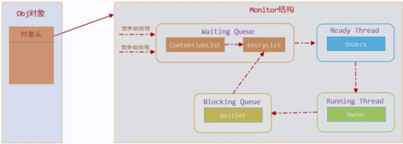
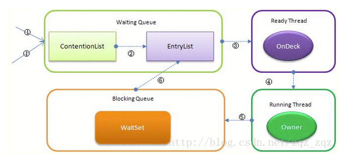
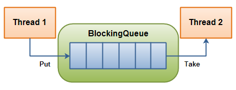

# 1. synchronized的底层实现原理

synchronized的底层实现原理是什么？它是如何实现锁的？
**原理分析**
**核心组件：**
1. **Monitor（管程/监视器锁）**：每个对象有一个关联的Monitor
2. **ObjectMonitor**：HotSpot中Monitor的实现，C++对象
3. **MonitorEnter/MonitorExit**：字节码层面的指令
4. **对象头（Mark Word）**：存储锁状态信息
**synchronized块与synchronized方法：**
- **synchronized块**：编译生成`monitorenter`和`monitorexit`指令。为保证异常时也能释放锁，javac添加隐式try-finally，在finally中调用monitorexit释放锁，因此字节码中有两条monitorexit指令（正常路径和异常路径）
- **synchronized方法**：编译生成`ACC_SYNCHRONIZED`标志。JVM进行方法调用时发现该标志，先尝试获得锁
- 两者底层实现本质相同，均基于对象头的Monitor机制
**字节码层面：**
```java
public void syncMethod() {
    synchronized (this) {
        // 业务逻辑
    }
}
// 编译后的字节码
monitorenter    // 获取锁
// 业务逻辑
monitorexit     // 释放锁（正常路径）
monitorexit     // 释放锁（异常路径，隐式try-finally生成）
```
**对象头结构（64位）：**
| 锁状态 | Mark Word结构 |
|-------|--------------|
| 无锁 | 25位对象哈希 + 4位年龄 + 1位偏向锁位 + 2位锁标志位(01) |
| 偏向锁 | 23位线程ID + 2位epoch + 4位年龄 + 1位偏向锁位 + 2位锁标志位(01) |
| 轻量级锁 | 62位指针指向栈中锁记录 + 2位锁标志位(00) |
| 重量级锁 | 62位指针指向ObjectMonitor + 2位锁标志位(10) |
> 注意：升级为偏向锁、轻量级锁或重量级锁后，hashcode会存放到其他地方。对象刚创建且未执行hashCode()时，Mark Word不存HashCode。一旦调用了hashCode()，直接废掉偏向锁，对象进入无锁→轻量级锁，跳过偏向锁，因为空间已被HashCode占满。
**Monitor工作流程：**
```
线程竞争synchronized锁
    ↓
检查对象头锁状态
    ↓
无锁/偏向锁 → 尝试CAS修改对象头
    ↓
成功 → 获取锁
    ↓
失败 → 膨胀为轻量级锁/重量级锁
    ↓
重量级锁：ObjectMonitor._WaitSet阻塞
```
> 为什么synchronized不需要CAS但ReentrantLock需要？
synchronized是JVM内置锁，由JVM实现。ReentrantLock是JDK提供的显式锁，基于AQS的CAS实现。synchronized在锁升级过程中也使用CAS（如修改对象头）。

# 2. synchronized的锁升级过程

synchronized的锁升级过程是怎样的？为什么不能降级？
**原理分析**
**锁升级方向：**
```
偏向锁 → 轻量级锁 → 重量级锁
  ↑          ↑          ↑
  ↓          ↓          ↓
不可逆     不可逆      不可逆
```
**偏向锁（Biased Locking）：**
- **目的**：消除无竞争下的同步开销
- **适用场景**：始终只有一个线程执行同步块
- **原理**：记录线程ID到对象头，后续该线程进入同步块无需任何同步操作
- **条件**：-XX:+UseBiasedLocking（JDK 15默认禁用）
- **注意**：偏向锁默认不是立即启动，程序启动后有数秒延迟，可通过`-XX:BiasedLockingStartupDelay=0`关闭延迟

**偏向锁加锁过程：**
1. **首次加锁（匿名偏向）**：对象创建后mark word中thread id为0，CAS将thread id改为当前线程ID，成功则获得偏向锁
2. **同一线程重入**：检查到偏向的就是当前线程，往栈中添加一条Displaced Mark Word为空的Lock Record，继续执行，无需CAS
3. **其他线程竞争**：发现已有偏向线程，进入撤销逻辑。在safepoint检查偏向线程是否存活且仍在同步块中，是则升级为轻量级锁；若已不存活或不在同步块中，改为无锁状态再竞争

**偏向锁解锁：**
只需将栈中最近一条lock record的obj字段设为null，不会修改对象头的thread id。偏向锁不会主动释放，只有遇到其他线程竞争时才撤销。

**偏向锁撤销：**
需要等待全局安全点（STW），暂停拥有偏向锁的线程，判断锁对象是否处于锁定状态，撤销后恢复到无锁或轻量级锁。撤销成本高，是JDK 15默认禁用的原因之一。

**轻量级锁（Lightweight Locking）：**
- **目的**：基于CAS的"自旋"避免线程阻塞
- **适用场景**：多个线程交替进入临界区
- **原理**：在栈帧中创建Lock Record，通过CAS将Mark Word复制到栈帧

**轻量级锁加锁过程：**
1. 在栈帧中创建Lock Record，obj字段指向锁对象
2. CAS将Lock Record地址写入对象头mark word，成功则获得轻量级锁
3. 若当前线程已持有该锁，则为重入，设置Displaced Mark Word为null（重入计数器）
4. CAS失败且非重入，膨胀为重量级锁

**轻量级锁解锁过程：**
1. 遍历栈帧，找到所有obj等于锁对象的Lock Record
2. Displaced Mark Word为null→重入，obj设为null后继续
3. Displaced Mark Word不为null→CAS将mark word恢复为Displaced Mark Word，失败则膨胀为重量级锁

**重量级锁（Heavyweight Locking）：**
- **目的**：适用于多线程同时竞争场景
- **原理**：通过ObjectMonitor的_WaitSet和_EntryList进行阻塞等待

**膨胀条件：**
1. **偏向锁→轻量级锁**：只要有超过一个线程请求过锁（即使交替执行）
2. **轻量级锁→重量级锁**：多个线程同时竞争（自旋超时或第三个线程介入）

**锁降级：**
HotSpot JVM理论上支持锁降级，但仅在STW阶段对仅能被VMThread访问的对象进行降级。由于升降级效率低，频繁升降级对性能影响大，==基本认为锁不可降级==。
> 为什么偏向锁在JDK 15后默认禁用？
因为现代应用通常使用轻量级锁，且偏向锁会带来额外开销：
- 撤销成本高（需在安全点STW）
- 实际使用中偏向锁经常成为性能瓶颈

# 3. synchronized与ReentrantLock的区别

synchronized和ReentrantLock有什么区别？各自的适用场景是什么？
**原理分析**
**区别对比：**
| 特性 | synchronized | ReentrantLock |
|-----|-------------|---------------|
| 实现 | JVM内置 | JDK API |
| 锁获取 | 自动获取/释放 | 手动lock/unlock |
| 公平锁 | 不支持 | 支持（构造参数） |
| 尝试获取 | 不支持 | **tryLock()** |
| 超时获取 | 不支持 | **tryLock(long time)** |
| 中断获取 | 不支持 | **lockInterruptibly()** |
| 条件变量 | 内置（wait/notify） | **Condition** |
| 锁状态检查 | 无法检查 | **isLocked()** |
| 性能 | JDK6+优化后相近 | 略有优势 |
**synchronized优势：**
```java
// 自动释放锁
synchronized (lock) {
    // 业务逻辑
    // 即使抛出异常，锁也会自动释放
}
```
**ReentrantLock优势：**
```java
// 尝试获取锁
ReentrantLock lock = new ReentrantLock();
if (lock.tryLock(100, TimeUnit.MILLISECONDS)) {
    try {
        // 业务逻辑
    } finally {
        lock.unlock();
    }
}
```
> 在什么场景下必须使用ReentrantLock？
1. 需要公平锁时
2. 需要尝试获取锁（超时/中断响应）时
3. 需要多个条件变量时（synchronized只有一个waitSet）
4. 需要精确控制锁获取/释放时

# 4. synchronized的锁粗化与锁消除

什么是锁粗化？什么是锁消除？JVM如何实现？
**原理分析**
**锁粗化（Lock Coarsening）：**
将多个连续的加锁操作合并为一次加锁，减少频繁获取/释放锁的开销。
```java
// 优化前
synchronized (sb) { sb.append("a"); }
synchronized (sb) { sb.append("b"); }
synchronized (sb) { sb.append("c"); }
// 优化后（锁粗化）
synchronized (sb) {
    sb.append("a");
    sb.append("b");
    sb.append("c");
}
```
**锁消除（Lock Elision）：**
通过逃逸分析判断对象不会逃逸出线程，直接消除同步操作。
```java
// 线程安全：sb不会逃逸
public String builder(String s1, String s2, String s3) {
    StringBuffer sb = new StringBuffer();
    sb.append(s1);
    sb.append(s2);
    sb.append(s3);
    return sb.toString();
}
// JIT编译时可能消除synchronized
```
**实现位置：**
锁粗化和锁消除在JIT编译器的**c2编译器**阶段实现。
> 锁粗化有什么负面效果？
过度锁粗化可能导致：
- 本应并行的操作被串行化
- 持有锁的时间变长
但JVM会根据实际情况智能判断，通常利大于弊。

# 5. Monitor机制与ObjectMonitor的结构

synchronized的Monitor机制是怎样的？ObjectMonitor的结构是什么？
**原理分析**
**ObjectMonitor结构（C++）：**
```cpp
ObjectMonitor() {
    _header = NULL;        // 对象头
    _count = 0;           // 竞争计数
    _waiters = 0;        // 等待者数量
    _recursions = 0;     // 重入计数
    _owner = NULL;       // 持有锁的线程
    _WaitSet = NULL;     // 等待队列（Object.wait）
    _cxq = NULL;         // 竞争队列（ContentionList）
    _EntryList = NULL;   // 入口队列（阻塞队列）
}
```
**重量级锁调度流程：**
```
多个线程竞争锁
    ↓
封装为ObjectWaiter插入到cxq（ContentionList）尾部
    ↓
持有锁的线程释放锁前，将cxq中所有元素移动到EntryList
    ↓
唤醒EntryList队首线程作为OnDeck候选
    ↓
OnDeck重新竞争锁 → 成功成为Owner，失败留在EntryList
    ↓
Owner调用wait() → 移入_WaitSet → notify后回到EntryList
```
**关键角色：**
- **ContentionList（cxq）**：所有请求锁的线程首先进入该竞争队列
- **EntryList**：ContentionList中有资格成为候选的线程被移入EntryList
- **WaitSet**：调用wait()被阻塞的线程
- **OnDeck**：任意时刻最多只有一个线程正在竞争锁资源
- **Owner**：当前已获取锁的线程
- **!Owner**：当前释放锁的线程

**调度策略（非公平）：**
Owner线程释放锁时，不直接把锁传递给OnDeck，而是把竞争权利交给OnDeck，OnDeck需要重新竞争。这样虽牺牲一定公平性，但极大提升系统吞吐量，JVM称之为"竞争切换"。

**线程状态流转：**
```
竞争锁 → cxq（ContentionList）
    ↓ 锁释放时移入
EntryList（阻塞）
    ↓ 被选为OnDeck
尝试获取锁 → 成功 → _owner
                ↓
             调用wait() → _WaitSet（等待）
                            ↓
                        被notify()唤醒 → EntryList
                            ↓
                         再次竞争锁 → _owner
```



> 为什么重量级锁效率低？
1. **线程阻塞/唤醒**：需要操作系统介入，从用户态切换到内核态
2. **上下文切换**：每次阻塞/唤醒都需要保存/恢复线程上下文
3. **调度开销**：内核调度器需要参与

# 6. synchronized的可重入性原理

synchronized是如何实现可重入的？其原理是什么？
**原理分析**
**可重入性（Reentrant）：**
同一线程可以多次获取同一把锁，不会被自己阻塞。
```java
public synchronized void methodA() {
    methodB();  // 可重入
}
public synchronized void methodB() {
    // 仍然持有锁
}
```
**实现原理：**
在ObjectMonitor中记录持有锁的线程和重入次数：
```cpp
// _owner：持有锁的线程
// _recursions：重入次数（每次加锁+1，释放-1）
void ObjectMonitor::enter(TRAPS) {
    Thread* self = THREAD;
    if (self == _owner) {
        _recursions++;  // 重入次数+1
        return;
    }
    // 首次获取，执行CAS或自旋
}
```
> ReentrantLock的可重入与synchronized有何区别？
实现上都是通过计数器，但ReentrantLock更灵活：
```java
lock.lock();
lock.lock();  // 可重入，计数变为2
lock.unlock(); // 计数变为1
lock.unlock(); // 计数变为0，锁释放
```

# 7. synchronized与异常处理

synchronized方法抛出异常时，锁会自动释放吗？
**原理分析**
**自动释放机制：**
```java
public synchronized void method() {
    // 正常执行 → 锁释放
    // 抛出RuntimeException → 锁释放
    // 抛出Checked Exception → 锁释放
}
```
**monitorexit执行时机：**
```
synchronized块代码正常执行完成 → monitorexit
synchronized块代码抛出异常 → bytecode层面自动生成monitorexit
```
**字节码验证：**
```java
// 字节码（部分）
3: monitorenter          // 进入
13: athrow              // 抛出异常
14: aload_1
15: monitorexit        // 自动生成的释放
```
> 如果需要在finally中手动释放锁呢？
ReentrantLock需要手动释放（否则可能导致死锁）：
```java
ReentrantLock lock = new ReentrantLock();
try {
    lock.lock();
} finally {
    lock.unlock();  // 必须手动释放
}
```

# 8. synchronized对性能的影响及优化

synchronized对性能有什么影响？有哪些优化手段？
**原理分析**
**性能影响：**
1. **原子性保证**：所有操作串行化
2. **阻塞开销**：线程切换、上下文切换
3. **内存可见性**：缓存刷新、内存屏障
**优化手段：**
1. **减少锁持有时间**
```java
// 优化前
public synchronized void process() {
    doDatabaseOperation();
    doNetworkCall();
    updateState();
}
// 优化后
public void process() {
    synchronized (this) {
        updateState();
    }
    doDatabaseOperation();
    doNetworkCall();
}
```
2. **减小锁粒度**
```java
// 优化前：锁整个Map
Map<String, Object> map = new HashMap<>();
synchronized (map) { map.put(key, value); }
// 优化后：分段锁
ConcurrentHashMap<String, Object> map = new ConcurrentHashMap<>();
map.put(key, value);
```
3. **使用并发容器**
```java
ConcurrentHashMap<K, V> map = new ConcurrentHashMap<>();
CopyOnWriteArrayList<E> list = new CopyOnWriteArrayList<>();
BlockingQueue<E> queue = new LinkedBlockingQueue<>();
```
> 阿里Java开发手册关于synchronized的规定？
```java
// 正确方式
public class Test {
    private final Object lock = new Object(); // 私有锁
    public void test() {
        synchronized (lock) { // 同一实例
        }
    }
}
```

# 9. synchronized与volatile的对比

synchronized和volatile有什么区别？在什么场景下选择哪个？
**原理分析**
**对比：**
| 特性 | synchronized | volatile |
|-----|-------------|----------|
| 原子性 | ✓ | ✗ |
| 可见性 | ✓ | ✓ |
| 有序性 | ✓ | ✓ |
| 阻塞 | ✓ | ✗ |
| 性能 | 较低 | 较高 |
**选择原则：**
1. **volatile使用场景：**
   - 状态标志（boolean flag）
   - 单次读写（引用赋值、long/double）
   - 不需要原子复合操作
2. **synchronized使用场景：**
   - 需要保证原子性
   - 复合操作（先检查后执行）
   - 多个操作需要一起保证原子性
> 如何理解"volatile写 happens-before volatile读"？
这意味着：
- **volatile写之前的所有操作**不会被重排序到volatile写之后
- **volatile读之后的所有操作**不会被重排序到volatile读之前

# 10. synchronized的底层汇编指令

synchronized对应的汇编指令是什么？锁如何实现？
**原理分析**
**lock指令：**
synchronized的底层使用**lock**前缀指令：
```asm
; 实际汇编（x86）
lock cmpxchg %r15, (%rsi) ; lock cmpxchg指令
```
**lock指令的作用：**
1. **总线锁定**：确保原子性
2. **缓存失效**：实现可见性
3. **内存屏障**：实现有序性
**实现机制：**
1. **原子性**：通过CPU的lock前缀保证读-修改-写原子性
2. **可见性**：通过缓存一致性协议（MESI）实现
3. **有序性**：通过内存屏障实现
> 为什么早期 synchronized 性能差？
早期synchronized直接使用**重量级锁**：
- 每个synchronized都需要Monitor
- 线程竞争失败直接阻塞（内核态）
- 每次加锁/解锁都需要系统调用
JDK6引入锁升级后，性能大幅提升：
- 无竞争时使用偏向锁（无额外开销）
- 轻度竞争使用自旋（用户态）
- 只有重度竞争才使用重量级锁

# 11. 死锁的原因与预防

死锁的产生原因是什么？如何排查和预防？
**原理分析**
**死锁产生原因：**
两个或多个线程互相等待对方持有的锁，导致所有线程都无法继续执行。
```java
// 死锁示例
线程1: 持有锁A，请求锁B
线程2: 持有锁B，请求锁A
```
**死锁的四个必要条件：**
1. **互斥条件**：资源不能被共享
2. **持有并等待**：线程持有至少一个资源并等待获取其他资源
3. **不可剥夺**：已持有的资源不能被强制剥夺
4. **循环等待**：存在线程循环等待链

**排查死锁：**
- 使用**jstack**打印线程堆栈，JVM会自动检测并报告死锁的线程信息
- 查看线程状态为BLOCKED且互相等待的情况

**预防死锁：**
1. **以确定的顺序加锁**：所有线程按相同顺序获取锁，破坏循环等待条件
2. **设置超时**：尝试获取锁时设置超时（如tryLock），超时后释放已持有的锁并重试
3. **死锁检测**：使用锁关系图（线程-锁依赖图）检测死锁，检测到死锁后释放所有锁并回退，等待随机时间后重试，或设置线程优先级让低优先级线程回退



> 死锁检测的数据结构如何工作？
每当一个线程获得锁，在线程和锁相关的数据结构（map、graph）中记录；线程请求锁失败时，遍历锁关系图检查是否存在循环等待。例如：线程A持有锁1，请求锁7，发现锁7被线程B持有，检查线程B是否请求了线程A持有的锁1，如果是则发生死锁。检测到死锁后，所有线程释放锁并回退，等待随机时间后重试。
