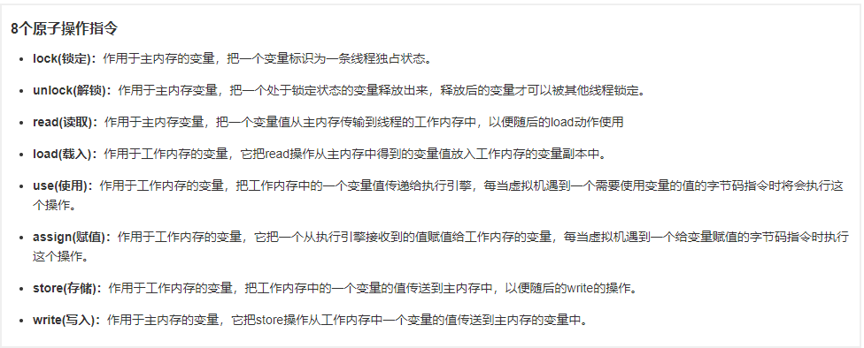
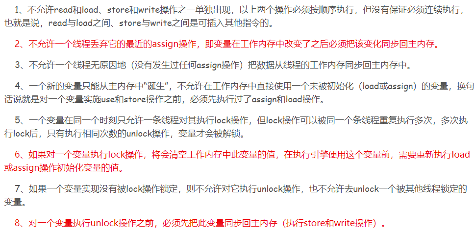
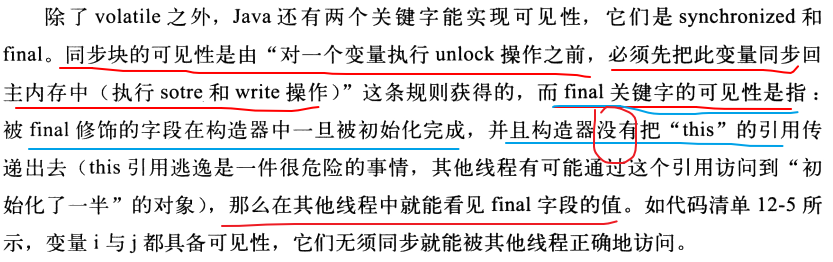
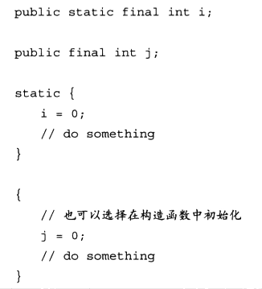
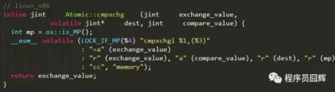
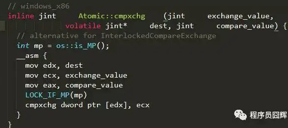

# 1. 并发安全的本质是什么？如何保证？

并发安全的本质是保证 **原子性、可见性、有序性**。

**1. 原子性**

Java 的一些语句并不是原子操作，在 CPU 执行时会分成多个步骤，例如 `x++`。保证原子性的方式：

- **synchronized** 和 **Lock**：通过 monitorenter/monitorexit 或 lock/unlock 原子操作实现
- **Atomic 类**：基于 CAS 实现无锁原子操作
- 基本数据类型的访问读写本身具备原子性

Java 内存模型定义了 8 种原子操作来完成主内存与工作内存的交互：



以及对应的执行规则：



其中 lock 和 unlock 两条原子操作可以保证更大范围的原子性。jvm 以 monitorenter 和 monitorexit 指令开放给我们使用，反应到 Java 代码中就是 synchronized 关键字。

**2. 可见性**

各线程有自己的工作内存，修改后不能立即对其他线程可见。保证可见性的方式：

- **volatile**：写操作会添加 lock 指令，强制刷新到主内存
- **synchronized**：获取锁时从主内存读取最新值，释放锁时将共享变量同步到主内存
- **final**：构造完成后其他线程可见

Synchronized 的内存语义：



Volatile 的内存语义：



**3. 有序性**

编译器和处理器可能对指令重排序，单线程内不影响结果，但多线程并发执行会出问题。保证有序性的方式：

- **synchronized**：同一时刻只允许一个线程 lock 操作，保证串行执行
- **volatile**：包含禁止指令重排序的语义（内存屏障）

重排序分三种类型：

- **编译器优化的重排序**：不改变单线程语义的前提下重新安排执行顺序
- **指令级并行的重排序**：不存在数据依赖时处理器改变机器指令执行顺序
- **内存系统的重排序**：处理器使用缓存和读/写缓冲区导致乱序

# 2. 什么是 CAS？它的原理是什么？

CAS（Compare And Swap）即 **比较并交换**，是一种乐观锁技术。CAS 操作包含三个操作数：**内存地址 V、旧的预期值 A、新值 B**。当且仅当 V 的值等于 A 时，才将 V 修改为 B，否则不做任何操作。整个比较并替换是一个原子操作。

以 `AtomicInteger.getAndIncrement()` 为例，底层调用 `Unsafe.getAndAddInt()`：

```
do {
    var5 = this.getIntVolatile(var1, var2);  // 当前值
} while (!this.compareAndSwapInt(var1, var2, var5, var5 + 1));
```

本质是一个 **自旋 CAS**（自旋锁），不断尝试直到成功。

**底层硬件实现**

- CAS 底层依赖 CPU 的 **cmpxchg 指令**（汇编级的比较并交换）
- **单核 CPU**：cmpxchg 本身就是原子的，因为中断不会发生在单条指令执行过程中
- **多核 CPU**：cmpxchg 之前会添加 **LOCK 前缀**，变成 **lock cmpxchg** 来保证原子性

LOCK 前缀的演进：

- **早期**：直接锁总线（LOCK# 信号），阻止其他处理器访问内存，开销大
- **P6 及之后**：如果缓存行处于独占/修改状态，使用 **缓存锁定**（Cache Locking），通过 MESI 缓存一致性协议来保证原子性，只在跨缓存行时才锁总线

`Atomic::cmpxchg` 在 Linux 和 Windows 下的实现（HotSpot 源码）：





`mp` 是 `os::is_MP()` 的返回值，用于判断当前系统是否为多处理器。**LOCK_IF_MP(mp)** 根据 mp 值决定是否为 cmpxchg 指令添加 lock 前缀：**多处理器加 lock，单处理器不加**。

**为什么用 CAS 而不是直接用 Lock？**

CAS 是乐观锁思路，直接 Lock 是悲观锁思路。CAS 的优势：

- 先 **普通读**（无锁、零开销），只有相等时才走一次 lock cmpxchg
- 不相等时 **用户态自旋重试**，不阻塞线程、不上下文切换
- **写冲突是小概率**，能不加锁就不加锁

# 3. CAS 存在哪些问题？

**1. ABA 问题**

变量从 A 变成 B 又变回 A，CAS 检查时发现值没变就会成功交换，但实际上中间已经被其他线程修改过。使用 **AtomicStampedReference**（版本号控制）解决。

**2. 自旋时间过长**

高并发时大量线程同时 CAS 同一个变量，失败后不停自旋重试，空耗 CPU。JDK 8 引入 **LongAdder** 通过分段 CAS 缓解，JDK 6 引入 **自适应自旋锁**，根据上次自旋成功与否动态调整自旋次数。

**3. 只能保证一个共享变量的原子操作**

多个共享变量无法用一个 CAS 保证原子性。解决方案：将多个变量封装成一个对象，使用 **AtomicReference** 进行 CAS 操作。

# 4. 什么是 ABA 问题？如何解决？

ABA 问题：线程 T1 读取值 A，准备 CAS 更新前，线程 T2 将 A 改为 B 又改回 A，T1 执行 CAS 时发现值仍为 A 就交换成功，但中间状态已被改变。

**影响业务的例子**：用单向链表实现堆栈，栈顶为 A（A.next = B）。T1 准备 CAS 将栈顶从 A 换成 B。此时 T2 介入将 A、B 出栈，再 push D、C、A。轮到 T1 执行 CAS 发现栈顶仍是 A，将栈顶换成 B，但 B.next = null，导致 C、D 游离丢失。

**解决方法**：

- **版本号（AtomicStampedReference）**：每次修改同时更新版本戳，CAS 时对比值和版本号
- **不重复使用节点引用**：每次入栈新建节点，不复用旧引用

`AtomicStampedReference` 的核心 API：

```
// 构造：初始值 + 初始版本号
AtomicStampedReference<V> ref = new AtomicStampedReference<>(initialRef, initialStamp);

// 获取当前引用和版本号
ref.getReference();
ref.getStamp();

// CAS 交换：期望值、新值、期望版本、新版本
ref.compareAndSet(expectedReference, newReference, expectedStamp, newStamp);
```

# 5. 什么是 LongAdder？它解决了什么问题？

LongAdder 是 JDK 8 对 CAS 的优化，适用于 **高并发写大于读** 的计数场景。核心思想：**分段 CAS + 空间换时间**。

- 内部维护一个 base 变量和多个 Cell 数组
- 不同线程分散到不同 Cell 上做 CAS 操作，降低冲突
- 最后求和时累加 base + 所有 Cell 的值
- 比 AtomicInteger/AtomicLong 性能更好，代价是消耗更多内存

# 6. 什么是 Future？CompletableFuture 和它有什么区别？

**Future** 代表异步计算的结果，通过 `get()` 阻塞获取，不支持回调。

**CompletableFuture**（JDK 8）= **Future + 回调 + 任务编排**。

**核心原理**：基于 **volatile 状态机 + 结果缓存 + 回调链表** 实现。

- 内部有一个 volatile int status 状态：未完成、正常完成、异常完成、取消
- 任务未完成时，后续回调不阻塞线程，封装成 Completion 节点挂到回调链表上
- 任务完成后 **事件驱动触发链式回调**，自动遍历链表逐个执行
- 默认使用 **ForkJoinPool.commonPool()** 执行异步任务

**与 Future 的本质区别**：

| 特性 | Future | CompletableFuture |
|------|--------|-------------------|
| 获取结果 | get() 阻塞 | 回调非阻塞、链式触发 |
| 任务编排 | 不支持 | 串行、并行、聚合组合 |
| 异常处理 | 难捕获 | 自动透传、可全局捕获 |
| 编程模型 | 被动阻塞 | 事件驱动、流式异步 |

**异常处理方式**：

- **exceptionally**：类似 try-catch，异常时返回默认值
- **whenComplete**：类似 finally，无论正常/异常都执行
- **handle**：可在一个方法里对结果转换或异常处理

**多任务组合**：

- **allOf**：所有 Future 都完成后触发回调
- **anyOf**：任意一个完成后触发回调

# 7. 什么是 AQS？它的核心原理是什么？

AQS（AbstractQueuedSynchronizer）是 **抽象队列同步器**，为多线程访问共享资源提供了一个同步器框架。许多同步类都依赖它，如 ReentrantLock、Semaphore、CountDownLatch。

**核心结构**：

- 维护一个 **volatile int state**（代表共享资源），通过 CAS 修改
- 维护一个 **FIFO 线程等待队列（CLH 队列）**，多线程争用资源被阻塞时进入此队列

state 用 volatile 修饰的原因：线程读取 state 会缓存到自己寄存器/高速缓存，不加 volatile 看不到其他线程对 state 的最新修改；同时 volatile 能限制上下指令重排序，防止 state 修改和队列入队/唤醒操作的顺序被打乱。

**两种资源共享方式**：

- **Exclusive（独占）**：只有一个线程能执行，如 ReentrantLock
- **Share（共享）**：多个线程可同时执行，如 Semaphore/CountDownLatch

**模板方法设计模式**：

自定义同步器只需实现 state 的获取与释放方式，线程等待队列的维护由 AQS 顶层实现。需要实现的方法：

- **tryAcquire(int)**：独占方式尝试获取资源，成功返回 true，失败返回 false
- **tryRelease(int)**：独占方式尝试释放资源
- **tryAcquireShared(int)**：共享方式尝试获取资源。负数表示失败；0 表示成功但无剩余资源；正数表示成功且有剩余资源
- **tryReleaseShared(int)**：共享方式尝试释放资源，释放后允许唤醒后续等待结点返回 true
- **isHeldExclusively()**：该线程是否正在独占资源，只有用到 condition 才需要实现

**阻塞线程获取锁的过程**：

线程获取锁失败 → 加入阻塞队列尾部 → 挂起线程。持有锁的线程执行完毕调用 unlock 时 → 释放锁 → 找到阻塞队列中的后继节点 → unpark 此线程 → 线程在 acquireQueued 自旋中继续 tryAcquire → 成功获取锁后继续执行后续代码。

# 8. ReentrantLock 的实现原理？公平锁和非公平锁的区别？

ReentrantLock 基于 AQS 实现，默认是非公平锁。

**公平锁和非公平锁的两处不同**：

**第一处**：非公平锁在调用 lock 后，首先就会调用 CAS 进行一次抢锁，如果此时锁未被占用，直接获取锁返回。公平锁则直接进入 tryAcquire。

**第二处**：在 tryAcquire 方法中，如果发现锁被释放了（state == 0），非公平锁会直接 CAS 抢锁；公平锁会判断等待队列中是否有线程在等待，如果有则不去抢锁，乖乖排到后面。

如果这两次 CAS 都不成功，后面非公平锁和公平锁都一样，都要进入阻塞队列等待唤醒。

**性能对比**：

- 非公平锁性能更好，吞吐量更大，减少了线程挂起的几率
- 非公平锁让获取锁的时间更加不确定，可能导致阻塞队列中的线程长期处于饥饿状态

**其他方法**：

- **tryLock()**：尝试获取锁，立即返回成功或失败
- **tryLock(long time, TimeUnit unit)**：在指定时间内等待获取锁
- **lockInterruptibly()**：可响应中断的获取锁，等待过程中可以被中断

# 9. 什么是 Condition？它的实现原理？

Condition 是一个多线程间协调通信的工具类，使得某个或某些线程一起等待某个条件，只有当该条件具备（signal/signalAll 被调用）时，这些等待线程才会被唤醒并重新争夺锁。

**与 wait/notify 的对应关系**：

- condition.await() 对应 Object.wait()
- condition.signal() 对应 Object.notify()
- condition.signalAll() 对应 Object.notifyAll()
- 使用时必须先持有锁，否则抛出 IllegalMonitorStateException

**Condition 内部结构**：

每个 Condition 维护一个条件队列（Condition Queue），使用与 AQS 阻塞队列一样的 Node 实例。

**await 执行流程**：

1. 判断是否中断，如果是直接抛中断异常
2. 将当前线程包装成 Node 添加到 Condition 条件队列尾部
3. 释放当前线程持有的锁（可重入锁需要释放所有）
4. 挂起线程，自旋等待，直到节点从 Condition 队列转移到 AQS 阻塞队列
5. 被唤醒后进入 acquireQueued，等待获取锁
6. 获取锁成功后，从 await 处继续执行后续代码

**signal 执行流程**：

1. 将 Condition 队列中的第一个 Node 取出
2. 通过 transferForSignal 将该 Node 转移到 AQS 阻塞队列尾部
3. 正常情况不会在此唤醒线程，等待持有锁的线程 unlock 后自动唤醒

**两个队列的协作**：

- **AQS 阻塞队列**：维护等待获取资源的线程
- **Condition 条件队列**：维护等待 signal 信号的线程
- 线程在 condition.await 时从阻塞队列移至条件队列
- 线程在 condition.signal 时从条件队列移至阻塞队列
- 通过节点在两个队列间的来回移动实现线程协作

# 10. CountDownLatch 和 Semaphore 的实现原理？

**CountDownLatch（门闩）**：

基于 AQS 共享模式实现。初始化时设置 state 为要等待的线程数目。调用 `await()` 的线程会阻塞进入 AQS 阻塞队列。线程执行完调用 `countDown()` 时，state 减一。当最后一个线程 countDown 后 state 为 0，该线程负责通知所有 await 的线程取消等待继续执行。

**Semaphore（信号量）**：

基于 AQS 共享模式实现，控制某个资源可被同时访问的个数。通过 `acquire()` 获取一个许可，如果没有就等待；`release()` 释放一个许可。初始化时设置 state 为许可总数，每次 acquire 减少 state，release 增加 state。

两者都支持公平与非公平模式，区别在于公平模式下 acquire 时会先检查阻塞队列中是否有等待线程。

# 11. 什么是 LockSupport？它和 wait/notify 有什么区别？

LockSupport 是 JDK 中用于锁的工具类，主要用途是 **无条件暂停线程和恢复线程运行**。

**核心方法**：

- **park()**：阻塞当前线程
- **unpark(Thread thread)**：恢复指定线程

**实现原理**：

通过调用 Unsafe 类中的 park 和 unpark 本地方法实现。

**与 wait/notify 的区别**：

- **不需要持有锁**：LockSupport.park/unpark 不要求在同步代码块中调用，而 wait/notify 必须先持有 synchronized 锁
- **精确唤醒**：unpark 可以精确唤醒指定线程，notify 只能随机唤醒一个
- **许可机制**：LockSupport 基于许可（permit）机制，先调用 unpark 再调用 park 不会阻塞，相当于提前发放许可；而先 notify 再 wait 会导致线程永久阻塞
