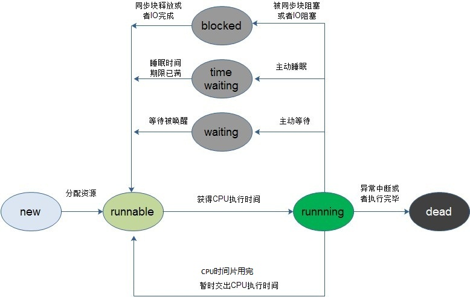
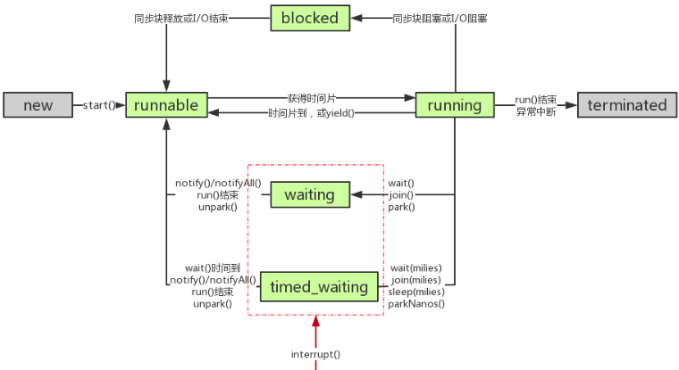
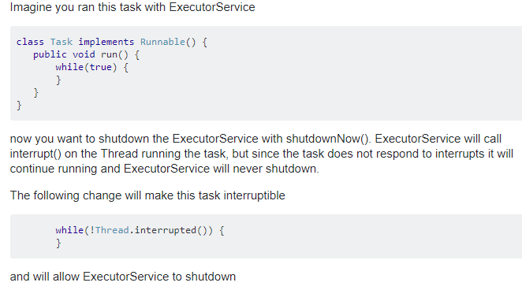
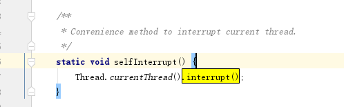
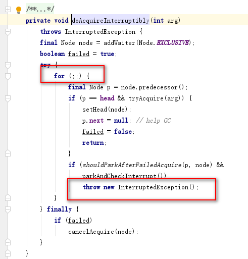
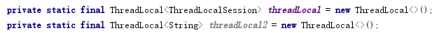
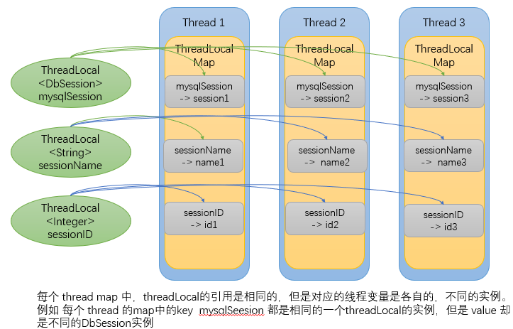
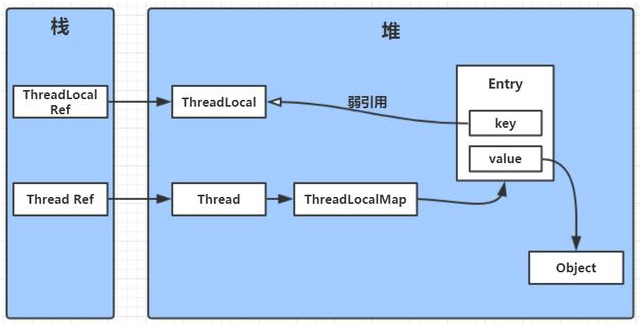
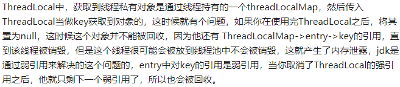

# 1. Java线程的生命周期及状态转换

请详细描述Java线程的生命周期及状态转换过程？

Java线程的生命周期分为6种状态：**NEW**、**RUNNABLE**、**BLOCKED**、**WAITING**、**TIMED_WAITING**、**TERMINATED**。

**状态转换过程：**
1. **NEW → RUNNABLE**：调用`start()`方法后，线程进入就绪队列等待CPU调度
2. **RUNNABLE → BLOCKED**：等待获取monitor锁（如synchronized争抢）
3. **RUNNABLE → WAITING**：调用`Object.wait()`（无超时）、`Thread.join()`（无超时）、`LockSupport.park()`
4. **RUNNABLE → TIMED_WAITING**：调用`Thread.sleep()`、`Object.wait(long)`、`LockSupport.parkNanos()`
5. **BLOCKED/WAITING/TIMED_WAITING → RUNNABLE**：被唤醒或超时后重新竞争锁
6. **RUNNABLE → TERMINATED**：`run()`方法执行完毕或抛出未捕获异常

**各状态说明：**
- **NEW**：线程创建后尚未启动
- **RUNNABLE**：正在JVM中执行，包含就绪（Ready）和运行（Running）两个子状态，由操作系统调度
- **BLOCKED**：等待获取监视器锁以进入同步块/方法，或在wait后重新进入同步块失败
- **WAITING**：无限期等待其他线程执行特定操作
- **TIMED_WAITING**：带超时的等待
- **TERMINATED**：线程执行完毕

**关键区别：**
- **BLOCKED vs WAITING**：BLOCKED是被动等待锁释放，WAITING是主动等待其他线程通知
- **sleep不释放锁**，sleep期间持有对象锁；**wait释放锁**，执行wait后立即释放对象锁
- 每个锁对象有两个队列：**就绪队列**（存储将要获得锁的线程）和**阻塞队列**（存储被wait的线程）
- **BLOCKED**状态的触发：进入synchronized代码块/方法失败；wait唤醒后重新进入同步块失败





# 2. 线程的创建方式

Java中创建线程有几种方式？各自优缺点？

**三种创建方式：**

1. **继承Thread类**
   - 重写run()方法，Thread类本身实现了Runnable接口
   - 缺点：Java单继承，无法继承其他类
2. **实现Runnable接口**
   - 实现run()方法，通过Thread.start()启动
   - 优点：避免单继承限制，可以**资源共享**
3. **实现Callable接口**
   - 通过FutureTask包装后交由线程执行
   - 有**返回值**，可以**抛出异常**

**推荐方式：**
- 使用**线程池**创建和管理线程，避免频繁创建销毁
- 优先使用**实现Runnable/Callable接口**方式，避免单继承限制

# 3. Thread常用方法

请说明Thread中yield、join、sleep等方法的作用？

**1. yield() - 线程让步**
- Thread的**静态方法**
- 暂停当前线程，让出CPU给其他线程（包括自己）
- 不保证当前线程会暂停或停止，但保证调用时会**放弃CPU**
- 下一次CPU调度**仍可能继续执行**当前线程，由CPU决定

**2. join() - 线程等待**
- 调用方线程等待被调用的线程执行完毕再继续
- 例如main线程中调用`t1.join()`，main线程等待t1执行完再继续
- join本身是**synchronized方法**，通过**wait**实现等待

**3. sleep() - 线程睡眠**
- 使当前线程暂停执行指定时间，**不释放锁**
- 超时时间由**操作系统内核**控制，内核挂起线程并负责计时，时间到自动唤醒，不占用CPU
- sleep期间检测到中断标志则抛出InterruptedException

**4. suspend()/resume()（已废弃）**
- 挂起和恢复线程，容易因争锁导致死锁，JDK 7起不推荐使用

**5. 其他方法：**
- **setName/getName**：设置/获取线程名称
- **setPriority/getPriority**：设置/获取线程优先级（依赖OS支持，OS不支持则无效）
- **setDaemon/isDaemon**：设置/判断守护线程

# 4. 线程通信与协作

Java线程间有哪些通信方式？wait/notify机制的原理？

**线程通信方式：**
1. **wait/notify/notifyAll** - 等待唤醒机制
2. **synchronized** - 同步锁
3. **volatile** - 变量可见性
4. **管道流** - PipedInputStream/PipedOutputStream
5. **JUC工具** - CountDownLatch、CyclicBarrier、Semaphore
6. **阻塞队列** - BlockingQueue

**wait/notify机制：**
- 都是**Object**的方法
- **必须在synchronized同步块中调用**，否则抛IllegalMonitorStateException
- **wait()**：使当前线程进入等待状态，并**释放对象锁**，进入阻塞队列
- **notify()**：随机唤醒等待池中**一个**线程进入就绪队列，**不会立即释放锁**，需等同步块执行完才释放
- **notifyAll()**：唤醒等待池中**所有**线程进入就绪队列，优先级最高的优先执行（取决于JVM实现）
- notify容易造成**线程饿死**：队列满时生产者wait，notify又唤醒生产者而非消费者，导致死锁

**Condition（ReentrantLock配套）：**
- **condition.await()**：类似wait，释放锁并挂起，被signal后重新竞争锁
- **condition.signal()**：类似notify，唤醒Condition队列中第一个非CANCELLED节点线程
- **condition.signalAll()**：唤醒所有等待线程

> wait(1000ms)的超时由谁控制？
由**操作系统内核**控制，内核挂起线程并通过CPU时钟和中断及内核定时器实现计时，不占用CPU。

# 5. 线程中断机制

Java的线程中断机制是怎样的？interrupt、isInterrupted、interrupted的区别？

**Java中断是协作机制**，被中断线程不会立即退出，需线程自己处理中断请求。每个线程有一个boolean类型的中断标识。

**三个核心方法：**
| 方法 | 作用 | 说明 |
|-----|------|------|
| **interrupt()** | 设置中断标志为true | 仅设置标志，不强制停止线程 |
| **isInterrupted()** | 测试线程是否已中断 | **不**清除中断标志 |
| **interrupted()** | 测试当前线程是否已中断 | **静态方法**，会清除中断标志 |

**中断阻塞线程：**
当线程处于以下状态时，调用interrupt()会抛出**InterruptedException**并清除中断标志：
- `Object.wait()`
- `Thread.sleep()`
- `Thread.join()`
- `BlockingQueue.take()/put()`
- `LockSupport.park()`

**不能中断的阻塞操作：**
- synchronized获取锁的过程
- ReentrantLock.lock()获取锁的过程
- 但**ReentrantLock.tryLock(long, TimeUnit)**和**lockInterruptibly()**可响应中断

**中断处理原则：**
1. **不应当吞掉中断**：捕获InterruptedException后应抛出或通过`Thread.currentThread().interrupt()`重新设置中断状态
2. **除非知道线程中断策略，否则不应中断它**：应使用Future.cancel()取消任务
3. **任务代码不该猜测中断含义**：遇到InterruptedException应向上抛出

**interrupt vs Thread.stop：**
- stop已废弃，直接在代码执行过程中抛出ThreadDeath错误
- interrupt是**协作式**，需要程序自行检测处理，更安全

**中断使用场景：**
- 点击取消按钮时
- 操作超时需中止时
- 多个线程做相同任务，一个成功其余取消
- 一组线程中一个出错，整组无法继续
- 应用或服务关闭时








# 6. 守护线程与用户线程

守护线程和用户线程有什么区别？

| 特性 | 用户线程 | 守护线程 |
|-----|---------|---------|
| 创建 | 默认是用户线程 | 需显式设置`setDaemon(true)` |
| JVM等待 | **会阻止JVM退出** | **不会阻止JVM退出** |
| 典型应用 | 主线程、业务线程 | GC线程、Finalizer线程 |
| 子线程继承 | 默认是用户线程 | 创建的子线程仍是守护线程 |

**关键点：**
- 当所有用户线程结束时，JVM直接退出，所有守护线程被终止
- JVM**不等待**守护线程执行完毕
- 守护线程用于后台辅助任务，如GC是无限循环，不应阻止JVM退出
- 守护属性具有**传递性**

# 7. ThreadLocal原理及内存泄漏

ThreadLocal的原理是什么？为什么会有内存泄漏问题？如何避免？

**原理：**
- ThreadLocal是**存放每个线程的线程内变量**，各线程间互不影响
- 每个Thread有一个**ThreadLocalMap**，以ThreadLocal实例为key，线程变量为value
- ThreadLocal本身只是key的引用，并不存放实际数据

**结构：**
```
Thread → ThreadLocalMap → Entry(key: WeakReference<ThreadLocal>, value: Object)
```

**工作流程：**
- **set(T value)**：获取当前线程，获取其ThreadLocalMap，以当前ThreadLocal实例为key存入
- **get()**：获取当前线程的ThreadLocalMap，以当前ThreadLocal为key查找，未找到则调用initialValue初始化
- **initialValue()**：可重写的初始值方法，**懒加载**，调用了set()后不会触发

**为什么不用Map<Thread, T>？**
1. Entry数量是ThreadLocal实例数而非线程数，数量更少，性能更好
2. 全局Map需处理线程安全，违背ThreadLocal避免并发的初衷
3. 线程退出后Thread无法回收，导致内存泄漏

**弱引用设计：**
- Key是对ThreadLocal实例的**弱引用**（WeakReference）
- Value是**强引用**
- 好处：ThreadLocal对象外部强引用断开后，key可被GC回收
- 二者对比：key用**强引用**会导致ThreadLocal无法被GC回收；key用**弱引用**提供多一层保障，value会在下次get/set/remove时清理

**ThreadLocalMap哈希碰撞：**
- 使用**0x61c88647**（2^32×黄金分割比）作为步长递增哈希码
- 采用**开放定址法**（线性探测）解决碰撞

**内存泄漏原因：**
1. 线程复用（如线程池），线程生命周期很长
2. ThreadLocal使用后未调用**remove()**
3. Key被GC回收后Entry的key为null，但value仍有强引用链：Thread → ThreadLocalMap → Entry → value
4. 只有线程退出后value的强引用链才会断开，线程池中线程不退出导致value长期无法回收

**解决方案：**
- 使用完ThreadLocal后**必须手动调用remove()**
- ThreadLocal尽量声明为**static**，确保有强引用，remove时能正确定位
- ThreadLocalMap自身在get/set/remove时会调用**expungeStaleEntry()**清理key为null的Entry

**典型应用：**
- 数据库Connection管理（每个线程自己的连接）
- SimpleDateFormat（线程不安全，每个线程创建自己的实例）
- 请求上下文（Spring中的RequestContextHolder）

> ThreadLocal能解决并发问题吗？
不能。ThreadLocal是**用空间换时间**，每个线程使用自己的变量副本，不存在共享竞争。将同一个实例放入ThreadLocal**不会保证线程安全**，需要为每个线程创建独立对象。

> 线程池中使用ThreadLocal要注意什么？
必须在使用完后**remove()**，否则下次复用该线程时get()可能获取到上一次的旧值。









# 8. JVM线程模型与操作系统线程

Java线程是如何映射到操作系统线程的？影响线程数量的因素有哪些？

**三种线程模型：**
1. **1:1模型（内核线程模型）**：一个Java线程对应一个OS内核线程
2. **N:1模型（用户线程模型）**：多个Java线程映射到一个OS线程
3. **M:N模型（混合模型）**：多个Java线程映射到多个OS线程

**HotSpot VM实现：**
- HotSpot VM采用**1:1模型**，一个Java线程直接对应一个OS线程
- JVM规范**未限定**线程模型，不同的JVM实现可以用不同的模型
- HotSpot本身**不干涉线程调度**，全权交给OS处理
- Java线程的优先级设置若OS不支持优先级调度则无效

**线程数量限制因素：**
1. **JVM堆内存**（-Xmx/-Xms）：堆越大，系统可用内存越少，可创建线程越少
2. **线程栈大小**（-Xss）：JDK 8默认1M，栈越小可创建线程越多
3. **系统限制**：
   - `/proc/sys/kernel/pid_max` - 最大PID数量
   - `/proc/sys/kernel/thread-max` - 系统最大线程数
   - `ulimit -u` - 用户最大进程/线程数
4. **估算公式**（不考虑系统限制）：线程数量 ≈ (可用内存 - 堆内存) / Xss

# 9. 线程上下文切换

线程上下文切换的开销有哪些？如何优化？

**上下文切换过程：**
当在运行一个线程的过程中转去运行另一个线程，需要**存储和恢复CPU状态**，使得线程执行能够从中断点恢复执行。

**开销分类：**
1. **寄存器保存/恢复**：IP（指令指针）、BP（栈基址）、SP（栈顶指针）、CR3（页目录基址）等
2. **缓存失效**：L1/L2/L3缓存命中率下降
3. **TLB刷新**：页表缓存失效
4. **调度器执行**：操作系统调度决策代码执行

**直接开销 vs 间接开销：**
- **直接开销**：切换页表、切换内核栈、切换硬件上下文、刷新TLB
- **间接开销**：切换新进程后缓存不热，运行速度变慢

**优化建议：**
- 减少不必要的线程数，避免过多上下文切换
- **CPU密集型**程序，多线程不一定能加快执行（上下文切换开销可能超过并行收益）
- **IO密集型**可根据机器适当增加线程
- 一次上下文切换约**0.5-5μs**（取决于硬件）

# 10. UncaughtExceptionHandler

Java中如何捕获线程中未处理的异常？

**机制说明：**
当一个线程因未捕获异常即将终止时，JVM会调用`Thread.getUncaughtExceptionHandler()`获取已设置的处理器，并通过其`uncaughtException()`方法传递异常信息。

**设置方式：**
```java
// 为单个线程设置
threadInstance.setUncaughtExceptionHandler(handler);
// 设置全局默认处理器
Thread.setDefaultUncaughtExceptionHandler(handler);
```

**处理流程：**
1. JVM调用`dispatchUncaughtException()`方法
2. 检查线程是否有自己特有的handler，有则直接处理
3. 没有则调用**ThreadGroup**作为handler（默认实现）
4. ThreadGroup未特殊处理则调用**默认未捕获异常处理器**
5. 默认处理器也没有则执行正常异常流程，程序崩溃

# 11. Runnable、Callable、Future与FutureTask

Runnable、Callable、Future的区别是什么？它们如何配合使用？

**三者对比：**
| 接口 | 返回值 | 异常 | 典型实现 |
|-----|-------|------|---------|
| **Runnable** | void | 不允许抛出 | Thread.run() |
| **Callable<V>** | V | 允许抛出 | FutureTask |
| **Future<V>** | - | - | FutureTask、CompletableFuture |

**Future核心方法：**
- **get()** - 阻塞获取结果，抛ExecutionException
- **get(long, TimeUnit)** - 超时获取
- **cancel(boolean)** - 取消任务
- **isDone()** - 判断是否完成
- **isCancelled()** - 判断是否被取消

**使用方式：**
```java
// Callable + FutureTask + Thread
FutureTask<String> task = new FutureTask<>(() -> "result");
new Thread(task).start();
String result = task.get();

// ThreadPool方式
ExecutorService executor = Executors.newFixedThreadPool(4);
Future<String> future = executor.submit(() -> "result");
String result = future.get();
```

> FutureTask的run()方法如何处理Callable的异常？
异常会存储到**outcome**变量中，调用`get()`时重新抛出**ExecutionException**。

# 12. ThreadPoolExecutor线程池

ThreadPoolExecutor的核心参数和工作流程是什么？

**核心参数（7个）：**
1. **corePoolSize**：核心线程数，线程池会维持此数量的线程（即使空闲）
2. **maximumPoolSize**：最大线程数，线程池允许的最大并发数
3. **keepAliveTime**：空闲线程存活时间，仅当线程数>corePoolSize时生效
4. **unit**：时间单位
5. **workQueue**：任务队列（BlockingQueue实现）
6. **threadFactory**：线程创建工厂
7. **handler**：拒绝策略处理器

**工作流程：**
1. 提交任务 → 线程数 < corePoolSize → 创建核心线程执行
2. 核心线程满 → 任务入队列
3. 队列满 + 线程数 < maximumPoolSize → 创建临时线程执行
4. 队列满 + 线程数 = maximumPoolSize → 触发拒绝策略

**拒绝策略（4种）：**
| 策略 | 行为 |
|------|------|
| **AbortPolicy**（默认） | 抛出**RejectedExecutionException** |
| **CallerRunsPolicy** | 由调用方线程执行 |
| **DiscardPolicy** | 静默丢弃任务 |
| **DiscardOldestPolicy** | 丢弃队列中最老的任务 |

# 13. 线程池队列选择与饱和策略

线程池的队列是无限的吗？队列满了一定会触发拒绝策略吗？

**队列类型与容量：**
| 队列 | 容量 | 特点 |
|-----|------|------|
| **LinkedBlockingQueue** | **无界**（Integer.MAX_VALUE） | 不会触发拒绝策略，maximumPoolSize失效 |
| **ArrayBlockingQueue** | 有界 | 队列满时配合触发拒绝策略 |
| **SynchronousQueue** | 0 | 不存储任务，直接交付 |
| **DelayedWorkQueue** | 无界（内部有逻辑） | ScheduledThreadPoolExecutor专用 |

**关键问题：队列满才会触发拒绝策略吗？**
不一定。触发条件是：**队列满 + 线程数达到maximumPoolSize**。使用无界队列时，任务永远可以入队，拒绝策略永远不会触发。

> 如何设计一个合理的线程池？
使用**有界队列**（如ArrayBlockingQueue）+ 合理的maximumPoolSize，防止资源耗尽。

# 14. AQS原理

AQS的核心原理是什么？它是如何实现同步的？

**AQS（AbstractQueuedSynchronizer）** 是JUC锁和同步器的**基础框架**。

**核心组件：**
1. **state状态**：volatile int变量，表示资源状态（0空闲，>=1被占用）
2. **CLH队列**：双向链表，存放等待获取锁的线程
3. **CAS操作state**：通过Unsafe类的CAS保证原子性

**资源共享方式：**
- **独占模式**（如ReentrantLock）：只有一个线程能获取资源
- **共享模式**（如CountDownLatch/Semaphore）：多个线程可同时获取

**典型实现：**
- ReentrantLock、CountDownLatch、Semaphore、ReentrantReadWriteLock、ThreadPoolExecutor.Worker
