# 1. ThreadPoolExecutor的核心参数

线程池的核心构造参数有7个：

- **corePoolSize（核心线程数）**：线程池中保持存活的最小线程数，即使空闲也不会被回收（除非设置了allowCoreThreadTimeOut）。新任务提交时，如果当前线程数小于corePoolSize，会创建新线程来执行该任务，而不是交给空闲线程
- **maximumPoolSize（最大线程数）**：线程池允许的最大线程数量，当队列满且当前线程数小于maximumPoolSize时，会创建临时线程
- **keepAliveTime（空闲线程存活时间）**：临时线程（超过corePoolSize的线程）空闲时的最大存活时间，超时后被回收。通过allowCoreThreadTimeOut(true)也可对核心线程生效
- **unit（时间单位）**：keepAliveTime的时间单位，如TimeUnit.SECONDS
- **workQueue（任务队列）**：用于保存等待执行的任务的阻塞队列，常见实现有：
  - **ArrayBlockingQueue**：有界队列，基于数组，添加和删除共用一把锁
  - **LinkedBlockingQueue**：可选有界/无界，基于链表，添加和删除锁分离，性能更好
  - **SynchronousQueue**：直接提交队列，容量为0，插入操作必须等待删除操作
  - **PriorityBlockingQueue**：优先任务队列，按优先级排序
  - **DelayedWorkQueue**：延时队列，按超时时间升序排序，ScheduledThreadPoolExecutor专用
- **threadFactory（线程工厂）**：创建新线程的工厂，默认使用Executors.defaultThreadFactory()。推荐使用Guava的ThreadFactoryBuilder自定义线程名、异常处理器等

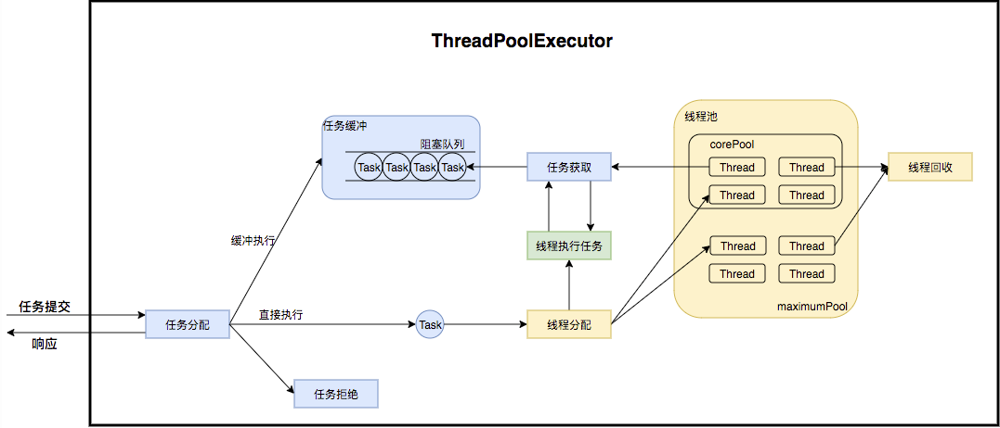

- **handler（拒绝策略）**：当线程池和队列都满时，对新提交任务的处理策略

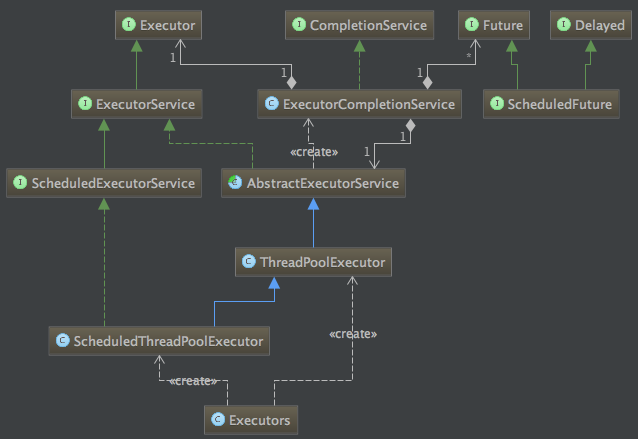

# 2. 线程池的执行流程？拒绝策略有哪些？

**执行流程（任务提交时的判断顺序）：**

```
当前线程数 < corePoolSize → 创建核心线程执行该任务
当前线程数 >= corePoolSize → 尝试入队
队列满且线程数 < maximumPoolSize → 创建临时线程（从队列取任务执行）
队列满且线程数 = maximumPoolSize → 执行拒绝策略
```

**关键点：**

- 核心线程创建时，任务直接绑定给该线程执行（**不进队列**）
- 入队后，工作线程通过**take()阻塞获取**任务循环执行
- 临时线程通过**poll(keepAliveTime, unit)**限时获取，超时返回null后被回收
- 使用**无界队列**时，maximumPoolSize参数无效，线程数不会超过corePoolSize

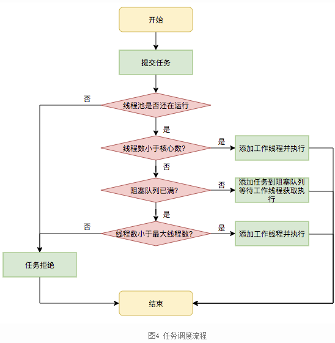

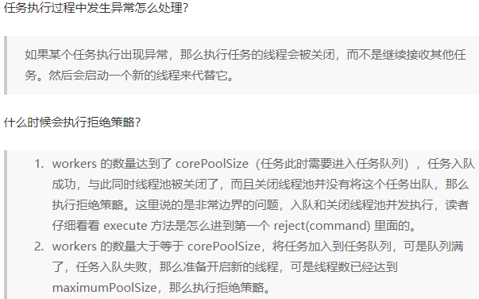

**四种拒绝策略（全部实现RejectedExecutionHandler接口）：**

- **AbortPolicy（默认）**：直接抛出RejectedExecutionException异常，阻止系统继续提交
- **CallerRunsPolicy**：由提交任务的调用者线程自己执行该任务（不经过线程池），提供降级能力
- **DiscardPolicy**：静默丢弃任务，不抛异常，允许任务丢失
- **DiscardOldestPolicy**：丢弃队列中最老（队首）的任务，然后重新尝试提交当前任务

此外，也可自定义拒绝策略实现RejectedExecutionHandler接口。

# 3. 线程池有哪些状态？如何优雅关闭线程池？

**线程池的五种状态：**

| 状态 | 说明 |
| --- | --- |
| **RUNNING** | 接收新任务，处理队列任务 |
| **SHUTDOWN** | 不接收新任务，继续处理队列任务 |
| **STOP** | 不接收新任务，不处理队列，中断执行中的任务 |
| **TIDYING** | 所有任务终止，workerCount=0 |
| **TERMINATED** | terminated()钩子方法执行完毕 |

**状态转换：**

```
RUNNING → SHUTDOWN（调用shutdown()）
RUNNING/SHUTDOWN → STOP（调用shutdownNow()）
SHUTDOWN → TIDYING（队列和池都为空）
STOP → TIDYING（池为空）
TIDYING → TERMINATED（执行terminated()）
```

**ctl原子变量：** 线程池使用一个int变量ctl同时维护**运行状态（高3位）**和**线程数量（低29位）**，通过位运算实现无锁原子操作。


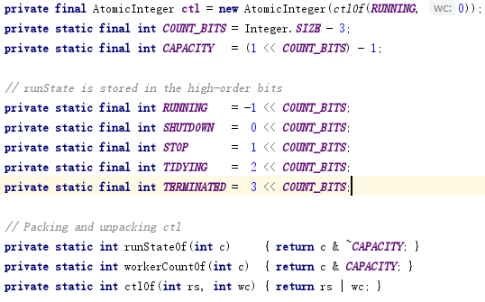

**优雅关闭的标准流程：**

1. **shutdown()**：不再接收新任务，已提交的任务（队列中+正在执行）全部执行完
2. **awaitTermination(超时)**：阻塞等待线程池关闭，返回true表示已终止
3. **超时后降级shutdownNow()**：尝试中断正在运行的任务，丢弃队列中未执行的任务并返回列表
4. **再次awaitTermination**：等待强制中断完成
5. **捕获InterruptedException并恢复中断位**

```java
executor.shutdown();
if (!executor.awaitTermination(60, TimeUnit.SECONDS)) {
    executor.shutdownNow();
    if (!executor.awaitTermination(60, TimeUnit.SECONDS)) {
        // 记录日志：线程池未能终止
    }
}
```

**shutdown()的7步完整流程：**

1. **CAS修改状态**：从RUNNING → SHUTDOWN
2. **停止接收新任务**：后续execute/submit直接触发拒绝策略
3. **中断空闲线程**：遍历工作线程，tryLock成功的（阻塞在getTask上）发中断唤醒退出；tryLock失败的（正在干活）不中断，让任务跑完
4. **继续执行队列剩余任务**：工作线程持续从队列取任务执行，直到队列清空
5. **队列空后线程逐个消亡**：线程取不到任务退出循环
6. **所有线程消亡 → TIDYING**：线程数为0，触发钩子terminated()
7. **最终切换为TERMINATED**：线程池彻底终止

**shutdownNow()的5步流程：**

1. **CAS修改状态**：RUNNING → STOP
2. **拒绝新任务**：不再接收
3. **中断所有工作线程**：不区分空闲/忙碌，全部interrupt
4. **丢弃队列剩余任务并返回列表**：不再执行未处理的任务
5. **直接过渡到TIDYING → TERMINATED**

**interruptIdleWorkers vs interruptWorkers：**

- **interruptIdleWorkers**（shutdown调用）：遍历Worker，tryLock成功才中断——正在执行任务的Worker持有锁，不会被中断，保证优雅
- **interruptWorkers**（shutdownNow调用）：遍历Worker直接interrupt，不管是否持有锁，强制中断

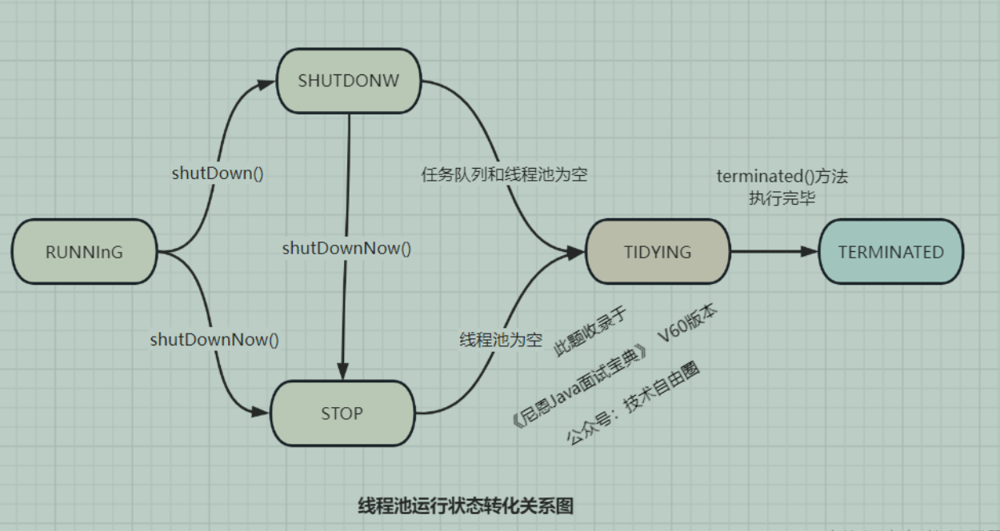

# 4. 线程池如何实现线程复用的？Worker的设计是怎样的？

**Worker的设计：**

Worker实现了Runnable接口并继承了AQS（AbstractQueuedSynchronizer），采用**独占非可重入**模式：

```java
class Worker extends AbstractQueuedSynchronizer implements Runnable {
    final Thread thread;         // 实际执行任务的线程
    Runnable firstTask;           // 初始任务（核心线程创建时绑定的任务）
    volatile long completedTasks; // 完成任务数
}
```

**runWorker循环（线程复用的核心）：**

```java
while (task != null || (task = getTask()) != null) {
    w.lock();  // 加锁，防止shutdown中断正在执行的任务
    task.run();
    w.unlock();
}
processWorkerExit(...);  // 线程退出
```

**getTask机制（区分核心线程和临时线程）：**

- **核心线程**：调用`workQueue.take()`，**阻塞等待**，永不超时，所以核心线程会一直存活
- **临时线程**：调用`workQueue.poll(keepAliveTime, unit)`，**限时等待**，超时返回null，线程退出runWorker循环后被回收


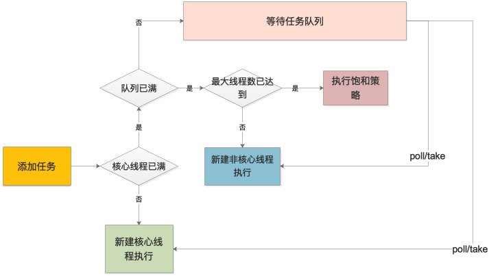

**Worker继承AQS（独占非可重入）的原因：**

shutdown时会调用`interruptIdleWorkers()`遍历所有Worker，先**tryLock**尝试获取锁。获取不到说明该Worker正在执行任务（已持有锁），**不会中断**；获取到则说明Worker空闲（阻塞在getTask上），对其发起中断。这样确保**正在执行的任务不会被中断**，体现了shutdown的优雅性。shutdownNow不走tryLock，直接中断所有Worker。

**线程回收机制：**

线程池对线程的销毁依赖**JVM自动回收**。Worker无法从getTask获取到任务时，runWorker循环结束，调用processWorkerExit从workers集合中移除自身引用，线程自然结束被JVM回收。

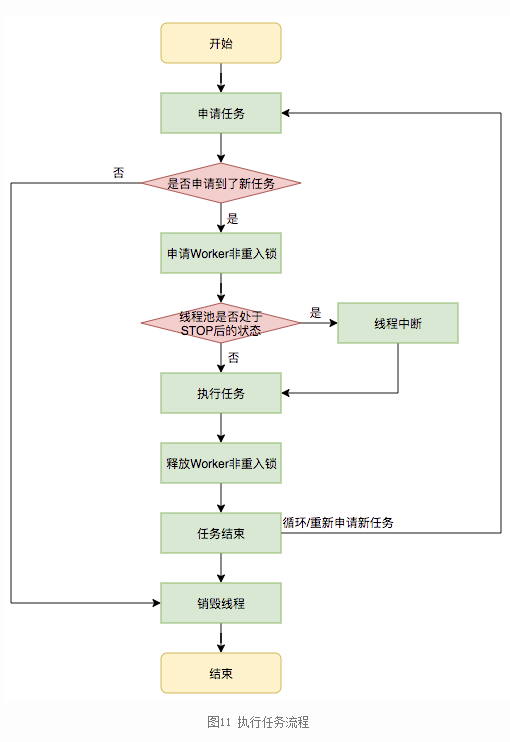

# 5. Executors提供了哪些工厂方法？各自的特点和适用场景？

Executors提供了4种常用线程池工厂方法：

- **newFixedThreadPool(n)**：固定大小线程池，corePoolSize=maximumPoolSize=n，keepAliveTime=0s，使用**无界LinkedBlockingQueue**。线程数固定，所有线程繁忙时任务进入队列无限等待。**适用：执行长期任务，负载较重的场景**
- **newCachedThreadPool()**：可缓存线程池，corePoolSize=0，maximumPoolSize=Integer.MAX_VALUE，keepAliveTime=60s，使用**SynchronousQueue**。新任务到来时如果有空闲线程就复用，没有则创建新线程，空闲60s后回收。**适用：大量短期异步任务，负载较轻的服务器**
- **newSingleThreadExecutor()**：单线程池，corePoolSize=maximumPoolSize=1，使用**无界LinkedBlockingQueue**。保证所有任务按提交顺序串行执行。**适用：需要任务顺序执行的场景**
- **newScheduledThreadPool(n)**：定时线程池，使用**DelayedWorkQueue**，支持定时和周期性任务。**scheduleAtFixedRate**以上一个任务**开始**计时，period到后立即执行（若上一任务未完成则等待完成后立即执行）；**scheduleWithFixedDelay**以上一个任务**结束**开始计时。**适用：周期性执行任务的场景**

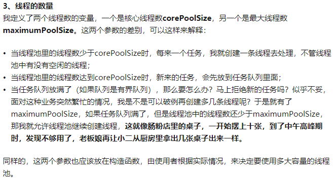

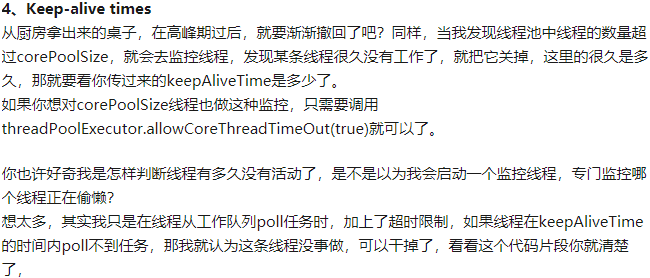

- **newWorkStealingPool()**：底层是ForkJoinPool，使用所有可用处理器。**适用：计算密集型并行任务**

**生产环境建议：**

- 不使用Executors默认工厂方法（尤其是FixedThreadPool和SingleThreadExecutor使用无界队列，可能OOM）
- 手动new ThreadPoolExecutor并明确参数
- 使用Guava的ThreadFactoryBuilder自定义线程名

# 6. 线程池的大小如何估算？如何通过压测确定最优参数？

**理论估算公式：**

- **CPU密集型任务**：线程数 = **CPU核数 + 1**（+1防止页缺失导致CPU空转）
- **IO密集型任务**：线程数 = **CPU核数 × (1 + 等待时间/计算时间)**，由于IO等待时间远大于计算时间，通常配置较多线程

实际生产中很难精确计算，推荐**动态线程池 + 压测**的方式来确定最优参数。

**二分法压测流程：**

1. 确定目标并发数（如512）
2. 第一次压测设置线程数为512，观察CPU、TPS、响应时间
3. 如果系统无压力，下次尝试1024；如果有压力，下次尝试256
4. 通过**逐渐逼近**，找到当前接口的最佳线程数

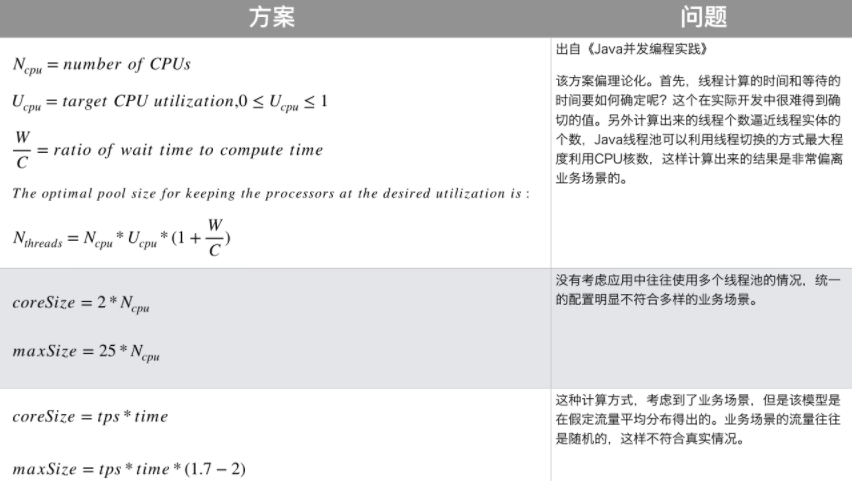

# 7. 如何实现线程池参数的动态调整？如何监控线程池？

**ThreadPoolExecutor原生支持动态修改三个核心参数：**

- **setCorePoolSize()**：动态调整核心线程数
- **setMaximumPoolSize()**：动态调整最大线程数
- **setKeepAliveTime()**：动态调整空闲存活时间

**动态化设计方案：**

```
配置中心（Apollo/Nacos） → 监听配置变更 → 回调set方法 → 参数即时生效
```

将线程池配置从代码迁移到分布式配置中心，修改配置后实时生效，缩短故障恢复时间。

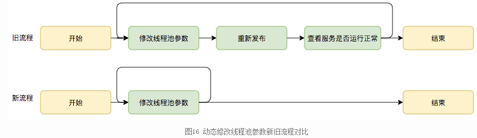

**监控指标：**

ThreadPoolExecutor 内置大量**原子监控指标**，无需额外侵入代码，直接调用方法即可实时监控：

**线程维度指标：**

- getCorePoolSize()：核心线程数（配置值）
- getMaximumPoolSize()：最大线程数（配置值）
- getPoolSize()：当前池内工作线程总数（核心+非核心）
- getActiveCount()：正在执行任务的活跃线程数（**最重要**）
- getLargestPoolSize()：历史达到过的最大线程数

**任务 & 队列积压指标：**

- workQueue：阻塞队列对象，可直接查队列积压
- workQueue.size()：当前队列积压任务数
- getCompletedTaskCount()：已完成的任务总数
- getTaskCount()：已提交的总任务数（执行中+队列中+已完成）
- 拒绝次数：触发拒绝策略的次数，可通过包装ThreadPoolExecutor或自定义RejectedExecutionHandler统计

**生产级监控方案：**

1. **定时健康巡检**：通过ScheduledExecutorService每5s/10s采集指标，日志打印或上报
2. **Micrometer + Prometheus + Grafana**：暴露线程池指标，可视化看板展示线程数曲线、队列积压曲线
3. **自定义告警规则**：
   - 队列积压 > 阈值（如200）：告警任务堆积
   - activeCount达到最大线程数：告警线程池耗尽
   - 拒绝次数 > 0：紧急告警，服务处理能力不足

# 8. ForkJoinPool的原理是什么？工作窃取是如何实现的？

**核心思想：分治 + 并行**

```
大任务 → Fork（递归拆分）→ 小任务（到阈值停止）→ 并行执行 → Join（合并结果）
```

ForkJoinPool是JDK7引入的并行计算框架，核心思想是**分治 + 并行**。本质上也是线程池，但任务模型与ThreadPoolExecutor完全不同——线程池任务可以递归拆分子任务，自带工作窃取调度。

**Work-Stealing（工作窃取）机制：**

1. 每个工作线程维护一个**独立的双端任务队列**
2. 由父任务fork出的子任务被push到该线程对应的任务队列
3. 线程以**LIFO（后进先出）**方式pop自己的任务队列（优先处理最新fork出的子任务）
4. 当自己队列为空时，**随机**从其他线程的队列尾部**窃取**任务（FIFO方式，take操作）
5. 窃取时从队列另一端操作，**减少竞争**
6. 所有线程都空闲时阻塞等待新任务，直到有任务从上层添加进来

**ForkJoinTask的两种子类：**

- **RecursiveTask**：有返回结果的任务
- **RecursiveAction**：无返回结果的任务

**与ThreadPoolExecutor对比：**

| 特性 | ForkJoinPool | ThreadPoolExecutor |
| --- | --- | --- |
| 任务队列 | 每个线程独立双端队列 | 全局共享队列 |
| 任务关系 | 父子拆分 | 独立任务 |
| 工作窃取 | 支持 | 不支持 |
| 适用场景 | **计算密集型**（递归、排序、分块） | IO密集型、普通业务 |
| 阻塞IO | 不适合（工作线程阻塞时无法被窃取） | 适合 |

**适用场景：** 大规模递归计算、归并排序、大数据分片统计、海量数据遍历
**不适用的场景：** 阻塞IO操作（工作线程阻塞时无法被窃取，会导致线程浪费）

# 9. 线程池耗尽的原因是什么？可能产生哪些影响？

**原因：**

- **请求耗时过长**：业务代码执行慢（如慢查询、远程调用超时），线程长时间被占用无法释放
- **任务处理速度 < 提交速度**：新请求不断到达，线程池排队积压，最终撑满队列和线程
- **使用无界队列**：任务无限堆积，内存持续增长直到OOM
- **核心参数配置不合理**：corePoolSize/maximumPoolSize设置过小

**影响：**

- **请求超时、服务假死**：新请求无法获得线程，响应超时，系统表现为不可用
- **内存消耗持续增加**：无界队列下任务无限堆积，最终OOM
- **拒绝服务**：有界队列满 + 线程数达上限后，触发拒绝策略

**预防措施：**

- 使用**有界队列**，明确队列容量上限
- 合理配置corePoolSize和maximumPoolSize，结合压测确定
- 监控线程池关键指标（活跃线程数、队列积压），设置告警
- 业务代码设置**超时机制**（数据库/HTTP调用），防止线程长时间阻塞

# 10. 什么是线程池线程泄露？如何防范？

**核心定义：** 线程池中的工作线程被永久占用、无法回收复用，导致线程池可用线程越来越少，最终所有线程全部卡死，提交新任务时阻塞或抛出RejectedExecutionException。**本质是线程执行任务时永久阻塞，任务永远不结束，线程无法归还线程池。**

> 注意：任务抛出未捕获异常导致Worker退出，这不算真正的"泄露"——线程池会尝试自动补充新Worker。真正的泄露是**线程还活着但卡死了**。

**典型产生场景：**

1. **任务内无限阻塞（最常见）**
   - 无超时的同步网络请求、DB查询、RPC调用
   - `Lock.lock()` 忘记 `unlock()`；CountDownLatch 永远不 countDown
   - 无限等待阻塞队列、等待外部信号永不返回
2. **任务内部无限循环无退出条件**
   - `while(true)` 没有 break/return 逻辑
   - 线程死循环占用，永不释放
3. **跨线程池互相等待（线程池死锁）**
   - 线程池A的任务等待线程池B的任务结果，B又等待A，双方线程全部阻塞
4. **使用无界阻塞队列 + 任务内部长时间阻塞**
   - 任务堆积不触发拒绝策略，但线程慢慢全部卡死

**后果：**

- 核心线程全部耗尽，新任务提交阻塞或RejectedExecutionException
- 服务响应超时，严重时只能重启恢复

**如何防范：**

1. **所有阻塞操作加超时（最关键）**
   - 锁用 `tryLock(time, unit)` 替代无参 `lock()`
   - CountDownLatch/Semaphore 用 `await(time, unit)`
   - 数据库/HTTP/RPC 调用设超时
   - Future 用 `get(timeout, unit)`，禁止无参 `get()`
2. **资源在finally中释放**

   ```java
   if (lock.tryLock(3, TimeUnit.SECONDS)) {
       try {
           doBiz();
       } finally {
           lock.unlock();
       }
   }
   ```
3. **循环任务加退出条件**：增加最大执行时长或退出标记
4. **监控线程池活跃线程数**：activeCount 持续等于 maximumPoolSize + 队列持续堆积 → 大概率线程泄露
5. **合理配置线程池参数**：使用有界队列，拒绝策略配合告警
6. **避免跨线程池循环等待**：使用回调或异步消息解耦
7. **设置** `allowCoreThreadTimeOut(true)`：空闲超时后回收线程，减少常驻占用

# 11. submit()和execute()有什么区别？

| 对比维度 | execute() | submit() |
| --- | --- | --- |
| 返回值 | void，无返回结果 | 返回Future，可获取执行结果 |
| 异常处理 | 异常直接抛给线程，线程可能退出 | 异常封装在Future中，调用get()时抛出，线程内部安全 |
| 参数类型 | Runnable | Runnable / Callable（可有返回值） |
| 底层实现 | 直接调用addWorker或入队 | 将Runnable/Callable包装成FutureTask，再调用execute |

**使用建议：** 使用submit()获取Future来捕获任务异常，避免异常逃逸导致线程退出。

# 12. 如何处理线程池中的任务执行异常？

**异常处理方案：**

- **方案1：任务内部try-catch**：最基础的方式，在run()或call()方法内捕获所有异常，记录日志或兜底处理
- **方案2：通过Future.get()捕获**：submit()提交任务后，调用Future.get()会抛出ExecutionException（包装原始异常），通过get()的时机捕获处理
- **方案3：重写afterExecute钩子**：继承ThreadPoolExecutor覆盖afterExecute(Runnable r, Throwable t)方法，当任务执行完毕（正常或异常）都会回调。execute提交时异常在t参数中；submit提交时异常被Future捕获不传递到t，需通过Future.get获取
- **方案4：UncaughtExceptionHandler**：通过自定义ThreadFactory设置线程的UncaughtExceptionHandler，处理线程因未捕获异常退出时的兜底逻辑

# 13. Thread.interrupted()和thread.isInterrupted()有什么区别？

| 对比维度 | Thread.interrupted() | thread.isInterrupted() |
| --- | --- | --- |
| 方法类型 | **静态方法** | **实例方法** |
| 作用对象 | 当前正在执行的线程 | 调用该方法的指定线程对象 |
| 是否清标志 | 调用后**立刻清空中断标记**重置为false | **只查询，不修改、不清空** |
| 使用场景 | 捕获中断后手动清除，自己处理中断逻辑，不让上层感知 | 判断线程是否被中断，不改变状态，常用于循环退出判断 |

**注意：** sleep()/wait()/join()抛出InterruptedException后，JVM会自动清空中断标记，catch块中通常要手动调用Thread.currentThread().interrupt()恢复中断位，将中断信号向上传递。

