# 1. 同步、异步、阻塞、非阻塞的区别

**同步 vs 异步（消息通信机制）：**

- **同步**：发出调用后，没得到结果前调用不返回，调用者主动等待结果
- **异步**：发出调用后直接返回，结果通过状态、通知或回调返回

**阻塞 vs 非阻塞（等待结果时的状态）：**

- **阻塞**：结果返回前当前线程被挂起
- **非阻塞**：不能立即得到结果时不会阻塞当前线程

**经典例子（烧水）：**

```
同步阻塞：把壶放火上，立等水开（什么也不干）
同步非阻塞：把壶放火上，去看电视，时不时去看水开没
异步阻塞：把响水壶放火上，立等水开（响水壶会响）
异步非阻塞：把响水壶放火上，去看电视，水开了壶会响
```

**两种维度，四种组合：**

- **同步阻塞**：调用后等待，且线程被挂起 — 传统BIO
- **同步非阻塞**：调用后立即返回，但需轮询 — NIO（多路复用）
- **异步阻塞**：发起异步调用后等待结果（实际极少见）
- **异步非阻塞**：发起调用立即返回，完成后回调通知 — AIO

**注意：** 阻塞/非阻塞关注的是数据是否就绪、线程是否等待；同步/异步关注的是访问数据的方式——同步需要主动读写（过程仍可能阻塞），异步由内核完成数据读写后通知。

# 2. 五种IO模型

UNIX下五种IO模型：

**阻塞式IO**：系统调用到返回全程阻塞。传统socket默认模式，accept/read均阻塞直到数据就绪并拷贝完成。

**非阻塞式IO**：立即返回错误或成功，用户需不断轮询（占用大量CPU）。

**IO多路复用**：通过select/poll/epoll管理多个fd，阻塞在select上而非具体IO调用，一个线程监听大量连接。

**信号驱动IO（SIGIO）**：数据准备好时发信号通知，用户再发起read拷贝数据（实际使用较少）。

**异步IO（AIO）**：发起调用后立即返回，内核完成数据准备和拷贝后通知用户，全程不阻塞。

**IO两个阶段：**
1. **等待数据准备好**（数据从网卡到内核缓冲区）
2. **从内核向进程复制数据**（内核缓冲区到用户缓冲区）

BIO在阶段1和阶段2都阻塞；非阻塞IO在阶段1不阻塞（立即返回），阶段2阻塞；IO多路复用阻塞在select上，但阶段2同样阻塞；只有AIO两个阶段都不阻塞。

# 3. BIO、NIO、AIO的区别

| 特性 | BIO | NIO | AIO |
|------|-----|-----|-----|
| 模型 | 同步阻塞 | 同步非阻塞（多路复用） | 异步非阻塞 |
| 线程 | 一个连接一个线程 | 一个线程管理多个连接（Selector） | 回调通知，不需用户线程等待 |
| 复杂度 | 简单 | 中等 | 复杂 |
| 适用场景 | 连接少、低并发 | 连接多、高并发 | 连接极多、高并发（但Linux下不优于NIO） |

**BIO：**
- ServerSocket.accept()阻塞，Socket.read()阻塞
- 每个连接需要一个独立线程处理
- 连接数少时简单直接，高并发下线程爆炸

**NIO（JDK 4+）：**
- 核心三组件：**Buffer**、**Channel**、**Selector**
- 一个Selector线程可管理成千上万个Channel
- Java NIO实质是**IO多路复用模型**，不是NIO模型

**AIO（JDK 7+，NIO 2.0）：**
- 提供文件/网络套接字的异步操作，通过回调机制通知
- Linux下用epoll模拟，Windows下通过IOCP实现真正异步
- Netty移除了AIO支持（Linux下性能不优于NIO，且编程复杂度高）

# 4. NIO三大核心组件


**Buffer（缓冲区）：**

Buffer本质是内存中的一块，用于读写数据。核心的Buffer实现是ByteBuffer。

**Channel（通道）：**

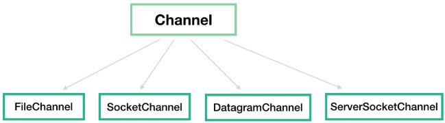

- **FileChannel**：文件通道
- **SocketChannel**：TCP客户端连接通道
- **ServerSocketChannel**：TCP服务端，监听端口，接收连接后创建SocketChannel处理
- **DatagramChannel**：UDP收发通道

注意：SocketChannel和ServerSocketChannel默认是**阻塞**的，需通过`configureBlocking(false)`设为非阻塞。FileChannel不支持非阻塞。

**Selector（多路复用器）：**

Selector建立在非阻塞基础上，用于实现一个线程管理多个Channel。

```java
Selector selector = Selector.open();
channel.configureBlocking(false);
channel.register(selector, SelectionKey.OP_READ);

while (true) {
    selector.select();  // 阻塞直到有事件就绪
    Set<SelectionKey> keys = selector.selectedKeys();
    for (SelectionKey key : keys) {
        if (key.isReadable()) {
            SocketChannel sc = (SocketChannel) key.channel();
            ByteBuffer buf = ByteBuffer.allocate(1024);
            sc.read(buf);
        }
    }
}
```

四种监听事件：**OP_READ**（读就绪）、**OP_WRITE**（写就绪）、**OP_CONNECT**（连接建立）、**OP_ACCEPT**（新连接到达）。

# 5. Buffer核心属性

| 属性 | 说明 |
|------|------|
| **capacity** | 缓冲区容量，创建后不可变 |
| **position** | 下一个要读/写的位置，初始为0 |
| **limit** | 写模式=capacity，读模式=实际数据大小 |
| **flip()** | 从写模式切换为读模式，position置0，limit设为原position |
| **clear()** | 清空缓冲区，position=0，limit=capacity，准备重新写 |
| **compact()** | 压缩未读数据到开头（处理不完整数据时有用） |
| **rewind()** | 重置position为0，重新从头读写 |
| **mark()/reset()** | 临时标记位置后恢复 |

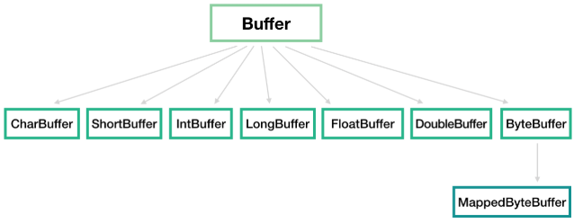

**Buffer读写切换流程：** 写入数据 → 调用flip()切换为读模式 → 读取数据 → 调用clear()或compact()准备下次写入。

# 6. select、poll、epoll的区别

| 特性 | select | poll | epoll |
|------|--------|------|-------|
| 数据结构 | bitmap | 链表 | 红黑树+就绪链表 |
| 最大连接数 | 1024 | 无限制 | 无限制 |
| 遍历方式 | 全部遍历 | 全部遍历 | **仅遍历就绪fd** |
| 工作模式 | LT | LT | LT/ET |
| 内存拷贝 | 每次拷贝到内核 | 每次拷贝到内核 | **mmap共享内存（零拷贝）** |
| 时间复杂度 | O(n) | O(n) | **O(1)** |

**epoll的核心优势：**

1. **无最大连接限制**：不限制文件描述符数量
2. **回调机制**：fd就绪时注册回调，用户只遍历就绪列表，无需遍历全部fd
3. **mmap共享内存**：避免用户态和内核态之间的数据拷贝

**LT（水平触发） vs ET（边缘触发）：**

- **LT（水平触发）**：fd就绪后如果不处理，会一直通知。select和poll仅支持LT。不易丢失事件，但可能有重复通知
- **ET（边缘触发）**：fd状态变化时通知一次，需要一次性把数据读完。效率更高，但需处理非阻塞读，防止漏读

**epoll工作流程：**
1. **epoll_create**：创建epoll实例
2. **epoll_ctl**：注册/修改/删除要监控的fd
3. **epoll_wait**：等待事件就绪，返回就绪fd列表

# 7. 零拷贝原理

**传统IO流程（4次拷贝 + 4次上下文切换）：**

```
磁盘 → 内核缓冲区(read) → 用户缓冲区 → 内核缓冲区(write) → 网卡（Socket）
```

**零拷贝（2次拷贝 + 2次上下文切换）：**

```java
FileChannel channel = new FileInputStream("file").getChannel();
channel.transferTo(0, channel.size(), socketChannel);
```

```
磁盘 → 内核缓冲区 → 网卡（无需经过用户空间）
```

底层调用**sendfile**系统调用，数据在内核空间直接传输。

**零拷贝的三种实现：**

| 实现 | 说明 |
|------|------|
| **mmap** | 文件映射到内存，减少一次内核到用户空间的拷贝 |
| **sendfile** | 数据直接在内核空间传输，不经过用户空间 |
| **splice** | 在两个文件描述符间移动数据，无需硬件DMA之外的拷贝 |

**适用场景：**
- 文件服务器（Nginx静态文件传输）
- Kafka（消息持久化和网络传输）
- FTP服务器
- 无需对数据做额外处理的场景

**注意：** sendfile零拷贝消除了内核空间与用户空间之间的数据拷贝，所以应用程序无法对数据进行操作。如果需要对数据做处理，应使用**直接内存（DirectBuffer）**。

# 8. 直接内存（DirectBuffer）

通过**DirectByteBuffer**分配的堆外内存，不受JVM堆大小限制（但仍受系统物理内存限制）。

```java
// 分配1MB直接内存
ByteBuffer buffer = ByteBuffer.allocateDirect(1024 * 1024);
```

**与堆内存的区别：**

| 特性 | 堆内存（HeapByteBuffer） | 直接内存（DirectByteBuffer） |
|------|---------|---------|
| 分配位置 | JVM堆 | 系统本地内存 |
| GC回收 | YGC/FGC | 依赖Cleaner机制+虚引用 |
| IO效率 | 需中间拷贝 | **减少一次拷贝（免去堆内→堆外拷贝）**直接操作 |
| 分配速度 | 快 | 较慢（需要系统调用malloc） |
| 内存地址 | GC时可能移动 | 固定不变 |

**直接内存回收机制：**

DirectByteBuffer对象被GC时，其关联的**Cleaner**对象（通过虚引用PhantomReference实现）会调用`unsafe.freeMemory()`释放直接内存。如果直接内存使用过多且GC不及时，可调用`System.gc()`触发Full GC加速回收（但需注意`-XX:+DisableExplicitGC`会禁用显式GC）。

**适用场景：**
- 网络传输大量数据（Netty）
- 文件读写
- 需要共享内存的场景

# 9. AIO原理及Netty移除AIO的原因

**AIO核心流程：**

1. 用户线程调用read系统调用，**立即返回**，不阻塞
2. 内核完成数据准备（网卡→内核缓冲区）和数据复制（内核缓冲区→用户缓冲区）
3. 内核**发送信号或回调**通知用户线程操作完成
4. 用户线程处理用户缓冲区中的数据

**AIO各平台实现：**

| 平台 | 实现方式 |
|------|---------|
| Windows | **IOCP**（真正的异步IO） |
| Linux | **epoll模拟**（非真正的异步IO） |
| Mac OS | **KQueue** |

**为什么Netty移除AIO？**
- **性能原因**：Linux下Java AIO使用epoll模拟，性能并不比NIO（同样是epoll）高
- **编程复杂度**：AIO需要回调嵌套（死亡回调），编程模型复杂
- **不支持UDP**：Java AIO不支持UDP传输

**Linux真正的异步IO——io_uring：**
Linux 5.1+引入了io_uring，是内核原生支持的异步IO引擎，支持文件和socket，性能远超epoll。但目前Java尚未原生集成。

# 10. Socket阻塞场景

**客户端阻塞场景：**
1. **建立连接**：执行Socket构造方法或connect()时阻塞，直到连接成功才返回
2. **读取数据**：从Socket输入流读数据时，如果没有足够的数据就阻塞
3. **写入数据**：向Socket输出流写数据时，可能阻塞直到数据全部写出
4. **关闭连接**：若设置了setSoLinger()延迟关闭，close()会阻塞直到数据发送完或超时

**服务端阻塞场景：**
1. **accept()**：等待客户连接，直到有连接到达才返回
2. **read()**：从Socket输入流读数据，数据不够时阻塞
3. **write()**：向Socket输出流写数据，可能阻塞

**read()阻塞条件（数据"足够"的定义）：**
- `int read()`：只要输入流中有一个字节就算足够
- `int read(byte[] buff)`：读到至少1字节就返回，返回值是实际读到的字节数，不一定等于数组长度
- `readLine()`：只要有一行字符串就算足够（BufferedReader）

**注意：** 当并发操作多、线程切换频繁、CPU负载高时，容易出现SocketInputStream.socketRead0阻塞问题，这并非阻塞在accept()，而是阻塞在获取流数据。

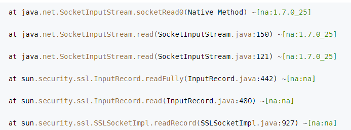

# 11. NIO的高并发处理与局限性

**NIO如何解决BIO的线程瓶颈：**
- NIO由原来的阻塞读写（占用线程）变成**单线程轮询事件**，找到就绪的fd进行读写
- 除了select()轮询是阻塞的，剩余IO操作都是纯CPU操作，无需切换线程
- 线程节约后，因线程切换带来的性能问题也随之解决

**NIO的局限性：**
1. NIO的read/write本身不阻塞，但**业务处理若同步阻塞**（如DB操作、RPC调用），依然会阻塞事件循环，导致其他连接饥饿
2. 解决方式是将耗时业务丢给**线程池**处理，但大量任务堆积又会退化为BIO模型
3. 嵌套回调导致**回调地狱（callback hell）**
4. **轻量级线程（协程/虚拟线程）**：可以从根本上缓解线程切换开销，但不能完全替代NIO。BIO+轻量级线程在处理大量连接时，大量线程仍会阻塞在IO操作上，占用资源，扩展性差。NIO的非阻塞+多路复用模型在处理大量并发连接时仍是更优选择。

5. **轻量级线程的适用场景**：高并发IO密集型应用、协作式多任务处理、无锁并发编程。对CPU密集型任务不适用（不能利用多核优势并行执行）。

# 12. BlockingQueue、SynchronousQueue、Disruptor

**BlockingQueue（阻塞队列）：**

线程安全的队列，支持：
- **put()**：队列满时阻塞等待
- **take()**：队列空时阻塞等待
- 常用于**生产者-消费者**模式、线程池任务队列

常见实现：ArrayBlockingQueue（有界数组）、LinkedBlockingQueue（可选有界链表）、PriorityBlockingQueue（优先级队列）。

**SynchronousQueue（同步队列）：**

一种特殊的BlockingQueue，**容量为0**，不存储任何元素。每个put操作必须等待一个take操作，反之亦然。相当于**线程间直接握手**，没有中间缓冲。

经典使用场景：**ThreadPoolExecutor.newCachedThreadPool()** 的内部工作队列，任务直接交给线程执行，不排队。

**Disruptor（高性能队列）：**

- 由LMAX公司开发的无锁、高性能内存队列
- 核心设计：**环形数组（RingBuffer）** + **无锁CAS** + **预分配内存**（避免GC）
- 支持**单生产者/多消费者**等多种消费模式
- 性能远高于BlockingQueue，适用于超高吞吐场景
- 使用场景：交易系统、日志系统、事件驱动架构

# 13. NIO中SocketChannel.read()返回值的含义及处理

**返回值 -1：** 客户端主动关闭了channel，服务器端应关闭对应的SocketChannel，其会自动从Selector中取消注册。

**返回值 0：**
- ByteBuffer已存满
- Channel中暂无数据可读
- 当前没有数据可读

**返回值 >0：** 正常读取到的字节数，可继续读取直到完整消息。

**异常情况：** 客户端异常关闭（未调用channel.close()退出），会触发OP_READ事件，但read()抛出IOException（如"远程主机强迫关闭了一个现有连接"），此时需关闭服务端对应的channel，否则会不断触发事件。

**注意：** 通过while循环一次读取完数据时，其他事件在循环结束前得不到处理。建议采用**自定义协议**（消息头携带长度信息）或Netty解码器来解决消息边界问题。

# 14. TCP粘包/拆包的原因及解决方案

**粘包/拆包的原因：** TCP是**流式协议**，没有消息边界，上层应用的多条消息可能被合并发送（粘包）或拆分发送（拆包）。

**解决方案：**
- **消息头+消息体**：消息头存储消息长度，服务端先解析头部获取长度，再读取完整内容
- **定长消息**：每次读取固定长度的内容作为一条完整消息，不足时空位补固定字符
- **消息边界**：使用特殊分隔符（如`\n`）标识消息结束
- **自定义协议**：更复杂的协议如车联网808/809协议

# 15. Java NIO的epoll空轮询Bug

**问题表现：** JDK NIO在Linux上基于epoll实现时，`Selector.select()`在没有事件就绪的情况下不阻塞直接返回0，导致**CPU空转100%**。

**原因：** Linux 2.6内核的epoll存在一个已知问题，当socket连接被异常关闭（如RST重置）时，epoll会持续唤醒但不返回有效事件，导致select()无限空轮询。

**Netty的解决方案：** 统计`select()`空轮询次数，当超过阈值（默认512次）时，**重建Selector**，将原Selector上注册的所有channel转移到新Selector上，关闭旧Selector。

# 16. IO读写系统调用的底层原理

用户程序进行IO的读写基本用到read和write两大系统调用。

- **read系统调用**：不是把数据直接从物理设备读到内存，而是把数据从**内核缓冲区复制到进程缓冲区**
- **write系统调用**：不是直接把数据写入物理设备，而是把数据从**进程缓冲区复制到内核缓冲区**
- 这两个系统调用都**不负责数据在内核缓冲区和磁盘之间的交换**，底层读写交换由操作系统kernel内核完成

**缓冲区的作用：** 减少频繁的系统IO调用。系统调用需要保存和恢复进程数据/状态，损耗时间和性能。缓冲区积累到一定数量后再进行IO调用，何时读取和存储由内核决定，用户程序不需要关心。

**IO瓶颈分析：** 一般的IO瓶颈是数据从外部到达网卡，然后DMA读取到内核空间的过程。CPU从内核复制到用户缓冲区相对快速，因此单线程足够去读写数据，瓶颈不在CPU。

**一个典型Java服务端处理网络请求的完整过程：**

1. **客户端请求**：Linux通过网卡读取客户端的请求数据，将数据读取到**内核缓冲区**
2. **获取请求数据**：服务器从**内核缓冲区读取数据到Java进程缓冲区**
3. **业务处理**：Java服务端在自己的用户空间中处理客户端的请求
4. **返回数据**：Java服务端将构建好的响应从用户缓冲区写入系统缓冲区
5. **发送给客户端**：Linux内核通过网络IO将内核缓冲区中的数据写入网卡，网卡通过底层协议发送给客户端

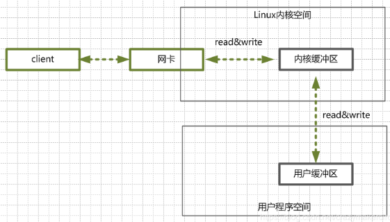

# 17. 阻塞式IO模型（BIO）的详细工作流程

阻塞式IO是指需要内核IO操作彻底完成后，才返回到用户空间执行用户操作。

发起一个blocking socket的read系统调用流程：

1. 用户线程调用**read系统调用**，内核开始IO的第一阶段：**准备数据**。如果数据还没到达（如未收到完整Socket数据包），内核等待足够数据到来
2. 内核等待到数据准备好后，将数据从**内核缓冲区拷贝到用户缓冲区**，然后返回结果
3. 从开始IO读的read系统调用开始，用户线程就**进入阻塞状态**，直到内核返回结果后才解除阻塞

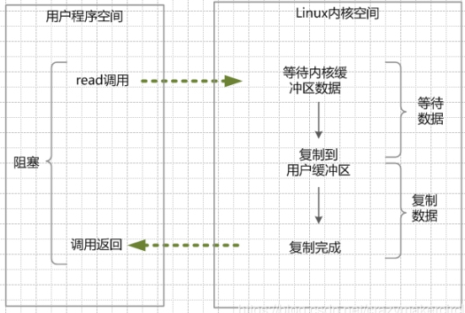

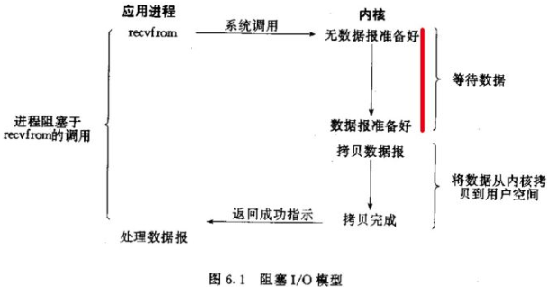

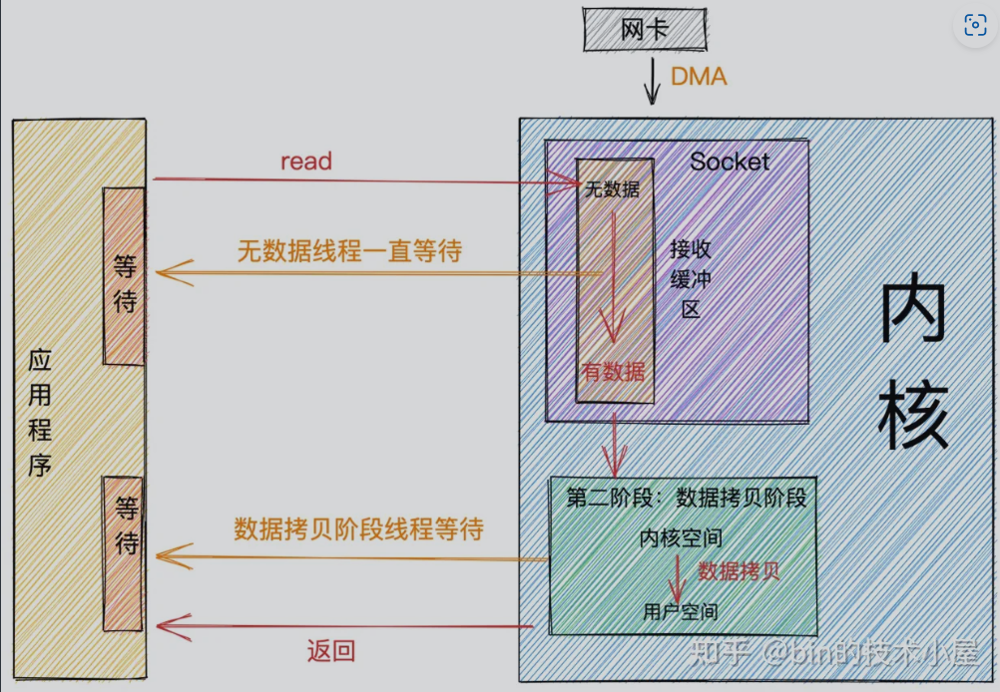

**优点：**
- 程序简单，阻塞等待数据期间用户线程挂起，基本不占用CPU资源

**缺点：**
- 每个连接配套一条独立线程维护IO流读写
- 高并发场景下需要大量线程维护网络连接，内存、线程切换开销巨大
- 高并发场景下基本不可用

# 18. 非阻塞式IO模型（Non-blocking IO）的详细工作流程

非阻塞IO是指用户程序不需要等待内核IO操作完成，内核立即返回状态值，用户空间无需等待IO彻底完成。

发起一个non-blocking socket的read系统调用流程：

1. **内核数据没准备好**时，用户线程发起IO请求**立即返回**。用户线程需要**不断发起IO系统调用**（轮询）
2. **内核数据到达后**，用户线程发起系统调用并**阻塞**，内核开始将数据从内核缓冲区拷贝到用户缓冲区，然后返回
3. 用户线程**解除阻塞**，真正读取到数据

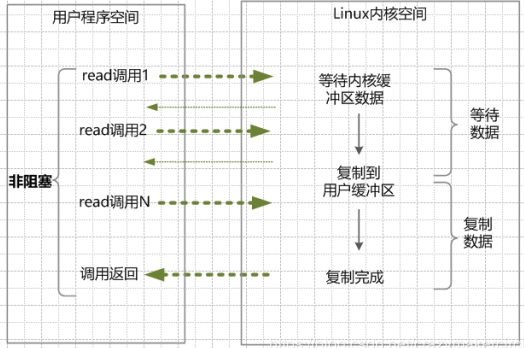

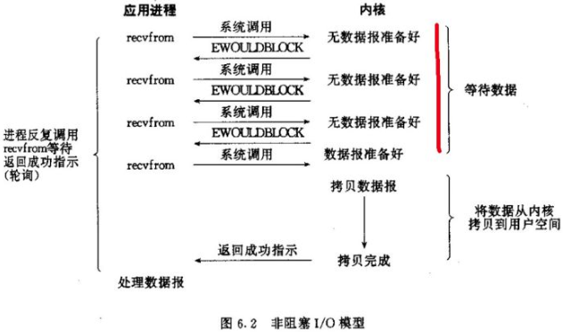

**特点：**
- 应用程序线程需要不断进行IO系统调用，轮询数据是否准备好
- 进程把套接字设置成非阻塞，是通知内核：当所请求的IO操作非得把本进程投入睡眠时，不要投入睡眠，返回一个错误

**优点：** 每次发起的IO系统调用在内核等待数据过程中可以立即返回，用户线程不会阻塞，实时性好

**缺点：** 不断轮询占用大量CPU时间，系统资源利用率低

**注意：** Java NIO（New IO）**不是**IO模型中的NIO模型，而是**IO多路复用模型**（IO multiplexing）。

# 19. IO多路复用模型的详细工作流程

通过一种新的系统调用，一个进程可以监视多个文件描述符，一旦某个描述符就绪（内核缓冲区可读/可写），内核通知程序进行相应IO系统调用。

目前支持的IO多路复用系统调用有**select、epoll**等。select跨平台良好，epoll是Linux 2.6内核提出的select增强版本。

发起多路复用IO的read流程：

1. 进行**select/epoll系统调用**，查询可以读的连接。内核查询所有select的可查询socket列表，当任何一个socket数据准备好，select返回。用户进程调用select时，整个线程被**阻塞在select上**
2. 用户线程获得目标连接后发起**read系统调用**，用户线程**阻塞**。内核将数据从内核缓冲区拷贝到用户缓冲区
3. 用户线程解除阻塞，真正读取到数据

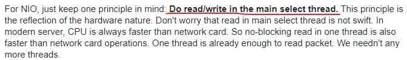

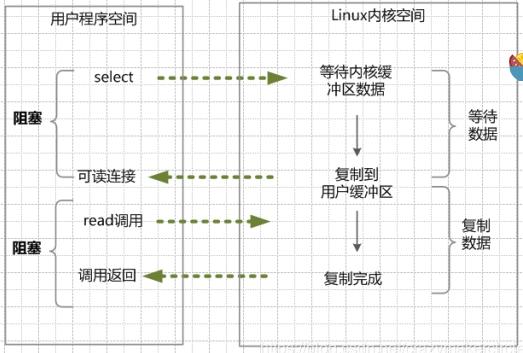

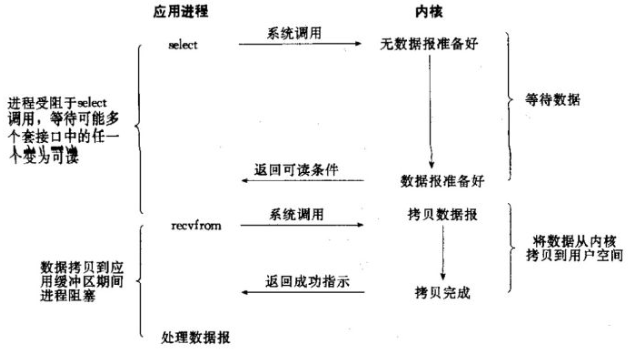

**特点：**
- 建立在操作系统内核的多路分离系统调用（select/epoll）基础上
- 需要用到**两个系统调用**：一个select/epoll查询调用，一个IO读取调用

**优点：**
- 可同时处理**成千上万个连接**
- 系统不必创建线程，不必维护线程，大大减小系统开销
- Java NIO（New IO）使用的就是IO多路复用模型，Linux上使用epoll系统调用

**缺点：**
- select/epoll系统调用属于**同步IO，也是阻塞IO**
- 需要在读写事件就绪后**自己负责读写**，读写过程仍然是阻塞的

# 20. 信号驱动IO模型

数据准备好时发信号通知，用户再发起read拷贝数据。实际使用较少。

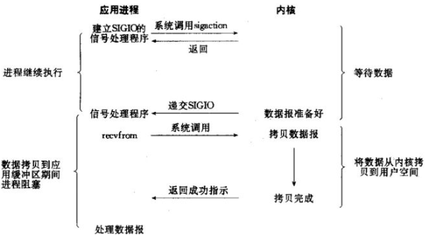

# 21. 异步IO模型（AIO）的详细工作流程

AIO的基本流程：用户线程通过系统调用告知内核启动某个IO操作后立即返回。内核在整个IO操作（包括数据准备、数据复制）完成后通知用户程序。

1. 用户线程调用**read系统调用**，**立即返回**，不阻塞，可以去做其他事
2. 内核开始IO的第一个阶段：**准备数据**（数据从网络物理设备/网卡读取到内核缓冲区）
3. 内核将数据从内核缓冲区拷贝到用户缓冲区后，**发送信号或回调**用户线程注册的回调接口，通知read操作完成
4. 用户线程读取用户缓冲区的数据，完成后续业务操作

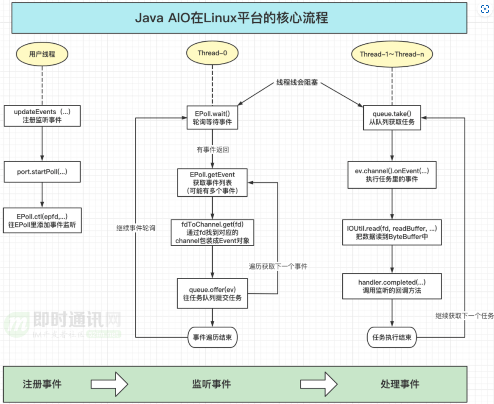

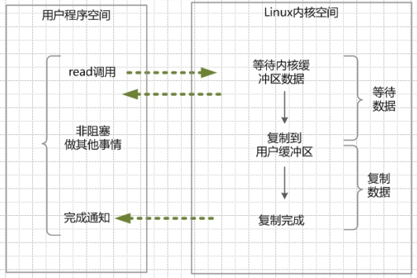

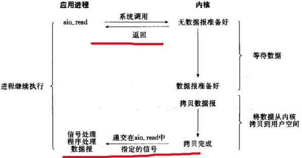

**特点：**
- 在内核的**等待数据和复制数据两个阶段**，用户线程都**不阻塞**
- 用户线程需要接受内核的IO操作完成的事件，或注册IO操作完成的回调函数到内核
- 异步IO有时也叫做**信号驱动IO**（广义）

**缺点：**
- 需要完成事件的注册与传递，需要底层操作系统提供大量支持
- Windows下通过**IOCP**实现了真正的异步IO，但Windows很少作为高并发服务器使用
- Linux下异步IO模型在2.6版本才引入，目前并不完善，所以Linux下高并发仍以IO多路复用为主

**各平台AIO实现差异：**

| 平台 | 实现方式 |
|------|---------|
| Windows | **IOCP**（真正的异步IO） |
| Linux | **epoll模拟**（非真正异步IO） |
| Mac OS | **KQueue** |

**AIO死亡回调问题：** AIO的每次IO读写三个事件是一次性的，处理完事件后本次流程结束，要继续下次IO读写需从头再来一遍。这导致回调方法里再添加下一个回调方法的死亡回调（callback hell），编程复杂度大大提高。

# 22. DMA与异步操作的硬件基础

拥有DMA功能的硬件（硬盘、光驱、网卡、声卡、显卡）在和内存进行数据交换时**可以不消耗CPU资源**。CPU只需在发起数据传输时发送一个指令，硬件就开始自己和内存交换数据，传输完成后触发中断通知操作完成。**这些无须消耗CPU时间的IO操作正是异步操作的硬件基础**。即使在DOS这样的单进程系统中也同样可以发起异步的DMA操作。

# 23. 异步与多线程的区别

- **多线程**：对CPU剩余劳动力的压榨，是一种**技术**，强调**并发**（如Web Server处理大量并发请求）
- **异步**：强调**非阻塞**，是一种**编程模式（pattern）**，主要解决响应被阻塞的问题，可借助线程技术或硬件本身的计算能力解决

并发与并行区别：并发是逻辑上的同时发生（交替执行），并行是物理上的同时执行（多核）。

# 24. Linux异步IO现状与io_uring

**为什么Linux没有真正的异步IO模型？**

- Linux下的**Posix AIO**由glibc在user space用**多线程+同步阻塞IO模拟**，效率远不如epoll
- Linux内核有自己的**AIO ABI（io_submit）**，但和Posix AIO API不兼容，且只支持以指定标识（O_DIRECT）打开的文件，不支持socket句柄等

**Linux上的IO方案对比：**

| 方案 | 说明 |
|------|------|
| 同步IO | 传统读写，线程阻塞 |
| POSIX AIO | glibc多线程+同步阻塞模拟，效率低 |
| Linux AIO（io_submit） | 只支持O_DIRECT文件，不支持socket |
| **io_uring**（Linux 5.1+） | 内核原生异步IO引擎，支持文件和socket，性能远超epoll，未来趋势 |

**注意：** 异步和同步的唯一区别是使用方式不一样，一个阻塞线程，一个不阻塞线程。并不是异步IO性能一定比同步IO优秀。如果磁盘性能就那样，用同步IO也能把它压榨完。性能差时需要分析IO链路和数据拷贝次数，而不是单纯认为异步一定优于同步。

# 25. SelectionKey详解

SelectionKey封装了Channel和Selector的信息，以及一个**Interest Set**（感兴趣的事件集合）。

**四种监听事件：**

- **OP_READ**（00000001，1）：通道中有数据可以进行读取
- **OP_WRITE**（00000100，4）：可以往通道中写入数据
- **OP_CONNECT**（00001000，8）：成功建立TCP连接
- **OP_ACCEPT**（00010000，16）：接受TCP连接

可以同时监听多个事件，如同时监听ACCEPT和READ事件，指定参数为二进制的00010001即十进制17。

**NIO中OP_WRITE写就绪事件详解：**

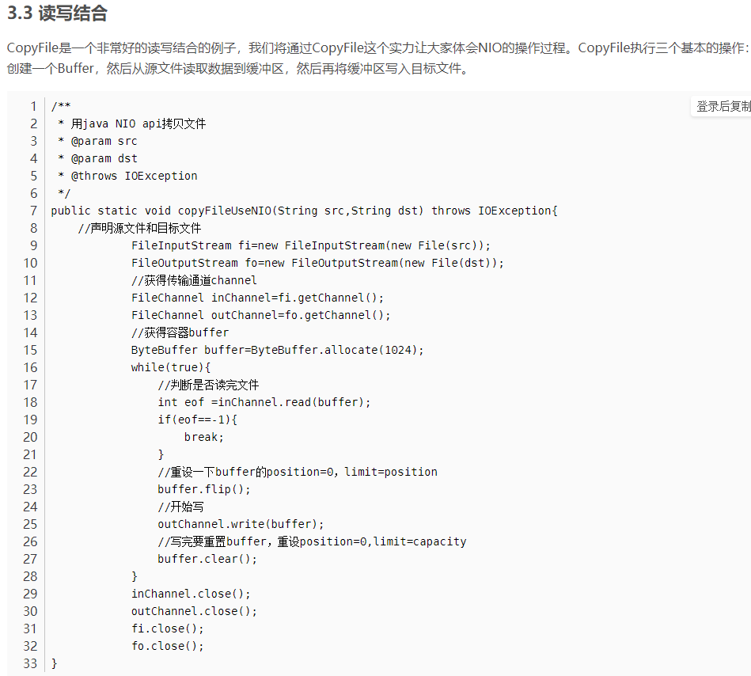

通道变成writable的情况：

1. 通道第一次被注册到Selector中时，如果注册了写就绪事件，对应的SelectionKey状态会变成可写
2. 之前的写操作造成了阻塞，现在通道有更多的空间可写时触发
3. 非阻塞模式下，通道随时可能处于可写就绪状态

**注意：** 写操作完成后，可能需要再次将通道注册为写就绪事件，以便在下次写操作就绪时得到通知。对于写操作，应该在写不出去的时候对写事件感兴趣；对于读操作，在完成连接和系统无法承载新读入的数据时；对于accept，一般是服务器刚启动时；对于connect，一般是connect失败需要重连或异步调用connect时。

**大文件发送的处理：** 如果一次性发送整个文件（通过while循环不间断发送分组包），主线程会阻塞，其他用户无法响应。应通过WRITE事件每次发送一个块（如4K字节），发完后继续等待WRITE事件出现，依次处理，直到整个文件发送完毕，这样不会阻塞其他用户。

# 26. NIO线程分工模型

单线程处理IO效率确实高，没有线程切换，只是拼命读、写、选择事件。但现代服务器一般是多核处理器，可以利用多核心进行IO：

**推荐的线程分工：**

1. **事件分发器**：单线程选择就绪的事件
2. **IO处理器**：包括connect、read、write等纯CPU操作，一般开启**CPU核心个数**线程
3. **业务线程**：业务逻辑处理，可能有阻塞IO（DB操作、RPC等），只要有阻塞就需要单独线程

**同一channel的select不能被并发调用：** Java的Selector在Linux上有一个限制，如果有多个IO线程，必须保证一个socket只能属于一个IoThread，而一个IoThread可以管理多个socket。

**连接处理与读写分离：** 连接的处理和读写的处理通常可以选择分开，这样对于海量连接的注册和读写就可以分发。

**NIO的优势总结：** NIO的优势是"能够省下线程干等IO时的浪费"。如果业务场景中这是主要痛点，改用NIO会起到不错效果。但不要指望用了之后用户请求延迟会明显变小，也不要指望系统吞吐能明显增大（如果系统有另外的性能瓶颈如DB）。

**IO多路复用的最佳适用场景：**
- 处理消耗对比IO几乎可以忽略不计时，可以处理大量并发IO，不消耗太多CPU/内存
- 典型例子：**nginx做代理**，代理转发逻辑相对简单直接，IO多路复用很适合
- 适合处理**大量闲置的IO**，IO socket数量增加不带来进程/线程数增加
- IO多路复用+单进（线）程可避免并发编程的各种问题（如nginx、redis）

**IO多路复用的局限：**
- 如果做不到"处理过程相对于IO可以忽略不计"，IO多路复用不一定比线程池方案更好
- Java Web服务中JDBC是BIO的，无法做到全部NIO化，需用Vert.X等纯NIO框架

# 27. 阻塞、非阻塞、同步、异步的本质区别总结

**阻塞/非阻塞：** 关注进程/线程要访问的数据是否就绪，进程/线程是否需要等待

**同步/异步：** 关注访问数据的方式。**同步**需要主动读写数据，在读写数据过程中还是会阻塞；**异步**只需要IO操作完成的通知，并不主动读写数据，由操作系统内核完成数据的读写

**总结：** Java BIO和NIO都是同步的，因为read和write的线程都是阻塞的。真正的异步非阻塞IO需要操作系统层面支持，Windows上通过IOCP实现，而Linux上Java AIO仍然用的是epoll模式，并不是真正的异步IO。
