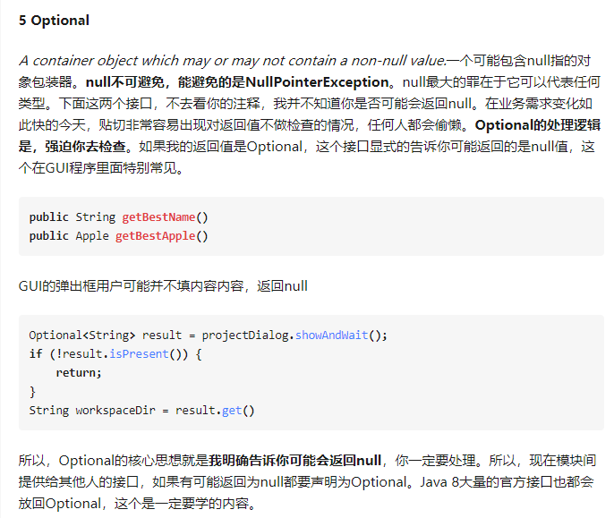
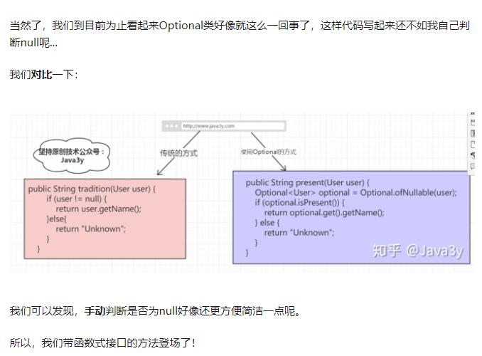
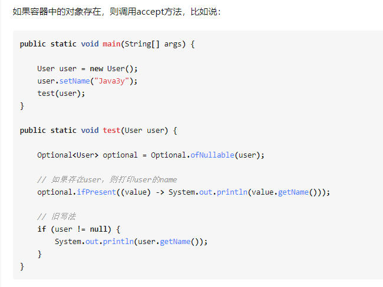

# 1. Lambda表达式的本质

Lambda表达式的本质是什么？和匿名内部类有什么区别？底层怎么实现的？

**本质：**

Lambda表达式是**函数式接口的实例**。编译器通过 `invokedynamic` 指令将Lambda转换为接口方法实现，而不是简单的匿名内部类语法糖。

**语法：**

```java
(parameters) -> expression
(parameters) -> { statements; }
```

**底层实现：**

编译时不会生成单独的class文件，而是通过 **invokedynamic指令** 动态生成：

- 编译时生成一个 **bootstrap方法**
- 运行时通过 `java.lang.invoke.LambdaMetafactory` 生成**函数式接口的实现类**
- 生成的实现类是**静态方法**形式，不持有外部类引用（除非捕获了外部变量）

**与匿名内部类区别：**

| 维度 | Lambda | 匿名内部类 |
|------|--------|-----------|
| 字节码 | invokedynamic指令 | 编译成独立class文件 |
| this指向 | 指向外部类 | 指向匿名内部类自身 |
| 变量捕获 | 必须是effectively final | 需声明为final |
| 性能 | 首次调用有初始化开销，后续优化好 | 每次加载新类 |
| 使用限制 | 只能用于函数式接口（1个抽象方法） | 可用于任何接口/抽象类 |

**变量捕获规则：** Lambda可以访问外部的 **effectively final** 变量（值初始化后不再改变），JDK 8后不要求显式声明final，但实际不能修改。

# 2. 函数式接口与常用接口

什么是函数式接口？Java8提供了哪些常用函数式接口？

**定义：** 只有一个抽象方法的接口（可以有多个default/static方法），用 **@FunctionalInterface** 注解标注。

**四大核心函数式接口：**

| 接口 | 参数 | 返回值 | 方法 | 用途 |
|------|------|--------|------|------|
| **Consumer\<T\>** | T | void | accept(T) | 消费一个参数，无返回值 |
| **Supplier\<T\>** | 无 | T | get() | 生产/提供一个值 |
| **Function\<T,R\>** | T | R | apply(T) | 类型转换 T→R |
| **Predicate\<T\>** | T | boolean | test(T) | 条件判断 |

**使用示例：**

```java
// Consumer：消费
Consumer<String> printer = s -> System.out.println(s);
printer.accept("hello");

// Predicate：判断
Predicate<String> isEmpty = s -> s.isEmpty();
boolean result = isEmpty.test("");

// Supplier：生产
Supplier<Double> random = () -> Math.random();
Double value = random.get();

// Function：转换
Function<String, Integer> parser = Integer::parseInt;
Integer num = parser.apply("123");
```

**其他常用接口：**

```java
// BiFunction: 两个输入
BiFunction<String, String, String> f = (a, b) -> a + b;

// BiConsumer: 消费两个参数
BiConsumer<String, Integer> c = (k, v) -> System.out.println(k + "=" + v);

// UnaryOperator: T→T（Function特化）
UnaryOperator<String> upper = String::toUpperCase;

// BinaryOperator: (T,T)→T（BiFunction特化）
BinaryOperator<Integer> max = Integer::max;
```


# 3. 方法引用

方法引用有哪几种形式？什么时候使用方法引用？

**4种形式：**

| 形式 | 语法 | 示例 |
|------|------|------|
| 静态方法 | Class::staticMethod | Integer::parseInt |
| 实例方法 | object::instanceMethod | System.out::println |
| 任意类型实例方法 | Class::instanceMethod | String::length |
| 构造方法 | Class::new | ArrayList::new |

```java
// 静态方法引用
Function<String, Integer> f1 = Integer::parseInt;
// 等价于 s -> Integer.parseInt(s)

// 任意类型实例方法
Function<String, Integer> f2 = String::length;
// 等价于 s -> s.length()

// 构造方法
Supplier<List<String>> s = ArrayList::new;
// 等价于 () -> new ArrayList<>()
```


# 4. Stream API核心操作

Stream流的中间操作和终止操作有哪些？map、flatMap、mapToInt、reduce、distinct、sorted怎么用？原理是什么？

**特性：**

- **不存储数据**，只对数据源（集合/数组）进行操作
- **惰性求值**：中间操作不执行，终止操作才触发计算
- **流水线**：多个中间操作形成链式调用

**中间操作（返回Stream，惰性）：**

| 操作 | 说明 |
|------|------|
| filter(Predicate) | 过滤 |
| map(Function) | 元素转换 |
| flatMap(Function) | 扁平化映射（流中流合并） |
| mapToInt/mapToLong/mapToDouble | 转基本类型流 |
| distinct() | 去重（通过equals判断） |
| sorted() | 排序 |
| peek(Consumer) | 调试用 |
| limit(n) | 截取前n个 |
| skip(n) | 跳过前n个 |

**终止操作（触发执行）：**

| 操作 | 说明 |
|------|------|
| forEach(Consumer) | 遍历 |
| collect(Collector) | 收集为集合 |
| toList() / toSet() | Java16+收集 |
| reduce(BinaryOperator) | 归约 |
| count() | 计数 |
| anyMatch / allMatch / noneMatch | 匹配检查 |
| findFirst() / findAny() | 查找 |
| min() / max() | 最值 |

**常用方法示例：**

```java
// map：元素转换
Stream.of("nanjing", "beijing")
    .map(String::toUpperCase)
    .forEach(System.out::println);  // NANJING BEIJING

// mapToInt：转int基本类型流
Stream.of(1, 2, 3)
    .mapToInt(data -> data * 10)
    .forEach(System.out::println);  // 10 20 30

// distinct：去重
Stream.of(1, 2, 3, 4, 2, 3)
    .distinct()
    .forEach(System.out::println);  // 1 2 3 4

// flatMap：扁平化
List<List<String>> list = Arrays.asList(
    Arrays.asList("a", "b"), Arrays.asList("c", "d"));
list.stream()
    .flatMap(Collection::stream)
    .collect(Collectors.toList());  // [a, b, c, d]

// reduce：归约
Optional<Integer> sum = Stream.of(1, 2, 3, 4)
    .reduce(Integer::sum);  // 10

// sorted：排序
Stream.of(3, 1, 4, 2)
    .sorted()
    .forEach(System.out::println);  // 1 2 3 4
```

**原理：**

Stream操作分为 **Sink链**。每次中间操作生成一个新的Sink，链接到上一个Sink。终止操作触发时，从第一个Sink开始沿链执行，每个Sink负责自己的变换逻辑，数据一次遍历完成所有操作——**无中间状态存储**。

```java
// 数据流经：source → filter Sink → map Sink → collect(终止)
list.stream()                              // 源
    .filter(x -> x > 0)                    // Sink1: 过滤
    .map(x -> x * 2)                       // Sink2: 转换
    .collect(Collectors.toList());          // 终止 → 触发Sink链
```


# 5. Collectors工具类

Collectors提供了哪些常用收集器？

```java
// 转集合
list.stream().collect(Collectors.toList());
list.stream().collect(Collectors.toSet());
list.stream().collect(Collectors.toMap(Function.identity(), v -> v));

// 分组
Map<Integer, List<User>> groupByAge = users.stream()
    .collect(Collectors.groupingBy(User::getAge));

// 分区
Map<Boolean, List<Integer>> partition = list.stream()
    .collect(Collectors.partitioningBy(x -> x > 5));

// 连接字符串
String joined = list.stream()
    .collect(Collectors.joining(", "));

// 归约
Optional<Integer> sum = list.stream()
    .collect(Collectors.reducing(Integer::sum));

// 统计
IntSummaryStatistics stats = list.stream()
    .collect(Collectors.summarizingInt(Integer::intValue));
// stats.getCount(), stats.getSum(), stats.getMin(), ...
```


# 6. Optional的用法

Optional的常用方法有哪些？什么时候应该使用Optional？

**定义：** 用于避免NullPointerException的容器类，明确表达值可能为空。

**创建：**

```java
Optional<String> opt1 = Optional.of("value");      // 值不能null
Optional<String> opt2 = Optional.ofNullable(null); // 可为null
Optional<String> opt3 = Optional.empty();           // 空Optional
```

**安全取值与链式调用：**

```java
// ifPresent: 有值则执行
opt.ifPresent(System.out::println);

// orElse: 提供默认值
String val = opt.orElse("default");

// orElseGet: 延迟计算默认值
String val = opt.orElseGet(() -> computeDefault());

// orElseThrow: 无值则抛异常
String val = opt.orElseThrow(() -> new NoSuchElementException());

// map: 转换（返回Optional）
Optional<Integer> len = opt.map(String::length);

// filter: 条件过滤
Optional<String> filtered = opt.filter(s -> s.length() > 3);

// 链式调用
opt.map(String::toUpperCase)
    .filter(s -> s.length() > 3)
    .orElse("default");
```







**使用原则：**

- ✅ 作为 **方法返回值**，提醒调用者可能为空
- ✅ 与Stream结合链式处理
- ❌ 不作为字段（Optional不可序列化）
- ❌ 不作为方法参数（增加调用方复杂度）
- ❌ 不要用get()盲目取值（违背设计初衷）
- ✅ 优先使用 orElse、orElseGet、orElseThrow 等安全方法


# 7. 并行流与ForkJoinPool

并行流的底层原理是什么？使用并行流需要注意什么？

**原理：**

并行流底层使用 **ForkJoinPool.commonPool()**（默认线程数 = CPU核心数）。数据被分割成多个子任务并行执行，通过fork/join框架合并结果。

**注意：** parallelStream在forEach时，**后面的代码会等待forEach全部完成**后才执行，但forEach内部的代码是并行执行的。遇到异常时需要在lambda内部自行处理。

```java
// 并行流
list.parallelStream()
    .filter(x -> x > 0)
    .map(x -> compute(x))     // 并行执行
    .collect(Collectors.toList());
```

**注意事项：**

1. **线程安全问题**：操作共享变量需要加锁或使用线程安全集合
2. **阻塞操作**：并行流中不要有阻塞IO操作，否则所有线程卡住
3. **数据量小不适用**：数据量小时，线程拆分和合并的开销超过并行收益
4. **共享线程池**：ForkJoinPool.commonPool是全局共享的，其他并行任务会互相影响
5. **顺序敏感**：并行流不保证顺序，需要顺序时用 forEachOrdered

**何时使用：**

- 数据量大（>10000）
- 计算密集
- 每个元素处理独立无共享
- 不怕CPU跑满

# 8. CompletableFuture概述

CompletableFuture是什么？和传统Future有什么区别？

**定义：**

CompletableFuture = **Future + 回调 + 任务编排**，JDK 8引入，实现了Future和CompletionStage接口，提供非阻塞的异步编程能力。

**与Future的本质区别：**

| 特性 | Future | CompletableFuture |
|------|--------|-------------------|
| 获取结果 | get()阻塞 | 回调非阻塞、链式触发 |
| 任务编排 | 不支持 | 串行、并行、聚合组合 |
| 异常处理 | 难捕获 | 自动透传、可全局捕获 |
| 编程模型 | 被动阻塞 | 事件驱动、流式异步 |

**核心能力：**

- **非阻塞回调**：任务完成自动触发后续逻辑，无需手动get()
- **链式调用**：多个异步操作串联编排
- **多任务组合**：等待所有完成或任意一个完成
- **异常自动传递**：异常沿回调链自动透传

# 9. CompletableFuture核心底层结构

CompletableFuture的底层是如何实现的？

内部基于 **volatile状态机 + 结果缓存 + 回调链表** 实现，异步任务交由ForkJoin公共线程池执行。

**1. 内部状态机**

内部有一个 volatile int 状态，取值包括：
- 未完成
- 正常完成
- 异常完成
- 取消

任何任务完成或异常，都会通过 **CAS修改状态**。

**2. 结果载体**

存储正常返回值或异常信息，任务完成后写入，回调链读取。

**3. 等待栈 / 回调链表（核心）**

当任务还没完成时，**后续依赖的回调任务（thenApply/thenAccept/thenRun）不会阻塞线程**，而是封装成 **Completion节点**，挂到当前Future的**回调链表/栈**上；等前面任务一完成，**主动唤醒、串行触发后续所有回调**。

**4. 默认线程池**

没有指定Executor时，用 **ForkJoinPool.commonPool()**；异步任务交给公共池线程执行，回调也复用池线程。


# 10. CompletableFuture核心工作原理

CompletableFuture的任务执行、回调挂载和异常传播是怎么工作的？

**1. 异步任务执行**

supplyAsync / runAsync 把任务提交到 **ForkJoin公共线程池**，子线程执行业务逻辑，执行完 **CAS修改状态为完成**，写入结果或异常。

**2. 回调任务挂载（关键）**

调用 thenApply / thenAccept / thenCombine 时：
- 如果 **前面任务已完成**：立刻直接执行回调
- 如果 **前面还没完成**：把回调函数包装成 **依赖节点**，**挂到当前CompletableFuture的回调链表上**，**当前线程不阻塞，直接返回**

**3. 任务完成触发回调**

前面任务结束 → 修改状态 → **遍历链表，逐个触发后续回调任务**，形成 **链式自动流转**，全程 **无阻塞、轮询、自旋**。不靠 wait/notify，靠 **状态机 + 回调链表**，事件驱动模型。

**4. 异常传播机制**

一旦任务抛出异常：
- 状态标记为 **异常完成**
- 异常自动向后传递给所有链式回调
- 可通过 exceptionally / handle 捕获处理
- 不处理也不会丢异常，会一直透传

**5. 链式编排实现**

每一个 thenXxx 都会 **生成一个新的CompletableFuture**，前后形成依赖链；前一个完成 → 驱动后一个执行，串行/并行/组合都基于这个依赖链。


# 11. CompletableFuture常用API

CompletableFuture的常用API有哪些？怎么用？

**创建异步任务：**

```java
// runAsync: 无返回值
CompletableFuture<Void> future = CompletableFuture.runAsync(() -> {
    System.out.println("异步执行");
});

// supplyAsync: 有返回值
CompletableFuture<String> future = CompletableFuture.supplyAsync(() -> {
    return "result";
});

// 指定自定义线程池
ExecutorService pool = Executors.newFixedThreadPool(10);
CompletableFuture.supplyAsync(() -> "result", pool);
```

**回调方法：**

```java
CompletableFuture<String> future = CompletableFuture.supplyAsync(() -> "hello");

// thenApply: 转换结果（有返回值）
CompletableFuture<String> result = future.thenApply(s -> s + " world");

// thenAccept: 消费结果（无返回值）
future.thenAccept(s -> System.out.println(s));

// thenRun: 任务完成后执行（不关心结果）
future.thenRun(() -> System.out.println("done"));

// 指定Executor执行回调
future.thenApplyAsync(s -> s + " world", executor);
```


# 12. CompletableFuture异常处理

CompletableFuture的异常怎么处理？exceptionally、whenComplete、handle有什么区别？

**exceptionally：** 只在抛出异常时触发，类似 try-catch 中的 catch，可以捕获异常并返回默认值。

```java
CompletableFuture<String> future = CompletableFuture.supplyAsync(() -> {
    if (true) throw new RuntimeException("error");
    return "success";
}).exceptionally(e -> {
    System.out.println("捕获异常: " + e.getMessage());
    return "default";  // 返回默认值
});
```

**whenComplete：** 不管是否异常都会执行，类似 try-catch-finally 中的 finally，不改变结果。

```java
CompletableFuture.supplyAsync(() -> "success")
    .whenComplete((result, ex) -> {
        if (ex != null) {
            System.out.println("异常: " + ex.getMessage());
        } else {
            System.out.println("结果: " + result);
        }
    });
```

**handle：** 不管是否异常都会执行，且可以在一个方法里对正常结果转换或对异常捕获处理，类似 whenComplete + thenApply 的结合。

```java
CompletableFuture<String> future = CompletableFuture.supplyAsync(() -> {
    if (true) throw new RuntimeException("error");
    return "success";
}).handle((result, ex) -> {
    if (ex != null) {
        return "处理异常后的默认值";
    }
    return result;
});
```

**三种方法对比：**

| 方法 | 触发条件 | 能否改变结果 | 类比 |
|------|---------|-------------|------|
| exceptionally | 仅异常时 | 能 | catch |
| whenComplete | 正常/异常都触发 | 不能 | finally |
| handle | 正常/异常都触发 | 能 | whenComplete+thenApply |


# 13. CompletableFuture任务组合

CompletableFuture如何实现多个异步任务组合？thenCombine、allOf、anyOf怎么用？

**thenCombine：合并两个异步任务的结果**

```java
CompletableFuture<String> f1 = CompletableFuture.supplyAsync(() -> "hello");
CompletableFuture<String> f2 = CompletableFuture.supplyAsync(() -> "world");

// 两个任务都完成，合并结果
CompletableFuture<String> result = f1.thenCombine(f2, (a, b) -> a + " " + b);
// 结果: "hello world"
```

**allOf：等待所有任务完成**

```java
CompletableFuture<String> f1 = CompletableFuture.supplyAsync(() -> "a");
CompletableFuture<String> f2 = CompletableFuture.supplyAsync(() -> "b");
CompletableFuture<String> f3 = CompletableFuture.supplyAsync(() -> "c");

// 等待全部完成
CompletableFuture<Void> all = CompletableFuture.allOf(f1, f2, f3);
all.thenRun(() -> System.out.println("全部完成"));

// 收集所有结果
CompletableFuture<List<String>> results = all.thenApply(v ->
    Stream.of(f1, f2, f3)
        .map(CompletableFuture::join)
        .collect(Collectors.toList())
);
```

**anyOf：任意一个任务完成即触发**

```java
CompletableFuture<String> f1 = CompletableFuture.supplyAsync(() -> {
    Thread.sleep(2000); return "slow";
});
CompletableFuture<String> f2 = CompletableFuture.supplyAsync(() -> {
    return "fast";
});

// 任意一个完成即返回
CompletableFuture<Object> result = CompletableFuture.anyOf(f1, f2);
// 结果: "fast"（先完成的那个）
```


# 14. CompletableFuture使用建议

使用CompletableFuture需要注意什么？

**1. 接口返回约定**

方法返回 CompletableFuture，调用者一眼就知道这是异步API，也清楚如何调用它——这是一种约定。

**2. 合理使用线程池**

- 默认用 ForkJoinPool.commonPool()，所有并行任务共享
- CPU密集任务适合commonPool，IO密集任务建议自定义线程池
- 用 supplyAsync(task, executor) 解耦，避免互相影响

**3. 异常处理不可省略**

- 异步链路中任何环节抛出异常，会沿链传播
- 链路末端必须用 exceptionally / handle 兜底
- 不处理异常会静默消失（没有线程可以抛）

**4. 注意回调线程**

回调任务默认复用前面完成的线程或公共池线程。用 thenApplyAsync 可以指定独立线程池。

**5. 适用场景**

- 多个独立IO操作并行（如查多个接口、查多家酒店价格）
- 同步转异步，配合Lambda几句话完成
- 协调多个异步操作完成后合并结果
- 等待多个异步操作中最快的一个完成

**6. 不适用场景**

- 简单同步操作（不需要异步的开销）
- CPU密集且无任务编排需求（直接用并行流更简单）
- 需要取消任务（CompletableFuture的取消是"打断标记"并非真正中断线程）
