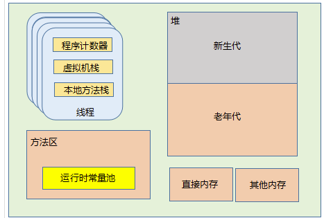
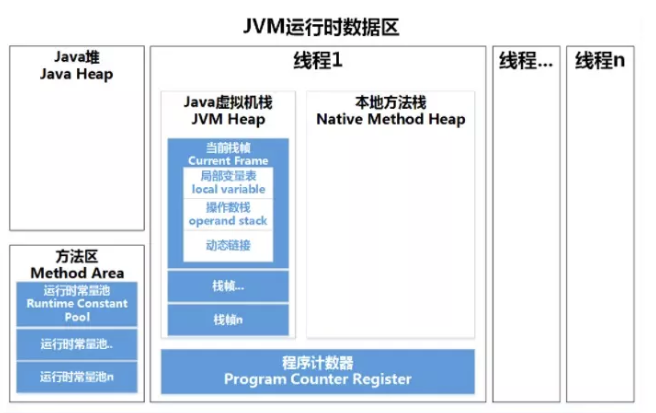
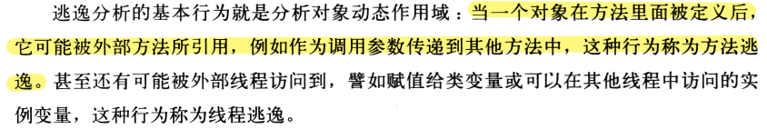
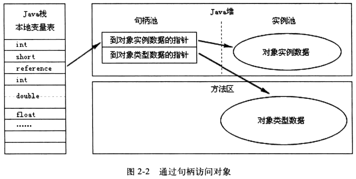
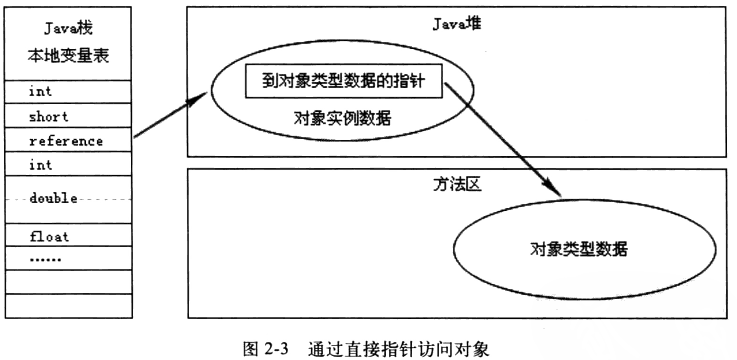
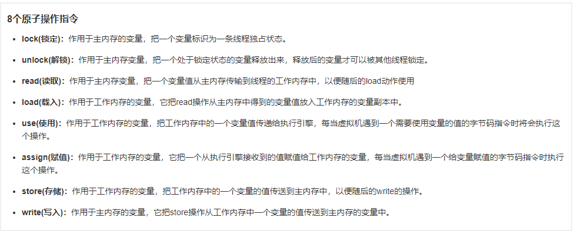

# 1. JVM 运行时数据区包含哪些部分？各自的角色是什么？

JVM运行时数据区包括哪些部分？各自的作用是什么？

**原理分析**

JVM内存划分包括以下几个运行时数据区：

- **程序计数器**
- **虚拟机栈**
- **本地方法栈**
- **方法区**
- **堆**
- **直接内存**

**程序计数器：** 每个线程都有自己的程序计数器，是一块较小的内存空间，存储当前线程正在执行的Java方法的JVM指令地址（字节码行号）。如果当前方法是native，程序计数器值为undefined。这是JVM规范中唯一一个没有规定任何OutOfMemoryError的区域。

**虚拟机栈：** 线程私有的，每个线程有自己的虚拟机栈。描述Java方法执行的内存模型：每个方法被执行时都会同时创建一个**栈帧**，用于存储**局部变量表、操作栈、动态连接、方法出口**等信息。虚拟机栈为执行Java方法服务，每一个方法从调用到执行完成，对应一个栈帧在虚拟机栈中入栈到出栈的过程。平时所说的"Java内存分为堆区和栈区"中的栈区，指的就是虚拟机栈。

**本地方法栈：** 与虚拟机栈类似，区别在于虚拟机栈执行Java方法，而本地方法栈为虚拟机使用到的native方法服务。HotSpot虚拟机直接将本地方法栈和虚拟机栈合二为一。

**堆：** 虚拟机管理的内存中**最大的一块**，是**所有线程共享**的内存区域，在虚拟机启动时创建。**几乎所有的对象实例都在这里分配内存**。Java堆是**垃圾收集器管理的主要区域**，也称为"GC堆"。堆在物理上可以不连续，逻辑上连续即可。

**方法区：** 也是各线程共享的内存区域，用于**存储已被虚拟机加载的类信息、常量、静态变量、即时编译器编译后的代码**等数据。方法区是JVM规范中的概念，HotSpot在JDK8之前使用永久代实现方法区，JDK8之后用**元空间**替代永久代。

**运行时常量池：** 方法区的一部分，用于存储Class文件常量池在类加载后生成的版本。

**直接内存：** 并不是虚拟机运行时数据区的一部分，也不是JVM规范中定义的内存区域。NIO中基于通道与缓冲区的I/O方式，可以使用Native函数库直接分配堆外内存，通过堆中的DirectByteBuffer对象作为引用进行操作，**避免在Java堆和Native堆中来回复制数据**，提高性能。





# 2. 程序计数器为什么不会 OOM？

程序计数器是唯一一个JVM规范中没有规定OutOfMemoryError的区域，为什么？

**原理分析**

程序计数器存储当前线程正在执行的Java方法字节码指令地址。**每个线程都有自己的程序计数器**，它的生命周期与线程相同，线程启动时分配，线程结束时释放。程序计数器占用的空间非常小（只需存储一个地址或undefined），其内存需求是确定的，不会随着程序运行而动态增长，因此不会出现内存溢出的情况。如果执行的是native方法，程序计数器值为undefined。

# 3. 虚拟机栈的结构是什么？可能发生哪些异常？

虚拟机栈中存储什么？什么情况下会抛出StackOverflowError和OutOfMemoryError？

**原理分析**

虚拟机栈描述Java方法执行的内存模型：**每个方法被执行时都会创建一个栈帧**，用于存储**局部变量表、操作栈、动态连接、方法出口**等信息。

**局部变量表**存放了编译期的各种**基本数据类型、对象引用和returnAddress类型**（指向一条字节码指令的地址）。

虚拟机栈规定了两种异常情况：

- 如果**线程请求的栈深度大于虚拟机允许的深度**，抛出**StackOverflowError**
- 如果**虚拟机栈可以动态扩展，扩展时申请不到足够内存**，抛出**OutOfMemoryError**

**栈内存溢出分析（针对HotSpot VM）：**

- **线程的栈内存**：每新建一个线程时分配给该线程一个栈内存初始值，最大大小通过**-Xss**设置。线程通过不断执行方法、生成局部变量，栈帧不断增加，达到-Xss值时抛出StackOverflowError
- **JVM的栈内存**：栈内存上限是**物理机器的native memory**。不断创建线程消耗native memory直至耗尽时，报OOME

> 操作系统会限制线程数量，内核内部分给每个线程栈大小只有4K或8K。

# 4. 堆内存如何分代划分？为什么这样划分？

JVM堆内存是如何划分的？这样划分的目的是什么？

**原理分析**

**堆被划分为两个不同的区域：新生代（Young）和老年代（Old）。**

新生代又被划分为三个区域：**Eden、S0（From Survivor）、S1（To Survivor）**。这样划分的目的是使JVM能更好地管理堆内存中的对象，包括内存的分配以及回收。

**Eden Space：**

- 对象被创建时首先放到这个区域
- 垃圾回收后不能被回收的对象被放入空的Survivor区域

**Survivor Space（幸存者区）：**

- 用于保存在Eden Space中经过垃圾回收后没有被回收的对象
- Survivor有两个（To Survivor和From Survivor），空间大小一样
- 执行垃圾回收时，Eden中不能被回收的对象被放入空的Survivor（To Survivor），同时From Survivor中不能被回收的对象也会被放入To Survivor，然后To Survivor和From Survivor标记互换，始终保证一个Survivor是空的

Eden Space和Survivor Space都属于新生代。新生代中执行的垃圾回收称为**Minor GC（Young GC）**，每一次Young GC后存活下来的对象age加1。

**年轻代的特点是产生大量的死亡对象，并且需要产生连续可用的空间，所以使用复制清除算法和并行收集器进行垃圾回收。**

**老年代（Tenured Generation）：**

在新生代中经历了多次（**-XX:MaxTenuringThreshold**，默认15）GC后**仍然存活的对象**会进入老年代。老年代对象生命周期较长，存活率高，GC频率较低，回收速度较慢。老年代使用**标记清除或标记整理算法**。

# 5. 什么是方法区？永久代和元空间的关系是什么？

方法区是什么？永久代和元空间有什么区别和联系？

**原理分析**

方法区是**JVM规范**中定义的一个概念，用于**存储已被虚拟机加载的类信息、常量、静态变量、即时编译器编译后的代码**等数据。方法区是各线程共享的内存区域。

**方法区 vs 永久代 vs 元空间：**

- **方法区是规范**，是JVM虚拟机规范定义的逻辑区域
- **永久代是HotSpot在JDK8前对方法区的实现**
- **元空间（Metaspace）是HotSpot在JDK8后对方法区的实现**

**JDK7到JDK8的迁移过程：**

JDK1.7中，存储在永久代的部分数据已经转移到Java Heap或Native Heap：
- 符号引用（Symbols）转移到native heap
- 字面量（interned strings）转移到java heap
- 类的静态变量（class statics）转移到java heap

JDK8完全移除了永久代，取而代之的是**元空间**。元空间并不在虚拟机中，而是**使用本地内存**。默认情况下，元空间大小仅受本地内存限制，理论上是机器内存有多大元空间就有多大。

# 6. 为什么用元空间替代永久代？

Java8做出如此改变的原因是什么？

**原理分析**

用元空间替代永久代的原因包括：

- 应用程序所需要的PermGen区大小很难预测，设置太小会触发PermGen OutOfMemoryError，过度设置导致资源浪费
- 提升GC性能，每个垃圾收集器需要专门代码处理PermGen中的类元数据信息。从PermGen分离类的元数据信息到Metaspace，由于**Metaspace的分配具有和Java Heap相同的地址空间**，Metaspace和Java Heap可以无缝管理，简化FullGC过程
- 支持进一步优化，比如G1并发类的卸载
- 字符串存在永久代中容易出现性能问题和内存溢出
- 类及方法的信息较难确定大小，永久代大小指定困难，太小永久代溢出，太大老年代溢出
- 永久代会为GC带来不必要的复杂度，回收效率偏低
- Oracle将HotSpot与JRockit合二为一的战略需求

# 7. 常量池有哪几种？各自的作用是什么？

JVM中的常量池包括哪些类型？它们之间有什么关系？

**原理分析**

JVM常量池主要分为：**Class文件常量池、运行时常量池、全局字符串常量池、基本类型包装类对象常量池**。

**0、Class文件常量池（静态，在文件中）**

class文件是以字节为单位的二进制数据流，在Java代码编译期间，.java文件被编译为.class格式的二进制数据存放在磁盘中，其中就包括class文件常量池。**class文件常量池在编译阶段就已经确定**。主要存放两大常量：**字面量和符号引用**。

字面量包括：文本字符串（如`public String s = "abc"`中的"abc"）、八种基本类型的值、被声明为final的常量等。

符号引用包含三类：

- **类和接口的全限定名**（如java/lang/String，在运行时解析得到类的直接引用）
- 字段的名称和描述符
- 方法的名称和描述符（**参数类型+返回值**）

**1、运行时常量池（在内存中）**

运行时常量池是**class常量池被加载到内存之后的版本**，是方法区的一部分。在类加载的加载阶段，class字节流代表的静态存储结构转化为方法区的运行时数据结构，其中包括class文件常量池进入运行时常量池的过程。**不同的类共用一个运行时常量池**，多个class文件中相同的字符串在运行时常量池中只会存在一份。

运行时常量池相对于class常量池的一大特征是**具有动态性**，运行时可以通过代码生成常量放入运行时常量池中，典型应用是**String.intern()**。

**2、全局字符串常量池**

字符串常量池存放字符串实例的引用。在HotSpot VM中，它是一个叫做**StringTable**的全局表，底层C++实现是一个Hashtable。这些引用的字符串实例被称为"被驻留的字符串"或"interned string"。

**JDK1.7前后的重要变化：**

- **JDK1.6及之前**：字符串常量池在方法区中（永久代）
- **JDK1.7**：字符串常量池被移到了**堆**中
- **JDK1.8**：字符串常量池还在堆中，方法区的实现从永久代变为元空间（堆外内存）

> 运行时常量池在方法区（Non-heap），而JDK1.7后字符串常量池被移到了heap区，两者根本不是一个概念。

**字符串常量池中维护的是字符串实例的引用**，而不是对象本身。所有String对象都在堆中分配，字符串常量池中的引用持有对堆中对应String对象的引用。



**3、基本类型包装类常量池**

Java中**基本类型的包装类的大部分都实现了常量池技术**，这些类是Byte、Short、Integer、Long、Character、Boolean。**浮点数类型的包装类（Float、Double）没有实现**。整型包装类只是**在对应值小于等于127时**才使用对象池。

```java
// -128~127范围内，使用缓存对象
Integer a = 100;
Integer b = 100;
System.out.println(a == b); // true

// 超过127，不同对象
Integer c = 130;
Integer d = 130;
System.out.println(c == d); // false
```

> 包装类（Integer/Long等）比较值时一律用equals，别用==。

# 8. 什么是直接内存（堆外内存）？NIO中如何使用的？

直接内存是什么？NIO中使用直接内存有什么好处？

**原理分析**

**直接内存并不是虚拟机运行时数据区的一部分**，也不是JVM规范中定义的内存区域。NIO中基于通道与缓冲区的I/O方式，可以使用**Native函数库直接分配堆外内存**，然后通过存储在堆中的**DirectByteBuffer**对象作为这块内存的引用进行操作。因为**避免在Java堆和Native堆中来回复制数据**，可以显著提高I/O性能。

# 9. DirectByteBuffer 堆外内存是如何回收的？

堆外内存如何回收？Full GC和Minor GC在回收直接内存上有什么区别？

**原理分析**

**堆外内存并不直接受控于JVM，只能等到Full GC时才能被垃圾回收。**

DirectByteBuffer是**堆内对象**，真正的直接内存是**堆外物理内存**。DirectByteBuffer分配出去的直接内存由GC负责回收（不像Unsafe是完全自行管理的）。HotSpot在GC时会扫描DirectByteBuffer对象是否有引用，如没有则同时释放其占用的堆外内存。

**回收机制：**

- **Minor GC不能回收直接内存**——只回收新生代，无法释放堆外内存
- **Full GC能回收直接内存**——会全堆扫描，回收失效的DirectByteBuffer，通过Cleaner机制释放直接内存
- 堆内的DirectByteBuffer被GC标记为垃圾 → 调用**Cleaner/Unsafe** → 主动释放堆外直接内存

**Direct Memory的回收不对称问题：**

`ByteBuffer bb = ByteBuffer.allocateDirect(1024)`会在堆外占用1K内存，堆内只占用一个对象指针引用的大小。**堆外可能占用了很多而堆内没占用多少**，导致还没触发GC就会出现Direct Memory耗尽物理内存。

**ByteBuffer与Unsafe使用堆外内存的区别：**

- **Direct ByteBuffer**：分配的直接内存由**GC负责回收**，HotSpot在GC时扫描DirectByteBuffer对象，无引用则回收
- **Unsafe**：完全自行管理，需要显式释放

# 10. 什么是逃逸分析？标量替换和栈上分配是什么？

所有对象和数组都是在堆上分配内存的吗？什么是逃逸分析？

**原理分析**

并不是所有对象和数组都在堆上分配内存。随着JIT编译器的发展，如果JIT经过**逃逸分析**，发现有些对象**没有逃逸出方法**，那么堆内存分配可能会被优化成**栈内存分配**。但这也不是绝对的，开启逃逸分析后也并非所有对象都不在堆上分配。

**标量和聚合量：**

- **标量**：不可被进一步分解的量，如int、long等基本数据类型以及reference类型
- **聚合量**：可以被进一步分解的量，如Java对象

**标量替换过程：**

通过逃逸分析确定该对象不会被外部访问，且对象可以被进一步分解时，JVM不会创建该对象，而会将该对象的成员变量分解为若干个被方法使用的成员变量所代替。这些代替的成员变量在**栈帧或寄存器**上分配空间。

# 11. 对象访问定位有哪两种方式？

主流访问对象的方式有哪些？各有什么特点？

**原理分析**

主流访问对象的方式有两种：**使用句柄**和**直接指针**。

**句柄访问：**

Java堆中会划分出一块内存作为**句柄池**，reference中存储的是对象的句柄地址，句柄中包含了**对象实例数据和类型数据各自的具体地址信息**。



**直接指针访问：**

Java堆对象的布局中必须考虑如何放置访问类型数据的相关信息，reference中直接存储的是**对象地址**。



**对比：** 句柄访问在对象被移动时只需修改句柄中的指针，不需要修改reference；直接指针访问速度更快，节省一次指针定位的开销。

# 12. 什么是直接内存溢出？如何排查 DirectByteBuffer 堆外内存问题？

堆外内存溢出如何排查？Netty的堆外内存能被Full GC回收吗？

**原理分析**

**排查思路：**

- 堆外内存溢出时，堆内可能用量很小，不容易触发GC，导致直接内存耗尽物理内存
- 使用`-XX:MaxDirectMemorySize`限制直接内存大小
- 通过`-XX:+DisableExplicitGC`可以禁用System.gc()，但也会禁用DirectByteBuffer的Cleaner机制

**Netty管理的堆外内存：**

- **Netty默认：堆外内存不会被Full GC回收**
- 原因：Netty自研内存池+计数引用+禁用了JDK自动回收
- 只有**Netty正常主动释放**才会归还堆外内存
- 不靠JVM GC、不靠Cleaner、不受Full GC控制

> 机器有大量剩余内存但Java进程还是报OOM错误时，应排查堆外内存问题。

# 13. 虚拟机规范中的8种内存交互操作是什么？

Java内存模型中定义了哪些主内存与工作内存之间的交互操作？

**原理分析**

Java内存模型中定义了以下8种操作来完成主内存与工作内存之间的交互：



（此图展示Java内存模型中的8种原子操作，包括lock、unlock、read、load、use、assign、store、write等）

# 14. 哪些场景会触发 OutOfMemoryError？如何分析？

OOM发生在哪些场景？如何分析和解决？

**原理分析**

**OOM常见场景：**

- **Java堆空间不足**：无法分配新对象实例，且堆无法扩展
- **元空间不足**：加载类太多，或生成了太多代理类（`-XX:MaxMetaspaceSize`限制）
- **直接内存溢出**：DirectByteBuffer占满堆外内存
- **GC overhead limit exceeded**：GC花费时间超过98%且回收内存少于2%，JVM判定陷入"GC恶性循环"
- **栈溢出**：线程请求栈深度超过-Xss设置，或native memory耗尽
- **永久代溢出（JDK7及之前）**：字符串常量池、类元数据过多

**分析工具：**

- `jmap -heap pid`：查看JVM各划分内存信息
- `jstat -gcutil`：查看GC统计信息
- Heap Dump分析
- 直接内存排查：关注Native Memory增长趋势
