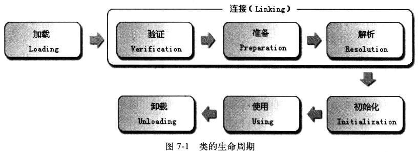
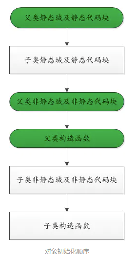

# 1. 类的生命周期包含哪些阶段？

类从加载到虚拟机内存到卸载出内存，整个生命周期包括哪些阶段？

**原理分析**

类生命周期包括**加载、验证、准备、解析、初始化、使用和卸载**七个阶段。其中验证、准备、解析统称为**连接**。

前五个阶段的顺序是确定的，解析阶段则不一定——某些情况下可以在初始化阶段之后再开始，这是为了支持**运行时绑定（动态绑定）**。



# 2. 哪些场景会触发类的初始化（主动引用）？

虚拟机规范严格规定了**有且只有四种情况**必须立即对类进行初始化，这四种场景称为**主动引用**：

- **遇到new、getstatic、putstatic、invokestatic四条字节码指令时：** 使用new实例化对象、读取或设置一个类的静态字段（被final修饰且在编译期已放入常量池的静态字段除外）、调用一个类的静态方法
- **使用java.lang.reflect包的方法对类进行反射调用时**
- **初始化子类时，如果发现父类还未初始化，先触发父类初始化**
- **虚拟机启动时，包含main()方法的主类先初始化**

**被动引用**不会触发类的初始化：

- **通过子类引用父类的静态字段**，不会导致子类初始化
- **通过数组定义来引用类**，不会触发此类初始化（数组由newarray指令自动生成，类型为数组而非定义的类）
- **常量在编译阶段会存入调用类的常量池中**，不会触发定义常量的类初始化

# 3. 类加载过程各阶段做了什么？

类加载过程中的加载、验证、准备、解析、初始化分别做了什么？

**原理分析**

**加载：** 通过类的全限定名获取定义此类的二进制字节流，将字节流的静态存储结构转化为方法区的运行时数据结构，在Java堆中生成代表这个类的java.lang.Class对象作为访问入口。字节码来源可以是jar/war压缩包、网络、动态代理运行时生成、JSP文件等。加载完成后，二进制字节流按虚拟机所需格式存储在**方法区**中，在**堆中实例化一个Class对象**。

**验证：** 确保Class文件的字节流包含的信息符合当前虚拟机要求，不会危害虚拟机自身安全。

**准备：** 正式为**类变量（static）** 分配内存并设置初始值（数据类型的零值），这些内存在方法区中分配。**不包括实例变量**。例如`public static int value = 123`在准备阶段后的初始值是0而不是123，赋值为123的动作在初始化阶段执行。

**解析：** 虚拟机将常量池中的**符号引用替换为直接引用**的过程。

**初始化：** 类加载的最后一步，开始真正执行Java字节码。执行类构造器`<clinit>()`方法，为静态变量赋予正确的初始值。

# 4. 什么是符号引用和直接引用？

解析阶段将符号引用替换为直接引用，这两种引用分别是什么？

**原理分析**

**符号引用：** 以一组符号描述所引用的目标，可以是任何形式的字面量，只要使用时能无歧义地定位到目标即可。在Class文件中以CONSTANT_Class_info、CONSTANT_Fieldref_info、CONSTANT_Methodref_info等常量形式出现。符号引用与虚拟机的内存布局无关，引用的目标不一定已加载到内存中，例如某个方法的符号引用格式为`java/io/PrintStream.println:(Ljava/lang/String;)V`。

**直接引用：** 可以是直接指向目标的指针（指向方法区的指针）、相对偏移量（实例变量、实例方法的偏移量）、或能间接定位到目标的句柄。直接引用与虚拟机布局相关，有了直接引用表示目标必定已加载入内存。

当第一次运行时，根据符号引用的字符串内容到类的方法表中搜索方法；运行一次后符号引用被替换为直接引用，下次无需搜索。

# 5. 类的初始化顺序是怎样的？

包括静态变量、静态代码块、实例变量、代码块、构造方法，以及父类和子类之间的关系。

**原理分析**

**非静态对象初始化：** 创建对象时，所有数据成员首先初始化（基本类型为默认零值，对象类型按顺序初始化），所有类成员初始化完成后，才调用构造方法创建对象。

**静态对象初始化：** 类在首次被**主动引用**时执行初始化，为类（静态）变量赋予正确的初始值。静态变量和静态代码块按在类中的顺序执行。程序中主类的静态变量在main方法执行前初始化。

**整体顺序：**
- 父类静态变量/静态代码块 → 子类静态变量/静态代码块
- 父类实例变量/代码块 → 父类构造方法
- 子类实例变量/代码块 → 子类构造方法



**静态内部类单例（线程安全原理）：**

```java
public class Singleton {
    private static class SingletonHolder {
        private static final Singleton INSTANCE = new Singleton();
    }
    private Singleton() {}
    public static final Singleton getInstance() {
        return SingletonHolder.INSTANCE;
    }
}
```

- 外部类Singleton加载时，静态内部类SingletonHolder**不会被加载**
- 只有调用getInstance()访问SingletonHolder.INSTANCE时，才触发静态内部类的加载+初始化
- 虚拟机会保证一个类的`<clinit>()`方法在多线程环境中被正确地加锁、同步，**只会有一个线程执行`<clinit>()`方法，其他线程阻塞等待**。同一个加载器下，一个类型只会初始化一次
- 缺点：外部无法传递参数（如Context）

**DCL单例为什么需要volatile：**

```java
public class Singleton {
    private volatile static Singleton instance = null;
    private Singleton() {}
    public static Singleton getInstance() {
        if (instance == null) {           // ①
            synchronized (Singleton.class) {
                if (instance == null) {   // ②
                    instance = new Singleton(); // ③
                }
            }
        }
        return instance;                  // ④
    }
}
```

`instance = new Singleton()` 实际分为三个步骤：
1. 分配内存
2. 初始化内存
3. 将instance指向内存

CPU可能对这三个步骤重排序为 **1→3→2**（先指向内存，后初始化内存）。此时Thread1执行到3）时放弃CPU时间，Thread2执行到①发现instance不为null，**直接将未完全初始化的instance返回**。volatile禁止指令重排序，保证返回的实例是完全初始化的。JDK1.6及以后，volatile可彻底解决DCL失效问题。

# 6. 类加载器有哪几种？什么是双亲委派模型？

类加载器用于实现类加载阶段的**加载**这一步。比较两个类是否相同，**只有两个类由同一个类加载器加载才有比较意义**，即使同一个class文件，类加载器不同，这两个类就一定不同。

**原理分析**

JVM中的类加载器分为三种（层次关系）：

- **启动类加载器（Bootstrap ClassLoader）：** C++实现，负责加载`<JAVA_HOME>/lib`目录中虚拟机识别的类库（如rt.jar），无法被Java程序直接引用
- **扩展类加载器（Extension ClassLoader）：** sun.misc.Launcher$ExtClassLoader实现，负责加载`<JAVA_HOME>/lib/ext`目录中的类库
- **应用程序类加载器（Application ClassLoader）：** sun.misc.Launcher$AppClassLoader实现，负责加载ClassPath上的类库，程序中默认的类加载器

**双亲委派模型的工作过程：**

如果一个类加载器收到类加载请求，它首先不会自己去尝试加载，而是把请求委派给父类加载器完成，每一层都如此，所有加载请求最终传送到**启动类加载器**。只有当父加载器反馈自己无法完成加载时，子加载器才会尝试自己加载。

**子类加载器可以见到父类加载器加载的类，父类加载器看不见子类加载器加载的类。**

# 7. 为什么必须使用双亲委派模型？

双亲委派模型有什么好处？

**原理分析**

- **保证核心类全局唯一，防止核心API被篡改（安全）：** 没有双亲委派，自己写一个java.lang.String恶意类会覆盖JDK原生核心类。双亲委派下Object类无论哪个加载器加载，最终都委派给启动类加载器，保证全系统Object是同一个类
- **保证类的全局唯一性，避免重复加载、类冲突（统一）：** 同一个全限定类名在整个JVM中只能有一个Class对象。不同加载器各自加载会导致同一个com.User加载多份，引发类型转换异常、版本依赖冲突
- **职责解耦，层级清晰：** 启动类加载器加载JDK核心rt.jar，扩展类加载器加载ext扩展包，应用类加载器加载项目自己的类

# 8. 什么是双亲委派模型的"破坏"？有哪几次？

双亲委派模型只是JVM规范要求，不是强制约束。正常自定义类加载器重写findClass可保持双亲委派，重写loadClass可打破。

**原理分析**

**第一次破坏——重写loadClass()：** JDK不推荐，自定义加载器通过重写loadClass方法改变加载规则，随心所欲加载类。标准做法是重写findClass()保持双亲委派机制。

**第二次破坏——SPI机制（线程上下文类加载器）：** 双亲委派模型的缺陷：基础类（如JDBC接口）由上层加载器加载，但基础类又要调用用户的代码（第三方驱动实现）。ServiceLoader和Thread.setContextClassLoader()通过**线程上下文类加载器TCCL**（默认是AppClassLoader），在父加载器加载的类中主动获取子加载器去加载实现类。

**第三次破坏——热部署/热替换：** 用户对程序动态性的追求，代码热替换、模块热部署等，机器不用重启就能部署。Tomcat的WebApplicationClassLoader也打破了双亲委派。

**标准（父加载器优先） vs 打破（不先走父加载器，自己先加载/反向委派）**

# 9. SPI是如何打破双亲委派模型的？以JDBC为例

JDBC接口（Driver、Connection、DriverManager）位于JDK核心包，由Bootstrap类加载器加载；数据库驱动实现（如com.mysql.cj.Driver）位于第三方jar，由应用类加载器加载。双亲委派下父加载器无法加载子类加载器的jar包，产生类加载隔离矛盾。

**原理分析**

**打破过程：**

- 加载DriverManager时由Bootstrap类加载器加载，但DriverManager的静态块中通过**线程上下文类加载器TCCL**（应用类加载器）去加载实现类
- ServiceLoader配合SPI机制，使用下层AppClassLoader扫描`META-INF/services/java.sql.Driver`文件中的配置
- 驱动类主动注册到DriverManager，最终完成数据库连接
- **上层调用下层加载器**，打破了双亲委派

**核心矛盾：** 在BootstrapClassLoader加载的类（DriverManager）中，需要调用AppClassLoader去加载实现类。解决方式：`Thread.currentThread().getContextClassLoader()`指向AppClassLoader，使用它加载classpath中的驱动实现。

**SPI核心规则：** 在`META-INF/services/java.sql.Driver`文件中写入驱动实现全类名（如com.mysql.cj.jdbc.Driver）。

# 10. Tomcat为什么必须打破双亲委派？如何实现的？

多Web应用需要「类隔离」，一台Tomcat跑多个war包。如果遵守双亲委派，共用同一个父加载器，只能加载一份Spring，必然导致jar版本冲突、类冲突、启动报错。

**原理分析**

**Tomcat打破双亲委派的原因：**

- 实现Web应用之间**类隔离**，不同项目不同依赖版本互不干扰
- 实现**热部署**：销毁Context + 新建类加载器，快速重新加载项目
- 避免全局jar冲突，容器更灵活

**实现方式：**

- Tomcat自定义**WebappClassLoader**：先自己加载当前应用的class/jar，自己找不到再委派给父加载器
- 但`java.*`、`javax.*`等JDK核心类以及Tomcat自身核心容器类**还是委托父加载器**加载

# 11. 能自己写一个java.lang.String类吗？为什么？

不能自己写以`java.`开头的类，其要么不能加载进内存，要么即使使用自定义类加载器强行加载，也会收到SecurityException。

**原理分析**

- 自定义ClassLoader必须继承ClassLoader，其loadClass方法会调用父类的**defineClass**方法
- 而defineClass是一个**final方法**，无法被重写
- 因此自定义ClassLoader无论如何也不可能加载到以`java.`开头的类
- 类加载器加载类时，会先判断类的包名是否以`java.`开头，如果是则只允许Bootstrap ClassLoader加载
- 双亲委派模型确保你使用的String类一定是BootstrapClassLoader加载的rt.jar中的`java/lang/String.class`
