# 1. 如何判断对象是否已死？

如何判断一个对象是否可以被垃圾回收？引用计数法和可达性分析算法有什么区别？

**原理分析**

**引用计数算法（Reachability Counting）**

在对象头中分配一个空间来保存该对象被引用的次数（Reference Count）。如果该对象被其它对象引用，则引用计数加1，删除引用则减1，当引用计数为0时，该对象就会被回收。

**优点：**

- 简单直观
- 回收及时，发现为0立刻回收
- 没有明显STW停顿

**缺点：**

- **无法解决循环引用问题**（致命缺陷）
- 频繁加减计数，有开销
- 不高效，现代JVM不用

**可达性分析算法（根搜索算法）**

通过一系列名为GC Root对象作为起点，从这些节点开始向下搜索，搜索所走过的路径称为引用链。**当一个对象到GC Root没有任何引用链相连时，则证明此对象是不可用的**。如下，虽然5、6、7互有关联，但到Root不可达，也可以回收。

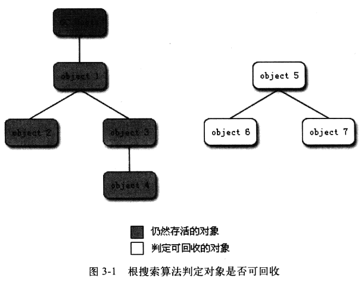

**优点：**

- 彻底解决循环引用问题
- 准确、可靠
- 现代JVM唯一使用的判断方法

**缺点：**

- 需要扫描整个对象图，产生STW停顿
- 实现复杂，需要处理并发、跨代引用

> JVM 为什么不会把内存归还给OS？

因为很可能马上又要分配给新的对象，每次向OS申请内存是很慢的。

# 2. GC Roots 包括哪些对象？为什么选这些？

可以作为GC Root的对象有哪些？为什么选中这些对象？

**原理分析**

**Java中可作为GC Root的对象（当前本次GC下肯定不会被回收的对象）：**

1. 虚拟机栈（栈帧中的本地变量表）中引用的对象，如各个线程被调用的方法堆栈中使用到的参数、局部变量、临时变量等
2. 方法区中的类静态属性引用的对象，如Java类的引用类型静态变量
3. 方法区中常量引用的对象，如字符串常量池（String Table）里的引用
4. 本地方法栈中JNI（native方法）引用的对象
5. Java虚拟机内部的引用，如基本数据类型对应的Class对象，一些常驻的异常对象（NullPointExcepiton、OutOfMemoryError等），还有系统类加载器
6. 所有被同步锁（synchronized关键字）持有的对象
7. 反映Java虚拟机内部情况的JMXBean、JVMTI中注册的回调、本地代码缓存等

**为什么选用这些：**

所谓的GC Root，可以理解为**正在使用的对象**。只要从某个地方出发能发现存活对象，它们就是GC Root。无论是栈中、静态变量还是常量，都是正在被使用的。GC Roots本身没有所谓的存储位置，它们都是字节码加载运行过程中加入JVM中的普通对象，只不过被认为是GC Roots。

# 3. 垃圾回收算法有哪些？

常见的垃圾回收算法有哪些？它们各自的优缺点是什么？

**原理分析**

**1. 标记清除算法（Mark-Sweep）**

标记需要清除的对象，然后统一回收标记的对象。

**优点：**

- 简单，不需要额外大量空间
- 不需要移动对象

**缺点：**

- 效率不高
- **会产生不连续的内存碎片**，空间碎片过多会导致分配大对象时找不到足够的连续内存，提前触发另一次垃圾回收

**2. 复制算法（Copying）**

将内存划分为大小相等的两块，每次使用一块。当这块内存用完，就将存活的对象复制到另一块上。

**优点：**

- 简单高效，**无内存碎片**
- 适合存活对象少的场景（速度极快）

**缺点：**

- **内存利用率只有50%**
- 对象存活率高时复制开销巨大

**3. 标记整理算法（Mark-Compact）**

和标记清除类似，但不是直接清除，而是让存活的对象都移动到一端，然后清理掉剩余的内存。

**优点：**

- **无内存碎片**，内存利用率100%

**缺点：**

- 需要移动对象，**效率低**，需要更新引用地址

**适用：** 老年代、对象存活率高的场景

**4. 分代收集算法（Generational Collection）**

根据存活对象的周期不同，将内存划分为几块，根据各自特点采用不同的回收算法。

**优点：**

- 综合效率最高
- 适配不同对象生命周期
- 停顿可控、吞吐量高

**缺点：**

- 算法复杂
- 跨代引用需要额外处理（卡表等）

**为什么分代收集？**

不同对象的生命周期不一样，不同生命周期的对象可以采取不同的收集方式，以便提高回收效率。每种GC算法的侧重点不同。

> 对象被回收后会产生很多内存碎片，如果要解决内存碎片，需要移动剩下的对象（标记整理算法），整个回收流程效率很低。

# 4. 为什么 Young GC 用复制算法，Full GC 采用标记清除/整理？

为什么新生代垃圾回收使用复制算法，而老年代使用标记清除或标记整理？

**原理分析**

**新生代使用复制算法：**

由于新生代的大小通常只占整个GC堆的较小部分，而且**对象死亡率高（存活率低）**，非常适合使用复制算法来收集。这样不仅降低单次GC的时间长度，还可以提高GC的工作效率。**复制算法的时间开销与活对象的大小成正比，如果没多少活对象，它就非常快。**

**老年代使用标记清除/整理：**

进入老年代的对象存活率很高，如果开辟Survivor区域会非常浪费空间。标记清除算法会导致内存碎片化，因此引入了标记整理算法——存活的对象会按序放置，移动对象的内存地址来解决碎片化，但执行时间较长。**老年代的对象可能会长时间存活且存活率高，或者比较大，拷贝起来不划算。**

# 5. Minor GC 和 Full GC 的触发条件是什么？

什么时候会触发Minor GC？什么时候触发Full GC？

**原理分析**

**新生代GC（Minor GC / Young GC）**

Minor GC指发生在新生代的GC。新生代对象大多朝生夕死，所以Minor GC非常频繁，一般回收速度也比较快。**当Eden空间不足以为对象分配内存时，会触发Minor GC。**

Young GC中有部分存活对象会晋升到老年代，所以Young GC后**老年代的占用量通常会有所升高**。

**老年代GC（Full GC / Major GC）**

Full GC指发生在老年代的GC，出现Full GC一般会伴随着至少一次的Minor GC（老年代的对象大部分是Minor GC过程中从新生代进入老年代）。

**Full GC触发条件：**

- **老年代内存不足**
- **显式调用System.gc()方法**
- 分配担保失败
- 准备触发Young GC时，发现统计数据表明之前Young GC的平均晋升大小比目前老年代剩余的空间大，则不会触发Young GC而是转为触发Full GC
- 元空间（Metaspace）没有足够空间时
- heap dump带GC

新生代中**经历了多次（默认15，可通过-XX:MaxTenuringThreshold调整）GC后仍然存活的对象会进入老年代**。CMS默认分代年龄是6次。

**大对象会直接进入老年代**，由`-XX:PretenureSizeThreshold=3m`配置。另外在Survivor区中，所有年龄的对象所占空间的累加和大于Survivor空间的一半，大于或等于该年龄的对象都可进入老年代（动态年龄判断）。

Full GC是发生在**老年代的垃圾收集动作**，采用**标记-清除或标记整理算法**。Full GC是针对整个新生代、老生代、元空间（Metaspace，Java 8以上取代Perm Gen）的全局范围GC。

Full GC的速度一般会比Minor GC慢10倍以上。

> GC前提：**一个对象没有任何强引用指向它。只有所有强引用全部断开**，只剩软/弱/虚引用时，才会按各自规则回收。

# 6. JVM 堆内存分代划分是怎样的？

JVM堆内存是如何划分的？新生代、老年代各有什么特点？

**原理分析**

**堆被划分为两个不同的区域：新生代（Young）、老年代（Old）。**

新生代又被划分为三个区域：**Eden、S0（From Survivor）、S1（To Survivor）**。这样划分的目的是使JVM能更好地管理堆内存中的对象，包括内存的分配以及回收。

**Eden Space：**

- 对象被创建时首先放到这个区域
- 垃圾回收后不能被回收的对象被放入空的Survivor区域

**Survivor Space（幸存者区）：**

- 用于保存在Eden Space中经过垃圾回收后没有被回收的对象
- Survivor有两个（To Survivor和From Survivor），空间大小一样
- 执行垃圾回收时，Eden中不能被回收的对象被放入空的Survivor（To Survivor），同时From Survivor中不能被回收的对象也会被放入To Survivor，然后To Survivor和From Survivor标记互换，始终保证一个Survivor是空的

Eden Space和Survivor Space都属于新生代。新生代中执行的垃圾回收称为**Minor GC（Young GC）**，每一次Young GC后存活下来的对象age加1。

**年轻代的特点是产生大量的死亡对象，并且要产生连续可用的空间，所以使用复制清除算法和并行收集器进行垃圾回收。** Minor GC是发生在新生代中的垃圾收集动作，采用**复制算法**。

**老年代（Tenured Generation）：**

在新生代中经历了多次（-XX:MaxTenuringThreshold，默认15）GC后仍然存活的对象会进入老年代。老年代对象生命周期较长，存活率高，GC频率较低，回收速度较慢。

**大对象直接进入老年代**，`-XX:PretenureSizeThreshold=3m`配置。

老年代使用**标记清除或标记整理算法**。

**JVM内存回收过程：**

1. 对象在Eden Space创建，当Eden Space满了的时候，GC把Eden Space中所有对象扫描一次，把所有有效对象复制到第一个Survivor Space，释放无效对象占用的空间
2. 当Eden Space再次变满，把Eden Space中有效对象复制到第二个Survivor Space，同时将第一个Survivor Space中的有效对象也复制到第二个Survivor Space
3. 如果填充到第二个Survivor Space中的有效对象被第一个Survivor Space或Eden Space中的对象引用，说明是长期存在的对象，此时这些对象被复制到老年代
4. 若垃圾收集器依据小幅调整收集不能腾出足够空间，就会运行Full GC，JVM GC停止所有在堆中运行的线程并执行清除动作

> 注意：新生代和老年代GC都会发生Stop The World

# 7. Serial 和 ParNew 收集器有什么区别？

Serial收集器和ParNew收集器各自有什么特点？

**原理分析**

**Serial收集器**

Serial是一个**单线程垃圾收集器**，是采用**复制算法的新生代收集器**。在进行垃圾收集时，**必须暂停其他所有的工作线程（Stop The World）**，直到收集结束。

在**Client模式下**，它是默认的新生代收集器。优点是简单高效，对于单CPU环境，Serial收集器由于没有线程交互的开销，专心做垃圾收集，可以获得最高的单线程收集效率。对于客户端场景，新生代一般几十M或几百M，停顿时间可以控制在几十毫秒或一百多毫秒，只要不频繁发生就可以接受。

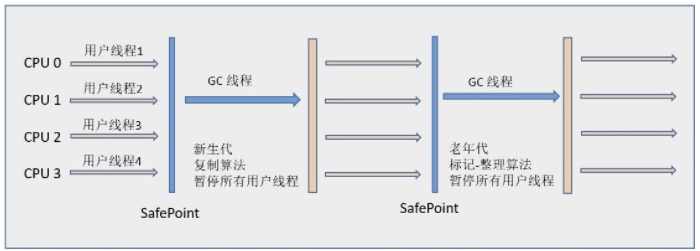

**ParNew收集器（全程STW）**

ParNew是Serial收集器的多线程版本，也是**新生代收集器**。使用多线程进行垃圾收集，其余行为（如-XX:SurvivorRatio等参数、**复制算法**、Stop The World、对象分配规则、回收策略等）与Serial一致。

一般是**Server模式下首选的新生代收集器，目前只有它能与CMS收集器配合工作**。ParNew在单CPU环境不会比Serial更好，但随着可用CPU增加，对系统资源的利用有好处。默认开启的收集器线程数与CPU数量相同，可使用`-XX:ParallelGCThreads`限制线程数。

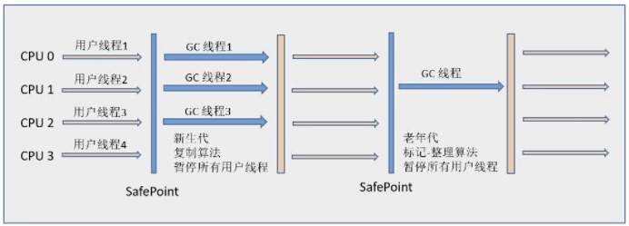

# 8. Parallel Scavenge 收集器的特点是什么？

Parallel Scavenge 收集器的关注点与其他收集器有什么不同？

**原理分析**

Parallel Scavenge是一个**并行的多线程新生代收集器**，使用**复制算法**。

它的关注点与其他收集器不同——CMS等收集器关注缩短GC时用户线程的停顿时间，而Parallel Scavenge的目标是**达到一个可控制的吞吐量（Throughput）**。

**停顿时间越短就越适合需要与用户交互的程序**，良好的响应速度能提升用户体验。**高吞吐量**可以**高效率地利用CPU时间**，尽快完成程序的运算任务，主要**适合在后台运算而不需要太多交互的任务**。

**GC自适应调节策略（GC Ergonomics）：**

Parallel Scavenge提供了参数`-XX:+UseAdaptiveSizePolicy`，打开后不需要手工指定新生代大小（-Xmn）、Eden和Survivor比例（-XX:SurvivorRatio）、晋升老年代对象年龄（-XX:PretenureSizeThreshold）等细节参数，虚拟机会根据系统运行情况动态调整，提供最合适的停顿时间或最大吞吐量。这是Parallel Scavenge与ParNew的一个重要区别。

Parallel Scavenge**无法与CMS收集器配合使用**，所以在JDK 1.6推出Parallel Old之前，老年代只有**Serial Old收集器**能与之配合使用。

# 9. Serial Old 和 Parallel Old 收集器的作用是什么？

**原理分析**

**Serial Old收集器**

Serial Old是Serial收集器的老年代版本，**单线程收集器**，使用**"标记-整理"（Mark-Compact）算法**。

主要用于：

- **Client模式**下的虚拟机使用
- 在**JDK 1.5及之前版本**（Parallel Old诞生以前）中与**Parallel Scavenge收集器搭配使用**
- 作为**CMS收集器的后备预案**，在并发收集发生**Concurrent Mode Failure**时使用

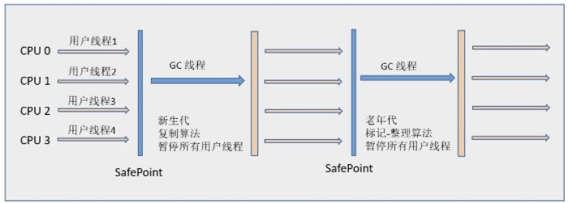

**Parallel Old收集器**

Parallel Old是Parallel Scavenge收集器的老年代版本，使用**多线程**和**"标记-整理"算法**。JDK 1.6中才开始提供。

在Parallel Old诞生以后，**"吞吐量优先"收集器**终于有了名副其实的应用组合。在**注重吞吐量**以及**CPU资源敏感**的场合，都可以优先考虑Parallel Scavenge加Parallel Old收集器。

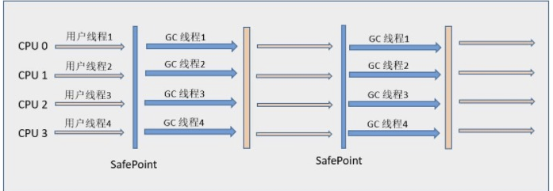

# 10. CMS 收集器的工作原理和优缺点？

CMS收集器的工作流程是怎样的？有什么优缺点？

**原理分析**

CMS（Concurrent Mark Sweep）是一款**老年代专属收集器**，新生代默认搭配ParNew（新生代全程STW）。它以**获取最短回收停顿时间（减少停顿时间）**为目标，非常适合互联网站或B/S系统服务端上的Java应用，重视服务响应速度。从名字"Mark Sweep"可以看出它是基于**"标记-清除"算法**实现的。

**CMS：标记+标记清除→碎片多**

**CMS工作流程（4个步骤）：**

1. **初始标记（CMS initial mark）——（STW）**
   - 仅仅标记GC Roots能直接关联到的对象，速度很快，**需要Stop The World**
   - 标记老年代中所有的GC Roots对象
   - 标记年轻代中活着的对象引用到的老年代对象（年轻代中还存活的引用类型对象，引用指向老年代中的对象）
2. **并发标记（CMS concurrent mark）**
   - 进行**GC Roots Tracing**的过程，整个过程中耗时最长
   - 从"初始标记"阶段标记的对象开始找出所有存活的对象
   - 因为是并发运行，期间会发生新生代对象晋升到老年代、直接在老年代分配对象、或更新老年代对象的引用关系（**白色的**）等，这些对象需要重新标记，否则会发生漏标
   - **使用三色标记法**
3. **重新标记（CMS remark）——（STW）**
   - 修正并发标记期间因用户程序继续运作而导致标记变动的部分
   - 停顿时间一般比初始标记稍长，但远短于并发标记
   - **需要Stop The World**
   - 并发标记阶段用户线程和GC线程并发，如果用户线程产生了新对象，这个对象是白色的，不能被GC掉，此阶段让这些对象重新标记
4. **并发清除（CMS concurrent sweep）**
   - 耗时最长的并发标记和并发清除过程收集器线程都可以**与用户线程一起工作**
   - CMS收集器的内存回收过程与用户线程一起并发执行

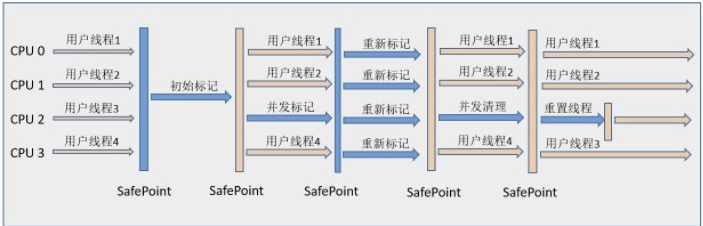

**优点：**

- **并发收集**、**低停顿**，也被称为并发低停顿收集器（Concurrent Low Pause Collector）
- CMS默认分代年龄是6次，即YGC 6次后还存活的对象晋升到老年代

**缺点：**

- **对CPU资源非常敏感**：并发阶段会占用一部分CPU资源导致应用变慢，**总吞吐量会降低**。CMS默认回收线程数是（CPU数量+3）/4，当CPU不足4个时影响可能很大
- **无法处理浮动垃圾（Floating Garbage）**：可能出现"Concurrent Mode Failure"导致另一次Full GC。并发清理阶段用户线程还在运行，新产生的垃圾无法在当次收集中处理掉，只能留待下次GC清理。因此CMS需要预留足够内存空间给用户线程
- **标记-清除算法导致的空间碎片**：收集结束会有大量空间碎片，大对象分配时可能找不到足够连续空间。可通过`-XX:+UserCMSCompactAtFullCollection`在Full GC后额外碎片整理，但内存整理无法并发，停顿时间变长

# 11. G1 收集器的工作原理和特点？

G1收集器相比其他收集器有什么特点？它的工作流程是怎样的？

**原理分析**

**G1（Garbage-First）**是一款**面向服务端应用**的垃圾收集器，使命是替换CMS收集器。

**G1的特点：**

- **并行与并发**：充分利用多CPU、多核环境，使用多个CPU缩短STW停顿时间，部分操作可通过并发方式让Java程序继续执行
- **分代收集**：分代概念在G1中依然保留，但G1可以**不需要其他收集器配合**就能独立管理整个GC堆
- **空间整合**：从整体来看基于**"标记-整理"算法**，从局部（两个Region之间）来看基于**"复制"算法**，运行期间**不会产生内存碎片**，分配大对象时不会因找不到连续内存而提前触发GC
- **可预测的停顿**：降低停顿时间是G1和CMS共同的关注点，但G1还能建立可预测的停顿时间模型，让使用者指定在M毫秒内GC消耗不超过N毫秒
- **横跨整个堆内存**：将整个Java堆划分为多个大小相等的独立区域（Region），新生代和老年代**不再是物理隔离的**，都是一部分Region（不需要连续）的集合
- **建立可预测的时间模型**：**跟踪各个Region里的垃圾堆积价值大小**（回收获得的空间大小及所需时间），在后台维护**优先列表**，每次根据允许的收集时间**优先回收价值最大的Region**（Garbage-First名称的来由）
- **Remembered Set**：为每个Region维护一个Remembered Set，避免全堆扫描。通过Write Barrier在引用跨Region时记录到Remembered Set中，GC时加入Remembered Set即可保证不遗漏

**G1收集器运作步骤（4步）：**

1. **初始标记（Initial Marking）——（STW）**
   - 标记GC Roots能直接关联到的对象，修改**TAMS（Next Top Mark Start）**的值
   - 需要**停顿线程**，但耗时很短，不清理垃圾，只做基础标记
2. **并发标记（Concurrent Marking）**
   - 从GC Root开始对堆中对象进行**可达性分析**，找到存活对象
   - 耗时较长，但**可与用户程序并发执行**
   - **三色标记法**，只标记存活，不删除、不回收
3. **最终标记（Final Marking）——（STW）**
   - 修正并发标记期间因用户程序运作导致标记变动的部分
   - 将**Remembered Set Logs**合并到Remembered Set中
   - 需要**停顿线程**，但是**可并行执行**
4. **筛选回收（Live Data Counting and Evacuation）——（STW）**
   - 对各Region回收价值和成本排序，根据用户期望的GC停顿时间制定回收计划
   - **停顿用户线程**将大幅提高收集效率
   - **新生代：复制算法（Eden→Survivor）；中老年代Region：复制+整理**

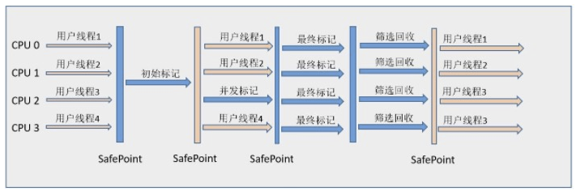

**G1总结：**
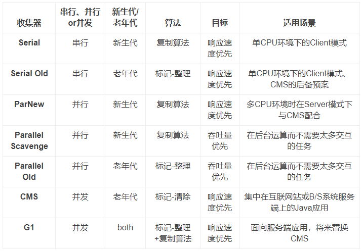

# 12. 相比 CMS，G1 有哪些改进？

**原理分析**

相比CMS，G1收集器有两大改进：

1. **基于标记-整理算法，不会产生空间碎片**。CMS使用标记清除算法，碎片多
2. **可以精确控制停顿**，使用者明确指定消耗在GC上的时间不得超过N毫秒

G1收集器可以**实现在基本不牺牲吞吐量的前提下，完成低停顿的内存回收**。因为它**避免全区域的垃圾回收**。其他回收器在整个新生代或老年代回收，而G1将整个Java堆（老年代和新生代）**划分为多个大小固定的独立Region**，跟踪**区域里垃圾堆积程度**，在**后台维护一个优化列表**，每次根据允许的收集时间，**优先回收垃圾最多的区域**。区域划分和有优先级的回收，保证了在有限时间内获得最高的回收效率。

> CMS在Java 9中已被废弃，从Java 9开始G1成为默认GC。CMS老年代收集器需要ParNew新生代配合，G1不需要。

# 13. ZGC 的设计目标和核心技术？

ZGC相比G1/CMS有什么核心优势？三大革命性技术是什么？

**原理分析**

ZGC是面向**超低延迟、超大堆**的垃圾回收器，核心是**停顿与堆大小解耦**（≤10ms，JDK21可达亚毫秒），全程**并发标记+并发重定位**，仅**3个极短STW阶段**。

**三大革命性技术：**

1. **染色指针（Colored Pointers）**
   - 64位指针高4位嵌入元数据：Marked0/Marked1/Remapped/Finalizable
   - 直接从指针判断对象状态，**无需访问对象头**，支持并发移动
2. **读屏障（Load Barrier）**
   - 读取对象引用时触发，完成**标记自愈、转发自愈、引用修正**
   - 让应用线程"顺便"帮GC干活，实现**无STW重定位**
3. **并发重定位（Concurrent Relocation）**
   - 全程不STW复制对象、更新引用
   - 转发表（Forwarding Table）记录新旧地址，读屏障自动转发

**相比G1/CMS的核心改进：**

- **无分代**：不分新生代/老年代，全局统一管理
- **停顿与堆大小无关**：TB级堆仍≤10ms
- **全程并发整理**：无内存碎片，**永不Full GC**
- **读屏障替代写屏障**：降低并发冲突，提升吞吐量
- **超大堆支持**：最大16TB，NUMA友好

**ZGC触发时机：**
基于**内存使用率、分配速率、停顿目标**动态触发，无固定阈值。

1. **主动触发**
   - 堆使用率达到阈值（默认90%）
   - 内存分配速率过高、预测即将OOM
   - 显式调用System.gc()（不推荐）
2. **被动触发**
   - 分配大对象失败
   - 达到配置的GC周期时间

# 14. ZGC 的完整阶段是怎样的？

**原理分析**

**ZGC完整阶段（6步）+ 算法 + STW状态：**

1. **初始标记（Mark Start）——（STW，<1ms）**
   - **算法**：GC Roots扫描+三色标记初始化
   - 标记GC Roots直接可达对象，设为灰色，启动并发标记
   - 极短，与堆大小无关
2. **并发标记（Concurrent Mark）——（并发，无STW）**
   - **算法**：三色标记+染色指针+读屏障
   - 遍历对象图，标记所有存活对象；读屏障拦截访问，补标漏标对象
   - 与业务完全并行，耗时与堆大小正相关
3. **最终标记（Mark End / Remark）——（STW，<1ms）**
   - **算法**：增量标记+弱引用处理
   - 修正并发标记期间的引用变化，处理软/弱/虚引用，完成最终标记
   - 极短，收尾标记
4. **并发准备重定位（Concurrent Prepare for Relocate）——（并发，无STW）**
   - **算法**：Region收益排序+重定位集构建
   - 统计每个Region垃圾占比，选出收益最高的组成**重定位集**，建立转发表
   - 规划回收范围，不移动对象
5. **初始重定位（Relocate Start）——（STW，<1ms）**
   - **算法**：GC Roots重定位+转发初始化
   - 转移GC Roots直接引用的对象，更新指针与染色位，初始化转发表
   - 极短，为并发重定位铺路
6. **并发重定位（Concurrent Relocate）——（并发，无STW）**
   - **算法**：复制算法+读屏障转发+指针自愈
   - GC线程并发复制存活对象到新Region
   - 应用线程访问旧对象时，读屏障自动转发到新地址并修正引用（**自愈**）
   - 原Region整体回收，**无碎片**
   - ZGC最核心阶段，全程不STW

# 15. 什么是三色标记算法？

**原理分析**

三色标记算法是描述追踪式回收器的一种有效方法，利用它可以推演回收器的正确性。

**三种对象类型：**

1. **黑色**：根对象，或该对象与它的子对象都被扫描过（对象被标记了，且所有field也被标记完）——**程序所需要的对象**
2. **灰色**：对象本身被扫描，但还没扫描完该对象中的子对象（它的field还没有被标记或标记完）——**GC需要从此对象中寻找垃圾**
3. **白色**：未被扫描对象，扫描完成所有对象之后，最终为白色的为不可达对象，即**垃圾对象**（对象没有被标记到）

三色标记法是**针对原来已经有了的对象（从初始标记过来的）**，重新标记是**针对原来没有的对象（并发标记时可能新增的对象，重新标记，确认是否是垃圾对象）**。

# 16. 什么是安全点（Safepoint）？GC 为什么要等待所有线程到达安全点？

程序执行时并非在所有地方都能停顿下来开始GC，只有在特定的位置才能停顿下来开始GC，这些位置称为**安全点（Safepoint）**。GC强制要求所有线程必须执行到达安全点后才能暂停。

**Safe Point选择：**

- 如果太少可能导致GC等待时间太长
- 如果太频繁可能导致运行时的性能问题
- 大部分指令执行时间短暂，通常以"是否具有让程序长时间执行的特征"为标准
- 选择执行时间较长的指令作为Safe Point，如**方法调用、循环跳转和异常跳转**等

**STW总耗时三阶段：**
一次STW总耗时 = **TTSP（Time To Safepoint）** + **VM Operation（执行GC/代码撤销/偏向锁撤销等）** + **Resume（恢复线程）**

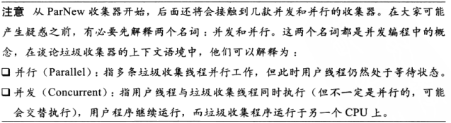

> Java 8中int型计数循环导致安全点停顿（STW）过长是什么原因？

JIT（C2）判定int型固定次数循环为**可数循环（Counted Loop）**，认为执行很快，等循环结束后线程才会进入安全点。**循环体内不插入安全点检查**。当循环次数极大（如10亿次），线程会**一直跑完全部循环才响应GC安全点请求**，导致JVM长时间等待、STW停顿飙升。**当GC触发时，需要STW，但必须所有线程到达安全点才开始GC**，JVM必须等10亿次循环跑完才能进入安全点。此时其他业务线程也需要等待，全部阻塞等待，导致其他线程卡死。

**解决办法：** 使用long类型循环变量、或sleep(0)，使其在循环中可以设置安全点。

# 17. Java 有哪几种引用类型？各自的回收时机？

**原理分析**

一个对象被GC回收的前提：**所有强引用全部断开**，只剩软/弱/虚引用时，才会按各自规则回收。

**1. 强引用（Strong Reference）**

最常见的引用。如果一个对象有强引用，垃圾回收时**绝不会回收它**。当内存不足时，**JVM宁愿抛出OutOfMemoryError错误，使程序异常终止**，也不会靠随意回收具有强引用的对象来解决内存不足。

**2. 软引用（Soft Reference）**

如果对象只有软引用，则**内存空间充足时不会回收**；**如果内存不足时就会回收**这些对象内存。

**3. 弱引用（Weak Reference）——ThreadLocal中有用到**

**一旦垃圾回收线程扫描到弱引用的对象，不管内存空间是否够，都会回收它的内存**。不过由于垃圾回收器是优先级很低的线程，不一定会很快发现只具有弱引用的对象。

**弱引用回收条件：** 一个对象**没有任何强引用**指向它，**只剩弱引用**时，才会被GC回收。

**4. 虚引用（Phantom Reference）**

形同虚设，不会决定对象的生命周期。如果一个对象仅持有虚引用，那么它就和没有任何引用一样，**在任何时候都可能被垃圾回收器回收**。

虚引用**主要用来跟踪对象被垃圾回收器回收的活动**。**虚引用必须和引用队列（ReferenceQueue）联合使用**。当垃圾回收器准备回收一个对象时，如果发现它还有虚引用，就会在回收对象的内存之前，把这个虚引用加入到与之关联的引用队列中。

# 18. System.gc() 会立即触发 GC 吗？

**原理分析**

`gc()`函数的作用只是提醒虚拟机：程序员希望进行一次垃圾回收。但是它不能保证垃圾回收一定会进行，而且具体什么时候进行取决于具体的虚拟机，不同的虚拟机有不同的对策。

- `System.runFinalization()` 强制调用，会使 `justRanFinalization` 置为true，两个配合使用效果最好
- 如果没有将JVM启动参数 `DisableExplicitGC`（显式GC）设置为false，则执行GC，GC原因是System.gc触发
- **ZGC：直接不处理，不支持通过System.gc()触发GC**

# 19. Full GC 能回收直接内存吗？Netty 的堆外内存能被回收吗？

**原理分析**

**Full GC可以回收直接内存（堆外内存DirectBuffer），Minor GC不能。**

**回收逻辑：**

- 直接内存不属于JVM堆，不受-Xmx控制，由操作系统管理
- DirectByteBuffer是**堆内对象**，真正的直接内存是**堆外物理内存**
- 堆内的DirectByteBuffer被GC标记为垃圾
- **Full GC会扫描堆内所有对象**
- 发现DirectByteBuffer无人引用→调用Cleaner/Unsafe
- **主动释放堆外直接内存**

直接内存依赖堆内DirectByteBuffer垃圾回收，Minor GC只回收新生代无法释放堆外内存；Full GC会全堆扫描，回收失效的DirectByteBuffer，通过Cleaner机制释放直接内存。

**Netty管理的堆外内存：**

- **Netty默认：堆外内存不会被Full GC回收**
- 原因：Netty自研内存池+计数引用+禁用了JDK自动回收
- 只有**Netty正常主动释放**，才会归还堆外内存
- 不靠JVM GC、不靠Cleaner、不受Full GC控制

# 20. 如何查看 JVM GC 信息？

**原理分析**

**jstat命令使用：**

```bash
jstat -<option> [-t] [-h<lines>] <vmid> [<interval> [<count>]]
```

示例：

```bash
jstat -gcutil 26178 1000 100
```

表示分析进程id为26178的gc情况，每隔1000ms打印一次记录，打印100次停止。

```bash
jstat -gc -h3 31736 1000 10
```

表示分析进程id为31736的gc情况，每隔1000ms打印一次记录，打印10次停止，每3行后打印指标头部。

**jstat -gcutil** 查看gc的统计信息。

**jmap -heap pid** 可以查看JVM各划分内存信息。

# 21. 如何评估GC是否有问题？核心指标是什么？

如何判断GC是否存在问题？评估GC有哪些核心指标？

**原理分析**

评判GC的两个核心指标：

- **延迟（Latency）**：最大停顿时间，即垃圾收集过程中一次STW的最长时间，越短越好，GC技术的主要发展方向
- **吞吐量（Throughput）**：应用系统生命周期内，GC线程会占用CPU时钟周期，吞吐量 = Mutator有效花费时间 / 系统总运行时间 × 100%。例如系统运行100min，GC耗时1min，则吞吐量为99%

目前互联网公司系统更追求低延迟，衡量指标需结合应用服务的SLA：

- **一次停顿时间不超过服务TP9999**
- **GC吞吐量不小于99.99%**

举个例子，假设服务A的TP9999为80ms，平均GC停顿为30ms，那么最大停顿最好不超过80ms，GC频次控制在5分钟以上一次。如果满足不了，则需要调优或通过更多资源并联冗余。

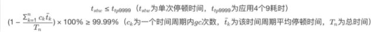

# 22. 什么是GC overhead limit exceeded？

java.lang.OutOfMemoryError: GC overhead limit exceeded是什么原因导致的？

**原理分析**

JVM抛出该错误意味着程序基本耗尽了所有可用内存，GC也清理不了。

触发条件：

- GC花费时间超过**98%**
- GC回收内存少于**2%**

即执行垃圾收集的时间比例太大，有效运算量太小。JVM判定程序陷入"GC恶性循环"——不断GC但几乎回收不到内存，继续运行无意义，因此抛出OOM错误。

# 23. GC日志参数有哪些？如何解读GC日志？

常用的GC日志参数有哪些？如何看懂GC日志？

**原理分析**

**常用GC日志参数：**

- `-verbose:gc`：输出简要GC日志
- `-XX:+PrintGCDetails`：输出详细GC日志
- `-Xloggc:gc.log`：输出GC日志到文件
- `-XX:+PrintGCTimeStamps`：输出GC时间戳（JVM启动到当前时长）
- `-XX:+PrintGCDateStamps`：输出GC时间戳（日期格式）
- `-XX:+PrintHeapAtGC`：GC前后打印堆信息
- `-XX:+PrintReferenceGC`：打印年轻代各引用数量及时长

**简要GC日志（-XX:+PrintGC）：**

```
[GC (Allocation Failure) 61805K->9849K(256000K), 0.0041139 secs]
```

- `GC`：Young GC（Full GC会显示Full GC）
- `Allocation Failure`：年轻代没有足够空间存放需要分配的数据
- `61805K->9849K`：年轻代回收前后占用
- `256000K`：整个堆大小
- `0.0041139 secs`：GC耗时

**详细GC日志（-XX:+PrintGCDetails）：**

```
[GC (Allocation Failure) [PSYoungGen: 53248K->2176K(59392K)] 58161K->7161K(256000K), 0.0039189 secs] [Times: user=0.02 sys=0.01, real=0.00 secs]
```

- `PSYoungGen: 53248K->2176K(59392K)`：年轻代回收前后占用及总大小
- `58161K->7161K(256000K)`：整个堆回收前后占用及总大小
- `Times: user=0.02 sys=0.01, real=0.00 secs`：用户态CPU用时、内核CPU用时、真实时间

**Full GC日志（CMS示例）：**

```
[Full GC (Heap Inspection Initiated GC) [CMS: 496174K->422496K(3145728K), 0.6706373 secs] 1257591K->422496K(5976896K), [Metaspace: 47591K->47591K(1091584K)], 0.6717703 secs] [Times: user=0.56 sys=0.12, real=0.68 secs]
```

- `Full GC (Heap Inspection Initiated GC)`：Full GC，由Heap Inspection触发
- `CMS: 496174K->422496K(3145728K)`：CMS收集器回收老年代
- `1257591K->422496K(5976896K)`：整个堆回收前后及总大小
- `Metaspace: 47591K->47591K(1091584K)`：元空间回收前后及总大小

**Ergonomics（自适应调节）：**

Ergonomics负责自动调节GC暂停时间和吞吐量之间的平衡，让虚拟机性能更优。Full GC原因中出现Ergonomics时，说明是JVM自适应调节触发的。

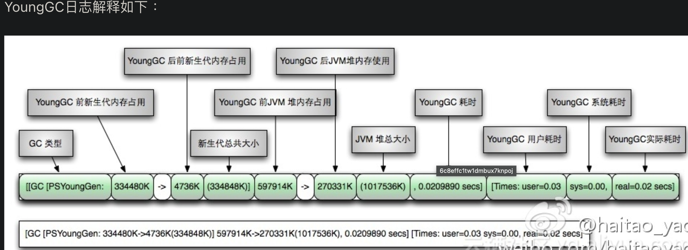

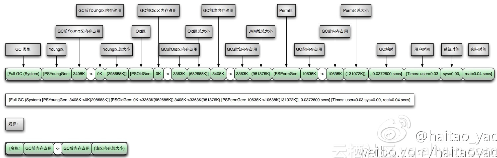

# 24. Full GC的常见触发原因有哪些？

GC日志中的触发原因（GCCause）有哪些常见类型？

**原理分析**

常见GC触发原因：

- **Allocation Failure**：年轻代无足够空间分配对象，触发Young GC
- **System.gc()**：代码显式调用System.gc()触发
- **Metadata GC Threshold**：元空间不足触发
- **CMS Generation Full**：CMS老年代满触发
- **CMS Initial Mark / CMS Final Remark**：CMS收集器各阶段标记
- **G1 Evacuation Pause**：G1新生代回收暂停
- **G1 Humongous Allocation**：G1分配大对象触发
- **Ergonomics**：JVM自适应调节触发
- **Heap Inspection Initiated GC**：jmap等工具触发
- **Heap Dump Initiated GC**：生成Heap Dump触发
- **GCLocker Initiated GC**：JNI临界区结束后触发
- **Tenured Generation Full**：老年代满触发

# 25. ZGC的触发机制有哪几种？

ZGC的GC触发方式有哪些？各在什么场景下触发？

**原理分析**

ZGC的触发机制与其他GC有很大不同，核心特点是并发，GC过程中一直有新对象产生。如何保证GC完成前新对象不把堆占满，是ZGC调优的首要目标。

**ZGC触发机制（7种）：**

1. **阻塞内存分配请求（Allocation Stall）**
   - 垃圾来不及回收将堆占满时，部分线程阻塞等待GC完成
   - **应避免出现**，会导致秒级停顿

2. **基于分配速率的自适应算法（Allocation Rate）**
   - 最主要的触发方式，根据近期对象分配速率和GC时间动态计算触发阈值
   - 通过`ZAllocationSpikeTolerance`参数控制阈值（默认2），越大越早触发

3. **基于固定时间间隔（Timer）**
   - 通过`ZCollectionInterval`控制
   - 适合应对突增流量场景（定时活动、秒杀等），避免自适应算法触发过晚

4. **主动触发（Proactive）**
   - ZGC自行计算的不固定时间间隔
   - 如果担心GC频繁影响可用性，可通过`-ZProactive`关闭

5. **预热规则（Warmup）**
   - 服务刚启动时出现，一般不需要关注

6. **外部触发（System.gc()）**
   - 代码显式调用System.gc()
   - ZGC默认不处理System.gc()调用

7. **元数据分配触发（Metadata GC Threshold）**
   - 元数据区不足时触发，一般不需要关注

# 26. ZGC的停顿场景有哪些？

ZGC在哪些情况下会导致程序停顿？

**原理分析**

ZGC的主要优势是低停顿，但以下6种场景仍会导致程序停顿：

1. **初始标记（Pause Mark Start）**
   - GC Roots标记，极短，与堆大小无关
2. **再标记（Pause Mark End）**
   - 修正并发标记期间的引用变化，最多1ms
3. **初始转移（Pause Relocate Start）**
   - 转移GC Roots直接引用的对象，极短
4. **内存分配阻塞（Allocation Stall）**
   - 内存不足时线程阻塞等待GC完成，应避免
5. **安全点（Safepoint）**
   - 所有线程进入安全点后才能GC，先到达的线程需等待
6. **Dump线程/内存（jstack/jmap）**
   - jstack、jmap等工具也会导致停顿

# 27. ZGC的地址空间如何划分？并发处理时地址视图如何切换？

ZGC如何通过着色指针和地址空间划分实现全并发处理？

**原理分析**

**地址空间划分：**

ZGC仅支持64位系统，将64位虚拟地址空间划分为多个子空间：

- [0~4TB)：Java堆
- [4TB~8TB)：M0地址空间
- [8TB~12TB)：M1地址空间
- [12TB~16TB)：预留未使用
- [16TB~20TB)：Remapped地址空间

ZGC实际使用第0~41位作为地址，第42~45位存储元数据（对象存活信息），第46~63位固定为0。这与传统垃圾回收将对象存活信息放在对象头中完全不同。

**地址视图切换过程：**

1. **初始化**：整个内存空间视图设置为Remapped，程序正常分配对象
2. **并发标记阶段**：视图切换为M0。对象被GC标记线程或应用线程访问后，地址视图从Remapped调整为M0。标记结束后，M0视图=活跃对象，Remapped=不活跃对象
3. **并发转移阶段**：视图再次切换为Remapped。对象被GC转移线程或应用线程访问后，地址视图从M0调整为Remapped

M0和M1两个地址视图的设计是为了区别前一次标记和当前标记。第二次进入并发标记时，地址视图调整为M1而非M0。

**为什么能实现全并发：**

标记-复制算法分为标记、转移、重定位三个阶段。G1的转移阶段完全STW，因为转移过程中无法准确定位对象地址。ZGC通过**着色指针+读屏障**解决该问题：

- 应用线程访问对象时触发读屏障
- 读屏障检查指针染色位，若对象已移动，则自动转发到新地址并修正引用（**自愈**）
- 整个过程无需STW，应用线程"顺便"帮GC干活

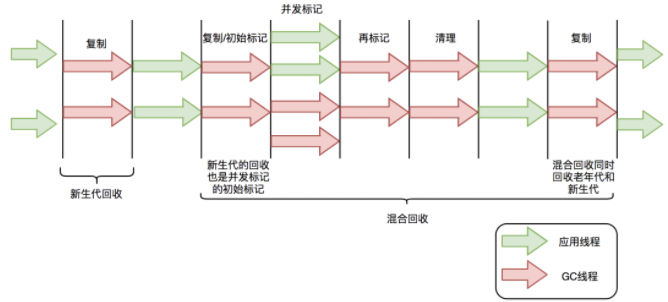

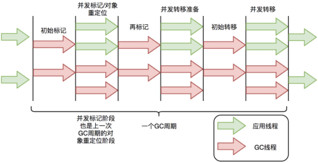

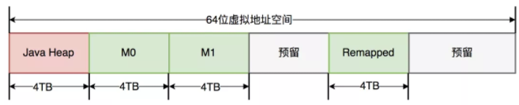

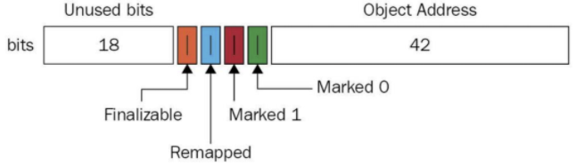

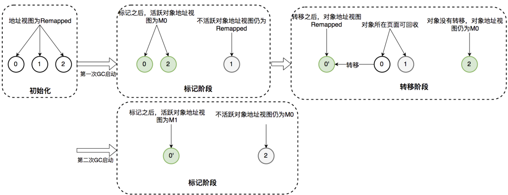

