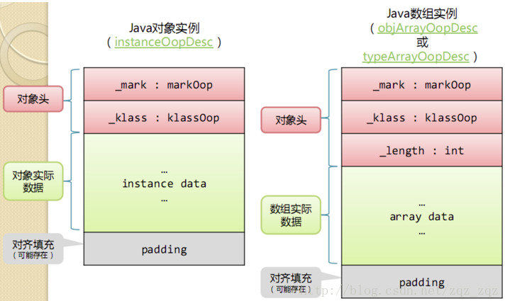
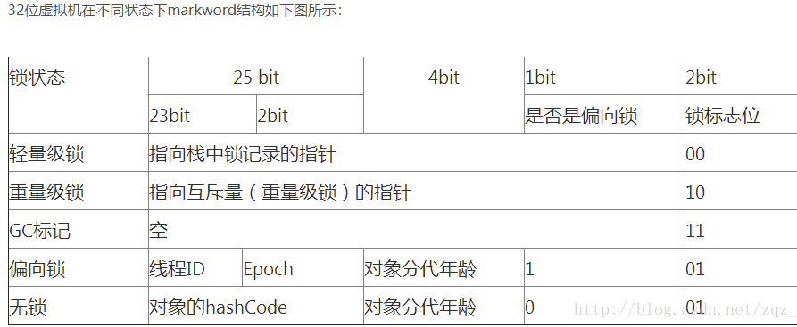
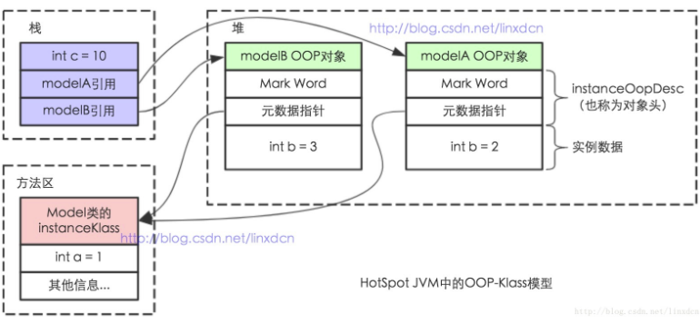

# 1. Java 对象在内存中的结构是什么？

Java对象在内存中如何存储？由哪几部分组成？

**原理分析**

在HotSpot虚拟机中，对象在内存中存储的布局分为3块区域：**对象头（Header）、实例数据（Instance Data）和对齐填充（Padding）**。

**对象头：**

- **Mark Word**：存储对象自身的运行时数据，如哈希码、GC分代年龄、锁状态标志、线程持有的锁、偏向线程ID、偏向时间戳等。32位和64位虚拟机中长度分别为32bit和64bit
- **Klass指针**：对象指向它的类元数据的指针，虚拟机通过这个指针确定对象是哪个类的实例
- **数组长度**（仅数组对象有）：记录数组长度

**实例数据：**

对象真正存储的有效信息，即程序代码中定义的各种类型的字段内容，包括从父类继承的和子类中定义的。

**对齐填充：**

不是必然存在的，仅起占位符作用。HotSpot VM要求对象起始地址必须是**8字节的整数倍**，当实例数据部分没有对齐时，通过对齐填充来补全。

# 2. 对象头中的 Mark Word 存储哪些信息？

Mark Word中存储了什么？锁状态标志位如何工作？

**原理分析**

Mark Word用于存储对象自身的运行时数据，包括**哈希码、GC分代年龄、锁状态标志、线程持有的锁、偏向线程ID、偏向时间戳**等。

Mark Word的**最后2bit是锁状态标志位**，用来标记当前对象的状态。对象的状态决定了Mark Word存储的内容：

对象一共有**五种状态**：无锁态、偏向锁、轻量级锁、重量级锁、GC标记。2bits只能表示四种状态（00、01、10、11），第五种状态需要额外依赖1Bit空间，使用0和1来区分。

在32位HotSpot虚拟机中，对象未被锁定的状态下，Mark Word的32bits中：
- 25bits用于存储对象哈希码
- 4bits用于存储对象分代年龄
- 2bits用于存储锁标志位
- 1bit固定为0，表示非偏向锁

# 3. 什么是 OOP-Klass 模型？为什么 HotSpot 要这样设计？

HotSpot如何表示Java对象？什么是OOP-Klass模型？

**原理分析**

HotSpot JVM设计了**OOP-Klass Model**：

- **OOP（Ordinary Object Pointer）**：普通对象指针，指向对象实例数据。对象的实例（instanceOopDesc）保存在**堆**上
- **Klass**：用来描述对象实例的具体类型。对象的元数据（instanceKlass）保存在**方法区**

对象的**引用保存在栈上**。

**设计原因：** HotSpot的设计者**不想让每个对象中都含有一个vtable（虚函数表）**。

每一个Java类在被JVM加载时，JVM会为该类创建一个instanceKlass保存在方法区，用来在JVM层表示该Java类。当使用new创建对象时，JVM会创建一个instanceOopDesc对象，包含对象头及实例数据。

对象头中的元数据维护的是**指针**，指向对象所属类的instanceKlass。

# 4. 对象大小如何计算？32位和64位有什么区别？

如何计算一个Java对象占用的内存空间？开启指针压缩后有什么变化？

**原理分析**

**32位系统：**

- Klass指针：4字节
- Mark Word：4字节
- 对象头：8字节

**64位系统（未开启指针压缩）：**

- Klass指针：8字节
- Mark Word：8字节
- 对象头：16字节

**64位系统（开启指针压缩）：**

- Klass指针：4字节
- Mark Word：8字节
- 对象头：12字节

**数组对象（64位开启指针压缩）：**

- 数组长度：4字节
- 数组对象头：8字节（对象引用4字节 + 数组markword 4字节）
- 对齐填充：4字节
- 共16字节

**注意：** 静态属性不计算在对象大小内。

# 5. 为什么需要内存对齐？

为什么Java对象要求8字节对齐？不对齐会有什么问题？

**原理分析**

需要字节对齐的原因包括：

- **硬件平台限制**：并非所有硬件平台都能随意访问任意位置的内存。不少平台（如Alpha、IA-64、MIPS、SuperH）若读取的数据未对齐（如4字节的int在奇数内存地址上），将拒绝访问或抛出硬件异常
- **CPU访问效率**：对齐的数据可以一次内存访问完成读取，未对齐可能需要多次访问，本质是**空间换时间**

Java对象占用空间是**8字节对齐**的，即所有Java对象占用bytes数必须是8的倍数。例如一个包含两个属性的对象（int和byte）需要占用8+4+1=13个字节，加上3字节padding进行8字节对齐，最终占用16字节。

# 6. Java 对象的生命周期有哪些阶段？

一个Java对象从创建到销毁经历哪些阶段？

**原理分析**

Java对象的生命周期包括7个阶段：

- **创建阶段（Created）**：为对象分配存储空间，构造对象，对对象初始化
- **应用阶段（In Use）**：对象至少被一个**强引用**持有
- **不可见阶段（Invisible）**：对象不再被强引用，程序运行超出了对象的作用域
- **不可达阶段（Unreachable）**：该对象不再被任何强引用持有。与不可见阶段的区别在于，不可见阶段程序不再持有该对象的任何强引用，但对象仍可能被JVM系统下的某些已装载的静态变量、线程或JNI等强引用持有着（**GC Root**），这些GC Root会导致对象内存泄露，无法被回收
- **收集阶段（Collected）**：垃圾回收器发现对象处于不可达阶段，已做好内存空间重新分配的准备。如果对象重写了**finalize()**方法，会执行该方法
- **终结阶段（Finalized）**：执行完finalize()后仍不可达，等待垃圾回收器回收
- **对象空间重分配阶段（De-allocated）**：垃圾回收器回收或再分配对象内存空间，对象彻底消失
