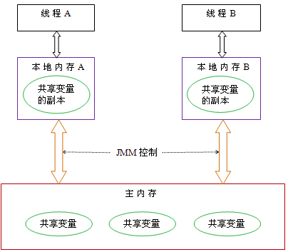
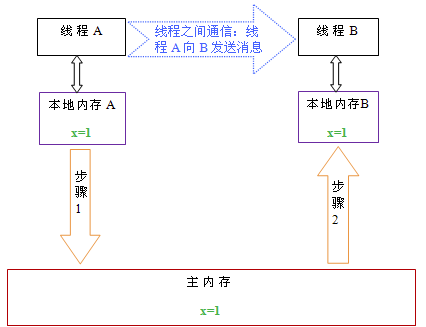
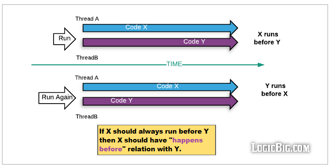
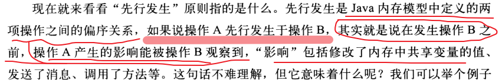
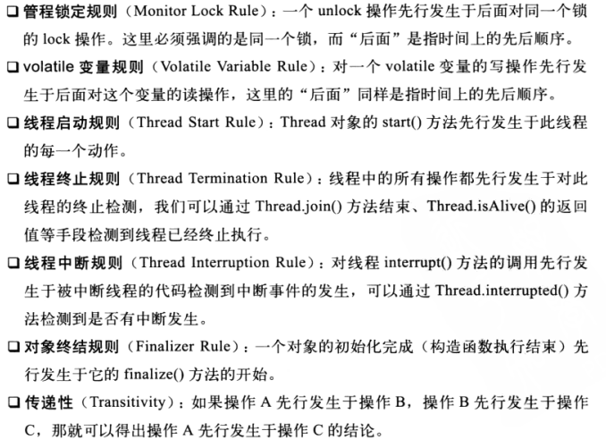
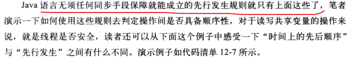
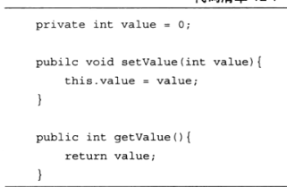

# 1. 什么是 Java 内存模型（JMM）？为什么需要它？

JMM是什么？解决了什么问题？为什么Java需要一套内存模型规范？

**原理分析**

**Java内存模型（JMM）是JVM规范的一部分**，用于屏蔽不同硬件和操作系统的内存访问差异，让Java程序能够**跨平台一致地处理多线程共享变量的可见性问题**。JMM规定了**一个线程对共享变量的写入何时对另一个线程可见**。

从抽象角度看，JMM定义了线程与主内存之间的关系：

- **主内存（Main Memory）**：所有共享变量都存储在主内存中
- **本地内存（Local Memory）**：每个线程有自己的私有本地内存（也叫工作内存），存储了该线程用到的共享变量副本
- 线程对变量的**读和写都在本地内存中进行**，线程间无法直接访问对方的本地内存，共享变量传递必须通过**主内存中转**

**本地内存是一个抽象概念，并不真实存在**。它涵盖了CPU缓存、写缓冲区、寄存器以及各种硬件和编译器优化。承载这个概念的主要是两部分：

- **编译器**：编译器为了性能会尽量减少从内存读取数据，优先使用寄存器中的值，但这也导致可能读不到最新值
- **微架构**：CPU在执行指令时会做指令重排，编译器生成的指令顺序和真正在CPU执行的顺序可能不一致

在多核CPU中，每个核心有自己的独立高速缓存，关于同一个数据的缓存内容可能不一致，这就是**缓存一致性问题**。Intel 的指令里专门提供了一个前缀 **F0H** 强制使用主内存，但程序通常无法感知这些底层细节。

JMM的本质是：在编译器各种优化及多种微架构平台上，JVM规范制定者创建了一个虚拟概念，让Java程序员能够在这个概念上写出线程安全的程序；而编译器实现者根据规范中的约束，在不同平台上达到所需的线程安全保障。

# 2. JMM 中定义了哪些原子操作？有哪些规则？

Java内存模型定义了哪些主内存与工作内存之间的交互操作？必须满足哪些规则？

**原理分析**

JMM定义了以下**8种原子操作**来完成主内存与工作内存之间的交互，每种操作都是原子的、不可再分的：


8种操作的名称及含义：

- **lock（锁定）**：作用于主内存变量，把一个变量标识为一条线程独占的状态
- **unlock（解锁）**：作用于主内存变量，把一个处于锁定状态的变量释放
- **read（读取）**：作用于主内存变量，把一个变量的值从主内存传输到线程的工作内存
- **load（载入）**：作用于工作内存变量，把read操作从主内存得到的变量值放入工作内存的变量副本中
- **use（使用）**：作用于工作内存变量，把工作内存中一个变量的值传递给执行引擎
- **assign（赋值）**：作用于工作内存变量，把一个从执行引擎接收到的值赋给工作内存的变量
- **store（存储）**：作用于工作内存变量，把工作内存中一个变量的值传送到主内存
- **write（写入）**：作用于主内存变量，把store操作从工作内存得到的变量值放入主内存的变量中

执行这些操作时必须满足如下规则：


# 3. 什么是内存可见性问题？工作内存何时刷新到主内存？

多线程环境下为什么会出现不可见问题？工作内存的数据什么时候会写回主内存？

**原理分析**

JMM的内存模型会导致**内存可见性问题**，造成并发安全隐患。线程间通信需要经过两个步骤：

1. 线程A把本地内存中的共享变量刷新到主内存
2. 线程B从主内存中去读取A更新的共享变量



**工作内存刷新到主内存的时机**：

抛开硬件中断，CPU顺序执行内存指令时，假设高速缓存为1K，当执行到3K位置的指令时，会写回原有缓存，并把3-4K数据读入缓存。**在执行出这个缓存范围前一定会写回内存**，但在缓存范围内循环执行时，不保证写回频率。中断（如进程调度、文件读取等系统调用）前后一定会刷新缓存。



如果想写出正确的Java并发代码，只需要清楚`volatile`、`synchronized`等关键字的语义即可；如果想理解底层原理，则离不开CPU和操作系统的知识——每一层抽象都为下一层提供语义保证。

# 4. 什么是指令重排序？JIT 如何导致重排序问题？

编译器和CPU为什么要做指令重排？多线程下会引发什么问题？

**原理分析**

不管是编译器还是处理器，优化代码逻辑都有一个基本原则：**必须不能改变单线程环境下的语义**，这是优化的底线。

JVM的JIT编译器会对代码进行重排序优化，以提升性能为目标。然而这可能导致**多线程环境下产生超出预期的结果**。

**典型例子**：JIT优化导致循环无法退出

```java
class Caching {
    boolean flag = true;
    int count = 0;

    void thread1() {
        while (flag) {
            count++;
        }
    }

    void thread2() {
        flag = false;
    }
}
```

JIT在执行路径分析中发现：

- thread1方法中**没有任何修改flag的代码**，于是把while(flag)优化为while(true)，count无限自增
- thread2方法中**没有任何读取flag的代码**，认为flag=false没必要同步到内存，直接优化掉

最终flag=false被忽略，thread1永远无法退出循环。这就是指令重排序和编译器优化在多线程场景下引发的可见性问题。

# 5. 什么是 happens-before 规则？包含哪些具体规则？

happens-before 是什么？如何用来判断并发安全？

**原理分析**

**happens-before**是JMM中定义的多线程之间内存可见性的概念，用于**确定并发环境下数据是否存在竞争、线程是否安全**。

核心定义：如果一个操作执行的结果需要对另一个操作可见，那么这两个操作之间必须存在happens-before关系。**无论编译器怎么优化或CPU如何乱序执行，具有happens-before关系的程序执行结果必须和严格按照顺序执行的结果一致**。



**JMM中的happens-before规则**：


具体规则包括：

- **程序顺序规则**：一个线程中的每个操作，happens-before于该线程中的任意后续操作
- **监视器锁规则**：对一个锁的解锁，happens-before于随后对这个锁的加锁
- **volatile变量规则**：对一个volatile域的写，happens-before于任意后续对这个volatile域的读
- **传递性**：如果A happens-before B，且B happens-before C，那么A happens-before C
- **线程启动规则**：Thread.start() happens-before 该线程中的任意操作
- **线程终止规则**：线程中的所有操作 happens-before 其他线程检测到该线程终止（通过Thread.join()或Thread.isAlive()）

**happens-before不意味着时间上先发生**。一个操作时间上先发生，不代表这个操作一定先于另一个操作发生（可能因为指令重排）；反过来，happens-before关系也不代表时间上的先后。

**经典例子**：

```java
class VolatileExample {
    int a = 0;
    volatile boolean flag = false;

    public void writer() {
        a = 1;          // 1
        flag = true;    // 2
    }

    public void reader() {
        if (flag) {     // 3
            int i = a;  // 4
        }
    }
}
```

线程A执行writer()之后，线程B执行reader()，线程B执行4时**一定能看到a=1**。推导过程：

- 根据**程序顺序规则**：1 happens-before 2；3 happens-before 4
- 根据**volatile规则**：2 happens-before 3
- 根据**传递性规则**：1 happens-before 4

因此线程B在执行4时一定能看到线程A写入的值。

如果没有符合的happens-before规则（未使用锁或volatile），即使线程A操作时间早于B，也无法确定线程B读到的是最新值，即**线程不安全**。解决方式：使用**锁（synchronized）** 或把变量声明为**volatile**。

# 6. 什么是内存屏障？它提供了哪些功能？

内存屏障（Memory Barrier）的作用是什么？如何保证可见性？

**原理分析**

**内存屏障或内存栅栏**是一项让一个CPU处理单元中的内存状态对其他处理单元可见的技术。一旦内存数据被推送到缓存，就会有消息协议确保所有缓存对共享数据同步并保持一致。

内存屏障提供两个核心功能：

- **保持程序顺序的外部可见性**：确保从另一个CPU来看，屏障两边的所有指令都是正确的程序顺序
- **实现内存数据可见性**：确保内存数据同步到CPU缓存子系统

volatile和synchronized等关键字底层实现都依赖内存屏障来保证可见性和有序性。

# 7. happens-before 规则还有哪些补充规则？如何用有时间先后的非同步代码判断线程安全？

除了常见的六条规则外，happens-before还有哪些规则？没有同步措施时时间上的先后来执行能保证可见性吗？

**原理分析**

除了基本规则外，JMM还补充了以下happens-before规则：

- **线程中断规则**：对线程interrupt()方法的调用 happens-before 被中断线程检测到中断事件的发生（通过Thread.interrupted()或isInterrupted()）
- **对象终结规则**：一个对象的构造函数执行结束 happens-before 该对象的finalize()方法的开始
- **连接性（Causality）规则**：JMM允许一定程度的因果性重排序，但必须保证"正确同步的程序是顺序一致的"

**时间先后与happens-before的关系**：

假设存在线程A和B，A先（时间上的先后）调用了setValue(1)，然后B调用了同对象的getValue()，那么B得到的返回值是什么？由于没有同步块或volatile，没有符合的happens-before规则，因此**虽然线程A操作时间早于B，但无法确定返回值是多少**，也就是说线程不安全。



通过以上可以知道两个关键结论：

- **一个操作时间上先发生，不代表这个操作就一定先对另一个操作可见**（可能因为指令重排）
- **反过来，happens-before关系也不代表时间上的先后发生顺序**

解决方式只有两种：使用**锁（synchronized）** 或把变量声明为**volatile**。

以下图例进一步展示了 happens-before 关系与可见性推导：







# 8. 内存屏障有哪些具体类型？volatile 底层用了哪些屏障？

从JMM层面看，内存屏障可以分为哪几类？volatile的读写语义对应哪些屏障指令？

**原理分析**

从JMM规范角度，内存屏障主要分为以下四种类型：

- **LoadLoad屏障**：确保Load1的**数据加载先于Load2及其后所有加载操作**。对应场景：读读之间禁止重排序
- **StoreStore屏障**：确保Store1的**数据写回主内存先于Store2及其后所有存储操作**。对应场景：写写之间禁止重排序
- **LoadStore屏障**：确保Load1的**加载完成先于Store2及其后所有存储操作**。对应场景：读写之间禁止重排序
- **StoreLoad屏障**：确保Store1的**数据对其他处理器可见先于Load2及其后所有加载操作**。**StoreLoad是开销最大的屏障**，它会把写缓冲区全部刷新到内存

**volatile底层使用的屏障策略**（JMM规定）：

- **volatile写操作**：在volatile写之前插入**StoreStore屏障**（禁止前面的普通写与volatile写重排序），在volatile写之后插入**StoreLoad屏障**（防止volatile写与后面的volatile读/写重排序）
- **volatile读操作**：在volatile读之后插入**LoadLoad屏障**（禁止volatile读与后面的普通读重排序）和**LoadStore屏障**（禁止volatile读与后面的普通写重排序）

**synchronized底层**通过`lock`指令前缀实现，`lock`指令在x86上会触发**全屏障（Full Barrier）**效果，相当于StoreLoad屏障。它同时具备了volatile读和写的语义。

# 9. 什么是 DCL（双重检查锁定）中的内存模型问题？为什么需要 volatile？

DCL（Double-Checked Locking）在单例模式中有什么问题？volatile为什么能修复这个问题？

**原理分析**

**DCL单例的典型代码**：

```java
class Singleton {
    private static volatile Singleton instance;

    public static Singleton getInstance() {
        if (instance == null) {           // 第一次检查
            synchronized (Singleton.class) {
                if (instance == null) {   // 第二次检查
                    instance = new Singleton();
                }
            }
        }
        return instance;
    }
}
```

**如果没有volatile，DCL存在什么问题**？

问题出在`instance = new Singleton()`这一行，该操作在JVM层面分解为三步：

1. **分配内存空间**：在堆上分配一块内存
2. **调用构造函数初始化对象**：执行构造函数，初始化成员变量
3. **将instance引用指向分配的内存地址**

编译器或CPU可能对步骤2和3进行**重排序**，即执行顺序变成1-3-2：先分配内存，然后将引用赋值给instance（此时instance != null），但对象尚未初始化完成。

**重排序导致的后果**：

- 线程A执行`instance = new Singleton()`时发生重排序，执行完步骤1和3后切换
- 线程B执行第一次检查`instance == null`，发现instance不为null，直接返回未初始化完成的对象
- 线程B使用该对象时访问到未初始化的成员变量，导致**空指针或错误的值**

**volatile如何修复**：

- volatile关键字禁止了上述重排序，保证步骤2（初始化）一定在步骤3（赋值引用）之前完成
- volatile的写操作会插入**StoreStore屏障**和**StoreLoad屏障**，确保其前后的操作按顺序执行

**happens-before保证**：

- **程序顺序规则**：构造函数（初始化的写入）happens-before volatile写（赋值引用）
- **volatile规则**：volatile写（赋值引用）happens-before volatile读（线程B的第一次检查）
- **传递性**：构造函数完成 happens-before 线程B读取instance引用

# 10. as-if-serial 语义是什么？与 happens-before 有什么关系？

什么是as-if-serial语义？它和happens-before规范的区别和联系？

**原理分析**

**as-if-serial语义**：

不管怎么重排序（编译器和处理器为了提高并行度），**单线程程序的执行结果不能被改变**。这是编译器、运行时和处理器进行优化的底线。

核心思想：

- 编译器、CPU可以自由地进行指令重排序
- 但必须保证**单线程环境下**优化后的执行结果与未优化的顺序执行结果一致
- 如果两个操作之间存在**数据依赖性**（data dependency），则不允许重排序

**数据依赖性类型**：

- **写后读**：a = 1; b = a;（写一个变量后立即读）
- **写后写**：a = 1; a = 2;
- **读后写**：a = b; b = 1;

只要存在数据依赖性，编译器和处理器**不会重排序**这些操作。但数据依赖性仅针对**单个处理器中执行的指令序列和单个线程中执行的操作**，不同线程之间不考虑数据依赖性。

**as-if-serial与happens-before的关系**：

- **as-if-serial**保护的是**单线程**的执行语义，是编译器和CPU优化的底线
- **happens-before**保护的是**多线程**的可见性和有序性，是JMM对程序员的承诺
- 在单线程中，as-if-serial已经保证了正确性；在多线程中，需要happens-before来提供跨线程的可见性保证
- JMM的设计原则：在不改变程序执行结果的前提下，**尽可能为编译器和处理器的优化打开方便之门**。as-if-serial和happens-before都是这一原则的具体体现

