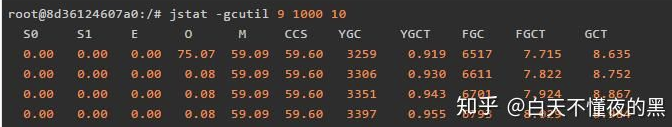
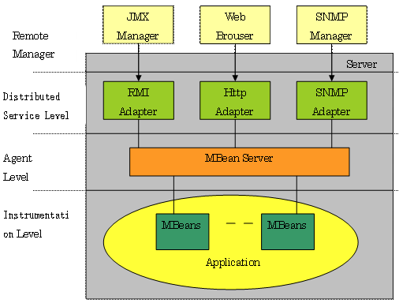
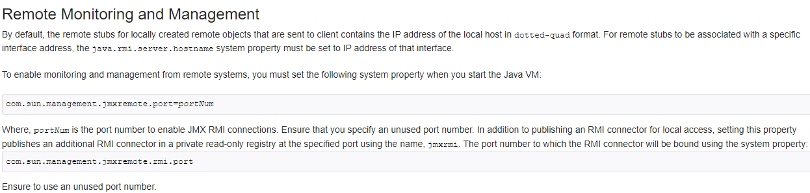
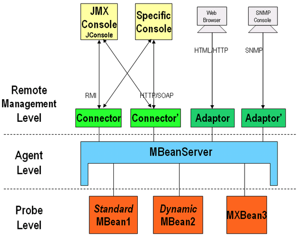

# 1. 如何进行 JVM 调优？从哪些方面入手？

JVM 调优围绕**堆内存分配、GC 策略选择、对象生命周期管理及 GC 日志分析**，核心是**减少 GC 次数、降低 GC 停顿时间、提高系统吞吐量**。

面试中先从一个具体问题切入，从猜测到运用工具观察，到定位根因，最终给出方案。需要两方面能力：

- **观察运行参数**：使用 jps、jstack、jmap、jstat、JMC 等工具了解 Java 进程的线程状态、CPU/内存占用、GC 状况、是否有内存泄漏
- **给出优化方案**：理解 JVM 工作原理（多线程、内存管理、GC 算法），根据运行参数验证猜想并针对性解决

**调优步骤：**
- 查看 JVM 运行状态：jstat gcutil、jmap、jstack、GC log
- 判断问题类型：频繁 YGC/FGC、FGC 时间过长、内存泄漏、CPU 高
- 分析 GC 日志：关注 GC 频率、耗时、晋升到老年代的对象、S0/S1 使用情况
- 调整 JVM 参数：堆大小、比例、GC 算法

**何时需要调优：**
- 老年代持续上涨达到设置的最大内存值
- Full GC 次数频繁
- GC 停顿时间过长（超过 1 秒）
- 出现 OutOfMemory 等异常
- 应用使用本地缓存且占用大量内存
- 系统吞吐量与响应性能下降

**基本原则：**
- 大多数 Java 应用不需要 JVM 优化
- **优先架构调优和代码调优**，JVM 优化是最后手段
- 大多 GC 问题源于**代码层面**而非 JVM 参数
- 上线前应先将 JVM 参数设到最优

**量化目标参考：**
- Heap 内存使用率 ≤ 70%
- Old 代内存使用率 ≤ 70%
- avg pause ≤ 1 秒
- Full GC 次数为 0 或平均间隔 ≥ 24 小时

# 2. 业务场景是大量短生命周期的对象，GC 参数如何调优？

核心原则：**把空间尽量给新生代，让对象在新生代就被回收，不要进老年代。**

- **新生代要足够大**（占整个堆的 1/3 ~ 1/2）：Eden 越大，YGC 频率降低，减少对象过早晋升。但过大会导致 YGC 时间变长、老年代变小易触发 FGC
- **Survivor 区不能太小**：-XX:SurvivorRatio=8 够用，高并发可调为 6。太小会导致存活对象直接进入老年代引发 Full GC
- **晋升阈值可适当调高**：-XX:MaxTenuringThreshold=15（默认），让对象多在 Survivor 里熬几次
- **老年代不用特别大**：几乎没有对象晋升，保持平稳预留即可

核心权衡：**宁可多 YGC，但要控制单次 GC 停顿时间**。

# 3. 频繁 Full GC 的原因有哪些？

- 老年代太小，无法容纳晋升的对象
- 大对象直接进入老年代，超过 -XX:PretenureSizeThreshold
- Survivor 区过小，存活对象放不下直接晋升
- **内存泄漏**，对象无法被回收，老年代持续增长

# 4. JVM 常用的命令行工具有哪些？

- **jps**：查看当前 Java 进程，`jps -l`
- **jinfo**：查看 JVM 配置信息，`jinfo -flags [pid]`
- **jstat**：查看 GC 统计信息，`jstat -gcutil [pid] [interval] [count]`
- **jmap**：查看堆内存信息、dump 堆内存
- **jstack**：dump 线程堆栈信息
- **top -Hp [pid]**：查看进程下各线程 CPU 使用情况
- **ps -mp [pid] -o THREAD,tid,time**：查看进程的线程运行时间

# 5. jstat -gcutil 输出的关键参数含义是什么？

| 参数 | 含义 |
| --- | --- |
| S0/S1 | Survivor 0/1 区使用百分比 |
| E | Eden 区使用百分比 |
| O | Old 区使用百分比 |
| M | Metaspace 使用百分比 |
| YGC/YGCT | Young GC 次数/耗时 |
| FGC/FGCT | Full GC 次数/耗时 |
| GCT | GC 总耗时 |

# 6. jmap 的使用场景和注意事项？

- **jmap -heap [pid]**：查看各代内存分配及使用情况
- **jmap -histo:live [pid] \| more**：找到最耗内存的对象类型（会触发 Full GC）
- **jmap -dump:live,format=b,file=/path/dump.hprof [pid]**：dump 堆内存用于分析

注意：带 `:live` 的参数会先触发 Full GC 再输出；如果不希望触发 Full GC，使用 `jmap -histo [pid]`。

# 7. jstack 如何排查线程问题？

`jstack [pid]` 输出所有线程的堆栈信息。

排查高 CPU 线程步骤：
1. 使用 `top -Hp [pid]` 找到 CPU 占用高的线程 TID
2. 将 TID 转为 16 进制：`printf "%x\n" [tid]`
3. 在 jstack 输出中搜索该 16 进制值定位问题线程

线程状态：**RUNNABLE**（执行中）、**BLOCKED**（被阻塞）、**WAITING**（等待中）

# 8. 什么是 JMX？其架构是怎样的？

JMX（Java Management Extensions）是 JSE 标准的一部分，用于管理应用程序、设备和服务的资源，例如监控 JVM 线程数、堆内存等。

架构分为三层：

- **监控层（探针层）**：通过 MBean 监控 JVM 的堆内存、线程数、CPU、GC 等性能指标
- **JMX 代理层**：MBean Server 是核心，所有 MBean 注册在其中，内嵌在 Java 应用程序的 JVM 中
- **远程管理层**：通过 RMI 等协议连接 MBean Server，JMX 支持 SNMP、HTML 适配器等多种协议访问

# 9. 什么是 MBean？有哪几种类型？

MBean 是一个被管理的 Java 对象，类似 JavaBeans，遵循 JMX 规范的设计模式，可以代表一个设备、应用程序或任何需要被管理的资源。

JMX 规范定义了 5 种 MBean：**Standard MBeans**、**Dynamic MBeans**、**Open MBeans**、**Model MBeans**、**MXBeans**。

JVM 启动时默认开启 JMX。需要远程连接时设置系统属性 `com.sun.management.jmxremote.port=portNum`。

# 10. 什么是内存泄漏？如何排查？

内存泄漏是指不再使用的对象无法被 GC 回收，导致堆内存持续增长，最终引发 **OutOfMemoryError**。

排查步骤：
- 使用 `jstat -gcutil` 观察老年代是否持续上涨且无法回落
- 使用 `jmap -histo:live [pid]` 查看哪些对象类型占用大量内存
- dump 堆内存（`jmap -dump:live,format=b,file=dump.hprof [pid]`），使用 MAT 或 VisualVM 分析
- 检查常见泄漏模式：集合类无限增长、未关闭的连接、错误的单例引用等

# 11. 什么是线程泄漏？如何排查？

线程泄漏是指创建了大量线程但没有正确销毁，导致系统线程资源耗尽。当操作系统无法再创建本地线程时，抛出 **java.lang.OutOfMemoryError: unable to create new native thread**。

典型场景：循环中创建线程或线程池，创建过程失败后仍在重试，但已创建的线程未被释放。

排查方法：
- 使用 `top -Hp [pid]` 查看线程数量
- 使用 `jstack [pid]` 分析线程堆栈，确认是否有大量相同状态的线程
- 检查代码中线程池的创建和使用是否规范

# 12. Java 进程突然瘫痪的可能原因及排查思路？

可能原因：
- **OOM**：堆内存泄漏或线程泄漏导致无法创建新线程
- **频繁 Full GC 导致 STW 过长**：应用长时间无响应，被监控系统判定为宕机
- **CPU 被打满**：死循环、锁竞争激烈

排查思路：
- 检查 GC 日志，确认是否发生 Full GC 及停顿时间
- 查看 dump 文件分析内存泄漏
- 使用 `jstack` 分析线程状态，确认是否有死锁或大量 BLOCKED 线程
