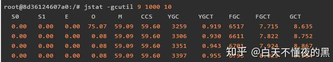
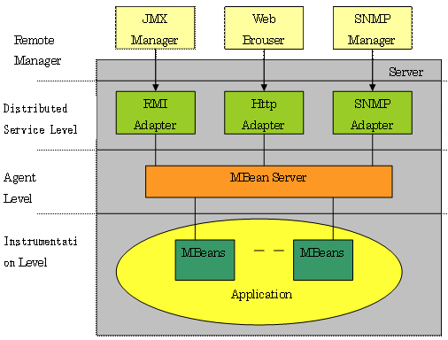
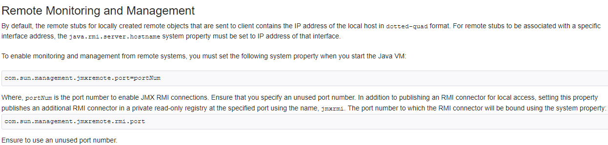
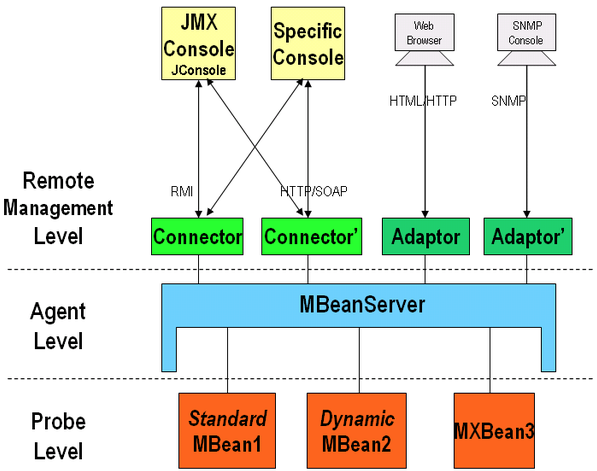

## 1. 如何进行 JVM 调优？从哪些方面入手？

JVM 调优围绕**堆内存分配、GC 策略选择、对象生命周期管理及 GC 日志分析**，核心是**减少 GC 次数、降低 GC 停顿时间、提高系统吞吐量**。

面试中先从一个具体问题切入，从猜测到运用工具观察，到定位根因，最终给出方案。需要两方面能力：

- **观察运行参数**：使用 jps、jstack、jmap、jstat、JMC、VisualVM、Arthas 等工具了解 Java 进程的线程状态、CPU/内存占用、GC 状况、是否有内存泄漏
- **给出优化方案**：理解 JVM 工作原理（多线程、内存管理、GC 算法），根据运行参数验证猜想并针对性解决

**调优步骤：**
1. 查看 JVM 运行状态：`jstat -gcutil` 查看 GC 统计、`jmap -heap` 查看堆分布、`jstack` 查看线程状态、GC log 分析停顿
2. 判断问题类型：频繁 YGC/FGC、FGC 时间过长、内存泄漏、CPU 高、线程死锁
3. 分析 GC 日志：关注 GC 频率、耗时、晋升到老年代的对象大小、S0/S1 使用情况、各代空间变化趋势
4. 确定目标：降低延迟（减少 STW 时间）或提高吞吐量（减少 GC 总时间），两者通常不可兼得
5. 调整 JVM 参数：堆大小、各代比例、GC 算法选择（G1/ZGC 等）、并行线程数、晋升阈值
6. 验证效果：调整后通过压测或线上观察确认是否达到预期，避免过度调优

**何时需要调优：**
- 老年代持续上涨达到设置的最大内存值
- Full GC 次数频繁
- GC 停顿时间过长（超过 1 秒）
- 出现 OutOfMemory 等异常
- 应用使用本地缓存且占用大量内存
- 系统吞吐量与响应性能下降
- CPU 使用率异常偏高

**基本原则：**
- 大多数 Java 应用不需要 JVM 优化
- **优先架构调优和代码调优**，JVM 优化是最后手段
- 大多 GC 问题源于**代码层面**而非 JVM 参数
- 上线前应先将 JVM 参数设到最优
- 一次只改一个参数，观察效果后再调整下一个
- 不同应用场景（响应速度优先 vs 吞吐量优先）采用不同 GC 策略

**量化目标参考：**
- Heap 内存使用率 ≤ 70%
- Old 代内存使用率 ≤ 70%
- avg pause ≤ 1 秒
- Full GC 次数为 0 或平均间隔 ≥ 24 小时
- 响应时间不出现剧烈抖动

## 2. 业务场景是大量短生命周期的对象，GC 参数如何调优？

核心原则：**把空间尽量给新生代，让对象在新生代就被回收，不要进老年代。**

- **新生代要足够大**（占整个堆的 1/3 ~ 1/2）：Eden 越大，YGC 频率降低，减少对象过早晋升。但过大会导致 YGC 时间变长、老年代变小易触发 FGC
- **Survivor 区不能太小**：`-XX:SurvivorRatio=8` 够用，高并发可调为 6。太小会导致存活对象直接进入老年代引发 Full GC
- **晋升阈值可适当调高**：`-XX:MaxTenuringThreshold=15`（默认），让对象多在 Survivor 里熬几次，尽量在新生代回收
- **老年代不用特别大**：几乎没有对象晋升，保持平稳预留即可
- **选用并行 GC（Parallel Scavenge）**：吞吐量优先，适合大量短生命周期对象的批处理或计算密集型场景
- **使用 G1GC**：如果期望控制停顿时间，G1 通过 `-XX:MaxGCPauseMillis=200` 设定目标停顿时间

核心权衡：**宁可多 YGC，但要控制单次 GC 停顿时间**。

## 3. 频繁 Full GC 的原因有哪些？

- 老年代太小，无法容纳晋升的对象
- 大对象直接进入老年代，超过 `-XX:PretenureSizeThreshold` 阈值
- Survivor 区过小，存活对象放不下直接晋升
- **内存泄漏**，对象无法被回收，老年代持续增长
- **元空间（Metaspace）不足**触发 Full GC 来回收类卸载
- **System.gc() 被显式调用**（包括 NIO 的 DirectByteBuffer 回收、RMI 等框架的定时调用），可通过 `-XX:+DisableExplicitGC` 禁用
- **GC 算法选择不当**，如 CMS 的 Concurrent Mode Failure 导致退化为 Serial Old Full GC
- **JVM 参数配置不合理**，如新生代过小导致对象过早晋升
- **担保失败（Promotion Failed）**：Minor GC 后存活对象超过 Survivor 区大小，直接进入老年代但老年代空间也不足

## 4. JVM 常用的命令行工具有哪些？

- **jps**：查看当前 Java 进程，`jps -l` 输出完整包名，`jps -v` 显示 JVM 参数
- **jinfo**：查看 JVM 配置信息，`jinfo -flags [pid]` 查看当前标志，`jinfo -flag [+/-]name [pid]` 动态修改参数（仅限 manageability 标志）
- **jstat**：查看 GC 统计信息，`jstat -gcutil [pid] [interval] [count]`，还可使用 `-gc`（显示各区域具体容量）、`-gccause`（额外显示 GC 原因）
- **jmap**：查看堆内存信息、dump 堆内存。`jmap -heap [pid]` 查看堆配置和使用情况，`jmap -histo:live [pid]` 查看对象统计
- **jstack**：dump 线程堆栈信息，`jstack -l [pid]` 显示锁信息，`jstack -m [pid]` 显示混合栈（C++ 帧）
- **jcmd**：JDK 7+ 的多功能工具，`jcmd [pid] help` 查看支持的命令，`jcmd [pid] GC.heap_dump /path/dump.hprof` 代替 jmap dump
- **jvisualvm**：图形化监控工具，可监控本地/远程 JVM、分析 dump 文件、监控 GC 和 CPU
- **jconsole**：JMX 图形化监控工具，可监控线程、内存、类加载、MBean
- **Arthas**：阿里巴巴开源诊断工具，可在线查看方法调用链路、方法执行耗时、反编译、热替换等
- **top -Hp [pid]**：查看进程下各线程 CPU 使用情况
- **ps -mp [pid] -o THREAD,tid,time**：查看进程的线程运行时间
- **perf**：Linux 性能分析工具，结合 `perf top -p [pid]` 可查看 JVM 热点函数

## 5. jstat -gcutil 输出的关键参数含义是什么？

| 参数 | 含义 |
| --- | --- |
| S0/S1 | Survivor 0/1 区使用百分比 |
| E | Eden 区使用百分比 |
| O | Old 区使用百分比 |
| M | Metaspace 使用百分比 |
| CCS | 压缩类空间使用百分比 |
| YGC/YGCT | Young GC 次数/耗时 |
| FGC/FGCT | Full GC 次数/耗时 |
| GCT | GC 总耗时 |

关键分析点：
- **YGC 频繁**但 YGCT 不大：Eden 区太小，可适当增大
- **FGC 频繁**且 FGCT 很大：老年代空间不足或内存泄漏
- **M 持续增长**：类加载过多，可能存在类加载器泄漏
- **S0/S1 差异大**：Survivor 区大小可能不合适



## 6. jmap 的使用场景和注意事项？

- **jmap -heap [pid]**：查看各代内存分配及使用情况，包括各区的容量、已用量、使用率
- **jmap -histo:live [pid] \| more**：找到最耗内存的对象类型（会触发 Full GC），可配合 `sort` 按字节数排序
- **jmap -dump:live,format=b,file=/path/dump.hprof [pid]**：dump 堆内存用于 MAT 或 VisualVM 分析
- **jmap -clstats [pid]**：查看类加载器统计信息，排查类加载器泄漏

**注意事项：**
- 带 `:live` 的参数会先触发 Full GC 再输出，生产环境使用需谨慎，可能造成 STW
- 如果不希望触发 Full GC，使用 `jmap -histo [pid]`（不带 live）
- dump 文件可能很大，确保磁盘空间充足
- 生产环境推荐使用 `jcmd` 替代 jmap：`jcmd [pid] GC.heap_dump /path/dump.hprof`，更安全
- JDK 8 之后 jmap 被标记为废弃，但仍可使用

## 7. jstack 如何排查线程问题？

`jstack [pid]` 输出所有线程的堆栈信息，`jstack -l [pid]` 额外显示锁的持有信息。

**排查高 CPU 线程步骤：**
1. 使用 `top -Hp [pid]` 找到 CPU 占用高的线程 TID
2. 将 TID 转为 16 进制：`printf "%x\n" [tid]`
3. 在 jstack 输出中搜索该 16 进制值定位问题线程

**线程状态分析：**
- **RUNNABLE**：正在执行中。如果大量线程 RUNNABLE 但 CPU 不高，可能是 IO 等待
- **BLOCKED**：被阻塞等待锁释放。大量 BLOCKED 说明锁竞争激烈
- **WAITING**：等待被唤醒（如 `Object.wait()`、`park()`）。大量 WAITING 通常合理，但某个线程 WAITING 太久可能异常
- **TIMED_WAITING**：限时等待（`Thread.sleep()`、`wait(timeout)`）
- **死锁检测**：jstack 输出末尾会自动检测并显示死锁信息，或使用 `jstack -l` 手动分析锁链

**其他常用场景：**
- 线程数量过多：`jstack [pid] \| grep "java.lang.Thread.State" \| wc -l` 统计线程数
- 查看线程名：jstack 输出中 `nid=0x...` 后的线程名可辅助定位业务线程

## 8. 什么是 JMX？其架构是怎样的？

JMX（Java Management Extensions）是 JSE 标准的一部分，用于管理应用程序、设备和服务的资源，例如监控 JVM 线程数、堆内存、CPU、GC 等性能指标。

**架构分为三层：**

1. **监控层（Instrumentation Layer / 探针层）**：通过 **MBean**（Managed Bean）暴露被管理资源，例如监控 JVM 的堆内存、线程数、CPU、GC 等性能指标。MBean 是 JMX 的核心组件，封装了可管理的属性和操作
2. **JMX 代理层（Agent Layer）**：**MBean Server** 是核心注册中心，所有 MBean 注册在其中，内嵌在 Java 应用程序的 JVM 中。Agent Layer 还提供协议适配器（如 RMI Connector）供远程访问
3. **远程管理层（Remote Management Layer）**：通过 **RMI**、**JMXMP** 等协议连接 MBean Server，JMX 支持 SNMP、HTML 适配器等多种协议访问。可通过 **JConsole**、**VisualVM** 等客户端远程连接

**启用 JMX 远程监控：**
```
-Dcom.sun.management.jmxremote
-Dcom.sun.management.jmxremote.port=9999
-Dcom.sun.management.jmxremote.authenticate=false
-Dcom.sun.management.jmxremote.ssl=false
-Djava.rmi.server.hostname=服务器IP
```

生产环境应开启认证和 SSL：`-Dcom.sun.management.jmxremote.authenticate=true`，配合 `jmxremote.access` 和 `jmxremote.password` 文件



## 9. 什么是 MBean？有哪几种类型？

MBean 是一个被管理的 Java 对象，类似 JavaBeans，遵循 JMX 规范的设计模式，可以代表一个设备、应用程序或任何需要被管理的资源。MBean 通过暴露属性和操作，让管理程序可以监控和配置被管理资源。

JMX 规范定义了 5 种 MBean：

- **Standard MBean**：通过接口定义管理属性和操作，接口命名必须为 `XxxMBean`，实现类为 `Xxx`。最简单、最常用
- **Dynamic MBean**：运行时动态决定暴露的属性和操作，实现 `javax.management.DynamicMBean` 接口。适合预先不知道管理接口的场景
- **Open MBean**：Dynamic MBean 的扩展，使用自描述的数据类型（`OpenType`）来定义属性和操作，支持跨平台互操作
- **Model MBean**：最灵活的 MBean，完全可配置，通过 `ModelMBeanInfo` 描述管理接口，可动态注册任意资源
- **MXBean**：一种特殊类型的 Standard MBean，使用 `javax.management.MXBean` 注解或接口名后缀 `MXBean`，支持复杂类型映射，JVM 内置大量 MXBean（如 `MemoryMXBean`、`ThreadMXBean`、`GarbageCollectorMXBean`）

**常用 MXBean 示例：**
- `java.lang.management.MemoryMXBean`：堆内存和非堆内存使用情况
- `java.lang.management.ThreadMXBean`：线程信息、死锁检测
- `java.lang.management.GarbageCollectorMXBean`：GC 次数和耗时
- `java.lang.management.RuntimeMXBean`：JVM 启动时间、参数等





## 10. 什么是内存泄漏？如何排查？

内存泄漏是指不再使用的对象无法被 GC 回收，导致堆内存持续增长，最终引发 **OutOfMemoryError: Java heap space**。

**常见泄漏模式：**
- **集合类无限增长**：Map/List 中不断添加对象但未清理，如缓存未设上限
- **未关闭的连接**：数据库连接、IO 流、Socket 未正确关闭，导致资源无法回收
- **错误的单例引用**：单例对象持有大量集合或大对象的引用，导致无法释放
- **内部类/匿名类持有外部类引用**：非静态内部类实例隐式持有外部类引用，导致外部类无法回收
- **ThreadLocal 未清理**：线程池中的 ThreadLocal 在线程复用时不 remove 会导致对象泄漏
- **类加载器泄漏**：重复部署（如 Tomcat 热部署）时，类加载器未被回收
- **静态集合类持有对象引用**：如 `static List<Object>` 不断 add 元素

**排查步骤：**
1. 使用 `jstat -gcutil [pid] 1000` 观察老年代使用率是否**持续上涨且无法回落**
2. 使用 `jmap -histo:live [pid] \| head -20` 查看哪些对象类型占用大量内存，关注实例数和总字节
3. dump 堆内存：`jmap -dump:live,format=b,file=dump.hprof [pid]`，使用 MAT 或 VisualVM 分析
4. **MAT 分析要点**：
   - 查看 **Leak Suspects Report**（泄漏疑点报告），MAT 自动分析可能的泄漏根
   - 查看 **Dominator Tree**（支配树），按 retained heap 排序，找出最大的对象
   - 对可疑对象查看 **GC Root Path**，确认引用链
5. **代码审查**：定位到问题对象后，回溯代码中创建和持有该对象的位置，修正泄漏

## 11. 什么是线程泄漏？如何排查？

线程泄漏是指创建了大量线程但没有正确销毁，导致系统线程资源耗尽。当操作系统无法再创建本地线程时，抛出 **java.lang.OutOfMemoryError: unable to create new native thread**。

**典型场景：**
- 循环中创建线程或线程池，创建过程失败后仍在重试，但已创建的线程未被释放
- 线程池未设置最大线程数或拒绝策略不合理
- 每个请求新建线程而非使用线程池
- **调用了 `Thread.start()` 但未在 finally 中确保终止**
- 使用 `new Thread()` 创建线程但未调用 `thread.join()` 或 `thread.interrupt()` 清理

**排查方法：**
1. 使用 `top -Hp [pid]` 查看线程数量，或者 `ps -eLf \| grep java \| wc -l`
2. 使用 `jstack [pid] \| grep "java.lang.Thread.State" \| wc -l` 统计线程数
3. 使用 `jstack [pid]` 分析线程堆栈，确认是否有**大量相同状态或相同业务代码**的线程
4. 检查 **线程池配置**：
   - 核心线程数（corePoolSize）、最大线程数（maxPoolSize）是否合理
   - 队列类型和容量是否合适
   - 拒绝策略是否设置
5. 检查代码中 **ThreadLocal 是否在 finally 块中 clean**，防止线程复用导致的内存泄漏间接引发线程泄漏
6. 查看 **操作系统限制**：`ulimit -u` 查看用户最大进程数，`/proc/sys/kernel/threads-max` 查看系统限制

## 12. Java 进程突然瘫痪的可能原因及排查思路？

**可能原因：**

- **OOM 导致进程退出**：
  - 堆内存泄漏：`java.lang.OutOfMemoryError: Java heap space`
  - 线程泄漏：`java.lang.OutOfMemoryError: unable to create new native thread`
  - Metaspace 泄漏：`java.lang.OutOfMemoryError: Metaspace`
  - 直接内存溢出：`java.lang.OutOfMemoryError: Direct buffer memory`
- **频繁 Full GC 导致 STW 过长**：应用长时间无响应，被监控系统判定为宕机，甚至触发 **GC Overhead Limit Exceeded**
- **CPU 被打满**：死循环、锁竞争激烈、频繁的 GC 导致 CPU 耗尽
- **操作系统级别问题**：OOM Killer 杀掉了 Java 进程（查看 `/var/log/messages` 或 `dmesg`）
- **栈溢出**：`java.lang.StackOverflowError`，递归调用过深
- **JDK 版本 Bug**：特定 JDK 版本下的 JVM Bug，如 G1 的 `humongous allocation` 问题

**排查思路：**

1. **检查 GC 日志**：确认是否发生 Full GC 及停顿时间，查看 GC 日志中是否有 `Allocation Failure`、`Promotion Failed`、`Concurrent Mode Failure` 等关键字
2. **查看 JVM 启动参数**：检查 `-Xmx`、`-Xms` 等内存配置和 GC 算法选择是否合理
3. **分析 dump 文件**：如果设置了 `-XX:+HeapDumpOnOutOfMemoryError`，JVM 会在 OOM 时自动生成 dump 文件，使用 MAT 分析
4. **使用 `jstack` 分析线程状态**：确认是否有**死锁**、大量 **BLOCKED** 或 **WAITING** 线程
5. **检查操作系统日志**：`dmesg` 或 `/var/log/syslog` 查看是否有 OOM Killer 杀进程的记录
6. **查看监控系统**：检查瘫痪前的 CPU、内存、网络、磁盘 IO 等指标是否有异常波动
7. **启用关键日志**：
   - `-XX:+PrintGCDetails -XX:+PrintGCDateStamps -Xloggc:/path/gc.log`
   - `-XX:+HeapDumpOnOutOfMemoryError -XX:HeapDumpPath=/path/dump.hprof`
   - `-XX:+PrintConcurrentLocks`：打印锁信息

## 13. 如何排查 DirectByteBuffer 堆外内存溢出问题？

DirectByteBuffer 通过 **堆外内存（Direct Memory）** 分配缓冲区，调用 `ByteBuffer.allocateDirect(capacity)` 创建，使用 `sun.misc.Cleaner` 机制回收。堆外内存不受堆大小限制，受 `-XX:MaxDirectMemorySize` 控制（默认等于 `-Xmx`）。

**为什么 DirectByteBuffer 容易泄漏？**
- 堆外内存的释放依赖 **Cleaner** 的幻象引用（PhantomReference）机制，由 GC 触发
- 如果 DirectByteBuffer 对象本身没有被 GC（因为引用链仍然存在），Cleaner 就不会运行，堆外内存就无法释放
- 堆外内存的分配不在堆上，GC 无法直接感知堆外内存的使用压力，可能堆还充足但堆外已耗尽

**排查步骤：**

1. **确认是否堆外内存溢出**：异常信息包含 `OutOfMemoryError: Direct buffer memory`
2. **查看 DirectBuffer 使用量**：
   - 通过 JMX MBean 监控：`java.nio.BufferPool.direct` 的 `MemoryUsed` 属性
   - `jmap -histo:live [pid] \| grep "DirectByteBuffer"` 查看实例数
   - 代码中使用 `MBeanServerConnection` 获取 `BufferPoolMXBean` 监控直接内存
3. **分析堆外内存使用情况**：
   - `jcmd [pid] VM.native_memory`（需开启 `-XX:NativeMemoryTracking=summary`）
   - 使用 `pmap -x [pid]` 查看进程内存映射
   - 使用 **gperftools** 或 **jemalloc** 分析 native 内存分配
4. **检查代码中 DirectByteBuffer 的使用**：
   - 是否有 **未释放的 DirectByteBuffer**：`Buffer` 使用后未调用 `Clearer` 或未及时释放引用
   - 是否使用 **Netty** 等框架：检查 Netty 的 `PooledByteBufAllocator` 配置，`io.netty.maxDirectMemory` 是否合理
   - 检查是否开启了 `-XX:+DisableExplicitGC`，因为 DirectByteBuffer 的 Cleaner 依赖于 GC，`System.gc()` 被禁用后可能延迟回收
5. **使用 NMT 定位**：`-XX:NativeMemoryTracking=detail` 启动，`jcmd [pid] VM.native_memory detail.diff` 观察变化
6. **代码修复方案**：
   - 确保 DirectByteBuffer 使用完后及时置 null，让其可被 GC
   - 使用 `try-finally` 确保释放：`((DirectBuffer) byteBuf).cleaner().clean()`
   - 调整 `-XX:MaxDirectMemorySize` 为合适值
   - 如果使用 Netty，合理配置 `io.netty.maxDirectMemory` 和内存池参数
