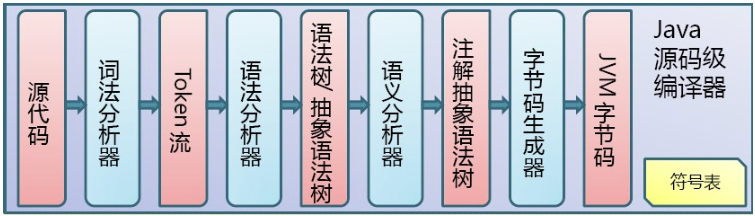
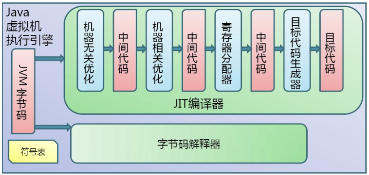
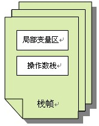
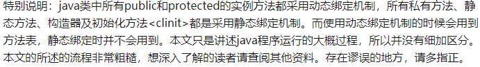
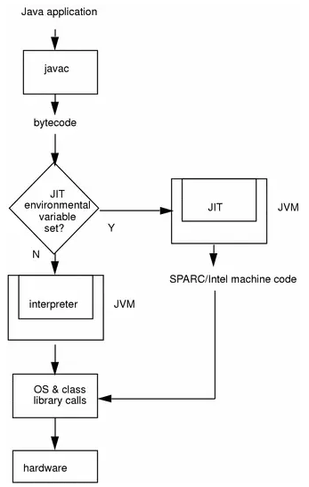
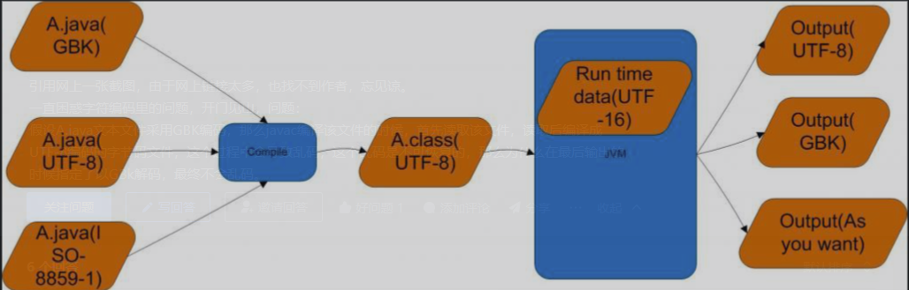

# 1. Java编译和执行的全过程是怎样的？

Java源代码从编写到最终在机器上执行经历了哪些阶段？

**原理分析**

Java编译和执行的过程包含三个重要机制：**Java源码编译机制、类加载机制、类执行机制**。

- **源码编译：** Java源文件（`.java`）通过javac编译器编译为字节码文件（`.class`），字节码文件包含JVM可识别的指令集
- **类加载：** 字节码文件通过类装载器装载到JVM的运行时数据区
- **类执行：** 执行引擎以指令为单位读取Java字节码，将其转换为操作系统目标代码执行



# 2. Java字节码在JVM中如何执行？

字节码不能直接在操作系统上运行，JVM执行引擎如何将其转换为机器码？

**原理分析**

JVM是基于栈的体系结构来执行Class字节码的。线程创建后，会产生**程序计数器（PC）和栈（Stack）**：

- **程序计数器：** 存放下一条要执行的指令在方法内的偏移量
- **栈帧：** 每个栈帧对应每个方法的每次调用。栈帧由**局部变量区和操作数栈**两部分组成：
  - 局部变量区：存放方法中的局部变量和参数
  - 操作数栈：存放方法执行过程中产生的中间结果

执行引擎像CPU一样，一条一条地执行机器指令。每个字节码指令由一个1字节的操作码和附加的操作数组成。





# 3. 什么是JIT即时编译器？为什么需要JIT？

字节码解释器一条一条读取、解释并执行字节码指令，执行速度比直接用可执行的二进制机器码慢很多。为了提高效率，引入了JIT技术。

**原理分析**

JIT（Just In Time）即即时编译器。当JVM发现某个方法或代码块运行特别频繁时，会将其认定为**"热点代码"（Hot Spot Code）**，然后JIT会把部分"热点代码"**翻译成本地机器相关的机器码并进行优化**，再将翻译后的机器码**缓存起来**以备下次使用。

HotSpot虚拟机中内置了两个JIT编译器：**Client Compiler（C1）**和**Server Compiler（C2）**，分别用于客户端和服务端。目前主流的HotSpot虚拟机默认采用**解释器与其中一个编译器直接配合**的方式工作（混合模式）。

# 4. 什么是热点代码？热点探测有哪几种方式？

**原理分析**

触发JIT首先需要识别出热点代码。目前主要有两种热点探测方式：

- **基于采样的方式探测（Sample Based Hot Spot Detection）：** 周期性检测各个线程的栈顶，发现某个方法经常出现在栈顶，就认为是热点方法。好处是简单，缺点是无法精确确认一个方法的热度，容易受线程阻塞或别的原因干扰
- **基于计数器的热点探测（Counter Based Hot Spot Detection）：** 为每个方法甚至代码块建立计数器，统计执行次数，超过阈值即认为是热点方法，触发JIT编译

HotSpot虚拟机使用**基于计数器的热点探测方法**。

# 5. 方法计数器和回边计数器是什么？

**原理分析**

HotSpot为每个方法准备了两个计数器：

- **方法调用计数器：** 记录一个方法被调用的次数
- **回边计数器：** 记录方法中的for或while循环的运行次数

# 6. HotSpot为何采用解释器与编译器并存的架构？

**原理分析**

解释器和JIT即时编译器是JVM的两个组件，同时存在的理由：

- **启动速度：** 如果代码只被执行一次，编译就是浪费精力，解释执行比编译+执行更快
- **优化时机：** JVM执行某一方法或遍历循环的次数越多，就越了解代码结构，JIT编译时能做出更优的优化
- **灵活性：** HotSpot提供了三种运行模式通过参数设定：

| 模式 | 说明 |
|------|------|
| 解释模式 | 纯解释器执行 |
| 编译模式 | 优先采用编译方式，但解释器在编译无法进行时介入 |
| 混合模式 | 默认模式，解释器与JIT配合 |

需要注意的是，编译模式并不是完全通过JIT编译，只是优先采用编译方式执行程序。

# 7. JIT编译器有哪几种？C1和C2有什么区别？

**原理分析**

- **Client Compiler（C1编译器）：** 面向客户端，注重启动速度和编译时间
- **Server Compiler（C2编译器）：** 面向服务端，注重长期运行的峰值性能

即时编译器并不是虚拟机必需的部分，Java虚拟机规范没有规定必须包含即时编译器，也没有限定或指导其实现方式。



# 8. JIT编译优化技术有哪些？

以编译方式执行本地代码比解释执行更快，除了解释执行字节码额外消耗时间外，更重要的原因是虚拟机设计团队将代码优化措施集中在即时编译器中。JIT编译器产生的本地代码通常比javac产生的字节码更优秀。

**原理分析**

JIT主要优化技术包括：

- 逃逸分析
- 锁消除
- 锁膨胀（锁粗化）
- 方法内联
- 空值检查消除
- 类型检测消除
- 公共子表达式消除



# 9. 什么是公共子表达式消除？

**原理分析**

如果一个表达式E已经计算过，并且从先前计算到现在E中所有变量的值都没有发生变化，那么E的这次出现就称为**公共子表达式**。不需要再花时间计算，直接使用前面计算过的表达式结果代替E。

示例：
```
int d = (c * b) * 12 + a + (a + b * c)
→ int d = E * 12 + a + (a + E)  // E = c * b
```

# 10. 什么是数组范围检查消除？

**原理分析**

Java语言中访问数组元素时会自动进行上下界范围检查，超出边界抛出异常。每次数组元素的读写都带有一次隐含的条件判定操作，对于大量数组访问的程序是一种性能负担。

JIT在编译期通过**数据流分析可以判定范围**，进而消除上下界检查，节省多次的条件判断操作。

# 11. 什么是方法内联？

**原理分析**

方法内联是把目标方法的代码"复制"到发起调用的方法中，消除一些无用的代码。这是JVM中最重要的优化技术之一，可以消除方法调用的开销。实际JVM中的内联过程很复杂。

# 12. 什么是逃逸分析？基于逃逸分析有哪些优化？

逃逸分析是"一种确定指针动态范围的静态分析"，可以分析在程序的哪些地方可以访问到指针。即时编译器会对新建对象进行逃逸分析，判断对象是否逃逸出线程或方法。

**原理分析**

即时编译器判断对象是否逃逸的依据有两种：

- **对象是否被存入堆中（静态字段或堆中对象的实例字段）：** 一旦存入堆中，其他线程就能获得该对象的引用，即时编译器无法追踪所有使用该对象的代码位置
- **对象是否被传入未知代码中：** 即时编译器将未被内联的代码当成未知代码，无法确认该方法调用会不会将调用者或参数存储至堆中，直接认为调用者以及参数是逃逸的

如果能证明一个对象不会逃逸到方法或线程之外，可以进行以下优化：

- **栈上分配：** 将不会逃逸的局部对象分配到栈上，对象随方法结束自动销毁，减少GC压力
- **同步消除（锁消除）：** 如果变量不会发生线程逃逸，无法被其他线程访问，读写不存在竞争，可以消除同步措施
- **标量替换：** 标量是无法再分解的数据类型（原始类型、reference类型），聚合量是可继续分解的（Java对象）。如果对象不会被外部访问且可拆散，可能不创建对象，而是直接创建被使用的成员变量代替，让成员变量在栈上分配和读写

# 13. Java中字符编码经历了哪几个阶段？

**原理分析**

- **Java源文件（.java）：** 可以是任意字符编码。javac假定源文件编码为平台默认编码（简体中文Windows上为GBK，日文Windows上为Shift-JIS），也可通过参数指定
- **Class文件：** 字符串常量和符号名使用**UTF-8编码**存储
- **运行时：** Java在运行时char采用**UTF-16编码**。Java语言规范规定char是UTF-16的code unit，16位（2字节），String是UTF-16 code unit的序列



# 14. Java的内码和外码分别是什么？

**原理分析**

- **内码：** 程序内部使用的字符编码，Java规定char和String在内存里使用**UTF-16编码**。或者说至少让用户无法感知到String内部采用了非UTF-16编码
- **外码：** 程序与外部交互时使用的字符编码，如序列化、外部文件、命令行参数等。`String.getBytes()`用于将String的内码转换为指定的外码

**设计权衡：** 运行时采用UTF-16（定长code unit，随机访问O(1)），外部存储采用UTF-8（变长，空间效率更高）。

**关于UTF-16的补充：** Java设计之初UTF-16还是真的定长编码，后来Unicode字符增多后UTF-16变成了变长编码（一个code point对应1到2个code unit）。Java规定char仍然是16位，不完整字符通过String中的**surrogate pair**（代理对）表示。Java标准库提供了用于访问code point的API。

# 15. JDK6中的压缩字符串是什么？

**原理分析**

JDK6提供了`-XX:+UseCompressedString`参数。启用后，String内部可能用`byte[]`存储：

- 当字符串所有字符都在ASCII编码范围内时，使用`byte[]`（ASCII序列）存储，处于"压缩"状态
- 只要有任何一个字符超出ASCII范围，退回到`char[]`（UTF-16序列）存储
- 用户访问时对ASCII字符做无符号扩展得到UTF-16 code unit，用户无法感知内码变化

该功能在JDK6中因实现复杂且效果不理想，未包含在OpenJDK6中。**JDK9重新实现了该优化**，默认启用**紧凑字符串（Compact Strings）**，String内部使用`byte[]`存储，并增加一个编码标志位coder来区分LATIN1（ISO-8859-1）或UTF16。
