## 1. Servlet 的工作原理是什么？请从 Servlet 容器启动到请求处理完整说明

Servlet 与 Servlet 容器的关系有点像枪和子弹的关系，枪是为子弹而生，而子弹又让枪有了杀伤力。通过标准化接口来相互协作，实现解耦。

**Tomcat 的容器分为四个等级**，真正管理 Servlet 的容器是 Context 容器，一个 Context 对应一个 Web 工程。

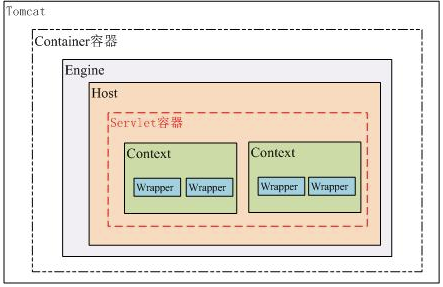

Context 配置参数示例：
```
<Context path="/projectOne" docBase="D:\projects\projectOne" reloadable="true" />
```

**Servlet 容器的启动过程**：

Tomcat7 开始支持嵌入式功能，通过 Tomcat 类启动：
```java
Tomcat tomcat = getTomcatInstance();
File appDir = new File(getBuildDirectory(), "webapps/examples");
tomcat.addWebapp(null, "/examples", appDir.getAbsolutePath());
tomcat.start();
```

Tomcat 的 addWebapp 方法会创建 StandardContext 容器，设置 url 和 path 参数，并添加 ContextConfig 负责解析 Web 应用配置。

**Tomcat 启动时序图**：

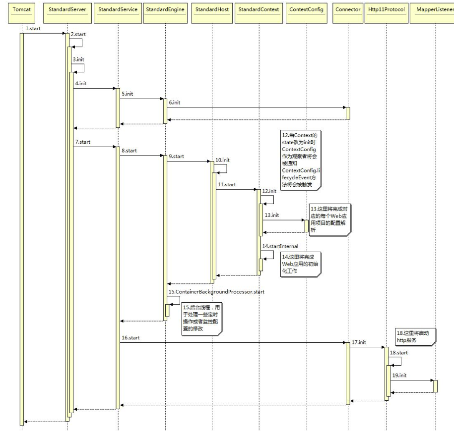

ContextConfig 的 init 方法主要完成：
- 创建用于解析 xml 配置文件的 contextDigester 对象
- 读取默认 context.xml 配置文件，如果存在解析它
- 读取默认 Host 配置文件，如果存在解析它
- 读取默认 Context 自身的配置文件，如果存在解析它
- 设置 Context 的 DocBase

Context 容器的 startInternal 方法包括：
- 创建读取资源文件的对象
- 创建 ClassLoader 对象
- 设置应用的工作目录
- 启动相关的辅助类如：logger、realm、resources 等
- 修改启动状态，通知感兴趣的观察者（Web 应用的配置）
- 子容器的初始化
- 获取 ServletContext 并设置必要的参数
- 初始化"load on startup"的 Servlet

**Web 应用的初始化工作**在 ContextConfig 的 configureStart 方法中实现，主要是解析 web.xml 文件。Tomcat 首先找 globalWebXml，接着找 hostWebXml，最后找应用的 WEB-INF/web.xml。如果支持 Servlet3.0，解析还将完成额外 9 项工作，包括 jar 包中的 META-INF/web-fragment.xml 的解析以及对 annotations 的支持。

接下去将 WebXml 对象中的属性设置到 Context 容器中，包括创建 Servlet 对象、filter、listener 等。

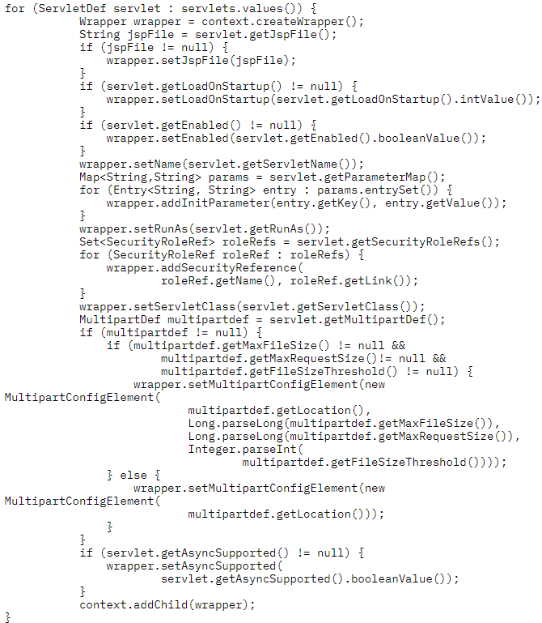

**创建 Servlet 实例**：

如果 Servlet 的 load-on-startup 配置项大于 0，那么在 Context 容器启动的时候就会被实例化。conf/web.xml 中定义的 DefaultServlet 和 JspServlet 的 load-on-startup 分别是 1 和 3，Tomcat 启动时这两个 Servlet 就会被启动。

创建 Servlet 实例从 Wrapper.loadServlet 开始，获取 servletClass 交给 InstanceManager 创建对象。

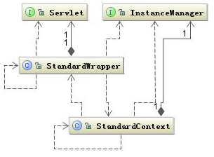

**初始化 Servlet**在 StandardWrapper 的 initServlet 方法中，调用 Servlet 的 init 方法，同时把包装了 StandardWrapper 对象的 StandardWrapperFacade 作为 ServletConfig 传给 Servlet。

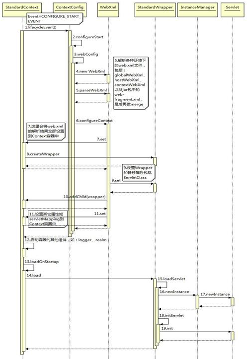

**Servlet 体系结构**：

Servlet 规范基于几个类运转：ServletConfig、ServletRequest 和 ServletResponse。这三个类通过容器传递给 Servlet。ServletConfig 在 Servlet 初始化时传递，后两个在请求到达时传递。

Servlet 的运行模式是"握手型的交互式"——交易场景由 ServletContext 描述，定制参数集合由 ServletConfig 描述，ServletRequest 和 ServletResponse 是交互的具体对象。

传给 Servlet 的 ServletConfig 实际是 StandardWrapperFacade 对象（门面模式），保证只暴露 ServletConfig 规定的数据。

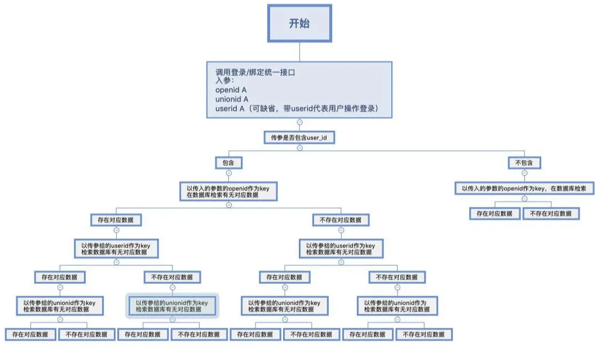

同样的，ServletContext 的实际对象是 ApplicationContextFacade，也使用门面设计模式。

**Request 和 Response 的类结构**：

Tomcat 一接受到请求首先创建 org.apache.coyote.Request 和 org.apache.coyote.Response（轻量级，快速分配）。交给用户线程处理时创建 org.apache.catalina.connector.Request 和 org.apache.catalina.connector.Response，传给 Servlet 的是它们的门面类 RequestFacade 和 ResponseFacade。


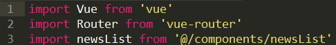

**Servlet 如何工作**：

用户请求 URL 格式：`http://hostname:port/contextpath/servletpath`。hostname 和 port 用于建立 TCP 连接，URL 用于选择容器。

Tomcat7.0 中这件事由 `org.apache.tomcat.util.http.mapper` 完成，它保存了 Tomcat 的 Container 容器中的所有子容器信息。当 Request 进入 Container 容器之前，mapper 根据 hostname 和 contextpath 将 host 和 context 容器设置到 Request 的 mappingData 属性中。

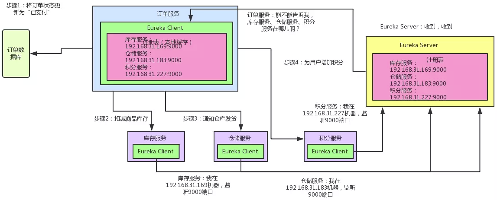

MapperListener 作为监听者加到整个 Container 容器的每个子容器中，任何容器发生变化都会通知 MapperListener，相应的 mapper 属性也会修改。


请求到达最终的 Wrapper 容器后，还要执行 Filter 链和 Listener。

执行 Servlet 的 service 方法。通常 Servlet 继承 HttpServlet 或 GenericServlet 类，覆盖相应方法。**现在的 MVC 框架基本原理是将所有请求映射到一个 Servlet，在 service 方法中实现框架入口**。

Servlet 生命周期结束时调用 destroy 方法。

**Session 与 Cookie**：

Session 与 Cookie 都是为了保持用户与后端服务器的交互状态。三种方式让 Session 正常工作：
- **基于 URL Path Parameter**，默认支持
- **基于 Cookie**，默认支持
- **基于 SSL**，默认不支持，需 connector.getAttribute("SSLEnabled") 为 TRUE

场景一：浏览器不支持 Cookie 时，SessionCookieName 被重写到 URL 参数中，格式如 `/path/Servlet;name=value;name2=value2?Name3=value3`。默认 SessionCookieName 是"JSESSIONID"。

注意：如果客户端支持 Cookie，Tomcat 会解析 Cookie 中的 Session ID，并覆盖 URL 中的 Session ID。

有了 Session ID，服务器端通过 request.getSession() 创建 HttpSession 对象，加到 Manager 的 sessions 容器中。Manager 管理所有 Session 的生命周期，过期回收，服务器关闭时序列化到磁盘。

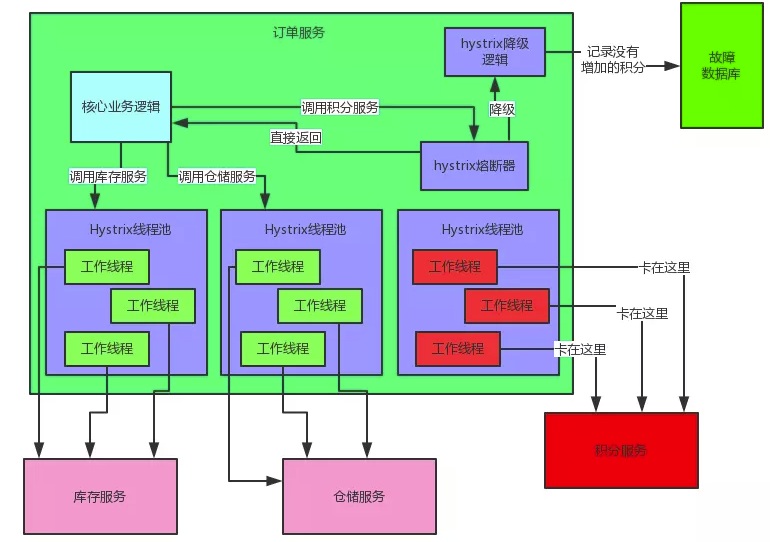

request.getSession() 获取的 HttpSession 对象实际是 StandardSession 的门面对象。

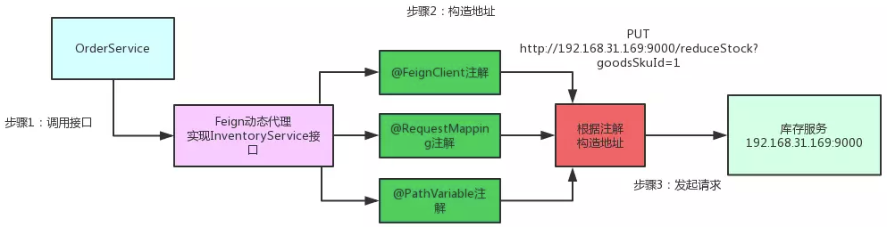

**Servlet 中的 Listener**：

目前 Servlet 提供了 5 种两类事件的观察者接口：
- 4 个 EventListeners 类型：ServletContextAttributeListener、ServletRequestAttributeListener、ServletRequestListener、HttpSessionAttributeListener
- 2 个 LifecycleListeners 类型：ServletContextListener、HttpSessionListener


Listener 覆盖了整个 Servlet 生命周期的各种事件，配置在 web.xml 的 `<listener>` 标签中。ServletContextListener 在容器启动后不能再添加，因为其所监听的事件不会再出现。

Python 的对应物是 WSGI：http 请求到达 WSGI http 服务器（gunicorn/uWSGI），解析并转换为 WSGI 格式，交由 WSGI web 应用（django/flask）处理。

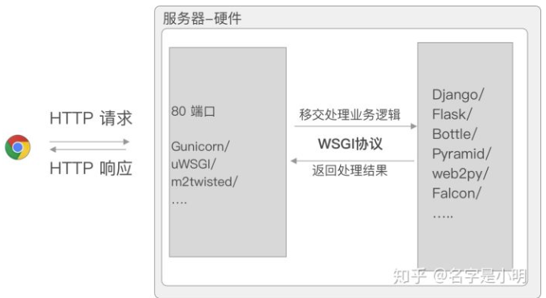

生产环境中的集群架构：

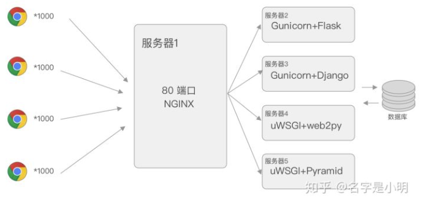

**servlet 接口定义的是一套处理网络请求的规范**，需要 servlet 容器（如 Tomcat）来处理。Tomcat 才是与客户端直接打交道的家伙，他监听了端口，请求过来后根据 URL 等信息确定要将请求交给哪个 servlet 去处理，调用 servlet 的 service 方法，service 方法返回 response 对象，tomcat 再把这个 response 返回给客户端。

严格意义上 Web 服务器只负责处理 HTTP 协议，用于处理静态页面的内容。动态内容需要通过 WSGI（python）和 servlet（java）接口交给应用服务器处理。Web 服务器包括 Nginx、Apache、IIS 等。应用服务器如 Tomcat（也可作为 Web 服务器）、JBoss。Tomcat 是 Web 服务器和 Servlet 容器的结合体。

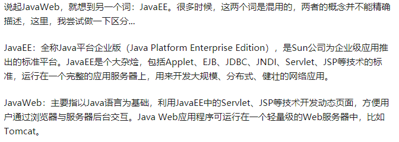

## 2. Tomcat 的整体架构和请求处理流程是怎样的？

Servlet 主要做三件事：
1. 创建并填充 Request 对象，包括：URI、参数、method、请求头信息、请求体信息等
2. 创建 Response 对象
3. 执行业务逻辑，将结果通过 Response 的输出流输出到客户端

**Tomcat 整体架构**：

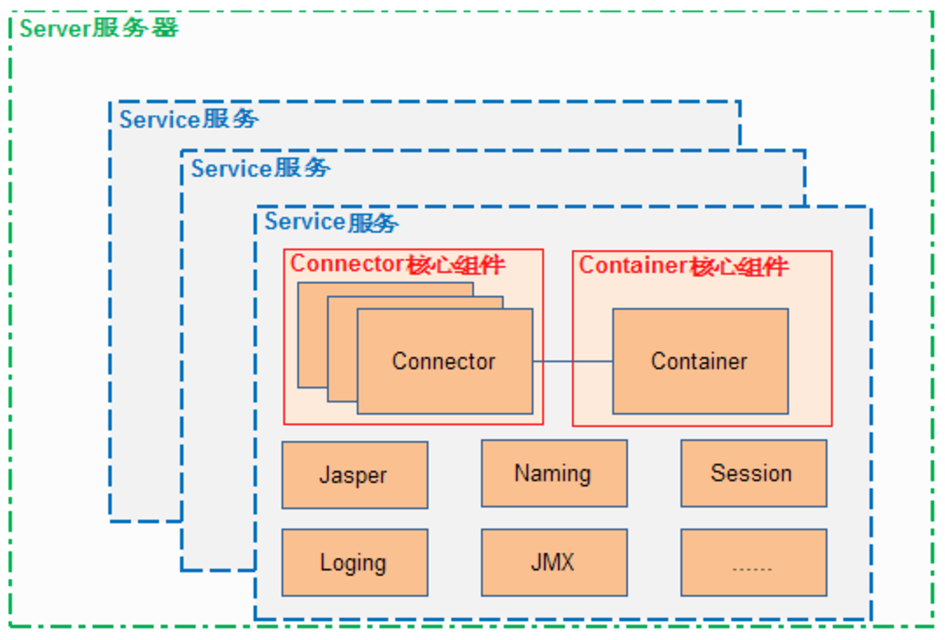

最核心的两个组件：**连接器（Connector）和容器（Container）**
2. **Connector**用于处理连接相关的事情，并提供 Socket 与 Request 和 Response 相关的转化
3. **Container**用于封装和管理 Servlet，以及具体处理 Request 请求

一个 Tomcat 中只有一个 Server，一个 Server 可以包含多个 Service，**一个 Service 只有一个 Container**，但可以有多个 Connectors（同时提供 Http 和 Https 链接，或相同协议不同端口的连接）。

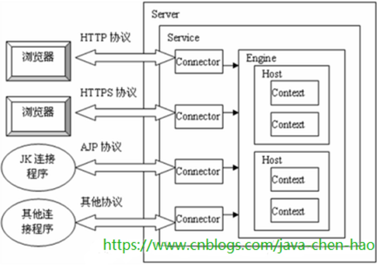

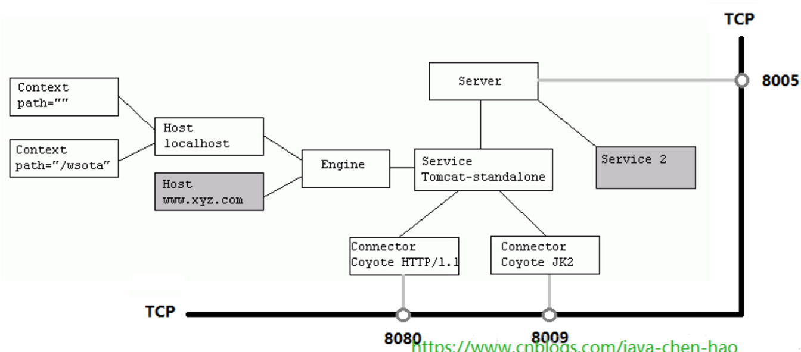

**各个组件的功能**：

1. **Server** 表示服务器 = 一个 JVM 进程，提供优雅的启动和停止方式，管理所有 Service，全局生命周期
2. **Service** 表示服务，Server 可运行多个服务。用于绑定连接器和引擎，解耦网络 IO 与业务容器
3. 每个 Service 可包含多个 Connector 和一个 Container，每种协议最终执行的 Servlet 相同
4. **Connector** 表示连接器，监听端口（8080），接收 TCP 连接，解析 HTTP/HTTPS/AJP 协议，封装 Request/Response 对象，负责网络读写、协议解析、线程模型（BIO/NIO/NIO2/APR）
5. **Container** 表示 Servlet 容器
   - Engine -- 引擎
   - Host -- 主机
   - Context -- 上下文
   - Wrapper -- 包装器
6. **Engine【引擎】**（核心容器）：全局请求入口，**所有请求的总调度**，包含多个虚拟主机 Host，匹配域名，分发请求
7. **Host【虚拟主机】**：对应**域名**（localhost、www.xxx.com），一台 Tomcat 可配置多个域名站点，管理当前域名下所有 Web 应用 Context
8. **Context【Web 应用】**：对应**一个 war / 一个项目**，同一个域名下可以有多个 context，对应 web.xml，独立类加载器、独立会话、隔离应用，项目级生命周期、热部署、全局配置
9. 支撑组件：
   - Manager -- 管理器，用于管理会话 Session
   - Logger -- 日志器，用于管理日志
   - Loader -- 加载器，和类加载有关，只开放给 Context 使用
   - Pipeline -- 管道组件，配合 Valve 实现过滤器功能
   - Valve -- 阀门组件，配合 Pipeline 实现过滤器功能
   - Realm -- 认证授权组件

**Pipeline-Valve 管道组件**：

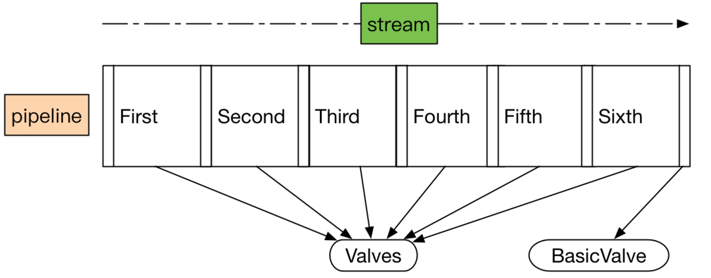

请求发送到 Tomcat 后，首先经过 Service 交给 Connector，Connector 接收请求并封装为 Request 和 Response，再交由 Container 处理，处理完返回给 Connector，最后由 Connector 通过 Socket 将结果返回客户端。

**Connector 结构**：

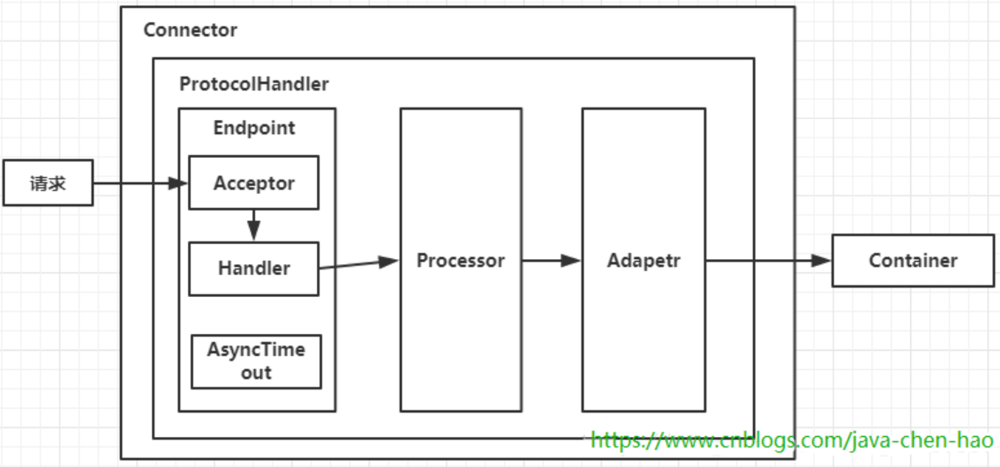

Connector 使用 ProtocolHandler 处理请求。ProtocolHandler 包含三个部件：
1. **Endpoint**：处理底层 Socket 网络连接，实现 TCP/IP 协议
2. **Processor**：将 Endpoint 接收的 Socket 封装成 Request，实现 HTTP 协议
3. **Adapter**：将 Request 交给 Container 进行具体处理，将请求适配到 Servlet 容器

Endpoint 的抽象实现 AbstractEndpoint 定义了 Acceptor（监听请求）、AsyncTimeout（检查异步 Request 超时）和 Handler（处理接收的 Socket，内部调用 Processor 处理）。

**Container 如何处理请求**：

Container 使用 **Pipeline-Valve 管道**处理请求，这是**责任链模式**。特点：
1. 每个 Pipeline 都有特定的 Valve（BaseValve），在管道最后一个执行，不可删除
2. 上层容器的管道的 BaseValve 中会调用下层容器的管道

四个子容器对应的 BaseValve：StandardEngineValve、StandardHostValve、StandardContextValve、StandardWrapperValve。

**Pipeline 处理流程**：

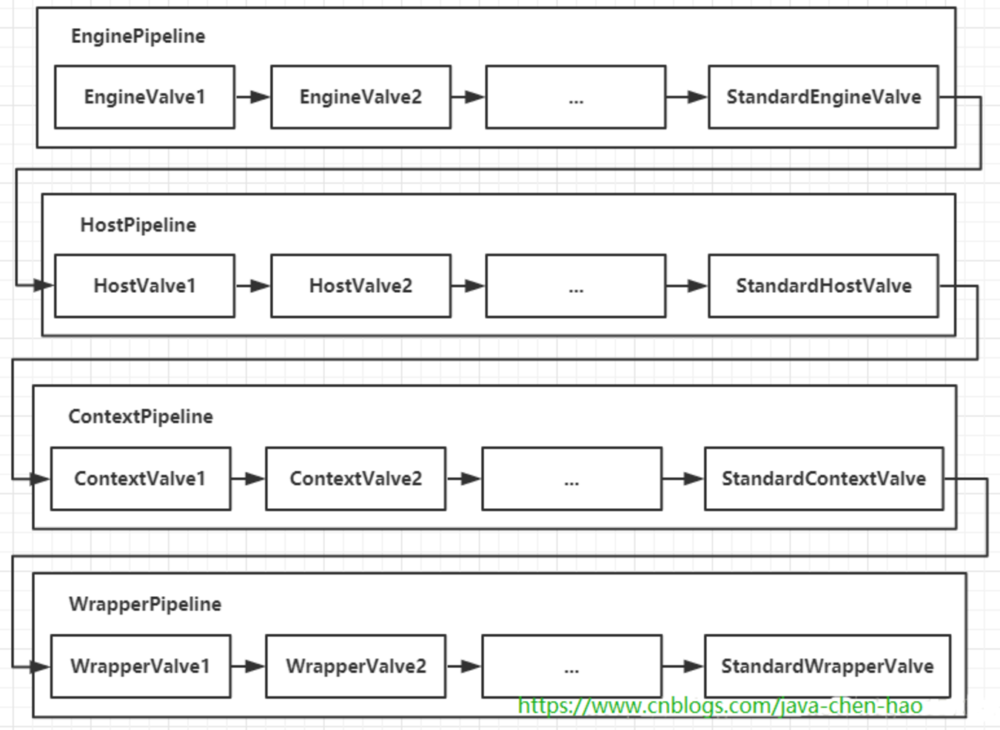

1. Connector 接收请求后首先调用最顶层容器 Engine 的 Pipeline 处理
2. Engine 管道中依次执行 EngineValve1、EngineValve2 等，最后执行 StandardEngineValve，在其中调用 Host 管道，再依次执行 HostValve，最后执行 StandardHostValve，再依次调用 Context 和 Wrapper 的管道
3. 执行到 StandardWrapperValve 时，在其中创建 FilterChain，调用 doFilter 处理请求，FilterChain 包含匹配的 Filter 和 Servlet，依次调用所有 Filter 的 doFilter 和 Servlet 的 service 方法
4. 所有 Pipeline-Valve 执行完，处理完具体请求，将结果返回 Connector，Connector 通过 Socket 返回客户端

**HTTP 请求处理过程**：

不同协议、不同通信方式，ProtocolHandler 有不同的实现。

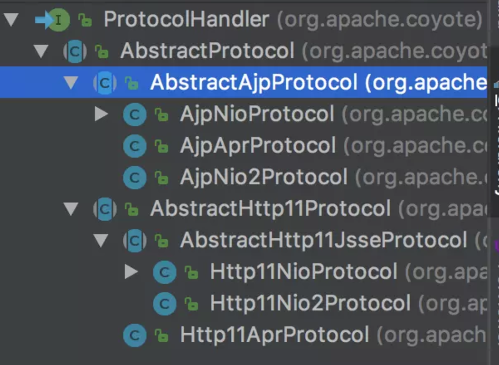

说明：
- ajp 和 http11 是两种不同的协议
- nio、nio2 和 apr 是不同的通信方式
- 协议和通信方式可以相互组合

**Tomcat 完整请求处理流程（面试背诵版）**：

1. 客户端发起 HTTP 请求，到达服务器 8080 端口
2. **Connector** 接收 TCP 连接，分配线程，解析 HTTP 报文
3. Connector 将请求封装成 Request 和 Response，交给 Container 处理
4. 请求交给 Container 的 **Engine** 总引擎
5. Engine 根据域名匹配对应 **Host 虚拟主机**
6. Host 根据项目路径匹配 **Context 当前应用**
7. Context **根据 URL 匹配目标 Wrapper(Servlet)**
8. 调用 Servlet 的 service() → doGet/doPost 执行业务
9. 业务处理完毕，Response 组装响应数据
10. Connector 将结果写出到客户端，连接回收/关闭

Web 应用的边界不是按域名划分，是按 Context 上下文路径划分。比如 /cn/shop、/eu/shop。域名用来切分 Host，访问前缀用来切分 Context（应用）。

**Tomcat 线程池满后的处理**：

当 Tomcat 处理请求的线程不够时，新的请求能够建立连接，但无法立刻读取到服务器返回数据，会被阻塞，客户端连接不会被 Tomcat 终止。当 Tomcat 处理请求的线程执行完毕变为空闲后，会开始依次执行被阻塞的请求。

进入队列的是 SocketProcessor，持有 http 连接，然后在 worker 线程中读取数据，封装成 request 和 response，调用 service 方法。

## 3. Tomcat 的 BIO 和 NIO 模式有什么区别？

**BIO 模式**：一个连接一个 worker 线程，客户端有连接时服务器端就启动一个线程进行处理。如果连接不做任何事情（比如后续请求没有到来，或请求完毕连接还未释放，通常会配置 keepalive）会造成不必要的线程开销，200 个线程可能很快耗尽，非常消耗资源。

**NIO 模式**：客户端发送的连接请求都会注册到多路复用器 Selector 上，多路复用器轮询到连接有 I/O 请求事件时才会启动一个 Worker 线程进行处理，请求处理完毕之后 Worker 线程马上释放。

**为什么 NIO 可以处理 10000 个 socket 连接？**

目前大多数 HTTP 请求使用长连接（HTTP/1.1 默认 keep-alive 为 true），长连接意味着一个 TCP 的 socket 在当前请求结束后，如果没有新的请求到来，socket 不会立马释放，而是等 timeout 后再释放。如果使用 BIO，"读取 socket 并交给 Worker 中的线程"这个过程是阻塞的，socket 在等待下一个请求或等待释放的过程中，处理这个 socket 的 Worker 工作线程会一直被占用，无法释放。因此 tomcat 可以同时处理的 socket 数目实际上是不能超过最大线程数的。而使用 NIO，"读取 socket 并交给 Worker 中的线程"是非阻塞的，当 socket 在等待请求到来或等待释放时，并不会占用工作线程，因此 tomcat 基于 Selector 的 IO 多路复用机制可以使得同时处理的 socket 数目远大于最大线程数，并发性能大大提高。

**Tomcat 的 BIO 处理请求流程**：

1. **Acceptor 线程**：监听并接受客户端的连接请求，每当有新的连接到来时，创建一个新的 Socket 并将其传递给一个新的处理线程
2. **处理线程池**：为每个连接请求创建一个独立的线程，负责处理特定连接的读取、写入等操作
3. **阻塞式处理**：在处理线程中，采用阻塞式的 I/O 方式进行数据的读取和写入
4. **连接处理**：每个线程独立处理其所对应的连接，包括读取请求、解析请求、处理业务逻辑和发送响应等

BIO 模式下，每个连接都有一个专门的线程，简单易懂，但在大量连接并发的情况下会消耗大量线程资源。

**Tomcat 的 NIO 处理请求流程**：

1. **Acceptor 线程**：接受新的连接请求，监听端口，一旦有新的连接请求到来，触发 Selector 的注册操作
2. **Selector**：Java NIO 关键组件，管理多个 Channel（连接），当有连接请求到来时将其注册到对应 Handler
3. **Handler**：每个连接对应一个 Handler，负责读写操作
4. **Reactor 线程池**：处理 IO 事件的线程池，接收 IO 事件后分发给线程处理具体的读写操作
5. **非阻塞处理**：使用 Selector 实现非阻塞 I/O，一个连接在进行读写时如果没有数据可读或无法立即写入，不会阻塞连接的处理，而是处理其他可用连接

**NIO 整体处理流程**：

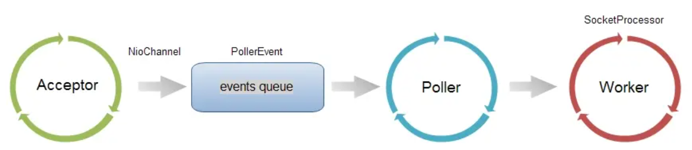

Connector 启动后会启动一组线程：
- **Acceptor 线程组**：接受新连接，将新连接封装，选择一个 Poller 将新连接添加到 Poller 的事件队列中
- **Poller 线程组**：监听 Socket 事件，当 Socket 可读或可写时将 Socket 封装添加到 worker 线程池的任务队列中
- **Worker 线程组**：对请求进行处理，包括分析请求报文并创建 Request 对象，调用容器的 pipeline 进行处理

Acceptor、Poller、Worker 所在的 ThreadPoolExecutor 都维护在 NioEndpoint 中。

**Connector 初始化**：

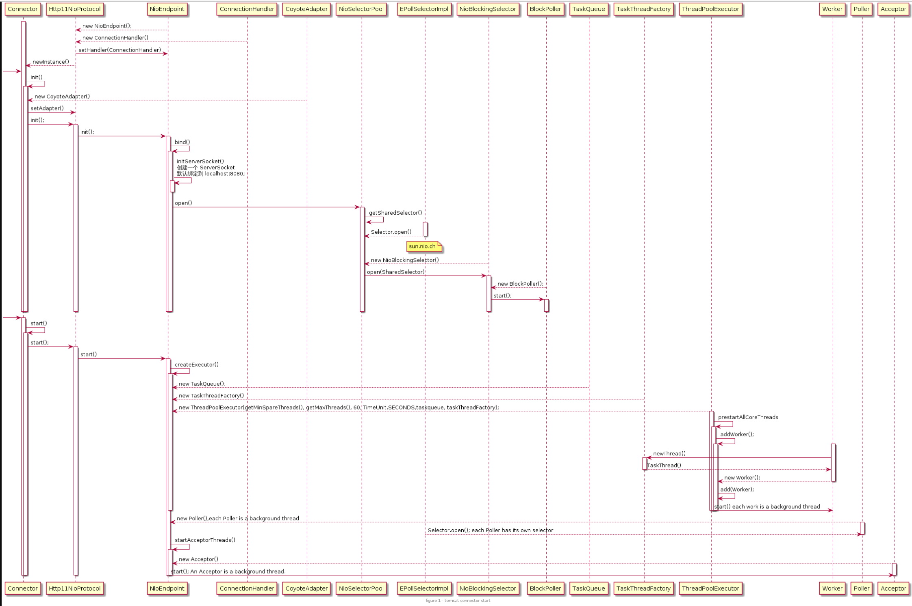

- initServerSocket()：通过 ServerSocketChannel.open() 打开 ServerSocket，默认绑定 8080 端口，默认连接等待队列长度 100（可配置 acceptCount）
- createExecutor()：创建 Worker 线程池，默认启动 10 个 Worker 线程，最多不超过 200 个（可配置 minSpareThreads 和 maxThreads）
- Poller：检测已就绪的 Socket，默认最多不超过 2 个（Math.min(2, Runtime.getRuntime().availableProcessors())），可配置 pollerThreadCount
- Acceptor：接受新连接，默认 1 个，可配置 acceptorThreadCount

**请求处理 - Acceptor**：

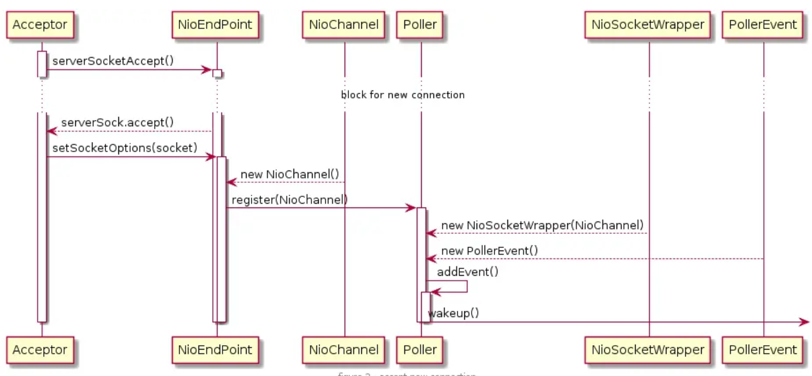

- Acceptor 启动后阻塞在 ServerSocketChannel.accept() 方法处，有新连接到达时返回 SocketChannel
- 配置完 Socket 后封装到 NioChannel，注册到 Poller，连接公平分配到每个 Poller（轮询分配）
- addEvent() 方法将 Socket 添加到该 Poller 的 PollerEvent 队列中

**请求处理 - Poller**：

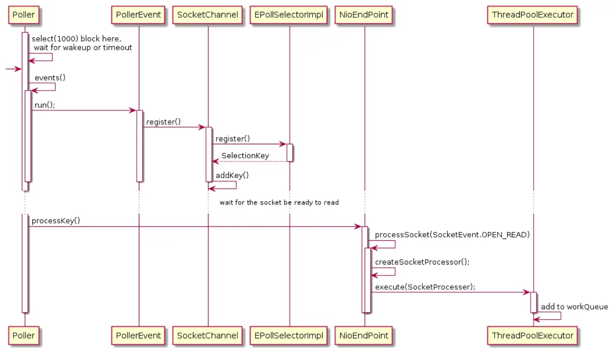

- selector.select(1000)，所有 Poller 共用一个 Selector（实现类 sun.nio.ch.EPollSelectorImpl）
- events() 方法将事件队列中的 Socket 注册到 EPollSelectorImpl，当 Socket 可读时 Poller 才处理
- createSocketProcessor() 将 Socket 封装到 SocketProcessor（实现 Runnable）
- execute(SocketProcessor) 将 SocketProcessor 提交到线程池的 workQueue（BlockingQueue）

**请求处理 - Worker**：

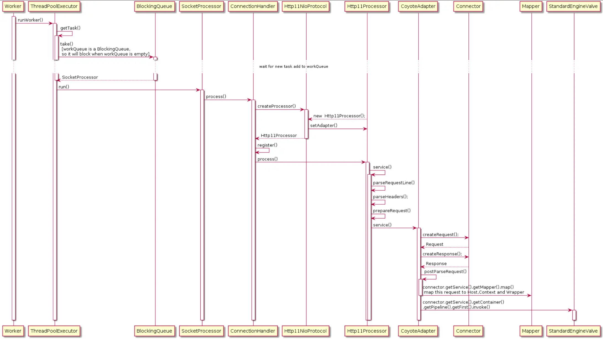

- Worker 线程被创建后执行 ThreadPoolExecutor 的 runWorker()，从 workQueue 取任务，一开始 workQueue 为空则阻塞在 workQueue.take()
- 新任务添加到 workQueue 后，workQueue.take() 返回 Runnable（SocketProcessor），worker 线程调用其 run() 方法
- createProcessor() 创建 Http11Processor 解析 Socket，封装到 org.apache.coyote.Request
- postParseRequest() 封装 Request，处理 URL 到 Host、Context、Wrapper 的映射
  1. CoyoteAdapter 将 org.apache.coyote.Request 封装到 org.apache.catalina.connector.Request
  2. connector.getService().getMapper().map() 查询 URL 映射关系

**请求处理 - Container**：

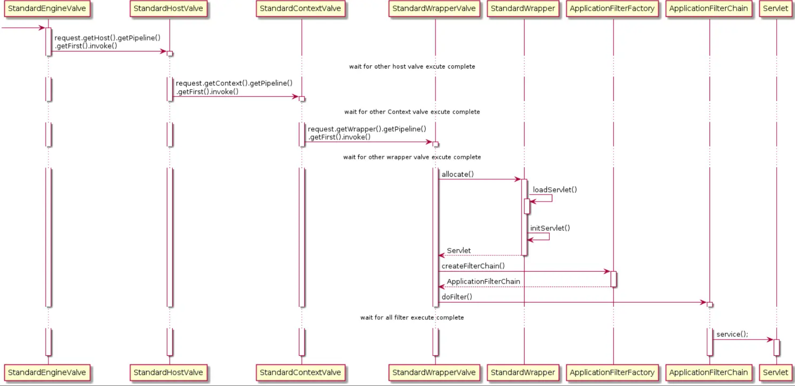

- 每个容器的 StandardPipeline 上都有多个已注册的 Valve，只关注每个容器的 Basic Valve，其他 Valve 在 Basic Valve 前执行
- request.getHost().getPipeline().getFirst().invoke() 获取对应 StandardHost 执行其 pipeline
- request.getContext().getPipeline().getFirst().invoke() 获取对应 StandardContext 执行其 pipeline
- request.getWrapper().getPipeline().getFirst().invoke() 获取对应 StandardWrapper 执行其 pipeline
- StandardWrapperValve 是最关键的：
  - allocate() 加载并初始化 Servlet（Servlet 不都是单例，实现 SingleThreadModel 接口后 StandardWrapper 会维护一组 Servlet 实例，享元模式；SingleThreadModel 在 Servlet 2.4 后弃用）
  - createFilterChain() 从 StandardContext 获取所有过滤器，将匹配 Request URL 的过滤器挑选出来添加到 filterChain
  - doFilter() 执行过滤链，所有过滤器执行完毕后调用 Servlet 的 service() 方法

## 4. Tomcat 如何做 Web 应用之间的类隔离？

Tomcat 需要解决三个类加载问题：
1. **Web 应用之间的类需要隔离**：两个 Web 应用中有同名的 Servlet 但功能不同，需要同时加载和管理，保证不冲突
2. **共享 JAR 包**：两个 Web 应用依赖同一个第三方 JAR 包（如 Spring），需要保证能够共享，只加载一次，避免 JVM 内存膨胀
3. **隔离 Tomcat 本身的类和 Web 应用的类**

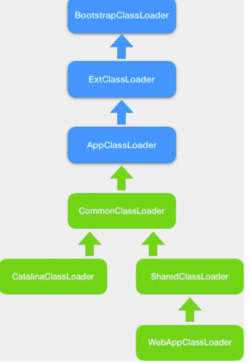

**WebAppClassLoader（隔离不同的 Web 应用程序）**：

如果使用 JVM 默认 AppClassLoader 加载 Web 应用，AppClassLoader 只能加载一个 Servlet 类，加载第二个同名 Servlet 类时会返回第一个的 Class 实例，因为在 AppClassLoader 看来同名 Servlet 类只被加载一次。

Tomcat 的解决方案是**自定义一个类加载器 WebAppClassLoader**，每个 Web 应用创建一个类加载器实例。Context 容器组件对应一个 Web 应用，因此**每个 Context 容器负责创建和维护一个 WebAppClassLoader 加载器实例**。**不同的加载器实例加载的类被认为是不同的类**，即使类名相同。这在 Java 虚拟机内部创建了相互隔离的 Java 类空间，每个 Web 应用都有自己的类空间，通过各自的类加载器互相隔离。

**SharedClassLoader（实现不同的 Web 应用程序的共享）**：

在双亲委托机制里，各个子加载器都可以通过父加载器去加载类，只要把需要共享的类放到父加载器的加载路径下就可以实现共享。

Tomcat 又加了 SharedClassLoader，作为 WebAppClassLoader 的父加载器，专门加载 Web 应用之间共享的类。WebAppClassLoader 自己没有加载到某个类，就会委托父加载器 SharedClassLoader 去加载，**SharedClassLoader 会在指定目录下加载共享类**，之后返回给 WebAppClassLoader。

**CatalinaClassloader（隔离 Tomcat 本身的类和 Web 应用程序）**：

要共享可以通过父子关系，要隔离则需要兄弟关系。兄弟关系指两个类加载器是平行的，拥有同一个父加载器，两个兄弟类加载器加载的类是隔离的。Tomcat 设计了 CatalinaClassloader，专门加载 Tomcat 自身的类。

**CommonClassLoader（实现 Tomcat 和各 Web 应用程序之间的共享）**：

增加 CommonClassLoader，作为 CatalinaClassloader 和 SharedClassLoader 的父加载器。CommonClassLoader 能加载的类可以被 CatalinaClassLoader 和 SharedClassLoader 使用，而 CatalinaClassLoader 和 SharedClassLoader 能加载的类则与对方相互隔离。WebAppClassLoader 可以使用 SharedClassLoader 加载到的类，但各个 WebAppClassLoader 实例之间相互隔离。

**Spring 加载问题**：

如果有 10 个 Web 应用程序都用到了 Spring，可以把 Spring 的 jar 包放到 common 或 shared 目录下让这些程序共享。Spring 的作用是管理每个 web 应用程序的 bean，getBean 时自然要能访问到应用程序的类，而用户的程序放在 /WebApp/WEB-INF 目录中（由 WebAppClassLoader 加载），那么在 CommonClassLoader 或 SharedClassLoader 中的 Spring 容器如何去加载并不在其加载范围的用户程序中的 Class 呢？

**解答**：Spring 根本不会去管自己被放在哪里，它统统使用**线程上下文加载器（TCCL）**来加载类。TCCL 默认设置为 WebAppClassLoader，也就是说哪个 WebApp 应用调用了 spring，spring 就去取该应用自己的 WebAppClassLoader 来加载 bean。

**线程上下文加载器**是一种类加载器传递机制。类加载器保存在线程私有数据里，只要是同一个线程，一旦设置了线程上下文加载器，在线程后续执行过程中就能把这个类加载器取出来用。Tomcat 为每个 Web 应用创建一个 WebAppClassLoader 类加载器，并在启动 Web 应用的线程里设置线程上下文加载器，这样 Spring 在启动时就将线程上下文加载器取出来用来加载 Bean。Spring 取线程上下文加载的代码：`cl = Thread.currentThread().getContextClassLoader()`。

## 5. Tomcat 的 Keep-Alive 机制是什么？

HTTP/1.1 默认启用 Keep-Alive（长连接），允许在同一个 TCP 连接上发送多个 HTTP 请求/响应，避免频繁创建和销毁连接的开销。

**Keep-Alive 的作用**：
- 减少 TCP 三次握手的开销
- 减少 TCP 慢启动对性能的影响
- 复用连接，降低服务端和客户端的资源消耗

**Tomcat 中的 Keep-Alive 配置**：
- 在 server.xml 的 Connector 中配置
- `maxKeepAliveRequests`：一个连接上最多处理多少次请求，默认 100
- `keepAliveTimeout`：在关闭连接之前，等待下一个请求的超时时间（毫秒），默认与 connectionTimeout 相同（通常 20000ms）

**Keep-Alive 与线程模型的关系**：
- BIO 模式下，长连接会长时间占用 Worker 线程，容易导致线程耗尽，因为线程在等待下一个请求时处于阻塞状态
- NIO 模式下，长连接不会长时间占用 Worker 线程，Poller 通过 Selector 监听 Socket 事件，有请求时才分配 Worker 线程处理，处理完后立即释放

**注意事项**：
- 长时间占用连接而不发送请求会浪费服务端资源，应合理设置 keepAliveTimeout
- 客户端和代理服务器也可能有自身的 Keep-Alive 超时设置，需协调配置
- HTTP/1.0 默认不启用 Keep-Alive，需在请求头中显式指定 `Connection: keep-alive`

参考：[Tomcat高效响应的秘密(二) keep-alive](https://zhuanlan.zhihu.com/p/20887507)

## 6. Servlet 3.0 和 4.0 有什么区别？

**1. 异步支持**：
- Servlet 3.0 引入了对异步处理的支持，允许 Servlet 在处理请求时异步执行操作，提高了性能和响应性，能够处理长时间运行的任务而不阻塞其他请求
- Servlet 4.0 进一步增强了异步支持，引入了异步 I/O 操作，允许 Servlet 使用非阻塞 I/O 进行读写操作，更有效地处理大量并发请求

**2. HTTP/2 支持**：
- Servlet 3.0 不直接支持 HTTP/2 协议
- Servlet 4.0 引入了对 HTTP/2 的支持，允许 Servlet 在 HTTP/2 连接上运行。HTTP/2 具有多路复用、头部压缩等功能，可以加速页面加载速度

**3. HTTP Upgrade 和 WebSockets**：
- Servlet 3.0 支持 HTTP Upgrade，允许在 HTTP 协议之上切换到其他协议，如 WebSocket
- Servlet 4.0 在 WebSocket 支持方面有了改进，提供更多 WebSocket 特性和改进的 API

**4. HTTP/1.1 Trailer 头部**：
- Servlet 3.0 不支持 Trailer 头部（HTTP/1.1 中的一种特殊头部，用于在请求或响应的尾部包含附加信息）
- Servlet 4.0 支持 Trailer 头部，允许在请求或响应中包含 Trailer 头部，在尾部添加额外信息

**5. 改进的注解支持**：
- Servlet 3.0 引入了注解支持，Servlet 4.0 进行了一些改进和扩展，使开发更加便利

## 7. Servlet 异步请求是如何工作的？

**非异步请求（同步 Servlet）**：

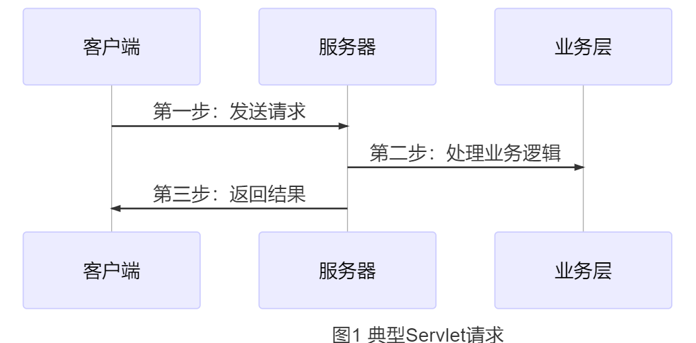

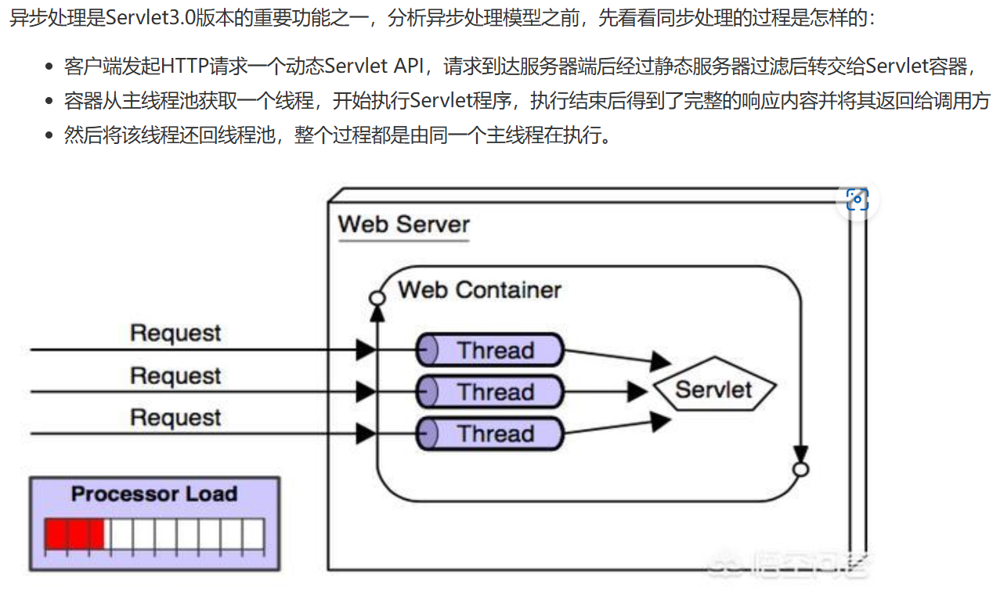

其中，第二步处理业务逻辑通常最耗时，主要体现在**数据库操作**、**跨网络调用**等。在此过程中，Servlet 线程一直处于阻塞状态，直到方法执行完毕。服务器的工作线程数是有限的，Servlet 线程一直被占用得不到释放，对于**并发请求比较大的情况下，其他请求由于获取不到连接而处于等待状态**，影响了服务器的吞吐能力。

**异步请求（异步 Servlet）**：

异步请求的请求类型 keep-alive，客户端请求后不关闭连接，服务器可以把返回结果推送到客户端。客户端发起请求，Servlet 线程将请求转交给一个异步线程来执行业务处理，线程本身返回到容器（这样这个线程就可以继续处理接下来的请求）。异步线程处理完业务以后，可以直接生成响应数据（异步线程拥有 ServletRequest 和 ServletResponse 对象的引用），或者将请求继续转发给其它 Servlet。如此一来，Servlet 线程不再一直处于阻塞状态以等待业务逻辑的处理，而是启动异步线程之后可以立即返回，Servlet request 请求线程可以被快速释放回 Web 容器，从而提高并发性。

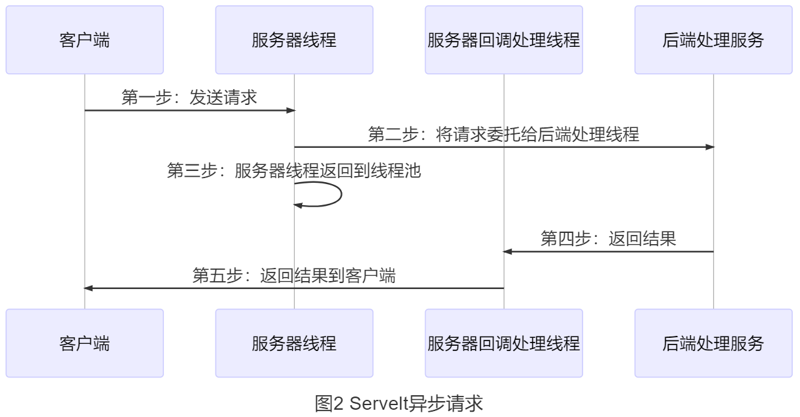

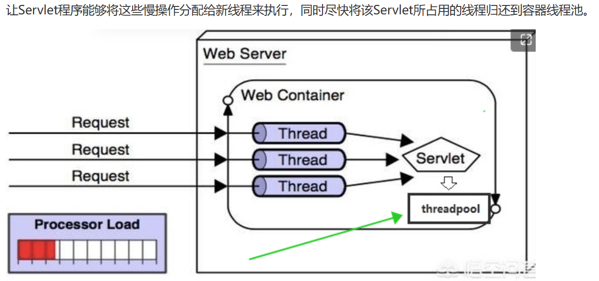

**优化点**：Servlet 的业务逻辑处理时间较长时（如 IO 耗时高的场景），同步 Servlet 会占用 worker 线程直到请求完成，worker 线程一直阻塞。Tomcat 的 worker 线程资源有限（默认 200），影响服务吞吐量。而异步 Servlet 不会阻塞 worker 线程，异步处理业务，完成后回调返回结果。这里 worker 线程节省了等待 Servlet 执行的时间，用来处理其他请求，提高了吞吐量。适合 Servlet 业务耗时长的场景，比如大部分业务都是 IO 密集型的业务。

**问题：不占用 worker 线程而使用业务线程，不是另开线程执行，为什么还能提高性能？**

- 异步 Servlet 可以将任务交给专门的线程池处理，线程池可以根据任务特定进行优化，比如使用更大的线程池处理 IO 密集型任务，或更小的线程池处理 CPU 密集型任务
- 通过将不同类型的任务分配到不同的线程池中，可以更高效管理线程资源
- **异步模式只能说让 Tomcat 有机会接收更多请求，并不能提升特定服务的吞吐量**

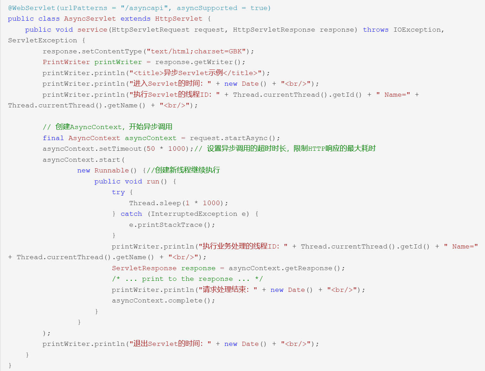

`AsyncContext.start()` 方法是启用新线程的关键。不同的 Web 容器对此有不同的实现，Tomcat 实际上是利用 HTTP thread pool 来处理 `AsyncContext.start()` 的。这也就是说，原本想释放 HTTP thread，但实际上 HTTP thread 依然被用作 Worker thread，只不过这个 thread 和接收请求的 HTTP thread 不是同一个而已。

**使用 ExecutorService**：前面看到了 Tomcat 并没有单独维护 Worker thread pool，那么就得自己想办法搞一个，使用一个带 Thread pool 的 ExecutorService 来处理 AsyncContext。

**对于性能的误解**：AsyncContext 的目的并不是为了**提高性能**，也并不直接提供性能提升，它提供了把 HTTP thread 和 Worker thread 解耦的机制，从而提高 Web 容器的**响应能力**。不过 AsyncContext 在某些时候的确能够提高性能，但取决于代码怎么写。

比如：Web 容器的 HTTP thread pool 数量 200，某个 Servlet 使用一个 300 的 Worker thread pool 来处理 AsyncContext。相比 Sync 方式 Worker thread pool = HTTP thread pool = 200，这种情况下有 300 的 Worker thread pool，所以能带来一些性能上的提升（干活的人多了）。相反，如果 Worker thread 的数量 <= HTTP thread 数量的时候，就不会得到性能提升，因为此时处理请求的瓶颈在 Worker thread。

**一定不要认为 Worker thread pool 必须比 HTTP thread pool 大**：
- 两者职责不同，一个是 Web 容器用来接收外来请求，一个是处理业务逻辑
- thread 的创建有代价，如果 HTTP thread pool 已经很大了再搞一个更大的 Worker thread pool 反而会造成过多的 Context switch 和内存开销
- AsyncContext 的目的是将 HTTP thread 释放出来，避免被操作长期占用导致 Web 容器无法响应

所以在更多时候，Worker thread pool 不会很大，而且会根据不同业务构建不同的 Worker thread pool。比如：Web 容器 thread pool 大小 200，一个慢速 Servlet 的 Worker thread pool 大小 10，这样无论有多少请求到慢速操作，它都不会将 HTTP thread 占满导致其他请求无法处理。

## 8. JDBC Connection 是线程安全的吗？数据库连接池呢？

**1. Connection 实例是线程安全的吗？**

一个 Connection 实例对应底层一个 TCP 链接。**Connection 不是线程安全的**，在多线程环境中使用时会导致数据操作错乱，特别是有事务的情况。connection.commit() 方法提交事务，在多线程环境中，线程 A 开启了事务，然后线程 B 却意外的 commit，会导致数据错乱。

**2. 数据库连接池是线程安全的吗？**

**连接池就是为多线程设计，正常使用并不需要额外的同步机制**。但 JDBC 的对象 Connection、Statement/PreparedStatement 或 ResultSet 都不是线程安全，也不是资源安全的，不能在多个线程中共享这些对象。

数据库连接池就是用来保存数据库连接的一个池子。业务代码需要和数据库进行交互时，从这个池子里面取出一个数据库连接，然后在这个连接上进行增删改查操作。使用结束后，业务代码再将这个连接归还给这个池子，然后这个连接就可以被其他业务代码继续使用。

数据库连接池本身的设计，避免了多个线程同时共享一个连接的情况，一个连接必须先向连接池申请才能获得，使用结束必须归还连接池才能给下一个线程使用。

数据库连接池肯定是线程安全的，**每一个线程从池子里拿到一个连接进行数据库操作时，决不允许另一个线程同时拿到这个连接进行操作**，不然无法区分返回的数据是哪个线程请求的。

**HikariCP 参考**：
- [HikariCP 连接池设计分析](https://zhuanlan.zhihu.com/p/90910781)
- [hikaricp连接池设计分析](https://blog.csdn.net/qq_30400779/article/details/108797153)

## 9. Nginx 单点问题如何解决？负载均衡架构如何演进？

**单点问题**：只配置一个 nginx 会有单点问题，如果 nginx 挂了那么整个后边的服务将不可访问，失去了高可用性。

**单机架构**：

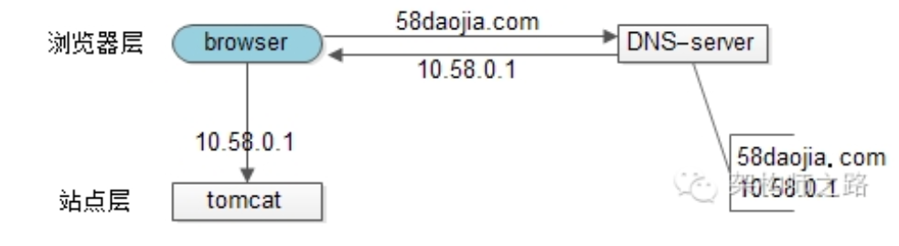

缺点：
- 非高可用，web-server 挂了整个系统就挂了
- 扩展性差，当吞吐量达到 web-server 上限时，无法扩容

**扩容方案一：DNS 轮询**

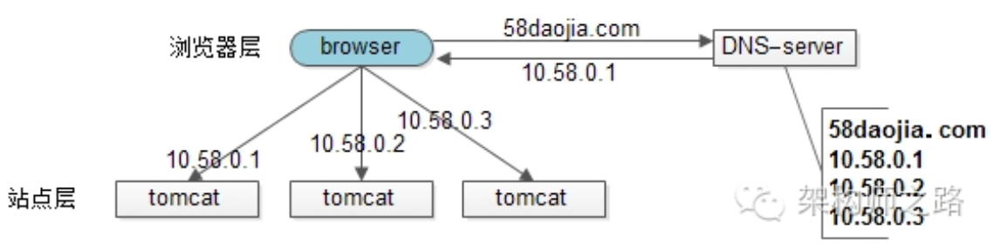

多部署几份 web-server，1 个 tomcat 抗 1000，部署 3 个 tomcat 就能抗 3000。在 DNS-server 层面，域名每次解析到不同的 ip。

优点：
- 零成本：在 DNS-server 上多配几个 ip 即可
- 部署简单：多部署几个 web-server，原系统架构不需要做任何改造
- 负载均衡：变成了多机，负载基本均衡

缺点：
- 非高可用：**DNS-server 只负责域名解析 ip，这个 ip 对应的服务是否可用，DNS-server 是不保证的**，假设有一个 web-server 挂了，部分服务会受到影响
- **扩容非实时：DNS 解析有一个生效周期**
- 暴露了太多外网 ip

**扩容方案二：Nginx 反向代理**

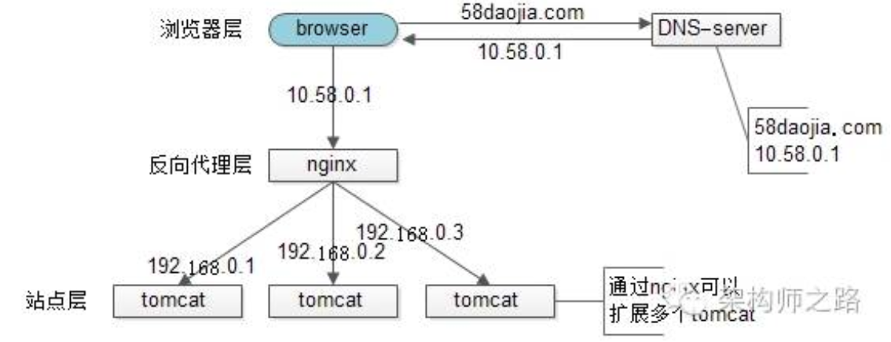

站点层与浏览器层之间加入了一个反向代理层，利用高性能的 nginx 来做反向代理，nginx 将 http 请求分发给后端多个 web-server。

优点：
- DNS-server 不需要动
- 负载均衡：通过 nginx 来保证
- 只暴露一个外网 ip，nginx -> tomcat 之间使用内网访问
- 扩容实时：nginx 内部可控，随时增加 web-server 随时实时扩容
- 能够保证站点层的可用性：任何一台 tomcat 挂了，nginx 可以将流量迁移到其他 tomcat

缺点：
- 时延增加 + 架构更复杂了：中间多加了一个反向代理层
- **反向代理层成了单点**，非高可用：tomcat 挂了不影响服务，nginx 挂了怎么办？

**扩容方案三：Keepalived**

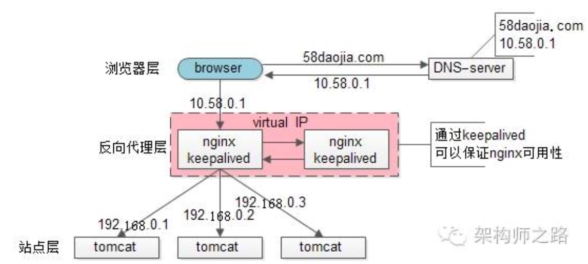

做两台 nginx 组成一个集群，分别部署 keepalived，设置成相同的虚 IP，保证 nginx 的高可用。当一台 nginx 挂了，keepalived 能够探测到，并将流量自动迁移到另一台 nginx 上，整个过程对调用方透明。

Keepalived 是一个基于 VRRP 协议来实现的高可用方案。一个 LVS 服务会有 2 台服务器运行 Keepalived，一台为主服务器（MASTER），一台为备份服务器（BACKUP），对外表现为一个虚拟 IP。主服务器会发送特定的消息给备份服务器，当备份服务器收不到这个消息时（主服务器宕机），备份服务器就会接管虚拟 IP，继续提供服务，从而保证了高可用性。

Keepalived 的作用是检测服务器的状态，如果有一台 web 服务器死机或工作出现故障，Keepalived 将检测到，并将有故障的服务器从系统中剔除，同时使用其他服务器代替该服务器的工作，当服务器工作正常后 Keepalived 自动将服务器加入到服务器群中。

优点：
- 解决了高可用的问题

缺点：
- **资源利用率只有 50%**
- **nginx 仍然是接入单点，如果接入吞吐量超过了 nginx 的性能上限怎么办？例如 qps 达到 50000？**

**扩容方案四：LVS 或 F5**

Nginx 毕竟是软件，性能比 tomcat 好，但总有个上限，超出了上限还是扛不住。

LVS（Linux Virtual Server），linux 虚拟服务器，是一个虚拟的四层交换器集群系统，根据目标地址和目标端口实现用户请求转发，本身不产生流量，只做用户请求转发，目前是负载均衡性能最好的集群系统。

LVS 的服务器有 2 个网卡，对外接收请求的网卡的 IP 叫做 VIP（虚拟 IP），对内的网卡的 IP 叫做 DIP（转发 IP），真实的应用服务器网卡的 IP 叫做 RIP。用户电脑的 IP 叫做 CIP。

LVS 实施在操作系统层面，F5 实施在硬件层面，性能比 nginx 好很多，每秒可以抗 10w。

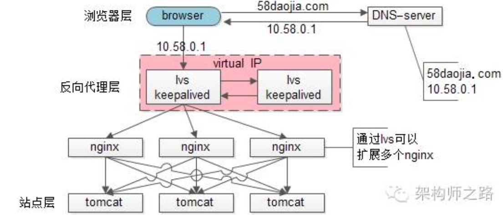

此时：
- 通过 lvs 来扩展多个 nginx
- 通过 keepalived+VIP 的方案保证可用性

**99.9999% 的公司到这一步基本就能解决接入层高可用、扩展性、负载均衡的问题**。

**扩容方案五：LVS 或 F5 + DNS 轮询**

水平扩展才是解决性能问题的根本方案，能够通过加机器扩充性能的方案才具备最好的扩展性。

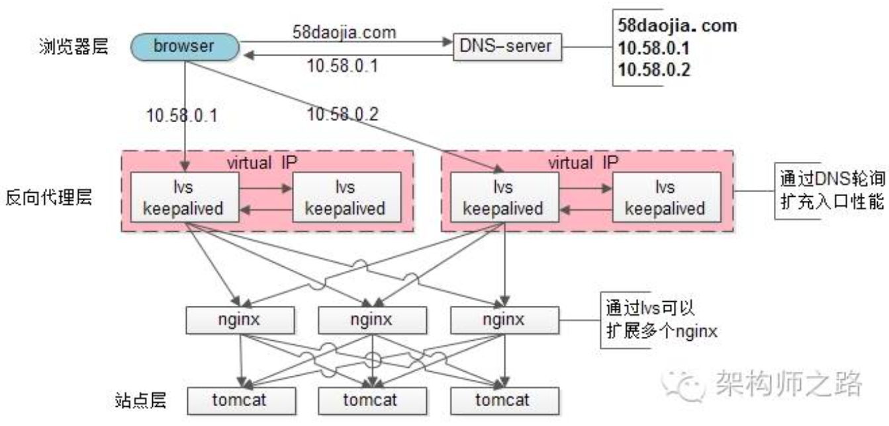

此时：
- 通过 DNS 轮询来线性扩展入口 LVS 层的性能
- 通过 keepalived 来保证高可用
- 通过 LVS 来扩展多个 nginx
- 通过 nginx 来做负载均衡，业务七层路由

**四层和七层负载均衡**：

**四层负载均衡**在传输层运行，负责处理消息的传递，不考虑消息的内容。只将网络数据包转发到上游服务器，不检查数据包的内容。通过检查 TCP 流中的前几个数据包做出有限的路由决策。

**七层负载均衡**在应用层运行，涉及每个消息的实际内容。读取消息内容，能够根据 URL 或 cookie 做出负载均衡决策。然后与选定的上游服务器建立新的 TCP 连接（或通过 HTTP keepalives 重用现有连接），并将请求写入服务器。

七层负载均衡的优势：比基于数据包的四层负载均衡更耗 CPU，但很少导致现代服务器性能下降。支持负载均衡器做出更明智的决策，可对内容进行优化和更改（如压缩、加密），利用缓冲卸载上游服务器的慢速连接，提高性能。执行七层负载均衡的设备通常被称为"反向代理服务器"。

**结论**：
1. 接入层架构要考虑的问题域：高可用、扩展性、反向代理+扩展均衡
2. nginx、keepalived、lvs、f5 可以很好的解决这几个问题
3. 水平扩展 scale out 是解决扩展性问题的根本方案，**DNS 轮询是不能完全被 nginx/lvs/f5 所替代的**
4. 58 到家部署在阿里云上，前端购买 SLB 服务（可粗暴认为是一个 lvs+keepalived 的高可用负载均衡服务），后端是 nginx+tomcat

**DNS 没有单点问题**的原因：
- 分布式架构：将解析请求分散到全球各地的 DNS 服务器
- 缓存机制：减少对根域名服务器或顶级域名服务器的请求次数
- 域名层次结构：分层的树状结构快速定位需要解析的域名
- 安全性和反欺诈措施：如 DNSSEC
- 域名服务器优化：软件优化、硬件升级和网络带宽管理
- 冗余和故障转移：配置冗余服务器确保高可用

**Keepalived 的完整功能介绍**：
1. **高可用性**：确保在多台服务器之间实现故障切换，监视服务器的状态（主机健康状态、服务状态和网络连通性），一旦检测到故障自动切换到备用服务器
2. **负载均衡**：将流量均匀分布到多个服务器上，支持轮询、加权轮询、IP散列等多种算法
3. **虚拟 IP (VIP) 管理**：管理虚拟 IP 地址分配给活动服务器，故障切换时客户端不需要知道切换后的服务器实际 IP
4. **集群管理**：确保集群中的服务器在运行中保持一致状态
5. **监控和通知**：配置警报和通知，在服务器故障或切换时及时通知管理员

**LVS**（Linux Virtual Server）是一个虚拟的四层交换器集群系统，根据目标地址和目标端口实现用户请求转发，本身不产生流量，只做用户请求转发，目前是负载均衡性能最好的集群系统。
