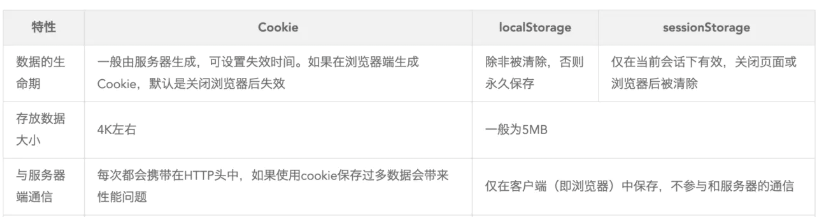
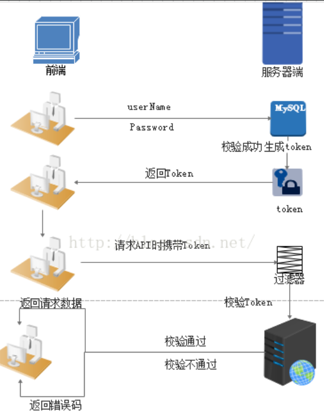
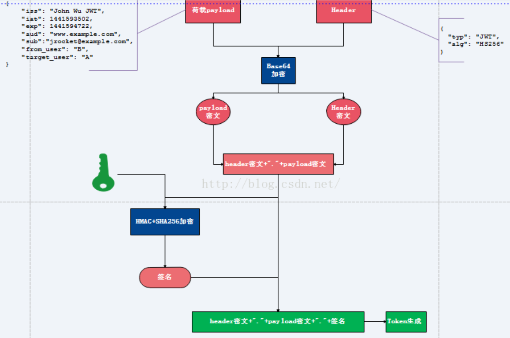
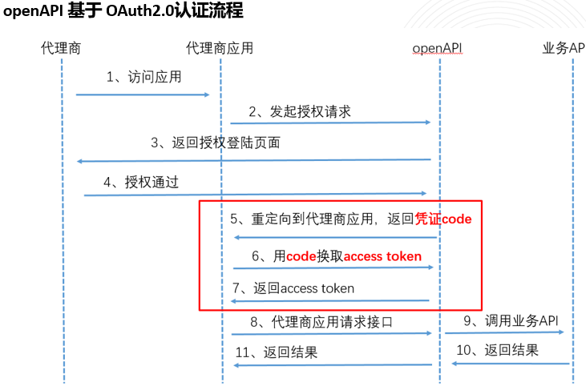

## 1. 什么是HTTP无状态特性？如何解决？

HTTP协议本身是无状态的，即每次服务端接收到客户端的请求时，都是一个全新的请求，服务器并不知道客户端的历史请求记录；这一次请求和上一次请求是没有任何关系的，互不认识的，没有关联的。Session和Cookie的主要目的就是为了弥补HTTP的无状态特性。

## 2. Cookie是什么？有哪些特性？

Cookie是一个非常具体的东西，指的就是User-Agent（一般是浏览器）里面能永久存储的一种数据，仅仅是浏览器实现的一种数据存储功能。

Cookie由服务器生成，发送给浏览器，浏览器把cookie以kv形式保存到某个目录下的文本文件内，下一次请求同一网站时会把该cookie发送给服务器。由于cookie存在客户端上，所以浏览器加入了一些限制确保cookie不会被恶意使用，同时不会占据太多磁盘空间，所以每个域的cookie数量是有限的。

特性：
- 个数和大小的限制，大小一般是4K
- 满足同源策略，域名不一样不能互相操作Cookie，path也必须一样才能相互访问
- 设置Cookie示例：`Cookie c = new Cookie("uid", u.getUid()+""); c.setMaxAge(3*24*3600); c.setPath("/login/ck"); resp.addCookie(c);`

有两种类型的Cookies：
- **Session Cookies（会话Cookie）**：不包含到期日期，存储在内存中，永远不会写入磁盘，浏览器关闭时永久丢失
- **Persistent Cookies（持久Cookie）**：包含有效期（Expires或Max-Age），在到期指定的日期从磁盘中删除。如：`Set-Cookie: id=a3fWa; Expires=Wed, 21 Oct 2015 07:28:00 GMT;`

Set-Cookie格式：`Set-Cookie: value[; expires=date][; domain=domain][; path=path][; secure]`

## 3. Session是什么？由谁创建和管理？

Session从字面上讲就是会话。服务器要知道当前请求发给自己的是谁，为了做这种区分，服务器给每个客户端分配不同的"身份标识"，然后客户端每次向服务器发请求时都带上这个"身份标识"，服务器就知道请求来自谁了。

关键点：
- Session由**servlet容器创建和管理**（servlet规范）
- 采用Cookie方式保存sessionId，标准Cookie名必须为**JSESSIONID**，容器可能允许自定义这个名字
- 实现`HttpSessionListener`接口，session创建时会调用`sessionCreated`方法，可统计session创建和销毁
- 服务端调用`request.getSession()`时如果当前没有session，则立刻建立；有则返回当前session。等同于`request.getSession(true)`
- 使用`request.getSession(false)`，若当前没有session，得到null
- Session机制准确来说是通过**K-V数据格式**来保存状态
- session过了超时时间会自动失效

Session是以**Cookie或URL重写为基础**的，默认使用Cookie来实现。URL地址重写的原理是将该用户Session的id信息重写到URL地址中，服务器能够解析重写后的URL获取Session的id。

## 4. Session如何持久化和管理？

正常Session保存在内存中。当Tomcat执行安全退出时（通过执行shutdown脚本），会将session持久化到本地文件，通常在tomcat的部署目录下有个**session.ser**文件。当启动tomcat时，会从这个文件读入session，并添加到manager的session池中去。这样当tomcat正常重启时，session没有丢失。

Tomcat会定期检测出不活跃的session，然后将其删除。启动tomcat的同时会启动一个后台线程用来检测过期的session。

## 5. Cookie+Session的认证流程是怎样的？

1. 用户向服务器发送用户名和密码
2. 服务器验证通过后，在当前session保存相关数据（用户角色、登录时间等），调用`request.getSession().setAttribute("user", user)`
3. 服务器向用户返回session_id，写入用户Cookie（Set-Cookie响应头）
4. 用户随后的每一次请求，都会通过Cookie将session_id传回服务器
5. 服务端收到session_id，找到对应保存的数据，由此得知用户身份
6. session过了超时时间会自动失效

Cookie只是实现session的其中一种方案。禁用Cookie后可通过URL重写或Token来实现。现在大多都是Session+Cookie，只用session不用cookie或只用cookie不用session在理论上都可以保持会话状态。

用session只需要在客户端保存一个id，大量数据在服务端。如果全部用cookie，数据量大时客户端没有那么多空间，且账户信息全部保存在客户端一旦被劫持全部信息泄露，网络传输数据量也会变大。

## 6. 什么是Token？认证流程是怎样的？

Token不需要保存在服务端，服务端会对用户数据做一个签名加密，返回给客户端，没有分布式共享问题。

Token流程：
1. 用户尝试登录
2. 登录成功后，后端依靠加密算法将凭证生成token，返回给客户端
3. 客户端保存token，每次发送请求时在HTTP Header中携带token
4. 后端再接收到带有token的请求时，通过密钥来验证token的有效性

一般使用JWT（Json Web Token）标准。

## 7. Token和Session有什么区别？

- **Token是无状态的**，后端不需要记录信息，每次请求解密即可
- **Session是有状态的**，需要后端每次去检索id的有效性，不同的session都需要保存。可以设置单点登录减少保存的数据
- Session与Token的问题是**空间与时间的博弈**：token不需要保存直接获取，每次访问都需要进行解密；session需要存储但直接查
- Token可以抵抗CSRF，Cookie+Session不行
- Token诞生即为了解决分布式集群共享Session的问题

## 8. 分布式场景下Session和Token的对比？

**Session**：有状态，一般存于服务器内存或硬盘中。当服务器采用分布式或集群时，session面临负载均衡问题，多服务器不共享session，不好确认当前用户是否登录。可以将session存在一个服务器中解决，但不能完全达到负载均衡效果。

**Token**：无状态，token字符串里就保存了所有的用户信息。客户端登陆传递信息给服务端，服务端收到后把用户信息加密（token）传给客户端，客户端将token存放于localStroage等容器中。客户端每次访问都传递token，服务端解密token就知道这个用户是谁。通过CPU加解密，服务端不需要存储session占用存储空间，很好解决负载均衡多服务器问题。

## 9. Token为什么可以防止CSRF攻击？

Cookie+Session中，form发起的POST请求不受浏览器同源策略限制，可以任意使用其他域的Cookie向其他域发送POST请求。在post请求瞬间，**cookie会被浏览器自动添加到请求头中**。例如用户正在登陆银行网页，同时登陆了攻击者的网页，攻击者可以在网页放一个表单，该表单提交src为`http://www.bank.com/api/transfer`，body为`count=1000&to=Tom`，用户打开网页时就已经转给Tom 1000元。

Token是开发者为了防范CSRF特别设计的令牌，**浏览器不会自动添加到headers里**，攻击者也无法访问用户的token，提交的表单无法通过服务器过滤，无法形成攻击。

## 10. 什么情况下拿到Cookie也不能登录？

几个拿到Cookie也不能登录的情况：
1. 内网系统
2. 白名单系统
3. 没使用cookie验证的系统，或非只靠cookie验证的系统
4. 启用HSTS会让HTTP上的cookie无效
5. Cookie带动态验证，比如检验cookie内的某些加密数值是否与请求一致
6. Cookie已失效

拿到Cookie确实危险，但不一定可以登录进系统：
- Cookie会与IP地址与user-agent联动检查，遇到可疑的异地冒用情况会踢出登陆
- 管理员后台只能office访问（SLB做了IP白名单），无法外部访问
- 管理页面cookie是1小时过期，拿到的是过期cookie进不去后台
- API用了带body签名验证的协议，规则复杂，有了cookie也无法用爬虫冒用身份请求接口
- Cookie启用严格的same-site且httpOnly，无法通过js代码或其他钓鱼获取用户cookie

零信任：你的电脑被抢了肯定能用电脑登录进系统，但带验签的API使爬虫难写，高手不一定能在过期前写出来。

## 11. 什么是JWT？它的结构和原理是什么？

JWT（JSON Web Token）是一种在网络应用中传递信息的编码和解码方式，通常用于身份验证和授权。是一个开放标准（RFC 7519），定义了一种紧凑的、自包含的方式用JSON格式表示信息，可以被验证和信任。

JWT是**明文签名方案**，所有内容都是明文（base64编码），加上secret使用HMAC算法获取摘要签名，通过签名检查是否被篡改。通常**一次签发，永久有效**，所以会在数据中放入过期时间，受签名限制无法篡改。

**JWT就是为了解决去中心化的认证问题**。如果采用服务端记录所有生成的JWT，就又回到中心化的路子上去了，违背了JWT应用场景。

JWT最重要的作用就是对token信息的防伪作用。JWT的声明一般被用来在身份提供者和服务提供者间传递被认证的用户身份信息，以便于从资源服务器获取资源，比如用在用户登录上。

JWT由三部分组成，分别进行base64url编码后用"."连接：
- **JWT头**：描述元数据的JSON对象，包含声明类型（"JWT"）和使用的加密算法（如HMAC、SHA256、RSA），默认为HMAC SHA256（写为HS256）。如`{"alg":"HS256","typ":"JWT"}`
- **有效载荷（Payload）**：主体内容JSON对象，包含需要传递的数据
  - JWT指定七个默认字段：iss（签发者）、sub（主题）、aud（接收方）、exp（过期时间，必须大于签发时间）、nbf（定义在什么时间之前该jwt不可用）、iat（签发时间）、jti（唯一身份标识，主要用来作为一次性token回避重放攻击）
  - 可自定义字段如`{"name":"Ann","role":"manager"}`
  - 使用Base64 URL算法转换为字符串保存，**未加密，不要放敏感信息（如密码）**
- **签名哈希**：对前两部分数据签名，通过指定的算法生成哈希，确保数据不会被篡改。指定一个密码（secret）仅保存在服务器中，不能向用户公开。公式：
  `HMACSHA256(base64UrlEncode(header)+"."+base64UrlEncode(claims), secret) → 签名hash`

## 12. JWT签名的作用是什么？

签名的过程实际上是对头部和负载内容进行签名，**防止内容被篡改**。假如有人对头部和负载的内容解码之后进行修改，再进行编码，最后加上之前的签名组合形成新的JWT，服务器端可以判断新的头部和负载形成的签名和JWT附带上的签名不一样，服务器端就知道数据被篡改了。因为签名产生需要结合头部、负载以及密钥来生成，而密钥保存在服务器端无法获取。

## 13. JWT单点登录的流程？

1. 首次登陆，客户端向服务器请求令牌，服务器接收客户端发送的用户凭证（如用户名、密码）进行身份校验，校验成功后服务端生成JWT（有过期时间），将其发送给客户端
2. 客户端接收JWT令牌后存储它（通常客户端将令牌存储在Cookie中）
3. 之后客户端每次访问服务器的应用资源，都会将JWT令牌发送给服务器，用以验证客户端身份
4. 服务端收到JWT令牌，对其进行验证，验证通过则认为客户端已经被授权访问应用资源，否则拒绝客户端访问
5. 假如令牌过期，客户端需要重新向服务器端请求新令牌，然后再进行资源访问

## 14. JWT有哪些安全问题和使用建议？

**安全问题**：
- Base64编码方式可逆，透过编码后发放的Token内容可以被解析，**不建议在有效载荷内放敏感信息（如密码）**
- JWT Payload内容可以被伪造吗？Signature可以防止通过Base64可逆方法回推有效载荷内容并将其修改，因为Signature是经由Header跟Payload一起Base64组成的
- Cookie丢失身份可以被伪造，官方建议存放在LocalStorage中并放在请求头中发送
- JWT Token长度通常不会太小，特别是Stateless JWT Token，把所有数据都编在Token里，很快会超过Cookie的大小（4K）或URL长度限制
- **无状态JWT令牌（Stateless JWT Token）发放出去之后，不能通过服务器端让令牌失效**，必须等到过期时间才会失去效用
- 假设在这之间Token被拦截，或者有权限管理身份的差异造成授权Scope修改，都不能阻止已发出的Token失效并要求使用者重新请求新的Token

**使用建议**：
- 不要存放敏感信息在Token里
- Payload中的exp时效不要设定太长
- 开启HttpOnly预防XSS攻击
- 如果担心重播攻击（replay attacks）可以增加jti（JWT ID）、exp（有效时间）Claim
- 在应用层中增加黑名单机制，必要的时候可以进行Block做阻挡（针对令牌被第三方窃取的手动防御）

**Token安全传输**：
理论上通过HTTPS来保护token。如果说token已经被截取了，说明能破解https，添加任何辅助字段都没用（如ip、客户端指纹、user agent、浏览器操作系统、session id等），能破的了https拿到token就可以获取到其他的信息。只要走的还是http协议，什么东西都可以手动修改。

常见做法将token放在cookie中，因为有特殊的httpOnly字段，javascript无法直接得到cookie中的token，而是由客户端的浏览器带着cookie中的token给服务端。至于同事并排坐电脑前，他登录好之后把token复制给你，你用他的token去访问api，实际上这种情况允许访问也没事，毕竟相当于把用户密码给他一样，没法防止别人线下主动给。

## 15. JWT退出登录有哪些方案？

1. **前端清除Token**：当用户点击退出登录时，前端可以直接从本地存储（localStorage或sessionStorage）中删除JWT，让用户在客户端上看起来已退出登录
2. **后端黑名单**：在后端维护一个"黑名单"用于存储已失效的令牌。当用户退出登录时，后端将其JWT添加到黑名单中。对每个传入的JWT进行验证时，后端检查该令牌是否在黑名单中。可以存放在Redis中，过期时间同token过期时间一致
3. **令牌到期**：JWT令牌有过期时间，到期后自动失效。即使用户不执行显式退出登录操作，令牌也会在到期后失效

## 16. 为什么JWT Token前面要加Bearer？

W3C规定请求头Authorization用于验证用户身份，格式为：`Authorization: <type> <credentials>`，type指认证的方式，credentials是认证需要的信息。

所以JWT的标准写法为：`Authorization: Bearer aaa.bbb.ccc`

Bearer不是给人看的，是给框架看的，有了规范才有框架。框架可以自动从请求头中获取Authorization的值，然后用空格截取开头的字符串得到认证方式type，再去调用对应的认证方法，比如`authByBearer()`或者`authByBasic()`。

JWT是Bearer Token的基础技术，提供了一种通用的方式在应用程序和服务之间安全地传递身份信息。Bearer Token承载了JWT，用于保护API和资源，是OAuth2.0等身份验证和授权协议中常用的一种身份验证方案。

## 17. 什么是OAuth2.0？它的核心角色是什么？

OAuth 2.0是一种**授权框架**，允许第三方应用**通过用户授权的形式访问服务中的用户信息**，最常见的场景是授权登录。

OAuth2.0是用来进行授权的（authorization），在授权之前还是需要登录（authentication）的流程。但OAuth主要关心的是授权的流程，如何登录也可以使用OpenID的方式。

OAuth2.0定义了四种角色：
- **资源拥有者（Resource Owner）**：用户本人
- **客户端（Client）**：第三方应用
- **资源服务器（Resource Server）**：存放受保护资源
- **授权服务器（Authorization Server）**：颁发令牌

举例：做了一个SNS，可以让会员把他们在Google上的联系人导入到SNS上。会员是Resource Owner，Google是Resource Server和Authorization Server，SNS是Client。

在授权码授权模型中，客户端和IDP的交流是通过UA（浏览器）以302重定向的方式完成的。Access Token是一个访问token，只要持有该token就可以访问受保护资源，而不再需要其他任何形式的调用者身份认证。

## 18. OAuth2.0授权码模式的完整流程？

1. (A) 用户访问客户端，后者将前者导向认证服务器
2. (B) 用户选择是否给予客户端授权
3. (C) 假设用户给予授权，认证服务器将用户导向客户端事先指定的"重定向URI"（redirection URI），同时附上一个**授权码**
4. (D) 客户端收到授权码，附上早先的"重定向URI"，向认证服务器申请令牌。**这一步是在客户端的后台的服务器上完成的，对用户不可见**
5. (E) 认证服务器核对了授权码和重定向URI，确认无误后，向客户端发送**访问令牌（access token）**和**更新令牌（refresh token）**

## 19. OAuth2.0为什么要用授权码code换token？

**access token可访问受保护资源，不需要其他形式的调用者身份认证，泄露很危险。**

授权通过后不会直接返回token的原因：
- 如果直接返回token，token会在浏览器地址栏/链接中暴露（如分享链接时泄露，浏览器中毒被监听等）
- **code在浏览器里显示，泄露也不影响token**，拿到code还需要**appSecretKey**才能获取token
- 用code换取token是在**客户端后台服务器实现**的，不会被泄露
- **整个过程token不会出现在浏览器和应用中间的网络传输中**（应用及之后的服务可以认为是安全的，内网中）
- code只能兑换一次token，如果获取code后无法授权，则系统会发现被攻击，会重新授权，之前的token就无效了

举例说明无code的问题：
1. 张三访问A网，使用QQ授权登录，跳转到QQ授权页
2. 完成QQ授权，跳转到A网页面，并在参数中假如token=123456
3. A网获取token后，再去调用API完成相应操作
第二步的token在浏览器里实现，跳转内容在浏览器地址输入框中体现，存在安全风险。

## 20. 什么是单点登录（SSO）？实现方案有哪些？

SSO英文全称Single Sign On，单点登录。**SSO是在多个应用系统中，用户只需要登录一次就可以访问所有相互信任的应用系统。**

例如在网易账号中心（reg.163.com）登录之后，访问网易直播、网易博客、网易花田、网易考拉都是登录状态。

实现方案：基于JWT、共享session、基于openId、基于CAS。

**跨域SSO方案1：CAS模式（中央认证，传统常用）**

核心角色：
- 认证中心CAS Server（统一登录、登出）
- 各个业务系统CAS Client

完整流程：
1. 访问业务系统A未登录 → 重定向到**CAS认证中心**
2. 在认证中心输入账号密码登录
3. 认证中心生成全局会话，返回**一次性票据Ticket**
4. 浏览器带着Ticket回调业务系统A
5. 业务系统A拿着Ticket去CAS中心**校验票据**
6. 校验通过，业务系统A自建本地Session，登录成功
7. 访问系统B：自动重定向CAS，已有全局会话，直接发Ticket，免密登录

特点：基于**重定向+一次性票据**，支持完全跨域，统一登出（一处登出，全部下线）。

**跨域SSO方案2：OAuth2.0 + JWT/Token（互联网最常用，企业微服务最主流方案）**

核心流程（密码模式/授权码模式）：
1. 统一授权中心（如Keycloak、Sa-Token、SpringSecurity-OAuth2）
2. 用户登录，颁发**AccessToken + RefreshToken（JWT格式）**
3. 前端存储Token（LocalStorage/内存）
4. 访问任意业务系统，请求头携带`Authorization: Bearer token`
5. 业务系统**校验JWT签名/过期**，解析用户信息，自动登录

关键：**无状态**，JWT自带用户信息，服务端不用存会话。完全跨域、前后端分离首选。主流框架：Spring Cloud OAuth2、Sa-Token、JustAuth、Keycloak。

**JWT怎么做SSO？** 统一认证中心签发JWT，所有业务系统统一校验JWT，只要Token有效，全部系统免密登录。

**跨域为什么不能直接共享Cookie？** 不同一级域名浏览器**同源策略限制**，无法互相读写Cookie，所以要用重定向票据/JWT方案绕过。

**现在公司一般用哪种？** OAuth2.0+OIDC+JWT或轻量框架Sa-Token自研SSO。

## 21. SSO和OAuth的区别？

**SSO**：处理一个公司内不同应用系统之间的登录问题，比如阿里巴巴旗下有很多应用系统，只需要登录一个系统就可以实现不同系统之间的跳转。

**OAuth**：不同公司遵循的一种授权方案/协议，通常由大公司提供（腾讯、微博等）。使用第三方账号登录系统，减少因用户懒不愿注册而导致用户流失的风险。常见场景：QQ登录、微博登录、微信支付、支付宝支付。

## 22. 什么是OpenAPI？和Swagger的关系？

**Open API**（OpenAPI Specification）是一个标准，它的主要作用是描述REST API，既可以作为文档给开发者阅读，又可以让机器根据这个文档自动生成客户端代码等。

**Swagger**可以看作是一个遵循了OpenAPI规范的一项技术，而**springfox**则是这项技术的具体实现。

OAuth2.0可以作为OpenAPI的授权方式。

## 23. 什么是AK/SK机机校验？基本原理是什么？

用于API之间的校验：
1. 调用方去服务端申请**AK（Access Key）和SK（Secret Key）**
2. 请求时使用AK和SK对请求签名（一般包含头部、请求体等）
3. 服务端对请求按相同的方式进行签名
4. 对签名进行比较，不一致说明请求被篡改

API接口由于需要供第三方服务调用，必须暴露到外网并提供具体请求地址和请求参数。为了防止被别有用心之人获取到真实请求参数后再次发起请求获取信息，需要采取安全机制：
1. 采用HTTPS对第三方提供接口，数据的加密传输更安全，即便被破解也需要耗费更多时间
2. 需要有安全的后台验证机制，达到**防参数篡改+防二次请求**

主要防御措施：对请求的合法性进行校验 + 对请求的数据进行校验。防止重放攻击必须要保证请求仅一次有效，需要在请求体中携带当前请求的唯一标识并进行签名防止被篡改。防止重放攻击需要建立在防止签名被篡改的基础之上。

## 24. AK/SK如何防止请求参数被篡改？

采用HTTPS协议可以将传输的明文加密，但黑客仍可以截获数据包伪造请求进行重放攻击。如果使用特殊手段让请求方设备使用伪造的证书通信，HTTPS加密内容也会被解密。在API接口中除了使用HTTPS协议外，还需要有自己的一套加解密机制。

过程：
1. 客户端使用约定好的秘钥对传输参数进行加密，得到签名值**signature**，并将签名值也放入请求参数中发送请求给服务端
2. 服务端接收客户端请求，使用约定好的秘钥对请求的参数（除了signature以外）再次进行签名，得到签名值**autograph**
3. 服务端对比signature和autograph，一致则认定为合法请求，不一致说明参数被篡改认定为非法请求

因为黑客不知道签名的秘钥，即使截取请求数据对请求参数进行篡改，也无法对参数签名，无法得到修改后参数的签名值。签名的秘钥可以使用对称加密或非对称加密。

## 25. AK/SK如何防止重放攻击？

**基于timestamp的方案**：
- 每次HTTP请求加上timestamp参数，然后把timestamp和其他参数一起进行数字签名
- 正常HTTP请求从发出到达服务器一般不会超过60s，服务器收到请求后判断时间戳参数与当前时间相比是否超过60s，超过则认为是非法请求
- 黑客从抓包重放请求耗时远超60s，此时timestamp参数已失效。如果黑客修改timestamp为当前时间戳，则signature参数对应的数字签名就会失效，因为黑客不知道签名秘钥无法生成新数字签名
- 漏洞：如果在60s之后进行重放攻击就没办法了，不能保证请求仅一次有效

**基于nonce的方案**：
- nonce是仅一次有效的随机字符串，要求每次请求时该参数不同，一般与时间戳有关（可使用时间戳16进制，或加上客户端IP、MAC等信息做哈希）
- 将每次请求的nonce参数存储到一个"集合"中（json格式存储到数据库或缓存）
- 每次处理HTTP请求时首先判断该请求的nonce参数是否在该"集合"中，存在则认为是非法请求
- nonce参数作为数字签名的一部分无法篡改，因为黑客不清楚token不能生成新的sign
- 问题：存储nonce的"集合"会越来越大，验证耗时越来越长。需要定期清理，但清理后无法验证被清理的nonce。如果集合平均1天清理一次，虽然当时无法重放攻击，但可以每隔一天进行一次重放攻击。存储24小时内所有请求的nonce也是一笔不小的开销

**基于timestamp+nonce的方案（推荐）**：
- nonce的一次性可以解决timestamp参数60s的问题
- timestamp可以解决nonce参数"集合"越来越大的问题
- 在timestamp方案基础上加上nonce参数，因为timestamp对超过60s的请求都认为非法，所以只需存储60s的nonce参数"集合"即可
