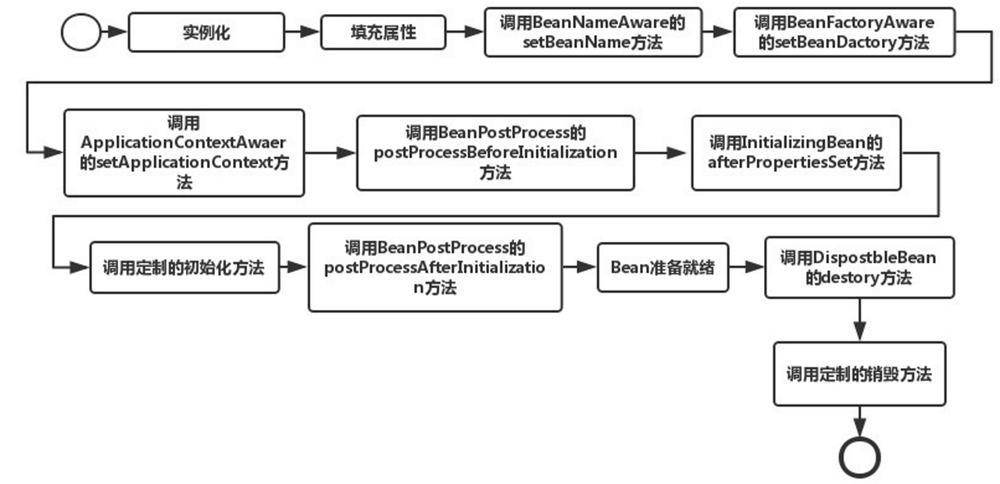

# 1、IOC 控制反转和 DI 依赖注入是什么

控制反转即 IoC (Inversion of Control)，它把传统上由程序代码直接操控的对象的调用权交给容器，通过容器来实现对象组件的装配和管理。所谓的"控制反转"概念就是对组件对象控制权的转移，从程序代码本身转移到了外部容器。

Spring IOC 负责创建对象，管理对象通过依赖注入（DI），装配对象，配置对象，并且管理这些对象的整个生命周期。"查找资源"的逻辑应该从应用组件的代码中抽取出来，交给 IoC 容器负责。容器全权负责组件的装配。

# 2、spring bean 的 scope 有哪些

**单例：** 整个 Spring 容器里只创建 1 个实例，所有地方注入、获取，拿到的都是同一个对象

**prototype（原型）：** bean 会导致在每次对该 bean 请求（将其注入到另一个 bean 中，或者以程序的方式调用容器的 getBean() 方法）时都会创建一个新的 bean 实例

其他必须是 Web 环境（Spring MVC、Spring Boot Web）才生效：

- **request：** 每次 HTTP 请求创建一个 Bean，同一个请求内共享，请求结束销毁
- **session：** 每个用户会话（Session）一个 Bean，同一个用户多次请求共用，会话过期销毁
- **application：** 整个 Web 应用（ServletContext）一个 Bean，类似 singleton，但作用域局限在当前 Web 应用
- **websocket：** 每个 WebSocket 连接一个 Bean

# 3、介绍下 Bean 生命周期

1. 加载 Bean 定义
2. 【实例化】构造方法
3. 【属性填充】@Autowired
4. Aware 感知
5. 前置处理器执行 BeanPostProcessor 的前置处理 postProcessBeforeInitialization
6. 【初始化】@PostConstruct
7. 后置处理器（生成代理 AOP 就在这里）执行 BeanPostProcessor 的后置处理 postProcessAfterInitialization
8. 使用中
9. 【销毁】@PreDestroy



# 4、Spring 是怎么解决循环依赖的？

只能解决：**单例 + setter 注入（字段注入）的循环依赖**。**多例（prototype）循环依赖 → 直接报错**

核心原理：三级缓存

Spring 不是等 Bean 完全建好才给别人用，而是先把"半成品自己"曝光出去，让对方先用着。这就是**提前曝光机制。**

**一级缓存：singletonObjects**

- 存放完全初始化好的单例 Bean
- 能用、正常、有代理的成品 Bean

**二级缓存：earlySingletonObjects**

- 存放实例化了，但还没填充属性、没初始化的原始 Bean
- 叫：早期半成品 Bean

**三级缓存：singletonFactories**

- 存放一个 ObjectFactory lambda 工厂
- 作用：需要时，生成早期 Bean / 早期代理 Bean

**完整流程（A ↔ B 循环依赖）**

**1、创建 A**

- 实例化 A → 得到一个原始对象
- 把 A 放进三级缓存
- 开始填充属性 → 发现需要 B

**2、去创建 B**

- 实例化 B → 原始对象
- 把 B 放进三级缓存
- 填充属性 → 发现需要 A

**3、B 回头找 A**

- 先查一级缓存 → 没有
- 查二级缓存 → 没有
- 查三级缓存 → 有 A 的工厂
- 拿到早期 A 对象，注入给 B

**4、B 完成初始化**

- 属性填充完
- 执行初始化
- 放进一级缓存

**5、A 继续填充属性**

- 拿到已经创建好的 B
- A 完成初始化
- 放进一级缓存

# 5、为什么需要三级缓存？两级不行吗？

因为要兼容 AOP 代理。如果没有 AOP：二级缓存就够了，直接存原始对象

**有 AOP 时：**

- 三级缓存存的是工厂 lambda
- 用到时才生成早期代理对象
- 避免一开始就创建代理，导致后续流程混乱

# 6、Spring 事务是什么？原理？

Spring 事务是 Spring 提供的一套数据库事务管理方案，保证一组数据库操作 要么全部成功，要么全部失败，解决业务中数据一致性问问题（转账、下单、扣库存等）

Spring 事务底层基于 AOP + 动态代理实现，支持：

- 本地事务（单数据源）
- 分布式事务（需额外集成，如 Seata）

**原理：** 底层使用数据库的事务机制，只是事务的提交、回滚等操作由 spring 管理。通过 AOP 和动态代理实现。Spring 开启事务管理器后，事务管理器会动态代理数据源，在 @Transactional 的方法执行 DAO 操作时，通过代理数据源获取事务 Connection，方法执行时 spring 自动开启、提交或者回滚事务

# 7、编程式事务 vs 声明式事务（核心区别）

**编程式事务：** 通过代码手动写开启、提交、回滚，像写 JDBC 事务一样。

- 优点：粒度极细，可以控制到代码行级别
- 缺点：代码冗余、侵入业务逻辑

**声明式事务：** 只需要加一个注解 @Transactional，Spring 自动管理事务。

- 优点：无侵入、方法级

# 8、事务传播机制

传播机制 = 多个带事务的方法互相调用时，事务如何传递、合并、新建。有 7 种，常用 REQUIRED 和 REQUIRES_NEW、NESTED。

比如 @Transactional 方法 A，中有 dao 操作，同时调用 @Transactional B，B 中也有 dao 操作：

**REQUIRED：** 默认，有事务就加入，没有就新建。要么一起成功，要么一起失败。

- 如果 A 没有 @Transactional 注解，B 会新建一个事务，回滚时，只回滚 B。原因是：A 没有事务，是普通 SQL，B 有事务拿到单独 Connection，关闭 autoCommit
- 如果 A 有 @Transactional 注解，B 没有。回滚时一起回滚。原因：只要进入外层事务上下文，里面所有数据库操作，不管有没有加注解。都属于同一个数据库连接、同一个事务。A 一进来，就开启了一个全局事务，B 被 A 调用，运行在 A 的同一个事务里

**REQUIRES_NEW:** 每次都新建一个独立事务，新事务与旧事务完全隔离，互不影响。内部调用的无注解普通方法，一律并入当前事务

**NESTED 嵌套事务:** 嵌套在当前事务内的子事务，内部回滚 → 不影响外部；外部回滚 → 内部回滚。适合：子业务失败不影响主流程

**SUPPORTS：** 有事务就用，没有就不用

**MANDATORY：** 必须在已有事务内运行，否则直接抛异常。防止有人错误地在非事务环境调用关键写操作，导致数据不一致。MANDATORY 只做一件事：检查有没有事务，有就用，没有就直接抛异常。而不是自己开启事务。需要外部调用该方法时，开启事务

**NOT_SUPPORTED：** 如果当前有事务，直接抛异常。绝不允许有事务

**NEVER：** 绝不允许有事务，如果当前有事务，直接抛异常

| 传播行为 | 没有事务时 | 有事务时 |
| --- | --- | --- |
| REQUIRED（默认） | 自己新开一个事务 | 加入当前事务 |
| MANDATORY | 直接抛异常！ | 加入当前事务 |

**MANDATORY ：**

<div class="ace-line ace-line old-record-id-RZ7QdPmEloKG3lxBnaVcq9ydnjd">假设你有一个**超级危险的底层方法**：

</div>

```Java
// 扣钱！核心中的核心，绝对不能乱调用
public void deductMoney(Long userId, int money) {
    userMapper.addMoney(userId, -money);
}
```

<div class="ace-line ace-line old-record-id-PcQrd5KF3onz82x5ES1cYKfinnc">情况 1：正确调用（外层开事务）

</div>

```Java
// 没加 @Transactional
public void test() {
    deductMoney(); // 危险！无事务，执行完直接提交，出错无法回滚
}
```

<div class="ace-line ace-line old-record-id-TBGedjE0roiTcXxQ76vcWDWgnwf">情况 2：错误调用（有人直接在非事务方法里调用）

</div>

```Java
// 没加 @Transactional
public void test() {
    deductMoney(); // 危险！无事务，执行完直接提交，出错无法回滚
}
```

<div class="ace-line ace-line old-record-id-GlpddSrXioMlkSx3uiPcoUwKnDf">deductMoney如果加了@Transactional(propagation = MANDATORY)，**test()执行时会❌ 直接抛异常**！必须要开启事务。

</div>

因为业务对事务边界、一致性、容错性的要求不一样：

- 要强一致 → REQUIRED
- 要独立成功 → REQUIRES_NEW
- 要子步骤可失败，主流程继续 → NESTED

# 9、什么情况会导致 @Transactional 失效

1. **没走代理**（内部调用、非 public、new 对象、final，Spring AOP 用动态代理，继承生成子类。final 方法不能被重写 → 无法增强 → 事务失效）
2. **异常被吞或类型不对**（try-catch 异常没有抛出）
3. **跨线程**（事务绑定当前线程（ThreadLocal）Spring 事务是跟 ThreadLocal 绑定的，线程之间独立，不共享。事务存在当前线程里，新线程拿不到，自然也就不在同一个事务里）
4. **环境没配好**（没开启事务、多数据源、未被 Spring 管理）

# 10、什么是 AOP

一般称为面向切面编程。将那些与业务无关，但却对多个对象产生影响的公共行为和逻辑，抽取并封装为一个可重用的模块，这个模块被命名为"切面"（Aspect），减少系统中的重复代码，降低了模块间的耦合度，同时提高了系统的可维护性。可用于权限认证、日志、事务处理等。

# 11、Spring AOP 中的动态代理方式

Spring AOP 中的动态代理主要有两种方式，JDK 动态代理和 CGLIB 动态代理：

**JDK 动态代理：** 只提供接口的代理，不支持类的代理。核心 InvocationHandler 接口和 Proxy 类，InvocationHandler 通过 invoke() 方法反射来调用目标类中的代码，动态地将横切逻辑和业务编织在一起；接着，Proxy 利用 InvocationHandler 动态创建一个符合某一接口的的实例，生成目标类的代理对象。

**CGLIB 动态代理：** 如果代理类没有实现 InvocationHandler 接口，那么 Spring AOP 会选择使用 CGLIB 来动态代理目标类。CGLIB（Code Generation Library），是一个代码生成的类库，可以在运行时动态的生成指定类的一个子类对象，并覆盖其中特定方法并添加增强代码，从而实现 AOP

# 12、Spring MVC 的主要组件

**前端控制器 DispatcherServlet:** 作用：统一入口，所有请求都先到它，负责接收请求、分发、调用组件、返回结果

**HandlerMapping（处理器映射器）：** 根据 URL 找到对应的 Controller 方法，维护：URL → Method 的映射关系

**Handler（处理器 = Controller）：** 处理业务逻辑，接收参数、调用 Service、返回数据

**HandlerAdapter（处理器适配器）：** 统一调用不同类型的 Handler（Controller），执行目标方法，封装参数、执行、返回 ModelAndView，让 DispatcherServlet 不用关心 Controller 具体长啥样

**ViewResolver（视图解析器）：** 把逻辑视图名解析成真正的视图页面，例如：login → /WEB-INF/views/login.jsp

**View（视图）：** 渲染页面（JSP/Thymeleaf/FreeMarker 等），把 Model 数据填到页面展示

前后端分离项目，一般返回 json 数据，不使用 ModelAndView，使用 @RestController，有 @ResponseBody → Spring 不找页面，用 HttpMessageConverter（一般是 Jackson），自动把对象序列化为 JSON 字符串返回

@RestController = @Controller + @ResponseBody

# 13、Spring MVC 的工作流程

**1、用户发送 HTTP 请求到服务器，被 DispatcherServlet 接收**

- DispatcherServlet 是前端控制器，所有请求统一入口。

**2、DispatcherServlet 调用 HandlerMapping**

- 根据请求 URL、请求方法等，找到对应的 Controller 方法
- 返回一个处理器执行链（包含拦截器、目标方法）

**3、DispatcherServlet 调用 HandlerAdapter**

- HandlerAdapter 是适配器，统一执行各种类型的 Controller
- 完成：参数解析、数据绑定、类型转换、校验等

**4、HandlerAdapter 执行我们写的 Controller 方法**

- 执行业务逻辑，调用 Service、DAO
- 返回结果：
  - 页面 → 返回 ModelAndView
  - JSON → 直接返回对象（搭配 @ResponseBody / @RestController）

**5、如果返回 JSON**

- Spring 使用 HttpMessageConverter（如 Jackson）
- 把 Java 对象自动序列化为 JSON 字符串
- 不走视图解析器，直接准备响应

**6、如果返回页面（老项目）**

- 把 ModelAndView 传给 ViewResolver 视图解析器
- 得到真实视图对象（JSP/Thymeleaf 等）
- 视图渲染，把数据填入页面

**7、DispatcherServlet 将最终结果响应给客户端**

- JSON / HTML 页面返回给浏览器 / 前端

客户端请求 → DispatcherServlet（前端控制器）→ HandlerMapping（URL 找方法）→ HandlerAdapter（执行方法）→ Controller（业务处理）→ 返回对象 → HttpMessageConverter → JSON → DispatcherServlet 响应客户端

# 14、什么是 Spring Boot Stater？

- Spring 和 SpringMVC 的问题在于：需要配置大量的参数，Springboot简化了使用Spring 的难度，简省了繁重的配置，提供了各种启动器，开发者能快速上手

<div class="ace-line ace-line old-record-id-HDrEdjklZoldSDxkeFDcOz2QnLf">- springboot 使用 **“习惯优于配置”**的理念让项目快速运行起来，使用springboot很容易创建一个独立运行的jar，内嵌servlet容器

</div>

Starter 就是一组"依赖包 + 自动配置"的合集，让你不用管版本、不用写配置，一键集成功能。

**本质就是一个 Maven/Gradle 依赖包：**

1. 帮你引入一堆相关依赖，不用你一个个找 jar、不用你管版本冲突。
2. 提供自动配置（AutoConfiguration），只要引入 starter，Spring Boot 就会自动配置 Bean：几乎不用写 XML、不用写 @Bean 手动配置。

常见 Starter：

- spring-boot-starter-web → Web 开发（SpringMVC）
- spring-boot-starter-test → 测试
- spring-boot-starter-jdbc → JDBC 事务
- spring-boot-starter-data-redis → Redis

# 15、Spring Boot 的核心注解是哪个？

启动类上面的注解是 @SpringBootApplication，它也是 Spring Boot 的核心注解，主要组合包含了以下 3 个注解：

**@SpringBootConfiguration：** 组合了 @Configuration 注解，实现配置文件的功能。

**@EnableAutoConfiguration：** 打开自动配置的功能，也可以关闭某个自动配置的选项，如关闭数据源：@SpringBootApplication(exclude = { DataSourceAutoConfiguration.class })

**@ComponentScan：** Spring 组件扫描

自动配置 = 约定 + 条件判断 + SPI 机制加载配置类

# 16、EnableAutoConfiguration 做了什么？

去所有 jar 包中读取：META-INF/spring/org.springframework.boot.autoconfigure.AutoConfiguration.imports 文件
（老版本是 META-INF/spring.factories 文件）

这个文件里是要自动配置的类，就是 SPI 机制（服务发现），@Conditional：控制配置是否生效

# 17、Spring Boot 的启动流程

 1. 从 META-INF/spring.factories / imports 加载 ApplicationContextInitializer、ApplicationListener
 2. 推断 Web 应用类型（Servlet / Reactive）
 3. 获取并启动 SpringApplicationRunListeners 发布 ApplicationStartingEvent 启动事件
 4. 加载配置当前 SpringBoot 应用将要使用的 Environment
 5. 完成之后，发布 ApplicationEnvironmentPreparedEvent 消息
 6. 创建 Spring 应用上下文（ApplicationContext）
 7. 核心：refreshContext() 刷新容器，这一步就是传统 Spring 启动的全过程，扫描 Bean、执行 BeanFactoryPostProcessor、注册 BeanPostProcessor 等 bean 创建阶段
 8. 启动 Web 服务器（Tomcat / Jetty / Undertow），内嵌服务器启动、注册 DispatcherServlet、端口监听
 9. 发布启动完成事件
10. 项目启动完成，对外提供服务

Spring Boot 启动 = 准备环境 + 构建 Spring 容器 + 自动配置 + 启动 Tomcat

# 18、如何实现一个 Starter

1. 新建 Maven 项目（starter 模块）引入 spring-boot-autoconfigure
2. 写业务 Bean（要被自动配置的类）
3. 写属性配置类（对应 application.yml）@ConfigurationProperties，用来用户在 yaml 中配置
4. 写自动配置类（核心），核心是 @configuration
5. 创建 SPI 文件（让 Spring 找到你的配置类），imports 文件
6. 推送到 maven 仓

# 19、Spring ApplicationContext 是什么？

ApplicationContext 就是 Spring 的核心容器，也叫"应用上下文"。Spring 工厂的总管，所有 Bean 的管理者。平时说的"Spring 容器"，指的就是它。

1. **管理所有 Bean**
   - 负责 Bean 的创建、依赖注入、初始化、销毁
2. **加载和维护环境配置**
   - 读取 application.yml/properties
   - 读取系统环境变量、命令行参数
   - 提供 Environment 对象获取配置
3. **发布和监听事件**
   - Spring 事件驱动模型的核心
   - 如：容器启动事件、关闭事件、自定义事件
4. **支持国际化（i18n）**
   - 统一管理多语言消息
   - getMessage(...) 获取不同语言文本
5. **访问资源文件**
   - 读取文件、classpath 资源

ApplicationContext = Spring 容器本体负责：装 Bean、管 Bean、读配置、发事件、启动 Web 服务。整个 Spring 的运行，都基于它。

# 20、ApplicationContext 和 BeanFactory 的关系

**BeanFactory：** Spring 最顶层容器接口，只提供基础 Bean 管理

**ApplicationContext：** 继承自 BeanFactory，功能更强

- 支持 AOP
- 支持事件
- 支持国际化
- 支持环境配置
- 容器启动时就初始化所有单例 Bean

平时开发全用 ApplicationContext，几乎不用原始 BeanFactory。

