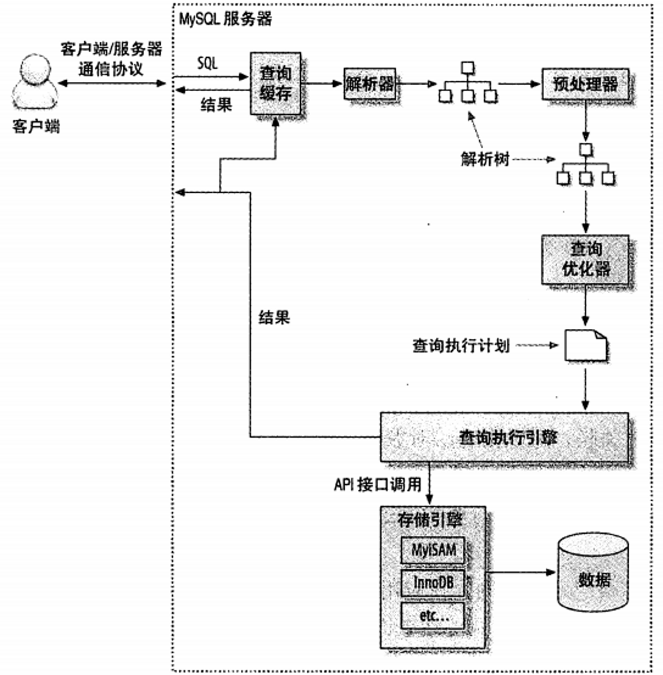
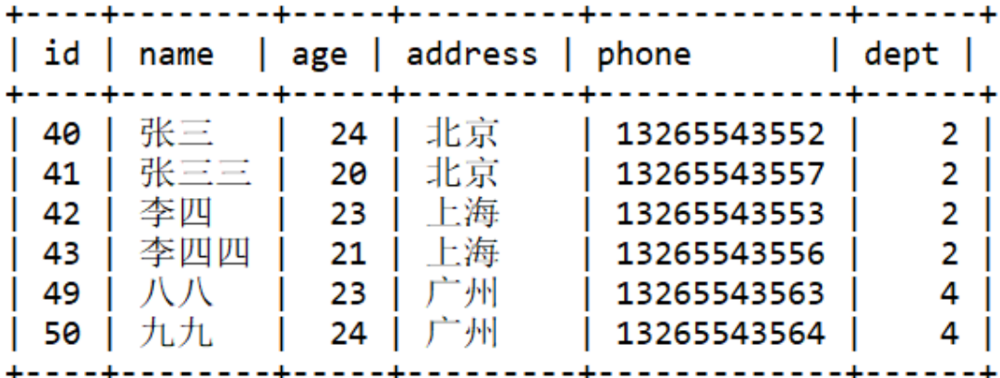
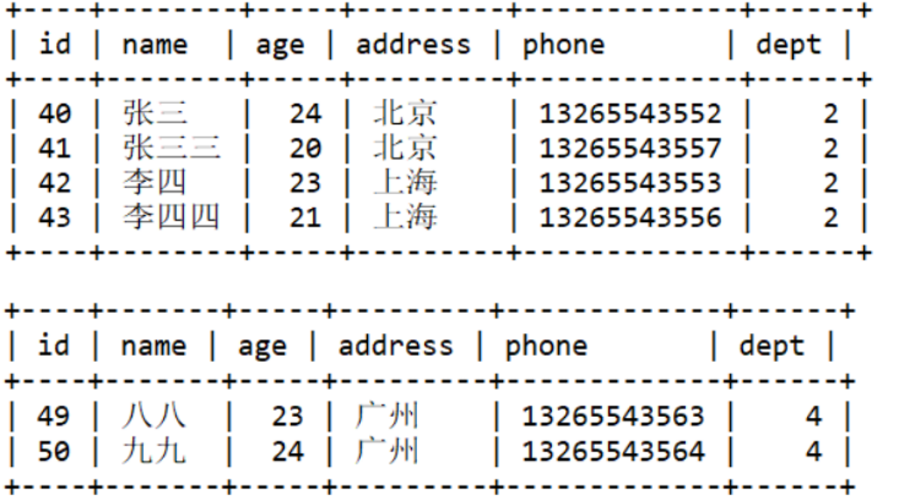
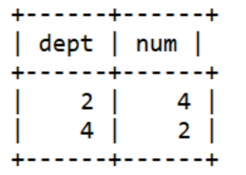
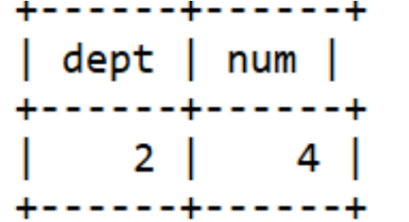
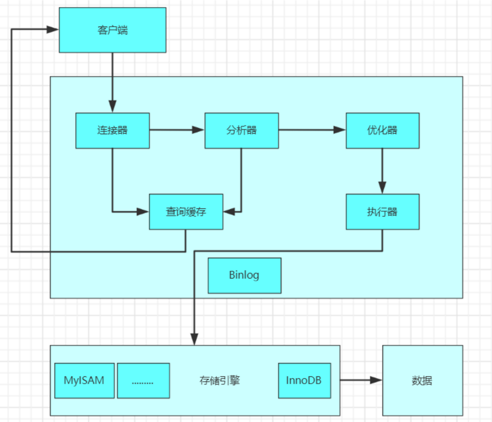
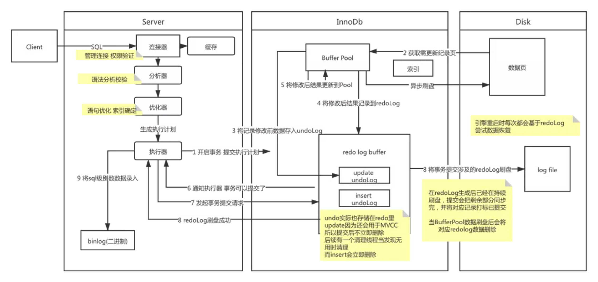
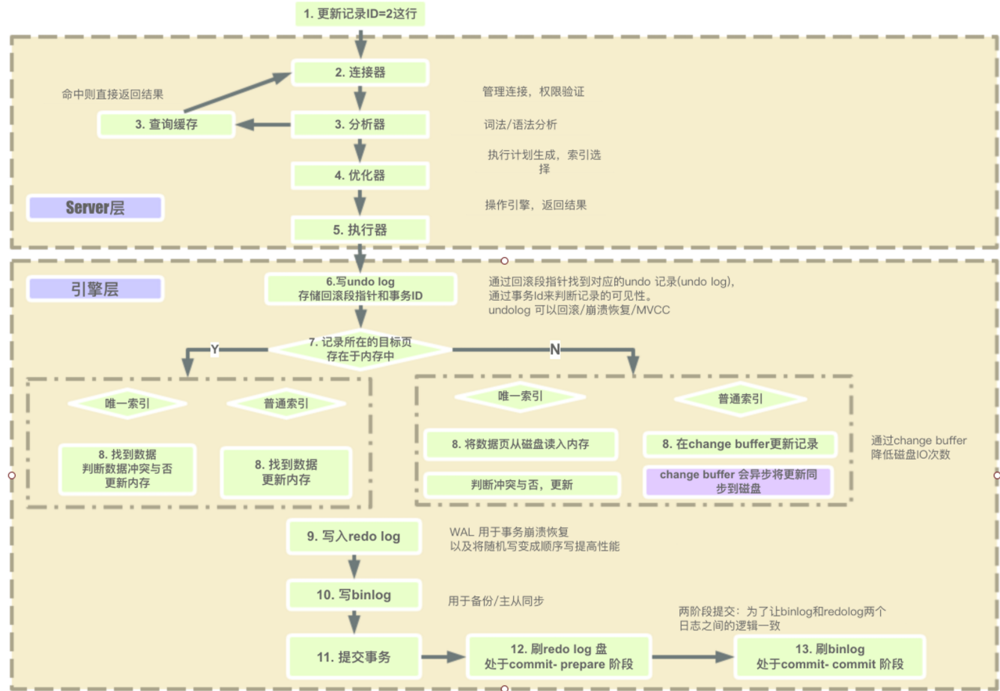

# 1. MySQL发送请求时，mysql到底做了什么

1、客户端发送查询给MySQL服务器，
2、服务器检查缓存，如果命中，则立刻返回存储在缓存中的结果。否则进行下一步
3、服务器解析SQL、预处理，再由优化器生成对应的执行计划
4、MySQL根据执行计划调用存储引擎的api来执行查询
5、结果返回给客户端

# 2. 详细介绍下每步执行的内容

执行连接器
开始执行这条sql时，会检查该语句是否有权限，若是没有权限就直接返回错误信息，有权限会进行下
一步，校验权限的这一步是在图一的连接器进行的，对连接用户权限的校验。

执行检索内存
相连建立之后，履行查询语句的时候，会先行检索内存，Mysql会先行冗余这个sql与否履行过，以此
Key-Value 的形式平缓适用内存中，Key是 检索预定 ，Value是 结果集 。
假如内存key遭击中，便会间接回到给客户端，假如没命中，便会履行后续的操作，完工之后亦会将结
果内存上去，当下一次进行查询的时候也是如此的循环操作。

执行分析器
分析器主要有两步：（1）词法分析（2）语法分析
	词法分析主要执行 提炼关键性字 ，比如select， 提交检索的表 ， 提交字段名 ， 提交检索条件 。
	语法分析主要执行辨别你 输出的sql与否准确 ，是否 合乎mysql的语法 。

SELECT dept,COUNT(phone) AS num FROM User WHERE age< 25 GROUP BY dept HAVING num
>= 3 ORDER BY num DESC,dept ASC LIMIT 0,2;

当Mysql没有命中内存的时候，接着执行的是 FROM student 负责把数据库的表文件加载到内存中去，
WHERE age< 60 ，会把所示表中的数据进行过滤，取出符合条件的记录行，生成一张临时表，
GROUP BY dept 会把上图的临时表分成若干临时表
查询的结果只有部门2和部门3才有符合条件的值，生成如上两图的临时表。接着执行 SELECT后面的字
段 ，SELECT后面可以是 表字段 也可以是 聚合函数 。

这里SELECT的情况与是否存在 GROUP BY 有关，若是不存在Mysql直接按照上图内存中整列读取。若是
存在分别SELECT临时表的数据。

最后生成的临时表如下图所示：
紧接着执行 HAVING num>2 过滤员工数小于等于2的部门，对于 WHERE 和 HAVING 都是进行过滤，那么
这两者有什么不同呢？

第一点是WHERE后面只能对表字段进行过滤，不能使用聚合函数，而HAVING可以过滤表字段也可以使
用聚合函数进行过滤。

第二点是WHERE是对执行from USer操作后，加载表数据到内存后，WHERE是对 原生表的字段 进行过
滤，而HAVING是对 SELECT后的字段进行过滤 ，也就是WHERE 不能使用别名进行过滤 。
因为执行WHERE的时候，还没有SELECT，还没有给字段赋予别名。接着生成的临时表如下图所示：
最后在执行 ORDER BY后面的排序 以及 limit0,2 取得前两个数据，因为这里数据比较少，没有体现出
来。最后生成得结果也是如上图所示。接着判断这个sql语句 是否有语法错误 ， 关键性词与否准确 等等。

执行优化器
查询优化器会将解析树转化成执行计划。一条查询可以有多种执行方法，最后都是返回相同结果。优化
器的作用就是找到这其中 最好的执行计划 。

生成执行计划的过程会消耗较多的时间，特别是存在许多可选的执行计划时。如果在一条SQL语句执行
的过程中将该语句对应的最终执行计划进行缓存。

当 相似的语句 再次被输入服务器时，就可以直接 使用已缓存的执行计划 ，从而跳过SQL语句生成执行计划
的整个过程，进而可以提高语句的执行速度。

MySQL使用基于成本的查询优化器。它会尝试预测一个查询使用某种执行计划时的成本，并选择其中
成本最少的一个。

执行执行器
由优化器生成得执行计划，交由执行器进行执行，执行器调用存储引擎得接口，存储引擎获取数据并返
回，结束整个查询得过程。

这里之讲解了select的过程，对于update这些修改数据或者删除数据的操作，会涉及到事务，会使用两
个日志模块，redo log和binlog日志。

#  3. 介绍下更新数据的过程

1.连接验证及解析
客户端与MySQL Server建立连接，发送语句给MySQL Server，接收到后如果是查询语句会先去查询缓存中看，有的话就直接返回了，（新版本的MySQL已经废除了查询缓存，命中率太低了），如果是缓存没有或者是非查询语句，会创建一个解析树，然后进行优化，（解析器知道语句是要执行什么，会评估使用各种索引的代价，然后去使用索引，以及调节表的连接顺序）然后调用innodb引擎的接口来执行语句。

2.写undo log
innodb 引擎首先开启事务，获得一个事务ID(是一直递增的)，根据执行的语句生成一个反向的语句，(如果是INSERT会生成一条DELETE语句，如果UPDATE语句就会生成一个UPDATE成旧数据的语句)，用于提交失败后回滚，将这条反向语句写入undo log，得到回滚指针，并且更新这个数据行的回滚指针和事务id。（事务提交后，Undo log并不能立马被删除，而是放入待清理的链表，由purge 线程判断是否有其他事务在使用undo 段中表的上一个事务之前的版本信息，决定是否可以清理undo log的日志空间，简单的说就是看之前的事务是否提交成功，这个事务及之前的事务都提交成功了，这部分undo log才能删除。）

3.从索引中查找数据
根据索引去B+树中找到这一行数据（如果是普通索引，查到不符合条件的索引，会把所有数据查找出来，唯一性索引查到第一个数据就可以了）

4.更新数据
判断数据页是否在内存中？
	4.1数据页在内存中
	索引是普通索引还是唯一性索引？
	4.1.1普通索引
	直接更新内存中的数据页
	4.1.2唯一性索引
	判断更新后是否会数据冲突(不能破坏索引的唯一性)，不会的话就更新内存中的数据页。
	4.2 数据页不在内存中
	索引是普通索引还是唯一性索引？
	4.2.1普通索引
	将对数据页的更新操作记录到change buffer，暂时不更新到磁盘。change buffer会在空闲时异步更新到磁盘。
	4.2.2 唯一性索引
	因为需要保证更新后的唯一性，所以不能延迟更新，必须把数据页从磁盘加载到内存，然后判断更新后是否会数据冲突，不会的话就更新数据页。
5.写redo log（prepare状态）
将对数据页的更改写入到redo log，此时redo log中这条事务的状态为prepare状态。

6.写bin log（同时将redo log设置为commit状态）
通知MySQL server已经更新操作写入到redo log 了，随时可以提交，将执行的SQL写入到bin log日志，将redo log 中这条事务的状态改成commit状态，事务提交成功。

