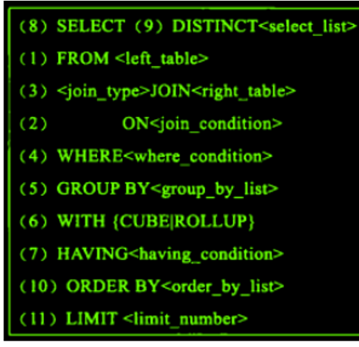
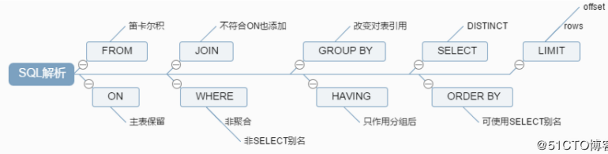

# 1. 查询语句的执行顺序是什么？

**核心回答：** MySQL 查询语句共分为 **11 个步骤**，依次为 **FROM → ON → JOIN → WHERE → GROUP BY → CUBE/ROLLUP → HAVING → SELECT → DISTINCT → ORDER BY → LIMIT**，其中每一个操作都会产生一张虚拟的表作为中间处理结果。

**原理分析：**

1. **FROM**：对 FROM 的左边的表和右边的表计算笛卡尔积，产生虚拟表 VT1。
2. **ON**：对虚表 VT1 进行 ON 筛选，只有符合 `<join-condition>` 的行才会被记录在虚表 VT2 中。
3. **JOIN**：如果指定了 OUTER JOIN（如 LEFT JOIN、RIGHT JOIN），那么保留表中未匹配的行会作为外部行添加到虚拟表 VT2 中，产生虚拟表 VT3。如果 FROM 子句包含两个以上的表，会对上一个 JOIN 连接产生的结果 VT3 和下一个表重复执行步骤 1~3，一直到处理完所有表为止。
4. **WHERE**：对虚拟表 VT3 进行 WHERE 条件过滤，只有符合 `<where-condition>` 的记录才会被插入到虚拟表 VT4 中。
5. **GROUP BY**：根据 GROUP BY 子句中的列，对 VT4 中的记录进行分组操作，产生 VT5。
6. **CUBE | ROLLUP**：对表 VT5 进行 CUBE 或者 ROLLUP 操作，产生表 VT6。
7. **HAVING**：对虚拟表 VT6 应用 HAVING 过滤，只有符合 `<having-condition>` 的记录才会被插入到虚拟表 VT7 中。
8. **SELECT**：执行 SELECT 操作，选择指定的列，插入到虚拟表 VT8 中。
9. **DISTINCT**：对 VT8 中的记录进行去重，产生虚拟表 VT9。
10. **ORDER BY**：将虚拟表 VT9 中的记录按照 `<order_by_list>` 进行排序操作，产生虚拟表 VT10。
11. **LIMIT**：取出指定行的记录，产生虚拟表 VT11，并将结果返回。

**延展思考：**
理解 SQL 执行顺序对性能优化至关重要。在实际开发中，如果某个步骤产生的数据量巨大，前置的 WHERE 过滤（步骤4）比后续的 HAVING（步骤7）更重要，因为 WHERE 执行更早，可以更早减少数据量；而 SELECT 是在 HAVING 之后才执行，所以 HAVING 可以使用聚合函数和别名，这是它与 WHERE 的核心区别。

如果没有在语句中指定某一个子句，那么将会跳过相应的步骤。

# 2. 更新/删除语句的执行顺序是什么？

**核心回答：** UPDATE 和 DELETE 语句的执行逻辑和 SELECT 是一样的，只是最后一步不是查询返回结果，而是执行更新/删除操作。

**原理分析：**

UPDATE/DELETE 语句同样经过 FROM → ON → JOIN → WHERE 等步骤产生虚拟表，但最终不是 SELECT 返回结果，而是：
- UPDATE：根据 WHERE 条件找到目标行，执行更新操作。
- DELETE：根据 WHERE 条件找到目标行，执行删除操作。

**延展思考：**
由于 UPDATE/DELETE 同样遵循 SELECT 的执行顺序，在执行更新/删除前，务必确认 WHERE 条件精准，避免误更新/删除大量数据。建议先使用 SELECT 验证 WHERE 条件的命中结果，确认无误后再执行 UPDATE 或 DELETE。