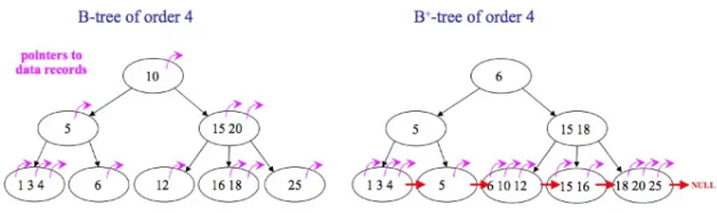
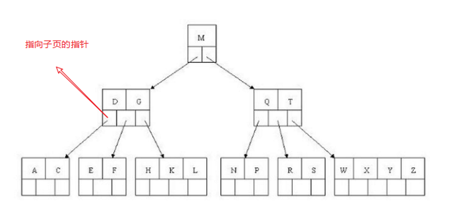
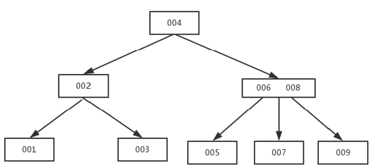
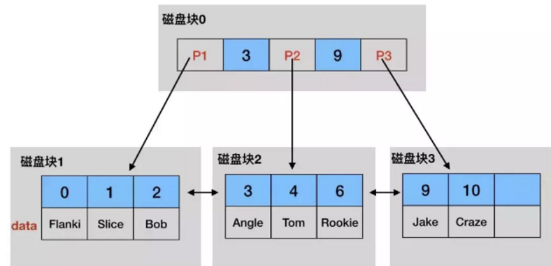
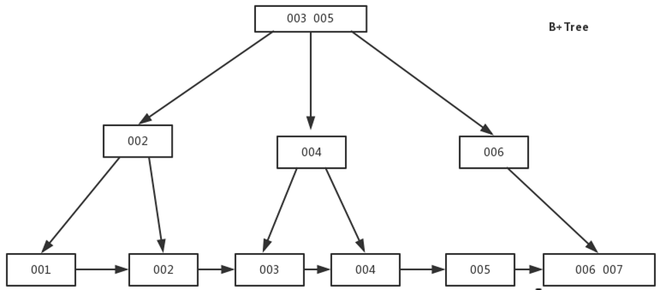
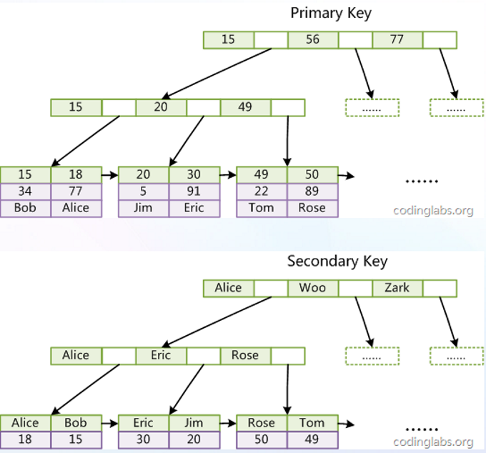
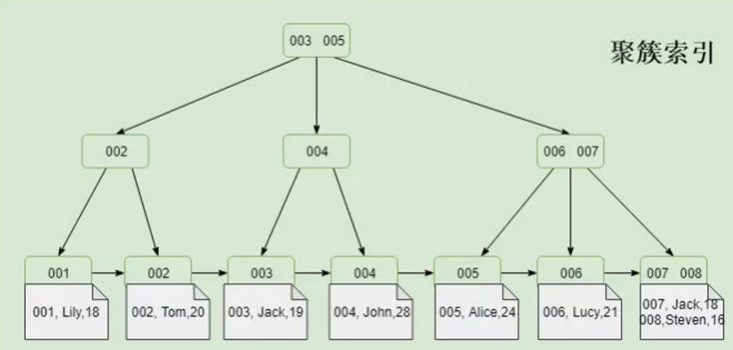
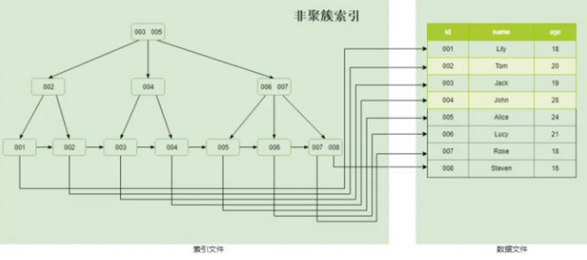

# 1. MySQL 索引是什么？它有什么作用？

**核心回答：** **索引是存储引擎用于快速定位数据的数据结构**，本质是一种**以空间换时间**的优化手段，通过建立冗余数据（索引数据）来加速查询。

**原理分析：**

1. **物理存储结构**：索引在磁盘上以 B+树形式组织，每个节点包含索引键值和指向数据行的指针（聚簇索引直接包含数据，非聚簇索引包含主键值）。
2. **查找效率**：不使用索引时需要全表扫描（O(n)），使用索引可降至 O(log₂n)（以 B+树高度约 3-4 层为例，亿级数据仅需 3-4 次 IO）。
3. **索引代价**：索引需要占用额外磁盘空间（通常为数据量的 10%-30%），且 INSERT/UPDATE/DELETE 时需要同步维护索引结构，增加写操作开销。

**延展思考：**

从工程实践角度看，索引并非越多越好。**过多的索引会增加存储成本和维护成本**，尤其是高频写场景（OLTP），每条记录的变更都需要更新所有相关索引，这是典型的用查询性能换取写入性能的权衡（Trade-off）。

# 2. MySQL 索引有哪些类型？

**核心回答：** MySQL 索引按不同维度可分为**数据结构类型、存储方式、列数、特性**四类。

**原理分析：**

1. **按数据结构**：
   - **B+树索引**：默认索引类型，MySQL 最常用的索引结构，兼顾范围查询和排序。
   - **哈希索引**：Memory 引擎默认使用，InnoDB 支持自适应哈希索引，仅支持等值查询，不支持范围和排序。
   - **R-tree 索引**：空间索引，用于地理坐标等几何数据查询。
2. **按存储方式**：
   - **聚簇索引**：叶子节点存储完整数据行，一个表只能有一个。
   - **非聚簇索引/二级索引**：叶子节点存储主键值，可有多个。
3. **按列数**：
   - **单列索引**：基于单个字段建立。
   - **联合索引/复合索引**：基于多个字段建立，遵循最左前缀原则。
4. **按特性**：（三者 **底层全都是 B+ 树** ）
   - **主键索引**：唯一且非空，每个表只能有一个。
   - **唯一索引**：值唯一，可为空。
   - **普通索引**：无唯一性限制。

**延展思考：**

实际开发中，B+树索引覆盖 99% 场景；哈希索引仅适用于等值查询且数据量较小的表（如配置表）；空间索引适用于 GIS 应用。联合索引的列顺序选择很关键，建议将**区分度高的列放在前面**，可以提高索引命中率。

# 3. 索引是怎么提升性能的？

把无序全表扫描，变成**B + 树快速二分查找**，大幅减少磁盘 IO。

**极简原理**

- 无索引逐行遍历整张表，数据越多越慢，时间复杂度 O(n)
- 有索引B + 树有序分层查找，层层缩小范围，时间复杂度 O(logn)

**3 个提速关键点**

- 有序排序：索引列提前排序，不用挨个比对
- 磁盘 IO 变少：树层高很小，只需少量磁盘页读取
- 覆盖索引：索引里直接拿到数据，不用回表查表行

# 3. B+树和B树的区别是什么？

**核心回答：**

**B+树相比B树，核心区别是数据只存在叶子节点、叶子节点用链表串联、非叶子节点只存索引键**，InnoDB 选用B+树而非B树，核心是适配磁盘存储、减少IO次数、优化范围查询、提升遍历效率。

**核心区别：**

- B树：
  - 非叶子节点和叶子节点都存数据
  - 节点内元素不重复
  - 叶子节点之间没有链接
- B+树：
  - 仅叶子节点存完整数据，非叶子只存索引键
  - **节点内元素会在叶子节点重复出现**
  - 所有叶子节点通过双向链表有序串联，区间查询、分页、排序只需顺着链表遍历即可，无需回溯上层节点

**底层原理：**

1. **数据存储位置不同：** B树节点塞了数据指针，一页装的键少，同等树高下B+树非叶子节点能存放更多索引条目，树高更低，查询磁盘IO更少
2. **查询效率更稳定：** B树查找数据可能在非叶子命中，查询次数不固定；B+树所有数据都在叶子节点，每次查询IO次数一致，性能平稳可控
3. **范围查询极强** ：B+树叶子链表串联，范围查询顺着链表遍历即可，B树范围查询需要来回跳转节点，效率差
4. **磁盘读写利用率更高** ：B+树非叶子节点只存主键索引，体积更小，一页磁盘能加载更多索引，缓存命中率更高
5. **全表遍历更高效** ：B树全表扫描需要整棵树遍历，B+树直接遍历叶子链表即可完成全量查询

**查找过程对比：**

- B树：在倒数第二层的节点中找到5后，可以立刻拿到指针获取行数据，查找停止
- B+树：在倒数第二层的节点中找到5后，由于中间节点不存有数据的指针信息，则继续往下查找，在叶子节点中找到5，拿到指针获取行数据，查找停止

**一句话总结：**

数据库索引选B+树，一是降低树高减少磁盘IO，二是叶子链表大幅优化范围查询，三是索引结构更贴合磁盘分页存储特性，更适配海量数据检索场景。

**B树：**

**B+树** 下图中的扇出为3，每个节点可以存储2条记录。扇出就是指向子节点的指针，代表一个非叶子节点能分出多少个子节点

# 4. 为什么使用 B+树而不是 B 树？

**核心回答：** **B+树更适合作为数据库索引的核心数据结构**，它在磁盘 IO 次数、查询稳定性、范围查询效率三个维度均优于 B 树。

**原理分析：**

1. **磁盘 IO 效率**：B 树每个节点同时存储键和数据，导致单个节点能容纳的键值数量较少，树高相对较高；
   而 B+树非叶子节点仅存储键（不存储数据），每个节点可容纳更多键，树高更矮，**减少了磁盘 IO 次数**。
2. **查询稳定性**：B 树查询效率取决于数据所在深度（根到叶路径长度可能不同），
   而 B+树所有数据均位于叶子节点，**查询路径长度固定**，查询时间更稳定。
3. **范围查询优势**：B+树叶子节点通过双向链表串连，**范围查询只需定位起点后顺序遍历链表**，无需回溯；
   而 B 树需要遍历多个分支，效率较低。

**延展思考：**

在生产环境中，B+树的 **"单点查询稳定"** 特性对高并发系统尤为重要。假设一次查询耗时 10ms，若查询路径不稳定（5-20ms 波动），会导致请求响应时间抖动，影响 SLA；而 B+树的稳定路径可以保证 P99 延迟的可预测性，这对字节跳动等公司的微服务架构至关重要。

# 5. 为什么B树的树高相对较高？

**核心回答：**

B树每个节点同时存储键值和数据指针，单个节点能容纳的键值数量少，**同等数据量下只能通过增加层数来存放，导致树高更高**。

**底层原理：**

1. 数据库按页（默认16KB）从磁盘读取数据，每个节点对应一页
2. B树节点中数据指针占用大量空间，一页能存放的索引键数量大幅减少
3. 假设一个索引键+数据指针占100字节，16KB页只能存约160个键；而B+树非叶子节点只存索引键（假设20字节），一页可存约800个键
4. 键数量少→每层分支少→要覆盖相同数据量只能增加层数→树高更高

**一句话总结：**

B树节点塞了数据指针，一页装的键少，分支少，只能往上堆层，树就高了。

# 6. B+树是怎么存储的？

**核心回答：**

B+树按**页（Page）**为单位在磁盘上存储，每个节点对应一页，非叶子节点只存索引键，叶子节点存完整数据行，叶子之间用双向链表串联。

InnoDB 最小磁盘读写单位 = 数据页，默认固定 16KB，MySQL 不会单行读写数据，**一次只读写一整页**。

**存放内容**

- 叶子页：真实表数据、索引行
- 非叶子页：**索引键 **+ 子页地址（B + 树分支，**子节点指针**），每个节点对应一页，节点存储的是索引的值，**非叶子节点的键值，理解成「子节点的区间上限」**， 是「区间分界点」

**底层原理：**

1. InnoDB **每页默认16KB** ， **B+树的每个节点就是一页**
2. 非叶子节点（索引页）：**只存索引键值**+**子节点页号指针**，
   不存数据，子节点指针指向的是子节点，**子节点的值都是在当前指针所在区间值范围之间**，**指针越小、索引键越短，一个节点能存的键值对就越多 → 扇出越大 → 树越矮 → 查询越快。**
3. 叶子节点（数据页）：聚簇索引存完整数据行，二级索引存索引列+主键值
4. 同一层的叶子节点通过双向链表串联，支持范围查询和顺序扫描
5. 根节点常驻内存，查询时只需对非根节点做磁盘IO
6. 三层B+树（假设扇出1000） **可索引约10亿条记录** ，仅需3次IO

**B + 树层级：根层 (1 层)→中间层 (2 层)→叶子层 (3 层)扇出 = 单个节点最大子节点数**

- 1 层根节点：最多分出 1000 个子节点
- 2 层中间节点：总计 \(1000 \times 1000 = 1000000\) 个节点
- 3 层叶子节点：总计 \(1000 \times 1000 \times 1000 = \boldsymbol{10亿}\) 条数据

公式：总容量 = 扇出 ^ 树层数

**为什么要这么设计？**

- 非叶子节点不存数据：能让节点变得很小，单个节点能存更多的键值，扇出更大，树的高度更低，磁盘 IO 更少 
- 叶子节点存有序数据：聚簇索引能直接拿到数据；二级索引能快速定位主键，再通过主键索引拿数据，兼顾了查找效率和数据一致性

**一句话总结：**

B+树以页为存储单位，非叶子只存键，叶子存数据，叶子链表串联，三层可索引10亿数据。

下图中 3和9是区间分界点，小于3 的都在p1这个指针下的子节点，>=3和<9的数据在p2这个指针对应的子节点，>=9的数据在p3这个指针对应的子节点

B + 树的非叶子节点（根节点、中间节点）里的数值，**本身不代表真实数据，而是用来划分区间的 “路标”。** **非叶子节点的键值，理解成「子节点的区间上限」**

看主键索引这部分：

根节点有：15、56、77  .  根节点的 15：表示「**所有小于等于 15 的数据，都在第一个子节点里**」，表示的是15<= 和< 56的数据都在这个节点

第二层节点有：15、20、49   

叶子节点的键值：15、18、20、30、49、50…

# 6. 树什么时候分支（页分裂）？

MySQL InnoDB 的 B + 树 “分支”（页分裂）核心触发条件：数据页（16KB）空间满了，放不下新记录，才会分裂。下面把条件、时机、过程讲清楚。

**一、分裂的本质**

InnoDB 用 16KB 的页（Page） 作为 B + 树节点：

- 叶子页：存完整行数据（聚簇索引）或索引列 + 主键（二级索引）
- 内部页（非叶子）：只存索引键 + 子页指针，不存数据

**分裂 = 页满 → 开新页 → 数据均分 → 父页加索引 → 递归向上**

**二、什么时候分裂（触发场景）**

1\. 插入新记录（最常见）

- 页已达到填充阈值（默认约 93.75%，16KB 用满 15KB 左右）
- 插入后记录数 / 空间超出页容量 → 分裂

2\. 更新导致记录变大

- 比如 VARCHAR 从短字符串更新为长字符串
- 原页剩余空间不够 → 分裂

3\. 无序插入（随机主键 / UUID）

- 自增主键：总是追加到最后一页，极少分裂（顺序写）
- 随机主键 / UUID：中间位置频繁插入，页快速填满且分裂更频繁、碎片多

**三、分裂的具体时机（判定规则）**

1. 叶子页：插入 / 更新后，空间不足（无法分配新记录）
2. 内部页：插入子页指针 + 索引键后，键数量 > 阶数 - 1（InnoDB 阶数由页大小决定，16KB 页通常允许几百个键）
3. 根节点：根页满了也会分裂，此时树高 + 1（B + 树长高仅发生在根分裂）

**四、分裂过程（极简版）**

1. 目标页满，分配新空白页
2. 找中间分裂点，原页留前半，后半移新页
3. 新记录插入原页或新页
4. 新页的最小键 + 页指针插入父页
5. 父页若满，重复 1–4，递归向上
6. 根分裂 → 新根产生，树高 + 1

**五、举例（直观理解）**

假设叶子页最多放 4 行： **[10,20,30,40]**

- **插入 50 → 满了，分裂：**
  - 原页：[10,20]
  - 新页：[30,40,50]
- **父页加键 30 指向新页**
- 父页若满，继续分裂父页

**六、关键结论**

- 不是按 “多少行” 固定分裂，而是按 “页空间是否满”
- 自增主键：分裂极少、性能好
- 随机主键：分裂频繁、碎片多、性能差
- 分裂是 B + 树维持平衡的必要机制，但会带来 I/O 开销

# 7. 什么是扇出？

**核心回答：**

**扇出是指B+树每个节点能容纳的子节点数量**，扇出越大，树越矮，查询IO越少。

**底层原理：**

1. 扇出 = 一个节点中索引键的数量，每个键对应一个子节点指针
2. 扇出取决于节点大小（一页16KB）和每个索引条目的大小
3. 扇出越大，每层能索引的数据量越多，整棵树的层数越少
4. 指针少（扇出小）的情况下要保存大量数据，只能增加树的高度，导致IO操作变多，查询性能变低

**一句话总结：**

扇出就是每个节点的分支数，扇出越大树越矮IO越少，扇出越小树越高查询越慢。

# 8. 为什么用B+树而不用跳表？

**核心回答：**

**B+树是多路分治，跳表是二路分治**，同等数据量下B+树层数更少、IO次数更固定，更适合磁盘存储； **跳表更适合内存场景** 。

**核心区别：**

- B+树：
  - 多路分治（log₁₀₀₀ n），底数大，层数少得多
  - 根节点到任何叶子节点的路径长度固定，IO次数稳定
  - 每个叶子节点可存储多条数据，批量读取IO少
- 跳表：
  - 二路分治（log₂ n），查找效率类似AVL、红黑树，适用于内存存储
  - 头节点到目标节点的路径不固定，检索值越大路径越深，磁盘IO次数越多
  - 每个节点只存一条记录，多条记录查询IO比B+树多

**适用场景：**

1. B+树：磁盘存储、数据库索引、数据量大、范围查询
2. 跳表：内存存储、Redis有序集合、等值查询

**实战选型：**

Redis用跳表不用B+树，因为 **跳表指针维护数量更少、占内存更少** ， Redis在内存中检索速度有保障，不需要B+树的磁盘IO优化。MySQL在磁盘上，一 **切以减少IO耗时为目的，必须选B+树。**

**一句话总结：**

磁盘存储选B+树（多路分治、IO少、路径固定），内存存储选跳表（省内存、实现简单）。

# 9. 为什么树的高度越高IO代价越高？

**核心回答：**

**B+树每一层对应一次磁盘IO，树高=最少IO次数**，层越多IO越多，磁盘IO速度远慢于内存，查询性能就越低。

**底层原理：**

1. 查询需要从根节点逐层向下遍历到叶子节点，树高=最少磁盘IO次数，层数越多，读写磁盘次数越多
2. 磁盘机械寻址、读写速度极慢（ms级），每多一层就多一次慢IO，整体查询耗时大幅上升
3. 树层级变多，索引页变分散，内存缓冲区难以缓存全量上层索引，更多请求需要下沉磁盘读取
4. 范围查询、分页查询影响更大，多层遍历叠加批量读取，IO成倍增加

**避坑指南：**

1. 有序自增主键插入均匀，B+树生长平稳，树高增长慢
2. 无序主键（如UUID）频繁页分裂，树结构杂乱，树高涨得更快，IO开销更高

**一句话总结：**

B+树每层一次磁盘IO，数据越多树越高，IO越多，查询越慢；用自增主键能延缓树高增长。

# 10. 为什么不用哈希表？

**核心回答：** **哈希表仅支持等值查询，无法满足数据库的范围查询和排序需求**，这是其不适合作为索引核心数据结构的根本原因。

**原理分析：**

1. **等值查询高效**：哈希表通过哈希函数计算键的存储位置，O(1) 时间复杂度即可定位，理论上是最高效的。
2. **范围查询失效**：哈希映射无序，**无法通过哈希索引进行范围查询**（如 `WHERE age > 20`），必须全表扫描。
3. **排序无法支持**：哈希表无法保持键的顺序，**不支持 ORDER BY 排序操作**。
4. **哈希冲突**：哈希碰撞会导致链表或红黑树退化，**极端情况下退化为 O(n)**。

**延展思考：**

哈希索引并非毫无价值。InnoDB 支持自适应哈希索引（Adaptive Hash Index），它会在内存中为热点数据自动构建哈希索引，用于加速等值查询。但这是存储引擎内部的优化，对业务层透明，且仅适用于等值查询场景，不适合作为主索引结构。

# 11. 哈希比树更快，索引为什么要设计成树型？

**核心回答：**

**等值查询哈希确实更快，但数据库大量需求是范围查询、排序、分组**，哈希索引在这些场景退化为O(n)，树型索引凭借有序性仍保持O(logN)。

**底层原理：**

1. 等值查询（如 `WHERE name='Tom'`），哈希O(1)确实比树O(logN)快
2. 范围查询（>、<、BETWEEN）、分组（GROUP BY）、排序（ORDER BY），哈希索引无序，时间复杂度退化为O(n)
3. 树型索引的有序性让这些操作保持O(logN)效率
4. 磁盘预读机制：磁盘读取时会按顺序多读一部分数据（局部性原理：当一个数据被用到时，其附近的数据也通常会马上被使用），B+树相邻数据物理上相近，能充分利用预读；红黑树逻辑上近的节点物理上可能很远，无法利用局部性，IO效率明显比B+树差
5. MySQL按页管理数据（默认16KB），B+树每个节点一页，磁盘预读一页正好加载一个节点；红黑树节点分散，无法利用页预读

**一句话总结：**

数据库需要范围查询和排序，哈希无序只能全扫，树型有序才能高效；加上磁盘预读，B+树最适配。

# 12. 聚簇索引和普通索引的存储结构都是 B+树吗？

**核心回答：** **是的，InnoDB 中聚簇索引和普通索引（二级索引）的存储结构都是 B+树**，区别仅在于叶子节点存储的内容不同。

**原理分析：**

1. **统一的数据结构**：InnoDB 的所有索引本质上都是 B+树结构，包括聚簇索引和普通索引。**B+树的有序性、全局索引覆盖、稳定的查询效率**是索引统一的底层支撑。
2. **叶子节点差异**：
   - **聚簇索引叶子节点**：存储完整的**数据行**（即整表数据按主键顺序物理存储）。
   - **普通索引叶子节点**：仅存储**索引列值 + 主键值**，不存储完整数据行。
3. **非叶子节点一致**：两种索引的非叶子节点都只存储索引键值（不含数据），用于快速定位和路由。

**延展思考：**

从存储引擎设计角度看，**统一的 B+树结构简化了索引维护逻辑**。无论是聚簇索引还是普通索引，都复用同一套 B+树操作（插入、删除、分裂、合并），降低了代码复杂度。但这也意味着普通索引查询时必须"回表"读取完整数据，这是 InnoDB 索引设计的固有特性，无法规避。

**聚簇索引是哪一列**

（1）如果表定义了PK，则PK就是聚集索引；

（2）如果表没有定义PK，则第一个not NULL unique列是聚集索引；

（3）否则，InnoDB会创建一个隐藏的row-id作为聚集索引；

# 13. 什么是聚簇索引？什么是非聚簇索引？

**核心回答：** **聚簇索引的叶子节点存储完整数据行（非叶子节点存储键值）**，数据行的物理存储顺序与索引顺序一致；**非聚簇索引的叶子节点仅存储主键值**，需要通过主键值回表查询完整数据。

**原理分析：**

1. **物理组织方式**：InnoDB 表是索引组织表（Index Organized Table），**表数据本身存储在聚簇索引的叶子节点中**，数据即索引，索引即数据。
2. **非聚簇索引结构**：每个非聚簇索引（二级索引）的叶子节点存储的是主键值，而非完整数据行。查询时若无法覆盖索引，需要**回表**（即先通过非聚簇索引找到主键，再通过主键去聚簇索引查找完整数据）。
3. **主键选择影响**：由于表数据存储在主键索引中，**主键的设计直接影响数据存储顺序和查询性能**。建议使用自增 ID 作为主键，避免使用 UUID 或业务主键。

MyISAM的索引与行记录是分开存储的，叫做非聚集索引（UnClustered Index）。

**其主键索引与普通索引没有本质差异：**

- 有连续聚集的区域单独存储行记录
- 主键索引的叶子节点，存储主键，与对应行记录的指针
- 普通索引的叶子结点，存储索引列，与对应行记录的指针

画外音：MyISAM的表可以没有主键。

主键索引与普通索引是两棵独立的索引B+树，通过索引列查找时，先定位到B+树的叶子节点，再通过指针定位到行记录。

**延展思考：**

从性能角度看，**非聚簇索引的"回表"是性能损耗的主要来源**。一次查询最多可能产生两次索引扫描（先扫非聚簇索引，再扫聚簇索引）。在高频查询场景中，应尽量使用覆盖索引避免回表，或者直接使用主键查询。此外，业务主键（尤其是字符串类型）作为聚簇索引会导致数据插入时频繁页分裂，显著降低插入性能。

# 14. 聚簇索引有什么优缺点？

**核心回答：**

**聚簇索引的核心优势是主键查询和范围查询极快（数据物理连续，IO少），核心劣势是插入性能严重依赖主键顺序、更新主键代价极高、二级索引会变大。**

**优点：**

1. I/O密集型场景性能极高：聚簇索引把同一张表的数据按主键顺序物理存储，范围查询只需读取连续的少数数据页，磁盘IO次数极少；非聚簇索引则可能需要随机读取大量离散数据页
2. 主键查询速度极快：聚簇索引的B+Tree叶子节点直接存储整行数据，主键查询一次索引就能拿到全部数据，无需额外回表
3. 可以把相关数据保存在一起：例如实现电子邮箱时，可以根据用户ID来聚集数据，只需要从磁盘读取少数的数据页就能获取某个用户的全部邮件
4. 数据访问更快：聚簇索引将索引和数据保存在同一个B-Tree中，因此从聚簇索引中获取数据通常比在非聚簇索引中查找要快
5. 使用覆盖索引扫描的查询可以直接使用页节点中的主键值

**缺点：**

1. 内存中优势消失：若数据全部加载到内存，磁盘顺序访问的优势就不存在了，聚簇索引的性能增益几乎为0
2. 插入性能严重依赖主键顺序：
   按自增主键顺序插入，数据按顺序追加到页尾，几乎无页分裂，速度最快；
   乱序主键插入会频繁触发页分裂，性能骤降，插入后建议用OPTIMIZE TABLE整理碎片
3. 更新主键代价极高：更新聚簇索引的主键值时，InnoDB必须把整行数据移动到新的物理位置，同时更新所有二级索引的引用，开销极大
4. 页分裂导致空间浪费与性能下降：当页满时插入数据会触发页分裂，产生半满的碎片页，不仅占用更多磁盘空间，还会导致数据存储不连续，让后续的全表扫描性能变慢
5. 二级索引会变大：InnoDB的二级索引叶子节点存储的是主键值而非物理地址，所以主键越大，二级索引占用的空间也越大，查询时的回表开销也越高
6. 二级索引需要两次索引查找：二级索引保存的是行的主键值，需要根据主键值去聚簇索引中查找行数据，也就是回表

**一句话总结：**

聚簇索引查询快（主键直取、范围连续IO），写入慢（乱序页分裂、更新主键移动整行），主键越短二级索引越小。

# 15. 聚簇索引与非聚簇索引有什么区别？

**核心回答：** **聚簇索引确定了数据的物理存储顺序，叶子节点包含完整数据；非聚簇索引是独立的索引结构，叶子节点仅存储主键值，查询时需要回表。**

**原理分析：**

1. **数据存储位置**：聚簇索引的叶子节点直接存储完整数据行；非聚簇索引的叶子节点仅存储索引键和主键值（若覆盖则存储查询所需的列）。
2. **数量限制**：**每个表只能有一个聚簇索引**（因为数据只能按一种顺序物理存储）；非聚簇索引可以有多个。
3. **查询路径**：使用聚簇索引查询时可直接获取数据，无需回表；使用非聚簇索引时，**若查询列未被索引覆盖则需要回表**。
4. **IO 成本**：聚簇索引的叶子节点包含完整数据，单次 IO 可以获取更多数据；非聚簇索引叶子节点较小，**在内存有限时可以缓存更多索引页**。

**延展思考：**

从存储和内存优化角度看，非聚簇索引叶子节点更小，相同内存下可以缓存更多索引页，这对高频查询的缓存命中率有显著提升。但在 OLAP 场景（分析型查询）中，聚簇索引可以避免回表，**一次 IO 即可获取完整数据行**，查询效率更高。这是典型的场景化选型问题。

# 16. 什么情况需要用索引？什么时候不用？

**核心回答：**

**高频查询字段、连接字段、排序/分组字段需要加索引；表太小、区分度太低、频繁增删改的字段不加索引。**

**适用场景：**

1. `WHERE A=a AND B=b` 这种查询使用（A，B）的组合索引最佳
2. 和其他表做连接的字段需要加索引
3. 使用不以通配符开始的LIKE，如 `WHERE A LIKE 'China%'`
4. 聚集函数MIN()、MAX()中的字段
5. ORDER BY和GROUP BY字段
6. 频繁查询的列

**不适用场景：**

1. 表记录太少，全表扫描比走索引还快
2. 数据重复且分布平均的字段（只有很少数据值的列），如"性别"
3. 经常插入、删除、修改的表要减少索引，索引越多写操作越慢
4. text、image等类型不应该建立索引，这些列的数据量大（假如text前10个字符唯一，也可以对text前10个字符建立索引）
5. MySQL能估计出全表扫描比使用索引更快时，不使用索引

**一句话总结：**

查询高频、区分度高、排序分组加索引；表小、区分度低、写多不加索引。

# 17. 如何设计一个索引？

**核心回答：**

**索引不是越多越好，能不加的尽量不加**，索引越多，插入数据增加写操作，对性能影响越大。

核心原则是：控制数量、高频查询优先、区分度优先、联合索引遵循最左前缀、避免索引列运算。

设计步骤：

1. **先看业务查询（最关键）**
   找到最常用、最慢、过滤性最强的查询：
   sql
   SELECT \* FROM user WHERE age=? AND city=? AND create_time>?;
   这是设计索引的唯一依据。
2. **选择索引字段（黄金规则）**
   - WHERE 条件里的字段优先 区
   - 分度高的字段优先（性别 / 状态不适合单独建索引）
   - 小字段优先（int < varchar(10) < text）
   - 避免在索引里放函数 / 运算
   - 联合索引 > 多个单值索引
3. **联合索引设计：最左匹配原则**
   规则：把等值查询放前面，范围查询放最后。
   例： sql WHERE age=? AND city=? AND create_time > ?
   最优索引：
   sql INDEX idx_age_city_time (age, city, create_time)
   顺序必须是：等值 → 等值 → 范围
4. **控制索引数量**
   - 单表索引数量 不超过 5 个
   - 联合索引 尽量覆盖多个查询，减少索引个数
   - 索引会拖慢 insert/update/delete，不能乱建

**底层原理：**

1. 主键设计：
   - 表必须有主键，推荐使用独立于业务的AUTO_INCREMENT列或全局ID生成器做主键，禁止使用多字段做联合主键
   - 不使用UUID/MD5/HASH等函数生成的无规则值做主键，效率极差
2. 索引数量控制：
   - 单张表中索引数量不超过5个
   - 单个索引中的字段数不超过5个
   - 对字符串使用前缀索引，前缀索引长度不超过10个字符
3. 索引列顺序：
   - 索引字段的顺序需要考虑每个字段去重之后的数量，区分度最大的（个数最多的）放在前面
   - 合理创建联合索引（避免冗余），符合最左前缀原则：(a,b,c) 相当于 (a) 、(a,b) 、(a,b,c)
4. 需要添加索引的场景：
   - ORDER BY，GROUP BY，DISTINCT的字段需要添加在索引的后面
   - UPDATE、DELETE语句需要根据WHERE条件添加索引
   - 对于JOIN操作，需要在JOIN字段上建立索引
5. 索引命名规范：
   - 普通索引按照"idx\_字段名\_字段名[\_字段名]"进行命名
   - 唯一索引按照"uniq\_字段名\_字段名[\_字段名]"进行命名
   - 索引名称必须使用小写
6. 重点要的是将区分度高的字段放在前面，区分度低的字段放后面。像性别、状态这种字段区分度就很低，我们一般放后面。

**避坑指南：**

1. 线上慎用FORCE INDEX，使用前需要和DBA沟通并得到DBA的测试允许
2. 线上OLTP系统中禁止使用外键，高并发时极易引起死锁等问题
3. 不使用%前导的查询，如like "%ab"
4. 不使用负向查询，如not in/not like/<>
5. 不在低区分度的列上建立索引，例如"性别"
6. 不在索引列进行数学运算和函数运算
7. 不建议使用较长的列做主键，例如char(64)，因为所有的普通索引都会存储主键，会导致普通索引过于庞大；
8. 建议使用趋势递增的key做主键，由于数据行与索引一体，这样不至于插入记录时，有大量索引分裂，行记录移动；

示例：假设在表tab中id建立了索引

- `SELECT col_A,col_B FROM tab WHERE id + 1 > 10001` 不会使用索引
- `SELECT col_A,col_B FROM tab WHERE id > 10001 - 1` 会使用索引

**一句话总结：**

索引设计核心：数量要少、区分度要高、联合索引最左前缀、索引列不做运算。

# 18. 为什么主键最好递增？

**核心回答：**

**递增主键让数据按顺序追加到B+树页尾，几乎不触发页分裂，插入性能最优；乱序主键会频繁页分裂，导致数据碎片化和性能骤降。**

**底层原理：**

1. InnoDB是聚簇索引，数据行按主键顺序物理存储在B+树叶子节点中
2. 递增主键插入：新数据总是追加到最后一页的末尾，页满时才开辟新页，几乎无页分裂，写入速度最快
3. 乱序主键插入：新数据需要插入到已有页的中间位置，当页满时触发页分裂（将一页拆成两页），导致大量数据移动和碎片
4. 页分裂后果：产生半满的碎片页，占用更多磁盘空间，数据存储不连续，后续全表扫描变慢
5. 普通索引叶子节点存储主键值而非物理地址，主键越长普通索引越庞大，所以主键还要尽量短

**避坑指南：**

1. 不建议使用较长的列做主键，例如char(64)，因为所有普通索引都会存储主键，导致普通索引过于庞大
2. 不使用UUID/MD5等无规则值做主键，乱序插入页分裂严重
3. 推荐使用独立于业务的AUTO_INCREMENT列或全局ID生成器（如雪花算法）做主键

**一句话总结：**

递增主键=顺序追加无页分裂=插入最快；乱序主键=随机插入频分裂=性能骤降。

# 19. 什么是最左前缀原则？

**核心回答：** **最左前缀原则指的是索引列的顺序必须从左到右依次匹配，SQL 查询从索引最左列开始才能使用索引进行加速。**

**原理分析：**

1. **索引结构决定**：复合索引（a, b, c）底层按 a→b→c 顺序构建 B+树，**索引树首先按 a 列排序，a 相同时按 b 排序，b 相同时按 c 排序**。
2. **匹配规则**：查询条件必须从索引的最左列开始连续使用，才能利用索引。`(a, b, c)` 索引可支持的查询包括：只用 a、用 a+b、用 a+b+c。
3. **断点效应**：**若查询条件跳过最左列（如只查 b 或 c），则索引无法使用**；若中间某列断开（如查 a 和 c），则仅 a 列能使用索引，c 列无法使用索引。

**延展思考：**

在实际业务开发中，**复合索引的列顺序选择是优化关键**。一般遵循"区分度高的列放前面"原则，因为索引前缀匹配的概率更高。典型错误是在高基数字段（如 user_id）前放置低基数字段（如 status），导致索引选择性差，查询优化器可能放弃索引选择全表扫描。

# 20. 什么是覆盖索引？

**核心回答：** **覆盖索引是指查询所需的全部列都包含在索引中，SQL 语句无需回表即可获取完整结果。**

**原理分析：**

1. **索引覆盖机制**：当查询的列全部存在于某个索引的叶子节点中时，InnoDB 无需回表，直接从索引中返回数据。**例如：索引 (id, name, age)，查询 SELECT id, name FROM users WHERE id = 1** 即可覆盖。
2. **性能收益**：避免了回表的额外 IO 操作，**理论上可减少一半的磁盘访问**（非聚簇索引扫描+聚簇索引回表 → 仅非聚簇索引扫描）。
3. **适用场景**：高频查询的列应尽量纳入索引中，**尤其是需要返回的列和 WHERE 条件的列**，可显著提升查询性能。

**延展思考：**

覆盖索引是典型的"空间换时间"优化，但需要权衡索引维护成本。**索引列过多会导致索引体积膨胀，增加写入开销和存储成本**。建议将高频查询的 SELECT 列和 WHERE 列控制在 3-4 个以内，避免索引过度肥大。

**哪些场景可以利用索引覆盖来优化SQL？**

- 全表count时，在count 的字段上加上索引 select count(name) from user;
- 列查询回表优化 同上述例子，升级为联合索引
- 分页查询

**如何实现索引覆盖？**

- 常见的方法是：将被查询的字段，建立到联合索引里去。
  select id,name from user where name='shenjian';
- 能够命中name索引，索引叶子节点存储了主键id，通过name的索引树即可获取id和name，无需回表，符合索引覆盖，效率较高。
  select id,name,sex from user where name='shenjian';
- 能够命中name索引，索引叶子节点存储了主键id，但sex字段必须回表查询才能获取到，不符合索引覆盖，需要再次通过id值扫码聚集索引获取sex字段，效率会降低。
- 如果把(name)单列索引升级为联合索引(name, sex)就不同了。两种都能够命中索引覆盖，无需回表。

# 21. 什么是索引下推（ICP）？

**核心回答：** **索引下推（Index Condition Pushdown，ICP）是 InnoDB 5.6 引入的优化技术，将 WHERE 条件的过滤操作下推到存储引擎层，在索引遍历过程中提前过滤不满足条件的记录，减少回表次数。**

**原理分析：**

1. **优化前流程**：Server 层负责过滤 WHERE 条件，存储引擎仅负责索引定位。**假设索引 (name, age)，查询 WHERE name = '张三' AND age > 20**，优化前需要先通过 name 找到所有主键，再回表在 Server 层过滤 age 条件。
2. **ICP 工作机制**：启用 ICP 后，**存储引擎在遍历索引时直接利用 age 条件进行过滤**，仅返回满足 age > 20 的主键值，大幅减少回表次数。
3. **前置条件**：ICP 只能用于非聚簇索引，且只能下推索引列（包含在索引中的列），非索引列的过滤仍需在 Server 层完成。

**延展思考：**

ICP 对复合索引的优化效果显著，尤其在**高选择性字段+低选择性字段**的组合索引中。典型场景是用户表按 (city, status) 建索引，查询某城市下所有"已激活"用户：不启用 ICP 需要扫描该城市所有用户再过滤 status，启用 ICP 可在索引层直接完成 status 过滤，大幅减少回表。在字节跳动的电商系统中，这类优化可降低 30%-50% 的查询耗时。

# 22. 索引在什么情况下会失效？

**核心回答：** **索引列参与运算、函数处理、数据类型隐式转换、违背最左前缀原则、使用不等于或 NOT IN、LIKE 以通配符开头、使用 OR 连接非索引列等情况均会导致索引失效。**

**原理分析：**

1. **索引列参与运算或函数**：对索引列进行函数运算或算术运算（如 `WHERE LEFT(name, 1) = 'A'`、`WHERE age + 1 = 20`），会导致索引失效，因为 B+树存储的是原始值而非计算后的值。
2. **数据类型隐式转换**：当查询条件的数据类型与索引列类型不匹配时，MySQL 会自动进行隐式转换（如索引列为 VARCHAR，查询条件传入 INT），**隐式转换会导致索引失效**。
3. **违背最左前缀**：如前所述，跳过索引最左列或中间断开会导致索引部分失效或完全失效。联合索引是按顺序排序，不从最左开始，没法走索引树。
4. **不等于条件**：`!=`、`NOT IN`、`NOT EXISTS` 等条件通常无法使用索引，**因为这类条件无法利用 B+树的有序性**。不等于、 **非空范围太广，优化器觉得走索引不如全表扫快，直接放弃索引** 。
5. **LIKE 开头使用通配符**：`LIKE '%张%'` 或 `LIKE '%张'` 无法使用索引，因为前缀不确定；只有 `LIKE '张%'` 能使用索引。
   B + 树是前缀有序，前缀模糊没法定位起始位置，只能全表扫。
6. **OR 连接非索引列**：**WHERE a = 1 OR b = 2**，若 a 或 b 不是索引列，整个查询的索引都会失效。

**延展思考：**

生产环境中，**索引失效是性能恶化的常见根因**。建议使用 EXPLAIN 定期分析慢查询，确认索引是否被正确使用。此外，OR 条件导致的索引失效容易被忽视，尤其是在动态 SQL 场景中，应尽量改为 UNION 或 UNION ALL 来利用各个分支的索引。

(a,b,c)的可以理解为索引键则为a_b_c，

对于查询的a=1,b>2,c=3。字段a肯定会用到，因为能够定位到具体的值，

对于b也会用到，因为b之前的a值是指定的；

但是对于c=3，那么就没有办法使用到，因为b>2的结果种，c是无需的，需要回表再查找。（但是由于下推优化，c也可能用到）

**select \* from myTest where a=3 order by b;**

a用到了索引，b在结果排序中也用到了索引的效果，a下面任意一段的b是排好序的

**select \* from myTest where a=3 order by c;**

a用到了索引，但是这个地方c没有发挥排序效果，因为中间断点了，使用 explain 可以看到 filesort

**select \* from mytable where b=3 order by a;**

b没有用到索引，排序中a也没有发挥索引效果 有 where a=1 or b=3 索引也会失效，因为无法通过索引覆盖所有条件

# 23. 为什么索引会失效？

**核心回答：**

索引失效本质是**走不了 B+树快速检索，数据库只能放弃索引变成全表扫描**。常见场景包括：字段做函数或运算、隐式类型转换、不等于条件、范围条件后的列、排序不符合索引顺序、违背最左前缀。

**失效场景拆解：**

1. **字段做了函数/运算**
   索引建在原始字段上，你对字段加工后，索引结构匹配不上，直接失效。
   例如：`WHERE LEFT(name, 1) = 'A'`、`WHERE age + 1 = 20`
2. **隐式类型转换**
   字段类型和传入参数类型不一致，MySQL 会自动隐式转换，相当于给字段包了一层函数，索引失效。
   例如：VARCHAR 字段传了 INT 参数
3. **不等于条件**
   `!=`、`NOT IN`、`NOT EXISTS`、`IS NOT NULL`，范围太广，优化器觉得走索引不如全表扫快，直接放弃索引。
4. **范围条件后的列（联合索引失效）**
   联合索引口诀：**范围之后全失效**。
   `=` 和 `IN` 是精准条件，`>`、`<`、`BETWEEN`、`LIKE前缀` 算范围。
   联合索引是 B+树按字段依次有序排列；一旦前面用了范围查询，B+树里就不再保证后面字段全局有序，数据库没法用后面字段做检索、排序，直接失效。
5. **排序不符合索引顺序**
   排序字段不在索引里，或和联合索引顺序不一致，会产生文件排序（Using filesort），无法利用索引有序性。
6. **违背最左前缀原则**
   联合索引按顺序排序，不从最左开始，没法走索引树。B+树是前缀有序，前缀模糊没法定位起始位置，只能全表扫。
7. order by /group by 不符合索引顺序
   排序字段不在索引里，或和联合索引顺序不一致，会产生文件排序 filesort，无法利用索引有序性。

# 24. 如何验证索引是否生效？

使用 `EXPLAIN` 查看执行计划：

- **type 列**：ref/range → 索引生效；ALL → 全表扫描，索引失效
- **key 列**：有值 → 用到索引；NULL → 没用到索引
- **Extra 列**：Using filesort → 索引未能优化排序；Using index → 覆盖索引生效

# 25. ORDER BY 索引优化生效条件是什么？

**核心回答：**

ORDER BY 想命中索引，必须满足三个条件：**字段与索引顺序一致、不跳过前缀列、ASC/DESC 不混用**。

**InnoDB 索引本身就是B + 树有序的** 。如果 order by 字段刚好在索引里、且顺序一致，可以顺着索引直接拿有序数据，不用额外排序。 如果不满足条件，MySQL 只能把数据查出来，再内存 / 磁盘排序，也就是 Using filesort。

**生效条件拆解：**

1. **字段顺序一致**
   ORDER BY 的字段必须与联合索引顺序完全一致，顺序颠倒会导致索引失效。
   例如：索引 (a, b, c)，`ORDER BY a, b, c` 能命中；`ORDER BY a, c` 只能用到 a
2. **不跳过前缀列**
   不能跳过索引的前缀列，只能从最左连续使用。
   例如：索引 (a, b, c)，`ORDER BY a, c` 跳过 b，c 字段无法利用索引
3. **ASC/DESC 不混用**
   所有排序字段的升降序必须统一，不能混用 ASC 和 DESC。
   例如：索引 (a ASC, b ASC)，`ORDER BY a ASC, b ASC` 能命中；`ORDER BY a ASC, b DESC` 无法命中
4. **配合 WHERE 条件**
   若同时有 WHERE 和 ORDER BY，WHERE 条件必须也是索引的前缀部分，索引才能从左到右依次生效。
5. **单字段索引 + 同字段排序**
   idx_age(age) select \* from t order by age; 走索引，无需 filesort
6. **where 精准匹配前缀，后面直接 order by**
   索引(a,b,c) where a=? and b=? order by c; 前面等值查询，后面按索引字段排序，完美走索引

**一句话总结：**

ORDER BY 命中索引的核心是**顺序连续、不跳列、不混序**。

# 26. 多个字段独立索引，ORDER BY 多个字段会生效吗？

**核心回答：**

**不一定**。MySQL 只能为一个查询选择一个索引，优化器通常只选一个字段的索引，其他字段触发文件排序。

**原理解析：**

1. **索引选择的限制**
   MySQL 查询优化器在执行阶段只会为每条查询选择一个索引，无法同时使用多个索引满足 ORDER BY。
2. **单索引覆盖场景**
   如果 ORDER BY 的多个字段恰好被一个联合索引覆盖，则可以命中该索引。
   例如：联合索引 (a, b)，`ORDER BY a, b` 可命中
3. **独立索引的尴尬**
   给 a 和 b 分别建独立索引，`ORDER BY a, b` 只能用到其中一个索引，另一个字段只能内存排序。
4. **排序方向不一致**
   order by a asc, b desc ， 索引是统一有序，混合方向无法利用
5. **范围查询后字段失效**
   where a>? order by b，因为 a 范围查询后，b 不再全局有序

**实战建议：**

若 ORDER BY 经常涉及多个字段，**直接建联合索引**，而不是多个单列索引。联合索引 (a, b) 可以同时覆盖 a 排序和 a+b 排序，单列索引无法做到。

**一句话总结：**

ORDER BY 多字段，**建联合索引**才是正解。

# 27. 介绍下查询优化器的优化过程？

**核心回答：**

**查询优化器的职责是找出所有可能的执行方案，对比成本后选择代价最低的方案**，最终选出的方案就是执行计划。

**底层原理：**

1. 根据搜索条件，找出所有可能使用的索引
2. 计算全表扫描的代价
3. 计算使用不同索引执行查询的代价
4. 对比各种执行方案的代价，找出成本最低的那一个

**一句话总结：**

优化器就是穷举所有方案算成本，选最便宜的那个。

# 28. 索引与行锁有什么关系？

**核心回答：** **InnoDB 行锁基于索引实现，锁的是索引记录而非数据行本身。若查询条件没有命中索引，InnoDB 会升级为表锁。**

**原理分析：**

1. **索引锁定机制**：当 SQL 使用索引进行过滤时（如 `WHERE id = 1`），InnoDB 锁定的是**索引记录（Index Record）**。若索引是主键索引，锁的就是主键索引记录；若是非聚簇索引，锁的是非聚簇索引记录 + 对应的聚簇索引记录（**两把锁**）。
2. **索引失效导致表锁**：当 SQL 无法使用索引（如 `WHERE name = '张三'` 且 name 无索引，或查询条件导致全表扫描），InnoDB 会**升级为表锁（Table Lock）**，锁定整个表，性能急剧下降。
3. **间隙锁（Gap Lock）**：在可重复读隔离级别下，InnoDB 还会对索引间隙加锁，**防止幻读**。例如 `WHERE id > 10`，不仅锁定已有记录，还会锁定 (10, +∞) 区间，阻止该区间内的新插入。

**延展思考：**

这是生产环境的**高危性能陷阱**：业务查询若因索引失效导致表锁，会造成所有并发事务串行执行，在高并发场景下可能导致连接耗尽甚至数据库雪崩。字节跳动在生产环境中要求所有 UPDATE/DELETE 操作必须基于索引执行，核心交易表严禁无索引的 DML 操作
