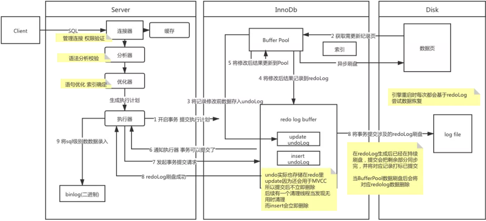

# 1. 什么是事务？事务的四个特性是什么？

**核心回答：** 事务是数据库操作的**基本执行单元**，由一组 SQL 操作组成，保证这组操作要么全部成功、要么全部失败。四个特性是 **ACID：原子性、一致性、隔离性、持久性**，其中一致性是最终目标，AID 三者共同保证一致性。

**底层原理：**

1. **原子性（Atomicity）**：事务中的操作要么全部成功，要么全部失败回滚。 **靠 undo log 实现** ——部分操作失败时，通过 undo log 将已执行成功的操作撤销，回滚到事务开始前的状态。
2. **一致性（Consistency）**：事务将数据库从一种一致状态转换到另一种一致状态，事务开始和结束后完整性约束不被破坏。 **一致性是最终结果，不是靠单一技术，而是靠 AID 三者共同保证** ，同时还需要应用层面配合（比如转账必须扣款和加款同时成功）。
3. **隔离性（Isolation）**： **并发事务之间互相影响的程度。** 并发事务之间互不干扰， **一个事务未提交前，其他事务看不到其执行结果。** MySQL 通过**锁机制 + MVCC**保证隔离性。
4. **持久性（Durability）**：事务一旦提交，结果永久保存，即使数据库崩溃也不丢失。靠 redo log 实现——事务提交时先将 redo log 刷盘，保证宕机后能恢复。

**通俗理解：**

转账场景：A 向 B 转 1000 元。原子性保证扣款和加款要么都成功要么都失败；一致性保证 A+B 总金额不变；隔离性保证转账过程中 B 看不到中间状态；持久性保证转账成功后即使断电也不丢数据。

**一句话总结：**
事务是数据库操作的基本单元，ACID 中一致性是目标，原子性靠 undo log，持久性靠 redo log，隔离性靠锁 + MVCC。

# 2. MySQL 如何开启事务？

**核心回答：** 三种方式：**begin/start transaction 显式开启、set autocommit=0 关闭自动提交、默认 autocommit=1 每条 SQL 自动提交**。

**底层原理：**

1. **begin / start transaction**：显式开启一个事务，执行完 SQL 后需要手动 commit 或 rollback。
2. **set autocommit=0**：关闭当前会话的自动提交，之后所有 SQL 都需要手动 commit，直到设置回 autocommit=1。
3. **默认 autocommit=1**：每条 SQL 语句执行后自动 commit，即每条 SQL 本身就是一个事务。

**避坑指南：**

- DDL 语句（alter table、drop table、create table 等）会触发**隐式提交**，即使在一个未完成的事务中执行 DDL，也会自动 commit 前面的事务，rollback 无效。
- 同一个 session 中，事务未结束就开启新事务，会自动提交上一个事务。

**一句话总结：**
begin 显式开启最常用，默认 autocommit 每条自动提交，DDL 会隐式提交需注意。

# 3. MySQL 事务何时提交、回滚？

**核心回答：** 提交有**自动提交、显式 commit、隐式提交、新事务自动提交前一个**四种情况；回滚有**显式 rollback、session 断开自动回滚、锁超时语句级回滚**三种情况。

**底层原理：**

**事务什么时候提交** ：

1. **默认 autocommit**：SQL 执行完马上 commit
2. **显式事务**：需要主动执行 commit
3. **隐式提交**：DDL 语句（alter/drop/create）执行后自动 commit
4. **新事务覆盖**：同一 session 未结束的事务，开启新事务时自动提交前一个

**事务什么时候回滚：**

1. **显式 rollback**：手动执行 rollback，回滚整个事务
2. **session 断开**：事务未结束前关闭连接，自动 rollback
3. **锁超时**：innodb_lock_wait_timeout 超时后，只回滚**当前语句**而非整个事务（除非配置了 --innodb_rollback_on_timeout）

**避坑指南：**

- 事务 commit 之后无法 rollback，没有后悔药。
- 事务中某条 SQL 报错，**前面已执行的 SQL 不会自动回滚**，需要手动 rollback。 **InnoDB 中单条语句是原子的（语句级回滚）** ，但整个事务不会因一条语句失败而自动回滚。

**一句话总结：**
提交靠 commit 或 autocommit，回滚靠 rollback 或断连；语句报错只回滚该语句，不回滚整个事务。

# 4. auto commit 有什么优缺点？

**核心回答：** autocommit 默认开启（=1），优点是**避免长事务、减少锁持有时间、降低宕机恢复代价**；缺点是**SQL 立即生效无法 rollback**。

**底层原理：**

优点：

- 避免执行 SQL 后没提交导致其他会话看不到数据甚至夯住
- 避免不可控的大事务发生
- 避免 MySQL 5.7 多线程复制时，主库某 SQL 没显性提交导致从库线程等待、延迟增大
- 减少异常宕机后 recover 时间，减少数据丢失

缺点：

- SQL 立刻生效，变更错误无法用 rollback 回滚

**实战选型：**

- DBA 做变更时：先 `set autocommit=0`，检查变更条数与预期相同后再 commit
- 程序中简单事务：用 `begin; SQL...; commit;`
- 程序中多个事务：先 `set autocommit=0`，全部 commit 后再 `set autocommit=1`

**一句话总结：**
autocommit 默认开启防长事务，变更操作建议先关闭再手动提交。

# 5. 什么是快照读和当前读？用途是什么？

**核心回答：** 快照读是**普通 SELECT，读 MVCC 历史版本，不加锁**；当前读是**加锁读或修改操作，读最新数据，加行锁**。

为兼顾并发性能与数据准确性，适配不同业务查询需求。查数据用快照读提性能；改数据用当前读保数据准确。

**底层原理：**

快照读（普通 SELECT）：

- 不加锁，读取 undo log 中的历史版本数据，不加锁。
- 靠 MVCC 实现，保证同一事务内多次读取结果一致
- 优势：并发高、无阻塞，满足日常查询。
- 问题：可能读到历史数据，无法获取最新实时值。
- **适用于：普通查询**

**当前读（加锁/修改）：**

- 读取最新已提交数据，加行锁（Record Lock / Gap Lock / Next-Key Lock）
- 包含：SELECT ... FOR UPDATE、SELECT ... LOCK IN SHARE MODE、UPDATE、DELETE、INSERT
- 优势：拿到最新真实数据，保证数据更新精准。
- 问题：会触发锁竞争，并发会阻塞。
- **适用于：需要保证数据实时性和一致性的修改操作**

**开启快照读：**

```sql
start transaction with consistent snapshot;
-- begin/start transaction命令也可以
select * from T; -- 快照读
select * from T where id = 1; -- 快照读
select * from T where name = 'LL'; -- 快照读
commit;
```

开启当前读

```sql
start transaction with consistent snapshot;
-- begin/start transaction命令也可以
SELECT * FROM T LOCK IN SHARE MODE; -- 共享锁
SELECT * FROM T FOR UPDATE; -- 排他锁
INSERT INTO T values ... -- 排他锁
DELETE FROM T WHERE ... -- 排他锁
UPDATE T SET ... -- 排他锁
commit;
```

**避坑指南：**

同一个事务中，先快照读再当前读，可能出现幻读（快照读看不到新插入的行，但当前读能看到），这是 MySQL 官方不认为是 bug 的行为。解决方案：统一用当前读（SELECT ... FOR UPDATE）。

**一句话总结：**
普通 SELECT 是快照读（不加锁、读历史版本），FOR UPDATE/UPDATE/DELETE 是当前读（加锁、读最新数据）。

# 6. MySQL 事务的隔离级别有哪些？有什么区别？

**核心回答：** MySQL InnoDB 支持**四种隔离级别**：读未提交、读已提交（RC）、可重复读（RR，默认）、串行化。级别越高，数据越安全但并发越低。

如加锁过度，会降低并发处理能力，因此，分成了不同的隔离级别。隔离级别的实现方式，是用不同的加锁级别实现的。

**底层原理：**

1. **读未提交（Read Uncommitted）**：
   - 该隔离级别的事务，在一个事务内，多次读取同一数据集合时， **会读到其他未提交事务的数据** ， **为脏读** ，多次读取数据不一样
   - 不加锁，不用 MVCC，直接读最新数据。 **脏读、不可重复读、幻读全有** ，基本不用。
2. **读已提交（Read Committed，RC）**：
   - **只能读取已经提交到的数据。**例如事务一更新id 1为2，此时事务二读到的仍是1 ，一提交事务后，此时二再读，id就为2了。 **不可重复读。**
   - 使用 MVCC， **每次 SELECT 生成新的 ReadView** 。 **没有脏读问题，有不可重复读问题**
   - RC 级别：每次查询新建 ReadView，能查到外部提交的新数据**解决脏读，存在不可重复读和幻读** 。
   - **当前读场景都会加记录锁，只走 Record Lock** ， **关闭 Gap Lock 和 Next-Key Lock。当前事务多次当前读间隙，其他事务可修改该行并提交，再次读取就拿到新数据，前后结果不一致。**
   - **快照读使用MVCC解决脏读**
3. **可重复读（Repeated Read，RR）**：
   - 在同一个事务内的查询都是事务开始时刻一致的。同样的select读到的结果一致。
   - InnoDB 默认级别。MVCC 管快照读，Next-Key Lock 管当前读，两者配合在 RR 下解决幻读。每次事务开始生成 ReadView，后续复用。
   - **快照读时** ，使用MVCC， **实现可重复读，不会出现幻读，**事务内第一次快照读生成一份 ReadView，整个事务全程复用，不再重新创建
   - **当前读时，**第一个当前读会通过加行所或间隙锁的方式实现，也可以说是next key lock，别的事务要修改直接就阻塞了， **解决幻读和不可重复读**
     需要等锁的释放 然后开始竞争（ **事务提交时释放锁** ）。因此也能保证 **不出现幻读** 。同时由于有锁，其他事务无法修改该行数据， **解决不可重复度**

   **RR幻读问题：**
   1、在一个事务当中，同时使用到快照读和当前读。但是**MySQL 官方不认为是 bug** 。只把「连续两次快照读」或「连续两次当前读」出现不一致才算幻读；
   先快照读、后当前读导致的不一致，不算 bug，也不算标准意义上的幻读。
   **快照读**：承诺「事务内一致性视图」，牺牲 “最新性”
   **当前读**：承诺「看到最新数据 + 防止并发写」，牺牲 “和旧快照一致”

   2、事务一查询没有数据，此时事务二写入同主键的数据提交，此时事务一再次查询依然没有数据，然后insert，此时会出现主键冲突，因为事务二已经写入了数据。

   3、事务 A 执行查询 id = 5 的记录，此时表中是没有该记录。
     事务 B 插入一条 id = 5 的记录，并且提交了事务。
    事务 A 更新 id = 5 这条记录
   再次查询 id = 5 的记录，事务 A 就能看到事务 B 插入的纪录

   **原因：**
   如果两次select之间 有update, update 是只有当前读的, 当前读不受read-view限制,
   它会去竞争要修改的数据行的锁, 进而可能会对 trx_id 处于read-view中的数据行(快照读不可见) 进行了修改,
   数据行的trx_id也被修改为当前事务的trx_id, 然后再使用普通select时 就变得可见了
4. **串行化（Serializable）**：所有事务串行执行，读写互斥， **使用悲观锁，不用 MVCC。** 避免所有并发问题，但并发能力极低。

**核心区别：**

- 读未提交：无 MVCC、无锁， **脏读 + 不可重复读 + 幻读**
- RC：MVCC + Record Lock， **解决脏读，存在不可重复读和幻读**
- RR：MVCC + Next-Key Lock， **解决脏读 + 不可重复读 + 幻读**
- 串行化：悲观锁，全部串行，零并发问题但性能差

**一句话总结：**
InnoDB 默认 RR 级别， **MVCC 解决脏读和不可重复读** ， **Next-Key Lock 解决幻读，** 三者配合实现可重复读。

**几种锁介绍**

**Record Locks（记录锁）** ：在索引记录上加锁。

**Gap Locks（间隙锁）** ：在索引记录之间加锁，或者在第一个索引记录之前加锁，或者在最后一个索引记录之后加锁。

**Next-Key Locks：** 在索引记录上加锁，并且在索引记录之前的间隙加锁。它相当于是Record Locks与Gap Locks的一个结合。

# 7. 不同隔离级别有什么问题？如何解决的？

**核心回答：** 三类并发问题：**脏读、不可重复读、幻读**。脏读和不可重复读靠 MVCC 解决，幻读靠 Next-Key Lock 解决。

**底层原理：**

1. **脏读**：一个事务读到了另一个未提交事务的数据。
   - RC 及以上通过 **MVCC 解决——只读已提交的数据版本。**
   - **看不到其他事务未提交的修改数据。**
   - 提升查询并发能力
2. **不可重复读**：同一事务内两次读取同一行数据结果不同（被其他事务修改了）。 **聚焦单行数据值变更。**
   - **RR 通过 MVCC 的 ReadView 机制解决** ——事务开始时生成一致性视图，后续读都基于该视图。
   - 事务开启瞬间，生成**Read View**，记录当前活跃事务 ID 边界。
   - 事务内所有快照读，都依照这份固定视图判定可见数据。
   - 期间其他事务提交修改，生成新版本数据，当前事务视图不会刷新，始终读取首次查询对应的历史版本。
   - 同一事务多次查询，返回结果一致，杜绝前后数据不一致的不可重复读现象。
3. **幻读**：同一事务内两次查询，第二次多出了行。聚焦**数据行数、新记录出现**。
   - 当同一个查询在不同的时间产生不同的结果集时 **，事务中就会出现所谓的幻象问题** 。例如，如果 SELECT 执行了两次，但第二次返回了第一次没有返回的行，则该行是“幻像”行。
   - 单靠 MVCC 无法解决（当前读能看到新插入的数据），需要 Next-Key Lock **（Record Lock + Gap Lock）** 锁住索引间隙，阻止其他事务在间隙内插入新行。
   - **快照读时** ，使用MVCC读，不会出现幻读
   - **当前读时** ， **需要 Next-Key Lock （Record Lock + Gap Lock） 锁住索引间隙，** 阻止其他事务在间隙内插入新行，不会出现幻读。
     第一个当前读会通过加行所或间隙锁的方式实现，也可以说是next key lock，别的事务要修改直接就阻塞了，需要等锁的释放 然后开始竞争（ **事务提交时释放锁** ）。因此也能保证不出现幻读。

**RR 可能出现幻读场景：**

1. 在一个事务当中，同时使用到快照读和当前读。但是**MySQL 官方不认为是 bug** 。只把「连续两次快照读」或「连续两次当前读」出现不一致才算幻读； 先快照读、后当前读导致的不一致，不算 bug，也不算标准意义上的幻读。
   **快照读**：承诺「事务内一致性视图」，牺牲 “最新性”
   **当前读**：承诺「看到最新数据 + 防止并发写」，牺牲 “和旧快照一致”
2. 事务一查询没有数据，此时事务二写入同主键的数据提交，此时事务一再次查询依然没有数据，然后insert，此时会出现主键冲突，因为事务二已经写入了数据。
3. 事务 A 执行查询 id = 5 的记录，此时表中是没有该记录。
   事务 B 插入一条 id = 5 的记录，并且提交了事务。
   事务 A 更新 id = 5 这条记录
   再次查询 id = 5 的记录，事务 A 就能看到事务 B 插入的纪录

   **原因：**
   如果两次select之间 有update, update 是只有当前读的, 当前读不受read-view限制,
   它会去竞争要修改的数据行的锁, 进而可能会对 trx_id 处于read-view中的数据行(快照读不可见) 进行了修改,
   数据行的trx_id也被修改为当前事务的trx_id, 然后再使用普通select时 就变得可见了

**避坑指南：**

RR 级别下， **先快照读再当前读出现的幻读，MySQL 官方不认为是 bug** 。连续快照读靠 MVCC 不幻读，连续当前读靠 Next-Key Lock 不幻读，
但快照读和当前读混用可能出现幻读， **解决方式是统一用当前读（FOR UPDATE）** 。

**一句话总结：**
脏读和不可重复读靠 MVCC， **幻读靠 Next-Key Lock** ；快照读和当前读混用需注意幻读。

# 7. 为什么 RR 不能 100% 杜绝幻读？

因为：

- **MVCC（快照读）** 能挡住幻读
- **当前读（for update /update/delete）** 会读取最新数据，挡不住新插入的行
- 只有**间隙锁 + 临键锁**能挡住插入，但 InnoDB 不会对所有查询自动加间隙锁

所以：RR 只能解决 “快照读” 的幻读，解决不了 “当前读” 的幻读。

# 7. ReadView 是什么

ReadView：MVCC 用来判断数据版本是否可见的查询视图，事务快照读时生成。 **称为一致性视图**

**四个核心字段**

1. m_ids：当前未提交的活跃事务 ID 集合
2. min_trx_id：活跃事务里最小 ID
3. max_trx_id：下一个待分配事务 ID
4. creator_trx_id：当前自身事务 ID

**可见判断规则**

1. 数据事务 ID < min_trx_id → 可见
2. 数据事务 ID ≥ max_trx_id → 不可见
3. 介于两者之间，且在 m_ids 内 → 不可见；不在则可见

**关键特点**

1. RR 级别：事务第一次快照读才生成 ReadView，全程复用，防不可重复读
2. RC 级别：每次查询都重新生成，可读到最新已提交数据

**MVCC 机制如何普通读（快照读）的幻读？**

我们来看下当查询一条记录的时候，系统如何通过MVCC找到它：

1\. 首先获取事务自己的版本号，也就是事务 ID；2. 获取 ReadView 读试图；3. 查询得到的数据，然后与 ReadView 中的事务版本号进行比较；4. 如果不符合 ReadView 规则，就需要从 Undo Log 中获取历史快照；5. 最后返回符合规则的数据。

# 8. 事务的原子性和持久性是如何保证的？

**核心回答：** 原子性靠 **undo log 回滚**，持久性靠 **redo log 刷盘**。

**底层原理：**

**原子性（靠 undo log）：**

- 事务执行过程中，undo log 记录每步操作的**逆向逻辑**（DELETE 记录 INSERT，INSERT 记录 DELETE，UPDATE 记录反向 UPDATE）
- 事务失败或 ROLLBACK 时，通过 undo log 逐步回退到事务开始前的状态
- 宕机恢复时，扫描 undo log 找到未 COMMIT 的事务进行回滚

**持久性（靠 redo log）：**

- 事务提交时，必须先将 redo log 刷盘（Force Log at Commit），commit 操作完成后才算事务完成
- redo log 是**顺序写**，效率远高于随机写数据页, 所有事务的修改，**统一追加到同一个日志文件末尾**（ib_logfile0/1，循环写），
  redo log 是 固定大小、循环写的文件，大小固定（比如每个 1GB），写满了就回到开头覆盖写。
- 宕机恢复时，通过 redo log 重做已提交事务的所有修改
- innodb_flush_log_at_trx_commit 控制刷盘策略，默认 1（最安全）

**避坑指南：**

- **undo log 本身也需要持久性保护，所以 undo log 也会产生 redo log**
- 原子性不只靠 undo log，而是 undo log + redo log 配合： **redo log 保证已提交操作的持久性** ， **undo log 保证未提交操作的可回滚性**

**一句话总结：**
原子性靠 undo log 回滚，持久性靠 redo log 顺序写刷盘；两者配合保证事务要么全做要么全不做且结果永久保存。

# 9. 事务的隔离性如何实现的？

**核心回答：** 隔离性通过**锁机制 + MVCC** 共同实现。写操作靠锁保证互斥，读操作靠 MVCC 实现非锁定一致性读。

**底层原理：**

1. **锁机制**（悲观锁）：
   - 写操作加行锁（Record Lock / Gap Lock / Next-Key Lock），保证同一行不会被多个事务同时修改
   - 串行化级别下读操作也加共享锁，读写互斥
2. **MVCC**（乐观锁理论）：
   - RC 和 RR 级别下，普通 SELECT 不加锁，通过 undo log 版本链 + ReadView 实现一致性非锁定读
   - 大多数读操作不用加锁，大幅提高并发性能
3. **两者配合**：
   - 快照读靠 MVCC，不加锁
   - 当前读靠锁机制，加行锁保证互斥
   - 不同隔离级别通过不同的加锁策略和 MVCC 生成 ReadView 的时机来实现不同程度的隔离

**一句话总结：**
隔离性 = 锁机制（管写互斥）+ MVCC（管读一致性），两者配合在不同隔离级别下实现不同隔离程度。

# 10. redo log 是什么？用途是什么？

**核心回答：** redo log 是 InnoDB 的**重做日志**，记录事务对数据页的**物理修改**（偏移量+修改后数据），用于**保证事务持久性**和**宕机恢复**。
redolog会把事务在执行过程中对数据库的所有修改都记录下来，在系统崩溃或者重启后把修改恢复出来
redo log是指在回放日志的时候把已经COMMIT的事务重做一遍，对于没有commit的事务按照abort处理，不进行任何操作。

- 数据是存放在磁盘中的，但如果每次读写数据都需要磁盘IO，效率会很低。InnoDB提供了缓存(Buffer Pool)，Buffer Pool中包含了磁盘中部分数据页的映射，作为访问数据库的缓冲：
- **当从数据库读取数据时，** 会首先从Buffer Pool中读取，如果Buffer Pool中没有，则从磁盘读取后放入Buffer Pool；
- **当向数据库写入数据时，** 会首先写入Buffer Pool，Buffer Pool中修改的数据会定期刷新到磁盘中（这一过程称为刷脏）。
- 如果MySQL宕机，而此时Buffer Pool中修改的数据还没有刷新到磁盘，就会导致数据的丢失，事务的持久性无法保证。
- 通过 **Force Log at commit 实现事务的持久性** ，即事务提交时，必须先将事务的所有日志写入到redo log进行持久化，等事务的commit操作完成才算完成。

**底层原理：**

1. **为什么需要 redo log**：InnoDB 数据先写 Buffer Pool（内存），再异步刷盘。如果宕机时脏页未刷盘，数据丢失。redo log 保证只要事务 commit 成功，修改就不会丢。
2. **写入流程**：数据修改 → 写入 redo log buffer → 刷入 redo log file（磁盘）→ 异步更新数据页到磁盘
3. **WAL 机制**（Write-Ahead Logging）：先写日志再写数据页，redo log 顺序写效率远高于数据页随机写，所有事务的修改，**统一追加到同一个日志文件末尾**（ib_logfile0/1，循环写），
   因为 redo log 是 **固定大小、循环写的文件，大小固定（比如每个 1GB），写满了就回到开头覆盖写。**
4. **Force Log at Commit**：事务提交时必须先将 redo log 刷盘，commit 完成才算事务完成，事务提交时，不刷磁盘数据页，只必须把 Redo Log 刷到磁盘

**事务核心规则：先写日志，再写磁盘（WAL）**

1. 事务修改数据，只改 内存 Buffer Pool，不刷磁盘。
2. 事务提交（commit）必须把 Redo Log 强制刷入磁盘，才算提交成功。→ **只要 Redo Log 落盘，数据就永久安全了。**
3. 后台异步刷盘MySQL 空闲时，慢慢把内存数据刷到磁盘数据页，不影响事务速度。

**宕机恢复流程**

如果数据库崩溃重启： 崩溃恢复：**从头到尾一次性重放**，不需要随机查找。

1. 检查 **Redo Log**
2. 把已经提交、但未落盘的数据**重放一遍**
3. 数据自动恢复，**绝对不丢失**

# 10. redo log**存储格式**

**redo log记录的是页的物理修改操作** ，记录的是物理偏移量， 是修改后物理数据，

**undolog记录的是逻辑日志。** 逻辑旧数据、修改前的快照（修改前的值）。可以认为当delete一条记录时，undo log中会记录一条对应的insert记录，反之亦然，当update一条记录时，它记录一条对应相反的update记录。

若执行 SQL 语句：

**INSERT INTO t SELECT 1,2;**

由于需要对聚集索引页和辅助索引页进行操作，其记录的重做日志大致为：

page(2, 3), offset 32, value 1, 2 # 聚集索引
page(2, 4), offset 64, value 2 # 辅助索引

**物理层面描述：**

```
1、在 表空间 2
2、第 3 号数据页
3、偏移量 32 的位置
4、写入数据 1 和 2 不是逻辑日志！
```

redo log 存放在重做日志文件中，undo 存放在数据库内部的特殊段（segment）中，位于共享表空间内。

**避坑指南：**

在每次将redo log buffer写入redo log file后，都需要调用一次fsync操作，因为重做日志缓冲只是把内容先写入操作系统的缓冲系统中， **并没有确保直接写入到磁盘上，所以必须进行一次fsync操作** 。因此，磁盘的性能在一定程度上也决定了事务提交的性能。

**innodb_flush_log_at_trx_commit 控制刷盘策略：**

- **0**：提交时不刷盘，依赖主线程每秒刷新，可能丢 1 秒数据
- **1**（默认）：提交时同步刷盘（fsync），最安全，不丢数据
- **2**：提交时写入文件系统缓存，不同步 fsync，宕机且操作系统崩溃时可能丢数据

注意存在两层 buffer：redo log buffer → 文件系统 buffer → 磁盘，只有设为 1 才保证写到磁盘。

**一句话总结：**
redo log 记录物理修改，WAL 顺序写保证持久性，innodb_flush_log_at_trx_commit 设 1 最安全。

# 11. redo log 是怎么恢复的？

**核心回答：** InnoDB 启动时**无论上次是否正常关闭都会进行恢复**，从 checkpoint 的 LSN 开始重放 redo log 中已提交事务的修改。

1、LSN（Log Sequence Number）**日志序列号**，是**全局单调递增的 64 位数字**，用来标记 redo log、数据页、日志文件的位置。

- 每往 redo log 写入一条日志，LSN 就自增。
- 数据页头部也会记录**页 LSN**，代表该数据页最后一次被修改对应的日志位置。
- 作用：精准定位日志、判断数据页是否和日志同步。

**2. Checkpoint（检查点）**

把内存中已修改的脏数据页 ( **Buffer Pool 中被修改过，但还没同步刷写到磁盘的数据页** )，批量刷写到磁盘数据页的动作，

同时记录对应的 LSN。每次执行 checkpoint，会记录一个 **Checkpoint LSN**，表示：**这个 LSN 之前的所有修改，对应的脏页都已经全部落盘到磁盘**。

- 核心目的：**截断 redo log、减少重启恢复工作量**。
- 刷盘后，该 checkpoint 之前的 redo log 就不再需要重放，可以复用 / 清理。

redo log 所有事务的修改，**统一追加到同一个日志文件末尾**（ib_logfile0/1，循环写, **一个log文件写满后，写另一个log文件** ），
redo log 是 固定大小、循环写的文件，大小固定（比如每个 1GB），写满了就回到开头覆盖写。

**底层原理：**

1. **恢复时机**：InnoDB 启动时自动执行，无论上次正常关闭还是异常崩溃
2. **恢复起点**：从 checkpoint 对应的 LSN 开始，checkpoint 之前的数据页已经完整刷盘
3. **恢复逻辑**：
   - 扫描 redo log，找到已 COMMIT 的事务，重做其所有修改
   - **找到未 COMMIT 的事务，通过 undo log 回滚**
   - 如果数据页的 LSN 已经大于 redo log 的 LSN，说明该数据页已经刷盘，跳过不重做
4. **恢复速度**：redo log 是物理日志（记录页偏移量+修改值），恢复速度比逻辑日志（如 binlog）快很多

**避坑指南：**

宕机前如果正处于 checkpoint 刷盘过程，且数据页刷盘进度超过了日志页刷盘进度，此时数据页 LSN > 日志 LSN，恢复时超出日志进度的部分不会重做（因为已经做过了）。

**一句话总结：**
启动时从 checkpoint LSN 开始重放已提交事务的 redo log，物理日志恢复比逻辑日志快。

# 12. undo log 是什么？用途是什么？

**核心回答：** undo log 是 InnoDB 的**回滚日志**，记录事务修改前的**逻辑旧数据**，用于**事务回滚**和**MVCC**。

undo log是把 **所有没有COMMIT的事务回滚到事务开始前的状态** ，系统崩溃时，可能有些事务还没有COMMIT，在系统恢复时，这些没有COMMIT的事务就需要借助undo log来进行回滚。

或者使用ROLLBACK进行回滚，会使用到undo log。

**使用undo log进行宕机回滚**

1\. 扫描日志，找出所有已经START,还没有COMMIT的事务。

2\. 针对所有未COMMIT的日志，根据undo log来进行回滚。

**底层原理：**

1. **逻辑日志**： **DELETE 操作记录一条 INSERT，INSERT 记录一条 DELETE，UPDATE 记录一条反向 UPDATE**
2. **事务回滚**：ROLLBACK 时，从 undo log 读取逆向操作并执行，恢复到事务开始前的状态
3. **MVCC 支持**：当读取的行被其他事务锁定时，通过 undo log 版本链读取之前的行版本，实现非锁定一致性读
4. **宕机恢复**：系统崩溃恢复时，扫描 undo log 找到未 COMMIT 的事务进行回滚

**避坑指南：**

- undo log 本身也需要持久性保护，所以 undo log 也会产生 redo log
- undo log 是**随机写**，性能不如 redo log 的顺序写，
- undo log 存放在数据库内部的特殊段（undo segment）中，位于共享表空间内，不是独立文件

**一句话总结：**
undo log 记录逻辑旧数据， **两个核心用途：事务回滚和 MVCC 版本链。**

mysql新增、修改、删除数据时，在事务开启前，就会将信息写入Undo Log中， **事务提交时，并不会立刻删除Undo Log** ，InnoDB存储引擎会将事务对应的Undo Log放入待删除列表中，之后会通过后台的
purge thread对待删除的列表进行删除操作处理。

注意的是Undo log是一种逻辑日志，记录的是一种逻辑过程。比如：
mysql执行delete操作，Undo log就会记录一个insert操作；
mysql执行一个insert操作，Undo Log就会记录一个delete操作；
mysql执行update操作，Undo Log记录一个相反的update操作。

Undo Log以段的方式来管理记录日志信息，在InnoDB存储引擎的数据文件中，包含了一种rollback segment的回滚段，内部包含了1024个undo log segment 。

# **12. undo log 为什么是随机写？**

**1. 本质：事务私有 + MVCC，必须分散存储**

- undo log 是逻辑日志，记录 “修改前的旧值 / 反向操作”，用于回滚和 MVCC。
- **每个事务有独立的 undo 段（slot），写在不同 undo 页。**
- 事务提交后，undo 不立即删除，要长期保留供快照读，需频繁随机访问。

**2. 访问模式：频繁随机读写**

- 写：不同事务并发修改不同 undo 页（随机位置）。
- 读：回滚时要精准定位当前事务的 undo 链；MVCC 要随机查找历史版本。
- 清理：purge 线程要随机访问旧 undo 记录并标记回收。

**3. 结构：多回滚段 + 多事务分散**

- 默认 128 个回滚段（rollback segment），每个段管理多个事务的 undo。
- 事务并发时，undo 记录散落分布在不同 undo 页，必然随机写。

# **12. undo log什么时候删除**

**undo log 分两类：**
INSERT 型 undo log： **事务提交后立刻删除**
UPDATE/DELETE 型 undo log：提交后不删， **等后台 purge 线程确认 “没有任何事务还需要它” 时才删除**

**INSERT undo log（只用于回滚）**

- 事务插入新数据 → undo log 记录 “删掉这行”
- 这行新数据只有当前事务能看到，别的事务读不到
- 事务一旦提交：
  - 不可能再回滚
  - 没有任何其他事务会读这个 “新数据的旧版本”
- ✅ 所以：提交后直接删，不进 purge 逻辑

**2. UPDATE/DELETE undo log（回滚 + MVCC）**

- UPDATE/DELETE 会改 “已经存在的数据”
- 旧版本要留在 undo log 里，给 **快照读（MVCC）** 用
- 事务提交后：
  - 不能立即删：可能还有别的长事务在读这个旧版本
  - 只是把这条 undo log 标记为 “待 purge”，放到历史链表

**Purge 线程（后台异步）**

InnoDB 有个专门的后台线程叫 Purge Thread，干两件事：

- 清理不再需要的 UPDATE/DELETE undo log
- 真正物理删除那些被 “标记删除” 很久的行

**Purge 判断标准（核心）**

Purge 会找当前系统里最老的活跃读事务（最小的 ReadView）：

- 如果一条 undo log 的 trx_id < 最老 ReadView 的 up_limit_id
- ⇒ 没有任何活跃事务还需要它
- ⇒ 可以安全删除

  换句话说： **只要还有一个老事务在跑，它可能要读的 undo log 就不能删。**

# 13. redo undo log 区别？怎么存储的？

**核心回答：** redo log 记录**修改后的物理数据**（页偏移量+新值），undo log 记录**修改前的逻辑数据**（反向操作）。redo log 存在独立的重做日志文件中，undo log 存在共享表空间的 undo 段中。

**核心区别：**

**redo log：**

- 记录物理日志：页的物理偏移量 + 修改后的值
- 用途：保证持久性、宕机恢复重做
- 写入方式：顺序写，性能高, redo log 顺序写效率远高于数据页随机写，所有事务的修改，**统一追加到同一个日志文件末尾**（ib_logfile0/1，循环写），
  因为 redo log 是 **固定大小、循环写的文件，大小固定（比如每个 1GB），写满了就回到开头覆盖写。**
- 存储：独立的重做日志文件（ib_logfile0/ib_logfile1）

**undo log：**

- 记录逻辑日志：修改前的值 / 反向操作， **修改后数据结构和页本身在回滚后可能和之前不同**
- 用途：事务回滚、MVCC 版本链， **若当前记录被其他事务占用，可以通过undo读取之前版本的行数据，实现mvcc**
- 写入方式：随机写
- 存储：数据库内部的 undo 段，位于共享表空间内，undo log存放在共享表空间的一个segment 段中，称为undo 段
- **undo log也会产生redo log，因为undo log也要实现持久性保护。**

结论： **redo log 管"重做"（已提交的事务），undo log 管"回滚"（未提交的事务）** ，两者配合保证原子性和持久性。

**DDL 有 redo log（必须有，要崩溃恢复）**

```
DDL（建表、改表、删表、加索引等）本质是修改元数据 + 物理文件：
```

- 改数据字典（系统表）
- 分配 / 释放表空间、段、区、页
- 创建 / 删除 .ibd 文件

  这些修改都要落盘、要崩溃恢复，所有 DDL 对数据字典和页结构的修改，都会产生 redo log

**DDL 没有普通的 undo log（不走 DML 那条 undo 链，也不用于 MVCC）**

普通 undo log 是给 DML（insert/update/delete） 用的，目的是：
事务回滚时恢复行数据
MVCC 快照读，找旧版本链

但 DDL 是结构级操作，不是 “行数据修改”：
不产生行级旧版本
不参与 MVCC 快照读
回滚也不是恢复某一行，而是撤销整个结构变更（删文件、释放空间、回滚数据字典）

所以：
DDL 不生成 DML 那种 undo log（不在 rollback segment 里）
不能用 ROLLBACK 回滚 DDL（DDL 执行完就隐式提交）

**DDL 有自己专门的 “DDL log”，用来实现原子 DDL（要么全成、要么全回滚）**

```
MySQL 8.0 开始支持 原子 DDL（Atomic DDL），靠一张隐藏系统表： mysql.innodb_ddl_log
```

记录 DDL 的反向操作：
建表 → 记录：删表、删 ibd 文件、释放空间
加索引 → 记录：删索引、释放索引段
改表结构 → 记录：回滚数据字典、清理临时文件

**一句话总结：**
redo log 顺序写物理日志管重做，undo log 随机写逻辑日志管回滚，存储位置也不同。

# 13. undo log 也会产生对应的 redo log。

**一、为什么 undo log 也要记 redo？**

- undo log 本身也存在「数据页」里（undo 页）
- 修改 undo 页 → 这个页也会变成「脏页」
- 宕机时，脏页还没刷盘 → undo log 会丢 → 事务没法回滚 → 数据不一致

所以：undo log 的修改必须被 redo log 保护，和普通数据页一样走 WAL。

一句话：undo log 也是数据，数据要持久化，就要记 redo。

**二、实际写入顺序（非常重要）**
以 UPDATE 为例，底层真实顺序：

1. 修改数据页前：先写 undo log（旧值）
   - 生成 undo 记录
   - 写入 undo 页（内存）
   - 修改 undo 页 → 产生一条 redo log（记录 undo 页的物理修改）
2. 再修改数据页（内存）→ 脏页
3. 同时产生普通数据页的 redo log
   - commit 时把「数据页 redo + undo 页 redo」一起刷盘
   - 保证：崩溃后既能前滚数据，也能回滚未提交事务

**临时表的 undo log 不记 redo。**

# 14. binlog 是什么？用途是什么？

**核心回答：** binlog 是 MySQL Server 层的**二进制日志**，记录所有对数据库执行更改的 SQL 语句（逻辑日志），主要用于**主从复制**和**数据恢复**。

**底层原理：**

1. **归属层次**：binlog 属于 MySQL Server 层，而 redo log / undo log 属于 InnoDB 引擎层
2. **记录内容**：记录的是逻辑修改（SQL 语句或行变更），不是物理页修改
3. **写入时机**：事务提交时一次性写入（不是事务执行过程中持续写入）执行时，
   - SQL 变更内容先组装成 binlog 事件，写入**binlog cache（事务内存缓冲区）**
   - 每个事务独占一份 binlog cache；多事务互不干扰
   - 事务未提交：数据只停留在 cache，不会进入全局 binlog 文件缓冲区
   - 事务提交 `commit` 瞬间 把本事务完整 binlog 从 cache 拷贝到 OS page cache（binlog 文件缓冲）
   - 多个事务提交后，page cache 里是有序的完整事务日志
4. **刷盘机制：** 三层存储结构，
   - 事务内存：binlog cache，
   - 操作系统缓冲区：page cache，
   - 物理磁盘：binlog 文件，
     
     **sync_binlog 核心控制刷盘频率**
   - sync_binlog=0（性能最高，风险最大）MySQL 完全不主动刷盘，交给操作系统内核异步刷 
     page cache崩溃时 page cache 未落盘的 binlog 全部丢失
   - sync_binlog=1（默认推荐、最安全）每提交 1 个事务，强制调用 fsync 把 page cache 刷到磁盘
     事务 commit 顺序：
            1、事务 binlog 写入 page cache
            2、fsync 刷盘
            3、再写 redo、提交事务引擎层，保证 binlog 一定持久化成功才认为事务提交完成
5. **清理时机** ：自动清理**不会定时轮询删文件**，只在 3 个节点触发校验删除过期 binlog
   - MySQL 服务启动时，进程拉起第一件事扫描所有 binlog，删除超出过期时长的旧文件。
   - 日志切换（flush）时
     - 单个 binlog 达到 max_binlog_size（默认 1G）自动切新文件
     - 手动执行 FLUSH LOGS; 强制切日志，切换完成后立刻校验并删除过期旧日志。

     **当前正在写入的最新 binlog 永远不会被自动清理，无论是否过期。**

     删除前 MySQL 会自动判断：
     - 检查所有从库（replica）是否已经消费完这条 binlog；
     - 如果存在延迟从库还未拉取，不会删除该 binlog，防止从库断同步报 1236 错误；
     - 只会删 index 文件里登记的归档旧文件，不允许 rm 暴力删磁盘文件（会破坏.index 索引）
6. **主要用途**：

- 主从复制：从库读取主库 binlog 重放，实现数据同步
- 数据恢复：通过 mysqlbinlog 工具回放指定时间的 binlog，恢复数据

**避坑指南：**

- binlog 不属于事务存储引擎，不参与 InnoDB 的事务保证（原子性/持久性靠 redo/undo log）
- 开启 binlog 后，MySQL 通过**两阶段提交（XA 事务）**保证 binlog 和 redo log 的一致性，确保主从数据一致

**一句话总结：**
binlog 是 Server 层逻辑日志，主要用于主从复制和数据恢复，与 InnoDB 的 redo/undo log 是不同层次的日志。

# 15. binlog 和 redo log、undo log 有什么区别？

**核心回答：** 三者分属**不同层次**，记录内容不同、用途不同、写入方式不同。redo/undo log 是 InnoDB 引擎层日志，binlog 是 Server 层日志。

**核心区别：**

**redo log：**

- 层次：InnoDB 引擎层
- 内容：物理日志（页偏移量+修改后的值）
- 写入方式：事务执行中持续顺序写
- 用途：宕机恢复、保证持久性
- 空间：固定大小，循环写，会覆盖

**undo log：**

- 层次：InnoDB 引擎层
- 内容：逻辑日志（修改前的值/反向操作）
- 写入方式：事务执行中随机写
- 用途：事务回滚、MVCC
- 空间：共享表空间 undo 段

**binlog：**

- 层次： **MySQL Server 层**
- 内容：逻辑日志（SQL 语句或行变更事件）
- 写入方式：事务提交时一次性写入
- 用途：主从复制、数据恢复
- 空间：追加写入，不覆盖，可设置过期清理

**避坑指南：**

binlog 和 redo log 的一致性靠两阶段提交保证。事务提交流程：先写 undo/redo log → 更新数据 → 持久化 binlog → redo log 写 commit 记录。binlog 写成功后即使 MySQL 崩溃也能恢复事务并提交；binlog 没写成功则整个事务回滚。

**一句话总结：**
redo log 顺序写物理日志管持久性，undo log 随机写逻辑日志管回滚，binlog Server 层逻辑日志管复制和恢复，三者通过两阶段提交保证一致。

# 15. Mysql binlog日志有三种格式

Mysql binlog日志有三种格式，分别为Statement,MiXED,以及ROW！

1.Statement：每一条会修改数据的sql都会记录在binlog中。
优点：不需要记录每一行的变化，减少了binlog日志量，节约了IO，提高性能。(相比row能节约多少性能与日志量，这个取决于应用的SQL情况，正常同一条记录修改或者插入row格式所产生的日志量还小于Statement产生的日志量，但是考虑到如果带条件的update操作，以及整表删除，alter表等操作，ROW格式会产生大量日志，因此在考虑是否使用ROW格式日志时应该跟据应用的实际情况，其所产生的日志量会增加多少，以及带来的IO性能问题。)
缺点：由于记录的只是执行语句，为了这些语句能在slave上正确运行，因此还必须记录每条语句在执行的时候的一些相关信息，以保证所有语句能在slave得到和在master端执行时候相同 的结果。另外mysql 的复制,像一些特定函数功能，slave可与master上要保持一致会有很多相关问题(如sleep()函数， last_insert_id()，以及user-defined functions(udf)会出现问题).

2.Row:不记录sql语句上下文相关信息，仅保存哪条记录被修改。
优点： binlog中可以不记录执行的sql语句的上下文相关的信息，仅需要记录那一条记录被修改成什么了。所以rowlevel的日志内容会非常清楚的记录下每一行数据修改的细节。而且不会出现某些特定情况下的存储过程，或function，以及trigger的调用和触发无法被正确复制的问题
缺点:所有的执行的语句当记录到日志中的时候，都将以每行记录的修改来记录，这样可能会产生大量的日志内容,比如一条update语句，修改多条记录，则binlog中每一条修改都会有记录，这样造成binlog日志量会很大，特别是当执行alter table之类的语句的时候，由于表结构修改，每条记录都发生改变，那么该表每一条记录都会记录到日志中。

3.Mixedlevel: 是以上两种level的混合使用，一般的语句修改使用statment格式保存binlog，如一些函数，statement无法完成主从复制的操作，则采用row格式保存binlog,MySQL会根据执行的每一条具体的sql语句来区分对待记录的日志形式，也就是在Statement和Row之间选择一种.新版本的MySQL中队row level模式也被做了优化，并不是所有的修改都会以row level来记录，像遇到表结构变更的时候就会以statement模式来记录。至于update或者delete等修改数据的语句，还是会记录所有行的变更。

```
binlog 的主要目的是复制和恢复。
Binlog日志的两个最重要的使用场景
	• MySQL主从复制：MySQL Replication在Master端开启binlog，Master把它的二进制日志传递给slaves来达到master-slave数据一致的目的
	• 数据恢复：通过使用 mysqlbinlog工具来使恢复数据
```

# <span style="background:white">16. 事务执行时实际发生过程</span>

<span style="background:white">所以当一个事务执行时实际发生过程简化描述如下：1. 先记录 undo/redo log，确保日志刷到磁盘上持久存储。2. 更新数据记录，缓存操作并异步刷盘。3. 提交事务，在 redo log 中写入 commit 记录。</span>
<span style="background:white">在 MySQL 执行事务过程中如果因故障中断，可以通过 redo log 来重做事务或通过 undo log 来回滚，确保数据的一致性。</span>

**一、一句话总流程（最核心）**
事务执行 = 写 Undo → 改内存页 → 写 Redo → 提交刷 Redo → 异步刷脏页

**二、完整执行步骤（以 UPDATE 为例）**
假设执行：
**UPDATE user SET name="张三" WHERE id=1;**

**步骤 1：定位数据页**

1. 去 Buffer Pool 找 id=1 所在的数据页
2. 不在内存 → 从磁盘加载到 Buffer Pool

**步骤 2：写 Undo Log（必须先写！）**
修改前，先记录旧值，保证可回滚、可 MVCC

1. 生成 Undo 记录：id=1, name="旧名字"
2. 写入 Undo Log Buffer（内存）
3. 这就是回滚的依据

**步骤 3：真正修改内存数据页**
修改 Buffer Pool 里的行数据：

1. name 从旧值 → 改成 张三
2. 这个数据页变成 脏页（Dirty Page）

**步骤 4：写 Redo Log Buffer**
生成 Redo 物理日志：
表空间X，页号Y，偏移Z，设置值=张三
写入 Redo Log Buffer（内存）

**步骤 5：执行 Commit（最关键一步）**
执行 COMMIT 时：

1. Redo Log 强制刷盘（fsync）
2. 确保落盘后，才返回提交成功
3. Undo Log 标记为提交状态
4. 加锁释放

只要 Redo 落盘，数据就永久不丢。

**步骤 6：后台异步刷脏页**
事务提交完很久后，MySQL 才慢慢：

- 把 Buffer Pool 里的脏页刷到磁盘
- 刷完后，脏页变回干净页

这一步不影响事务速度。

**三、最精简流程（面试背这个）**

1. 加载数据页到内存
2. 写 Undo Log（旧值）
3. 修改内存数据页 → 变脏页
4. 写 Redo Log Buffer（新值物理日志）
5. COMMIT → Redo 强制刷盘（持久性保证）
6. 后台异步刷脏页到磁盘

**四、为什么必须按这个顺序？**

1. 先 Undo → 才能回滚
2. 再改内存 → 速度最快
3. 再 Redo → 保证不丢
4. 提交必须刷 Redo → 持久性
5. 脏页异步刷 → 高性能

这就是 InnoDB 最核心的 WAL + MVCC 机制。

**五、崩溃会怎样？**

- 提交前崩溃：
  Redo 未落盘 → 事务无效，数据自动回滚
- 提交后崩溃：
  Redo 已落盘 → 重启后自动重放 Redo，恢复数据

# 16. 事务提交时做了哪些事情？

**核心回答：** 事务提交时主要做四件事：**清理 undo 段信息、释放锁资源、刷 redo log、清理 savepoint 列表**。

**底层原理：**

1. **清理 undo 段信息**：将 undo 信息加入 purge 列表，供 purge 线程处理。DELETE/UPDATE 执行时旧记录并未真正物理删除（只是打了标记），事务提交后 purge 线程才真正删除，释放物理页空间。
2. **释放锁资源**：事务执行期间持有的行锁（Record Lock / Gap Lock / Next-Key Lock）全部释放，唤醒等待其锁资源的其他事务。
3. **刷 redo log**：将 redo log 持久化到磁盘（根据 innodb_flush_log_at_trx_commit 配置），保证事务修改即使数据页未刷盘也不会丢失。
4. **清理 savepoint 列表**：每个语句执行时都会产生一个 savepoint，事务提交后保存点列表被清理。

**避坑指南：**

- InnoDB 中锁是在**事务提交时释放**的，不是语句执行完就释放，所以长事务会长时间持有锁，影响并发
- purge 是异步操作，提交后旧数据不是立即物理删除，可能有延迟

**一句话总结：**
事务提交 = 清理 undo 段 + 释放锁 + 刷 redo log + 清理 savepoint，核心是保证持久性和释放并发资源。



# 17. MVCC 是什么？为了解决什么问题？

**核心回答：** MVCC 是**多版本并发控制**，通过保存数据的**多个历史版本**，让读操作不加锁就能读到一致性数据，解决**读写互斥**问题，提升并发性能。

**底层原理：**

1. **解决的问题**：传统锁机制下，读和写互斥，并发性能差。MVCC 让读操作不加锁，通过版本链读取历史数据，读写不冲突。
2. **核心机制**：
   - 每行记录隐藏两个列：**创建版本号（trx_id）**和**删除版本号（roll_pointer）**
   - trx_id 记录该行被哪个事务创建/修改
   - roll_pointer 指向 undo log 中的上一个版本，形成版本链
3. **ReadView**：一致性视图，记录当前活跃事务列表，用来判断哪个版本对当前事务可见
4. **工作范围**：MVCC 只在 RC 和 RR 隔离级别下工作

**适用场景：**

MVCC 读规则：

- 只查找**创建版本号 <= 当前事务版本号**的行（确保是事务开始前就存在或自身写入的）
- 行的**删除版本号未定义或 > 当前事务版本号**（确保事务开始前未被删除）

**一句话总结：**
MVCC 通过版本链 + ReadView 让读不加锁，解决读写互斥提升并发，只在 RC/RR 下工作。

# 18. MVCC 是如何实现的？

**核心回答：** MVCC 通过**隐藏列（trx_id + roll_pointer）+ undo log 版本链 + ReadView** 三者配合实现，RC 每次 SELECT 生成新 ReadView，RR 事务开始时生成一次复用。

**底层原理：**

1. **隐藏列**：每行记录两个隐藏列
   - **trx_id**：最近修改该行的事务 ID
   - **roll_pointer**：指向 undo log 中该行的上一个版本
2. **undo log 版本链**：每次修改都会在 undo log 中保存旧版本，通过 roll_pointer 串联成链表，形成该行的多版本历史
3. **ReadView（一致性视图）**：包含四个关键字段
   - **m_ids**：生成 ReadView 时当前所有活跃（未提交）事务 ID 列表
   - **min_trx_id**：活跃事务中最小的事务 ID
   - **max_trx_id**：下一个将分配的事务 ID
   - **creator_trx_id**：创建该 ReadView 的事务 ID
4. **可见性判断规则**：遍历版本链，对每个版本判断
   - trx_id == creator_trx_id → 可见（自己修改的）
   - trx_id < min_trx_id → 可见（事务已提交）
   - min_trx_id <= trx_id < max_trx_id 且不在 m_ids 中 → 可见（事务已提交）
   - 其他 → 不可见，沿版本链继续往前找
5. **RC vs RR 的区别**：
   - RC：每次 SELECT 都生成新的 ReadView，所以能看到其他事务已提交的最新数据
   - RR：事务开始时生成一次 ReadView，后续复用，所以同一事务内多次读取结果一致

**各操作的版本记录规则：**

- **INSERT**：新行的 trx_id 设为当前事务 ID
- **DELETE**：被删除行的删除版本号设为当前事务 ID
- **UPDATE**：插入一行新记录（trx_id 为当前事务 ID），旧行删除版本号设为当前事务 ID

**一句话总结：**
MVCC = 隐藏列 + undo log 版本链 + ReadView 可见性判断；RC 每次读新建 ReadView，RR 复用第一次的 ReadView。

# 19. Next-Key Lock 是什么？解决了什么问题？

**核心回答：** Next-Key Lock 是 InnoDB 的**临键锁**，等于 **Record Lock（记录锁）+ Gap Lock（间隙锁）**的组合，锁住索引记录及其前面的间隙，**在 RR 级别下解决幻读问题**。

**底层原理：**

1. **Record Lock**：锁定索引记录本身，防止其他事务修改或删除该行
2. **Gap Lock**：锁定索引记录之间的间隙（或第一项之前/最后一项之后），防止其他事务在间隙中插入新行
3. **Next-Key Lock** = Record Lock + Gap Lock，同时锁住记录和前面的间隙

**解决的问题：**

- 单靠 MVCC 只能解决快照读的幻读，当前读（FOR UPDATE/UPDATE/DELETE）看到的是最新数据，MVCC 无法防止其他事务在间隙中插入新行
- Next-Key Lock 锁住间隙，阻止其他事务插入，彻底解决当前读的幻读

**一句话总结：**
Next-Key Lock = Record Lock + Gap Lock，锁住记录和前面间隙，配合 MVCC 在 RR 下彻底解决幻读。

# 20. Next-Key Lock 是如何实现的？

**核心回答：** Next-Key Lock 在\*\* RR 级别**下默认生效，InnoDB 对当前读操作自动加锁，锁的范围是**索引记录 + 前面间隙\*\*，退化规则取决于查询条件是否命中索引记录。

**底层原理：**

1. **加锁时机**：当前读操作（SELECT ... FOR UPDATE / UPDATE / DELETE）触发
2. **加锁范围**：对扫描到的每条索引记录加 Next-Key Lock（左开右闭区间）
3. **退化规则**：
   - 使用**唯一索引**等值查询且**命中记录**：Next-Key Lock 退化为 Record Lock（只锁记录本身，不锁间隙）
   - 使用**唯一索引**等值查询且**未命中记录**：退化为 Gap Lock（只锁间隙）
   - 使用**非唯一索引**等值查询：命中的记录加 Next-Key Lock，同时向右继续扫描到下一条记录加 Gap Lock
   - 使用**无索引**的查询：锁住全表所有记录和间隙（全表扫描每行都加 Next-Key Lock）
4. **间隙锁不互斥**：Gap Lock 之间不冲突，多个事务可以同时对同一间隙加 Gap Lock。Gap Lock 只阻止插入，不阻止其他事务加 Gap Lock。

**避坑指南：**

- 没有走索引的 UPDATE/DELETE 会导致**锁表**（每行都加 Next-Key Lock），必须确保当前读走索引
- Gap Lock 在 RC 级别下不生效（RC 只用 Record Lock），所以 RC 无法防止幻读
- 间隙锁与间隙锁之间不冲突，但间隙锁与插入操作冲突

**一句话总结：**
Next-Key Lock 在 RR 下当前读时自动加锁，唯一索引命中退化为 Record Lock，无索引则锁全表，务必确保走索引。

