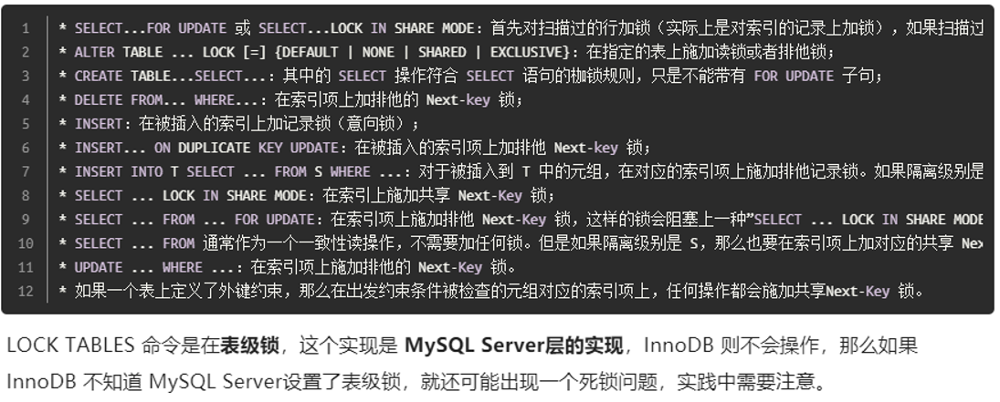

1、mysql 有哪些锁
一、整体分类框架

MySQL 锁分三大类：**全局锁、表级锁、行级锁**，InnoDB 重点是行锁 + 衍生的间隙锁/临键锁。

二、1. 全局锁

作用

锁定整个数据库实例，所有库表只读，一般用于**全库逻辑备份**。

语法

```sql
FLUSH TABLES WITH READ LOCK;  -- 加全局读锁
UNLOCK TABLES;                -- 解锁
```

特点

1. 加锁后：**所有写操作阻塞**（增删改、DDL），读正常执行。
2. 风险：长时间持有会阻塞业务写入，线上慎用。
3. 替代方案：`mysqldump --single-transaction`（InnoDB 靠 MVCC 热备，不用全局锁）。

三、2. 表级锁（锁整张表）

粒度粗、开销小、并发低，MyISAM 默认使用，InnoDB 也支持。
分 **表读锁（S）、表写锁（X）、元数据锁 MDL**。

## （1）表共享读锁（S 锁 / 读锁）

- 兼容：**多个会话可同时加 S 锁**，互不阻塞。
- 互斥：持有 S 锁时，其他会话**加不了写锁、不能写数据**。
- 语法：`LOCK TABLES 表名 READ;`

## （2）表排他写锁（X 锁 / 写锁）

- 互斥：**独占锁**，一个会话加 X 锁后，其他会话读、写全部阻塞。
- 语法：`LOCK TABLES 表名 WRITE;`

## （3）MDL 元数据锁（Metadata Lock）

### 核心要点

1. **默认隐式加锁**，无需手动操作，访问表自动触发。
2. 作用：保护表结构，防止**查询/修改数据时，表被 DDL 篡改**。
3. 分类：
   - **MDL 读锁**：执行 `SELECT/DML` 自动加，**共享兼容**，多会话同时持有。
   - **MDL 写锁**：执行 `ALTER TABLE` 等 DDL 加，**排他**。
4. 经典问题：
   长事务持有 MDL 读锁 → DDL 拿不到写锁阻塞 → 后续所有读写排队，引发库卡死。
5. 排查：`show processlist` / 查看 MDL 等待状态。

---

四、3. 行级锁（InnoDB 专属，粒度最细、并发最高）

**仅 InnoDB 支持**，锁定表中**单行/多行**，基于索引实现（无索引会降级为表锁）。
行锁只在**当前读**场景触发：`SELECT ... FOR UPDATE / LOCK IN SHARE MODE`、`UPDATE`、`DELETE`。

（1）行共享锁（S 锁，共享读锁）

语法：

```sql
SELECT * FROM t WHERE id=1 LOCK IN SHARE MODE;
```

- 规则：
  1. 多个事务可同时对同一行加 S 锁。
  2. 持有 S 锁时，其他事务**不能对该行加 X 锁、不能修改数据**。

（2）行排他锁（X 锁，排他写锁）

语法：

```sql
SELECT * FROM t WHERE id=1 FOR UPDATE;
UPDATE t SET name='a' WHERE id=1;
DELETE FROM t WHERE id=1;
```

- 规则：
  1. 独占锁，同一行**只能有一个事务持有 X 锁**。
  2. 阻塞其他事务的 S 锁、X 锁、数据修改。

> 补充：行锁兼容性矩阵
>
> | 当前锁\\请求锁 | S锁 | X锁 |
| --- | --- | --- |
| S锁 | 兼容 | 阻塞 |
| X锁 | 阻塞 | 阻塞 |

---

五、4. InnoDB 特殊锁（解决幻读核心，RR 隔离级别重点）

基于行锁延伸，**临键锁（Next-Key Lock）、间隙锁（Gap Lock）、记录锁（Record Lock）**，三者是递进关系。

1）记录锁 Record Lock

- 只锁**存在的索引行**，精准锁定单条记录。
- 场景：等值查询命中**唯一索引/主键**，查询到数据时触发。
- 作用：阻止其他事务修改、删除该行。

## 2）间隙锁 Gap Lock

- 锁定**索引记录之间的空隙**（不锁记录本身）。
- 场景：等值查询**未命中数据**、范围查询，RR 级别自动触发。
- 核心作用：**阻止其他事务在间隙内插入新数据，防范幻读**。
- 特点：间隙锁**之间互相兼容**，多个事务可同时持有同一间隙的锁。

## 3）临键锁 Next-Key Lock（默认锁）

- InnoDB RR 级别**默认行锁算法**，是 **记录锁 + 间隙锁** 的结合体。
- 锁定范围：**当前记录 + 左侧间隙**，左闭右开区间。
- 触发场景：范围查询、普通索引等值查询命中数据。
- 目的：彻底封堵插入入口，最大程度防止幻读。

### 三者转化规则（面试高频）

1. 主键/唯一索引 + 等值查询 + 命中数据 → **降级为 记录锁**
2. 主键/唯一索引 + 等值查询 + 未命中数据 → **降级为 间隙锁**
3. 普通索引 / 范围查询 → **使用 临键锁**

---

# 六、补充：意向锁（表级别辅助锁）

### 作用

InnoDB 为了**快速判断表锁与行锁是否冲突**，引入的表级意向锁，**不阻塞读写**，仅做标记。
分为两种：

1. **意向共享锁 IS**：事务要对表中某行加 S 锁，先在表上加 IS 锁。
2. **意向排他锁 IX**：事务要对表中某行加 X 锁，先在表上加 IX 锁。

### 规则

- 意向锁之间**完全兼容**（IS+IS、IS+IX、IX+IX 都不阻塞）。
- 意向锁和普通表锁互斥：
  - 表已存在 IS/IX 锁 → 其他会话无法加**表写锁(X)**。
  - 表已加表读锁(S)/表写锁(X) → 其他会话无法加 IS/IX。

---

# 七、各类锁对比 & 面试速记

| 锁类型 | 粒度 | 并发 | 适用引擎 | 核心场景 |
| --- | --- | --- | --- | --- |
| 全局锁 | 整实例 | 极低 | 所有引擎 | 全库备份 |
| 表级锁(S/X) | 整张表 | 低 | MyISAM/InnoDB | 临时管控、无索引场景 |
| MDL锁 | 整张表 | 中 | InnoDB | 防 DDL 篡改表结构 |
| 行锁(S/X) | 单行/多行 | 高 | InnoDB | 常规 DML、当前读 |
| 意向锁(IS/IX) | 整张表 | 不阻塞 | InnoDB | 辅助判断行锁与表锁冲突 |
| 记录锁 | 单行 | 高 | InnoDB(RR) | 主键/唯一索引等值命中 |
| 间隙锁 | 索引间隙 | 高 | InnoDB(RR) | 防幻读、等值未命中 |
| 临键锁 | 记录+间隙 | 高 | InnoDB(RR默认) | 范围查询、普通索引 |

### 关键结论背诵

1. InnoDB 行锁**依赖索引**，无索引 → 行锁降级为表锁，并发骤降。
2. RR 级别靠 **临键锁+间隙锁** 解决**当前读场景下的幻读**。
3. 间隙锁只在 RR 存在，RC 隔离级别**关闭间隙锁**，幻读会出现。
4. 意向锁是“标记锁”，本身不阻塞业务，只用于加速锁冲突检测。

2、各种锁是如何实现的
结合 MySQL/InnoDB 底层实现，按锁分类逐一讲**存储结构、加锁逻辑、冲突检测、释放时机**，偏向面试+原理，精简易懂。

# 一、全局锁

## 实现原理

1. **全局标记位**
   实例内部维护一个全局状态标识，执行 `FLUSH TABLES WITH READ LOCK` 时，将该标记置为**全局只读**。
2. **阻塞逻辑**
   - 标记生效后，所有写请求（DML/DDL）检测到该状态，直接进入等待队列；
   - 读请求正常执行。
3. **释放**
   执行 `UNLOCK TABLES`、客户端断开连接、实例重启，清除全局只读标记。
4. 补充
   不属于引擎层锁，是 **Server 层** 实现，所有存储引擎共用。

---

# 二、表级锁（S/X 表锁 + MDL 元数据锁）

## 1. 普通表 S/X 锁（`LOCK TABLES`）

### 实现

1. 每张表在 Server 层维护**表锁结构体**，记录：锁类型(S/X)、持有会话、等待队列。
2. 兼容规则：
   - 多会话可共存 **S 锁**；
   - **X 锁** 独占，互斥所有 S/X 锁。
3. 加/释放
   - 手动 `LOCK TABLES` 加锁；`UNLOCK TABLES`、会话断开、新锁请求覆盖时释放。
   - 同样是 **Server 层** 实现，MyISAM 主力使用，InnoDB 也兼容。

## 2. MDL 元数据锁（Metadata Lock）

### 核心实现（Server 层）

1. 内存维护**MDL 锁队列**，按「库+表」维度管理，分 **MDL 读锁(共享)**、**MDL 写锁(排他)**。
2. 触发规则（隐式加锁，无需手动）
   - 执行 `SELECT/INSERT/UPDATE/DELETE`：加 **MDL 读锁**（共享，多会话兼容）；
   - 执行 `ALTER/DROP/CREATE TABLE`：加 **MDL 写锁**（排他）。
3. 阻塞逻辑
   - 表上存在 MDL 读锁 → MDL 写锁排队等待；
   - 已有 MDL 写锁 → 所有读写请求排队。
4. 释放时机
   - **事务结束（commit/rollback）** 才释放 MDL 读锁；
   - DDL 执行完成立即释放 MDL 写锁。

> 经典问题：长事务不提交 → MDL 读锁不释放 → DDL 卡死。

---

# 三、意向锁 IS/IX（InnoDB 表级辅助锁）

### 定位

InnoDB **引擎层** 实现，纯**标记锁**，不阻塞正常读写，只为快速判定「表锁与行锁」是否冲突。

### 实现逻辑

1. 每张 InnoDB 表，在内存中维护意向锁标记位（IS / IX）。
2. 加锁流程（固定顺序）
   事务要给某一行加 **行 S 锁** → 先给表加 **IS 意向共享锁**；
   事务要给某一行加 **行 X 锁** → 先给表加 **IX 意向排他锁**。
3. 兼容规则
   - IS、IX 之间**全部兼容**，互不阻塞；
   - 表已存在 IS/IX：禁止再加**表级 X 写锁**；
   - 表已有表级 S/X 锁：禁止再加 IS/IX。
4. 释放
   事务提交/回滚时，连同行锁一起释放。

---

# 四、行锁（Record S/X 锁）InnoDB 引擎层

### 核心前提

行锁**依托索引实现**，锁信息记录在**索引页 + 事务系统**中；无索引时，行锁退化为表锁。

## 1. 存储载体

1. 每条索引记录的**行头信息**中，保存锁标记、持有事务ID；
2. InnoDB 内存维护 **锁等待链表**：记录「持有锁的事务、等待锁的事务、锁类型、锁定索引记录」。

## 2. 加锁场景（仅当前读）

`SELECT ... FOR UPDATE/LOCK IN SHARE MODE`、`UPDATE`、`DELETE` 才会触发行锁。

- 行 S 锁（共享）：允许多事务同时读，阻塞行 X 锁；
- 行 X 锁（排他）：独占，阻塞所有行 S/X 锁。

## 3. 加锁&冲突检测

1. 遍历索引找到目标记录；
2. 检查该行行头锁状态：
   - 无锁 → 加对应 S/X 行锁；
   - 已存在互斥锁 → 当前事务进入**锁等待队列**；
3. 等待超时触发 `lock_wait_timeout`，抛出锁等待异常。

## 4. 释放时机

**事务提交 / 回滚** 统一释放行锁，不会中途释放。


iinnoDB存储引擎的行锁是通过锁住索引实现的，而不是记录。这是理解很多数据库锁问题的关键。 	 

 由于InnoDB特殊的索引机制，数据库操作使用主键索引时，InnoDB会锁住主键索引；使用非主键索引时，InnoDB会先锁住非主键索引，再锁定主键索引。

---

# 五、间隙锁 Gap Lock / 临键锁 Next-Key Lock（RR 级别专属）

三者本质是**行锁的范围变种**，InnoDB 引擎层实现，作用于**索引区间**。

## 1. 基础概念与存储

- 锁对象：**索引区间（间隙）**，不是单条记录；
- 锁信息：记录在**索引页的元数据 + 全局锁链表**中，标记锁定的索引范围。

## 2. 临键锁（Next-Key Lock）RR 默认算法

1. 本质：`记录锁 + 左侧间隙锁`，锁定 **左闭右开** 的索引区间。
2. 触发：普通索引查询、范围查询。
3. 实现效果：区间内**不能新增、修改、删除**数据，从根源阻挡幻读。

## 3. 降级规则（高频考点）

1. **主键 / 唯一索引 + 等值查询 + 命中数据**
   临键锁 → 降级为 **纯记录锁**（只锁当前行，不锁间隙）。
2. **主键 / 唯一索引 + 等值查询 + 未命中数据**
   临键锁 → 降级为 **纯间隙锁**（只锁空隙，防止插入）。

## 4. 间隙锁特殊规则

- 间隙锁**互相兼容**：多个事务可以同时锁定同一个间隙；
- 仅作用于 **RR 隔离级别**；RC 级别关闭间隙/临键锁。

## 5. 释放

和行锁一致：事务结束才释放。

---

# 六、整体分层总结（Server层 / InnoDB引擎层）

1. **Server 层实现**
   全局锁、普通表 S/X 锁、MDL 元数据锁
2. **InnoDB 引擎层实现**
   意向锁(IS/IX)、行S/X锁、记录锁、间隙锁、临键锁

---

# 七、面试精简背诵版

1. **全局锁/表锁/MDL**：Server 层标记位+队列实现，按库/表维度管控；MDL 事务结束才释放，长事务易阻塞 DDL。
2. **意向锁**：InnoDB 表级标记锁，加速表锁与行锁的冲突判断，本身不阻塞读写。
3. **行锁**：依托索引，锁信息存在索引行头与内存锁链表；无索引降级为表锁，事务结束释放。
4. **间隙/临键锁**：RR 级别索引区间锁，由临键锁按需降级而来，用于防幻读，RC 下失效。


一致性非锁定读和锁定读是什么？有什么区别

	锁定读
		在一个事务中，标准的SELECT语句是不会加锁，但是有两种情况例外。SELECT ... LOCK IN SHARE MODE 和 SELECT ... FOR UPDATE。
			SELECT ... LOCK IN SHARE MODE
			给记录加上共享锁，这样一来的话，其它事务只能读不能修改，直到当前事务提交
			SELECT ... FOR UPDATE
			给索引记录加锁，这种情况下跟UPDATE的加锁情况是一样的
	一致性非锁定读
consistent read （一致性读），InnoDB用多版本来提供查询数据库在某个时间点的快照。如果隔离级别是REPEATABLE READ，那么在同一个事务中的所有一致性读都读的是事务中第一个这样的读读到的快照；如果是READ COMMITTED，那么一个事务中的每一个一致性读都会读到它自己刷新的快照版本。Consistent read（一致性读）是READ COMMITTED和REPEATABLE READ隔离级别下普通SELECT语句默认的模式。一致性读不会给它所访问的表加任何形式的锁，因此其它事务可以同时并发的修改它们。


普通的读写会加锁吗

	非事务中的锁，普通锁
		手动加锁分为：悲观锁和乐观锁。估计是傻B式的加锁（结果是：从操作员读出数据、开始修改直至提交修改结果的全过程，甚至还包括操作 员中途去煮咖啡的时间，可能忘记解锁）。
		自动加锁：一般MYSQL在执行CREATE,ALTER,INSERT等命令时会自动加锁
	
	事务中的锁
		事务的四个隔离级别，对应不同的锁机制：
		隔离级别：Read Uncommitted（读取未提交内容）、Read Committed（读取提交内容）、Repeatable Read（可重读）、Serializable（可串行化） 
		
		（Repeatable Read和Serializable）2个事务隔离级别是不需要手动加锁的，我认为在这2个事务级别中加锁是没有意义的，因为其他会话的事务是无法取得这2种事务中执行的数据的。（Repeatable Read和Serializable）获取的永远是原始数据。
		
		（Read Uncommitted、Read Committed）2个事务隔离级别可以手动加锁，因为这2种级别可能出现（脏读、不可重复读之类的“假数据”），所以在必要的时候进行手动加锁是不错的选择，我暂时是这样理解的。

InnoDB存储引擎的锁算法的一些规则如下所示，后续章节会给出对应的实验案例和详细讲解。
	• 在不通过索引条件查询时，InnoDB 会锁定表中的所有记录。所以，如果考虑性能，WHERE语句中的条件查询的字段都应该加上索引。
	• InnoDB通过索引来实现行锁，而不是通过锁住记录。因此，当操作的两条不同记录拥有相同的索引时，也会因为行锁被锁而发生等待。
	• 由于InnoDB的索引机制，数据库操作使用了主键索引，InnoDB会锁住主键索引；使用非主键索引时，InnoDB会先锁住非主键索引，再锁定主键索引。
	• 当查询的索引是唯一索引(不存在两个数据行具有完全相同的键值)时，InnoDB存储引擎会将Next-Key Lock降级为Record Lock，即只锁住索引本身，而不是范围。
	• InnoDB对于辅助索引有特殊的处理，不仅会锁住辅助索引值所在的范围，还会将其下一键值加上Gap LOCK。
	• InnoDB使用Next-Key Lock机制来避免Phantom Problem（幻读问题）。

在RR隔离级别下，采用next-key lock加锁，在RC级别下，仅采用 record lock加锁。
因此，可以通过next-key lock，在应用层面实现唯一性检查。

mysql锁分为隐式锁和显式锁。当多个客户端并发访问同一个数据的时候，为了保证数据的一致性，数据库管理系统会自动的为该数据加锁、解锁，这种被称为隐式锁。

如何加锁?

	对SELECT进行加锁的方式有两种，如下：
		a. SELECT ... LOCK IN SHARE MODE       #共享锁，其它事务可读，不可更新
		b. SELECT ... FOR UPDATE       #排它锁，其它事务不可读写
	这两种语句只有在事务之中才能生效，否则不会生效（todo 确认）
	对于UPDATE、DELETE、INSERT语句，InnoDB会自动给涉及数据集加排他锁(X) 


 

