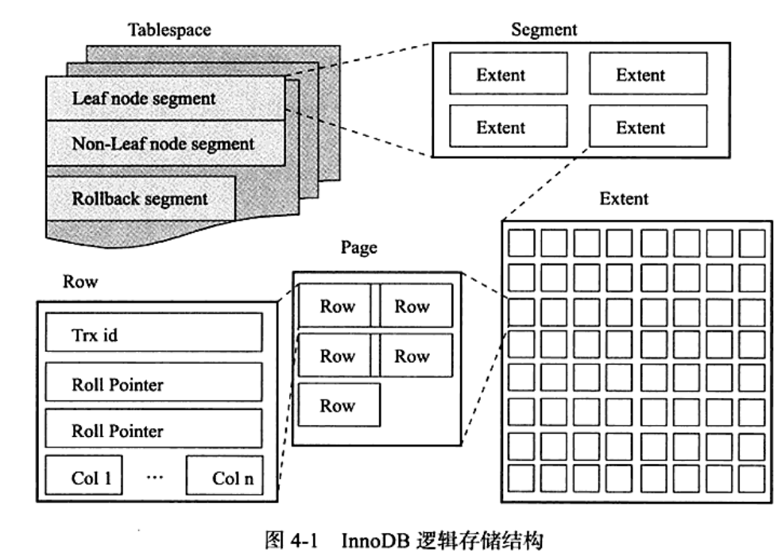

1、InnoDb逻辑存储结构

InnoDB 逻辑结构从上到下是：
表空间 → 段 → 区 → 页 → 行

1\. 表空间（Tablespace）
最大的逻辑单位，所有数据都存在表空间里。
分类
系统表空间：ibdata1（存储数据字典、undo、doublewrite 等）
独立表空间：ibd 文件（innodb_file_per_table=1，默认开启）
一个表一个 .ibd 文件
临时表空间：存储临时表、临时数据
undo 表空间：存储 undo log
作用
管理所有表、索引、数据、日志的存储容器。

1. 段（Segment）
   表空间的下一级，一个索引 = 一个段。
   常见段：
   数据段：聚簇索引（叶子节点）
   索引段：二级索引（非叶子节点）
   回滚段：存储 undo log
   一句话：
   段 = 索引的存储容器。
2. 区（Extent）
   固定大小 = 1MB
   一个区 = 连续 64 个页
   （因为一页 16KB，16KB×64=1MB）
   特点：
   连续物理空间
   减少磁盘随机 I/O
   段不够空间时，一次申请 1\~ 多个区
   作用：
   保证数据连续存储，提升顺序读写性能。
3. 页（Page）
   InnoDB 最小的 I/O 单位！！！
   默认大小 16KB
   常见页类型
   数据页（index page）—— 存行数据
   undo 页
   系统页
   事务数据页
   位图页
   关键点
   MySQL 读写数据以页为单位
   即使只取 1 行数据，也要加载整页 16KB 到 Buffer Pool
   页是 InnoDB 最核心的结构
4. 行（Row）
   最小的逻辑单位，存储真实的行数据。
   一行包含：
   真实字段数据
   隐藏字段：trx_id、roll_pointer
   行头信息

三、最核心的关系（必须背）
1 个表空间 = N 个段
1 个段 = N 个区
1 个区 = 64 个连续页（1MB）
1 个页 = 16KB = N 行数据

四、一句话总结（面试满分）
InnoDB 逻辑结构：表空间包含段，段包含区，区包含页，页包含行；
页是最小 I/O 单位，区是连续空间，段对应索引，表空间是最大容器。

**数据页是什么?**

B+树是怎么存储的？

下图中 3和9是区间分界点，小于3 的都在p1这个指针下的子节点，>=3和<9的数据在p2这个指针对应的子节点，>=9的数据在p3这个指针对应的子节点

# 6. B+树是怎么存储的？

**核心回答：**

B+树按**页（Page）**为单位在磁盘上存储，每个节点对应一页，非叶子节点只存索引键，叶子节点存完整数据行，叶子之间用双向链表串联。

InnoDB 最小磁盘读写单位 = 数据页，默认固定 16KB，MySQL 不会单行读写数据，**一次只读写一整页**。

**存放内容**

- 叶子页：真实表数据、索引行
- 非叶子页：**索引键 + 子页地址（B + 树分支，**子节点指针
  ），每个节点对应一页，节点存储的是索引的值，**非叶子节点的键值，理解成「子节点的区间上限」**， 是「区间分界点」

**底层原理：**

1. InnoDB **每页默认16KB** ， **B+树的每个节点就是一页**
2. 非叶子节点（索引页）：**只存索引键值**+**子节点页号指针**，不存数据，子节点指针指向的是子节点，**子节点的值都是在当前指针所在区间值范围之间**，**指针越小、索引键越短，一个节点能存的键值对就越多 → 扇出越大 → 树越矮 → 查询越快。**
3. 叶子节点（数据页）：聚簇索引存完整数据行，二级索引存索引列+主键值
4. 同一层的叶子节点通过双向链表串联，支持范围查询和顺序扫描
5. 根节点常驻内存，查询时只需对非根节点做磁盘IO
6. 三层B+树（假设扇出1000） **可索引约10亿条记录** ，仅需3次IO

**B + 树层级：根层 (1 层)→中间层 (2 层)→叶子层 (3 层)扇出 = 单个节点最大子节点数**

- 1 层根节点：最多分出 1000 个子节点
- 2 层中间节点：总计 (1000 \\times 1000 = 1000000) 个节点
- 3 层叶子节点：总计 (1000 \\times 1000 \\times 1000 = \\boldsymbol{10亿}) 条数据

公式：总容量 = 扇出 ^ 树层数

指针越小、索引键越短，一个节点能存的键值对就越多 → 扇出越大 → 树越矮 → 查询越快。

**为什么要这么设计？**

- 非叶子节点不存数据：能让节点变得很小，单个节点能存更多的键值，扇出更大，树的高度更低，磁盘 IO 更少
- 叶子节点存有序数据：聚簇索引能直接拿到数据；二级索引能快速定位主键，再通过主键索引拿数据，兼顾了查找效率和数据一致性

**一句话总结：**

B+树以页为存储单位，非叶子只存键，叶子存数据，叶子链表串联，三层可索引10亿数据。

下图中 3和9是区间分界点，小于3 的都在p1这个指针下的子节点，>=3和<9的数据在p2这个指针对应的子节点，>=9的数据在p3这个指针对应的子节点

B + 树的非叶子节点（根节点、中间节点）里的数值，**本身不代表真实数据，而是用来划分区间的 “路标”。** **非叶子节点的键值，理解成「子节点的区间上限」**

看主键索引这部分：

根节点有：15、56、77  .  根节点的 15：表示「**所有小于等于 15 的数据，都在第一个子节点里**」，表示的是15<= 和< 56的数据都在这个节点

第二层节点有：15、20、49

叶子节点的键值：15、18、20、30、49、50…

# 6. 树什么时候分支（页分裂）？

MySQL InnoDB 的 B + 树 “分支”（页分裂）核心触发条件：数据页（16KB）空间满了，放不下新记录，才会分裂。下面把条件、时机、过程讲清楚。

**一、分裂的本质**

InnoDB 用 16KB 的页（Page） 作为 B + 树节点：

- 叶子页：存完整行数据（聚簇索引）或索引列 + 主键（二级索引）
- 内部页（非叶子）：只存索引键 + 子页指针，不存数据

**分裂 = 页满 → 开新页 → 数据均分 → 父页加索引 → 递归向上**

**二、什么时候分裂（触发场景）**

1\. 插入新记录（最常见）

- 页已达到填充阈值（默认约 93.75%，16KB 用满 15KB 左右）
- 插入后记录数 / 空间超出页容量 → 分裂

2\. 更新导致记录变大

- 比如 VARCHAR 从短字符串更新为长字符串
- 原页剩余空间不够 → 分裂

3\. 无序插入（随机主键 / UUID）

- 自增主键：总是追加到最后一页，极少分裂（顺序写）
- 随机主键 / UUID：中间位置频繁插入，页快速填满且分裂更频繁、碎片多

**三、分裂的具体时机（判定规则）**

1. 叶子页：插入 / 更新后，空间不足（无法分配新记录）
2. 内部页：插入子页指针 + 索引键后，键数量 > 阶数 - 1（InnoDB 阶数由页大小决定，16KB 页通常允许几百个键）
3. 根节点：根页满了也会分裂，此时树高 + 1（B + 树长高仅发生在根分裂）

**四、分裂过程（极简版）**

1. 目标页满，分配新空白页
2. 找中间分裂点，原页留前半，后半移新页
3. 新记录插入原页或新页
4. 新页的最小键 + 页指针插入父页
5. 父页若满，重复 1–4，递归向上
6. 根分裂 → 新根产生，树高 + 1

**五、举例（直观理解）**

假设叶子页最多放 4 行： **[10,20,30,40]**

- **插入 50 → 满了，分裂：**
  - 原页：[10,20]
  - 新页：[30,40,50]
- **父页加键 30 指向新页**
- 父页若满，继续分裂父页

**六、关键结论**

- 不是按 “多少行” 固定分裂，而是按 “页空间是否满”
- 自增主键：分裂极少、性能好
- 随机主键：分裂频繁、碎片多、性能差
- 分裂是 B + 树维持平衡的必要机制，但会带来 I/O 开销

# 7. 什么是扇出？

**核心回答：**

**扇出是指B+树每个节点能容纳的子节点数量**，扇出越大，树越矮，查询IO越少。

**底层原理：**

1. 扇出 = 一个节点中索引键的数量，每个键对应一个子节点指针
2. 扇出取决于节点大小（一页16KB）和每个索引条目的大小
3. 扇出越大，每层能索引的数据量越多，整棵树的层数越少
4. 指针少（扇出小）的情况下要保存大量数据，只能增加树的高度，导致IO操作变多，查询性能变低

**一句话总结：**

扇出就是每个节点的分支数，扇出越大树越矮IO越少，扇出越小树越高查询越慢。

B+树在磁盘存储中的应用

主存和磁盘之间的数据交换不是以字节为单位的，而是以n个扇区为单位的（一个扇区有512字节）**，通常是4KB（8个扇区），8KB（16个扇区），16KB，……64KB为单位的。**

假设，我们现在选择4KB作为内存和磁盘之间的传输单位**，那么我们在设计B+树的时候，**不论是索引结点还是叶子结点都使用4KB作为结点的大小。

8  inndoDB 和MyISAM 有什么区别和特点

介绍下MySQL的WAL、LSN、Checkpoint 和作用

