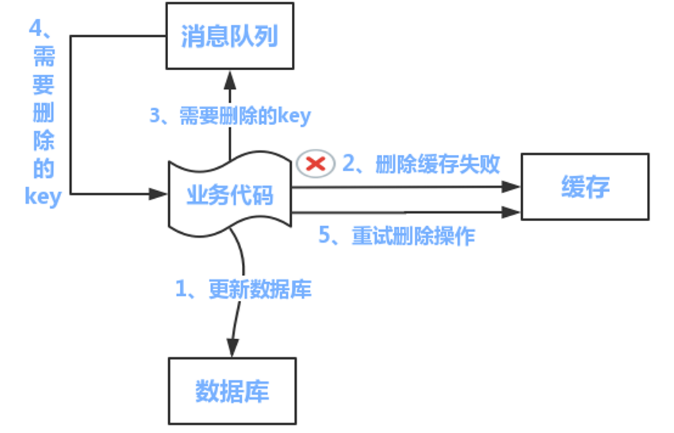
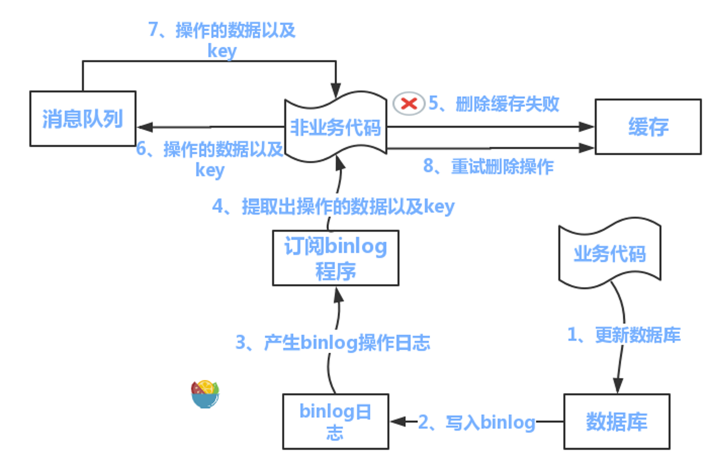

# 1. MySQL ES 数据一致性？各方案优缺点是什么？

业务场景：MySQL 是业务主库，ES 负责搜索/聚合/高亮查询，必须保证两边数据**实时或最终一致**，不出现脏数据、重复数据、丢失数据。生产中常常要求 MySQL 与 ES、Redis、HBase 做到秒级数据同步。

**可能的问题：**

**1、MySQL 和 ES 更新顺序错乱**

比如同一条数据连续更新两次：

- 第一次更新：价格从 100 改成 200；
- 第二次更新：价格从 200 改成 300；

如果同步 ES 时消息乱序：

- 第二次消息先被消费，ES 变成 300；
- 第一次消息后被消费，ES 又被覆盖成 200；

最终 ES 反而变成旧数据。

**2、消息丢失导致不一致**

如果使用 MQ 同步：

- MySQL 更新成功；
- 准备发送 MQ 消息；
- 服务宕机，消息没发出去；

那么 ES 永远不知道这条数据发生了变化。

**3、消费失败或重复消费**

MQ 消费 ES 更新时可能出现：

- 消费者处理失败；
- ES 写入超时；
- 消息被重复投递；
- 消费者重启后重复消费。

所以同步逻辑必须支持 幂等，不能因为重复消息导致数据异常。

**4、ES refresh 延迟**

ES 写入成功后，不一定立刻能被搜索到，因为 ES 默认是 **近实时搜索** 。

所以会出现：

- 写入 ES 成功；
- 立刻查询 ES 仍然查不到；
- 等 refresh 后才能查到。

这属于 ES 的 近实时特性，不是同步失败。

**5、删除数据不一致**

删除场景也容易出问题：

- MySQL 删除成功，ES 删除失败；
- MySQL 逻辑删除了，ES 仍然能搜到；
- ES 先删了，后续旧消息又把数据写回 ES。

所以删除通常也要带版本号或更新时间控制。

**实现方案：**

**方案一：同步双写**

写 MySQL 同时写 ES，代码耦合。

优点：

- 实现简单粗暴，实时写入能做到秒级

缺点：

- 业务耦合，代码侵入性强，每个写 MySQL 的地方都要加写 ES 的代码
- 影响性能，写入两个存储响应时间变长，MySQL 性能本身不高再加 ES 必然下降
- 不便扩展，搜索需要聚合等个性化需求难以实现
- 高风险， **存在双写失败丢数据风险**
- **企业基本不用**

**方案二：异步消息队列（最常用、最稳定）**

业务操作 MySQL 成功后，发送消息到 MQ（RocketMQ/Kafka），消费端异步同步到 ES。生产场景一般会有一个搜索服务，由搜索服务订阅商品变动的消息来完成同步。

优点：

- 解耦、不影响主业务、削峰、可重试
- 性能高，不易丢数据，基于 MQ 消费保障机制，ES 宕机或写入失败可重新消费
- 多源写入相互隔离，便于扩展更多数据源写入

保证一致性手段：

- 消息**持久化**，不丢数据
- 消费**幂等**，重复消费不重复写入
- 消费失败**重试 + 死信队列**
- 消息**顺序消费**，保证更新时序正确

缺点：

- 硬编码问题，接入新数据源需要实现新的消费者代码
- 系统复杂度增加，引入了消息中间件
- MQ 是异步消费模型，用户写入的数据不一定马上看到，造成延时

**方案三：定时任务补偿（最终一致性兜底）**

定时扫描 MySQL 增量数据（时间戳/标记位），比对 ES，差异数据自动修复。

优点：

- 实现比较简单

缺点：

- 实时性难以保证
- 对存储压力较大

作用：解决消息丢失、消费失败、异常场景的**最终一致**。

增量数据可用定时任务处理：表中增加 timestamp 字段，CURD 操作自动更新时间戳；定时程序按周期扫描变化数据，逐条写入 ES。

**方案四：基于 binlog 订阅（Canal/Debezium，企业级最佳）**

监听 MySQL binlog 日志，解析增量数据，自动同步到 ES。Canal Server 伪装成 slave 节点， **接收 binlog 后发送到 MQ，其他存储消费 MQ 中** 的 binlog 日志实现数据订阅。

整体架构：**MySQL Binlog → Canal Server → MQ → 消费端 → ES**

优点：

- 业务**0 侵入**，降低了商品服务的入侵性
- 完全实时，实时性更好
- 不影响业务性能
- 数据强有序、不漏不重

一致性保障：

- binlog 完整记录所有增删改
- 同步组件**断点续传**
- 支持**幂等更新**

**一、如何解决 Binlog 链路消息丢失问题**

丢失分三个环节：Canal 丢 Binlog、MQ 丢消息、消费端丢消息，分层做**持久化 + 位点记录**。

- 防止 Canal 层面丢失 Binlog
  - Canal 伪装 MySQL Slave，核心靠**位点持久化**保证断点续传：默认将 MySQL binlog filename + position 持久化到本地文件（默认 meta.dat），宕机/重启后从上次消费位点继续拉取，不会从头消费也不会漏数据，生产推荐配置 `canal.instance.persistence.mode = FILE`
  - **MySQL 端 Binlog 保留策略**：设置 `expire_logs_days` 保证 Binlog 留存时长 > Canal 故障恢复最长时间，避免 Canal 宕机太久 MySQL 已删除对应位点 Binlog 导致数据永久丢失
  - **Canal 集群高可用**：主备部署，Master 挂掉后 Slave 自动接管继续同步位点，单点故障不丢数据
- 防止 MQ 层面消息丢失
  - **Kafka 方案**：生产者分区副本数 ≥2、`acks=all` 所有副本落盘后才返回成功、开启重试；Broker 开启日志刷盘（`flush.messages=1` 或定时刷盘）；消费者**手动提交 offset**，必须等 ES 写入成功后再提交 Kafka 偏移量
  - **RocketMQ 方案**：生产者同步发送、开启重试；消费者**关闭自动 ACK、手动 ACK**，消费成功才确认，失败则消息重回队列
  - **禁忌**：消费端开启自动 ACK，会出现「消息发出去、ES 没写完但 MQ 已标记消费完成」，直接丢数据
- 防消息丢失核心规则：Canal 持久化 Binlog 位点 + MySQL 合理保留 Binlog；MQ 生产者强落盘 + 消费者手动 ACK/手动提交偏移量；**全链路不主动丢弃任何异常消息**

**二、消费端写入 ES 失败如何处理**

写入失败分：瞬时故障（网络、ES 抖动）、业务异常（字段非法、版本冲突）、ES 宕机，分层**重试 + 死信 + 幂等**。

- **失败分级重试**：可重试异常（网络超时、ES 连接断开、集群繁忙、限流）→ 本地有限重试加退避策略（1s→3s→5s…）；不可重试异常（字段类型不匹配、文档路由错误、主键非法）→ 直接进入死信队列，避免无限阻塞
- **死信队列（DLQ）兜底**：所有重试多次仍失败的消息转发到独立死信 Topic，业务侧人工排查修复（字段、映射、脏数据），修复后手动重放死信消息保证数据不丢，死信消息落地日志便于追溯
- **ES 写入幂等设计**（防重复数据）：Binlog 增量日志重消费必然重复执行，必须做幂等
  - **方案一（最优）**：使用 **MySQL 主键作为 ES 文档 \_id**，INSERT 同 \_id 重复写入 ES 覆盖更新无重复文档，UPDATE 重复消费多次更新最终结果一致，DELETE 重复删除 ES 删不存在文档无报错天然幂等，这是同步链路标准幂等方案
  - **方案二**：基于 Binlog 唯一标识做幂等（多表/复杂场景），每条 Binlog 记录自带 binlog 文件名 + position + eventTime，拼接成全局唯一 ID 存入 ES 额外字段，消费前先判断是否已处理
- **事务与原子性**（防中间态脏数据）：单条 Binlog Event 不拆包；批量消费场景使用 ES Bulk API 搭配 bulk 失败重试 + 局部失败隔离；**禁止写一半 ES 再 ACK MQ，必须 ES 全写入成功后再 ACK MQ**
- 写入失败完整流程：消费 MQ 消息 → 解析 Binlog 数据 → 尝试写入 ES → 成功则手动 ACK MQ/提交 offset → 瞬时失败则退避重试 3\~5 次 → 重试成功则 ACK → 仍失败则转入死信队列 → 不可重试异常直接转入死信队列 + 告警

**三、如何保证数据同步顺序**

MySQL 事务/行变更强依赖顺序：INSERT → UPDATE → DELETE，乱序会导致 ES 数据错乱（先删后插、旧数据覆盖新数据）。

- 乱序根源：MQ 多分区/多消费线程并行消费、消费端多线程并发写 ES、消息重试后插队
- 方案一：**全局单分区 + 单线程消费**（小业务、低并发），所有 Binlog 消息发到 MQ 同一个分区，单线程消费单线程写 ES，绝对有序实现简单，但吞吐量低无法横向扩容
- 方案二：**按 MySQL 主键哈希分区**（生产主流，有序 + 高并发），同一行数据的 INSERT/UPDATE/DELETE 通过 `hash(MySQL主键ID) % 分区数` 路由到固定分区，MQ 分区内先进先出保证变更顺序，消费端一个分区对应一个消费线程不跨分区乱序；分库分表场景用分片键做分区路由逻辑一致
- 方案三：禁用 MQ 分区内无序特性，Kafka 保证分区内有序（原生特性），RocketMQ 使用普通顺序消息而非并发消息
- 方案四：**重试消息防插队**，失败重试消息发回原分区不转发到其他分区，不使用随机重试队列避免重试消息超前消费
- 方案五：**ES 端顺序兜底**，已用 MySQL 主键 = ES \_id，即使极端场景短暂乱序后到达的新数据会直接覆盖旧数据，最终 ES 数据和 MySQL 一致属于最终顺序一致兜底
- **禁止的错误做法**：多分区不做路由哈希、消费端开启多线程并发处理同一个分区消息、重试消息投递到随机分区

**方案五：ETL 工具**

MySQL 同步到 Redis/HBase/ES 或机房同步、主从同步等均可使用 ETL 工具。ETL（Extract-Transform-Load）将数据从来源端经过抽取、转换、加载至目的端。

常用工具：Databus、Canal、Otter、Kettle 等。以 Databus 为例，它是 LinkedIn 开源的低延迟、可靠、支持事务的数据变更抓取系统，特点包括：

- 多数据源：支持 Oracle 和 MySQL
- 可扩展、高度可用：能扩展到支持数千消费者和事务数据来源
- 事务按序提交：保持来源数据库中的事务完整性，按事务分组和提交顺序交付变更事件
- 低延迟：数据源变更完成后毫秒级内将事务提交给消费者，支持服务器端过滤
- 无限回溯：消费者支持无限回溯能力，不会对数据库产生额外负担

**面试口述版：**

核心链路是 **Canal 监听 binlog + MQ 异步消峰 + 定时任务校对兜底**。一致性保障核心手段：

- **幂等设计**：用 MySQL 主键作为 ES 文档 ID，重复同步不会乱
- **顺序保证**：同一条数据必须按 MySQL 执行顺序同步到 ES，避免旧数据覆盖新数据
- **失败重试**：同步失败自动重试，超过次数进入死信队列人工排查
- **全量/增量校验**：定时对比 MySQL 和 ES 数据条数、更新时间，自动修复不一致数据
- **分布式事务不推荐**：强一致性能损耗大，搜索场景最终一致即可

# 2. Redis 缓存和 MySQL 如何保障一致性？

**最终一致性优先，强一致性极少用**，业务主流用**先更库、后删缓存**方案，兼顾性能与数据一致。

**方案一：先更新 MySQL，再删除 Redis 缓存（最优主流）**

流程：

1. 修改数据库数据
2. 删除对应 Redis 缓存
3. 查询时自动回库查数据，重新写入缓存

优点：

- 并发冲突概率极低，性能好
- 实现简单，线上项目通用

缺点：极端异步延迟下短暂不一致，不影响绝大多数业务

**方案二：先删缓存，再更新数据库**

缺点：高并发极易出现**旧数据回填缓存**，一致性差，**不推荐**

**方案三：双写模式（同时更库 + 更缓存）**

流程：改库同时更新缓存

缺点：

- 缓存更新频繁，浪费性能
- 并发双写导致缓存脏数据，**禁止使用**

**方案四：延时双删（解决极端不一致）**

流程：

1. 删缓存
2. 更新 MySQL
3. 延迟一段时间**再次删除缓存**

适用：高并发强一致场景
缺点：有延迟，依赖休眠/定时任务

**更新失败兜底方案：**

- **重试机制**：删缓存失败，放入消息队列重试
- **过期兜底**：所有缓存统一加**TTL 过期时间**，就算不一致也会自动刷新
- **定时全量同步**：低峰期定时任务比对库与缓存，清理脏缓存

**查询流程：**

1. 先查 Redis
2. 命中直接返回
3. 未命中查询 MySQL
4. 写入 Redis 再返回

**强一致性实现（业务极少用）：**

- 分布式锁锁住读写操作，串行执行
- 读写都走数据库，缓存只做辅助
- 监听 MySQL Binlog，异步更新/删除缓存（大厂主流）

**面试精简口述版：**

日常业务优先使用**先更新数据库再删除缓存**方案，简单高效、并发问题最少。为防止删缓存失败，结合**消息队列重试**兜底，同时给所有缓存设置过期时间做最终兜底。高并发场景采用**延时双删**进一步降低脏数据概率。追求极致一致性则采用**Binlog 订阅**异步刷新缓存，强一致场景使用分布式锁串行读写。坚决不用先删缓存再改库、双写缓存这种容易出并发问题的方案。

# 3. 为什么先更新 MySQL 再删除 Redis 缓存是最优方案？

核心原因三句话：

1. **读多写少场景下，并发脏数据概率最低**
2. 不会出现**旧数据覆盖新缓存**的致命问题
3. 实现最简单、性能最高、线上最通用

**先删缓存再更库的致命缺陷：**

并发场景灾难流程：

1. 线程 A：先删掉缓存
2. 线程 B：立马查询，缓存空 → 查 MySQL **旧数据**
3. 线程 B：把**旧数据写回 Redis**
4. 线程 A：才更新完 MySQL 新数据

结果：缓存永久旧数据，一致性彻底崩。

**先更库再删缓存（安全）：**

正常流程：

1. 线程 A：更新 MySQL 为新数据
2. 线程 A：删除 Redis 旧缓存
3. 后续查询无缓存，自动查新库数据入缓存

**并发冲突只会出现短暂不一致，不会永久脏数据**。

极端情况：

1. A 更完库，**还没删缓存**
2. B 查到旧缓存返回

只存在**极短时间旧数据**，缓存一旦过期自动恢复，业务可容忍。

**相比双写缓存的优势：**

双写方案（改库同时改缓存）的问题：

- 频繁写接口频繁改缓存，**浪费 Redis 性能**
- 多线程同时写缓存，**互相覆盖乱序**
- 数据修改多字段，极易缓存更新不全

先更库后删缓存：**只删不更，无覆盖冲突**。

**面试口述版：**

优先选**先更新数据库再删除缓存**，第一是避免高并发下**读请求回填旧数据**造成永久脏缓存；第二该方案冲突只存在短暂瞬时不一致，业务完全能接受；第三实现简单、性能损耗小，搭配缓存过期时间兜底，绝大多数互联网业务都够用。

# **1. 缓存一致性问题**

缓存一致性问题，本质是**同一份业务数据同时存在于数据库和缓存两套存储中，但两边更新不是一个原子操作**，所以在某些时间窗口内，缓存和数据库可能出现不一致。

面试里我一般会先说明一点：缓存一致性通常不是追求强一致，而是追求**最终一致性**。因为 Redis 缓存的定位是提升读性能，数据库才是最终数据源，只要业务能接受短时间不一致，就通过合理的更新策略把不一致窗口控制在可接受范围内。

常见的不一致场景主要有几类：

- **先更新数据库，再更新缓存**：如果数据库更新成功，更新缓存失败，缓存里还是旧值；如果并发写入时两个线程交叉执行，还可能把旧数据覆盖成新缓存。
- **先更新缓存，再更新数据库**：如果缓存更新成功，数据库更新失败，后续读到的就是脏数据，这种方案一般不推荐。
- **先删除缓存，再更新数据库**：删除缓存后，如果还没来得及更新数据库，另一个线程读数据库旧值并回填缓存，数据库随后更新成功，缓存就长期变成旧值。
- **先更新数据库，再删除缓存**：这是生产里更常见的方案，但仍然不是绝对一致，如果数据库更新成功后删除缓存失败，旧缓存会继续存在；并发读写下也存在极小概率的旧值回填问题。
- **主从延迟或读写分离**：写主库成功后，如果读请求从从库加载数据再写入缓存，可能把从库旧数据写进缓存。
- **缓存过期和重建并发**：热点 key 过期后多个请求同时回源，某个慢请求可能把较早读到的旧值覆盖到缓存里。

常见解决思路是：

- **不推荐直接更新缓存，优先使用更新数据库后删除缓存**。删除缓存比更新缓存更稳，因为很多缓存值不是数据库单行原样映射，可能有聚合、排序、权限过滤等逻辑，直接更新容易出错。
- **标准流程是先更新数据库，再删除缓存**。这样数据库始终是准的，缓存被删除后，下一次读请求再从数据库加载新值并写回缓存。
- **删除缓存失败要有补偿机制**。比如把删除失败的 key 写入重试队列，或者基于 MQ、Canal 监听 binlog 异步删除缓存，保证最终能删掉旧缓存。
- **对强一致要求高的场景，不要依赖缓存读结果**。例如余额、库存扣减、订单状态流转，关键判断应以数据库或事务内数据为准，缓存最多做展示或加速。
- **给缓存设置合理 TTL**。TTL 是最终兜底，即使删除失败，旧缓存也不会永久存在；热点 key 可以配合逻辑过期、异步刷新，避免集中失效。
- **必要时使用延迟双删**。先删除缓存，更新数据库后再延迟删除一次，或者更新数据库后立即删一次、延迟再删一次，用来降低并发读把旧值回填缓存的概率，但它只能降低风险，不能保证强一致。
- **避免从延迟从库回填缓存**。写后短时间内读主库，或者回填缓存时强制查主库，防止把从库旧值写入 Redis。

如果面试官继续追问“为什么不是先删缓存再更新数据库”，可以这样回答：

- 先删缓存后更新数据库，中间有窗口期。
- 窗口期内如果有读请求发现缓存不存在，就会查询数据库旧值并写回缓存。
- 随后写请求把数据库更新成新值，但缓存里已经是旧值，而且可能一直到 TTL 过期才恢复。
- 所以相比之下，**先更新数据库再删除缓存的不一致窗口更小，是更常用的实践方案**。

如果面试官追问“先更新数据库再删除缓存有没有问题”，答案是有，但概率更低：

- 一个读请求缓存未命中，先查到数据库旧值。
- 这时写请求更新数据库并删除缓存。
- 读请求最后才把刚才查到的旧值写入缓存。
- 这个场景要求读请求比写请求更早查库、但更晚写缓存，发生概率相对低，可以通过延迟双删、版本号校验、短 TTL、逻辑过期等方式降低影响。

总结一句话：缓存一致性问题的核心不是让 Redis 和数据库做到事务级强一致，而是**明确数据库是最终事实源，通过“更新数据库后删除缓存 + 失败重试补偿 + TTL 兜底 + 必要时延迟双删”的组合，保证最终一致，并把短暂不一致控制在业务可接受范围内**。

# **2. 解决缓存一致性方案**

解决缓存一致性问题，首先要明确一个前提：**没有普适性的完美方案，只有适不适合业务场景的方案**。只要同时写数据库和缓存，就是双存储双写，两个操作不可能天然具备一个本地事务的原子性，中间一定存在失败、延迟和并发交错的窗口。

所以生产里通常不会要求 Redis 和 MySQL 做强一致，而是根据业务选择一致性等级：

- **强一致场景**：比如余额、库存扣减、支付状态、订单状态流转，关键判断不要依赖缓存，必须以数据库事务或强一致存储为准。
- **最终一致场景**：比如商品详情、用户基础信息、配置展示、列表页缓存，可以接受短时间旧数据，通过删除缓存、异步重试、TTL 兜底保证最终一致。
- **弱一致场景**：比如排行榜、计数、推荐结果，对实时性要求不高，可以通过定时刷新、异步刷新、批量重建缓存来处理。

常见方案主要有几类。

**第一种，更新数据库后删除缓存。**

这是最常用的 Cache Aside 模式：

- 读请求先读 Redis。
- Redis 未命中时读 MySQL。
- 读到数据后写入 Redis。
- 写请求先更新 MySQL。
- MySQL 更新成功后删除 Redis 缓存。

这个方案的优点是实现简单，数据库始终是最终事实源，删除缓存比更新缓存更稳，因为缓存内容可能是聚合结果，不一定能根据一次数据库更新准确重算。

它的问题是删除缓存可能失败，所以必须配合补偿机制：

- 删除失败时记录失败 key，放入本地重试队列或 MQ。
- 后台任务按次数、间隔、退避策略重试删除。
- 重试仍失败时告警，避免旧缓存长期存在。
- 给缓存设置 TTL，作为最后兜底。

**第二种，延迟双删。**

延迟双删一般用于降低并发读写导致旧值回填缓存的概率，典型流程是：

- 先删除缓存。
- 再更新数据库。
- 等待一小段时间后，再删除一次缓存。

也可以采用更新数据库后立即删除一次缓存，再延迟删除一次缓存。延迟时间要参考一次查询数据库并回填缓存的耗时，通常要大于这段读链路时间。

它的优点是能降低旧值回填概率，缺点也很明显：

- 延迟时间不好精确设置。
- 只能降低概率，不能保证强一致。
- 会增加一次额外删除操作和异步任务复杂度。

所以它适合对短暂不一致比较敏感、但又不需要绝对强一致的业务。

**第三种，监听 binlog 异步更新或删除缓存。**

这个方案是通过 Canal、Debezium 这类组件监听 MySQL binlog，感知数据库真实变更，再异步处理 Redis：

- 应用只负责写 MySQL。
- MySQL 写成功后产生 binlog。
- Canal 订阅 binlog，解析出变更表、主键和操作类型。
- 缓存同步服务根据变更内容删除 Redis key，或者重建 Redis 数据。

这个方案的核心价值是**把缓存一致性逻辑从业务代码中解耦出来**，尤其适合多个系统都会修改同一张表的场景。如果只在某一个业务服务里删缓存，其他服务改库时很容易漏删；监听 binlog 可以统一感知数据库变更。

但它也不是完美方案：

- binlog 消费有延迟，所以仍然是最终一致。
- Canal 或 MQ 故障会导致缓存同步滞后。
- 要处理消息重复、乱序、丢失、重试和幂等。
- 数据库变更到缓存 key 的映射关系要维护好，尤其是列表缓存、聚合缓存、多维查询缓存。

实际落地时，通常更推荐**监听 binlog 后删除缓存，而不是直接更新缓存**。因为删除缓存更通用，下一次读请求会自然从数据库加载新值；直接更新缓存容易受缓存结构、聚合逻辑和并发顺序影响。

**第四种，消息队列异步补偿。**

业务写库成功后，发送一条缓存删除消息到 MQ，由消费者异步删除缓存：

- 写请求更新 MySQL。
- 写成功后发送删除缓存消息。
- 消费者删除 Redis。
- 删除失败则重试消费，超过阈值进入死信队列并告警。

这个方案适合写入链路不想被 Redis 删除耗时影响的场景，也方便做削峰和重试。需要注意的是，必须保证写库和发消息之间的可靠性，常见做法是本地消息表、事务消息，或者通过 binlog 驱动消息，避免数据库写成功但消息没发出去。

**第五种，TTL 兜底和缓存重建控制。**

无论采用哪种方案，都建议给缓存设置合理过期时间，因为 TTL 是最终兜底：

- 删除缓存失败时，旧数据不会永久存在。
- 缓存同步链路异常时，TTL 到期后仍有机会重新加载新数据。
- 对热点 key 可以使用逻辑过期和异步刷新，避免物理过期导致缓存击穿。

同时，缓存重建时要控制并发：

- 热点 key 未命中时使用互斥锁，避免大量请求同时回源。
- 回填缓存时可以带版本号或更新时间，避免旧请求覆盖新缓存。
- 对写后读一致性要求高的请求，可以短时间内读主库，不走缓存或不走延迟从库。

如果面试中要总结，可以这样说：

- **最常用方案是更新数据库后删除缓存，再配合失败重试和 TTL 兜底**。
- **更复杂的场景可以通过 Canal 监听 binlog，统一删除或重建缓存**。
- **对删除失败、消息失败、Canal 延迟，要用 MQ、本地消息表、重试队列、死信告警等补偿机制保证最终一致**。
- **对强一致业务，不要把缓存当判断依据，关键读写必须落到数据库或强一致存储**。

一句话总结：缓存一致性不是靠某一个动作解决的，而是**根据业务一致性要求，在更新数据库后删除缓存、binlog 订阅、消息补偿、TTL 兜底、延迟双删和强一致读数据库之间做组合取舍，目标是保证最终一致，并把不一致窗口控制在业务可接受范围内**。

# **3. 缓存一致性问题方案对比**

| **方案名称** | **技术特点** | 优点 | 缺点 | 使用 | 场景说明 |  |  |
| --- | --- | --- | --- | --- | --- | --- | --- |
| 数据实时同步更新 | 强一致性,更新数据库同时更新缓存，使用缓存工具和AOP实现 | 数据一致性强，不会出现缓存雪崩问题 | 代码耦合，运行期耦合 ，影响正常业务 ，增加一致网络开销 | 银行 | 适合写操作频繁的细粒度缓存数据，数据一致性要求比较高场景，如:银行业务，证券交易；不适合写操作较少粗粒度数据； |  |  |
| 数据准实时更新 | 准一致性，更新数据库后，异步更新缓存，使用AOP进行封装基于多线程或者MQ实现 | 数据同步有较短延迟，与业务解耦，不影响正常业务，不会出现缓存雪崩问题 | 有较短延迟，无法保证最终一致性，需要补偿机制 | 比较优雅 | 不适合写操作平凡并且数据一致性实时性要求严格的场景(较短不一致，写频繁导致mq消息剧增) |  |  |
| 缓存失效机制 | 弱一致性，基于缓存本身失效机制 | 实现简单，与业务完美结合，不影响正常业务 | 有一定延迟，存在缓存雪崩问题 | 互联网大量使用 | 不适合写操作平凡并且数据一致性实时性要求严格的场景，适合读多写少的互联网婵娟，能接受一定数据延时；如：电商业务,理财金融(收益第二天更新),社交类业务(点赞)等 |  |  |
| 任务调度更新 | 最终一致性，采用任务调度框架，按照一定频率更新 | 不影响正常业务 | 不保证一致性，代码复杂度增大(么个value都要维护异步更新代码)，容易堆积垃圾数据 | 统计类 | 适合复杂统计类数据缓存更新，对数据一致性实时性要求低的场景，如统计类数据，BI分析等 |  |  |

# **4. 更新数据和缓存问题分析**

更新数据后，缓存处理主要有四种方案，每种方案都有其优点和问题，生产中需要根据业务场景选择。

**方案一：更新缓存，更新数据库（先更新缓存，再更新数据库）**方案**不推荐使用**

- **优点**：实现简单，缓存更新后立即生效，读请求能快速获取新数据。
- **问题**：如果先更新缓存成功，但数据库更新失败，会导致**缓存与数据库数据不一致**，且缓存中的新数据可能长期存在，直到缓存过期或被删除。
- 这种方案**不推荐使用**，因为数据库更新失败时无法回滚缓存。

**方案二：更新数据库，更新缓存（双写）**

- **优点**：逻辑直接，更新数据库后立即更新缓存，保证缓存与数据库同步。
- **问题**：在**并发更新场景下**，两个线程交叉执行更新操作，可能将旧数据覆盖到缓存。例如：线程A更新数据库为新值，线程B更新数据库为更新值，但线程A随后更新缓存为旧值，导致缓存脏数据。另外，如果缓存更新失败，需要补偿机制。

  

**方案三：删除缓存，更新数据库（先删缓存，再更新数据库）**

- **优点**：删除缓存比更新缓存更安全，因为缓存内容可能是聚合结果，删除后下次读请求会从数据库重新加载，避免直接更新缓存的复杂性。
- **问题**：在更新数据库之前，如果有查询请求发现缓存不存在，会查询数据库旧值并写回缓存，导致**脏数据被放入缓存**。例如：请求A删除缓存，请求B查询数据库旧值并写入缓存，随后请求A更新数据库为新值，缓存中仍是旧值，且可能长期存在。

  

**方案四：更新数据库，删除缓存（先更新数据库，再删除缓存）**

- **优点**：这是**最常用的Cache Aside模式**，数据库始终是最终事实源，删除缓存后下一次读请求会从数据库加载新值。相对其他方案，**不一致窗口更小**。
- **问题**：在更新数据库之前，如果有查询请求且缓存失效，会查询数据库旧值并准备写入缓存。如果在查询数据库和写入缓存之间，数据库被更新且缓存被删除，那么旧值会被写入缓存，导致脏数据。但这种场景发生概率较低，因为需要读请求比写请求更早查库但更晚写缓存。

  

**方案三和方案四的共同缺点：**

- **主从延时问题**：无论先删还是后删缓存，数据库主从延时可能导致从库旧数据被读取并写入缓存。
- **缓存删除失败**：如果缓存删除失败，旧缓存会持续存在，导致数据不一致。

**解决思路：**

- **延迟双删**：先删除缓存，更新数据库后延迟一段时间再删除一次缓存，降低并发读将旧值写入缓存的概率。延迟时间应大于一次数据库查询并回填缓存的耗时。
- **添加重试机制**：缓存删除失败时，将失败key放入重试队列或MQ，后台任务按退避策略重试删除，保证最终删除成功。
- **TTL兜底**：给缓存设置合理过期时间，即使删除失败，旧缓存也不会永久存在。

面试中通常推荐**先更新数据库，再删除缓存**，配合失败重试和TTL兜底，这是生产中最常用的方案。对强一致要求高的场景，如余额、库存扣减，应以数据库事务为准，不依赖缓存读结果。

# **5. 修改缓存还是淘汰缓存**

在数据更新时，选择**修改缓存**（更新缓存值）还是**淘汰缓存**（删除缓存）是常见的缓存更新策略问题。生产中通常推荐**淘汰缓存**，原因如下：

**修改缓存的缺点：**

- **计算复杂**：缓存值可能不是数据库单行数据的简单映射，可能涉及聚合、排序、计算等逻辑，每次更新都需要重新计算，容易出错。
- **并发风险**：在并发更新场景下，多个线程同时修改缓存，可能导致脏数据覆盖。例如：线程A更新数据库后修改缓存，线程B也更新数据库后修改缓存，但线程B的修改先执行，线程A的修改后执行，导致缓存值与数据库不一致。
- **一致性窗口**：修改缓存和更新数据库不是原子操作，中间存在不一致窗口。
- **数据类型决定修改成本**：
  - **朴素类型数据**（如数字、字符串）：可以直接set修改后的值，修改成本低。
  - **序列化后的对象**：需要先get数据，反序列化成对象，修改其中的成员，再序列化为binary，再set数据，修改成本高。
  - **json或html数据**：需要先get文本，parse成dom树对象，修改相关元素，序列化为文本，再set数据，修改成本高。

**淘汰缓存的优点：**

- **实现简单**：直接删除缓存key，无需关心缓存值的计算逻辑。
- **一致性更好**：删除缓存后，下一次读请求会从数据库加载最新数据，保证最终一致性。
- **并发安全**：多个线程同时删除缓存key，结果都是key不存在，不会产生脏数据。

**淘汰缓存的缺点：**

- **缓存击穿风险**：热点key被删除后，大量并发请求可能同时回源到数据库，造成数据库压力。可以通过互斥锁、逻辑过期等方式缓解。
- **缓存命中率下降**：删除缓存后，短时间内缓存命中率会降低，直到重新加载数据。

**适用场景：**

- **推荐淘汰缓存**：大多数场景，尤其是缓存值计算复杂、并发更新频繁的业务。对于对象类型或文本类型，修改缓存value的成本较高，一般选择直接淘汰缓存。
- **可考虑修改缓存**：仅当满足以下所有条件时：
  - **数据类型是朴素类型**：如数字、字符串，可以直接set修改后的值。
  - **修改逻辑简单**：更新数据库后，缓存值可以直接通过简单set操作更新，不需要额外查询其他表或复杂计算。
  - **读多写少，基本无写并发**：避免并发修改导致的脏数据问题。
  - **修改缓存开销较小**：相比增加一次cache miss的成本，修改缓存的成本更低。
- **决策依据**：如果修改缓存需要额外增加多个db、cache操作， **为避免一次cache miss而得不偿失，则应该淘汰缓存** 。
  例如：更新了某个表的一个字段，但对应的缓存需要查询另外两个表的数据并进行运算才能计算出最新值，这种情况应该淘汰缓存。
- **保守策略**：大部分情况，修改value的成本会高于"增加一次cache miss"，因此应该淘汰缓存。如果还在纠结，总是淘汰缓存，问题也不大。

**面试回答要点：**

- **推荐淘汰缓存**，因为实现简单、一致性好、并发安全。
- 淘汰缓存配合**失败重试**和**TTL兜底**，可以保证最终一致性。
- 对热点key，可以通过**互斥锁**、**逻辑过期**、**异步刷新**等方式缓解缓存击穿。
- 对强一致要求高的场景，如余额、库存扣减，应以数据库事务为准，不依赖缓存读结果。
- **按数据类型决策**：朴素类型数据修改成本低，可以考虑修改缓存；对象类型或文本类型修改成本高，应该淘汰缓存。
- **保守原则**：如果修改缓存需要额外增加多个db、cache操作，为避免一次cache miss而得不偿失，则应该淘汰缓存。大部分情况修改value的成本会高于"增加一次cache miss"，因此应该淘汰缓存。

总结：**优先选择淘汰缓存**，除非数据类型是朴素类型、修改逻辑简单、读多写少且基本无写并发，才考虑修改缓存。如果还在纠结，总是淘汰缓存，问题也不大。

# **6. 操作数据库还是先操作缓存**

操作数据库还是先操作缓存，本质上是选择哪种缓存读写模式。生产中最经典、最常用的模式是**Cache Aside Pattern（旁路缓存方案）**，其核心规则是：

**读操作：**

- 先读缓存，缓存命中则直接返回。
- 缓存未命中，就读数据库，取出数据后**放入缓存**，同时返回响应。

**更新操作：**

- **先更新数据库**，然后再**删除缓存**。

**为什么更新时要删除缓存而不是更新缓存？**

- **避免并发写导致脏数据**：如果两个线程同时更新数据库，然后更新缓存，可能后更新的线程先执行缓存更新，导致缓存值与数据库不一致。
- **缓存值可能不是简单映射**：缓存值可能是聚合结果，直接更新需要重新计算，复杂且易错。
- **删除缓存更简单安全**：删除后，下一次读请求会从数据库加载最新数据，保证最终一致性。

**Cache Aside Pattern 的优点：**

- **实现简单**：读写逻辑清晰，易于理解和实现。
- **一致性较好**：数据库是最终事实源，删除缓存后读请求会加载最新数据。
- **适用性广**：适合大多数读多写少的互联网业务。

**Cache Aside Pattern 的潜在问题：**

- **首次请求缓存未命中**：如果数据首次被访问，缓存中没有，需要回源数据库，可能造成数据库压力。可以通过缓存预热缓解。
- **更新数据库后删除缓存失败**：需要配合**失败重试**、**MQ**、**Canal监听binlog**等补偿机制。
- **并发读写窗口**：理论上存在极小概率的旧值回填问题，但实际业务中通常可接受。

**其他缓存读写模式：**

- **Read/Write Through（读写穿透）**：应用只与缓存交互，由缓存负责读写数据库。实现复杂，通常需要缓存中间件支持。
- **Write Behind Caching（异步写回）**：写操作只更新缓存，异步批量更新数据库。性能高，但数据一致性风险大，适合对一致性要求不高的场景。

**面试回答要点：**

- **首选Cache Aside Pattern**：读操作先缓存后数据库，更新操作先数据库后删缓存。
- **解释为什么删除缓存**：避免并发写导致脏数据，缓存值可能不是简单映射。
- **说明潜在问题及解决**：删除缓存失败需要重试补偿，热点key可以用互斥锁或逻辑过期。
- **对比其他模式**：Cache Aside Pattern实现简单、一致性好，是生产中最常用的方案。

总结：**操作数据库还是先操作缓存，取决于选择的缓存读写模式。生产中最常用的是Cache Aside Pattern：读时先缓存后数据库，更新时先数据库后删缓存。**

# **7. 为何删除缓存而非更新缓存**

在Cache Aside Pattern中，更新操作是**先更新数据库，再删除缓存**，而不是更新缓存。主要原因有以下几点：

**1. 避免并发写导致脏数据**

- **更新缓存的并发问题**：如果两个线程同时更新数据库，然后更新缓存，可能后更新的线程先执行缓存更新，导致缓存值与数据库不一致。例如：线程A将数据库从v1更新为v2，线程B将数据库从v2更新为v3，但线程B先更新缓存为v3，线程A后更新缓存为v2，导致缓存值是v2而数据库是v3。
- **删除缓存的并发安全性**：多个线程同时删除缓存key，结果都是key不存在，不会产生脏数据。下一次读请求会从数据库加载最新值。

**2. 缓存值可能不是简单映射**

- **计算复杂**：缓存值可能不是数据库单行数据的直接映射，可能涉及聚合、排序、多表关联、业务逻辑计算等。每次更新数据库都要重新计算缓存值，成本高且容易出错。
- **删除缓存更简单**：删除后，下一次读请求会从数据库加载数据并按照读时的逻辑构建缓存值，逻辑更清晰。

**3. 更新缓存的代价与 lazy 计算思想**

- **更新缓存代价高**：复杂场景下，更新一个缓存可能需要查询另外两个表的数据并进行运算才能计算出最新值。如果每次修改数据库都更新缓存，代价很高。
- **lazy 计算思想**：删除缓存而不是更新缓存，体现了 lazy 计算的思想——不要每次都重新做复杂的计算，不管它会不会用到，而是让它到需要被使用的时候再重新计算。
- **举例**：一个缓存涉及的表的字段，在 1 分钟内修改了 20 次，缓存也更新 20 次；但这个缓存在 1 分钟内只被读取了 1 次，有大量的冷数据。如果只是删除缓存，那么在 1 分钟内这个缓存不过就重新计算一次而已，开销大幅度降低，用到缓存才去算缓存。

**4. 实现简单，一致性更好**

- **更新缓存需要额外逻辑**：每次数据库更新都要同步更新缓存，需要保证缓存更新逻辑与读时构建缓存的逻辑一致，维护成本高。
- **删除缓存只需一个DEL命令**：实现简单，且保证下一次读请求能获取最新数据。

**5. 性能与一致性的权衡**

- **删除缓存可能带来缓存击穿**：热点key被删除后，大量并发请求可能同时回源到数据库。但可以通过**互斥锁**、**逻辑过期**、**异步刷新**等方式缓解。
- **更新缓存可能带来脏数据**：虽然更新缓存能保持缓存命中率，但并发场景下更容易产生不一致，且修复成本更高。

**6. 什么情况下可以考虑更新缓存**

- **缓存值计算极其简单**：如简单的计数器、状态标记，直接set新值即可。
- **写操作极少，读操作极多**：且能接受极小概率的不一致。
- **业务对缓存命中率要求极高**：删除缓存会导致短暂命中率下降，更新缓存能保持命中率。

**面试回答要点：**

- **核心原因**：避免并发写导致脏数据，缓存值可能不是简单映射。
- **删除缓存的优点**：实现简单、并发安全、一致性更好。
- **删除缓存的缺点**：可能带来缓存击穿，但可以通过互斥锁、逻辑过期等方式缓解。
- **更新缓存的适用场景**：仅当缓存值计算极其简单、写极少读极多、且能接受极小概率不一致时。

总结：**删除缓存比更新缓存更安全、更简单、一致性更好。更新缓存可能带来并发脏数据和计算复杂性问题，而删除缓存虽然可能带来短暂的缓存击穿，但可以通过技术手段缓解，整体风险更低。**

# **8. 为何先更新DB再删除缓存**

在Cache Aside Pattern中，更新操作的顺序是**先更新数据库，再删除缓存**，而不是先删除缓存再更新数据库。主要原因如下：

**1. 先删除缓存再更新数据库的问题**

- **脏数据回填风险**：先删除缓存后，如果在更新数据库之前有读请求，会查询数据库旧值并写入缓存，导致缓存中存入旧值。随后数据库更新成功，但缓存中仍是旧值，且可能长期存在。
- **不一致窗口大**：从删除缓存到更新数据库完成，这段时间内读请求都会读到旧数据并写入缓存，导致较长时间的数据不一致。
- **示例**：请求A删除缓存，请求B查询数据库旧值并写入缓存，请求A更新数据库为新值。此时缓存是旧值，数据库是新值，需要等待缓存过期或下一次更新才能恢复一致。

**2. 先更新数据库再删除缓存的优点**

- **不一致窗口小**：数据库更新成功后立即删除缓存，读请求会从数据库加载新值。不一致窗口仅存在于数据库更新成功到缓存删除完成之间，通常很短。
- **脏数据回填概率低**：需要读请求比写请求更早查库但更晚写缓存，这种时序在实际并发中概率较低。
- **生产实践验证**：这是业界广泛采用的方案，经过大量业务验证，可靠性高。

**3. 两种顺序的对比**

- **先删缓存再更新数据库**：不一致窗口大，脏数据回填概率高，对业务影响大。
- **先更新数据库再删除缓存**：不一致窗口小，脏数据回填概率低，对业务影响小。

**4. 延迟双删作为折中方案**

- **原理**：先删除缓存，更新数据库后再延迟一段时间删除一次缓存。延迟时间应大于一次数据库查询并回填缓存的耗时。
- **目的**：降低并发读将旧值写入缓存的概率。
- **缺点**：延迟时间不好精确设置，只能降低概率不能保证强一致，会增加一次额外删除操作。
- **适用场景**：对短暂不一致比较敏感，但又不需要绝对强一致的业务。

**5. 生产推荐**

- **首选先更新数据库再删除缓存**：实现简单，不一致窗口小，经过广泛验证。
- **配合失败重试**：如果删除缓存失败，需要重试机制保证最终删除成功。
- **TTL兜底**：给缓存设置合理过期时间，即使删除失败，旧缓存也不会永久存在。
- **强一致场景**：不要依赖缓存，关键判断应以数据库事务为准。

**面试回答要点：**

- **核心原因**：先删缓存会导致不一致窗口大、脏数据回填概率高；先更新数据库再删缓存不一致窗口小、更安全。
- **延迟双删**：作为折中方案，能降低但不能消除不一致风险。
- **生产推荐**：先更新数据库再删除缓存，配合失败重试和TTL兜底。
- **强一致场景**：以数据库事务为准，不依赖缓存。

总结：**先更新数据库再删除缓存比先删除缓存再更新数据库更安全，不一致窗口更小，脏数据回填概率更低。生产中推荐先更新数据库再删除缓存，配合失败重试和TTL兜底，保证最终一致性。**

# **9. 先更新db后删缓存问题解决方案**

更新数据库后删除缓存，可能因删除失败、主从延迟、并发读写等原因导致不一致。针对这些问题，主要有以下几种解决思路，各有优缺点。

**1. 延迟双删**

- **流程**：先删除缓存，再更新数据库，休眠一段时间后再次删除缓存。
- **原理**：第一次删除缓存后，如果有读请求将旧值写入缓存，第二次删除可以将其清理掉。延迟时间应大于一次读数据业务逻辑的耗时，确保读请求结束。
- **优点**：降低并发读将旧值写入缓存的概率，实现相对简单。
- **缺点**：
  - 延迟时间不好精确设置，只能降低概率不能保证强一致。
  - 会增加一次额外删除操作和异步任务复杂度。
  - 无法解决删除缓存失败的问题。
- **使用场景**：
  - **对短暂不一致敏感但不需要绝对强一致**：如电商商品详情页、用户信息展示，可以接受秒级不一致。
  - **读多写少，且读业务耗时可预估**：延迟时间容易设置，如读操作平均耗时100ms，延迟可设为200ms。
  - **系统架构简单，不想引入额外组件**：相比Canal/MQ方案，延迟双删实现成本低。
  - **示例**：商品库存展示、用户昵称更新、配置信息变更等场景。

**2. 添加重试机制**

- **流程**：删除缓存失败时，将失败key放入重试队列，后台任务按退避策略重试删除，直到成功。
- **实现方式**：
  - **本地重试队列**：将失败key写入本地队列，定时任务重试。
  - **MQ重试**：将失败key发送到MQ，消费者重试删除。
  - **Canal监听binlog**：监听数据库变更，异步删除缓存。
- **优点**：保证最终删除成功，避免脏数据长期存在。
- **缺点**：
  - 增加系统复杂度。
  - 重试期间仍存在不一致窗口。
  - 需要处理消息丢失、重复消费等问题。
- **使用场景**：
  - **删除缓存失败概率低但后果严重**：如金融交易、支付状态等关键数据，必须保证最终一致。
  - **系统已有MQ基础设施**：可以直接复用现有MQ，如Kafka、RocketMQ。
  - **对一致性要求高，但允许短暂不一致**：重试机制保证最终一致，但重试期间可能存在不一致。
  - **示例**：订单状态变更、账户余额更新、库存扣减等场景。

**3. 选择性读主**

- **流程**：
  - **写请求**：更新数据库后，将"db:table:PK"作为key设置到缓存，超时时间设置为"主从同步时延"。
  - **读请求**：先查询缓存，如果有这个key，说明1s内刚发生过写请求，主从同步可能未完成，此时读主库；如果没有key，说明最近没有写请求，可以读从库。
- **优点**：避免从从库读到旧数据，保证读到的数据一定不是脏数据。
- **缺点**：
  - 增加缓存操作和逻辑复杂度。
  - 写请求频繁时，缓存中会有大量key，可能占用额外内存。
  - 如果系统可以接收短时间不一致，建议使用定时更新缓存，避免系统过于复杂。
- **使用场景**：
  - **对读一致性要求极高**：如用户登录后立即查看个人信息，必须看到最新数据。
  - **写操作不频繁**：写请求少，缓存中不会积累太多key，内存占用可控。
  - **主从延迟较大且不可接受**：如主从延迟1秒以上，业务无法接受读到旧数据。
  - **示例**：用户资料修改后立即查看、订单状态变更后立即查询、支付完成后立即显示等场景。

4\. 删除失败写入消息队列重试

流程如下所示
（1）更新数据库数据；
（2）缓存因为种种问题删除失败
（3）将需要删除的key发送至消息队列
（4）自己消费消息，获得需要删除的key
（5）继续重试删除操作，直到成功
然而，该方案有一个缺点，对业务线代码造成大量的侵入。

**4. 监听binlog异步删除（Canal/Debezium）**

- **流程**：
  - 更新数据库数据。
  - 数据库将操作信息写入binlog日志。
  - 订阅程序（Canal/Debezium）提取出所需的数据和key。
  - 另起一段非业务代码，获得该信息，尝试删除缓存。
  - 删除失败时，将信息发送至消息队列，重新从消息队列中获得该数据，重试操作。
- **优点**：
  - 业务代码侵入性低。
  - 可以统一感知数据库变更，适合多个系统修改同一张表的场景。
  - 可以配合MQ保证最终删除成功。
- **缺点**：
  - 引入额外组件（Canal/MQ），系统复杂度增加。
  - binlog消费有延迟，仍然是最终一致。
  - 需要维护消息重复、乱序、丢失、重试和幂等。
- **使用场景**：
  - **多系统修改同一张表**：如订单表被订单系统、库存系统、物流系统同时修改，需要统一感知变更。
  - **业务代码侵入性要求低**：不想在业务代码中添加缓存删除逻辑。
  - **已有Canal/Debezium基础设施**：可以直接复用现有组件。
  - **对最终一致性要求高，允许秒级延迟**：binlog消费有延迟，但能保证最终一致。
  - **示例**：电商订单表、用户表、商品表被多个微服务修改的场景。

  

**5. 本地消息表**

- **流程**：写库和写消息表在同一个事务中，定时任务扫描消息表发送MQ，消费者删除缓存。
- **优点**：保证写库和发消息的原子性，避免数据库写成功但消息没发出去。
- **缺点**：增加数据库表和定时任务，系统复杂度高。
- **使用场景**：
  - **对可靠性要求极高**：如金融交易、支付状态等关键数据，必须保证写库和发消息的原子性。
  - **系统已有本地消息表模式**：可以直接复用现有模式。
  - **不想引入Canal等额外组件**：相比Canal方案，本地消息表不需要额外中间件。
  - **写操作频率不高**：定时任务扫描压力小，不会造成数据库压力。
  - **示例**：支付系统、转账系统、库存扣减等对可靠性要求极高的场景。

**优缺点对比：**

|  | **方案** | **优点** | **缺点** | **适用场景** |
| --- | --- | --- | --- | --- |
| 延迟双删 | 实现简单，降低旧值回填概率 | 延迟时间难精确，不能保证强一致 | 读多写少，读业务耗时可预估，对短暂不一致敏感但不需要绝对强一致，如商品详情页、用户信息展示 |  |
| 重试机制 | 保证最终删除成功 | 增加复杂度，重试期间存在不一致 | 删除缓存失败概率低但后果严重，系统已有MQ基础设施，对一致性要求高但允许短暂不一致，如订单状态、账户余额 |  |
| 选择性读主 | 避免读到旧数据 | 逻辑复杂，写请求频繁时缓存占用大 | 对读一致性要求极高，写操作不频繁，主从延迟较大且不可接受，如用户资料修改后立即查看 |  |
| 监听binlog | 业务侵入低，统一感知变更 | 引入额外组件，有延迟 | 多系统修改同一表，需要解耦，业务代码侵入性要求低，已有Canal/Debezium基础设施，如电商订单表、用户表 |  |
| 本地消息表 | 保证写库和发消息原子性 | 增加表和定时任务 | 对可靠性要求极高，系统已有本地消息表模式，不想引入Canal等额外组件，写操作频率不高，如支付系统、转账系统 |  |

**面试回答要点：**

- **延迟双删**：降低概率但不能消除不一致，延迟时间要大于读业务耗时。
- **重试机制**：保证最终删除成功，可以配合本地重试队列或MQ。
- **选择性读主**：避免从从库读旧数据，但增加复杂度。
- **监听binlog**：Canal/Debezium订阅binlog，异步删除缓存，业务侵入低。
- **本地消息表**：保证写库和发消息原子性，但增加复杂度。
- **根据业务选择**：没有完美方案，根据一致性要求、系统复杂度、性能等因素权衡。

总结：**更新数据库后删除缓存并发问题导致的不一致，可以通过延迟双删、重试机制、选择性读主、监听binlog、本地消息表等方案解决。每种方案都有优缺点，生产中需要根据业务场景选择，通常组合使用，保证最终一致性。**

