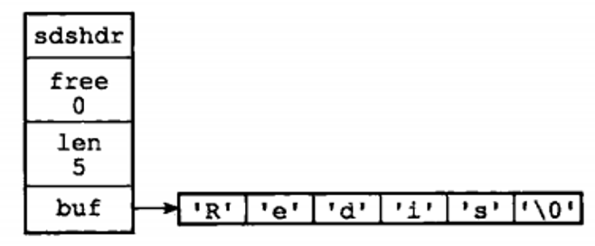
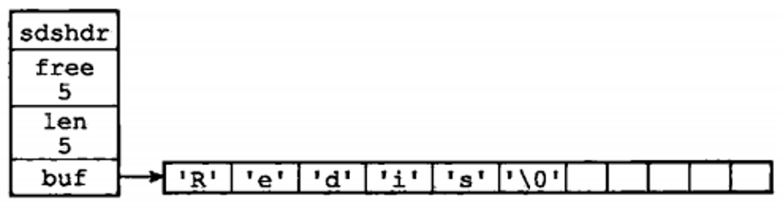
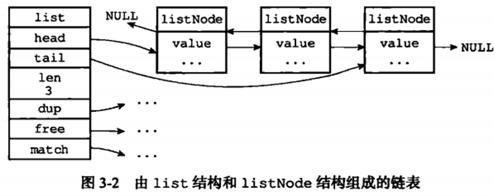
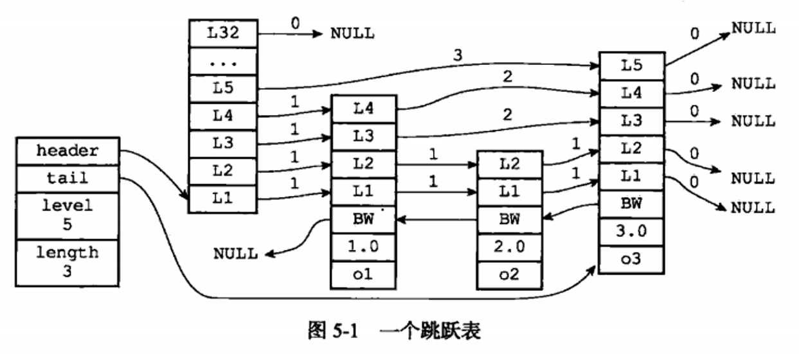
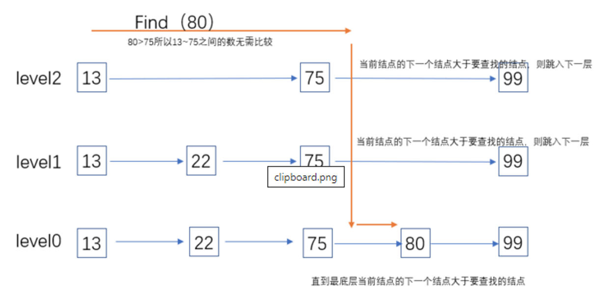
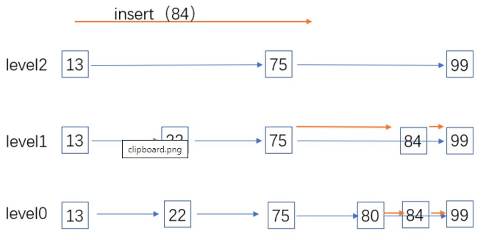
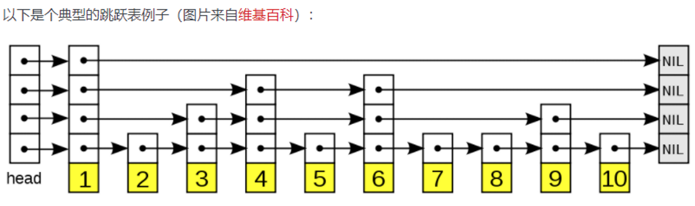
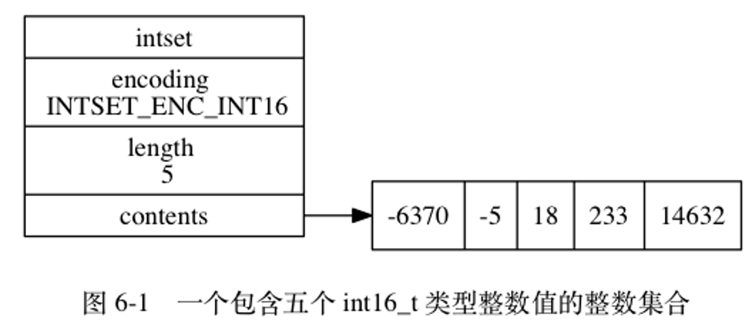
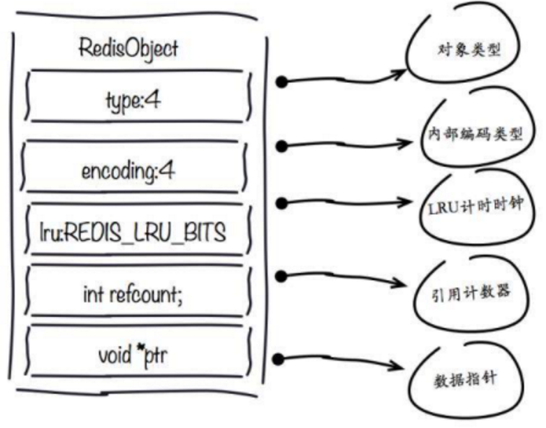

# 1. redis 数据类型有哪些？作用和简单使用方式

Redis 基础数据类型：

- **字符串（String）**：内部使用 **SDS**（Simple Dynamic String）来存储。
- **列表（list）**：按照插入顺序排序，底层使用压缩列表（ziplist）或者双向链表。
  - 当同时满足下面两个条件时，使用 ziplist（压缩列表）编码：
  1. 列表保存元素个数小于 512 个
  2. 每个元素长度小于 64 字节
  - 不能满足这两个条件的时候使用 linkedlist 编码。
  - 上面两个条件可以在 `redis.conf` 配置文件中的 `list-max-ziplist-value` 选项和 `list-max-ziplist-entries` 选项进行配置。
- **集合（set）**：String 类型的无序集合，集合成员是唯一的，意味着集合中不能出现重复的数据。 **通过整数集合（intset）或者哈希表实现。**
  - 当集合同时满足以下两个条件时，使用 intset 编码：
  1. 集合对象中所有元素都是整数
  2. 集合对象所有元素数量不超过 512
  - 不能满足这两个条件的就使用 hashtable 编码。第二个条件可以通过配置文件的 `set-max-intset-entries` 进行配置。
- **散列表（hash）**：string 类型的 field（字段）和 value（值）的映射表，hash 特别适合用于存储对象。 **底层实现使用压缩列表或者 hash 表。**
  - 当同时满足下面两个条件时，使用 ziplist（压缩列表）编码：
  1. 列表保存元素个数小于 512 个
  2. 每个元素长度小于 64 字节
  - 不能满足这两个条件的时候使用 hashtable 编码。第一个条件可以通过配置文件中的 `set-max-intset-entries` 进行修改。
- **有序集合（sorted set）**：和集合一样也是 string 类型元素的集合，且不允许重复的成员。每个元素都会关联一个 double 类型的分数。redis 正是通过分数来为集合中的成员进行从小到大的排序。是排序的 Set，去重但可以排序，写进去的时候给一个分数，自动根据分数排序。 **使用 ziplist 或者 skiplist 实现。**
  - 当有序集合对象同时满足以下两个条件时，对象使用 ziplist 编码：
  1. 保存的元素数量小于 128
  2. 保存的所有元素长度都小于 64 字节
  - 不能满足上面两个条件的使用 skiplist 编码。以上两个条件也可以通过 Redis 配置文件 `zset-max-ziplist-entries` 选项和 `zset-max-ziplist-value` 进行修改。

Redis 扩展高级数据类型（Redis2.6+ 逐步支持）：

- **BitMap（位图，本质 String）**
  - 按 bit 位存储，节省空间
  - 命令：`setbit`/`getbit`/`bitcount`
  - 场景：签到统计、在线人数、状态标记
- **Redis GEO**：用于存储地理位置信息，并对存储的信息进行操作，该功能在 Redis 3.2 版本新增。
  - `geoadd`：添加地理位置的坐标。`GEOADD key longitude latitude member [longitude latitude member ...]`
  - `geopos`：获取地理位置的坐标。`GEOPOS key member [member ...]`
  - `geodist`：计算两个位置之间的距离。`GEODIST key member1 member2 [m|km|ft|mi]`
  - `georadius`：根据用户给定的经纬度坐标来获取指定范围内的地理位置集合。
  - `georadiusbymember`：根据储存在位置集合里面的某个地点获取指定范围内的地理位置集合。
  - `geohash`：返回一个或多个位置对象的 geohash 值。`GEOHASH key member [member ...]`
- **Redis Stream**：Redis 5.0 版本新增加的数据结构，主要用于消息队列。Redis 本身是有一个 Redis 发布订阅（pub/sub）来实现消息队列的功能，但它有个缺点就是消息无法持久化，如果出现网络断开、Redis 宕机等，消息就会被丢弃。Redis Stream 提供了消息的持久化和主备复制功能，可以让任何客户端访问任何时刻的数据，并且能记住每一个客户端的访问位置，还能保证消息不丢失。

# 2. 介绍下 String 类型

Redis 底层所有字符串内容的物理存储都是 **SDS**，不管是普通 String 类型 value、Hash 的 field/value、Key 名字、Bitmap、List 里的元素，真实二进制数据全都存在 SDS 结构体里。

执行 `SET k1 v1` 时：

- Redis 把字符串 `k1`、`v1` 分别封装为 SDS
- 再把 SDS 包装成 RedisObject（`robj`）对象：
  - key 是一个字符串 `robj`
  - value 也是类型为 `OBJ_STRING` 的 `robj`，`robj->ptr` 存着 SDS 地址
- 把这个 `<key-robj, value-robj>` 塞进全局数据库的 dict 哈希表中
- dict 哈希表容量不足时，执行渐进式 rehash，分批迁移桶到 `ht[1]`

内部使用 SDS（Simple Dynamic String）来存储。除了用来保存数据库中的字符串值外，sds 还被用作缓冲区：AOF 的缓冲区、客户端状态中的输入缓冲区，也是由 sds 实现的。

sds 由三部分组成：

1. `len`：记录 buf 数组中已使用的字节数量，等于字符串长度
2. `free`：记录 buf 数组中未使用字节数量
3. `char buf[]`：字节数组，用于保存字符串



上图，表示一个长度为 5 的字符串，实际 6 个字节，最后一个为空字符结尾。



上图，表示一个长度为 5 的字符串，实际 6 个字节，但是有 5 个未使用字节。

比 C 语言字符串优点：

1. **能快速获取字符串长度**，而普通 C 字符串为 O(n)。
2. **防止缓冲区溢出**：普通 C 字符串，加入内存相邻的字符串 s1 s2，s2 追加到 s1 末尾，s1 内存不够，可能会覆盖 s2，导致 s1 数据溢出到 s2。sds 修改字符串时，首先会检查空间是否满足修改需要，不满足会自动扩充。
3. **减少字符串修改时内存重新分配次数**。内存重分配一般涉及复杂算法，并可能执行系统调用，通常比较耗时。普通 C 字符串长度不够，需要重新分配扩展字符串内存大小。sds 通过 `free` 未使用空间，实现空间预分配和惰性空间释放。
   - **空间预分配**：sds 不仅会分配必须的空间，还会分配额外的未使用空间。
     - 如果修改后长度小于 1M，那么分配和 `len` 同样大小的未使用空间
     - 如果修改后大于 1M，则分配未使用 1M 的未使用空间
   - **惰性空间释放**：需要缩短字符串时，sds 不会立即使用内存重分配回收多出的字节，而是使用 `free` 属性记录，等待将来使用。但是 sds 提供 API 可以真正释放未使用空间。
4. **二进制安全**：C 字符串只能保存文本，不能保存二进制数据。sds 不会对 buf 数组做限制，数据写入什么，读取的时候就是什么。api 以处理二进制的方式来处理 buf 内的数据。sds 不是使用空字符串判断结束，而是 `len` 来判断。

# 3. 介绍下 List 底层实现

底层使用压缩列表（ziplist）或者双向链表，**双端链表实现**。



- 当同时满足下面两个条件时，使用 ziplist（压缩列表）编码：
  1. 列表保存元素个数小于 512 个
  2. 每个元素长度小于 64 字节
- 不能满足这两个条件的时候使用 linkedlist 编码。
- 上面两个条件可以在 `redis.conf` 配置文件中的 `list-max-ziplist-value` 选项和 `list-max-ziplist-entries` 选项进行配置。

# 4. 介绍下字典（hash 表）类型

字典是一种保存键值对的数据结构，字典中一个 key 和 value 关联，称为键值对。例如执行 `set msg "hello"` 时，会创建键为 `msg` 值为 `"hello"` 的键值对，这个键值对就存储在字典中。底层使用 hash 表实现。

Redis 全局 KV 数据库本身就是一个大 dict 哈希表，所有 KV 键值对都挂载在 dict 的 `ht[0]`/`ht[1]` 哈希桶里。

**hash 类型原理**：底层使用数组 + 链表的结构。首先当对键使用 **murmurHash2** 算法计算 hash 值，然后计算出索引，找到在 hash 数组的指定位置。当多个键发生冲突时，redis 使用**链地址法**解决冲突，hash 表节点有 `next` 指针，冲突的元素使用单向链表连接起来。由于是单项链表，每次都将新节点添加到链表头部，提高存入速度。

**rehash**：当 hash 表元素不断增多或者减少时，哈希表数据量达到了一个很大的量级，那么冲突的链的元素数量就会很大，这时查询效率就会变慢，因为取值的时候 redis 会遍历链表。而随着数据量的缩减，也会产生一定的内存浪费。因此 hash 表需要扩容或者缩减。

`hashtable 元素总个数 / 字典的链个数（hash 表大小） = 每个链平均存储的元素个数（load_factor）`

- 服务器目前没有在执行 `BGSAVE` 命令或者 `BGREWRITEAOF` 命令，`load_factor >= 1`，dict 就会触发扩大操作 rehash
- 服务器目前正在执行 `BGSAVE` 命令或者 `BGREWRITEAOF` 命令，`load_factor >= 5`，dict 就会触发扩大操作 rehash
- `load_factor < 0.1`，dict 就会触发缩减操作 rehash

**哈希表渐进式 rehash 详细步骤**：

1. 为 `ht[1]` 分配空间，让字典同时持有 `ht[0]` 和 `ht[1]` 两个哈希表。
2. 在字典中维持一个索引计数器变量 `rehashidx`，并将它的值设置为 0，表示 rehash 工作正式开始。
3. 在 rehash 进行期间，每次对字典执行添加、删除、查找或者更新操作时，程序除了执行指定的操作以外，还会顺带将 `ht[0]` 哈希表在 `rehashidx` 索引上的所有键值对 rehash 到 `ht[1]`，当 rehash 工作完成之后，程序将 `rehashidx` 属性的值增一。
4. 随着字典操作的不断执行，最终在某个时间点上，`ht[0]` 的所有键值对都会被 rehash 至 `ht[1]`，这时程序将 `rehashidx` 属性的值设为 -1，表示 rehash 操作已完成。

**渐进式 rehash 优势**：渐进式 rehash 采取分而治之的方式，将 rehash 键值对所需的计算工作均摊到对字典的每个添加、删除、查找和更新操作上，从而避免了集中式 rehash 而带来的庞大计算量。

**redis 使用渐进式 rehash 原因**：因为 redis 是单线程，当 K 很多时，如果一次性将键值对全部 rehash，庞大的计算量会影响服务器性能，甚至可能会导致服务器在一段时间内停止服务。不可能一步完成整个 rehash 操作，所以 redis 是分多次、渐进式的 rehash。渐进式 rehash 的好处在于它采取分而治之的方式，将 rehash 键值对所需的计算工作均摊到对字典的每个添加、删除、查找和更新操作上，从而避免了集中式 rehash 而带来的庞大计算量。

在 redis 中字典中的 hash 表也是采用**延迟初始化策略**，在创建字典的时候并没有为哈希表分配内存，只有当第一次插入数据时，才真正分配内存。

每个字典中都包含了两个 hashtable，那么为什么一个字典会需要两个 hashtable？

1. redis 在正常读写时会用到一个 hashtable，而另一个 hashtable 的作用实际上是作为字典在进行 rehash 时的一个临时载体。
2. redis 开始只会用一个 hashtable 去读写，如果这个 hashtable 的数据量增加或者缩减到某个值，到达了 rehash 的条件，redis 便会开始根据数据量和链（bucket）的个数初始化那个备用的 hashtable，来使这个 hashtable 从容量上满足后续的使用。
3. 把之前的 hashtable 的数据迁移到这个新的 hashtable 上来。
4. 等到数据全部迁移完成，再进行一次 hashtable 的地址更名，把这个备用的 hashtable 为正式的 hashtable，同时清空另一个 hashtable 以供下一次 rehash 使用。

**rehash 过程**：

- 为字典的备用哈希表分配空间：
  - 如果执行的是扩展操作，那么备用哈希表的大小为第一个大于等于（已用节点个数）\* 2 的 2^n（2 的 n 次方幂）
  - 如果执行的是收缩操作，那么备用哈希表的大小为第一个大于等于（已用节点个数）的 2^n
- 在字典中维持一个索引计数器变量 `rehashidx`，并将它的值设置为 0，表示 rehash 工作正式开始（为 -1 时表示没有进行 rehash）。
- rehash 进行期间，每次对字典执行添加、删除、查找或者更新操作时，程序除了执行指定的操作以外，还会顺带将 `ht[0]` 哈希表在 `rehashidx` 索引上的所有键值对 rehash 到 `ht[1]`，当一次 rehash 工作完成之后，程序将 `rehashidx` 属性的值 +1。同时在 `serverCron` 中调用 rehash 相关函数，在 1ms 的时间内，进行 rehash 处理，每次仅处理少量的转移任务（100 个元素）。
- 随着字典操作的不断执行，最终在某个时间点上，`ht[0]` 的所有键值对都会被 rehash 至 `ht[1]`，这时程序将 `rehashidx` 属性的值设为 -1，表示 rehash 操作已完成。

# 5. 介绍下跳跃表

**Skip List** 是一种随机化的数据结构，基于并联的链表，实现简单，插入、删除、查找的复杂度均为 **O(logN)**（大多数情况下），因为其性能匹敌红黑树且实现较为简单。跳跃表（skip list）是一种有序数据结构，通过每个节点中维持多个指向其他节点的指针，从而快速访问其他节点。



Redis 跳跃表默认允许最大的层数是 **32**，被源码中 `ZSKIPLIST_MAXLEVEL` 定义，当 `Level[0]` 有 2^64 个元素时，才能达到 32 层，所以定义 32 完全够用了。

一个跳表，应该具有以下特征：

1. 一个跳表应该有几个层（level）组成，通常是 10-20 层，leveldb 中默认为 12 层。
2. 跳表的第 0 层包含所有的元素，且节点值是有序的。
3. 每一层都是一个有序的链表，层数越高应越稀疏，这样在高层次中能"跳过"许多的不符合条件的数据。为了提高查找的效率，程序总是从高层先开始访问，然后随着元素值范围的缩小，慢慢降低层次。
4. 如果元素 x 出现在第 i 层，则所有比 i 小的层都包含 x。
5. 每个节点包含 key 及其对应的 value 和一个指向该节点第 n 层的下个节点的指针数组，`x->next[level]` 表示第 level 层的 x 的下一个节点。

**skiplist 的查询过程**：查询的第一个比当前值大的节点的前一个值，看是否相等。相等则存在，否则查找下一层，直到层数为 0。



从最高层（此处为 2）开始：

1. level2 找到结点 Node75 小于 80，且 `level2.Node75->next` 大于 80，则进入 level1 查找（此处已经跳过了 13\~75 中间的结点（22））。
2. `level1.Node75 < 80 < level1.Node75->next`，进入 level0。
3. `level0.Node75->next` 等于 80，找到结点。

**skiplist 的插入过程**：假设插入一新键值 key，值为 84，level 为当前层。



1. 从最高层开始找到每一层比 84 大的节点的前一个值，存入 `prev[level]`。这里：
   - `prev[2] = leve2.Node75`
   - `prev[1] = leve1.Node75`
   - `prev[0] = level0.Node80`
2. 初始化一个新的节点 84。
3. 为 x 随机选择一个高度 h，这里选 2。
4. `x->next[0..h-1] = prev[0..h-1]->next`
5. `prev[0..h-1]->next[0..h-1] = x`

（步骤 4、5 为链表插入结点的操作）

**skiplist 删除操作**：删除操作类似于插入操作，包含如下 3 步：

1. 查找到需要删除的结点
2. 删除结点
3. 调整指针



- **表头（head）**：负责维护跳跃表的节点指针。
- **跳跃表节点**：保存着元素值，以及多个层。
- **层**：保存着指向其他元素的指针。高层的指针越过的元素数量大于等于低层的指针，为了提高查找的效率，程序总是从高层先开始访问，然后随着元素值范围的缩小，慢慢降低层次。
- **表尾**：全部由 NULL 组成，表示跳跃表的末尾。

为了满足自身的功能需要，Redis 基于 William Pugh 论文中描述的跳跃表进行了以下修改：

1. **允许重复的 score 值**：多个不同的 member 的 score 值可以相同。
2. **进行对比操作时，不仅要检查 score 值，还要检查 member**：当 score 值可以重复时，单靠 score 值无法判断一个元素的身份，所以需要连 member 域都一并检查才行。
3. **每个节点都带有一个高度为 1 层的后退指针**，用于从表尾方向向表头方向迭代：当执行 `ZREVRANGE` 或 `ZREVRANGEBYSCORE` 这类以逆序处理有序集的命令时，就会用到这个属性。

如果要实现一个 key-value 结构，需求的功能有插入、查找、迭代、修改：

- 首先 Hash 表就不是很适合了，因为迭代的时间复杂度比较高
- 而红黑树的插入很可能会涉及多个结点的旋转、变色操作，因此需要在外层加锁，这无形中降低了它可能的并发度
- 而 SkipList 底层是用链表实现的，可以实现为 lock free，同时它还有着不错的性能（单线程下只比红黑树略慢），非常适合用来实现我们需求的那种 key-value 结构

# 6. 介绍下整数集合 intset

当一个集合中只包含整数，并且元素的个数不是很多的话，redis 会用整数集合作为底层存储，它的一个优点就是**可以节省很多内存**。虽然字典结构的效率很高，但是它的实现结构相对复杂并且会分配较多的内存空间。

整数集合（intset）使用了非常简洁的数据结构，可以更少的占用内存存储一些整数，但终究是基于数组的，也就避免不了不能存储大量数据的缺点。总体来说：

- 插入一个元素，最好情况 **O(logN)**，最坏的情况是 **O(N)**，摊还时间复杂度为 **O(N)**
- 查找一个元素，根据索引下标时间复杂度在 **O(1)**

整数集合（intset）可以做到使用较少的内存空间却达到和字典一样效率的实现，但也是前提的，集合中只能包含整型数据并且数量不能太多。**超过 512 个元素，或者向集合中添加了字符串或其他数据结构，redis 会将整数集合向字典结构进行转换**。

```c
typedef struct intset {
    // 编码方式
    uint32_t encoding;
    // 集合包含的元素数量
    uint32_t length;
    // 保存元素的数组
    int8_t contents[];
} intset;
```

- `contents` 数组是整数集合的底层实现：整数集合的每个元素都是 `contents` 数组的一个数组项（item），各个项在数组中按值的大小从小到大有序地排列，并且数组中不包含任何重复项。
- `length` 属性记录了整数集合包含的元素数量，也即是 `contents` 数组的长度。

**写入流程**：

1. 计算得到新插入的元素的编码。
2. 如果大于 intset 目前存储元素的编码大小，触发 intset 升级。
3. 二分搜索当前元素，如果元素已经存在会直接返回，如果没找到元素，pos 的值就是该元素的位置索引。

因此 intset 内的数据是**有序且无重复**的（二分查找）。

假设原 intset 使用 16 位的编码存储数据，先来了一个 32 位的数据，触发了我们的编码升级。**升级操作只有两种情况会触发**：

- 一种是新插入一个较大的数值
- 另一种是新插入一个负很大的值

这两种情况都会导致类型不够存储，需要扩大数据位。



- `encoding` 属性的值为 `INTSET_ENC_INT16`，表示整数集合的底层实现为 `int16_t` 类型的数组，而集合保存的都是 `int16_t` 类型的整数值。
- `length` 属性的值为 5，表示整数集合包含五个元素。
- `contents` 数组按从小到大的顺序保存着集合中的五个元素。

因为每个集合元素都是 `int16_t` 类型的整数值，所以 `contents` 数组的大小等于 `sizeof(int16_t) * 5 = 16 * 5 = 80` 位。

# 7. 介绍下压缩列表 ziplist

`ziplist` 是经过特殊编码的双向列表结构，用来提高内存使用效率。它可以储存字符串或者整数值，其中整数值被编码成实际的整数，而不是字符串形式。它可以在 **O(1)** 时间内对列表的两端进行 push 和 pop 操作。但是，因为每个操作都需要重新分配 ziplist 使用的内存，所以实际的复杂度与 ziplist 使用的内存大小有关。

我们的容器对象的元素个数小于一定条件时，redis 会使用 ziplist 的方式储存，来减少内存的使用。

**为什么要在元素较少的时候使用 ziplist？**

因为 redis 中的集合容器中，很多情况都用到了链表的实现，元素和元素之间通过储存的关联指针有序的串联起来，但是这样的指针往往是**随机 I/O**，也就是指针地址是不连续的（分布不均匀）。而我们的 ziplist 它本身是一块连续的内存块，所以它的读写是**顺序 I/O**，从底层的磁盘读写来说，顺序 I/O 的效率肯定是高于随机 I/O。

那为什么不都用顺序 I/O 的 ziplist 代替随机 I/O 呢？因为 ziplist 是连续内存，当你元素数量多了，意味着当你创建和扩展的时候需要操作更多的内存，所以 **ziplist 针对元素少的时候才能提升效率**。

# 8. 介绍下 redis 对象

Redis 并没有直接使用 SDS、双端链表、字典、压缩列表等这些数据结构实现键值对，而是基于这些数据结构创建了**对象系统**，包含字符串对象、hash 对象、列表对象等。

1. 执行命令之前，可以根据对象的类型判断对象能否执行命令
2. 根据不同的使用场景，为对象设置不同的数据结构类型
3. 实现了基于引用计数的内存回收
4. 通过引用计数实现对象共享，让多个数据库键共享同一个对象，节约内存
5. 对象带有访问时间记录信息，可以用于计算键空转时间，在启用 maxmemory 功能时，优先删除空转时间长的键

Redis 存储的所有值对象在内部定义为 `redisObject` 结构体，内部结构如下图所示：



Redis 存储的数据都使用 `redisObject` 来封装，包括 string、hash、list、set、zset 在内的所有数据类型。理解 `redisObject` 对内存优化非常有帮助，下面针对每个字段做详细说明：

1. **type 字段**：表示当前对象使用的数据类型，Redis 主要支持 5 种数据类型：string、hash、list、set、zset。可以使用 `type {key}` 命令查看对象所属类型，type 命令返回的是值对象类型，键都是 string 类型。
2. **encoding 字段**：表示 Redis 内部编码类型，encoding 在 Redis 内部使用，代表当前对象内部采用哪种数据结构实现。理解 Redis 内部编码方式对于优化内存非常重要，同一个对象采用不同的编码实现内存占用存在明显差异，具体细节见之后编码优化部分。
3. **lru 字段**：记录对象最后一次被访问的时间，当配置了 `maxmemory` 和 `maxmemory-policy=volatile-lru | allkeys-lru` 时，用于辅助 LRU 算法删除键数据。可以使用 `object idletime {key}` 命令在不更新 lru 字段情况下查看当前键的空闲时间。

**共享对象池**：对象共享池指 Redis 内部维护 [0-9999] 的整数对象池。创建大量的整数类型 redisObject 存在内存开销，每个 redisObject 内部结构至少占 16 字节，甚至超过了整数自身空间消耗。所以 Redis 内存维护一个 [0-9999] 的整数对象池，用于节约内存。除了整数值对象，其他类型如 list、hash、set、zset 内部元素也可以使用整数对象池。因此开发中在满足需求的前提下，尽量使用整数对象以节省内存。

**为什么开启 maxmemory 和 LRU 淘汰策略后对象池无效？**

LRU 算法需要获取对象最后被访问时间，以便淘汰最长未访问数据，每个对象最后访问时间存储在 redisObject 对象的 lru 字段。对象共享意味着多个引用共享同一个 redisObject，这时 lru 字段也会被共享，导致无法获取每个对象的最后访问时间。如果没有设置 maxmemory，直到内存被用尽 Redis 也不会触发内存回收，所以共享对象池可以正常工作。

综上所述，**共享对象池与 maxmemory+LRU 策略冲突**，使用时需要注意。对于 ziplist 编码的值对象，即使内部数据为整数也无法使用共享对象池，因为 ziplist 使用压缩且内存连续的结构，对象共享判断成本过高，ziplist 编码细节后面内容详细说明。

**为什么只有整数对象池？**

- 首先整数对象池复用的几率最大
- 其次对象共享的一个关键操作就是判断相等性，Redis 之所以只有整数对象池，是因为整数比较算法时间复杂度为 **O(1)**，只保留一万个整数为了防止对象池浪费
- 如果是字符串判断相等性，时间复杂度变为 **O(n)**，特别是长字符串更消耗性能（浮点数在 Redis 内部使用字符串存储）
- 对于更复杂的数据结构如 hash、list 等，相等性判断需要 **O(n²)**

对于单线程的 Redis 来说，这样的开销显然不合理，因此 Redis 只保留整数共享对象池。

# 9. 介绍下 redis bitmap

Bitmap 底层不是独立数据结构，本质就是 **String 字符串**，把字符串的每一个二进制 bit 位拿来存 0/1 标记。

**SETBIT 设置某一位状态**

- 语法：`SETBIT key offset value`
- `offset`：比特偏移位置（非负整数）
- `value`：只能填 0 或 1
- 示例：标记用户 ID=1001 今日签到（offset=1001）

```redis
SETBIT sign:20260614 1001 1
```

返回值：该 offset 位修改前的旧值。

**GETBIT 查询某一位状态**

- 语法：`GETBIT key offset`
- 示例：查询 1001 用户今天是否签到

**BITCOUNT 统计范围内 1 的总数（计数）**

- 语法：`BITCOUNT key [start end] [BYTE/BIT]`
- 默认 start/end 单位是字节，加 BIT 修饰则为比特位区间
- 示例 1：统计今日总签到人数

```redis
BITCOUNT sign:20260614
```

**BITOP 位运算（多 key 合并）**

支持 `AND`、`OR`、`XOR`、`NOT` 四种运算，常用于多日签到合并、交集统计。

- 语法：`BITOP op destkey key1 key2 ...`
- 场景：统计用户近 7 天都签到（AND 交集）

```redis
# 把7天签到bitmap做与运算，结果存入week_all
BITOP AND week_all sign:0608 sign:0609 sign:0610 sign:0611 sign:0612 sign:0613 sign:0614
# 统计7天全勤人数
BITCOUNT week_all
```

- `OR`：任意一天签到即标记 1（有签到记录）
- `XOR`：两天签到状态不一样的位置
- `NOT`：取反单个 bitmap

**BITPOS 查找第一个 0/1 的偏移位置**

- 语法：`BITPOS key bit [start] [end]`
- 示例：找到第一个未签到的用户位

**用户 ID 直接当作 offset 偏移位的设计规则**：

- Key：按日期区分，比如 `sign:20260614`（一天一个 Bitmap）
- offset = 用户唯一 ID（数字 ID，如 1、1001、9999999）
- 签到：`SETBIT sign:20260614 uid 1`
- 查询签到：`GETBIT sign:20260614 uid`
- 统计当日总签到人数：`BITCOUNT sign:20260614`

**存在的大坑：离散大 ID 会产生空洞浪费内存**

举个反例：

- 用户 ID 从 1000000 开始，第一个签到用户 offset=1000000
- 哪怕只存 1 个 1，也要预先分配约 122KB 空间存前面全 0 的空位
- ID 断层、起始值很大时内存消耗暴涨

**解决方案（业务常用）**：

- **ID 映射压缩**：维护一张映射表，把业务大 UID 映射成连续自增小序号（1、2、3…），用小序号做 offset，彻底消除空洞。
- **分桶拆分 Bitmap**：比如每 10 万用户一个桶：
  - `sign:20260614:bucket1` 存 uid 1\~100000
  - `sign:20260614:bucket2` 存 uid 100001\~200000
  - 单个桶 offset 永远不超过 10 万，上限内存可控

# 10. 非纯数字 uid 使用 bitmap

Bitmap 的 offset 只能是非负整数，字符串类型的 uid（比如 `u_123`、`abc888`、手机号字符串、UUID）没法直接当成偏移量使用，不能直接塞给 `SETBIT`。

**方案 1：哈希取模映射（最简单，线上最常用）**

原理：

- 对字符串 UID 做哈希运算，算出一个整数，用这个整数作为 offset
- 公式简化：`offset = hash(uid) % 桶最大位数`
- 设定单个 Bitmap 桶容纳上限，比如单桶容纳 100 万位
- 任意字符串 uid，通过 CRC32/MD5 算出哈希值，对桶容量取模得到 0\~999999 的 offset
- 同一天拆分多个桶：`sign:20260614:b1`、`sign:20260614:b2`……

示例流程：

1. uid = `user_zhangsan`
2. `crc32("user_zhangsan")` 得到大数字
3. 对 1000000 取模 → 得到 0\~999999 之间整数 offset
4. `SETBIT sign:20260614:b1 {offset} 1`

缺点：存在**哈希碰撞**，两个不同 uid 算出同一个 offset，会互相覆盖签到状态。

解决碰撞：

- 扩大单桶容量，降低碰撞概率
- 双层哈希双桶校验（两个不同 hash 算法，两个桶都标记才算签到）
- 签到主记录用 Hash 兜底，Bitmap 只做统计计数加速

**方案 2：建立字符串 UID → 自增数字序号映射表（零碰撞，精准无误差）**

思路：

- 用一个全局 Hash 存储映射关系：`uid_map:{uid}` → 连续自增数字 id
- 第一次碰到陌生字符串 uid：
  - 调用 `INCR uid_seq` 拿到一个全新递增数字序号（1,2,3,4...）
  - `HSET uid_map user_zhangsan 123` 保存映射
- 后续签到直接拿映射后的数字作为 offset

优缺点：

- 完全无碰撞、内存极致省，完美贴合 1uid=1bit
- 多一次 Hash 查询请求；uid 总量极大时映射 Hash 本身会占用少量内存
- 适合用户量稳定、长期签到业务

**方案 3：放弃纯 Bitmap，混合存储（稳妥兜底方案）**

不想做映射、怕碰撞、追求 100% 准确，直接换存储结构组合：

- **精确签到明细：用 Hash**
  - `HSET sign:detail:20260614 user_zhangsan 1`
  - 精准记录每个字符串 uid 是否签到，无任何误差
- **快速统计总数：Bitmap 辅助加速**
  - 搭配方案 1 哈希映射的 Bitmap，`BITCOUNT` 快速粗算人数
  - 对账时以 Hash 为准，Bitmap 只做查询优化

**方案 4：UID 转固定长度数字编码（仅适用于有规则字符串）**

如果 uid 是有规则字符，比如字母 + 数字有限集合：

- 例：uid = `A001`、`B999`
- 可以写编码规则把字符翻译成十进制数字，转成纯数字 offset
- 局限性极强，不规则 UUID、随机用户名完全不适用

# 11. redis 常用命令和作用

**redis key 命令**：

- `DEL key`：key 存在时删除 key
- `EXISTS key`：检查给定 key 是否存在
- `EXPIRE key seconds`：为给定 key 设置过期时间，以秒计
- `RANDOMKEY`：从当前数据库中随机返回一个 key
- `RENAME key newkey`：修改 key 的名称
- `RENAMENX key newkey`：仅当 newkey 不存在时，将 key 改名为 newkey
- `TYPE key`：返回 key 所储存的值的类型

**redis 字符串命令**：

- `SET key value`
- `SETEX key expire value`：设置过期时间
- `GET key`
- `GETSET key value`：将给定 key 的值设为 value，并返回 key 的旧值（old value）
- `SETNX key value`：只有在 key 不存在时设置 key 的值
- `INCR key`：将 key 中储存的数字值增一
- `DECR key`：将 key 中储存的数字值减一
- `APPEND key value`：如果 key 已经存在并且是一个字符串，APPEND 命令将指定的 value 追加到该 key 原来值（value）的末尾

**redis hash 相关命令**：

- `HDEL key field1 [field2]`：删除一个或多个哈希表字段
- `HMGET key field1 [field2]`：获取所有给定字段的值
- `HMSET key field1 value1 [field2 value2 ]`：同时将多个 field-value（域-值）对设置到哈希表 key 中
- `HSET key field value`：将哈希表 key 中的字段 field 的值设为 value
- `HEXISTS key field`：查看哈希表 key 中，指定的字段是否存在
- `HGET key field`：获取存储在哈希表中指定字段的值
- `HGETALL key`：获取在哈希表中指定 key 的所有字段和值
- `HKEYS key`：获取所有哈希表中的字段
- `HLEN key`：获取哈希表中字段的数量

**Redis list 命令**：

- `BLPOP key1 [key2 ] timeout`：移出并获取列表的第一个元素，如果列表没有元素会阻塞列表直到等待超时或发现可弹出元素为止
- `BRPOP key1 [key2 ] timeout`：移出并获取列表的最后一个元素，如果列表没有元素会阻塞列表直到等待超时或发现可弹出元素为止
- `LINDEX key index`：通过索引获取列表中的元素
- `LINSERT key BEFORE|AFTER pivot value`：在列表的元素前或者后插入元素
- `LLEN key`：获取列表长度
- `LRANGE key start stop`：获取列表指定范围内的元素
- `LPOP key`：移出并获取列表的第一个元素
- `LPUSH key value1 [value2]`：将一个或多个值插入到列表头部
- `LPUSHX key value`：将一个值插入到已存在的列表头部
- `RPOP key`：移除列表的最后一个元素，返回值为移除的元素
- `RPUSH key value1 [value2]`：在列表中添加一个或多个值
- `RPUSHX key value`：为已存在的列表添加值
- `RPOPLPUSH source destination`：移除列表的最后一个元素，并将该元素添加到另一个列表并返回

**Redis set 命令**：

- `SADD key member1 [member2]`：集合添加一个或多个成员
- `SCARD key`：获取集合的成员数
- `SDIFF key1 [key2]`：返回第一个集合与其他集合之间的差异
- `SINTER key1 [key2]`：返回给定所有集合的交集
- `SISMEMBER key member`：判断 member 元素是否是集合 key 的成员
- `SMEMBERS key`：返回集合中的所有成员
- `SPOP key`：移除并返回集合中的一个随机元素
- `SRANDMEMBER key [count]`：返回集合中一个或多个随机数
- `SREM key member1 [member2]`：移除集合中一个或多个成员

**redis sorted set 集合**：

- `ZADD key score1 member1 [score2 member2]`：向有序集合添加一个或多个成员，或者更新已存在成员的分数
- `ZCARD key`：获取有序集合的成员数
- `ZCOUNT key min max`：计算在有序集合中指定区间分数的成员数
- `ZINCRBY key increment member`：对指定成员的分数加上增量 increment
- `ZREM key member [member ...]`：移除有序集合中的一个或多个成员
- `ZREMRANGEBYLEX key min max`：移除有序集合中给定的字典区间的所有成员
- `ZREMRANGEBYSCORE key min max`：移除有序集合中给定的分数区间的所有成员
- `ZSCORE key member`：返回有序集中，成员的分数值
- `ZRANGE`：获取在指定区间内的元素（升序）
- `ZREVRANGE`：获取在指定区间内的元素（降序）

**各数据类型应用场景**：

- **string**：因为 string 类型是二进制安全的，可以用来存放图片、视频等内容，另外由于 Redis 的高性能读写功能，而 string 类型的 value 也可以是数字，可以用作计数器（`INCR`、`DECR`），比如分布式环境中统计系统的在线人数、秒杀等。
- **hash**：value 存放的是键值对，比如可以做单点登录存放用户信息。
- **list**：可以实现简单的消息队列，另外可以利用 `lrange` 命令做基于 redis 的分页功能。
- **set**：由于底层是字典实现的，查找元素特别快，另外 set 数据类型不允许重复，利用这两个特性我们可以进行全局去重，比如在用户注册模块判断用户名是否注册；另外就是利用交集、并集、差集等操作，可以计算共同喜好、全部的喜好、自己独有的喜好等功能。
- **zset**：有序的集合，可以做范围查找、排行榜应用、取 TOP N 操作等。

**keys 与 SCAN 命令**：

`keys` 用来列出所有满足特定正则字符串规则的 key，实例中数据量过大的时候，Redis 服务可能会卡顿，其余指令可能会延时甚至超时报错。

`SCAN cursor [MATCH pattern] [COUNT count]`：

- 它是通过游标分步进行的，不会阻塞线程
- 提供 limit 参数，可以控制每次返回结果的最大条数，limit 只是对增量式迭代命令的一种提示（hint），返回的结果可多可少
- 同 keys 一样，它也提供模式匹配功能
- 服务器不需要为游标保存状态，游标的唯一状态就是 scan 返回给客户端的游标整数
- 返回的结果可能会有重复，需要客户端去重复，这点非常重要
- 遍历的过程中如果有数据修改，改动后的数据能不能遍历到是不确定的
- 单次返回的结果是空的并不意味着遍历结束，而要看返回的游标值是否为零

`SCAN` 命令的返回值是一个包含两个元素的数组，第一个数组元素是用于进行下一次迭代的新游标，而第二个数组元素则又是一个数组，这个数组中包含了所有被迭代的元素。

返回的游标不一定是递增的，可能后一次返回的游标比前一次的小。在第二次调用 SCAN 命令时，命令返回了游标 0，这表示迭代已经结束，整个数据集已经被完整遍历过了。

**COUNT 选项**：对于增量式迭代命令不保证每次迭代所返回的元素数量，我们可以使用 COUNT 选项，对命令的行为进行一定程度上的调整。COUNT 选项的作用就是让用户告知迭代命令，在每次迭代中应该从数据集里返回多少元素。使用 COUNT 选项对于对增量式迭代命令相当于一种提示，大多数情况下这种提示都比较有效的控制了返回值的数量。

注意：**COUNT 选项并不能严格控制返回的 key 数量，只能说是一个大致的约束**。并非每次迭代都要使用相同的 COUNT 值，用户可以在每次迭代中按自己的需要随意改变 COUNT 值，只要记得将上次迭代返回的游标用到下次迭代里面就可以了。

# 12. Redis 如何实现延时队列？

**一、ZSet 有序集合（最常用、轻量首选）**

原理：

- ZSet 每个元素 member 存消息内容，score 存入队时间 + 延迟时长（到期时间戳）
- 轮询对比当前时间戳，分数 ≤ 当前时间的消息就是到期可消费任务

生产者投递延时消息：假设延迟 10 秒，当前时间戳 now，到期时间 `expire = now + 10000`。

消费者轮询拉取到期任务：用 `ZRANGEBYSCORE` 取出已到期消息，为防止多消费者并发重复消费，搭配 `ZREM` 原子操作 / 事务。

原子优化（Lua 脚本，杜绝竞态）：多实例消费者并发时，查询 + 删除分开会重复拿到任务，用 Lua 一次性执行查询 + 删除。

优缺点：

- 实现简单、无额外组件、支持任意延迟时长、轻量小业务完美适配
- 轮询空转消耗 CPU；海量百万级消息性能下滑；无 ACK 重试机制，消费宕机消息丢失

适用场景：订单超时关闭、红包过期、短时间延迟任务、中小体量业务。

**二、Redis Stream + 定时分片（可靠延时队列，Redis5.0+）**

Stream 原生是实时 MQ，改造做延时：

- 按延迟档位拆分多个 Stream：`stream_delay_1s`、`stream_delay_5m`、`stream_delay_30m`
- 生产者根据延迟时间丢进对应档位 Stream
- 后台定时线程：
  - 每秒消费 `stream_delay_1s`
  - 每 5 分钟消费 `stream_delay_5m`
- 消费失败利用 Stream 消费组 ACK、pending 队列重试死信

优点：自带消费组、ACK、死信、消息持久化、多消费者负载均衡。

缺点：档位粒度固定，不能随意自定义延迟时间；档位多维护麻烦。

**三、Key 过期回调（notify-keyspace-events）**

原理：给任务单独设一个带过期时间的 Key，开启 Redis 键空间通知，Key 过期时 Redis 推送过期事件，程序监听事件执行任务。

致命短板：

- **过期回调不准**：Redis 惰性删除 + 定时删除，大库下 Key 过期很久才触发
- **消息丢失**：订阅客户端断开期间过期的事件直接丢掉，无备份
- 无法批量、无重试、不适合核心交易

仅适用：非核心、容忍延迟误差的轻任务。

**四、TimeWheel 时间轮（高性能海量延时，代码封装）**

基于 ZSet 升级 / 多层 Bucket 时间轮，大厂高并发方案：

- 分多层时间刻度（秒层、分层层、小时层）
- 定时滑动指针，每层到期下沉到下一层，最小刻度层直接消费
- 底层依然依赖 Redis ZSet/Hash 做桶存储，适合十万、百万级定时任务（如预约、定时推送）

优点：吞吐极高、轮询压力小、支持海量任务。

缺点：代码复杂度高，需要自行封装滑动、下沉逻辑。

**补充：可靠消费增强方案（ZSet 基础上加固）**

原生 ZSet 没有 ACK，宕机消息丢失，增加备份 pending 结构：

1. Lua 取出到期任务后，先写入一个 `pending_zset(score=当前时间+30s)`
2. 执行业务成功后删除 pending 数据
3. 定时补偿线程扫描 pending 里超过 30s 未删除的任务，重新丢回延时队列重试

形成：**延时队列 → pending 临时队列 → 消费成功删除 / 失败回退重试**。

