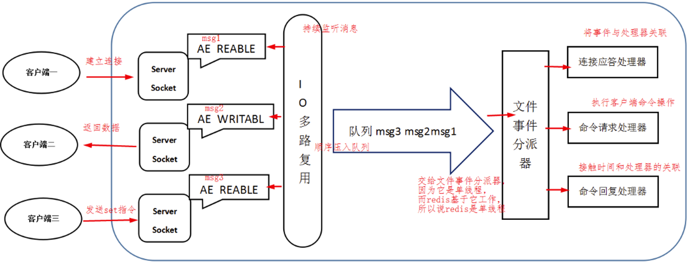
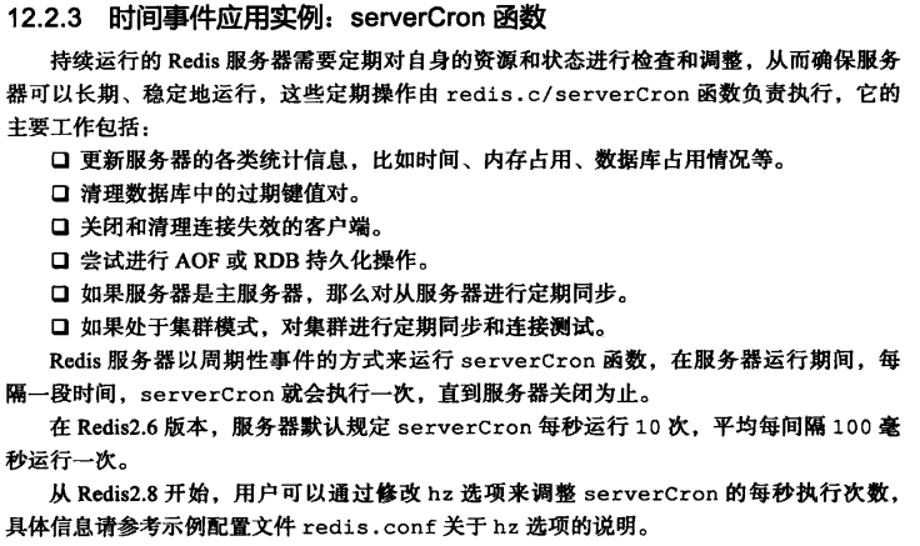
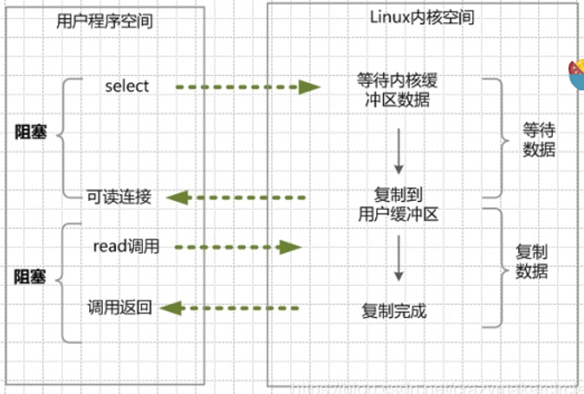
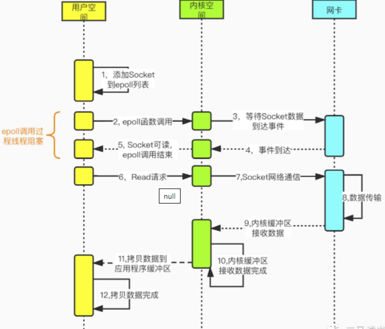
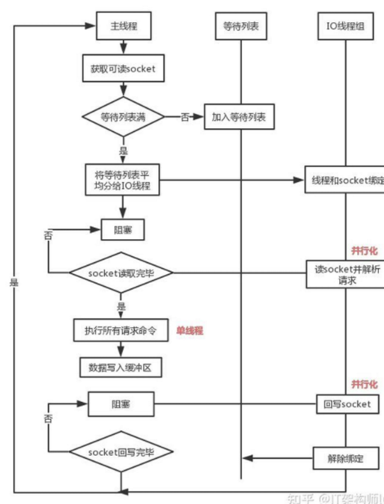

# 1. redis 请求流程

 1. 客户端发送命令请求，数据以 **RESP 协议**格式写入 socket
 2. **I/O 多路复用程序**监听多个 socket，将产生事件的 socket 放入队列，以有序、同步、每次一个的方式向文件事件分派器传送
 3. **文件事件分派器**从队列取出 socket，根据事件类型调用对应的事件处理器：
    - **连接应答处理器**：处理新的客户端连接
    - **命令请求处理器**：接收客户端请求，从 socket 读取数据写入输入缓冲区
    - **命令回复处理器**：将输出缓冲区中的响应写回客户端 socket
 4. 事件类型：
    - **AE_READABLE**：客户端对 socket 执行 write、close，或新套接字出现（客户端 connect）时产生
    - **AE_WRITABLE**：客户端执行 read 操作时产生
    - 两种事件同时产生时，**优先处理读事件,等到AE_READABLE事件处理完之后，才处理AE_WRITABLE 事件。**
 5. 命令请求处理器将数据写入 **输入缓冲区**
 6. **协议解析**：将 RESP 格式数据解析为命令名和参数
 7. **命令查找**：在命令表中查找对应命令的实现函数，校验参数个数和类型
 8. **命令执行**：调用命令处理函数操作内存数据，这是单线程串行执行的核心阶段
 9. 执行结果写入该客户端的 **输出缓冲区**
10. 当客户端 socket 产生 AE_WRITABLE 事件时，**命令回复处理器**将输出缓冲区中的响应写回客户端

# 2. Redis 的单线程指什么

- Redis 的单线程指的是**执行命令的核心模块是单线程的**，而不是整个 Redis 实例只有一个线程，Redis 的其他模块（如持久化、删除等）有各自的后台线程
- 客户端对服务端的每次调用经历三个过程：**发送命令 → 执行命令 → 返回结果**，其中执行命令阶段是单线程的
- 所有到达服务端的命令不会立刻执行，而是**进入队列逐个执行**，不会有两条命令被同时执行，不会产生并发问题，这就是 **Redis 的单线程基本模型**
- 单线程的本质原因：**文件事件分派器队列的消费是单线程的**，所以 Redis 才叫单线程模型
- 不仅命令执行阶段是单线程，**整个文件事件处理链路都是单线程的**：连接应答、命令请求、命令执行、命令回复都在同一个事件循环线程中串行完成

**消息处理流程：**

- 文件事件处理器使用 **I/O 多路复用程序**同时监听多个套接字，并根据套接字目前执行的任务来为套接字**关联不同的事件处理器**
- 当被监听的套接字准备好执行连接应答(accept)、读取(read)、写入(write)、关闭(close)等操作时，与操作相对应的**文件事件就会产生**
- 文件事件处理器调用套接字**之前关联好的事件处理器**来处理这些事件

**文件事件处理器结构（Reactor 模式）：**

- **多个套接字**：客户端与服务端的 TCP 连接
- **I/O 多路复用程序**：封装底层 epoll 等系统调用，监听多个 socket
- **文件事件分派器**：从队列取出事件，分发给对应处理器
- **事件处理器**：连接应答、命令请求、命令回复等具体处理器

**Redis的I/O多路复用:**

Redis的I/O多路复用程序的所有功能是通过包装select、epoll、evport和kqueue这些I/O多路复用函数库来实现的，

每个I/O多路复用函数库在Redis源码中都对应一个单独的文件，比如ae_select.c、ae_epoll.c、ae_kqueue.c等。

# 3. Redis 事件机制

Redis 事件机制由 **文件事件** 和 **时间事件** 两类事件组成，由同一个事件循环交替调度处理。

**文件事件：**

- 文件事件是对套接字操作的抽象，每当一个套接字准备好 accept、read、write、close 等操作时，就会产生一个文件事件
- 服务器通常连接多个 socket，所以多个文件事件可能并发出现
- I/O 多路复用总是将产生事件的 socket 放入队列，以有序、同步、每次一个的方式传送给文件事件分派器，上一个事件处理完后才会传送下一个

**时间事件：**

- 时间事件是对定时操作的抽象，比如 **ServerCron 函数**需要在给定时间点执行
- Redis 使用 **周期性事件**，让程序每隔指定时间执行一次
- 时间事件放入 **无序链表**中，通过遍历链表查找已到达执行时间的事件
- 当链表不为空时，事件循环遍历整个链表，取出所有已到达的时间事件并执行

**事件调度流程：**

- 事件循环每次迭代先处理文件事件，再处理时间事件
- 文件事件的等待时间由最近一个时间事件的到达时间决定，确保时间事件不会延迟过大
- 两类事件按 **文件事件 → 时间事件 → 文件事件 → …** 的顺序交替执行，整个调度过程是单线程的

# 4. 为什么设计成单线程

Redis的瓶颈不是cpu的运行速度，而往往是网络带宽和机器的内存大小。在理想情况下 Redis 每秒可以提交一百万次请求，每次请求提交所需的时间在纳秒的时间量级。

- **纯内存操作**：Redis 将数据存储在内存中，内存的读写速度远快于磁盘，命令执行极快，不需要多线程来提升执行速度
- **避免上下文切换开销**：多线程需要线程切换，上下文切换本身消耗 CPU 资源，单线程避免了这部分开销
- **避免锁和同步开销**：多线程操作共享数据需要加锁，锁的获取、释放和竞争都会带来性能损耗，单线程天然无并发问题，**无需加锁**
- **I/O 多路复用已经解决了高并发连接问题**：单线程 + I/O 多路复用可以高效处理大量客户端连接，不需要多线程来处理网络 I/O
- **命令执行时间短**：Redis 大部分命令是 O(1) 或 O(logN) 的简单操作，单线程足够应对， **瓶颈不在 CPU 而在内存和网络**
- Redis 并不是 CPU 密集型的服务，如果不开启 AOF 备份，所有 Redis 的操作都会在内存中完成不会涉及任何的 I/O 操作，这些数据的读写由于只发生在内存中，所以处理速度是非常快的；
- 整个服务的瓶颈在于网络传输带来的延迟和等待客户端的数据传输，也就是网络 I/O，所以使用多线程模型处理全部的外部请求可能不是一个好的方案。

**如何发挥多核 CPU 的性能**

- **部署多个 Redis 实例**：在同一台机器上启动多个 Redis 实例，每个实例绑定不同的 CPU 核心，各自独立处理请求，充分利用多核
- **使用 Redis Cluster**：将数据分片到多个节点，每个节点运行在独立的 CPU 核心上，既利用多核又实现水平扩展
- **主从架构**：主节点负责读写，从节点负责复制和分担读请求，不同节点可以跑在不同核心上

# 5. Redis 的通讯协议

Redis 使用 **RESP（REdis Serialization Protocol）** 协议，是一种基于文本的、简单易实现的序列化协议。

**协议特点：**

- **文本协议**：人类可读，便于调试和抓包分析
- **简单易实现**：客户端和服务端都能快速解析，降低开发成本
- **足够高效**：虽然不如二进制协议紧凑，但结构简单，解析速度快

**数据类型：**

RESP 定义了 5 种数据类型，通过第一个字符区分：

- **简单字符串**：以 `+` 开头，如 `+OK\r\n`
- **错误**：以 `-` 开头，如 `-ERR unknown command\r\n`
- **整数**：以 `:` 开头，如 `:1\r\n`
- **批量字符串**：以 `$` 开头，后跟字符串长度，如 `$6\r\nfoobar\r\n`
- **数组**：以 `*` 开头，后跟元素个数，用于发送命令和返回多个值，如 `*2\r\n$3\r\nGET\r\n$3\r\nkey\r\n`

**通信流程：**

- 客户端发送命令：使用 **数组 + 批量字符串** 的组合格式
- 服务端返回结果：根据命令类型返回任意一种 RESP 数据类型
- 每条命令或响应均以 **\\r\\n** 结尾

# 6. Redis 的 I/O 多路复用

**什么是 I/O 多路复用：**

- I/O 多路复用是指**一个线程同时监听多个文件描述符**，当某个文件描述符就绪（可读/可写）时，通知程序进行相应的 I/O 操作
- 核心思想：**让单个线程处理多个连接**，避免为每个连接创建独立线程带来的资源浪费
- 传统模型中每个连接需要一个线程来阻塞等待，而 I/O 多路复用用一个线程监听所有连接，只在有事件时才处理

**Redis 中的 I/O 多路复用：**

- Redis 的 I/O 多路复用程序封装了底层的系统调用，向上提供统一的接口，源码中每个实现对应一个单独的文件：
  - **ae_epoll.c**：Linux 的 epoll
  - **ae_select.c**：跨平台的 select
  - **ae_kqueue.c**：BSD/macOS 的 kqueue
  - **ae_evport.c**：Solaris 的 evport
- Redis 在编译时根据操作系统自动选择最优实现，优先级为：**evport > epoll > kqueue > select**

**各实现对比：**

- **select**：
  - 跨平台，几乎所有操作系统都支持
  - 每次调用需要传入全部文件描述符集合，**从用户态拷贝到内核态**，开销大
  - 监听的文件描述符数量有上限，默认 **1024**
  - 返回后需要**遍历全部文件描述符**找出就绪的，效率低
- **poll**：
  - 与 select 类似，但没有文件描述符数量上限
  - 同样存在每次调用全量拷贝和遍历的开销
- **epoll**：
  - 使用**事件驱动**方式，只在文件描述符就绪时才触发回调，不需要遍历
  - 只返回就绪的文件描述符，**不需要遍历全部**
  - 文件描述符通过 epoll_ctl 注册到内核，**不需要每次全量拷贝**
  - 支持**边沿触发（ET）和水平触发（LT）**两种模式
  - 没有文件描述符数量上限，适合高并发场景

**Redis I/O 多路复用工作流程：**

1. Redis 服务器启动时，创建 I/O 多路复用实例（如 epoll_create 创建 epoll 实例）
2. 将监听 socket 注册到多路复用实例中，关联 AE_READABLE 事件
3. 进入事件循环，调用多路复用函数（如 epoll_wait）等待事件
4. 当有客户端连接或发送数据时，对应的 socket 产生事件，多路复用程序返回就绪的 socket
5. 文件事件分派器根据 socket 关联的事件类型，调用对应的处理器
6. 处理完毕后回到事件循环，继续等待新的事件

**为什么 I/O 多路复用让单线程也高效：**

- 传统阻塞 I/O：一个线程只能处理一个连接，其他连接必须等待
- I/O 多路复用：一个线程可以同时管理数万个连接，只在有数据时才处理，**没有线程阻塞和切换的开销**
- 配合 Redis 纯内存操作的特点，命令执行极快，单线程就能处理大量请求

**I/O 多路复用的局限性：**

- I/O 多路复用的模型本质上是**同步阻塞型 I/O 模型**，并非异步非阻塞
- Redis 调用 epoll 的过程是**阻塞的**，会阻塞线程，当并发量达到几万 QPS 时，此处可能成为瓶颈
- 当 socket 中有数据时，Redis 通过系统调用将数据**从内核态拷贝到用户态**，这个拷贝过程是阻塞的，数据量越大延迟越高
- 写 response 时同样存在从用户态到内核态的**同步拷贝**阻塞
- 这些网络 I/O 的同步处理都由单线程完成，**大量 CPU 时间片耗费在网络 I/O 的同步等待上**，没有充分发挥多核 CPU 的优势

**多线程改进方向：**

- 如果采用多线程使网络请求的读写并发进行，可以**减少网络 I/O 等待造成的影响**
- 多线程可以**充分利用 CPU 多核优势**，将网络 I/O 处理分摊到多个核心

# 7. Redis 6.0 的多线程

多路复用的 IO 模型本质上仍然是同步阻塞型 IO 模型。 IO 数据的读写依然是阻塞的，这也是 Redis 目前的主要性能瓶颈之一，特别是在数据吞吐量特别大的时候。

**优化背景：**

- 目前单线程 Redis 的性能瓶颈主要在于**网络的 I/O 消耗**
- read/write 系统调用在 Redis 执行期间占用了大部分 CPU 时间，数据吞吐量特别大时尤为明显
- 优化主要有两个方向：
  - **提高网络 I/O 性能**：典型实现如使用 DPDK 替代内核网络栈
  - **使用多线程充分利用多核**：典型实现如 Memcached
- Redis 6.0 选择了多线程方向，核心思路是将主线程的 **I/O 读写任务拆分给一组独立的线程执行**，使得多个 socket 的读写可以并行化

**多线程的范围：**

- Redis 6.0 的多线程**仅用于网络数据的读写和协议解析**，命令执行仍然是单线程的
- 多线程处理的是：**读取客户端请求（read + 解析）**和**写回响应（编码 + write）**这两个阶段
- 命令执行阶段始终在主线程串行执行，保证线程安全，无需加锁

**执行流程：**

多线程 I/O 的读（请求）和写（响应）流程一致，只是执行读还是写的差异。I/O 线程在同一时刻**全部是读或者全部是写**，不会出现部分读部分写的情况。

读取流程：

1. 主线程负责接收建连请求，读事件到来（收到请求）则放到一个**全局等待读处理队列**
2. 主线程处理完读事件之后，通过 **RR（Round Robin）** 将这些连接分配给 I/O 线程，然后主线程进入忙等待状态
3. I/O 线程将请求数据**读取并解析完成**（只读数据和解析，不执行命令）
4. **主线程串行执行所有命令**并清空整个请求等待读处理队列

写入流程：

1. 主线程将执行结果分配给 I/O 线程
2. I/O 线程并发执行**编码和 write**
3. 主线程等待所有 I/O 线程完成写入

**设计要点：**

- 主线程和 I/O 线程之间去掉了互斥锁，采用 **busy loop（忙等待）** 的形式等待 I/O 线程工作结束，类似 spinlock 的效果，避免锁竞争开销
- 命令执行在主线程串行完成，**不需要加锁保护共享数据**，保持了单线程的简单性
- I/O 线程数量可通过 `io-threads` 配置，官方建议**不超过 8 个**
- `io-threads-do-reads yes` 可开启读操作的多线程，默认只对写操作启用多线程
- 多线程默认是关闭的，需要手动配置开启

**性能提升：**

- 开启多线程后，网络 I/O 读写并发进行，**大幅减少网络 I/O 等待时间**
- write side（回复客户端）部分已完成优化，能有约 **50% 的性能提升**
- 官方基准测试显示，在 8 线程配置下，QPS 可以提升约 **2 倍**

# 8. 多线程后解决线程安全问题

- **命令执行始终在主线程串行完成**：多线程仅负责网络 I/O 读写和协议解析，不参与命令执行，因此对共享数据的操作仍然是单线程的，**天然不存在并发问题**
- Redis 6.0 中的多线程，也只是针对**处理网络请求过程**采用了多线程，而数据的读写命令，仍然是**单线程处理**的
- 只有在**网络请求的接收和解析**，以及**请求后的数据通过网络返回**时，使用了多线程，而数据读写操作还是由单线程来完成
- **I/O 线程之间不共享数据**：每个 I/O 线程处理各自分配到的客户端连接，线程之间没有共享状态，不需要加锁
- **I/O 线程同一时刻全部读或全部写**：不会出现部分线程读部分线程写的情况，避免了读写竞争
- **主线程等待全部 I/O 线程完成后才继续**：在 I/O 线程处理时主线程会等待全部 I/O 线程完成，所以**不会出现 data race 的场景**
- **客户端连接通过 RR 分配**：一个连接在同一时刻只会被分配给一个 I/O 线程处理，不会出现多个线程同时操作同一个连接的情况

**开启 I/O 多线程的配置：**

- 默认情况下 Redis 多线程是**禁用的**，需在 redis.conf 中手动开启
- `io-threads-do-reads yes`：开启 I/O 多线程
- `io-threads 4`：配置线程数量，设为 1 即为主线程模式

**官方建议：**

- **至少 4 核的机器才开启** I/O 多线程，除非真的遇到了性能瓶颈，否则不建议开启此配置
- 配置的线程数应**少于机器总线程数**：4 核建议开启 2-3 个线程，8 核建议开启 6 个线程
- 线程并不是越多越好，**多于 8 个线程意义不大**

