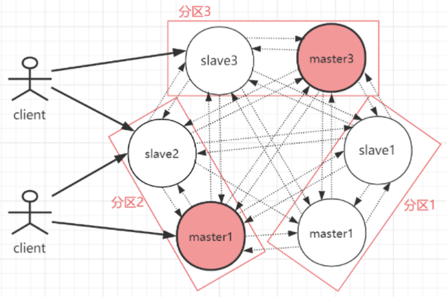

# 1. Redis 常用有几种部署方式，优缺点和用途，适合什么场景

Redis 常用 **5 种部署方式**：单机、主从复制、哨兵、集群、代理模式。

**单机模式（Standalone）**

- **架构**：一个 Redis 进程独立运行，所有数据都在这一个节点上
- **优点**：部署简单、运维成本低、性能高（无主从同步开销）
- **缺点**：
  - 单点故障，宕机后服务完全不可用
  - 容量受单机内存限制
  - 无法横向扩展
- **适用场景**：开发测试环境、本地缓存、对可用性要求不高的小型项目

**主从复制模式（Master-Slave / Replication）**

- **架构**：1 主 N 从，主节点负责写，从节点通过 `replicaof` 同步主节点数据，可承担读请求
- **优点**：
  - 读写分离提升读性能
  - 从节点提供数据冗余备份
  - 主节点故障时可手动切换
- **缺点**：
  - **不能自动故障转移**，主挂了需人工介入
  - 主节点写性能仍受单机限制
  - 同步延迟可能导致读到旧数据
- **适用场景**：读多写少、对自动故障转移要求不高的场景，如做数据备份或读流量分摊

**哨兵模式（Sentinel）**

- **架构**：在主从复制基础上，增加一组哨兵进程（推荐 3 个或 5 个，**奇数个**）监控主从节点状态，主节点宕机时自动选举新主完成故障转移
- **优点**：
  - **自动故障转移**，高可用
  - 客户端通过哨兵获取主节点地址，主从切换对客户端透明
- **缺点**：
  - 仍是单主写入，**写性能和容量无法水平扩展**
  - 部署和配置比主从复杂
  - 故障转移期间有短暂不可用窗口
- **适用场景**：数据量不超过单机内存上限、要求高可用的中小型业务系统

**集群模式（Cluster）**

- **架构**：多个主节点分片存储数据，采用 **16384 个哈希槽（slot）**，每个主节点负责一部分槽位，每个主节点可挂从节点；节点间通过 **Gossip 协议**通信
- **优点**：
  - **支持水平扩展**，容量和写性能随节点数增加而提升
  - 内置高可用，主节点故障时从节点自动顶上
  - 去中心化无单点
- **缺点**：
  - 只支持 0 号数据库
  - **多 key 操作受限**（mget/mset、事务、Lua 脚本要求 key 在同一槽位，需用 hash tag）
  - 运维复杂度高
  - 数据迁移和扩缩容成本高
- **适用场景**：数据量超过单机内存（一般几十 GB 以上）、需要高并发写入和水平扩展的大型业务系统

**代理模式（Proxy）**

- **架构**：在客户端和 Redis 后端集群之间增加一层**代理（Proxy）**，代理负责分片路由、连接池管理、协议转发，客户端只与代理通信
- **常见实现**：
  - **Twemproxy（Nutcracker）**：Twitter 开源，轻量级、性能高，但**不支持在线扩容**，需重启代理
  - **Codis**：豌豆荚开源，基于 ZooKeeper/Etcd 管理元数据，**支持在线扩容和数据迁移**，自带管理界面
  - **Redis Cluster Proxy**：Redis 官方代理，将 Cluster 协议封装成普通 Redis 协议，让老客户端无感知接入 Cluster
- **优点**：
  - **客户端无需感知分片逻辑**，使用普通 Redis 协议即可，老客户端无需改造
  - 代理可统一做**连接池管理**，减少后端 Redis 连接数
  - 部分代理（如 Codis）支持**在线扩容**，运维更友好
  - 可在代理层做监控、限流、慢查询统计等增强能力
- **缺点**：
  - **多了一层网络跳转**，延迟增加
  - 代理本身可能成为**性能瓶颈和单点**，需要部署多个代理做高可用
  - 部分代理（如 Twemproxy）**不支持事务、Lua、pub/sub** 等命令
  - 整体架构更复杂，运维成本高
- **适用场景**：
  - 客户端语言/版本不支持 Cluster 协议，又需要分片能力
  - 需要在中间层做统一的连接管理、监控、限流
  - 大规模部署场景下，需要更便捷的在线扩容能力（Codis）

**选型决策路径**：

- 数据量小、要求不高 → **单机**
- 需要读写分离或数据备份 → **主从复制**
- 数据能放下单机、要求高可用 → **哨兵**
- 数据量大或需要水平扩展 → **集群**
- 客户端不支持 Cluster 协议或需统一中间层管控 → **代理模式**

# 2. Redis 主从复制的作用和原理是什么

**主从复制的 5 大作用**

- **数据冗余**：主从复制实现数据的热备份，是持久化之外的另一种数据冗余方式
- **故障恢复**：主节点出现问题时，可由从节点提供服务，实现快速故障恢复（一种服务冗余）
- **负载均衡**：配合读写分离，主节点提供写服务，从节点分担读服务，**写少读多**场景下通过多个从节点分担读负载，可大幅提高并发量
- **读写分离**：主库写、从库读，可根据读流量需求弹性增减从库数量
- **高可用基石**：哨兵和集群都建立在主从复制之上，是 Redis 高可用的基础

**架构特点**

- 主库可读可写，写操作自动同步给从库；从库一般**只读**
- 一个主库可以有**多个从库**，一个从库只能有**一个主库**

**主从复制原理：同步 + 命令传播**

通过执行 `slaveof` 命令或配置 `slaveof` 选项，让一个 Redis 服务器复制另一个服务器的数据。被复制的称为**主服务器（Master）**，进行复制的称为**从服务器（Slave）**。

整个流程分两个阶段：**同步**（把从库状态更新到与主库一致）+ **命令传播**（持续保持一致）。

**1. 同步（SYNC）流程**

- 从服务器向主服务器发送 `SYNC` 命令
- 主服务器收到后执行 `BGSAVE`，后台生成 RDB 文件；同时用**缓冲区**记录从此刻开始执行的所有写命令
- `BGSAVE` 完成后，主服务器把 RDB 文件发送给从服务器，从服务器载入 RDB，将自身状态更新到主服务器执行 `BGSAVE` 时的状态
- 主服务器将缓冲区里的所有写命令发送给从服务器，从服务器执行这些命令，将状态追平到主服务器当前状态

**2. 命令传播**

同步完成后主从一致，之后主服务器每执行一条客户端写命令，都会**把这条写命令转发给从服务器**执行，保证主从持续一致。

**3. 过期 key 的处理**

- 从节点**不会主动过期 key**，只等待主节点过期
- 主节点 key 过期或被 LRU 淘汰时，会**模拟一条** `del` 命令发送给从节点，由从节点删除对应 key

**新版复制：PSYNC 替代 SYNC（Redis 2.8+）**

`PSYNC` 命令兼具**完整重同步**和**部分重同步**两种能力：

- **完整重同步**：用于初次复制，流程基本同 `SYNC`（生成 RDB → 传输 → 载入 → 缓冲区命令追加）
- **部分重同步**：用于**断线重连**场景，主从复制期间网络中断后，**接着上次断点继续复制**，不必重新生成完整 RDB

**部分重同步流程**

- 从服务器重连后向主服务器发送 `PSYNC` 命令（带上之前的复制偏移量和 runid）
- 主服务器若判断可以部分重同步，返回 `+CONTINUE`
- 从服务器接收 `+CONTINUE`，准备执行部分重同步
- 主服务器把**断线期间缺失的写命令**发送给从服务器，恢复同步

相比 `SYNC` 需要**生成、传送、载入完整 RDB 文件**，部分重同步只需传送缺失的写命令，开销小得多。

**主从复制的缺点**

- **不具备自动容错与恢复**：master 或 slave 宕机都可能导致请求失败，需等待机器重启或手动切换 IP 才能恢复
- **数据一致性问题**：master 宕机时如果数据未完全同步到 slave，切换后会出现数据丢失/不一致
- **难以在线扩容**：Redis 容量受限于单机配置，主从架构无法水平扩展写能力

**为什么要用读写分离**

- 单机 Redis 大约能承受 2 万 QPS（具体数据因机器配置和业务而异）
- 想承接 10 万以上 QPS 时，需要读写分离集群
- 缓存场景**读远大于写**，主机执行写、异步复制到从机，从机只负责读
- 例如单从机 2 万 QPS，业务需要 10 万 QPS 时，**横向扩展 5 台从机**即可（支持水平扩展的读高并发架构）

**主从复制 → 哨兵的演进**

主从复制不具备自动故障转移，master 宕机时需要手动执行 `slaveof no one` 把某台 slave 提升为 master。要实现自动化，就需要 **Redis 哨兵（Sentinel）集群**保障主从架构的高可用性。

# 3. SYNC 命令有哪些缺点

`SYNC` 是 Redis 2.8 之前的同步命令，存在以下缺点（也是后来用 `PSYNC` 替代的原因）：

**1. 全量同步开销大**

- 每次同步都要让主服务器执行 `BGSAVE` 生成完整 RDB 文件
- 消耗主服务器 CPU、内存和磁盘 IO
- 即使主从之间只差几条命令，也要重新走一遍完整流程

**2. 网络带宽消耗大**

- 需要把完整 RDB 文件通过网络传输给从服务器
- 主从数据量较大时（几个 GB），传输耗时长，**占用大量带宽**，可能影响其他业务

**3. 从服务器载入 RDB 期间阻塞**

- 从服务器接收到 RDB 后需要清空旧数据并载入新文件
- **载入期间无法处理客户端读请求**，造成服务短暂不可用

**4. 断线重连场景下浪费严重**

- `SYNC` 不区分初次复制和断线重连，**任何情况都执行全量同步**
- 哪怕只断开几秒钟、只丢失少量写命令，也要重新生成、传输、载入完整 RDB
- 这是 `SYNC` 最致命的缺点，对网络抖动频繁的环境非常不友好

**5. 缓冲区溢出风险**

- 主服务器在 `BGSAVE` 和发送 RDB 期间，仍持续把新写命令存入**复制缓冲区**
- 如果同步过程持续过久（数据大、网络慢），缓冲区**写满后会强制断开连接**，导致复制失败，从服务器再次重试又会触发新一轮全量同步，形成恶性循环

**PSYNC 如何改进**：`PSYNC` 引入**部分重同步**，断线重连时只传送缺失的写命令（基于复制偏移量和复制积压缓冲区 backlog），避免了断线场景下的全量同步浪费。

# 4. Redis 集群模式的原理是什么

**集群解决的核心问题**

- **分区（Partition）**：将数据划分为多个片区，分别存储到不同的机器上
- 不使用分区时，数据库大小受限于**单台机器的内存**；通过分区可以利用多台机器的内存构建一个更大数据库
- 分区还可以在多核和多机之间**弹性扩展计算能力**，在多机和网络适配器之间**弹性扩展网络带宽**
- Redis Cluster 主要针对**海量数据 + 高并发 + 高可用**场景，数据量不大时用哨兵模式即可

**集群整体架构**

- Redis Cluster 是一种**服务器端 Sharding 技术**，分片和路由都在服务端实现，客户端无需中间代理层
- 采用**多主多从**架构，每个分区由一个 Redis 主机和多个从机组成，**分区之间相互平行**
- 采用 **P2P 模式，完全去中心化**，所有节点彼此互联（PING-PONG 机制），内部使用**二进制协议**优化传输速度和带宽
- 主节点负责处理槽以及槽所映射的键值数据，从节点用于复制主节点，并在主节点下线时代替它继续处理命令
- 客户端连接集群中**任意一个可用节点**即可，无需连接所有节点
- 通过 `cluster meet ip port` 命令将节点加入集群，新节点信息通过 Gossip 协议传播给其他节点

**1. 数据分片：虚拟哈希槽（Hash Slot）**

- Redis Cluster 采用**虚拟哈希槽分区**而非一致性 Hash 算法，将整个数据空间划分为 **16384 个哈希槽**（slot），编号 0\~16383
- 每个主节点可以处理 0 个或最多 16384 个槽，比如 3 个主节点可以分配：节点 A 负责 0\~5460，节点 B 负责 5461\~10922，节点 C 负责 10923\~16383
- key 映射到槽的算法：`slot = CRC16(key) % 16384`
- **hash tag** 机制：当 key 包含 `{...}` 时，只对 `{}` 内的部分做 CRC16 计算槽位，使得 `user:{100}:name` 和 `user:{100}:age` 落到同一槽位，**支持多 key 操作**

**2. 节点通信：Gossip 协议**

- 集群中每个节点通过 **Gossip 协议**进行信息交换，每个节点既知道其他节点的状态，也知道槽位的分配情况
- Gossip 是**去中心化**的协议，节点间定期互相传播信息，最终达到整个集群状态一致
- 通信端口：**客户端端口 + 10000** 为集群总线端口（如 6379 对应 16379），用于节点间的 Gossip 消息交换和故障检测
- 常见消息类型：
  - **PING**：节点间定期发送，携带自身状态信息
  - **PONG**：回复 PING 或 MEET，携带自身状态
  - **MEET**：加入集群的握手消息，类似 PING 但会触发接收方加入集群
  - **FAIL**：节点判定某节点故障后广播 FAIL 消息

**3. 请求路由：MOVED 与 ASK 重定向**

- 客户端向任意节点发送命令，节点计算 key 的槽位
- 如果槽位**由自己负责**，直接执行并返回结果
- 如果槽位**由其他节点负责**，返回 **MOVED 重定向**：`MOVED <slot> <ip>:<port>`，客户端重新向目标节点发送命令
- 客户端通常会**缓存槽位与节点的映射关系**，后续请求直接发到正确节点，减少重定向
- **ASK 重定向**：发生在**槽位迁移过程中**，源节点暂时不负责该槽但仍有部分数据未迁移完，返回 `ASK <slot> <ip>:<port>`，客户端只是**本次请求**转向目标节点，**不更新本地缓存**

**4. 槽位迁移**

- 迁移时，源节点将 key 逐个迁移到目标节点
- 迁移中的槽位在源节点标记为 **migrating**，目标节点标记为 **importing**
- 客户端请求迁移中的 key：
  - key 还在源节点 → 源节点直接处理
  - key 已迁移到目标节点 → 源节点返回 ASK 重定向
- 迁移完成后，通过 `CLUSTER SETSLOT ... NODE <node-id>` 将槽位正式分配给目标节点，集群元数据更新

**5. 故障检测与转移**

- **故障检测**：节点间通过 Gossip PING 检测可达性，如果一个节点被**半数以上主节点**标记为 **PFAIL**（疑似故障），则被标记为 **FAIL**（确认故障）
- **从节点升级**：故障主节点的从节点发起选举，**获得多数主节点投票**后晋升为新主节点，接管原主节点的槽位
- 选举机制类似哨兵的 leader 选举，基于 **Raft 协议**的思路

**6. 集群特点小结**

- **完全去中心化**，多主多从，所有节点彼此互联（PING-PONG）
- 内部使用**二进制协议**优化传输速度和带宽
- **客户端与 Redis 节点直连**，无中间代理层，连接任意可用节点即可
- 每一个分区由一个 master 和多个 slave 组成，**分区之间相互平行**
- 每个 master 节点负责维护一部分槽以及槽所映射的键值数据
- 横向扩容能力强：master 节点越多，能存放的数据量越大

**7. 集群限制**

- 只支持 **0 号数据库**（db0），不支持 select 切换
- 多 key 操作（mget/mset、事务、Lua）要求 key 在**同一槽位**，需用 hash tag
- 集群最小推荐配置：**至少 6 个节点**（3 主 3 从）

# 5. 从节点是怎么同步数据的

从节点同步数据的完整流程分为**建立连接 → 数据同步 → 命令传播**三个阶段，核心机制是 **PSYNC**。

**1. 建立连接阶段**

- 从节点执行 `slaveof <master_ip> <master_port>` 或配置 `replicaof`，与主节点建立 TCP 连接
- 从节点发送 `PING`，主节点回复 `PONG`，确认网络连通
- 身份验证（如果主节点配置了 `requirepass`）
- 从节点向主节点发送自身端口信息（`REPLCONF listening-port`）

**2. 数据同步阶段（PSYNC）**

从节点向主节点发送 `PSYNC <runid> <offset>`，主节点根据情况选择**全量同步**或**部分同步**：

- **首次复制**：从节点不知道主节点 runid，发送 `PSYNC ? -1`，主节点返回 `+FULLRESYNC <runid> <offset>`，触发**全量同步**
- **断线重连**：从节点带上之前缓存的 runid 和 offset，主节点判断是否能部分同步

**全量同步流程**

- 主节点执行 `BGSAVE` 生成 RDB 文件，**同时把期间的写命令存入复制缓冲区**
- 主节点把 RDB 文件通过网络发送给从节点
- 从节点**清空旧数据**并加载 RDB 文件
- 主节点把复制缓冲区的写命令发送给从节点执行，追平到主节点当前状态

**部分同步流程（断线重连场景）**

- 从节点重连后发送 `PSYNC <原runid> <原offset>`
- 主节点检查：
  - **runid 是否匹配**：从节点记录的 runid 必须与当前主节点一致，否则说明主已切换，需全量
  - **offset 是否在复制积压缓冲区内**：缺失的偏移量必须还在 backlog 里，否则数据已被覆盖，需全量
- 满足条件则返回 `+CONTINUE`，把缺失的写命令发给从节点；不满足则触发全量同步

**3. 命令传播阶段**

- 主节点每执行一条写命令，**异步**转发给所有从节点执行
- 从节点定时（默认每秒）向主节点发送 `REPLCONF ACK <offset>` 心跳，上报自己的复制偏移量
- 主节点根据心跳检测从节点存活，并判断同步是否落后

**PSYNC 的三个核心要素**

- **runid**：每个 Redis 实例启动时生成的 40 位随机字符串，用于唯一标识一个主节点
- **复制偏移量（offset）**：主从各自维护一个偏移量，主节点每发送 N 字节命令就增加 N，从节点每接收 N 字节就增加 N，**对比偏移量可知主从数据是否一致**
- **复制积压缓冲区（backlog）**：主节点维护的一个**固定大小的环形缓冲区**（默认 1MB），写命令同时写入 backlog；断线重连时只要缺失的命令还在 backlog 里就能部分同步，否则只能全量

**无盘复制（diskless replication）**

- 配置 `repl-diskless-sync yes` 后，主节点不再生成 RDB 文件落盘，而是**直接通过网络 socket 把 RDB 数据流式发送给从节点**
- 适合磁盘 IO 慢但网络快的场景，减少磁盘开销

# 6. 集群模式下从节点是怎么同步数据的

集群模式从节点的数据同步**底层完全复用主从复制的 PSYNC 协议**，与普通主从一致；区别在集群层面的拓扑管理、复制范围和故障转移机制。

**1. 主从关系的建立方式不同**

- 普通主从：通过 `slaveof <master_ip> <master_port>` 或配置 `replicaof`
- 集群模式：通过 `CLUSTER REPLICATE <master-node-id>` 命令，**指定主节点的 nodeId 而不是 IP+端口**
- 集群通过 Gossip 协议传播主从拓扑信息，每个节点都知道哪个从节点属于哪个主节点

**2. 数据同步：完全复用 PSYNC**

- 集群中每个分片（一个主 + N 个从）内部，**主从同步机制和普通主从复制完全一致**
- 走同样的 **建立连接 → PSYNC 同步 → 命令传播** 三阶段流程
- 同样依赖 **runid、复制偏移量（offset）、复制积压缓冲区（backlog）** 三要素决定全量同步还是部分同步
- 首次复制走全量同步（RDB + 缓冲区命令），断线重连优先尝试部分同步

**3. 集群模式下的特殊点**

- **从节点只复制本分片主节点**：从节点只关注自己 master 的写命令，不会跨分片复制其他主节点的数据
- **从节点默认不处理读请求**：客户端访问从节点会被重定向到 master；想让从节点分担读流量需要客户端发送 `READONLY` 命令开启读模式
- **复制只针对本分片的槽位数据**：每个主节点只持有一部分槽，从节点同步的也只是这部分槽对应的数据，**不是整个集群数据**
- **故障转移由集群自身完成**：主节点宕机时，从节点通过**集群选举**（多数主节点投票）自动晋升为新主，**不依赖哨兵**
- **复制状态参与故障转移决策**：选举新主时，**复制偏移量最大的从节点**优先级最高（数据最新），优先被选为新主

**4. 集群中复制相关的命令**

- `CLUSTER REPLICATE <node-id>`：将当前节点设置为指定主节点的从节点
- `CLUSTER REPLICAS <node-id>`：查看某个主节点的所有从节点
- `CLUSTER FAILOVER`：手动触发从节点晋升为主节点（用于运维场景）

**一句话总结**

集群模式从节点的数据同步**底层就是 PSYNC**，和普通主从一样；区别在于**主从关系绑定方式（按 nodeId）、复制范围（只本分片槽位）、故障转移机制（集群选举而非哨兵）**。

# 7. Redis 集群的哈希槽（Hash Slot）机制是什么

哈希槽是 Redis Cluster 实现数据分片的核心机制：将整个数据空间划分为 **16384 个槽**，槽分配给主节点，key 通过哈希算法映射到具体槽，从而定位到对应主节点。

**1. 基本概念**

- Redis Cluster 采用**虚拟哈希槽分区**而非一致性 Hash 算法
- 整个数据库被分成 **16384 个槽（slot）**，编号 0\~16383
- 数据库中的每个 key 都属于这 16384 个槽中的一个
- 集群中每个主节点可以处理 **0 个或最多 16384 个槽**
- key 到槽的映射算法：`slot = CRC16(key) % 16384`

**2. 槽与节点的分配规则**

- **槽只分配给主节点**：从节点不分配槽，只通过主从复制同步主节点上槽对应的数据
- **每个槽可存放多个 key**：槽是 key 的逻辑容器；每个 key 唯一对应一个槽
- **槽分配通常等比，但允许不均匀**。比如 3 个主节点等比分配：
  - 第一台：0\~5460
  - 第二台：5461\~10922
  - 第三台：10923\~16383
- 槽分配信息通过 **Gossip 协议**在节点间传播，**每个节点都知道 16384 个槽分别由谁负责**

**3. 集群状态判定**

- **正常状态**：所有 16384 个槽都有节点负责
- **FAIL 状态**：任何一个槽没有节点处理（默认 `cluster-require-full-coverage yes`），整个集群拒绝服务
- 配置 `cluster-require-full-coverage no` 可让集群在部分槽缺失时仍服务其他正常槽

**4. 读写流程**

- **写操作**：根据 key 计算 `CRC16(key) % 16384` 得到槽位，再通过槽找到对应主节点，将数据存入
- **读操作**：同样通过 key → slot → node 路径定位
- **客户端请求路由**：客户端连接集群中**任意一个可用节点**发送命令
  - 命中（key 在当前节点的槽）：直接处理
  - 未命中：返回 **MOVED 重定向**，告诉客户端正确节点
  - 智能客户端会**缓存槽-节点映射**，后续请求直接打到正确节点，避免重定向

**5. hash tag：让多个 key 落到同一槽**

- 默认情况下不同 key 可能落到不同槽，无法做事务、Lua、mget/mset 等多 key 操作
- **hash tag 规则**：当 key 包含 `{...}` 时，**只对** `{}` 里的内容做 CRC16
- 例如：`user:{100}:name` 和 `user:{100}:age` 都按 `100` 计算槽位，**强制落到同一槽**

**6. 为什么是 16384 个槽**

- **心跳包大小考虑**：节点间 Gossip 传播槽位信息时用 bitmap 表示，16384 个槽 = 2KB；如果用 65536 个槽 bitmap 就是 8KB，**心跳包太大浪费带宽**
- **集群规模考虑**：Redis 官方建议集群规模不超过 1000 个节点，16384 个槽足够分配，没必要更多
- **CRC16 输出范围是 16 位**（0\~65535），取模 16384 既能覆盖足够分片粒度，又能保证 bitmap 紧凑

**7. 哈希槽的优势**

- **扩缩容方便**：添加/移除节点时，只需要把对应的槽和数据迁移到目标节点，不影响其他槽和节点
- **粒度可控**：以槽为单位迁移，比逐个 key 迁移效率高
- **去中心化**：每个节点自己维护槽-key 的映射，**无需中心化路由表**
- **相比一致性 Hash**：实现更简单，数据迁移更可控，节点变更影响范围更精确（只有迁移涉及的槽受影响）

# 8. 为什么 Redis 集群使用哈希槽预分片而不是一致性 Hash

Redis Cluster 选择**虚拟哈希槽（16384 个 slot 预分片）**而非**一致性 Hash 算法**，本质是用**预分配的槽位**替代**动态计算的 hash 环**，在分布均匀性、迁移控制、元数据管理上更适合 Redis 的去中心化场景。

**1. 一致性 Hash 的局限**

- **数据分布容易不均匀**：节点数较少时，hash 值在环上分布不均，导致数据倾斜；需要引入**虚拟节点**才能均衡，实现更复杂
- **节点变更时迁移范围不可控**：添加/删除节点只影响**相邻节点**的数据，但具体哪些 key 受影响完全由 hash 环位置决定，**运维难以精确控制**
- **元数据维护复杂**：客户端或服务端需要维护整个 hash 环结构（节点 + 虚拟节点），节点变更时同步成本高
- **多 key 操作困难**：很难精确让多个 key 落到同一节点，**不利于事务、Lua、mget/mset**

**2. 哈希槽预分片的优势**

- **分布均匀且可控**：16384 个槽**预先分配**，每个主节点负责一个明确的槽范围，数据天然均匀分布到槽里，再通过槽分配到节点；分布均匀性由槽数量保证，不依赖虚拟节点
- **迁移粒度精确**：以**槽**为最小迁移单位，扩缩容时**手动指定哪些槽迁移到哪个节点**，影响范围明确可控；不像一致性 Hash 由 hash 环位置决定迁移
- **元数据紧凑高效**：槽-节点映射用 **bitmap** 表示，16384 个槽仅 **2KB**，节点间通过 Gossip 心跳传播，**带宽开销小**
- **算法实现简单**：`slot = CRC16(key) % 16384`，计算成本低；客户端只需缓存**槽-节点映射表**，路由逻辑简单
- **支持 hash tag**：通过 `{...}` 强制多个 key 落到同一槽，**天然支持多 key 操作**（事务、Lua、mget/mset）
- **故障转移友好**：槽位绑定到具体主节点，主节点宕机时**槽位整体移交给新晋升的从节点**，无需重新计算 hash 环

**3. 两者核心差异对比**

| 维度 | 一致性 Hash | 虚拟哈希槽 |
| --- | --- | --- |
| 分片粒度 | hash 环上的连续区段（动态） | 16384 个固定槽（静态预分配） |
| 数据分布 | 节点少时不均，需虚拟节点 | 槽数远多于节点，天然均匀 |
| 迁移控制 | 由环位置自动决定，不可控 | 按槽手动迁移，精确可控 |
| 元数据 | 维护 hash 环结构 | 2KB bitmap，紧凑 |
| 多 key 操作 | 难以保证落到同一节点 | hash tag 直接支持 |
| 客户端复杂度 | 需维护 hash 环 | 只需缓存槽-节点映射 |
| 实现复杂度 | 高（环 + 虚拟节点） | 低（取模即可） |

**4. 一句话总结**

一致性 Hash 适合**节点频繁变动、对迁移精度要求不高**的通用分布式缓存场景；Redis Cluster 选择哈希槽，是因为它**对槽位粒度的可控迁移、紧凑的元数据、去中心化的 Gossip 同步、多 key 操作支持**都更友好，更适合需要稳定运维和水平扩展的服务端 Sharding 架构。

# 9. 哈希槽为什么16384 个（2^14），而不是 65536 个（2^16）

CRC16 算法输出范围是 **0\~65535**（16 位），理论上槽数可以选 65536，但 Redis 作者 antirez 选择了 **16384**。核心原因是 **心跳包带宽、集群规模上限、bitmap 压缩效率** 三方面的权衡。

**1. 心跳包大小考虑（最核心原因）**

- 集群节点之间通过 **Gossip 协议**定期发送 PING/PONG 心跳，心跳包中携带 `myslots` 字段（一个 bitmap，标识当前节点负责的槽位）
- bitmap 大小 = 槽数 / 8 字节：
  - 16384 个槽 → bitmap = 16384 / 8 = **2KB**
  - 65536 个槽 → bitmap = 65536 / 8 = **8KB**
- 心跳包是**节点间高频交换**的消息，每个节点会向其他节点定期发送，集群规模越大频次越高
- 如果用 65536 槽，心跳包从 2KB 增长到 8KB，**网络带宽浪费 4 倍**，集群规模越大浪费越严重

**2. 集群节点规模考虑**

- Redis 作者建议集群节点数**不超过 1000 个**（实际生产更小），过多节点会导致 Gossip 通信成本指数级上升
- 1000 个节点情况下，**16384 个槽足够保证均匀分布**：平均每个节点 16 个槽，分布粒度足够细
- 如果用 65536 槽，平均每个节点 65 个槽，**对均匀分布没有实质提升**，反而增加了元数据开销

**3. bitmap 压缩效率**

- 节点间发送的 myslots bitmap 在传输时会**进行压缩**（消息头中包含压缩信息）
- 压缩率取决于 bitmap 中**连续 0 或 1 的程度**：
  - 集群节点数远小于槽数时，每个节点持有的槽是稀疏的，**bitmap 大部分是 0**
  - 槽数越大，bitmap 越大，但有效信息密度越低，**压缩率反而下降**
- 16384 槽在常见集群规模（几十到几百节点）下能取得**较好的压缩比**，65536 槽则相对浪费

**4. CRC16 取模仍然均匀**

- CRC16 输出范围是 0\~65535，**取模 16384** 后仍然能保证 key 在 16384 个槽上均匀分布
- 16384 是 2 的整数次幂（2^14），**取模运算可以优化为位运算**：`CRC16(key) & 16383`，效率更高
- 选择 2^14 既保证了分片粒度，又保留了位运算优化空间

**5. antirez 官方解释**

Redis 作者在 GitHub Issue 中给出的明确回答（核心三点）：

- 正常 Redis 集群心跳包大小约为 **2KB**（含 myslots bitmap），如果用 65536 槽，心跳包将达到 **8KB**，对带宽造成**不可接受**的影响
- Redis Cluster **不建议超过 1000 个节点**，16384 个槽完全够用
- 槽位越少，bitmap 在压缩时**压缩率越高**，传输越高效

**一句话总结**

16384 是 antirez 在**心跳包带宽、集群规模上限（≤1000 节点）、bitmap 压缩效率**之间做的权衡：用 65536 会让心跳包翻 4 倍且压缩效率下降，对常见集群规模没有实际收益，所以选择 16384 = 2^14 这个**够用又紧凑**的方案。

# 10. Redis 集群模式的请求流程是怎样的

集群模式的请求流程围绕**客户端发送 → 节点路由 → 重定向 → 客户端缓存**展开，核心是**去中心化路由 + MOVED/ASK 重定向**。

**1. 客户端初始化**

- 客户端启动时连接集群中**任意一个可用节点**（无需连接所有节点）
- 通过 `CLUSTER NODES` 或 `CLUSTER SLOTS` 命令获取**初始的槽-节点映射表**，缓存到本地
- 后续请求根据本地缓存直接打到正确节点，**减少重定向开销**

**2. 命令请求基本流程**

1. **客户端计算槽位**：智能客户端在本地用 `CRC16(key) % 16384` 算出槽位，找到目标节点直接发送
2. **节点接收命令**：目标节点收到命令后，再次校验 key 是否属于自己负责的槽
3. **槽位归属判断**：
   - **属于自己**：直接执行命令，返回结果
   - **不属于自己**：返回 **MOVED 重定向**
4. **执行结果回传**：命令执行后写入输出缓冲区，通过 socket 返回客户端

**3. MOVED 重定向（槽位归属不匹配）**

- 节点发现 key 的槽位**由其他节点负责**，返回 `MOVED <slot> <ip>:<port>`
- 客户端收到后：
  - **更新本地缓存**：把这个槽的归属更新为新节点
  - **重新发送命令**：向 MOVED 指向的新节点发起请求
- MOVED 是**永久性重定向**，下次请求该槽直接打到新节点，**不再走老节点**

**4. ASK 重定向（槽位迁移过程中）**

- 发生场景：槽**正在迁移**，源节点标记 migrating、目标节点标记 importing
- 客户端请求该槽中的 key 时：
  - key 还在源节点 → 源节点直接处理
  - key 已迁移到目标节点 → 源节点返回 `ASK <slot> <ip>:<port>`
- 客户端收到 ASK 后：
  - **不更新本地缓存**（迁移可能未完成，槽归属还没正式变更）
  - 向目标节点先发 `ASKING` 命令，再发原命令（**ASKING 让目标节点临时接受不属于自己的槽请求**）
- ASK 是**临时性重定向**，仅本次生效

**5. MOVED 与 ASK 的核心区别**

| 维度 | MOVED | ASK |
| --- | --- | --- |
| 触发场景 | 槽位归属已变更 | 槽正在迁移中 |
| 客户端缓存 | 更新本地缓存 | 不更新缓存 |
| 持续性 | 永久（后续请求直接打新节点） | 临时（仅本次） |
| 前置命令 | 无 | 需先发 `ASKING` |

**6. 多 key 命令路由（hash tag）**

- 默认情况下，多 key 命令（mget、mset、事务、Lua）要求**所有 key 在同一槽位**，否则报错 `CROSSSLOT`
- 通过 **hash tag**（key 中包含 `{...}`）让多个 key 强制落到同一槽：
  - `mget user:{100}:name user:{100}:age` → 都按 `100` 算槽位 → 落到同一节点 → 可执行
- 客户端在分发命令前，**取所有 key 的槽位，必须一致才发送**

**7. 从节点读请求路由**

- 默认情况下，从节点**不处理读请求**，会返回 MOVED 重定向到主节点
- 客户端可以发送 **`READONLY`** 命令开启从节点读模式，让从节点直接返回数据（用于读流量分担）
- 注意：从节点数据**有同步延迟**，可能读到旧数据；强一致读必须打主节点

**8. 智能客户端 vs 普通客户端**

- **智能客户端（Smart Client）**：本地维护槽-节点映射表，绝大多数请求一次命中目标节点；遇到 MOVED 时更新缓存
  - 主流客户端如 Lettuce、Jedis、redis-py 都是智能客户端
- **普通客户端（Dumb Client）**：不维护映射表，每次请求都靠服务端 MOVED 重定向，**每次至少 2 次网络往返**，性能差已基本被淘汰

**9. 完整的请求流程示例（以 GET key1 为例）**

1. 客户端启动时拉取 `CLUSTER SLOTS` 缓存槽位映射
2. 收到 `GET key1`，本地计算 `CRC16("key1") % 16384` = 12345（举例）
3. 查本地缓存：槽 12345 由节点 C 负责
4. 直接向节点 C 发送 `GET key1`
5. 节点 C 校验槽 12345 是自己的 → 执行 GET → 返回结果
6. 客户端收到结果，流程结束

**异常场景：节点 C 返回 `MOVED 12345 D-ip:D-port`**

- 客户端更新缓存：槽 12345 → 节点 D
- 重新向节点 D 发送 `GET key1`
- 节点 D 执行并返回结果

