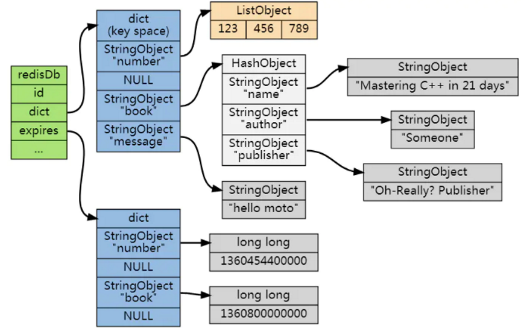

# 1. Redis 缓存淘汰策略有哪些

Redis 缓存淘汰策略是**内存快满时，自动删一些 key 腾空间**，没设置过期时间的 key 也一样可能被删掉。

不管本地缓存还是分布式缓存，为了保证性能都用内存保存数据，受成本和内存限制，存储数据超过缓存容量时就需要剔除。常见的剔除策略有：

- **FIFO**：淘汰最早写入的数据
- **LRU**：剔除最近最少使用的数据
- **LFU**：剔除最近使用频率最低的数据

Redis 实现了 **LRU 与 LFU** 两种淘汰算法，共提供 **8 种缓存淘汰策略**，其中 `volatile-lfu` 和 `allkeys-lfu` 是 **Redis 4.0 版本新增**的。

**不淘汰策略：**

- **noeviction**：缓存写满后再有写请求直接返回错误，**不淘汰任何数据**。这是 Redis 默认策略。Redis 用作缓存时实际数据集通常大于缓存容量，这个策略本身不腾空间，**一般不用在缓存场景**

*对设置了过期时间的 key 淘汰（volatile-* 系列）：\*

- **volatile-ttl**：根据过期时间先后筛选，**越早过期的越先被删除**
- **volatile-random**：在设置了过期时间的 key 中**随机删除**
- **volatile-lru**：用 LRU 算法筛选设置了过期时间的 key
- **volatile-lfu**：用 LFU 算法筛选设置了过期时间的 key（Redis 4.0+）

*对所有 key 淘汰（allkeys-* 系列）：\*

- **allkeys-random**：从所有 key 中**随机选择**并删除
- **allkeys-lru**：用 LRU 算法在所有数据中筛选
- **allkeys-lfu**：用 LFU 算法在所有数据中筛选（Redis 4.0+）

**一个重要前提：** 如果库中**没有设置 expire 的 key**，不满足 volatile 策略的先决条件，那么 `volatile-lru`、`volatile-random`、`volatile-ttl`、`volatile-lfu` 的行为，**和 noeviction 基本一致**——因为没有候选 key 可以淘汰，新写入会失败。

# 2. 实际场景下怎么选择淘汰策略

选型核心是看**业务的数据访问特征**和**缓存数据的重要性区分**：

- **优先推荐 allkeys-lru**：充分利用 LRU 经典算法的优势，把最近最常访问的数据留在缓存中，提升应用访问性能。**业务数据有明显冷热区分时首选这个**
- **没有明显冷热区分用 allkeys-random**：业务数据访问频率相差不大，没有热点数据时，随机选择淘汰即可，性能开销也最小
- **重要数据不能丢用 volatile-lru**：如果 Redis 同时存了**持久化数据（不能丢）和缓存数据**，给缓存数据设置过期时间，用 volatile-lru 让缓存 key 优先被淘汰，持久化数据不受影响
- **明显热点访问场景用 allkeys-lfu**：比如新闻热点、爆款商品场景，LFU 按访问频率淘汰，比 LRU 更能保护真正的热点数据，避免**偶尔扫一次的冷数据**因为最近访问过而占住缓存

**绝对不要用 noeviction 做缓存**——缓存写满直接报错，业务直接挂。

# 3. LRU 和 LFU 的区别

两者都是为了**保留有价值的数据，淘汰没价值的数据**，但判断价值的维度不同：

- **LRU（Least Recently Used）**：按**最近访问时间**淘汰，最久没被访问的先删。隐含假设是"**最近访问过的数据将来还会被访问**"
- **LFU（Least Frequently Used）**：按**访问频率**淘汰，访问次数最少的先删。隐含假设是"**访问频率高的数据更有价值**"

**两者各自的问题：**

- **LRU 怕偶发流量**：比如有人扫了一批冷数据查询一次，这批冷数据"最近访问过"会把真正的热点数据挤出缓存，**缓存命中率断崖下跌**
- **LFU 怕历史包袱**：早期高频访问的数据计数很高，即使后来很久不访问也淘汰不掉，**新晋热点数据反而进不来**。Redis 的 LFU 通过**访问计数衰减机制**（`lfu-decay-time` 配置）解决这个问题

**选择建议：** 一般业务场景 LRU 够用；有明显热点且容易被偶发大流量冲击的场景（比如电商大促、新闻热搜），用 LFU 更稳。

# 4. Redis 的 LRU 是真正的 LRU 吗

不是，Redis 用的是**近似 LRU 算法**，不是严格的 LRU。

**为什么不用严格 LRU：** 严格 LRU 需要**双向链表**维护所有 key 的访问顺序，每次访问都要把 key 移到链表头，**额外内存开销和维护成本都很大**，对追求极致性能的 Redis 不划算。

**Redis 近似 LRU 的实现：**

- 每个 key 在 `redisObject` 中记录一个 **lru 字段**（24 位），保存最近一次访问的时间戳
- 触发淘汰时，**随机采样 N 个 key**（由 `maxmemory-samples` 控制，默认 5），淘汰其中 lru 字段最久的那个
- Redis 3.0 之后引入**淘汰池**：每次采样的候选 key 进入淘汰池，下次再采样时与池中已有 key 比较，**保留更接近真实 LRU 的候选**，进一步提升精度

**采样数的取舍：** `maxmemory-samples` 越大越接近精确 LRU，但 **CPU 开销也越大**。默认 5 是性能和精度的平衡，调到 10 已经非常接近真实 LRU。

LFU 同样用近似算法，思路类似——用一个字段同时编码**访问计数**和**衰减时间**，采样比较后淘汰。

# 5. Redis 中 key 的过期时间是怎么保存的

Redis 在 **redisDb 数据库结构**中专门用一个字典来保存所有设置了过期时间的 key 的过期时间，这个字典叫**过期字典（expires）**。

**过期字典的结构：**

- **过期字典的键**是一个**指针**，指向键空间（dict）中的某个键对象——也就是和键空间共享同一个 key 对象，**不会重复占用内存**
- **过期字典的值**是一个 `long long` 类型的整数，保存的是该 key 的**过期时间——一个毫秒级的 UNIX 时间戳**

也就是说，键空间存"key → value"的实际数据，过期字典存"key → 过期时间戳"的元信息，两边的 key 是**同一个对象的引用**。

**举个例子：** 过期字典中有两条记录

- 键 `alphabet` → 值 `1385877600000`（表示 alphabet 这个 key 的过期时间是 2013-12-01 00:00:00）
- 键 `book` → 值 `1388556000000`（表示 book 这个 key 的过期时间是 2014-01-01 22:00:00）

**判断 key 是否过期的流程：**

- 检查给定的 key 是否存在于过期字典中
- 如果不存在，说明 key **没设置过期时间**，永不过期
- 如果存在，取出过期时间戳，**与当前 Unix 时间戳比较**——当前时间大于过期时间，则判定为已过期，按删除策略处理

**为什么用单独的过期字典而不是把过期时间塞进 redisObject：** 过期 key 是少数，**绝大多数 key 没设置过期时间**。如果在每个 redisObject 里都加一个过期时间字段，会让所有 key 都多占 8 字节，**白白浪费内存**。用独立字典只为有过期时间的 key 维护元数据，是空间最优的设计。

设置和查询过期时间的命令：`EXPIRE` / `PEXPIRE` / `EXPIREAT` / `PEXPIREAT` 设置，`TTL` / `PTTL` 查询剩余时间，`PERSIST` 移除过期时间（从过期字典中删除该条目，但不删 key 本身）。

# 6. Redis 过期 key 的删除策略

注意区分：**过期删除策略**（key 到期了怎么处理）和**内存淘汰策略**（内存满了怎么办），是两件事。

如果一个 key 过期了，**并不会立刻从内存中删除**——Redis 出于性能考虑做了取舍。

理论上一共有三种过期删除策略：

- **定时删除**（也叫**立即删除**）：设置 key 的过期时间时，**同时创建一个回调事件 / 定时器**，到期由时间事件处理器自动触发删除。属于**主动删除**，实时性最高
- **惰性删除**：key 过期了不管，**每次从 dict 字典中按 key 取值时**先检查是否过期，过期就删除并返回 nil，没过期就正常返回键值。属于**被动删除**
- **定期删除**：每隔一段时间，**对 expires 过期字典进行扫描**，批量删除其中已过期的 key。属于**主动删除**

**三种策略各自的取舍：**

- **定时删除**：内存最友好（过期立刻释放），但**对 CPU 不友好**——给每个过期 key 都创建定时器开销巨大，过期 key 多时大量 CPU 耗在跑定时器上，**影响主线程响应客户端命令**，Redis 不采用
- **惰性删除**：**CPU 最友好**（不主动扫），但**内存不友好**——长期不访问的过期 key 会一直占内存，存在**内存泄漏风险**
- **定期删除**：折中方案，限制单次执行时长和频率（默认每秒 10 次，由 `hz` 配置），**平衡 CPU 和内存**。难点是频率和时长把握——太频繁退化为定时删除占 CPU，太稀又退化为惰性删除占内存

**Redis 实际采用的策略：惰性删除 + 定期删除两者配合**，兼顾 CPU 和内存。

**主动淘汰兜底：** 如果大量 key 过期但既没被访问（惰性失效）也没被定期扫描抽中，会持续占内存。当**已用内存超过 maxmemory**（前提是配置了 maxmemory）时，触发**主动淘汰策略**，按 maxmemory-policy 清理 key 作为最终兜底。

# 7. AOF / RDB / 主从复制场景下过期键怎么处理

过期 key 的处理不只是内存层面的事，还要保证**持久化文件的正确性**和**主从数据一致性**：

**RDB 持久化：**

- **生成 RDB 阶段**（执行 `SAVE` 或 `BGSAVE`）：**已过期的 key 不会保存到 RDB 文件中**
- **载入 RDB 阶段**（启动时）：
  - **主服务器载入**：**不会载入过期 key**，过期的直接被忽略
  - **从服务器载入**：**过期 key 也会被载入**。但因为主从同步时从节点会被清空（接受主节点的全量数据），过期 key 对从节点一般没有影响

**AOF 持久化：**

- **正常写入阶段**：一个 key 已过期但**还没被惰性删除或定期删除**时，**AOF 文件不会因这个过期 key 产生任何影响**（保持原样）
- **过期 key 被实际删除时**：会向 AOF 文件**追加一条 DEL 命令**，显式记录该 key 被删除，保证 AOF 重放时数据一致
- **典型示例**：客户端执行 `GET message` 访问一个已过期的 message 键，服务器会执行三个动作：
  - 删除 message 键
  - 追加 `DEL message` 命令到 AOF 文件
  - 向客户端返回空（nil）
- **AOF 重写**：执行 AOF 重写时**会检查每个键是否过期**，**过期的 key 不会写入重写后的新 AOF 文件**

**主从复制：**

主从复制场景下，**从节点的过期 key 删除完全由主节点控制**，目的是保证**主从数据一致**：

- 主节点删除一个过期 key 后，会**向所有从节点发送 DEL 命令**，告知它们删除这个 key
- 从节点**执行客户端的读命令时，即使 key 已过期也不会主动删除**，而是**当作没过期一样处理**并返回数据
- 从节点**只有在收到主节点发来的 DEL 命令时**才会删除过期 key

**3.2 版本前后的差异：** 上面这种"从节点不主动删过期 key"的策略，在 **Redis 3.2 之前**会导致从节点读到过期数据的问题；**Redis 3.2+ 已经优化**——从节点对过期 key 的读请求会**直接返回 nil**（虽然内存上还没物理删除），避免读到脏数据，进一步保证了主从一致性。

# 8. 缓存淘汰相关的核心配置项

为了适配缓存场景，Redis 提供两个核心配置项：

- **maxmemory**：设置内存使用上限，**不能小于 1M**。默认值 0，此时系统会自行计算一个内存上限（**32 位系统默认 3GB，64 位系统不限制**）。**生产环境必须显式设置**，避免 Redis 占满机器内存触发 OOM
- **maxmemory-policy**：指定使用哪种淘汰策略，可选值就是上面 8 种策略之一，**默认 noeviction**。生产环境一般改成 `allkeys-lru` 或 `volatile-lru`

**辅助配置项：**

- **maxmemory-samples**：LRU/LFU 近似算法的采样数，默认 5
- **lfu-log-factor**：LFU 计数器的对数增长因子，控制访问频率的统计精度
- **lfu-decay-time**：LFU 计数器的衰减时间（分钟），控制历史计数多久衰减一次，避免历史包袱问题

**实战建议：** 部署 Redis 时**必做的两件事**——设置 maxmemory（一般设为机器内存的 60%\~70%，给系统和复制缓冲区留余量）、把 maxmemory-policy 从默认的 noeviction 改成业务匹配的策略。

