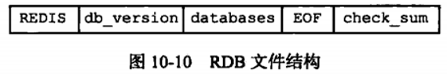
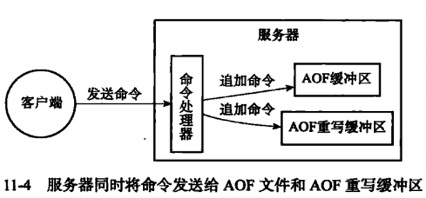

# 1. Redis 持久化机制有哪些

Redis 是内存数据库，数据主要放在内存里，**持久化机制的作用就是把内存数据保存到磁盘，降低进程重启、机器宕机后的数据丢失风险**。

Redis 主要有 **3 种持久化机制**：RDB、AOF、RDB + AOF 混合持久化。

**1. RDB 持久化**

RDB 是 **快照持久化**，会在某个时间点把 Redis 内存中的数据生成一份紧凑的二进制快照文件，默认文件名通常是 `dump.rdb`。

它的特点是：

- **恢复速度快**：RDB 文件是紧凑的二进制数据，加载效率高，适合全量备份和灾难恢复
- **对主线程影响小**：通常通过 `BGSAVE` fork 子进程生成快照，主进程继续处理请求
- **可能丢数据**：RDB 是周期性快照，如果两次快照之间 Redis 宕机，最后一次快照之后的数据会丢失
- **适合做冷备份**：比如定时把 RDB 文件复制到远程机器或对象存储

**2. AOF 持久化**

AOF 是 **追加日志持久化**，Redis 会把每一条写命令追加到 AOF 文件中，默认文件名通常是 `appendonly.aof`。Redis **重启时，通过重新执行这些写命令来恢复数据** 。

它的特点是：

- **数据安全性更高**：可以通过 `appendfsync` 控制刷盘频率，生产常用 `everysec`，一般最多丢 1 秒数据
- **日志可读性较好**：AOF 本质是 Redis 协议格式的写命令，排查问题时比 RDB 更直观
- **文件体积可能较大**：同一个 key 多次修改会产生多条日志，需要 AOF 重写压缩
- **恢复速度通常慢于 RDB**：因为要重放写命令，数据量大时恢复耗时更长

AOF 的刷盘策略有 3 种：

- `appendfsync always`：每条写命令都刷盘，**安全性最高但性能最差**
- `appendfsync everysec`：每秒刷盘一次，**性能和安全性折中，生产最常用**
- `appendfsync no`：交给操作系统决定什么时候刷盘，**性能最好但丢数据风险最大**

**3. 混合持久化**

Redis 4.0 之后支持 **RDB + AOF 混合持久化**。开启后，AOF 重写生成的新文件前半部分是 RDB 快照，后半部分是增量 AOF 日志。

它的特点是：

- **恢复速度接近 RDB**：先快速加载 RDB 快照
- **数据完整性接近 AOF**：再重放快照之后的增量写命令
- **兼顾恢复速度和数据安全性**：是 Redis 生产环境很常见的选择
- **文件可读性变差**：因为前半部分是 RDB 二进制内容，不再是纯文本命令日志

**面试中可以这样总结：**

- **RDB**：定期生成内存快照，恢复快、文件小，但两次快照之间可能丢数据
- **AOF**：记录每条写命令，数据更安全，但文件更大、恢复更慢，需要重写
- **混合持久化**：RDB 做基础快照，AOF 记录增量，兼顾恢复速度和数据完整性
- 如果追求恢复速度和备份方便，可以用 RDB
- 如果更关注数据安全，应该开启 AOF
- 生产环境通常建议 **开启 AOF，并使用 everysec 刷盘策略，必要时配合混合持久化**

# 2. RDB 和 AOF 有什么优缺点

RDB 和 AOF 的核心区别是：**RDB 记录某一时刻的数据快照，AOF 记录每一条写命令日志**。所以它们的优缺点也分别围绕恢复速度、数据安全性、文件体积和运行开销展开。

**RDB 的优点：**

- **文件体积小**：RDB 是紧凑的二进制快照文件，比 AOF 日志更省磁盘空间
- **恢复速度快**：重启时直接加载快照数据，不需要逐条重放写命令，适合大数据量快速恢复
- **适合备份和容灾**：RDB 文件是某个时间点的完整数据集，方便定时复制到远程机器或对象存储
- **对主线程影响相对小**：通常通过 `BGSAVE` fork 子进程生成快照，主进程继续处理客户端请求

**RDB 的缺点：**

- **数据丢失风险更大**：RDB 是周期性快照，如果两次快照之间 Redis 宕机，最后一次快照之后的数据会丢失
- **fork 成本高**：数据量很大时，`BGSAVE` 需要 fork 子进程，可能造成短暂阻塞，并带来额外内存压力
- **不适合做高实时持久化**：它更像定期备份，不适合要求尽量少丢数据的场景

**AOF 的优点：**

- **数据安全性更高**：AOF 记录每条写命令，配合 `appendfsync everysec`，通常最多丢 1 秒左右的数据
- **日志更易读、更易修复**：AOF 保存的是 Redis 协议格式的写命令，出现误操作或文件尾部损坏时，相对更容易人工分析和修复
- **追加写性能较好**：AOF 主要是顺序追加写磁盘，不是随机写
- **持久化粒度更细**：相比 RDB 的时间点快照，AOF 能记录更接近实时的数据变化

**AOF 的缺点：**

- **文件体积更大**：同一个 key 多次修改会产生多条命令日志，通常比 RDB 文件大
- **恢复速度更慢**：Redis 重启时需要重放 AOF 中的写命令，数据量大时恢复时间明显长于 RDB
- **需要 AOF 重写**：为了压缩日志文件，需要定期执行 `BGREWRITEAOF`，重写期间也会带来 CPU、磁盘 IO 和内存开销
- **刷盘策略影响性能和安全性**：`always` 最安全但性能差，`no` 性能好但丢数据风险大，生产一般选 `everysec`

**面试中可以这样对比：**

- **RDB 偏备份和快速恢复**：文件小、恢复快、适合冷备，但两次快照之间可能丢数据
- **AOF 偏数据安全和实时恢复**：丢数据更少，但文件更大、恢复更慢、需要重写
- 如果 Redis 主要做缓存，可以只用 RDB 或不开持久化，看业务能否接受重建缓存
- 如果 Redis 存放相对重要的数据，应该开启 AOF，生产常用 `appendfsync everysec`
- 如果既想恢复快，又想尽量少丢数据，可以使用 **RDB + AOF 混合持久化**

# 3. RDB 的文件结构是什么样的

RDB 文件是 Redis 的**二进制快照文件**，保存的是某一时刻 Redis 内存中的全量数据。它不是命令日志，而是按照固定格式把数据库、key、value、过期时间等信息序列化到磁盘中。

从整体上看，RDB 文件主要由 **5 部分组成**：

- **REDIS 文件头**：标识这是一个 RDB 文件，并记录 RDB 版本号
- **辅助信息区**：保存 Redis 版本、创建时间、内存使用量、RDB 生成时的环境信息等元数据
- **数据库数据区**：保存每个数据库中的 key-value 数据，是 RDB 文件的核心部分
- **EOF 结束标识**：表示 RDB 文件主体内容结束
- **校验和**：用于校验 RDB 文件是否损坏



**1. 文件头**

RDB 文件开头通常是类似 `REDIS0009` 这样的内容：

- `REDIS`：固定魔数，用来判断这个文件是不是 Redis RDB 文件
- `0009`：RDB 文件格式版本号，不同 Redis 版本可能生成不同版本的 RDB 文件

Redis 启动加载 RDB 时，会先检查文件头。如果文件头不合法，说明这不是有效的 RDB 文件，加载会失败。

**2. 辅助信息区**

文件头之后会有一些辅助字段，常见信息包括：

- **Redis 版本号**：比如生成该 RDB 文件的 Redis 版本
- **RDB 创建时间**：用于记录快照生成时间
- **使用内存大小**：记录生成快照时 Redis 占用的内存
- **AOF 相关标记**：比如是否来自混合持久化场景

这部分不是业务数据，主要用于 Redis 恢复、兼容性判断和排查问题。

**3. 数据库数据区**

数据库数据区是 RDB 文件最重要的部分。Redis 支持多个逻辑库，RDB 会按数据库组织数据，大致结构是：

- `SELECTDB`：表示接下来是哪一个数据库，比如 0 号库、1 号库
- `DBSIZE`：记录当前数据库中 key 的数量、带过期时间 key 的数量，用于加载时预分配字典空间，提高恢复效率
- **key-value 数据**：保存具体的键值对

每个 key-value 通常会保存这些信息：

- **过期时间**：如果 key 设置了过期时间，会先写入毫秒级或秒级过期时间
- **value 类型**：比如 String、List、Hash、Set、ZSet 等
- **key 内容**：保存 key 的字符串内容
- **value 内容**：根据不同数据类型采用不同编码方式保存

举例来说，一个 String 类型的 key，在 RDB 中不是保存成 `SET key value` 命令，而是保存成类似：

- 过期时间（可选）
- value 类型标识（String）
- key 的二进制内容
- value 的二进制内容

所以 RDB 的特点是：**保存的是数据结果，不是写命令过程**。

**4. EOF 和校验和**

所有数据库数据写完之后，RDB 文件会写入：

- **EOF 标识**：表示 RDB 主体结束
- **CRC64 校验和**：Redis 加载 RDB 时会根据校验和判断文件内容是否完整、是否损坏

如果校验失败，Redis 会认为 RDB 文件不可靠，通常会拒绝加载，避免用坏文件恢复出错误数据。

**面试中可以这样回答：**

RDB 文件本质是一个**二进制快照文件**，整体结构可以概括为：`REDIS` 文件头 + 辅助元信息 + 多个数据库的数据 + EOF + 校验和。数据库数据区里会记录库编号、key 数量、过期时间、value 类型、key 内容和 value 内容。它保存的是某一时刻的数据结果，不是命令日志，所以文件紧凑、恢复快，但可读性差，也无法像 AOF 一样直观看到每条写命令。

# 4. RDB 生成时机和使用

RDB 文件的生成和使用可以分两块看：**什么时候把内存数据生成 RDB 文件**，以及 **Redis 什么时候加载这个 RDB 文件恢复数据**。

**RDB 文件的生成时机主要有 4 种：**

**1. 执行** `SAVE` 命令

`SAVE` 会让 Redis **同步生成 RDB 文件**：

- Redis 主进程直接把当前内存数据写成 RDB 文件
- 生成期间 Redis **不能处理其他客户端命令**
- 如果数据量很大，会造成明显阻塞

所以 `SAVE` 一般不建议在线上执行，更多用于测试环境或明确能接受阻塞的场景。

**2. 执行** `BGSAVE` 命令

`BGSAVE` 是线上更常见的方式，它会让 Redis **后台生成 RDB 文件**：

- Redis 主进程先 `fork` 一个子进程
- 子进程负责把内存数据写入临时 RDB 文件
- 主进程继续处理客户端请求
- 子进程写完后，用新的 RDB 文件替换旧的 RDB 文件

这里依赖操作系统的 **写时复制（Copy On Write，COW）** 机制：fork 之后父子进程共享内存页，只有父进程继续写入并修改某些内存页时，操作系统才复制这些页给子进程使用。

需要注意：

- `BGSAVE` 不会长时间阻塞主线程，但 **fork 本身可能短暂阻塞**
- 数据量越大，fork 成本越高
- 如果快照期间写入很多数据，COW 会带来额外内存消耗

**3. 配置** `save` 规则自动触发

Redis 可以通过配置文件里的 `save` 规则自动触发 RDB 快照，比如：

- `save 900 1`：900 秒内至少 1 个 key 发生变化，就触发一次 `BGSAVE`
- `save 300 10`：300 秒内至少 10 个 key 发生变化，就触发一次 `BGSAVE`
- `save 60 10000`：60 秒内至少 10000 个 key 发生变化，就触发一次 `BGSAVE`

这些规则的含义是：**在指定时间窗口内，写操作次数达到阈值，就自动执行一次后台快照**。

**新的RDB文件会覆盖旧的** ，如果不希望 Redis 自动生成 RDB，可以把 `save` 配置清空，例如配置成 `save ""`。

**4. 特定场景下 Redis 自动生成 RDB**

除了手动命令和 `save` 配置，Redis 在一些内部场景也会生成或使用 RDB：

- **主从全量复制**：从节点第一次同步或无法部分重同步时，主节点通常会执行 `BGSAVE`，生成 RDB 后发送给从节点
- **执行** `SHUTDOWN`：如果开启了 RDB 且没有开启 AOF，Redis 关闭时可能会生成 RDB 文件
- **AOF 重写的混合持久化**：开启混合持久化后，AOF 重写文件前半部分会以 RDB 格式保存全量快照

**RDB 文件怎么使用：**

RDB 文件最核心的使用场景是 **Redis 启动时恢复数据**。

Redis 启动时会根据配置找到 RDB 文件：

- `dir`：RDB 文件所在目录
- `dbfilename`：RDB 文件名，默认通常是 `dump.rdb`

**RDB 自动加载的前置条件：**

- **RDB 文件存在**：默认文件名是 `dump.rdb`，存放路径由 `dir` 配置指定；如果该路径下没有 RDB 文件，就没有可加载的数据
- **RDB 文件完整且校验通过**：文件头、版本号、EOF、CRC64 校验和等信息必须正常；如果文件损坏，Redis 会在启动日志打印错误，通常会拒绝启动，避免恢复出错误数据，而不是默认静默启动成空库
- **未开启 AOF**：如果开启了 AOF，Redis 启动恢复时会优先走 AOF 加载逻辑；即使 `dump.rdb` 存在，也不会优先加载 RDB
- **启动配置没有绕开原 RDB 文件**：比如把 `dir` 指向了其他目录、把 `dbfilename` 改成其他文件名，都会导致 Redis 找不到原来的 `dump.rdb`

**启动参数或配置干扰：**

- `redis-server --appendonly yes`：等价于启动时强制开启 AOF，Redis 会优先加载 AOF；如果 AOF 文件不存在或是空的，可能导致看起来像没有加载原来的 RDB
- 修改 `--dir`：会改变持久化文件查找目录，原目录下的 `dump.rdb` 不会被加载
- 修改 `--dbfilename`：会改变 RDB 文件名，原来的 `dump.rdb` 不会被加载
- `save ""`：只是关闭后续自动 RDB 快照生成，**不等于启动时忽略已有 RDB 文件**。只要 AOF 没开启，且 `dir` / `dbfilename` 指向的 RDB 文件存在并校验通过，Redis 启动时仍然会尝试加载它

需要注意：Redis 原生常见配置里没有通用的 `redis-server --no-rdb` 启动参数。面试或排查时更准确的说法是：**通过开启 AOF、修改** `dir` / `dbfilename`、删除或移动 RDB 文件，都会让 Redis 启动时不加载原来的 RDB。如果是某些运维脚本或发行版封装了类似 `--no-rdb` 的参数，要以实际版本和启动脚本为准。

加载流程大致是：

- Redis 启动后检查持久化文件是否存在
- 如果需要加载 RDB，就读取 `dump.rdb`
- 校验 RDB 文件头、版本号和校验和
- 按数据库、key、value、过期时间等信息重建内存数据结构
- 如果某个 key 已经过期，加载时会根据主从角色和过期时间处理

**RDB 和 AOF 同时开启时怎么加载：**

如果同时开启了 RDB 和 AOF，Redis 启动恢复时通常 **优先加载 AOF 文件**，因为 AOF 记录更细，数据一般比 RDB 更新。只有在没有可用 AOF 文件时，才会加载 RDB 文件。

如果开启了 **混合持久化**，Redis 加载的仍然是 AOF 文件，只 **是这个 AOF 文件的前半部分是 RDB 格式快照，后半部分是 AOF 增量命令** 。

**RDB 文件的实际用途：**

- **宕机恢复**：Redis 重启后加载 RDB，把数据恢复到最近一次快照状态
- **冷备份**：定时把 `dump.rdb` 复制到远程机器、对象存储或备份系统
- **数据迁移**：把 RDB 文件拷贝到另一台 Redis 机器，让新实例加载恢复
- **主从复制**：主节点生成 RDB 后发送给从节点，从节点加载 RDB 完成全量同步
- **离线分析**：用工具解析 RDB 文件，分析 key 数量、类型分布、内存占用等

**面试中可以这样回答：**

- RDB 文件可以通过 `SAVE` 同步生成，也可以通过 `BGSAVE` 后台生成，生产主要用 `BGSAVE`。
- Redis 还可以根据 `save` 配置自动触发 RDB，比如多少秒内有多少次写入就生成一次快照。
- 主从全量复制、关闭 Redis、混合持久化 AOF 重写等场景也可能用到 RDB。
- RDB 文件主要在 Redis 启动时加载恢复数据，也可以用于冷备份、迁移、主从全量同步和离线分析。
- RDB 自动加载的前提是：`dir` 和 `dbfilename` 能找到 RDB 文件、文件完整且校验通过、没有开启 AOF、启动配置没有绕开原 RDB 文件。
- 如果 RDB 和 AOF 同时开启，Redis 一般优先用 AOF 恢复，因为 AOF 的数据更新。

# 5. AOF 的格式是什么样

AOF 文件保存的是 **Redis 写命令**，格式采用 Redis 客户端和服务端通信使用的 **RESP 协议格式**，本质上是一条条可重放的命令。

比如执行：

```shell
SET name feiya
```

AOF 中大致会记录成：

```text
*3
$3
SET
$4
name
$5
feiya
```

含义是：

- `*3`：这条命令有 3 个参数
- `$3`：后面这个参数长度是 3，也就是 `SET`
- `$4`：后面这个参数长度是 4，也就是 `name`
- `$5`：后面这个参数长度是 5，也就是 `feiya`

所以 AOF 不是简单的纯文本命令 `SET name feiya`，而是 **RESP 协议格式的命令日志**。Redis 重启时会顺序读取 AOF，把里面的写命令重新执行一遍来恢复数据。

如果开启 **混合持久化**，AOF 文件前半部分是 RDB 二进制快照，后半部分才是 AOF 增量命令。

# 6. AOF 重写及重写过程

AOF 重写不是把旧 AOF 文件重新整理一遍，而是 **根据当前 Redis 内存中的最终数据状态，重新生成一份更小的新 AOF 文件**。

为什么需要 AOF 重写：

- AOF 是追加日志，同一个 key 多次修改会产生很多历史命令
- 很多历史命令对最终数据没有意义，比如 `set k 1`、`set k 2`、`set k 3`，最终只需要保留 `set k 3`
- AOF 文件太大会导致磁盘占用变大、重启恢复变慢
- 重写后可以用更少的命令恢复出同样的数据

举个例子，原 AOF 里可能有：

```text
SET name a
SET name b
SET name c
```

重写后只需要：

```text
SET name c
```

对于 List、Set、Hash、ZSet 这类结构，重写时也会根据当前数据状态生成等价命令，而不是保留所有历史操作过程。

**AOF 重写触发方式：**

- 手动执行 `BGREWRITEAOF`
- Redis 根据配置自动触发，比如 `auto-aof-rewrite-percentage` 和 `auto-aof-rewrite-min-size`

**AOF 重写过程：**

- Redis 主进程收到重写请求后，先 `fork` 一个子进程
- 子进程基于  **fork 时的内存快照，遍历当前数据库数据** ，生成新的 AOF 临时文件
- 主进程继续处理客户端请求，不会长时间阻塞
- **重写期间新的写命令会同时写入旧 AOF 缓冲区** ，并记录到 **AOF 重写缓冲区**
- 子进程写完临时文件后，通知主进程
- 主进程把  **AOF 重写缓冲区里的增量命令追加到新 AOF 文件末尾**
- 最后用新 AOF 文件原子替换旧 AOF 文件

这里的关键点是：**子进程负责生成重写期间之前的数据，AOF 重写缓冲区负责补上重写期间新增的写命令**，这样新 AOF 文件就能覆盖完整数据。

**怎么理解“子进程基于 fork 时的内存快照，遍历当前数据库数据”：**

- `fork` 发生的一瞬间，子进程看到的是**当时 Redis 内存里的数据状态**，可以理解成给内存拍了一张快照
- 这个快照不是立刻复制一份完整内存，而是依赖操作系统的 **COW （copy-on-write）写时复制**：
  父子进程先共享内存页，只有父进程后续修改某些数据页时，操作系统才复制旧页给子进程保留
- 所以子进程遍历的“当前数据库数据”，指的是**子进程视角下 fork 那一刻的数据**，不是主进程后续继续写入后的最新数据
- fork 之后主进程新执行的写命令，不会自动体现在子进程生成的新 AOF 文件里，所以必须额外写入 **AOF 重写缓冲区**，最后追加到新 AOF 文件末尾

举个例子：fork 时 `name = a`，子进程会按 `name = a` 生成新 AOF；重写期间主进程执行 `SET name b`，这条命令会进入 AOF 重写缓冲区；子进程完成后，主进程把 `SET name b` 追加到新 AOF 末尾，最终恢复出来就是 `name = b`。



需要注意：

- AOF 重写期间主线程主要在 fork 和最终替换阶段可能短暂阻塞
- 数据量越大，fork 成本越高
- 重写期间如果写入很多数据，COW 和重写缓冲区会带来额外内存压力
- 如果开启混合持久化，重写后的新 AOF 文件前半部分是 RDB 快照，后半部分是 AOF 增量命令

**面试中可以这样回答：**

AOF 重写就是根据 Redis 当前内存数据重新生成一份更小的 AOF 文件，目的是压缩历史冗余命令，降低磁盘占用和恢复时间。它不是读取旧 AOF 后压缩，而是 `fork` 子进程遍历当前数据生成新文件。重写期间主进程继续处理请求，并把新增写命令记录到 AOF 重写缓冲区。子进程完成后，主进程把缓冲区里的增量命令追加到新文件，再用新文件替换旧文件。

# 7. 如果 Redis 机器突然掉电会怎样

Redis 机器突然掉电后，**是否丢数据、丢多少数据，取决于是否开启持久化以及持久化策略**。

常见情况是：

- **没有开启持久化**：Redis 数据只在内存里，机器掉电后内存数据全部丢失
- **只开启 RDB**：Redis 可以从最近一次 RDB 快照恢复，但**最后一次快照之后的写入会丢失**
- **只开启 AOF**：Redis 可以通过 AOF 日志重放恢复，丢失范围取决于 `appendfsync` 策略
- **开启混合持久化**：Redis 启动时先加载 RDB 部分，再重放后面的 AOF 增量日志，恢复速度和数据完整性都比较均衡

如果 AOF 使用不同刷盘策略，掉电后的影响不同：

- `always`：理论上每条写命令都落盘，**数据最安全**，但性能开销最大
- `everysec`：每秒刷盘一次，**一般最多丢 1 秒左右的数据**，生产最常用
- `no`：由操作系统决定刷盘时机，掉电时可能丢失较多数据

需要注意的是，**Redis 持久化不能保证绝对不丢数据**。原因是：

- RDB 是周期性快照，天然存在时间窗口
- AOF 即使用 `everysec`，也可能丢最近 1 秒左右的数据
- 即使用 `always`，也受磁盘、文件系统、硬件缓存等因素影响，性能成本也很高
- 主从复制是异步的，不能替代持久化，也不能保证强一致

所以面试里可以这样回答：**Redis 掉电后不是一定全丢，也不是一定不丢，要看持久化配置。没有持久化会全丢；RDB 会丢最近一次快照后的数据；AOF 的丢失范围取决于刷盘策略，生产常用 everysec，通常最多丢 1 秒左右。对数据绝对不能丢的核心业务，不能只依赖 Redis，要以数据库为准，Redis 更多作为缓存或加速层。**

