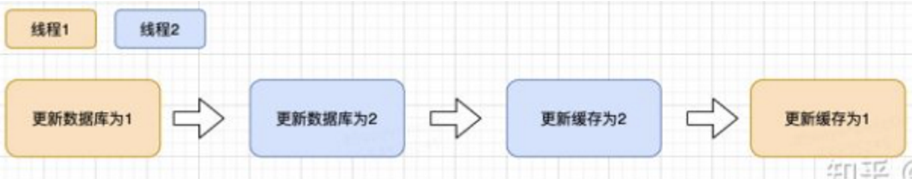
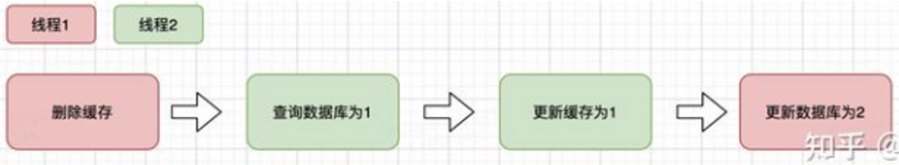
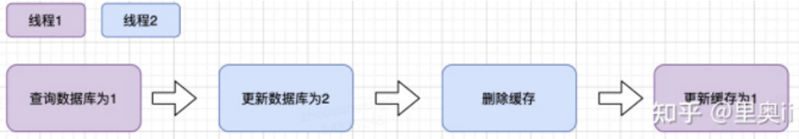
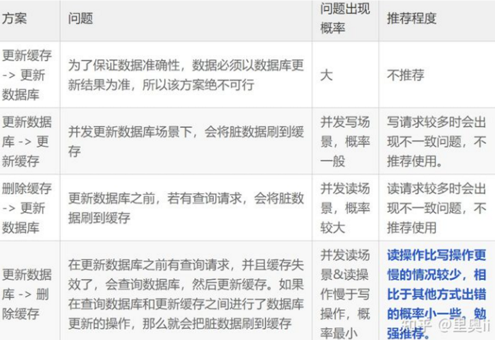

# 1. 缓存一致性问题

缓存一致性问题，本质是**同一份业务数据同时存在于数据库和缓存两套存储中，但两边更新不是一个原子操作**，所以在某些时间窗口内，缓存和数据库可能出现不一致。

面试里我一般会先说明一点：缓存一致性通常不是追求强一致，而是追求**最终一致性**。因为 Redis 缓存的定位是提升读性能，数据库才是最终数据源，只要业务能接受短时间不一致，就通过合理的更新策略把不一致窗口控制在可接受范围内。

常见的不一致场景主要有几类：

- **先更新数据库，再更新缓存**：如果数据库更新成功，更新缓存失败，缓存里还是旧值；如果并发写入时两个线程交叉执行，还可能把旧数据覆盖成新缓存。
- **先更新缓存，再更新数据库**：如果缓存更新成功，数据库更新失败，后续读到的就是脏数据，这种方案一般不推荐。
- **先删除缓存，再更新数据库**：删除缓存后，如果还没来得及更新数据库，另一个线程读数据库旧值并回填缓存，数据库随后更新成功，缓存就长期变成旧值。
- **先更新数据库，再删除缓存**：这是生产里更常见的方案，但仍然不是绝对一致，如果数据库更新成功后删除缓存失败，旧缓存会继续存在；并发读写下也存在极小概率的旧值回填问题。
- **主从延迟或读写分离**：写主库成功后，如果读请求从从库加载数据再写入缓存，可能把从库旧数据写进缓存。
- **缓存过期和重建并发**：热点 key 过期后多个请求同时回源，某个慢请求可能把较早读到的旧值覆盖到缓存里。

常见解决思路是：

- **不推荐直接更新缓存，优先使用更新数据库后删除缓存**。删除缓存比更新缓存更稳，因为很多缓存值不是数据库单行原样映射，可能有聚合、排序、权限过滤等逻辑，直接更新容易出错。
- **标准流程是先更新数据库，再删除缓存**。这样数据库始终是准的，缓存被删除后，下一次读请求再从数据库加载新值并写回缓存。
- **删除缓存失败要有补偿机制**。比如把删除失败的 key 写入重试队列，或者基于 MQ、Canal 监听 binlog 异步删除缓存，保证最终能删掉旧缓存。
- **对强一致要求高的场景，不要依赖缓存读结果**。例如余额、库存扣减、订单状态流转，关键判断应以数据库或事务内数据为准，缓存最多做展示或加速。
- **给缓存设置合理 TTL**。TTL 是最终兜底，即使删除失败，旧缓存也不会永久存在；热点 key 可以配合逻辑过期、异步刷新，避免集中失效。
- **必要时使用延迟双删**。先删除缓存，更新数据库后再延迟删除一次，或者更新数据库后立即删一次、延迟再删一次，用来降低并发读把旧值回填缓存的概率，但它只能降低风险，不能保证强一致。
- **避免从延迟从库回填缓存**。写后短时间内读主库，或者回填缓存时强制查主库，防止把从库旧值写入 Redis。

如果面试官继续追问“为什么不是先删缓存再更新数据库”，可以这样回答：

- 先删缓存后更新数据库，中间有窗口期。
- 窗口期内如果有读请求发现缓存不存在，就会查询数据库旧值并写回缓存。
- 随后写请求把数据库更新成新值，但缓存里已经是旧值，而且可能一直到 TTL 过期才恢复。
- 所以相比之下，**先更新数据库再删除缓存的不一致窗口更小，是更常用的实践方案**。

如果面试官追问“先更新数据库再删除缓存有没有问题”，答案是有，但概率更低：

- 一个读请求缓存未命中，先查到数据库旧值。
- 这时写请求更新数据库并删除缓存。
- 读请求最后才把刚才查到的旧值写入缓存。
- 这个场景要求读请求比写请求更早查库、但更晚写缓存，发生概率相对低，可以通过延迟双删、版本号校验、短 TTL、逻辑过期等方式降低影响。

总结一句话：缓存一致性问题的核心不是让 Redis 和数据库做到事务级强一致，而是**明确数据库是最终事实源，通过“更新数据库后删除缓存 + 失败重试补偿 + TTL 兜底 + 必要时延迟双删”的组合，保证最终一致，并把短暂不一致控制在业务可接受范围内**。

# 2. 解决缓存一致性方案

解决缓存一致性问题，首先要明确一个前提：**没有普适性的完美方案，只有适不适合业务场景的方案**。只要同时写数据库和缓存，就是双存储双写，两个操作不可能天然具备一个本地事务的原子性，中间一定存在失败、延迟和并发交错的窗口。

所以生产里通常不会要求 Redis 和 MySQL 做强一致，而是根据业务选择一致性等级：

- **强一致场景**：比如余额、库存扣减、支付状态、订单状态流转，关键判断不要依赖缓存，必须以数据库事务或强一致存储为准。
- **最终一致场景**：比如商品详情、用户基础信息、配置展示、列表页缓存，可以接受短时间旧数据，通过删除缓存、异步重试、TTL 兜底保证最终一致。
- **弱一致场景**：比如排行榜、计数、推荐结果，对实时性要求不高，可以通过定时刷新、异步刷新、批量重建缓存来处理。

常见方案主要有几类。

**第一种，更新数据库后删除缓存。**

这是最常用的 Cache Aside 模式：

- 读请求先读 Redis。
- Redis 未命中时读 MySQL。
- 读到数据后写入 Redis。
- 写请求先更新 MySQL。
- MySQL 更新成功后删除 Redis 缓存。

这个方案的优点是实现简单，数据库始终是最终事实源，删除缓存比更新缓存更稳，因为缓存内容可能是聚合结果，不一定能根据一次数据库更新准确重算。

它的问题是删除缓存可能失败，所以必须配合补偿机制：

- 删除失败时记录失败 key，放入本地重试队列或 MQ。
- 后台任务按次数、间隔、退避策略重试删除。
- 重试仍失败时告警，避免旧缓存长期存在。
- 给缓存设置 TTL，作为最后兜底。

**第二种，延迟双删。**

延迟双删一般用于降低并发读写导致旧值回填缓存的概率，典型流程是：

- 先删除缓存。
- 再更新数据库。
- 等待一小段时间后，再删除一次缓存。

也可以采用更新数据库后立即删除一次缓存，再延迟删除一次缓存。延迟时间要参考一次查询数据库并回填缓存的耗时，通常要大于这段读链路时间。

它的优点是能降低旧值回填概率，缺点也很明显：

- 延迟时间不好精确设置。
- 只能降低概率，不能保证强一致。
- 会增加一次额外删除操作和异步任务复杂度。

所以它适合对短暂不一致比较敏感、但又不需要绝对强一致的业务。

**第三种，监听 binlog 异步更新或删除缓存。**

这个方案是通过 Canal、Debezium 这类组件监听 MySQL binlog，感知数据库真实变更，再异步处理 Redis：

- 应用只负责写 MySQL。
- MySQL 写成功后产生 binlog。
- Canal 订阅 binlog，解析出变更表、主键和操作类型。
- 缓存同步服务根据变更内容删除 Redis key，或者重建 Redis 数据。

这个方案的核心价值是**把缓存一致性逻辑从业务代码中解耦出来**，尤其适合多个系统都会修改同一张表的场景。如果只在某一个业务服务里删缓存，其他服务改库时很容易漏删；监听 binlog 可以统一感知数据库变更。

但它也不是完美方案：

- binlog 消费有延迟，所以仍然是最终一致。
- Canal 或 MQ 故障会导致缓存同步滞后。
- 要处理消息重复、乱序、丢失、重试和幂等。
- 数据库变更到缓存 key 的映射关系要维护好，尤其是列表缓存、聚合缓存、多维查询缓存。

实际落地时，通常更推荐**监听 binlog 后删除缓存，而不是直接更新缓存**。因为删除缓存更通用，下一次读请求会自然从数据库加载新值；直接更新缓存容易受缓存结构、聚合逻辑和并发顺序影响。

**第四种，消息队列异步补偿。**

业务写库成功后，发送一条缓存删除消息到 MQ，由消费者异步删除缓存：

- 写请求更新 MySQL。
- 写成功后发送删除缓存消息。
- 消费者删除 Redis。
- 删除失败则重试消费，超过阈值进入死信队列并告警。

这个方案适合写入链路不想被 Redis 删除耗时影响的场景，也方便做削峰和重试。需要注意的是，必须保证写库和发消息之间的可靠性，常见做法是本地消息表、事务消息，或者通过 binlog 驱动消息，避免数据库写成功但消息没发出去。

**第五种，TTL 兜底和缓存重建控制。**

无论采用哪种方案，都建议给缓存设置合理过期时间，因为 TTL 是最终兜底：

- 删除缓存失败时，旧数据不会永久存在。
- 缓存同步链路异常时，TTL 到期后仍有机会重新加载新数据。
- 对热点 key 可以使用逻辑过期和异步刷新，避免物理过期导致缓存击穿。

同时，缓存重建时要控制并发：

- 热点 key 未命中时使用互斥锁，避免大量请求同时回源。
- 回填缓存时可以带版本号或更新时间，避免旧请求覆盖新缓存。
- 对写后读一致性要求高的请求，可以短时间内读主库，不走缓存或不走延迟从库。

如果面试中要总结，可以这样说：

- **最常用方案是更新数据库后删除缓存，再配合失败重试和 TTL 兜底**。
- **更复杂的场景可以通过 Canal 监听 binlog，统一删除或重建缓存**。
- **对删除失败、消息失败、Canal 延迟，要用 MQ、本地消息表、重试队列、死信告警等补偿机制保证最终一致**。
- **对强一致业务，不要把缓存当判断依据，关键读写必须落到数据库或强一致存储**。

一句话总结：缓存一致性不是靠某一个动作解决的，而是**根据业务一致性要求，在更新数据库后删除缓存、binlog 订阅、消息补偿、TTL 兜底、延迟双删和强一致读数据库之间做组合取舍，目标是保证最终一致，并把不一致窗口控制在业务可接受范围内**。

# 3. 分布式缓存一致性问题方案对比

| **方案名称** | **技术特点** | **优点** | **缺点** | **适用** | **场景说明** |
| --- | --- | --- | --- | --- | --- |
| 数据实时同步更新 | 强一致性,更新数据库同时更新缓存，使用缓存工具和AOP实现 | 数据一致性强，不会出现缓存雪崩问题 | 代码耦合，运行期耦合 ，影响正常业务 ，增加一致网络开销 | 银行 | 适合写操作频繁的细粒度缓存数据，数据一致性要求比较高场景，如:银行业务，证券交易；不适合写操作较少粗粒度数据； |
| 数据准实时更新 | 准一致性，更新数据库后，异步更新缓存，使用AOP进行封装基于多线程或者MQ实现 | 数据同步有较短延迟，与业务解耦，不影响正常业务，不会出现缓存雪崩问题 | 有较短延迟，无法保证最终一致性，需要补偿机制 | 比较优雅 | 不适合写操作平凡并且数据一致性实时性要求严格的场景(较短不一致，写频繁导致mq消息剧增) |
| 缓存失效机制 | 弱一致性，基于缓存本身失效机制 | 实现简单，与业务完美结合，不影响正常业务 | 有一定延迟，存在缓存雪崩问题 | 互联网大量使用 | 不适合写操作平凡并且数据一致性实时性要求严格的场景，适合读多写少的互联网婵娟，能接受一定数据延时；如：电商业务,理财金融(收益第二天更新),社交类业务(点赞)等 |
| 任务调度更新 | 最终一致性，采用任务调度框架，按照一定频率更新 | 不影响正常业务 | 不保证一致性，代码复杂度增大(么个value都要维护异步更新代码)，容易堆积垃圾数据 | 统计类 | 适合复杂统计类数据缓存更新，对数据一致性实时性要求低的场景，如统计类数据，BI分析等 |

# 4. 更新数据后，缓存处理的几种方案优点和问题

更新数据后，缓存处理主要有四种方案，每种方案都有其优点和问题，生产中需要根据业务场景选择。

**方案一：更新缓存，更新数据库（先更新缓存，再更新数据库）**方案**不推荐使用**

- **优点**：实现简单，缓存更新后立即生效，读请求能快速获取新数据。
- **问题**：如果先更新缓存成功，但数据库更新失败，会导致**缓存与数据库数据不一致**，且缓存中的新数据可能长期存在，直到缓存过期或被删除。
- 这种方案**不推荐使用**，因为数据库更新失败时无法回滚缓存。

**方案二：更新数据库，更新缓存（双写）**

- **优点**：逻辑直接，更新数据库后立即更新缓存，保证缓存与数据库同步。
- **问题**：在**并发更新场景下**，两个线程交叉执行更新操作，可能将旧数据覆盖到缓存。例如：线程A更新数据库为新值，线程B更新数据库为更新值，但线程A随后更新缓存为旧值，导致缓存脏数据。另外，如果缓存更新失败，需要补偿机制。
  
  

**方案三：删除缓存，更新数据库（先删缓存，再更新数据库）**

- **优点**：删除缓存比更新缓存更安全，因为缓存内容可能是聚合结果，删除后下次读请求会从数据库重新加载，避免直接更新缓存的复杂性。
- **问题**：在更新数据库之前，如果有查询请求发现缓存不存在，会查询数据库旧值并写回缓存，导致**脏数据被放入缓存**。例如：请求A删除缓存，请求B查询数据库旧值并写入缓存，随后请求A更新数据库为新值，缓存中仍是旧值，且可能长期存在。
  
  

**方案四：更新数据库，删除缓存（先更新数据库，再删除缓存）**

- **优点**：这是**最常用的Cache Aside模式**，数据库始终是最终事实源，删除缓存后下一次读请求会从数据库加载新值。相对其他方案，**不一致窗口更小**。
- **问题**：在更新数据库之前，如果有查询请求且缓存失效，会查询数据库旧值并准备写入缓存。如果在查询数据库和写入缓存之间，数据库被更新且缓存被删除，那么旧值会被写入缓存，导致脏数据。但这种场景发生概率较低，因为需要读请求比写请求更早查库但更晚写缓存。
  
  

**方案三和方案四的共同缺点：**

- **主从延时问题**：无论先删还是后删缓存，数据库主从延时可能导致从库旧数据被读取并写入缓存。
- **缓存删除失败**：如果缓存删除失败，旧缓存会持续存在，导致数据不一致。

**解决思路：**

- **延迟双删**：先删除缓存，更新数据库后延迟一段时间再删除一次缓存，降低并发读将旧值写入缓存的概率。延迟时间应大于一次数据库查询并回填缓存的耗时。
- **添加重试机制**：缓存删除失败时，将失败key放入重试队列或MQ，后台任务按退避策略重试删除，保证最终删除成功。
- **TTL兜底**：给缓存设置合理过期时间，即使删除失败，旧缓存也不会永久存在。

面试中通常推荐**先更新数据库，再删除缓存**，配合失败重试和TTL兜底，这是生产中最常用的方案。对强一致要求高的场景，如余额、库存扣减，应以数据库事务为准，不依赖缓存读结果。

# 

