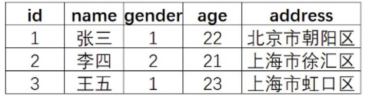
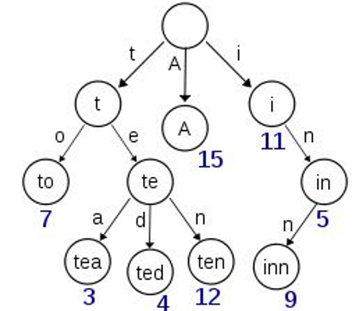
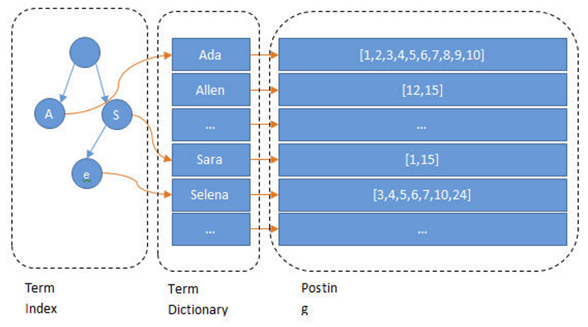
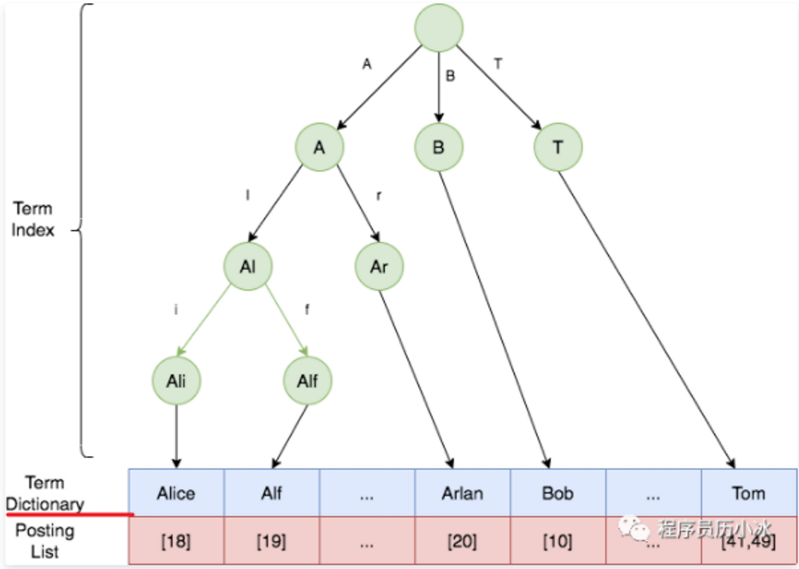

# 1. 介绍下倒排索引

倒排索引是 ES 实现全文搜索的核心数据结构。**传统数据库索引是正排索引，根据文档 ID 找到文档内容；倒排索引反过来，根据词项（Term）找到包含该词项的所有文档 ID 列表**。

**倒排索引的基本结构**：

倒排索引由三部分组成：

- **Term Dictionary（词项字典）**：存储所有去重后的词项（Term），按字典序排列，支持快速查找。
- **Posting List（倒排列表）**：每个词项对应一个倒排列表，记录包含该词项的所有文档 ID，以及词频（TF）、位置信息（Position）、偏移量（Offset）等。
- **Term Index（词项索引）**：对 Term Dictionary 建立的索引，加速词项查找，通常用 FST（Finite State Transducer）实现，占用内存小且查询快。

**一个简单示例**：

假设有三个文档：

- 文档 1：`Elasticsearch is a search engine`
- 文档 2：`Lucene is a search library`
- 文档 3：`Elasticsearch is based on Lucene`

分词后建立的倒排索引如下：

- `Elasticsearch` → [1, 3]
- `is` → [1, 2, 3]
- `a` → [1, 2]
- `search` → [1, 2]
- `engine` → [1]
- `Lucene` → [2, 3]
- `library` → [2]
- `based` → [3]
- `on` → [3]

查询 `search engine` 时，ES 分别查找 `search` 和 `engine` 的倒排列表，然后取交集得到文档 1。

**倒排索引的构建过程**：

- **分词（Tokenization）**：文档写入时，先经过分词器（Analyzer）把文本拆分成一个个 Term。
- **建立 Term Dictionary**：所有 Term 按字典序排列，形成有序的词项字典。
- **构建 Posting List**：每个 Term 记录哪些文档包含它、出现次数、出现位置等。
- **构建 Term Index**：对 Term Dictionary 建立前缀索引（如 FST），加速随机查找。

**倒排索引为什么查询快**：

- 词项查找通过 Term Index 定位到 Term Dictionary 的大致位置，再顺序扫描即可，类似字典查字。
- Posting List 是有序的整数数组，交集和并集操作可以通过 **跳表（Skip List）** 或 **RoaringBitmap** 高效完成。
- **倒排索引是不可变的**，一旦写入磁盘不会被修改，这使得缓存、压缩、并发读取都非常高效。

**倒排索引的更新和删除**：

- ES 的倒排索引基于 Lucene Segment，**Segment 一旦生成就是不可变的**。
- 更新操作实际上是 **新增一条新文档 + 标记旧文档为删除**，查询时通过删除位图过滤。
- 删除操作也是 **标记删除**，不会立即物理移除。
- 后台 **Segment Merge** 会把多个小 Segment 合并成大 Segment，这时才会真正清理已删除的文档，释放空间。

**倒排索引与正排索引的关系**：

- ES 同时维护 **倒排索引** 和 **正排索引（Stored Fields、Doc Values）**。
- 倒排索引用于搜索，正排索引用于返回文档内容、排序和聚合。
- Doc Values 是列式存储，专门为排序、聚合优化，避免了 fielddata 对内存的大量占用。

**倒排索引的压缩优化**：

- **Term Dictionary** 使用前缀压缩，共享相同前缀的 Term 只存储后缀差异。
- **Posting List** 使用 Frame of Reference（FOR）或 RoaringBitmap 压缩，文档 ID 列表通常占用很小的空间。
- **位置信息和偏移量** 是可选的，只有需要短语查询（Phrase Query）或高亮显示时才存储，可以显著减小索引体积。

**面试追问点**：

- 为什么 ES 不直接用 MySQL 的 B+ 树做全文搜索？→ B+ 树适合精确匹配和范围查询，但全文搜索需要对每个词项建立倒排列表，B+ 树无法高效支持"包含某个词"的查询。
- 倒排索引能支持模糊搜索吗？→ 严格来说，模糊搜索（如编辑距离）需要额外的数据结构（如 n-gram、BK 树），倒排索引本身只支持精确词项匹配。ES 通过分词器、同义词、n-gram 等方式间接支持模糊需求。
- 倒排索引的实时性如何？→ 写入后默认 1 秒（refresh_interval）才对搜索可见，这是 Lucene 近实时搜索的特性，并非写入即可搜索。

# 2. 如何实现全文检索的

ES 全文检索的核心流程是：**写入时通过分析器（Analyzer）将文档文本拆分为词项（Term）建立倒排索引，查询时同样对查询文本分词，再通过倒排索引查找匹配文档，最后按相关性评分排序返回**。

**写入流程**：

- 文档写入时，ES 对每个 text 类型字段执行分析器处理。
- 分析器由三部分组成：**Character Filter**（字符过滤，如去除 HTML 标签）、**Tokenizer**（分词器，将文本拆分为词项）、**Token Filter**（词项过滤，如小写化、停用词去除、同义词添加、词干提取）。
- 分词后的词项写入倒排索引的 Term Dictionary，同时记录文档 ID、词频（TF）、位置信息（Position）。
- **位置信息是短语查询和高亮的关键**，如果不需要 Phrase Query 可以关闭 positions 存储以节省空间。

**查询流程**：

- 用户提交查询后，ES 对查询文本同样执行分析器分词，得到查询词项。
- 根据查询类型（Match / Match Phrase / Term 等）在倒排索引中查找匹配的文档 ID 列表。
- **Query 阶段**：各分片本地执行查询，返回匹配的文档 ID 和评分（\_score）。
- **Fetch 阶段**：协调节点汇总各分片结果，全局排序后取 top N，再向相关分片请求文档详情，最终返回。

**常见全文检索查询类型**：

- **Match Query**：对查询文本分词后，逐个词项在倒排索引中查找，取并集（OR）或交集（AND），是全文检索最常用的查询。
- **Match Phrase Query**：不仅要求文档包含所有查询词项，还要求词项在文档中 **按顺序相邻出现**（通过 positions 信息判断），适合精确短语匹配。
- **Match Phrase Prefix Query**：短语前缀查询，最后一个词项做前缀匹配，用于搜索联想/自动补全场景。
- **Multi Match Query**：同时对多个字段执行 Match，常用于跨字段搜索（如 title + content）。
- **Term Query**：不对查询文本分词，直接在倒排索引中精确匹配词项，**通常用于 keyword 类型字段**。

**相关性评分（BM25）**：

- ES 默认使用 **BM25 算法** 计算文档与查询的相关性得分，是 TF-IDF 的改进版本。
- **TF（词频）**：词项在文档中出现的次数越多，得分越高，但 BM25 对 TF 有饱和限制，避免长文档因词频过高而占优。
- **IDF（逆文档频率）**：词项在所有文档中出现的次数越少（越稀有），权重越高。例如"的"出现很多次但区分度低，"Elasticsearch"出现少但区分度高。
- **字段长度惩罚**：BM25 会惩罚字段过长的文档，因为长文档天然更容易包含更多词项。
- 评分结果存储在 `_score` 字段，查询默认按 `_score` 降序排列。

**高亮显示**：

- ES 的高亮功能依赖倒排索引中存储的 **offset（偏移量）** 信息。
- 查询时 ES 根据匹配词项的位置信息，在原文本中包裹 `<em>` 等高亮标签。
- 支持 `highlight` 参数配置高亮方式（plain/fast-vector-highlighter）、标签、片段大小等。

**全文检索的性能优化**：

- **控制字段存储**：不需要搜索的字段设置 `index: false`，不需要短语查询的字段关闭 `positions` 存储。
- **使用合适的分词器**：中文场景推荐 IK 分词器（ik_max_word 细粒度分词、ik_smart 粗粒度分词）。
- **利用 Route 和 Shard 设计**：合理设置分片数，避免查询时遍历过多分片。
- **Rescore 和 Track Scores**：如果只需要 top N 的精确排序，可以用 rescore 对 top N 重新评分，减少全局排序开销。

**面试追问点**：

- Match Query 和 Term Query 的区别？→ Match Query 会分词再查，Term Query 不分词直接精确匹配；text 字段用 Match，keyword 字段用 Term。
- 为什么 Match Phrase 比 Match 严格？→ Match Phrase 要求词项按顺序相邻出现，Match 只要求包含即可，顺序和位置不限。
- BM25 和 TF-IDF 的区别？→ BM25 对 TF 有饱和限制（词频到一定程度后增益递减）、增加了字段长度惩罚，实际效果更合理。
- 全文检索能支持聚合吗？→ 不建议对 text 字段做聚合，因为分词后词项太碎；聚合应该用 keyword 字段或开启 fielddata（但内存开销大，推荐用 keyword + doc_values）。

# 3. 倒排索引是不可变的

**倒排索引在 Segment 级别是不可变的**。Segment 一旦生成并刷写到磁盘，就不会被修改。但 ES 整个索引并非不可变，而是通过不断生成新 Segment 来近实时更新数据，查询时合并所有 Segment 的结果。

**不可变性的优点**：

- **无需加锁**：Segment 不变就不需要并发写锁，读操作天然线程安全，并发能力强。
- **缓存友好**：数据不变，OS Page Cache 可以长期缓存热点 Segment，只要内存足够，绝大多数读操作直接命中内存，不走磁盘。
- **Filter Cache 驻留**：ES 的 node query cache（filter cache）缓存 bitset 结果，Segment 不变意味着缓存不失效，查询过滤条件可以长期复用。
- **压缩高效**：不可变的有序词项列表更容易压缩（前缀压缩、FOR/RoaringBitmap），节省磁盘空间和 IO。
- **故障恢复简单**：Segment 是独立文件，宕机后只需重放 translog 或从 commit point 恢复，不需要复杂的崩溃恢复逻辑。

**不可变性的缺点**：

- **更新/删除代价**：更新文档不能原地修改，只能新增一条新文档 + 标记旧文档为删除；删除也只是标记删除，物理清理要等 Segment Merge，期间会占用空间。
- **Segment 过多影响性能**：每次 refresh（默认 1 秒）都会生成新 Segment，如果 Merge 不及时，查询时需要遍历大量小 Segment，性能下降。
- **Merge 消耗资源**：后台 Segment Merge 会消耗 CPU、IO，写入量大时可能成为性能瓶颈。

**ES 如何解决不可变性的限制**：

- **多 Segment 机制**：不重建整个索引，而是不断新增 Segment 反映最新变化，查询时遍历所有 Segment 并合并结果。
- **近实时搜索**：通过 refresh 机制（默认 1 秒），内存缓冲区的数据周期性刷写为新 Segment，对搜索可见。
- **Segment Merge**：后台定期将多个小 Segment 合并为大 Segment，减少查询时需要扫描的 Segment 数量，同时物理清理已删除文档。
- **commit point**：标记当前所有已知 Segment 文件，用于崩溃恢复和 GC（垃圾回收）。

**常见误解澄清**：

- **倒排索引不可变 ≠ primary shard 数量不能修改**：primary shard 数量不能修改是 ES 的设计限制，因为文档路由依赖 `hash(_id) % primary_shards`，修改分片数会导致路由失效。这与倒排索引不可变性是独立的两个概念。
- **倒排索引不可变 ≠ 不能修改 field 属性**：不能修改 Mapping 字段类型是因为已有数据的倒排索引结构已建立，修改类型会导致新旧数据索引结构不一致。这也是 Mapping 设计限制，不是倒排索引不可变性直接导致的。

**面试追问点**：

- Segment Merge 的触发条件？→ 当 Segment 数量达到 `index.merge.policy.max_num_segments` 或单个 Segment 大小达到阈值时触发，也可通过 force merge API 手动触发。
- refresh_interval 设为 -1 有什么影响？→ 关闭自动 refresh，写入后数据不会对搜索可见，只能等手动 refresh 或 merge，适合写入密集且不要求近实时的场景。
- 为什么 Segment 不可变反而提升性能？→ 不可变意味着无需维护锁、无需维护变更日志、缓存稳定、压缩率高，这些优势远大于更新代价。

# 4. 数据变化时Segment的变化

**不是每条数据一个 Segment，也不是每次写入都生成新 Segment**。ES 的写入流程是：文档先写入内存缓冲区，等 refresh 触发时才把缓冲区中的多条文档一起刷写成一个新的 Segment。

**写入流程详解**：

- **第一步：写入内存缓冲区**。文档到达分片后，先写入 in-memory buffer，同时写入 translog（用于宕机恢复）。
- **第二步：refresh 刷写 Segment**。默认每 1 秒（`index.refresh_interval`），ES 把内存缓冲区中的所有文档一起刷写成一个新的 Segment，此时数据对搜索可见。**一个 Segment 包含多条文档，不是一条文档一个 Segment**。
- **第三步：translog 持续记录**。在 refresh 之前如果宕机，内存缓冲区的数据会丢失，translog 用于恢复这部分数据。

**更新文档的处理**：

- 更新操作的本质是 **新增一条新文档 + 标记旧文档为删除**。
- 新文档写入内存缓冲区，下次 refresh 时生成新 Segment。
- 旧文档所在的老 Segment 不会被修改，而是在删除位图（.del 文件）中标记为已删除。
- 查询时，ES 会过滤掉被标记删除的文档，所以用户看到的是更新后的数据。

**老 Segment 怎么办**：

- 老 Segment 中被标记删除的文档 **不会立即物理清除**，而是等 **Segment Merge** 时处理。
- 后台 Merge 进程会把多个小 Segment 合并成大 Segment，合并时 **跳过被标记删除的文档**，新生成的大 Segment 不包含这些旧数据。
- Merge 完成后，老 Segment 文件会被删除，空间释放。

**为什么这样设计**：

- **避免随机写**：Segment 是不可变文件，追加写新 Segment 比修改老 Segment 效率高得多。
- **批量刷写**：攒多条文档一起生成 Segment，比每条文档单独生成一个 Segment 的 IO 效率高很多。
- **延迟清理**：标记删除 + 延迟 Merge，把随机删除操作转化为顺序合并操作，减少 IO 压力。

**面试追问点**：

- refresh 太频繁会有什么问题？→ 生成大量小 Segment，增加 Merge 压力和查询时的 Segment 遍历成本，降低性能。
- translog 和 Segment 的关系？→ translog 是写入日志，保证宕机不丢数据；Segment 是搜索索引，数据从缓冲区刷写而来。translog 在 flush 时清空。
- 为什么更新不直接修改老 Segment？→ Segment 是不可变的，修改需要重写整个文件，代价远高于追加写新 Segment + 标记删除。

# 5. 介绍下倒排索引结构

倒排索引是 Lucene/ES 实现全文搜索的核心数据结构。**传统数据库是正排索引，根据文档 ID 找内容；倒排索引反过来，根据词项（Term）找包含它的文档列表**。

**倒排索引由四个核心部分组成**：

- **Term（词项）**：文本经过分析器分词后输出的最小单位，如"张三"、"北京市"、22 都是 Term。
- **Term Dictionary（词项字典）**：所有 Term 的有序集合，可以理解为词典本身。有序排列使得可以用二分查找快速定位 Term，时间复杂度 O(logN)。
- **Term Index（词项索引）**：为加速 Term Dictionary 查找而建立的索引，通常用 **FST（Finite State Transducer）** 实现，可以理解为前缀树。Term Index 缓存在内存中，包含 Term 的前缀信息，通过前缀快速定位到 Term Dictionary 的某个 block 位置。
- **Posting List（倒排列表）**：每个 Term 对应的文档列表，记录包含该 **Term 的所有文档 ID** ，以 **及词频（TF）** 、位置信息（Position）、偏移量（Offset）等。Posting List 使用 **跳表（Skip List）** 或 **RoaringBitmap** 实现高效求交集/并集。

**类比理解**：如果把倒排索引类比现代汉语词典， **Term 就相当于词语** ， **Term Dictionary 相当于词典本身** ， **Term Index 相当于词典的目录索引** ，Posting List 相当于词语释义中引用的页码列表。

**查找流程**：

- 用户搜索某个词项时，先在内存中的 **Term Index**（前缀树）中查找，快速定位到 Term Dictionary 的大致位置。
- 然后在磁盘上的 **Term Dictionary** 中顺序扫描，找到目标 Term。
- 最后通过 Term 获取对应的 **Posting List**，得到所有包含该 Term 的文档 ID 列表。
- 这种三级查找结构大幅减少了磁盘随机读次数，Term Index 命中后只需少量磁盘 IO。

**Posting List 的具体结构**：

Posting List 不只存储文档 ID，每条记录（Posting）还包含：

- **文档 ID（docID）**：文档的唯一标识，用于定位文档。
- **词频（TF）**：该 Term 在该文档中出现的次数，用于 BM25 评分。
- **位置信息（Position）**：Term 在文档中出现的位置序号，用于短语查询（Phrase Query）。
- **偏移量（Offset）**：Term 在原始文本中的字符起止位置，用于高亮显示。

这些信息可以理解为 Java 中的对象或 Python 中的元组，每个 Posting 包含多个字段。

**字段级别的倒排索引**：

ES 为每个字段单独建立倒排索引。假设 user 索引有 name、gender、age、address 四个字段，ES 会为每个字段分别建立独立的倒排索引。查询时根据字段指定搜索范围，例如只搜 name 字段。

**Term Dictionary 的压缩优化**：

- Term Dictionary 在磁盘上以 **分 block** 方式保存，一个 block 内部利用 **公共前缀压缩**，比如都是"Ab"开头的单词可以省去"Ab"前缀，大幅节省磁盘空间。
- 相比 B+ 树，这种压缩方式更节省磁盘空间，同时保持 O(logN) 的查找效率。

**Term Index（FST）的优势**：

- FST 是一种有限状态转换器，比普通 Trie 树更紧凑，**共享公共前缀和后缀**，大幅降低内存占用。
- FST 可以缓存在内存中，查找时直接定位到 Term Dictionary 的 block 位置，然后顺序扫描，减少磁盘随机读。
- FST 还支持前缀匹配、范围查询等操作，适合自动补全场景。

**Posting List 的压缩**：

- **跳表（Skip List）**：在 Posting List 上建立跳表索引，加速求交集和并集操作，跳过不必要的文档 ID 比较。
- **RoaringBitmap**：将文档 ID 列表按范围分成多个 16-bit block，每个 block 用位图或数组存储，压缩率高且支持高效位运算。
- **FOR（Frame of Reference）**：对文档 ID 列表进行差值编码和位压缩，进一步减小存储空间。

**面试追问点**：

- 为什么不用 B+ 树做全文搜索？→ B+ 树适合精确匹配和范围查询，但全文搜索需要对每个词项建立倒排列表，B+ 树无法高效支持"包含某个词"的查询。
- FST 和 Trie 的区别？→ FST 共享前缀和后缀，比 Trie 更紧凑；FST 还支持权重和路径查询，适合自动补全。
- 位置信息和偏移量是必须的吗？→ 不是，只有需要短语查询或高亮显示时才存储，可以关闭以节省空间。
- text 字段能排序和聚合吗？→ 不建议，分词后 Term 太碎，排序和聚合结果无意义；应该用 keyword 字段或开启 fielddata（内存开销大，推荐用 keyword + doc_values）。

# 6. 倒排索引示例

**示例场景**：

假设 user 索引有四个字段：name、gender、age、address。ES 为每个字段分别建立倒排索引。

**字段级倒排索引**：

Elasticsearch 为每个字段都建立了一个倒排索引。比如，在上面"张三"、"北京市"、22 这些都是 **Term**，而 `[1, 3]` 就是 **Posting List**。Posting List 就是一个数组，存储了所有符合某个 Term 的文档 ID。

**Term Dictionary 的作用**：

假设我们有很多个 Term，比如：`Carla, Sara, Elin, Ada, Patty, Kate, Selena`。

如果按照这样的顺序排列，找出某个特定的 Term 一定很慢，因为 Term 没有排序，需要全部过滤一遍才能找出特定的 Term。排序之后就变成了：`Ada, Carla, Elin, Kate, Patty, Sara, Selena`。

这样我们可以用 **二分查找** 的方式，比全遍历更快地找出目标的 Term。这个就是 **Term Dictionary（词项字典）**。

**Term Index 的必要性**：

有了 Term Dictionary 之后，可以用 logN 次磁盘查找得到目标。但是磁盘的随机读操作仍然是非常昂贵的（一次 random access 大概需要 10ms 的时间）。所以尽量少的读磁盘，有必要把一些数据缓存到内存里。

但是整个 Term Dictionary 太大，无法完整地放到内存里。于是就有了 **Term Index（词项索引）**。Term Index 有点像一本字典的大的章节表。

**实际的 Term Index 是一棵 Trie 树**：

但是 **这棵树不会包含所有的 Term，它包含的是 Term 的一些前缀** 。通过 Term Index 可以快速地定位到 Term Dictionary 的某个 offset，也就是 Term 前缀所在位置，然后从这个位置再往后顺序查找（因为是有序的）。

**查找流程总结**：

在倒排索引中，通过 **Term Index（字典树，放在内存中）** 可以找到 Term 在 Term Dictionary 中的位置，进而找到 Posting List，有了倒排列表就可以根据 ID 找到文档。

Lucene 中使用了 **Field** 的概念，用于表达信息所在位置（如标题中、文章中、URL 中）。在建索引中，该 Field 信息也记录在词典文件中，每个关键词都有一个 Field 信息（因为每个关键字一定属于一个或多个 Field）。

**倒排索引组件总结**：

- **Term Index**：实际是 Term Dictionary 的前缀树，记录 Term 的前缀所在 Dictionary 的位置，加速 Term Dictionary 的查找。从 Term Index 查到对应的 Term Dictionary 的 block 位置之后，再去磁盘上找 Term，大大减少了磁盘的 random access 次数。
- **Term Dictionary**： **顺序记录了所有 Term** ，在磁盘上是以分 block 的方式保存的，一个 block 内部利用公共前缀压缩，比如都是 Ab 开头的单词就可以把 Ab 省去。这样 Term Dictionary 可以比 B-tree 更节约磁盘空间。
- **Posting List**：记录了 Term 在哪些 Document 中出现，包括 Document 的 ID 信息。通过 ID 找到 Term 对应哪些文档。

# 7. 倒排索引和 Mapping

**"为每个字段单独建立倒排索引"的含义**：

- 每个字段有自己独立的 **Term Dictionary、Term Index、Posting List**，彼此隔离。
- 查询 `{"match": {"name": "张三"}}` 只会在 name 字段的倒排索引中查找，不会影响其他字段。
- 同一个 Term（如"张三"）在不同字段的倒排索引中是独立的，name 字段的"张三"和 address 字段的"张三"分别存储。
- 这种设计使得字段级查询高效，不需要扫描整个文档的所有字段。

**Mapping 与倒排索引的关系**：

Mapping 定义每个字段的类型和索引方式，直接决定该字段是否建立倒排索引、如何建立：

- **text 字段**：经过分析器分词后建立倒排索引。一个值可能产生多个 Term，例如"Elasticsearch 是搜索引擎"分词后产生"elasticsearch"、"搜索"、"引擎"三个 Term，分别记入倒排索引。**支持全文检索**。
- **keyword 字段**：整个值作为一个 Term，不分词。例如"张三"直接作为完整 Term 记入倒排索引。**适合精确匹配、排序、聚合**。
- **数值/日期/布尔字段**：内部也建立倒排索引，但 Term 是经过编码的数值表示，支持范围查询。例如 age=22 会编码为 Term，可以高效查询 age>20。
- **index: false**：该字段不建立倒排索引，无法被搜索，只能通过 `_source` 返回原始值。
- **object/nested 字段**：嵌套对象会展开为内部字段，每个内部字段单独建立倒排索引。

**text 与 keyword 索引差异的示例**：

假设文档 `{"name": "Elasticsearch 搜索引擎", "tag": "Elasticsearch 搜索引擎"}`，name 是 text 类型，tag 是 keyword 类型：

- name 字段分词后建立倒排索引：`"elasticsearch" → [doc1]`、`"搜索" → [doc1]`、`"引擎" → [doc1]`
- tag 字段不分词，整个值作为一个 Term：`"Elasticsearch 搜索引擎" → [doc1]`
- 搜索 `{"match": {"name": "搜索"}}` 能命中，因为 name 分词后有"搜索"
- 搜索 `{"term": {"tag": "搜索"}}` 不能命中，因为 tag 的 Term 是完整字符串"Elasticsearch 搜索引擎"

**为什么这样设计**：

- **查询隔离**：字段级索引避免不同字段的 Term 混在一起，查询时精确指定字段。
- **类型适配**：不同字段类型用不同索引策略，text 适合搜索、keyword 适合聚合、数值适合范围查询。
- **性能优化**：不需要索引的字段可以关闭（index: false），节省存储和写入开销。

**面试追问点**：

- text 字段能排序和聚合吗？→ 不建议，分词后 Term 太碎，排序和聚合结果无意义；应该用 keyword 字段或开启 fielddata（内存开销大，推荐用 keyword + doc_values）。
- 同一个字段同时支持搜索和聚合怎么做？→ 使用 multi-fields，一个字段同时映射为 text 和 keyword 子字段，例如 `"name": {"type": "text", "fields": {"keyword": {"type": "keyword"}}}`。

# 8. 多字段查询原理

每个字段都有一个倒排索引，多字段查询是怎么实现的，特别是排序分页

**多字段查询的整体流程**：

当查询多个字段时（如 `multi_match` 或 `bool` 查询），ES 会分别在每个字段的倒排索引中查找，然后合并结果。整体分为 Query 阶段和 Fetch 阶段。

**Query 阶段的多字段处理**：

- **逐字段查找**：ES 在每个字段的倒排索引中独立查找匹配的文档 ID 列表。例如查询 `{"multi_match": {"query": "Elasticsearch", "fields": ["name", "content"]}}`，会分别在 name 和 content 的倒排索引中查找。
- **收集评分信息**：每个字段返回匹配文档的 docID 和该字段的 BM25 评分。
- **合并字段评分**：对于同一文档在多个字段的匹配，ES 根据配置的方式合并得分：
  - `best_fields`（默认）：取最高分字段的得分
  - `most_fields`：所有字段得分相加
  - `cross_fields`：把多个字段视为一个大字段，合并倒排列表后统一计算
  - `phrase` / `bool`：按短语查询或布尔逻辑分别计算后合并

**Fetch 阶段的全局排序**：

- 各分片在 Query 阶段返回的是 **本地 Top N**（按 \_score 或排序字段），不是全量结果。
- 协调节点收集各分片的本地 Top N，进行 **全局归并排序**，得到全局 Top N。
- 如果需要文档详情（如 \_source 字段），再根据全局排序后的 docID 列表去各分片 Fetch 完整文档。

**排序分页的实现原理**：

ES 支持两种排序方式，实现机制不同：

**按 \_score 评分排序（默认）**：

- Query 阶段各分片返回本地 Top K 的 docID 和 \_score。
- 协调节点对所有分片结果做 **堆排序（Top K 堆）**，维护全局 Top N。
- 使用 `from + size` 参数控制分页：协调节点需要收集 `from + size` 条结果，在内存中全局排序后，截取对应分页。

**按自定义字段排序（如 timestamp）**：

- 排序字段必须是 **doc_values**（列式存储）或 **fielddata**，不依赖倒排索引。
- Query 阶段各分片返回本地 Top K 的 docID 和排序字段值。
- 协调节点归并排序，但 **不返回文档内容**，只维护排序后的 docID 列表。
- Fetch 阶段根据最终排序的 docID 列表去各分片取 `_source`，返回给客户端。

**深度分页问题**：

- `from + size` 方式，`from` 越大，协调节点需要在内存中维护的结果集越大，性能急剧下降。
- **search_after**：基于上一页最后一条记录的排序值，作为下一页的起始点，避免深度遍历。适合实时搜索滚动加载场景。
- **scroll API**：在各分片上维护一个快照游标，一次性获取所有结果。适合批量导出，但不适合实时分页。

**为什么倒排索引不直接参与排序**：

- 倒排索引存储的是 **Term → 文档列表** 的映射，适合搜索匹配，但不适合按字段值排序。
- 排序依赖 **doc_values**（磁盘列式存储，内存映射）或 **fielddata**（内存中构建，开销大）。
- \_score 评分虽然基于倒排索引的 TF/IDF 计算，但排序时也需要读取 doc_values 中的评分值进行归并。

**面试追问点**：

- **multi_match 的 best_fields 和 most_fields 有什么区别** ？→ best_fields 取匹配度最高的字段得分，most_fields 把所有字段得分相加；best_fields 适合精确匹配，most_fields 适合多字段都需匹配的场景。
- **为什么 from + size 默认不能超过 10000** ？→ `index.max_result_window` 默认 10000，防止深度分页导致内存溢出；超过时应使用 search_after 或 scroll。
- **search_after 能实现跳页吗？** → 不能，search_after 是基于上一页末尾的游标，只能顺序翻页；跳页需要重新查询或用其他方案。
- **多字段排序的优先级怎么定？** → 按 sort 数组顺序，第一个字段为主排序，相同时用第二个字段，以此类推；每个字段可指定升序/降序。

# 9. 为什么倒排索引查询快

倒排索引相比传统数据库索引在全文搜索场景下查询更快，核心原因是 **数据结构设计专门针对搜索优化**，从多个维度减少不必要的计算和IO。

**Term Index 加速词项查找**：

- Term Index 是缓存在内存中的 FST（有限状态转换器），存储 Term 的前缀信息。
- 查询时先在内存中通过前缀快速定位到 Term Dictionary 的大致位置，避免全量扫描磁盘。
- 一次磁盘随机读约 10ms，而内存访问是纳秒级，Term Index 将大部分查找操作限制在内存中完成。

**Term Dictionary 有序 + 二分查找**：

- Term Dictionary 在磁盘上按字典序排列，支持二分查找，时间复杂度 O(logN)。
- 配合前缀压缩和分 block 存储，一次磁盘读取可以加载多个 Term，进一步减少 IO 次数。

**Posting List 高效集合运算**：

- Posting List 存储的是文档 ID 列表，使用 **跳表（Skip List）** 或 **RoaringBitmap** 实现。
- 跳表支持快速跳过不匹配的文档 ID，交集和并集操作不需要逐个比较。
- RoaringBitmap 将文档 ID 按范围分块存储，支持位运算，压缩率高且查询快。

**不可变性带来缓存优势**：

- Segment 一旦生成不会被修改，OS Page Cache 可以长期缓存热点数据。
- Filter Cache（node query cache）缓存 bitset 结果，相同过滤条件可以复用，避免重复计算。
- 不可变数据压缩率更高，同样的内存和磁盘空间可以存储更多有效数据。

**字段级索引避免全量扫描**：

- 每个字段有独立的倒排索引，查询 `{"match": {"name": "张三"}}` 只扫描 name 字段的索引。
- 不需要遍历整个文档的所有字段，查询范围被精确限定。

**面试追问点**：

- 倒排索引适合什么场景？→ 适合全文搜索、词项匹配、关键词查找，不适合范围查询和排序（需要 doc_values）。
- 倒排索引的缺点是什么？→ 更新和删除有代价（需要 Segment Merge）， **不适合频繁更新的场景** 。
- 为什么不用 Hash 索引？→ Hash 不支持前缀匹配和范围查询，且无法高效处理多词项交集运算。

# 10.ES查询比MySQL快

ES 查询比 MySQL 快 **不是绝对的**，而是 **在全文搜索和复杂查询场景下** ES 有明显优势。核心原因是两者的设计目标不同：MySQL 面向事务和精确查询，ES 面向搜索和分析。

**核心原因：数据结构和查询路径不同**

- **MySQL（B+ 树）**：查询时从根节点逐层遍历到叶子节点，每次查询都走一遍树的路径。全文搜索场景下，LIKE '%keyword%' 无法走索引，只能全表扫描。
- **ES（倒排索引）**：通过 Term Index（内存）→ Term Dictionary（磁盘）→ Posting List 三级查找，直接定位包含目标词的所有文档 ID，不需要遍历。全文搜索是 O(1) 或 O(logN) 级别。

**ES 在搜索场景更快的具体原因**：

- **倒排索引天然适合"包含某个词"的查询**：MySQL 的 B+ 树索引适合精确匹配（WHERE id = 1）和范围查询（WHERE age > 20），但无法高效处理"文本中包含某个词"这种全文搜索需求，只能全表扫描。
- **列式存储优化聚合**：ES 的 Doc Values 是列式存储，聚合和排序时只读取目标字段，不需要加载整行数据。MySQL 的行存储在聚合大量数据时需要加载整行，IO 开销大。
- **近实时缓存**：ES 的 Segment 不可变，OS Page Cache 和 Filter Cache 可以长期驻留热点数据，命中率极高。MySQL 的 Buffer Pool 虽然也缓存数据页，但写操作会频繁淘汰缓存。
- **分布式并行查询**：ES 天然支持分片，查询时各分片并行执行，汇总结果。MySQL 主从架构下，查询通常只走主库（或读库），并行能力有限。

**MySQL 更快的场景**：

- **精确查询**：WHERE id = 100，MySQL 走 B+ 树索引，几毫秒返回；ES 虽然也能做，但网络开销和倒排索引查找反而更慢。
- **事务操作**：MySQL 支持 ACID 事务，ES 不支持事务，写入时只有最终一致性。
- **JOIN 查询**：MySQL 原生支持多表 JOIN，ES 的 nested/has_child 查询性能差且复杂。
- **频繁更新**：MySQL 支持原地更新，ES 每次更新都是新增 + 标记删除，Segment Merge 有额外开销。
- **小数据量**：数据量小时 MySQL 优势明显，ES 的分布式架构反而有额外开销。

**适用场景总结**：

- **用 ES**：全文搜索、日志分析、复杂条件筛选、聚合统计、搜索联想
- **用 MySQL**：事务操作、精确查询、JOIN、频繁更新、结构化数据存储
- **ES + MySQL 组合**：MySQL 存储原始数据保证事务，ES 负责搜索和分析，数据通过同步机制（Canal/Logstash）保持一致

**面试追问点**：

- ES 比 MySQL 快多少？→ 无法一概而论，取决于场景。全文搜索场景 ES 快几个数量级；精确主键查询 MySQL 更快。通常说的"快"是针对搜索场景。
- 为什么不把 MySQL 当搜索引擎用？→ LIKE '%keyword%' 无法走索引，百万级数据扫描一次可能需要数秒甚至数分钟；ES 毫秒级返回。
- 为什么 ES 不适合做主数据库？→ 不支持事务、写入有近实时延迟（默认 1 秒）、更新代价大、不支持 JOIN，这些是 MySQL 的强项。
- 能否用 ES 完全替代 MySQL？→ 不建议。ES 不支持 ACID 事务，数据可靠性不如 MySQL，适合做搜索引擎和分析引擎，不适合做核心业务数据存储。

# 11. ES复杂查询比MySQL更好

ES 比 MySQL 更适合多条件复杂查询，核心原因是 **ES 的查询模型天然为组合条件设计，而 MySQL 的索引模型在多条件交叉时会面临索引选择和合并的瓶颈**。

**ES 的 bool 查询天然支持多条件组合**：

- ES 的 bool 查询包含四个子句：**must**（必须匹配）、**should**（可选匹配，影响评分）、**must_not**（排除）、**filter**（过滤，不计分）。
- 每个子句独立执行， **各自从倒排索引获取文档 ID 列表** ，最后通过位运算合并结果，天然支持任意条件的 AND、OR、NOT 组合。
- 例如"标题包含 Java，价格在 50-200 之间，排除二手"这种多条件查询，ES 写一个 bool 查询即可，不需要考虑索引如何设计。

**MySQL 多条件查询的瓶颈**：

- **索引选择困境**：MySQL 每 **张表只能有效利用一个联合索引** ，多条件查询时优化器要选择走哪个索引，选错就退化为全表扫描。例如 `WHERE name LIKE '%张%' AND age > 20 AND city = '北京'`，三个条件很难同时走索引。
- **多列 OR 无法走索引**：`WHERE name LIKE '%Java%' OR content LIKE '%Java%'`，OR 两侧是不同列，MySQL 无法走索引，只能全表扫描。
- **跨表 JOIN 代价高**：多条件涉及多张表时，MySQL 的 JOIN 在数据量大时性能急剧下降，需要临时表和排序。
- MySQL索引使用b+树，包含所有的term，而ES使用Term Dictionary 保存所有的term，对Term Dictionary建立索引 term index，使用前缀树结构， **将后缀进行了压缩，降低了Trie的高度** ，从而获取更好查询性能

**ES 处理复杂查询的具体优势**：

- **全文搜索 + 结构化过滤同时进行**：ES 可以在同一个查询中同时做文本搜索和精确过滤，例如"搜索'分布式系统'，同时过滤价格 > 100、品牌是华为"。MySQL 的 LIKE 和精确条件很难同时高效执行。
- **模糊查询支持广泛**：ES 原生支持通配符查询（wildcard）、正则查询（regexp）、模糊查询（fuzzy，基于编辑距离）、前缀查询（prefix），MySQL 的 LIKE '%keyword%' 无法走索引，正则则更慢。
- **嵌套对象查询**：ES 通过 nested 类型可以高效查询嵌套文档内部的多条件组合，MySQL 需要 JOIN 子表或嵌套子查询。
- **跨字段全文搜索**：ES 的 cross_fields 类型可以把多个字段视为一个大字段统一搜索，MySQL 无法实现这种跨字段的全文搜索。
- **评分排序**：多条件查询结果天然带相关性评分（\_score），按相关度排序返回。MySQL 多条件查询只能按固定字段排序，无法衡量"相关性"。

**实际场景对比**：

- **电商搜索**："华为手机 性价比高"，同时要价格区间、评分筛选、排除下架商品。ES 一个 bool 查询搞定：must 做全文搜索，filter 做价格和状态过滤，should 做品牌加权。MySQL 需要全文索引（MySQL Fulltext 限制多）+ 多个 WHERE 条件，索引设计复杂且效果差。
- **日志分析**：查询包含 "timeout" 且状态码 500 且时间在最近 1 小时的日志。ES 直接 match + range filter，毫秒级返回。MySQL 即使建了索引，LIKE '%timeout%' 也无法走索引。
- **内容审核**：搜索包含敏感词 + 发布时间在 24 小时内 + 用户等级 > 3 的文章。ES 的 bool 查询三个子句分别执行后合并，效率很高。MySQL 需要全表扫描敏感词条件。

**面试追问点**：

- ES 的 bool 查询为什么快？→ 每个子句独立查倒排索引获取文档 ID 列表，然后通过 RoaringBitmap 做交集/并集运算，不需要逐行扫描，是集合运算而非行级过滤。
- filter 和 must 的区别？→ filter 不计分、结果可缓存（bitcache），must 计分。能用 filter 的场景尽量用 filter，性能更好。
- MySQL 完全不能做复杂查询吗？→ 能做，但需要精心设计索引、分库分表、读写分离，且全文搜索和模糊查询能力弱。ES 天然为搜索设计，开箱即用。
- 为什么说 ES 是搜索引擎而不是数据库？→ ES 的写入模型（近实时、无事务、不可变 Segment）不适合频繁更新，但查询模型（倒排索引、多条件组合、评分排序）专为搜索优化。

# 12. 介绍下RoaringBitmap

RoaringBitmap 是一种 **高效的压缩位图数据结构**，用于对 32 位整数集合进行压缩存储和快速集合运算。ES 用它来存储和操作倒排索引中的 Posting List（文档 ID 列表），是多条件查询取交集/并集的核心数据结构。

**传统位图的问题**：

- 传统 Bitmap 用一个 bit 表示一个数是否存在，例如文档 ID 最大为 10 亿，就需要 10 亿个 bit ≈ 120MB，无论实际存储多少数据。
- 如果文档 ID 稀疏（如只有 100 个文档 ID 分布在 10 亿范围内），传统位图浪费大量空间。

**RoaringBitmap 的核心思想：分块 + 自适应压缩**：

- 将 32 位整数空间按高 16 位分成 65536 个 **Container**，每个 Container 负责一段 16 位范围（最多 65536 个值）。
- 根据每个 Container 内的数据密度，自动选择最合适的压缩方式。

**三种 Container 类型**：

- **ArrayContainer（数组容器）**：当 Container 中元素数量 ≤ 4096 个时使用，用有序 short 数组存储。适合稀疏数据，例如文档 ID 范围内只有几十个文档。
- **BitmapContainer（位图容器）**：当元素数量 > 4096 个时使用，用 65536 个 bit 的位图存储。适合密集数据，当实际值超过总空间的 1/16 时位图更省空间。
- **RunContainer（游程编码容器）**：当数据中存在连续区间时使用，用起始值+长度的区间对存储。例如 [1,2,3,4,5,100,1001,1002] 存为 [(1,5), (100,1), (1001,2)]，压缩率极高。

**容器类型自动选择的阈值**：

- 元素数 ≤ 4096 → ArrayContainer（存储开销：元素数 × 2 字节）
- 元素数 > 4096 且连续区间多 → RunContainer（取决于连续性）
- 元素数 > 4096 且分布分散 → BitmapContainer（固定 8KB）
- 4096 这个阈值的由来：ArrayContainer 最多 4096 × 2 = 8192 字节，正好等于 BitmapContainer 的 8KB，是两种方案存储开销的交叉点。

**集合运算原理**：

RoaringBitmap 的交集（AND）、并集（OR）、差集（NOT）运算按 Container 粒度执行：

- **相同类型的 Container**：直接用对应的高效算法
  - ArrayContainer ∩ ArrayContainer：双指针归并，O(N)
  - BitmapContainer | BitmapContainer：按位 OR，一次操作处理 64 个 bit
  - RunContainer ∩ ArrayContainer：遍历数组检查是否在区间内
- **不同类型 Container**：先判断哪边更密集，选择更高效的运算顺序
- 整体运算时间与 Container 数量和类型有关，**不需要遍历整个 32 位空间**，这是比传统位图快的关键。

**在 ES 中的应用**：

- **Posting List 存储**：每个词项的倒排列表（文档 ID 集合）用 RoaringBitmap 存储，压缩率远高于原始数组。
- **多条件查询**：bool 查询的 must（交集）、should（并集）、must_not（差集）直接在 RoaringBitmap 上执行位运算，不需要逐个文档 ID 比较。
- **Filter Cache**：ES 的 filter cache 缓存的就是 RoaringBitmap 的 bitset 结果，相同过滤条件直接复用，避免重复计算。
- **删除标记**：已删除文档的 ID 集合也用 RoaringBitmap 存储，查询时通过差集运算快速排除。

**为什么比其他方案好**：

- **vs 传统 Bitmap**：数据稀疏时节省 10-100 倍空间，且集合运算同样快。
- **vs 有序数组**：密集数据时 RoaringBitmap 的 BitmapContainer 一次位运算处理 64 个 ID，比数组的逐个比较快一个数量级。
- **vs 跳表（Skip List）**：跳表适合顺序遍历，但交集运算需要逐个跳过不匹配的节点；RoaringBitmap 是批量位运算，CPU 缓存友好。

**实际压缩效果示例**：

- 100 万文档 ID（范围 0-1000000）：原始 int 数组 4MB，RoaringBitmap ≈ 32KB（BitmapContainer），压缩比约 125:1。
- 1000 个文档 ID（稀疏分布）：原始 int 数组 4KB，RoaringBitmap ≈ 2KB（ArrayContainer），压缩比约 2:1。
- 连续文档 ID [1000-5000]：原始 int 数组 16KB，RoaringBitmap ≈ 8 字节（RunContainer），压缩比约 2000:1。

**面试追问点**：

- RoaringBitmap 和普通 Bitmap 的区别？→ 普通 Bitmap 固定分配最大值空间，RoaringBitmap 按高 16 位分块并自适应压缩，稀疏数据时节省大量空间。
- 为什么选 4096 作为 Array 和 Bitmap 的切换阈值？→ ArrayContainer 4096 个 short 占 8KB，正好等于 BitmapContainer 的固定 8KB，超过这个数量位图反而更省空间。
- RoaringBitmap 支持负数吗？→ 支持。将 32 位整数的最高位取反，负数映射为正数处理，集合运算结果再映射回来。
- ES 的 filter cache 和 RoaringBitmap 的关系？→ filter cache 缓存的是每个 Segment 上 filter 条件对应的 RoaringBitmap bitset，命中缓存时直接用位运算合并，不需要重新查询倒排索引。

# 13. 多条件查询时多个倒排索引如何联合查询

当查询包含多个条件（如 `age=18 AND gender=女`）时，ES 需要分别从每个字段的倒排索引中获取 Posting List，然后将多个列表合并得到同时满足所有条件的文档。**核心问题是：两个 Posting List 都是磁盘上的有序整数列表，如何高效地取交集？**

**单字段倒排索引的查询过程**：

- 以 `age=18 AND gender=女` 为例，先在 age 字段的倒排索引中查找：Term Index（内存）→ 定位 Term Dictionary 位置 → 找到 Term "18" → 获取 Posting List（包含所有 age=18 的文档 ID 列表）。
- 同样在 gender 字段的倒排索引中查找 Term "女"，获取对应的 Posting List。
- 两个 Posting List 分别是有序的文档 ID 数组，例如：age=18 → [2, 5, 7, 10, 15]，gender=女 → [1, 5, 8, 10, 12]。

**两种合并 Posting List 的方式**：

**方式一：跳表（Skip List）遍历合并**：

- 两个 Posting List 都是有序的，用双指针同时遍历两个列表，互相跳过不匹配的文档 ID，类似于归并排序中的合并步骤。
- 跳表在 Posting List 上层建立了索引，可以一次性跳过大量不匹配的 ID，不需要逐个比较。
- **适用于两个 Posting List 都在磁盘上的场景**，直接顺序读取磁盘，不需要额外内存。

**方式二：位图（Bitset）按位 AND 运算**：

- 将每个 Posting List 转换为 bitset（位图），文档 ID 对应的 bit 置为 1。
- 对两个 bitset 做 AND 位运算，结果中 bit 为 1 的位置就是同时满足两个条件的文档 ID。
- **适用于 filter 已经缓存在内存中的场景**，ES 的 filter cache 就是缓存每个条件对应的 bitset，合并时直接做位运算，不需要重新读磁盘。

**ES 的实际选择策略**：

- **filter 缓存命中**：条件对应的 bitset 已在内存中，直接用 Bitset AND 运算合并，速度极快。
- **filter 缓存未命中**：从磁盘读取 Posting List，用 Skip List 双指针遍历合并，避免将整个列表加载到内存。
- ES 会自动根据缓存状态选择最优策略，开发者不需要手动干预。

**MySQL 的处理方式对比**：

- MySQL 的联合索引（如 `(age, gender)`）是将多个字段组合成一个 B+ 树索引，查询时走联合索引逐层匹配。
- 如果没有联合索引，MySQL 只能选择其中一个单字段索引，另一个条件在遍历过程中逐行过滤，不会真正"联合使用"两个索引。
- PostgreSQL 从 8.4 版本开始支持 Bitmap Index Scan，可以同时使用两个索引并用 bitset 合并，原理与 ES 类似。

**实际场景举例**：

- 电商搜索"华为手机，价格 2000-3000，评分 > 4.5"：ES 在 brand、price、rating 三个字段的倒排索引中分别查找，获取三个 Posting List，然后通过 Skip List 或 Bitset 依次取交集，毫秒级返回结果。
- 如果用 MySQL：需要建立 `(brand, price, rating)` 联合索引才能高效查询，但联合索引的列顺序固定，换一种查询条件组合（如只要 price 和 rating）就可能无法利用索引。ES 的每个字段独立建索引，任意组合都高效。

**面试追问点**：

- Skip List 和 Bitset 哪种更快？→ Bitset AND 运算更快（位运算 CPU 原生支持），但前提是 bitset 已在内存中。如果需要从磁盘加载，Skip List 的顺序读可能更优。
- 为什么 MySQL 不直接联合使用两个索引？→ MySQL 的 B+ 树索引是独立的，同时走两个索引需要随机 IO 交叉读取，优化器通常选择一个索引 + 回表过滤，效率更高。PostgreSQL 的 Bitmap Index Scan 是个例外。
- ES 的 filter cache 有什么限制？→ 基于 Segment 粒度缓存，Segment 被合并后缓存失效重新构建；占用内存有上限（默认为堆的 10%）。

