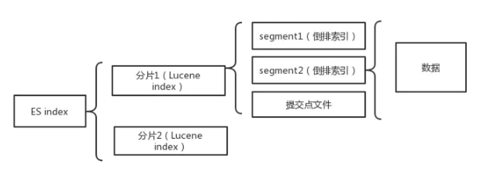

# **1. 读写时如何找到shard**

ES 通过**路由算法**定位文档所在的 shard，核心公式为：

**shard = hash(document_id) % number_of_primary_shards**

- 客户端发送读写请求到协调节点
- 协调节点根据文档 ID 计算 hash 值，对**主分片数量取模**，得到目标主分片编号
- 请求被转发到对应的主分片执行

写入时的 shard 定位

- 写请求通过路由算法定位到**主分片**
- 主分片写入成功后，将操作复制到该分片组的所有副本分片

读取时的 shard 定位

- 读请求同样通过路由算法定位到**主分片或副本分片**（随机轮询选择）
- 一个搜索请求会遍历**所有分片**，每个分片独立执行查询后汇总

主分片数量的约束

- 主分片数量在**索引创建时确定**，之后不可修改
- 这是因为路由算法依赖主分片数量取模，修改后会导致已有数据的路由失效，数据无法找到
- 如果需要增加分片，只能通过**新建索引并 reindex** 数据来实现

# **2. 多字段查询原理**

每个字段都有一个倒排索引，多字段查询是怎么实现的，特别是排序分页

**多字段查询的整体流程**：

当查询多个字段时（如 `multi_match` 或 `bool` 查询），ES 会分别在每个字段的倒排索引中查找，然后合并结果。整体分为 Query 阶段和 Fetch 阶段。

**Query 阶段的多字段处理**：

- **逐字段查找**：ES 在每个字段的倒排索引中独立查找匹配的文档 ID 列表。例如查询 `{"multi_match": {"query": "Elasticsearch", "fields": ["name", "content"]}}`，会分别在 name 和 content 的倒排索引中查找。
- **收集评分信息**：每个字段返回匹配文档的 docID 和该字段的 BM25 评分。
- **合并字段评分**：对于同一文档在多个字段的匹配，ES 根据配置的方式合并得分：
  - `best_fields`（默认）：取最高分字段的得分
  - `most_fields`：所有字段得分相加
  - `cross_fields`：把多个字段视为一个大字段，合并倒排列表后统一计算
  - `phrase` / `bool`：按短语查询或布尔逻辑分别计算后合并

**Fetch 阶段的全局排序**：

- 各分片在 Query 阶段返回的是 **本地 Top N**（按 \_score 或排序字段），不是全量结果。
- 协调节点收集各分片的本地 Top N，进行 **全局归并排序**，得到全局 Top N。
- 如果需要文档详情（如 \_source 字段），再根据全局排序后的 docID 列表去各分片 Fetch 完整文档。

**排序分页的实现原理**：

ES 支持两种排序方式，实现机制不同：

**按 \_score 评分排序（默认）**：

- Query 阶段各分片返回本地 Top K 的 docID 和 \_score。
- 协调节点对所有分片结果做 **堆排序（Top K 堆）**，维护全局 Top N。
- 使用 `from + size` 参数控制分页：协调节点需要收集 `from + size` 条结果，在内存中全局排序后，截取对应分页。

**按自定义字段排序（如 timestamp）**：

- 排序字段必须是 **doc_values**（列式存储）或 **fielddata**，不依赖倒排索引。
- Query 阶段各分片返回本地 Top K 的 docID 和排序字段值。
- 协调节点归并排序，但 **不返回文档内容**，只维护排序后的 docID 列表。
- Fetch 阶段根据最终排序的 docID 列表去各分片取 `_source`，返回给客户端。

**深度分页问题**：

- `from + size` 方式，`from` 越大，协调节点需要在内存中维护的结果集越大，性能急剧下降。
- **search_after**：基于上一页最后一条记录的排序值，作为下一页的起始点，避免深度遍历。适合实时搜索滚动加载场景。
- **scroll API**：在各分片上维护一个快照游标，一次性获取所有结果。适合批量导出，但不适合实时分页。

**为什么倒排索引不直接参与排序**：

- 倒排索引存储的是 **Term → 文档列表** 的映射，适合搜索匹配，但不适合按字段值排序。
- 排序依赖 **doc_values**（磁盘列式存储，内存映射）或 **fielddata**（内存中构建，开销大）。
- *score 评分虽然基于倒排索引的 TF/IDF 计算，但排序时也需要读取 doc*values 中的评分值进行归并。

**面试追问点**：

- **multi_match 的 best_fields 和 most_fields 有什么区别** ？→ best_fields 取匹配度最高的字段得分，most_fields 把所有字段得分相加；best_fields 适合精确匹配，most_fields 适合多字段都需匹配的场景。
- **为什么 from + size 默认不能超过 10000** ？→ `index.max_result_window` 默认 10000，防止深度分页导致内存溢出；超过时应使用 search_after 或 scroll。
- **search_after 能实现跳页吗？** → 不能，search_after 是基于上一页末尾的游标，只能顺序翻页；跳页需要重新查询或用其他方案。
- **多字段排序的优先级怎么定？** → 按 sort 数组顺序，第一个字段为主排序，相同时用第二个字段，以此类推；每个字段可指定升序/降序。

# **3. 多个倒排索引如何联合查询**

当查询包含多个条件（如 `age=18 AND gender=女`）时，ES 需要分别从每个字段的倒排索引中获取 Posting List，然后将多个列表合并得到同时满足所有条件的文档。**核心问题是：两个 Posting List 都是磁盘上的有序整数列表，如何高效地取交集？**

**单字段倒排索引的查询过程**：

- 以 `age=18 AND gender=女` 为例，先在 age 字段的倒排索引中查找：Term Index（内存）→ 定位 Term Dictionary 位置 → 找到 Term "18" → 获取 Posting List（包含所有 age=18 的文档 ID 列表）。
- 同样在 gender 字段的倒排索引中查找 Term "女"，获取对应的 Posting List。
- 两个 Posting List 分别是有序的文档 ID 数组，例如：age=18 → [2, 5, 7, 10, 15]，gender=女 → [1, 5, 8, 10, 12]。

**两种合并 Posting List 的方式**：

**方式一：跳表（Skip List）遍历合并**：

- 两个 Posting List 都是有序的，用双指针同时遍历两个列表，互相跳过不匹配的文档 ID，类似于归并排序中的合并步骤。
- 跳表在 Posting List 上层建立了索引，可以一次性跳过大量不匹配的 ID，不需要逐个比较。
- **适用于两个 Posting List 都在磁盘上的场景**，直接顺序读取磁盘，不需要额外内存。

**方式二：位图（Bitset）按位 AND 运算**：

- 将每个 Posting List 转换为 bitset（位图），文档 ID 对应的 bit 置为 1。
- 对两个 bitset 做 AND 位运算，结果中 bit 为 1 的位置就是同时满足两个条件的文档 ID。
- **适用于 filter 已经缓存在内存中的场景**，ES 的 filter cache 就是缓存每个条件对应的 bitset，合并时直接做位运算，不需要重新读磁盘。

**ES 的实际选择策略**：

- **filter 缓存命中**：条件对应的 bitset 已在内存中，直接用 Bitset AND 运算合并，速度极快。
- **filter 缓存未命中**：从磁盘读取 Posting List，用 Skip List 双指针遍历合并，避免将整个列表加载到内存。
- ES 会自动根据缓存状态选择最优策略，开发者不需要手动干预。

**MySQL 的处理方式对比**：

- MySQL 的联合索引（如 `(age, gender)`）是将多个字段组合成一个 B+ 树索引，查询时走联合索引逐层匹配。
- 如果没有联合索引，MySQL 只能选择其中一个单字段索引，另一个条件在遍历过程中逐行过滤，不会真正"联合使用"两个索引。
- PostgreSQL 从 8.4 版本开始支持 Bitmap Index Scan，可以同时使用两个索引并用 bitset 合并，原理与 ES 类似。

**实际场景举例**：

- 电商搜索"华为手机，价格 2000-3000，评分 > 4.5"：ES 在 brand、price、rating 三个字段的倒排索引中分别查找，获取三个 Posting List，然后通过 Skip List 或 Bitset 依次取交集，毫秒级返回结果。
- 如果用 MySQL：需要建立 `(brand, price, rating)` 联合索引才能高效查询，但联合索引的列顺序固定，换一种查询条件组合（如只要 price 和 rating）就可能无法利用索引。ES 的每个字段独立建索引，任意组合都高效。

**面试追问点**：

- Skip List 和 Bitset 哪种更快？→ Bitset AND 运算更快（位运算 CPU 原生支持），但前提是 bitset 已在内存中。如果需要从磁盘加载，Skip List 的顺序读可能更优。
- 为什么 MySQL 不直接联合使用两个索引？→ MySQL 的 B+ 树索引是独立的，同时走两个索引需要随机 IO 交叉读取，优化器通常选择一个索引 + 回表过滤，效率更高。PostgreSQL 的 Bitmap Index Scan 是个例外。
- ES 的 filter cache 有什么限制？→ 基于 Segment 粒度缓存，Segment 被合并后缓存失效重新构建；占用内存有上限（默认为堆的 10%）。

# **4. 如何实现全文检索**

ES 全文检索的核心流程是：**写入时通过分析器（Analyzer）将文档文本拆分为词项（Term）建立倒排索引，查询时同样对查询文本分词，再通过倒排索引查找匹配文档，最后按相关性评分排序返回**。

**写入流程**：

- 文档写入时，ES 对每个 text 类型字段执行分析器处理。
- 分析器由三部分组成：**Character Filter**（字符过滤，如去除 HTML 标签）、**Tokenizer**（分词器，将文本拆分为词项）、**Token Filter**（词项过滤，如小写化、停用词去除、同义词添加、词干提取）。
- 分词后的词项写入倒排索引的 Term Dictionary，同时记录文档 ID、词频（TF）、位置信息（Position）。
- **位置信息是短语查询和高亮的关键**，如果不需要 Phrase Query 可以关闭 positions 存储以节省空间。

**查询流程**：

- 用户提交查询后，ES 对查询文本同样执行分析器分词，得到查询词项。
- 根据查询类型（Match / Match Phrase / Term 等）在倒排索引中查找匹配的文档 ID 列表。
- **Query 阶段**：各分片本地执行查询，返回匹配的文档 ID 和评分（\_score）。
- **Fetch 阶段**：协调节点汇总各分片结果，全局排序后取 top N，再向相关分片请求文档详情，最终返回。

**常见全文检索查询类型**：

- **Match Query**：对查询文本分词后，逐个词项在倒排索引中查找，取并集（OR）或交集（AND），是全文检索最常用的查询。
- **Match Phrase Query**：不仅要求文档包含所有查询词项，还要求词项在文档中 **按顺序相邻出现**（通过 positions 信息判断），适合精确短语匹配。
- **Match Phrase Prefix Query**：短语前缀查询，最后一个词项做前缀匹配，用于搜索联想/自动补全场景。
- **Multi Match Query**：同时对多个字段执行 Match，常用于跨字段搜索（如 title + content）。
- **Term Query**：不对查询文本分词，直接在倒排索引中精确匹配词项，**通常用于 keyword 类型字段**。

**相关性评分（BM25）**：

- ES 默认使用 **BM25 算法** 计算文档与查询的相关性得分，是 TF-IDF 的改进版本。
- **TF（词频）**：词项在文档中出现的次数越多，得分越高，但 BM25 对 TF 有饱和限制，避免长文档因词频过高而占优。
- **IDF（逆文档频率）**：词项在所有文档中出现的次数越少（越稀有），权重越高。例如"的"出现很多次但区分度低，"Elasticsearch"出现少但区分度高。
- **字段长度惩罚**：BM25 会惩罚字段过长的文档，因为长文档天然更容易包含更多词项。
- 评分结果存储在 `_score` 字段，查询默认按 `_score` 降序排列。

**高亮显示**：

- ES 的高亮功能依赖倒排索引中存储的 **offset（偏移量）** 信息。
- 查询时 ES 根据匹配词项的位置信息，在原文本中包裹 `<em>` 等高亮标签。
- 支持 `highlight` 参数配置高亮方式（plain/fast-vector-highlighter）、标签、片段大小等。

**全文检索的性能优化**：

- **控制字段存储**：不需要搜索的字段设置 `index: false`，不需要短语查询的字段关闭 `positions` 存储。
- **使用合适的分词器**：中文场景推荐 IK 分词器（ik_max_word 细粒度分词、ik_smart 粗粒度分词）。
- **利用 Route 和 Shard 设计**：合理设置分片数，避免查询时遍历过多分片。
- **Rescore 和 Track Scores**：如果只需要 top N 的精确排序，可以用 rescore 对 top N 重新评分，减少全局排序开销。

**面试追问点**：

- Match Query 和 Term Query 的区别？→ Match Query 会分词再查，Term Query 不分词直接精确匹配；text 字段用 Match，keyword 字段用 Term。
- 为什么 Match Phrase 比 Match 严格？→ Match Phrase 要求词项按顺序相邻出现，Match 只要求包含即可，顺序和位置不限。
- BM25 和 TF-IDF 的区别？→ BM25 对 TF 有饱和限制（词频到一定程度后增益递减）、增加了字段长度惩罚，实际效果更合理。
- 全文检索能支持聚合吗？→ 不建议对 text 字段做聚合，因为分词后词项太碎；聚合应该用 keyword 字段或开启 fielddata（但内存开销大，推荐用 keyword + doc_values）。

# **5. 介绍下 ES 的近实时问题**

ES 的搜索是**近实时（Near Real-Time，NRT）** 的，即文档写入后**默认需要等待约 1 秒才能被搜索到**，不是写入即可见。这是由 ES 的 refresh 机制决定的。

**为什么是近实时而不是实时**

- 数据写入后首先进入**内存 Index Buffer**，此时数据不可查询
- 默认每 **1 秒执行一次 refresh** 操作，将 Index Buffer 中的数据写入新的 Lucene Segment（位于文件系统缓存中）
- 只有 refresh 生成 Segment 后，数据才变为**可查询状态**
- 因此从写入到可搜索存在**最多 1 秒的延迟**，这就是近实时的含义

**refresh 的本质**

- refresh 不是将数据写入磁盘，而是将内存数据写入**文件系统缓存**中的 Segment
- 文件系统缓存中的 Segment 可以被搜索，但尚未持久化到磁盘
- 真正的持久化由后续的 **flush** 操作完成（默认 30 分钟或 Translog 满 512MB 时触发）
- 这种设计在**写入性能**和**数据可见性**之间取得平衡：频繁写磁盘影响性能，完全不持久化则有丢失风险

**如何调整近实时程度**

- **增加 refresh 间隔**（如 30 秒或更长）：减少 Segment 数量，提升写入性能，但延迟更长。适合写入密集型场景，如日志采集
- **减少 refresh 间隔**（如 100ms）：降低搜索延迟，但会产生大量小 Segment，增加 merge 压力，影响写入性能
- **手动 refresh**：写入后调用 `POST /index/_refresh` 立即触发 refresh，数据立即可查询
- **refresh=wait_for**：写入请求等待下一次 refresh 完成后才返回，确保写入后立即可查询，但会**降低写入吞吐量**
- **refresh=false**：写入后不等待 refresh，直接返回，数据仍需等待自动 refresh 才可查询

**近实时与实时系统的区别**

- 实时系统（如 MySQL）：写入事务提交后立即可查询，延迟在毫秒级
- ES 近实时：默认 1 秒延迟，是性能和实时性的折中
- 如果业务要求强实时一致性，ES 不是最佳选择，应考虑关系型数据库或消息队列

**生产环境注意事项**

- **日志场景**：可适当增加 refresh 间隔（如 30 秒），因为日志对实时性要求不高，更关注写入吞吐量
- **搜索场景**：保持默认 1 秒或适当减少，确保用户体验
- **数据导入场景**：批量导入期间可临时禁用 refresh（设置较大的 refresh 间隔），导入完成后再恢复，提升导入速度
- **监控 refresh 频率**：refresh 过于频繁会导致 Segment 碎片化，增加 merge 开销和内存占用

**面试追问点**

- **近实时的 1 秒延迟能否消除？** → 不能完全消除，但可以通过 `refresh=wait_for` 或手动 refresh 让写入后立即可查询，代价是降低写入性能
- **refresh 和 flush 的区别是什么？** → refresh 将内存数据写入文件系统缓存（可查询但未持久化），flush 将数据持久化到磁盘并清空 Translog
- **为什么不用 0 秒 refresh？** → 频繁 refresh 会产生大量小 Segment，导致 merge 开销增大、搜索性能下降、内存占用增加
- **refresh 失败会丢数据吗？** → 不会，未 refresh 的数据仍在内存 Index Buffer 和 Translog 中，进程崩溃后可从 Translog 恢复

# 6. 介绍下ES查询原理

ES的查询分为两个阶段：**Query阶段（取ID+评分）** 和 **Fetch阶段（取文档详情）**。整体流程是：协调节点将请求广播到所有分片，各分片在本地执行查询返回Top N的文档ID和评分，协调节点全局排序后取最终的Top N，再回各分片取文档详情返回客户端。

**Query阶段详细流程**：

- 协调节点将搜索请求**广播到索引的所有分片**（默认行为），每个分片独立执行查询。
- 每个分片在本地遍历自己的Segment，根据查询条件匹配文档，**计算每条匹配文档的\_score评分**，按评分降序取本地Top N（由size参数决定），返回文档ID和评分给协调节点。
- 例如搜索条件要取5条数据，索引有5个分片，每个分片返回本地Top 5，协调节点收到25条结果后**全局归并排序**，取前5条作为最终结果。
- 这里有个常见误解：**不是每个分片返回"相同数量"的文档**，而是每个分片返回自己的本地Top N。如果某个分片数据量不足size条，就返回实际数量。协调节点收到的总数可能少于 `分片数 × size`。

**Fetch阶段详细流程**：

- Query阶段只返回文档ID和评分，**不返回文档内容**（\_source）。
- 协调节点根据全局排序后的Top N文档ID列表，**回各分片请求完整的文档数据**。
- 各分片根据文档ID从\_source中取出完整文档返回给协调节点，最终返回给客户端。

**为什么分两个阶段**：

- **减少网络传输**：Query阶段只传文档ID和评分（几十字节），不传完整文档（可能几KB），大幅减少网络开销。
- **全局排序需要**：协调节点需要看到所有分片的结果才能做全局排序，如果直接传完整文档，内存和网络开销都会很大。

**DFS查询（全局IDF）**：

- 默认的`query_then_fetch`模式下，**每个分片独立计算IDF**，当各分片的数据分布不均匀时，同样的词在不同分片的IDF可能不同，导致评分不准确。
- 使用`dfs_query_then_fetch`时，ES会先执行一个DFS阶段，**收集所有分片的词频信息计算全局IDF**，然后再执行查询。适用于数据量较小、对评分精度要求高的场景。
- 大数据量场景下各分片数据趋于均匀，默认模式的评分误差可以接受，不需要开启DFS。

**分片数量对查询性能的影响**：

- **分片越多，查询并行度越高**，但同时协调节点的归并开销也越大。
- **分片数量决定了ES能承载的最大数据量**，单个分片建议控制在10-50GB。
- **分片过少**：单分片数据量大，查询时单分片执行时间长，无法充分利用并行。
- **分片过多**：每个查询要广播到所有分片，协调节点需要归并大量结果，FST等数据结构在每个分片上都要加载，内存开销增大。
- 实际应用中需要在**并行能力和协调开销之间取平衡**。

**权重得分计算的特点**：

- **BM25评分在查询时实时计算**，每搜索一次都会根据搜索条件重新计算一次，对搜索性能影响较大。
- 评分依赖倒排索引中的词频（TF）和逆文档频率（IDF），这些信息在Segment生成时就已记录。
- **filter查询不计算评分**，性能比must（计分查询）好很多，因为跳过了评分计算且结果可缓存。

**Lucene中最重要的数据结构及其作用**：

- **FST（有限状态转换器）**：保存Term字典的前缀信息，缓存在内存中，支持单Term、Term范围、Term前缀和通配符查询。FST比Trie树更紧凑，**共享前缀和后缀**，大幅降低内存占用。
- **倒排链（Posting List）**：保存每个Term对应的docId列表，采用**跳表（Skip List）**结构支持快速跳跃。交集运算时通过跳表有效跳过无效文档。
- **BKD-Tree（动态磁盘优化BSP树）**：保存多维空间点的数据结构，用于**数值类型和空间点**的快速查找。通过BKD-Tree找到的docId集合是无序的，需要转成有序数组或BitSet后再与其他结果合并。
- **DocValues**：基于docId的**列式存储**，用于排序和聚合。列式存储只读取目标字段，不需要加载整行数据，大幅减少IO。

**不同查询类型与数据结构的对应关系**：

- **单Term查询**（如`term`查询）：从FST定位Term Dictionary位置，找到Term后读取倒排链，获取有序docId列表。
- **字符串范围/前缀/通配符查询**：从FST中获取符合条件的所有Term，再逐个查找倒排链，合并结果。
- **数字范围查询**：通过BKD-Tree找到符合条件的docId集合（无序），转成有序数组或BitSet后合并。
- **多条件交集查询**（AND）：多个倒排链求交集，用跳表跳过不匹配的doc。在内存中可用RoaringBitmap做位运算，速度更快。
- **多条件并集查询**（OR）：少量倒排链用最小堆逐个合并；大量倒排链直接合并成有序数组或构造BitSet。

**倒排链合并的三种策略**：

- **策略一：最小堆 + 跳表**：多个有序倒排链的队首构成最小堆，逐个出堆生成有序并集。适合**倒排链数量少**（N小）的场景。
- **策略二：合并成有序数组**：直接把多个倒排链合并成一个有序docId数组。适合**倒排链数量多**（N大）但文档量适中的场景。
- **策略三：构造BitSet**：当doc数量超过一定阈值时，用BitSet（每个docId只需1个bit）存储比有序数组更省内存，且交集/并集运算通过位运算非常高效。适合**文档量非常大**的场景。阈值估算：32位docId在BitSet中只需1bit，当BitSet的总大小（由segment内doc总数决定）比有序数组更划算时自动切换。

**面试追问点**：

- Query阶段返回多少条数据？→ 每个分片返回size条（本地Top N），不是全量。协调节点收到分片数×size条后全局排序取前size条。
- 为什么默认不能深度分页？→ from+size越大，协调节点需要在内存中维护的结果集越大，性能急剧下降。超过10000条应使用search_after或scroll。
- filter为什么比must快？→ filter不计算BM25评分，且结果可以被node query cache缓存，命中缓存后直接复用BitSet，不需要重新查询。
- 聚合在哪个阶段执行？→ 聚合的**收集**在各分片的Lucene层面完成（遍历匹配文档收集聚合值），**合并**在协调节点的ES层面完成（如求和、求平均）。

# **7. ES有哪些优化**

ES在查询、索引、缓存、存储等多个层面做了优化，核心思路是**减少不必要的计算和IO，尽量复用已有结果**。

**查询执行顺序优化**：

- Lucene在执行多个查询子句时，**会先估算每个子句的代价（基于匹配文档数），从代价最小的子句开始执行**。
- 例如查询"标题包含Java AND 内容包含分布式 AND 价格>100"，如果"标题包含Java"只匹配1000条，而"内容包含分布式"匹配10万条，Lucene会先执行标题条件，从1000条结果上再迭代价格条件，而不是先扫描10万条。
- 这种优化对bool查询的must和filter子句都有效，**大幅减少需要处理的文档数量**。

**结果排序优化（堆排序）**：

- Lucene**不会对所有命中的doc进行全量排序**，而是构造一个**最小堆（PriorityQueue）**，只保证前(Offset+Size)个doc是有序的。
- 排序性能取决于**(Offset+Size)**和命中文档数，以及读取DocValues的开销。
- 因为(Offset+Size)通常不会太大（除非深度分页），且DocValues是列式存储读取性能很高，**排序本身对性能的影响有限**。
- 真正影响性能的是命中文档数和获取DocValues的IO，不是排序算法本身。

**Filter Cache（过滤缓存）**：

- ES会将**高频执行的filter查询结果缓存到内存中**，缓存的粒度是**(filter, segment)到bitset的映射**。
- 下次执行相同filter时，直接从缓存中获取bitset，**不需要重新查询倒排索引**，大幅减少磁盘IO。
- **只缓存filter查询，不缓存must查询**，因为must需要计算BM25评分，结果依赖具体查询上下文，不适合缓存。
- 缓存使用**RoaringBitmap**压缩存储，比原始数组和普通bitset更省内存。
- 缓存key是filter条件的字面量表示，**相同filter条件在不同查询中可以复用**。

**Posting List压缩优化**：

- **Frame of Reference（FOR）**：对较长的Posting List使用差值编码+位压缩，将有序的docId列表压缩成紧凑的字节序列，减少磁盘占用和索引尺寸。
- **RoaringBitmap**：对内存中的Posting List使用RoaringBitmap存储，压缩率高且交集/并集运算支持位运算，性能优异。
- 压缩使得同样的内存和磁盘空间可以存储更多数据，**间接提升查询性能**（更多数据可以留在缓存中）。

**查询代价估算与短路优化**：

- Lucene在执行交集运算时，**先扫描最短的倒排链**，再用跳表在其他倒排链上跳跃。
- 当某个子句已经找不到匹配文档时，**提前终止后续计算**（短路求值），不浪费资源。
- 例如AND查询中，如果第一个子句只匹配10个doc，后续子句只需要在这10个doc上验证，而不是扫描全量。

**BKD-Tree与倒排索引的协同优化（IndexOrDocValuesQuery）**：

- 数字范围查询通过BKD-Tree找到的docId是**无序的**，与倒排索引的有序docId合并时需要先构造BitSet，这一步可能非常耗时。
- ES通过**IndexOrDocValuesQuery**优化：当匹配文档数较少时，用倒排索引（有序docId，skipList合并）；当匹配文档数较多时，用DocValues（列式存储，直接位运算）。**自动选择最优路径**。
- 对数字类型字段，如果只做Term查询不涉及范围查询，建议建成**keyword类型**（倒排索引，跳表合并快）；如果需要范围查询，**数值类型**（BKD-Tree）性能更好。

**索引层面的优化**：

- **Segment Merge策略**：后台合并进程根据Segment大小和数量自动触发合并，减少查询时需要扫描的Segment数量。可通过`max_num_segments`控制合并后的Segment数。
- **refresh_interval调整**：写入密集场景适当增大refresh间隔（如30s），减少小Segment生成，降低Merge压力。
- **预热（Warmup）**：ES启动后首次查询较慢，因为FST、Filter Cache等需要加载到内存。通过**warmup API**或定期查询可以提前预热，避免首次查询延迟。
- **Index Sorting**：ES 7.x+支持索引写入时预排序，Segment内部按指定字段排序，查询时减少排序开销。

**路由优化**：

- 默认情况下搜索请求**广播到所有分片**，分片越多查询开销越大。
- 通过**routing参数**指定文档路由键，可以将相关文档路由到同一分片，查询时只访问特定分片而非全部。
- 例如按用户ID路由，查询某个用户的数据时只访问一个分片，**查询性能提升N倍**（N为分片数）。

**批量查询优化**：

- **Multi-Get（mget）**：一次请求获取多个文档，减少网络往返次数，且同一分片的文档会自动合并为一次分片请求。
- **Scroll/Scroll Search**：适合批量导出场景，在各分片上维护快照游标，避免深度分页的性能问题。
- **search_after**：适合实时滚动加载，基于上一页末尾的排序值作为游标，避免深度遍历。

**面试追问点**：

- **filter缓存什么时候失效？** → Segment被合并后，该Segment上的缓存自动失效，下次查询重新构建。
- 查询顺序优化是ES做的还是Lucene做的？→ **Lucene层面做的**，ES将查询传递给Lucene，Lucene内部的查询优化器决定执行顺序。
- IndexOrDocValuesQuery什么时候用倒排索引，什么时候用DocValues？→ 匹配文档数少时用倒排索引（有序docId，skipList快），匹配文档数多时用DocValues（位运算快），Lucene自动根据代价估算选择。
- 为什么数字范围查询推荐用数值类型而不是字符串？→ 数值类型走BKD-Tree，range查询性能O(logN)；字符串类型走倒排索引，range查询需要遍历所有Term，性能差很多。

# 

