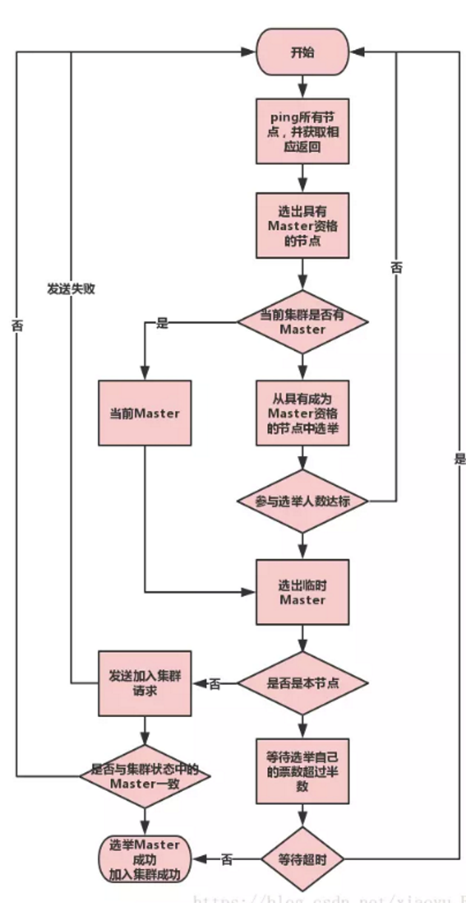

# **1. ES如何保证数据一致性**

ES 通过**主从复制、序列号、事务日志、乐观并发控制和 quorum 机制**来保证数据一致性，实现分布式环境下的写入可靠性、顺序性和故障恢复能力。

**主从复制机制**：

- **写操作必须先在主分片上执行成功**，主分片执行完后会将写请求并发复制到所有副本分片。
- 副本分片写入成功后返回确认，**主分片等待所有副本写入成功后才向协调节点返回成功**（默认行为）。
- 如果某个副本写入失败，主分片会向 master 节点报告异常，由集群重新分配或恢复副本，避免主副数据长期不一致。
- 主分片和副本分片不会分配在同一个节点上，**节点故障时副本分片可以提升为新的主分片**，保证数据不丢失。

**序列号和主分片任期**：

- `_seq_no`（序列号） 是每个分片级别的递增数字，记录每个写操作的顺序，用于保证写入顺序和冲突检测。
- `_primary_term`（主分片任期） 是每次主分片重新选举时递增的数字，用于区分不同任期的主分片，避免旧主分片的过期写入影响新主分片。
- 当主分片故障后，新的主分片任期会递增，**新主分片会拒绝旧任期的写入请求**，避免脑裂导致的数据不一致。
- 客户端可以通过 `_seq_no` 和 `_primary_term` 实现**乐观并发控制**，在更新时携带上次读取的值，ES 会检查是否冲突。

**事务日志（translog）**：

- **translog 是写入操作的持久化日志**，文档写入时先进入内存缓冲区，同时写入 translog。
- 如果进程崩溃，内存缓冲区的数据会丢失，但 **translog 中的记录可以在重启后恢复**，保证数据不丢失。
- translog 默认每次写入都 fsync 到磁盘，也可以配置为异步刷盘提升写入性能，但会增加少量数据丢失风险。
- 当 translog 达到阈值（默认 512MB）时，ES 会执行 flush 操作，将内存中的 Segment 持久化到磁盘，然后清除 translog。

**乐观并发控制**：

- ES 使用**文档版本号（**`_version`） 和**序列号（**`_seq_no`） 进行并发控制。
- **更新文档时，客户端可以携带** `if_seq_no` 和 `if_primary_term` 参数，ES 会检查当前文档的序列号和主分片任期是否与客户端携带的一致。
- 如果不一致，说明有其他写操作已经修改了该文档，ES 会返回**版本冲突错误**，客户端需要重新读取并处理冲突。
- 如果客户端没有带上版本号，首先会读取最新版本号才做更新尝试，这个尝试类似于CAS操作，可能需要尝试很多次才能成功。乐观锁的好处是不需要互斥锁的参与。
- 这种机制适合冲突较少的场景， **不适合高并发写入冲突频繁的场景** 。

**quorum 机制（wait_for_active_shards）**：

- `wait_for_active_shards` **参数控制写入前需要** 多少个活跃分片确认，默认值为 1（即只等主分片写入成功）。
- 可以设置为 `all`（等待所有副本分片）或具体数字，**数值越高一致性越强，但写入延迟也越高**。
- 如果活跃分片数不足， **ES 会等待直到达到要求的数量，或者等待超时后返回成功但提示部分分片不可用。**
- 例如设置 `wait_for_active_shards: 2`，则需要主分片和至少一个副本分片都活跃才会执行写入，**适合对一致性要求较高的场景**。

**wait_for_active_shards含义:**

**阶段 1：写入前校验活跃分片数量** （wait_for_active_shards 核心作用）

- 客户端发起写入，ES**先检查当前集群里该分片有多少个存活、可用的分片副本**
- 配置 wait_for_active_shards=3：要求集群至少有 3 个分片在线， **才允许执行本次写入** ；
  - 若当前只有 2 个分片在线（副本节点宕机）：请求阻塞等待，直到超时（默认 1min），最终返回 **unavailable_shards 错误**，**整条写入完全不执行，主分片都不会写**
  - 只有活跃分片数 ≥ 配置值，才进入真正写入流程

  **这个阶段是事前拦截** ，不涉及副本写入成功与否，只看分片在不在集群。

**阶段 2：主分片写入成功后，同步副本**

前提：集群活跃分片≥3，写入放行，主分片落盘成功，并行发给 3 个副本，最终只有 2 个副本返回成功、1 个副本同步失败。

- 客户端会收到，HTTP 200 OK，返回写入成功，响应体 \_shards 字段会标记失败分片，但整体判定写入成功。
  - 例如total:3, successful:2, failed:1
- ES 内部怎么处理失败的副本
  - 1、主分片不会阻塞等待失败副本，只要成功同步的副本数量达到 wait_for_active_shards 阈值，就立刻回复客户端成功
  - 2、同步失败的副本会被主分片上报 master，移出 in-sync 同步副本集合；
  - 3、master 后续会触发分片恢复，重新全量同步该副本，修复数据差异；

**这种问题风险：**

- 此时只要这 3 个成功的分片不同时宕机，数据不会丢
- 但如果主分片写完立刻宕机， **刚好晋升那个同步失败、无数据的副本为主分片 → 数据丢失** 。

**故障恢复和集群状态**：

- master 节点负责监控所有分片的状态，当主分片所在节点故障时，master 会将一个可用的副本分片提升为新的主分片。
- 提升过程中会递增 `_primary_term`，确保旧主分片的过期写入不会影响新主分片。
- 集群状态从 RED（有主分片丢失）恢复到 YELLOW（主分片可用但副本缺失）再到 GREEN（所有分片可用），**恢复过程中数据一致性由新主分片和副本分片的数据同步保证**。
- 如果所有副本都丢失，ES 可能会从 translog 恢复部分数据，但无法保证完全一致。

**近实时搜索和一致性**：

- **ES 是近实时搜索**，文档写入后默认每 1 秒执行一次 refresh 操作，新数据才对搜索可见。
- refresh 之前的写入对搜索不可见，但 **对后续写入操作是可见的**（通过 `_seq_no` 保证顺序）。
- 如果需要强一致读，可以使用 `refresh=wait_for` 参数让写入操作等待下一次 refresh 后再返回，**但这会降低写入吞吐**。
- 通常业务场景下，近实时的一致性已经足够，只有金融、库存等强一致场景才需要等待 refresh。

可以总结为：

- **写操作先在主分片执行，再并发复制到副本分片，主分片等待副本确认后返回成功**。
- `_seq_no` 和 `_primary_term` 保证写入顺序、冲突检测和故障恢复后的一致性。
- **translog 保证进程崩溃后数据可恢复，flush 后数据持久化到磁盘**。
- **乐观并发控制通过版本号和序列号避免并发写入冲突**。
- `wait_for_active_shards` 控制写入前需要多少活跃分片确认，数值越高一致性越强。
- **ES 是近实时搜索，写入后默认 1 秒对搜索可见，强一致读需要等待 refresh**。

# **1. 能完全保证数据一致性吗**

**ES 不能完全保证数据一致性**，它提供的是**最终一致性**模型，在特定场景下可能出现数据不一致。需要通过合理的配置和运维手段来处理数据不一致问题。

**ES 的一致性模型**：

- **最终一致性**。ES 默认提供**最终一致性**，即数据在写入后会最终达到一致状态，但不是实时一致。
- **近实时搜索**。文档写入后默认每 1 秒执行一次 refresh 操作，**新数据才对搜索可见**，存在短暂的不一致窗口。
- **可配置的一致性级别**。通过 `wait_for_active_shards` 参数，可以**配置写入前需要多少活跃分片确认**，实现不同级别的一致性。

**数据不一致的场景**：

- **节点故障**。节点故障后，**该节点上的分片数据可能丢失**，导致数据不一致。
- **网络分区**。网络分区后，**被隔离的节点可能无法同步数据**，导致数据不一致。
- **副本同步延迟**。副本分片**从主分片同步数据存在延迟**，导致短暂的数据不一致。
- **主分片故障**。主分片故障后，**副本分片提升为主分片**，但可能丢失部分未同步的数据。
- **Translog 损坏**。Translog 文件损坏，**可能导致部分数据丢失**。
- **脑裂**。脑裂后，**多个 master 同时处理写入请求**，可能导致数据冲突。

**数据不一致的检测**：

- **使用** `_cat/shards` API。检查分片状态，**确认是否有 UNASSIGNED 或 INITIALIZING 分片**。
- **使用** `_cluster/health` API。检查集群状态，**确认是否处于 GREEN 状态**。
- **使用** `_cluster/allocation/explain` API。获取分片分配失败的具体原因。
- **使用** `_stats` API。检查索引统计信息，**确认是否有写入失败或丢失的文档**。
- **使用** `_search` API。对比不同分片的数据，**确认是否有数据不一致**。
- **使用校验 API**。使用 `_doc/value` 或 `_source` 字段**对比主分片和副本分片的数据**。

**数据不一致的处理方法**：

- **恢复故障节点**。如果节点故障导致数据不一致，**尝试恢复故障节点**，让其重新加入集群。
- **重新分配分片**。使用 `_cluster/reroute` API **手动分配分片**，确保分片正确分配。
- **从备份恢复**。如果数据丢失严重，**从备份恢复数据**，确保数据完整性。
- **重建索引**。如果索引数据不一致严重，**重建索引**，确保数据一致。
- **使用** `_update_by_query`。使用 `_update_by_query` API **批量更新文档**，修复数据不一致。
- **使用 Logstash 重新索引**。使用 Logstash **从源数据重新索引**，确保数据一致。

**预防数据不一致的措施**：

- **设置合理的副本数**。副本数至少为 1，**确保每个主分片至少有一个副本**，避免单点故障。
- **配置** `wait_for_active_shards`。设置 `wait_for_active_shards: all` 或具体数字，**确保写入前多个分片确认**。
- **使用同步 Translog**。使用同步 Translog（默认），**确保写入持久化到磁盘**。
- **监控集群状态**。设置告警监控集群状态，**及时发现数据不一致**。
- **定期检查分片状态**。使用 `_cat/shards` API 定期检查分片状态，**确保分片正常**。
- **备份数据**。定期备份数据，**确保数据可恢复**。

**数据不一致的恢复流程**：

- **第一步：检测数据不一致**。使用上述 API 检测数据不一致，**确认不一致的范围和原因**。
- **第二步：评估影响范围**。评估数据不一致对业务的影响，**决定是否需要立即处理**。
- **第三步：选择恢复方法**。根据不一致的原因和范围，**选择合适的恢复方法**。
- **第四步：执行恢复操作**。执行恢复操作，**确保数据恢复到一致状态**。
- **第五步：验证数据一致性**。恢复完成后，**验证数据一致性**，确保数据正确。

**生产环境建议**：

- **设置合理的副本数**。副本数至少为 1，**确保每个主分片至少有一个副本**。
- **配置** `wait_for_active_shards`。根据业务需求设置合适的值，**平衡一致性和性能**。
- **监控集群状态**。设置告警监控集群状态，**及时发现数据不一致**。
- **定期备份数据**。定期备份数据，**确保数据可恢复**。
- **制定应急方案**。制定数据不一致的应急方案，**确保快速恢复**。

可以总结为：

- **ES 不能完全保证数据一致性，提供的是最终一致性模型**。
- **数据不一致的场景包括节点故障、网络分区、副本同步延迟、主分片故障、Translog 损坏、脑裂**。
- **数据不一致的检测方法包括检查分片状态、集群状态、索引统计信息等**。
- **数据不一致的处理方法包括恢复故障节点、重新分配分片、从备份恢复、重建索引等**。
- **生产环境需要设置合理的副本数、配置** `wait_for_active_shards`、监控集群状态、定期备份数据。

# **2. 节点恢复集群状态正常此时数据就是一致的吗**

**节点恢复后集群状态正常不代表数据完全一致**。需要根据故障期间的写入情况、副本同步状态、Translog 恢复情况等因素综合判断数据一致性。

**节点恢复后数据可能不一致的场景**：

- **故障期间有写入操作**。节点故障期间，**新的写入操作可能已经修改了数据**，恢复的节点数据是故障前的快照。
- **副本分片已提升为主分片**。节点故障后，**副本分片可能已经提升为主分片**，恢复的节点数据与新主分片不一致。
- **Translog 未完整恢复**。如果 Translog 文件损坏或不完整，**可能丢失部分故障期间的写入数据**。
- **分片数据已过期**。恢复的节点数据可能**已经过期**，需要从当前主分片同步最新数据。

**节点恢复后的数据同步机制**：

- **自动同步**。节点恢复后，ES 会**自动从当前主分片同步最新数据**到恢复的节点。
- **分片状态变化**。恢复的分片状态会从 INITIALIZING 变为 STARTED，**表示数据同步完成**。
- **数据一致性检查**。ES 会**检查恢复的节点数据是否与主分片一致**，如果不一致会自动同步。

**判断数据是否一致的方法**：

- **检查分片状态**。使用 `_cat/shards` API 检查分片状态，**确认是否所有分片都处于 STARTED 状态**。
- **检查集群状态**。使用 `_cluster/health` API 检查集群状态，**确认是否处于 GREEN 状态**。
- **对比数据内容**。使用 `_search` API 对比不同分片的数据，**确认是否有数据不一致**。
- **检查写入日志**。查看 ES 日志中的写入记录，**确认故障期间的写入操作是否都已同步**。
- **使用校验 API**。使用 `_doc/value` 或 `_source` 字段**对比主分片和副本分片的数据**。

**数据同步的具体过程**：

- **第一步：节点加入集群**。恢复的节点向 master 发送心跳，**重新加入集群**。
- **第二步：master 检查分片状态**。master 检查该节点上的分片状态，**判断是否需要同步数据**。
- **第三步：从主分片复制数据**。如果需要同步，**从当前主分片复制最新数据**到恢复的节点。
- **第四步：数据同步完成**。数据同步完成后，**分片状态变为 STARTED**，恢复的节点参与读写负载。

**数据同步的时间和影响**：

- **同步时间取决于数据量**。数据量越大，**同步时间越长**，可能影响集群性能。
- **同步期间不参与读写**。同步期间，**恢复的分片不参与读写操作**，可能影响集群性能。
- **同步完成后恢复**。同步完成后，**恢复的分片参与读写负载**，集群恢复正常。

**预防节点恢复后数据不一致的措施**：

- **设置合理的副本数**。副本数至少为 1，**确保每个主分片至少有一个副本**，避免单点故障。
- **配置** `wait_for_active_shards`。设置 `wait_for_active_shards: all` 或具体数字，**确保写入前多个分片确认**。
- **监控集群状态**。设置告警监控集群状态，**及时发现节点故障和数据不一致**。
- **定期备份数据**。定期备份数据，**确保数据可恢复**。
- **优化网络配置**。确保节点间网络低延迟、高可靠，**避免节点故障**。

**生产环境建议**：

- **节点恢复后验证数据一致性**。节点恢复后，**使用校验 API 验证数据一致性**，确保数据正确。
- **监控数据同步状态**。监控数据同步状态，**及时发现同步失败或延迟**。
- **评估同步影响**。评估数据同步对业务的影响，**必要时进行降级处理**。
- **制定应急方案**。制定节点恢复后的数据一致性验证方案，**确保快速恢复**。

可以总结为：

- **节点恢复后集群状态正常不代表数据完全一致**，需要根据故障期间的写入情况、副本同步状态、Translog 恢复情况等因素综合判断。
- **节点恢复后会自动从当前主分片同步最新数据**，同步完成后分片状态变为 STARTED。
- **判断数据是否一致需要检查分片状态、集群状态、对比数据内容、检查写入日志**。
- **预防数据不一致需要设置合理的副本数、配置** `wait_for_active_shards`、监控集群状态、定期备份数据。
- **节点恢复后需要验证数据一致性，监控数据同步状态，评估同步影响**。

# **2. 为何要等待所有Replica响应后返回**

ES 写入流程中，**Primary 分片写入成功后会等待所有 Replica 分片响应（或连接失败）后才向协调节点返回成功**，这种机制是为了**保证数据一致性和高可用性**，避免 Primary 故障时数据丢失。

**等待 Replica 响应的核心原因**：

- **保证数据强一致**：Primary 等待所有 Replica 写入成功，确保数据在主副分片上都已持久化，避免 Primary 故障时数据丢失。
- **满足 quorum 语义**：通过 `wait_for_active_shards` 参数控制写入前需要多少活跃分片确认，实现类似 quorum 的一致性保证。
- **避免脑裂**：如果 Primary 写入后立即返回，而 Replica 尚未同步，Primary 故障后新 Primary 可能没有最新数据，导致数据不一致。
- **提供可配置的一致性级别**：业务可以根据需求选择等待所有 Replica、部分 Replica 或不等待，在性能和一致性之间权衡。

**写入流程中的等待机制**：

- Primary 分片执行写入操作后，会**并发地将写请求发送到所有 Replica 分片**。
- Primary 会等待所有 Replica 分片返回成功响应，或者等待连接失败（超时或节点不可达）。
- 当所有 Replica 都响应后（或达到要求的活跃分片数），Primary 才向协调节点返回写入成功。
- 协调节点收到 Primary 的成功响应后，才向客户端返回写入成功。

`wait_for_active_shards` 参数的作用：

- 控制写入前需要多少个活跃分片确认，默认值为 1（即只等 Primary 写入成功）。
- 可以设置为 `all`（等待所有 Replica 分片）或具体数字（如 2 表示 Primary + 1 个 Replica）。
- **数值越高，一致性越强，但写入延迟也越高**。
- 如果活跃分片数不足，ES 会等待直到达到要求的数量，或者等待超时后返回成功 **但提示部分分片不可用** 。

**等待 Replica 响应的性能影响**：

- **增加写入延迟**：等待所有 Replica 响应会增加写入延迟，特别是 Replica 分布在不同机房或网络延迟较高的场景。
- **降低写入吞吐**：每个写入操作需要等待多个分片确认，整体写入吞吐会下降。
- **网络分区影响**：如果某个 Replica 分片所在节点网络不可达，Primary 会等待超时，影响写入性能。

**故障处理机制**：

- **Replica 连接失败**：如果某个 Replica 分片连接失败（节点宕机、网络分区），Primary 会等待超时或达到要求的活跃分片数后返回成功。
- **部分 Replica 失败**：如果部分 Replica 写入失败，Primary 会向 master 节点报告异常，由集群重新分配或恢复 Replica。
- **Primary 故障**：如果 Primary 分片所在节点故障，集群会将一个可用 Replica 提升为新的 Primary，并递增 `_primary_term`，确保旧 Primary 的过期写入不影响新 Primary。

**不同一致性级别的选择**：

- **强一致性（**`wait_for_active_shards: all`）：等待所有 Replica 响应，适合对数据一致性要求极高的场景，如金融交易、库存扣减。
- **中等一致性（**`wait_for_active_shards: 2`）：等待 Primary + 1 个 Replica 响应，平衡一致性和性能。
- **最终一致性（默认** `wait_for_active_shards: 1`）：只等 Primary 写入成功，Replica 异步同步，适合对一致性要求不高的场景，如日志、用户行为数据。

**生产环境建议**：

- **根据业务场景设置合适的** `wait_for_active_shards`，金融、库存等强一致场景设置为 `all` 或较高值，日志、监控等场景使用默认值。
- **监控 Replica 分片状态**，确保 Replica 分片正常可用，避免因 Replica 故障影响写入性能。
- **合理规划 Replica 数量**，确保 Replica 数不超过 `data 节点数 - 1`，避免部分 Replica 无法分配。
- **评估网络延迟**，如果 Replica 分布在不同机房，需要权衡一致性和跨机房延迟。
- **使用** `_cluster/health` API 监控集群状态，确保集群处于 GREEN 状态，所有 Replica 分片正常。

可以总结为：

- **Primary 等待所有 Replica 响应是为了保证数据一致性和高可用性**。
- **通过** `wait_for_active_shards` 参数控制等待的活跃分片数，实现可配置的一致性级别。
- **等待所有 Replica 会增加写入延迟和降低吞吐，但提供更强的一致性保证**。
- **Replica 连接失败时，Primary 会等待超时或达到要求的活跃分片数后返回成功**。
- **生产环境需要根据业务场景权衡一致性和性能，合理设置** `wait_for_active_shards` 参数。

# **3. 并发更新时如何保证数据一致性**

ES 通过**版本号（**`_version`）、序列号（`_seq_no`）和主分片任期（`_primary_term`） 实现乐观并发控制，保证并发更新时的数据一致性。这种机制类似于 CAS 操作，适合冲突较少的场景。

**并发更新冲突的产生**：

- 多个客户端同时读取同一个文档，然后各自修改后尝试更新，**后提交的更新会覆盖先提交的更新**，导致数据丢失。
- 如果没有并发控制，先更新的客户端无法感知到后更新的客户端已经修改了文档，可能导致业务逻辑错误。
- 例如，两个用户同时修改库存数量，都基于读取到的旧值进行计算，后提交的更新会覆盖先提交的更新，导致库存数量错误。

**版本号（**`_version`）机制：

- 每个文档都有一个 `_version` 字段，**每次更新都会递增**，初始值为 1。
- 客户端更新文档时，可以携带 `if_version` 参数，ES 会检查当前文档版本是否与客户端携带的版本一致。
- 如果版本一致，更新成功，`_version` 递增；如果不一致，返回**版本冲突错误**。
- 早期版本主要使用 `_version` 进行并发控制，但 `_version` 是全局递增的，可能影响性能。

**序列号（**`_seq_no`）和主分片任期（`_primary_term`）机制：

- `_seq_no` 是每个分片级别的递增数字，记录每个写操作的顺序，用于保证写入顺序和冲突检测。
- `_primary_term` 是每次主分片重新选举时递增的数字，用于区分不同任期的主分片，避免旧主分片的过期写入影响新主分片。
- 客户端更新文档时，必须携带 `if_seq_no` 和 `if_primary_term` 参数，ES 会检查当前文档的序列号和主分片任期是否与客户端携带的一致。
- 如果一致，更新成功，`_seq_no` 递增；如果不一致，返回**版本冲突错误**。
- 这种机制比 `_version` 更精确，因为序列号是分片级别的，减少了冲突检测的粒度。

**客户端处理冲突的流程**：

- 客户端先读取文档，获取当前文档的 `_seq_no` 和 `_primary_term`。
- 客户端修改文档内容，然后使用 `if_seq_no` 和 `if_primary_term` 参数尝试更新。
- 如果更新成功，说明没有冲突；如果返回版本冲突错误，说明有其他客户端已经修改了该文档。
- 客户端需要**重新读取最新文档**，基于最新数据重新计算修改，然后再次尝试更新。
- 这个过程可能需要重试多次，直到成功或达到最大重试次数。

**冲突解决策略**：

- **客户端重试**：最简单的策略，适合冲突较少的场景，重试几次通常能成功。
- **最后写入胜出（LWW）**：不检查冲突，直接覆盖，适合对一致性要求不高的场景，但可能导致数据丢失。
- **业务层合并**：客户端在应用层合并冲突，例如使用合并函数处理并发修改，适合复杂业务逻辑。
- **分布式锁**：在更新前获取锁，保证同一时间只有一个客户端可以修改，适合冲突频繁的场景，但会影响性能。

**乐观并发控制的优缺点**：

- **优点**：不需要加锁，性能开销小，适合读多写少的场景。
- **缺点**：冲突频繁时重试次数多，影响性能；不保证更新成功，需要客户端处理冲突。
- **适用场景**：用户资料更新、配置修改、低并发的数据更新。
- **不适用场景**：高并发库存扣减、订单创建等冲突频繁的场景。

**生产环境建议**：

- **合理设计数据模型**，减少并发更新冲突的概率，例如将大字段拆分为小字段。
- **使用合适的冲突解决策略**，根据业务场景选择客户端重试、业务层合并或分布式锁。
- **监控冲突频率**，如果冲突频繁，考虑优化数据模型或使用分布式锁。
- **确保客户端正确处理冲突**，避免数据不一致。

可以总结为：

- **ES 使用** `_seq_no` 和 `_primary_term` 实现乐观并发控制，保证并发更新时的数据一致性。
- **客户端更新时必须携带** `if_seq_no` 和 `if_primary_term` 参数，ES 检查是否冲突。
- **冲突时返回版本冲突错误，客户端需要重新读取并重试更新**。
- **乐观并发控制适合冲突较少的场景，不适合高并发冲突频繁的场景**。
- **生产环境需要合理设计数据模型，选择合适的冲突解决策略，并监控冲突频率**。

# **4. 某个Replica持续写失败怎么办**

Replica 持续写失败会导致**数据一致性风险**和**集群状态异常**，需要及时排查和处理。主要原因和解决方案如下：

**常见原因**：

- **节点故障或网络问题**：持有 Replica 分片的节点宕机或网络不可达，导致 Primary 无法将写操作复制到 Replica。
- **磁盘空间不足**：目标节点磁盘使用率超过水位线（默认 95%），分片分配被阻止，无法接收新数据。
- **资源不足**：节点 CPU、内存或 IO 压力过大，处理写入请求超时或失败。
- **分片分配限制**：分片分配规则（如 IP 过滤、机架感知）阻止 Replica 分配到可用节点。
- **版本冲突或映射问题**：文档版本冲突、映射不匹配或字段类型错误导致写入失败。
- **集群状态异常**：集群处于 RED 或 YELLOW 状态，部分分片不可用。

**排查步骤**：

- **查看集群状态**：使用 `_cluster/health` 检查集群是否处于 GREEN 状态，关注未分配分片数。
- **检查分片状态**：使用 `_cat/shards` 查看 Replica 分片状态，确认是否为 UNASSIGNED 或 INITIALIZING。
- **查看节点状态**：使用 `_cat/nodes` 检查节点是否在线，磁盘、CPU、内存使用情况。
- **分析写入日志**：查看 ES 日志中的写入失败错误信息，定位具体失败原因。
- **检查分片分配日志**：查看 `_cluster/allocation/explain` 了解分片分配失败的具体原因。

**解决方案**：

- **恢复节点或网络**：如果节点宕机，重启节点；如果网络问题，修复网络连接。
- **释放磁盘空间**：清理不必要的索引、删除旧数据、增加磁盘容量，或调整磁盘水位线阈值。
- **调整资源分配**：增加节点资源、优化查询减少压力、调整写入并发度。
- **重新分配分片**：使用 `_cluster/reroute` 手动分配 Replica 分片，或等待 ES 自动重试。
- **修复映射和版本冲突**：检查文档映射是否匹配，处理版本冲突，确保字段类型正确。
- **调整分片分配规则**：检查并调整 IP 过滤、机架感知等分配规则，确保 Replica 可分配。

**预防措施**：

- **监控 Replica 分片状态**：设置告警，及时发现 Replica 写入失败或分片未分配。
- **合理设置副本数**：副本数不超过 `data 节点数 - 1`，避免因节点不足导致分片无法分配。
- **定期检查集群健康**：使用 `_cluster/health` 和 `_cat/shards` 定期检查集群状态。
- **预留足够资源**：确保节点有足够磁盘空间、CPU 和内存，避免资源瓶颈。
- **配置写入重试机制**：客户端实现写入重试逻辑，处理临时性写入失败。

可以总结为：

- **Replica 持续写失败影响数据一致性和集群高可用**。
- **常见原因包括节点故障、磁盘不足、资源压力和分片分配限制**。
- **通过检查集群状态、分片状态、节点状态和日志定位具体原因**。
- **根据原因采取恢复节点、释放资源、重新分配分片等解决方案**。
- **生产环境需要监控 Replica 状态、合理设置副本数、预留足够资源**。

# **5. ES怎么处理某个Replica持续写失败**

当 Replica 分片持续写入失败时，ES 会通过**自动重试、分片重新分配、集群状态调整**等机制进行处理，确保数据最终一致性和集群稳定性。

**主分片的重试机制**：

- **Primary 分片会向所有 Replica 分片并发发送写入请求**，如果某个 Replica 响应失败，Primary 会进行**有限次数的重试**（默认 1 次）。
- 重试失败后，Primary 会**继续处理后续写入请求**，但会将该 Replica 标记为失败状态。
- Primary 会**向 master 节点报告 Replica 写入失败**，触发集群层面的处理。

**集群层面的处理**：

- **master 节点会监控 Replica 分片的状态**，如果检测到 Replica 分片持续不可用，会尝试**重新分配该 Replica 分片**到其他可用节点。
- 重新分配时，ES 会**从 Primary 分片复制最新数据**到新 Replica 分片，确保数据一致性。
- 如果无法找到足够的可用节点来分配 Replica（例如所有节点磁盘已满或分片分配规则限制），该 Replica 分片会保持 **UNASSIGNED 状态**。

**集群状态的变化**：

- 如果只有部分 Replica 分片失败，**集群状态可能从 GREEN 变为 YELLOW**，表示主分片正常但部分副本分片未分配。
- 如果 Primary 分片也故障且没有可用 Replica，**集群状态会变为 RED**，表示部分主分片未分配，相关数据不可用。
- 集群状态变化会**通过** `_cluster/health` API 暴露，可以设置告警监控。

**写入确认的影响**：

- **默认** `wait_for_active_shards: 1`：只要 Primary 写入成功就返回客户端成功，Replica 写入失败不影响写入确认。
- **设置** `wait_for_active_shards: all` 或具体数字：如果 Replica 持续失败导致活跃分片数不足，写入操作会**等待超时或返回部分成功**。
- 超时时间由 `index.write.wait_for_active_shards.timeout` 控制，默认 30 秒。

**日志和监控**：

- ES 会在**日志中记录 Replica 写入失败的详细信息**，包括失败原因、分片位置、重试次数等。
- 可以通过 `_cat/shards` API 查看 Replica 分片状态，确认是否为 UNASSIGNED、INITIALIZING 或 RELOCATING。
- 可以通过 `_cluster/allocation/explain` API 获取分片分配失败的具体原因。
- 生产环境应**设置监控告警**，及时发现 Replica 写入失败或分片未分配。

**自动恢复机制**：

- **当故障节点恢复后**，ES 会自动检测到节点可用，并尝试**恢复该节点上的 Replica 分片**。
- 恢复过程包括**从 Primary 分片同步数据**，期间分片状态为 INITIALIZING。
- 如果原节点无法恢复，ES 会**在其他节点上创建新的 Replica 分片**，并从 Primary 复制数据。

**极端情况处理**：

- 如果 **所有 Replica 分片都持续失败**，但 Primary 分片正常，集群仍可处理写入请求，但**容灾能力下降**。
- 如果 **Primary 分片也故障**，且没有可用 Replica，该分片数据**暂时不可用**，需要人工干预恢复。
- 可以使用 `_cluster/reroute` API 手动处理分片分配，但需谨慎操作避免数据不一致。

可以总结为：

- **ES 会自动重试 Replica 写入，失败后向 master 报告并尝试重新分配分片**。
- **集群状态可能从 GREEN 变为 YELLOW，监控** `_cluster/health` 可及时发现。
- **写入确认受** `wait_for_active_shards` 设置影响，Replica 失败可能导致写入等待或部分成功。
- **ES 记录详细日志，可通过** `_cat/shards` 和 `_cluster/allocation/explain` 排查问题。
- **故障节点恢复后 ES 会自动恢复 Replica 分片，确保数据最终一致性**。

# **6. 为什么要写 Translog**

ES 写入文档时**必须同步写入 Translog**，这是保证数据持久性和故障恢复的关键机制。

**Translog 的核心作用**：

- **保证写入持久性**：文档写入时先进入内存缓冲区（in-memory buffer），同时写入 Translog。**Translog 默认每次写入都 fsync 到磁盘**，即使进程崩溃，内存数据丢失，也能通过 Translog 恢复。
- **提供故障恢复能力**：如果 ES 进程异常退出，重启后会**从 Translog 重放未持久化的写入操作**，确保数据不丢失。
- **支持实时搜索**：Translog 中的记录虽然不可搜索，但**保证了数据最终会被持久化到 Segment**，为后续 refresh 和 flush 提供基础。

**写入流程中的 Translog 机制**：

- 文档写入时，**先进入内存缓冲区**，同时**写入 Translog 文件**。
- Translog **默认同步刷盘**（每次写入都 fsync），确保数据持久化到磁盘。
- 当 Translog **达到阈值**（默认 512MB）时，ES 执行 **flush 操作**：将内存缓冲区中的 Segment 持久化到磁盘，然后**清除 Translog**。
- **刷新后的 Segment 变为可搜索状态**，同时 Translog 清空，等待下一批写入。

**性能和一致性权衡**：

- **同步刷盘（默认）**：提供强持久性保证，但**影响写入性能**，因为每次写入都需要等待磁盘同步。
- **异步刷盘**：通过配置 `index.translog.durability: async` 和 `index.translog.sync_interval`，可以**提升写入性能**，但**可能丢失少量数据**（在两次同步间隔内的数据）。
- **生产环境建议**：金融、库存等**强一致场景使用同步刷盘**；日志、监控等**可接受少量数据丢失的场景可使用异步刷盘**。

**Translog 与其他机制的关系**：

- **与 Segment 的关系**：Translog 保证数据在 flush 前的持久性，**Segment 是最终持久化的数据单元**。
- **与 refresh 的关系**：refresh 将内存缓冲区的 Segment 变为可搜索状态，但**不持久化到磁盘**；flush 才真正持久化。
- **与副本同步的关系**：Primary 分片写入 Translog 后，**再将写操作复制到 Replica 分片**，确保主副数据一致。

**故障恢复的具体过程**：

- ES 启动时会**检查 Translog 文件**，如果存在未 flush 的 Translog，会**重放其中的写操作**恢复数据。
- 恢复过程包括**重建内存缓冲区**和**重新写入 Translog**，确保数据完整。
- 如果 Translog 文件损坏，可能导致**部分数据丢失**，因此需要定期备份 Translog。

**生产环境建议**：

- **根据业务场景选择 Translog 刷盘策略**：强一致场景使用同步刷盘，高性能场景评估异步刷盘的风险。
- **监控 Translog 大小**：避免 Translog 文件过大影响恢复时间。
- **定期备份 Translog**：防止 Translog 文件损坏导致数据丢失。
- **合理设置 flush 阈值**：平衡持久化频率和写入性能。

可以总结为：

- **Translog 是 ES 保证写入持久性和故障恢复的关键机制**。
- **文档写入时同时写入内存缓冲区和 Translog，Translog 默认同步刷盘确保数据不丢失**。
- **Translog 达到阈值时执行 flush，将 Segment 持久化到磁盘并清除 Translog**。
- **同步刷盘提供强持久性但影响性能，异步刷盘提升性能但可能丢失少量数据**。
- **生产环境需要根据业务场景权衡一致性和性能，合理设置 Translog 刷盘策略**。

# **7. 先写lucene还是translog**

**不是先写Lucene后写Translog**，而是**同时写入内存和Translog**，Lucene Segment是后续通过refresh操作生成的。具体写入顺序如下：

**写入流程详细步骤**：

- **第一步：写入内存Index Buffer**：文档数据首先写入内存中的Index Buffer（这是Lucene的内存结构），此时数据在内存中，尚未持久化。
- **第二步：同时写入Translog**：几乎在写入内存的同时，数据也会写入磁盘上的Translog（事务日志），确保即使进程崩溃，数据也能从Translog恢复。
- **第三步：refresh生成Lucene Segment**：默认每1秒执行一次refresh操作，将内存Index Buffer中的数据写入新的Lucene Segment（位于文件系统缓存中），此时数据变为**可查询**状态。
- **第四步：flush持久化到磁盘**：默认每30分钟或Translog满（默认512MB）时执行flush操作，将文件系统缓存中的Segment持久化到磁盘，同时清空Translog。

**关键点解析**：

- **Translog的作用是保证持久性**：即使内存中的Index Buffer丢失，也可以通过Translog恢复数据，类似数据库的WAL（Write-Ahead Logging）机制。
- **Lucene Segment是近实时可查询的**：通过refresh操作生成Segment后，数据才对搜索可见，这就是ES的**近实时（Near Real-Time）搜索特性**。
- **更新和删除操作**：更新文档时，ES会将旧文档标记为删除，然后写入新文档；删除操作只是给文档打上删除标记，真正的物理删除在Segment Merge时发生。
- **Segment的不可变性**：Lucene Segment一旦生成就是不可变的，这带来了无需加锁、可高效缓存、支持压缩等优势。

**生产环境注意事项**：

- **调整refresh间隔**：写入密集型场景可以适当增加refresh间隔（如30秒），减少Segment数量，提升写入性能。
- **监控Translog大小**：Translog过大会导致flush时间变长，需要合理设置`index.translog.flush_threshold_size`参数。
- **理解近实时搜索**：写入后默认1秒才可查询，如果需要立即查询，可以使用`refresh=wait_for`参数，但会影响写入性能。
- **避免频繁更新**：Lucene的不可变性意味着更新操作实际上是删除+插入，频繁更新会产生大量小Segment，增加merge压力。

可以总结为：

- **ES写入是同时写入内存Index Buffer和磁盘Translog，不是先写Lucene后写Translog**。
- **Lucene Segment通过refresh操作从内存生成，数据才变为可查询状态**。
- **Translog保证持久性，类似数据库的WAL机制，进程崩溃后可恢复数据**。
- **Segment的不可变性带来性能优势，但更新操作是逻辑删除+新写入**。
- **生产环境需要根据场景调整refresh间隔和Translog配置**。

# **8. 节点故障ES是怎么处理的**

ES 通过**master 节点选举、分片重分配、数据恢复**等机制处理节点故障，保证集群高可用和数据最终一致性。

**故障检测机制**：

- ES 集群中所有节点会**定期向 master 节点发送心跳**，默认每秒一次。
- master 节点通过心跳检测节点存活状态，如果**某个节点超过默认 30 秒没有心跳**，master 会判定该节点故障。
- 故障检测由 master 节点统一负责，其他节点不会主动判定故障，避免脑裂。

**节点故障后的处理流程**：

- **第一步：master 标记节点故障**。master 节点将故障节点从集群拓扑中移除，并更新集群状态。
- **第二步：检查故障节点上的分片**。master 会检查该节点上持有的所有主分片和副本分片。
- **第三步：主分片重分配**。如果故障节点持有主分片，master 会从该主分片的可用副本中**选择一个提升为新的主分片**，并递增 `_primary_term`。
- **第四步：副本分片恢复**。master 会检查其他副本分片是否可用，如果某个主分片的副本全部丢失，master 会**在其他可用节点上创建新的副本分片**，并从主分片复制数据。

**集群状态变化**：

- 节点故障后，如果**副本分片足以弥补故障节点上的分片**，集群状态可能保持 GREEN。
- 如果**部分主分片丢失但有副本可用**，集群状态会从 GREEN 变为 YELLOW（主分片可用但副本不足）。
- 如果**主分片丢失且没有可用副本**，集群状态会变为 RED，相关数据暂时不可用，直到新主分片被创建。

**主分片故障的特殊处理**：

- 如果故障节点持有主分片，master 会**从副本分片中选举新的主分片**。
- 新主分片选举时会递增 `_primary_term`，确保**旧主分片的过期写入不会影响新主分片**。
- 新主分片选举成功后，会**拒绝旧任期的写入请求**，避免脑裂导致的数据不一致。
- 如果所有副本分片都不可用，ES 会**从 Translog 恢复主分片数据**，但可能无法保证完全一致。

**数据恢复过程**：

- 新主分片选举成功后，master 会**将新主分片数据同步到其他可用节点**，创建新的副本分片。
- 恢复过程中，新副本分片状态为 INITIALIZING，**从主分片复制所有数据**，确保数据一致性。
- 恢复完成后，分片状态变为 STARTED，集群状态可能从 YELLOW 恢复到 GREEN。

**写入请求的影响**：

- 节点故障后，**持有该节点分片的写入请求会失败**，协调节点会返回错误给客户端。
- 如果故障节点持有主分片，在**新主分片选举完成前**，相关写入请求无法处理。
- 新主分片选举完成后，**写入请求会路由到新主分片**，集群恢复正常写入能力。
- 如果设置了 `wait_for_active_shards` 且活跃分片数不足，写入操作会**等待超时或返回部分成功**。

**客户端处理建议**：

- 客户端应**实现写入重试机制**，处理节点故障导致的临时写入失败。
- 重试时应**使用指数退避策略**，避免在集群恢复期间造成更大压力。
- 对于关键业务，可以**监控集群状态和分片状态**，及时发现节点故障。
- 使用 `_cluster/health` API 监控集群状态，确保集群处于 GREEN 或 YELLOW 状态。

**预防措施**：

- **合理设置副本数**：副本数至少为 1，确保每个主分片至少有一个副本，避免单点故障。
- **监控节点状态**：设置节点心跳和磁盘使用率告警，及时发现潜在故障。
- **定期检查集群健康**：使用 `_cluster/health` 和 `_cat/nodes` 定期检查集群状态。
- **预留足够资源**：确保节点有足够磁盘空间、CPU 和内存，避免资源瓶颈导致节点故障。

可以总结为：

- **ES 通过 master 节点心跳检测节点故障，超过 30 秒无心跳判定为故障**。
- **故障节点上的主分片会被副本分片提升为新主分片，并递增** `_primary_term`。
- **副本分片会从新主分片复制数据恢复，确保数据一致性**。
- **集群状态可能从 GREEN 变为 YELLOW 或 RED，取决于故障分片类型和副本可用性**。
- **客户端应实现写入重试机制，生产环境需要监控集群状态和节点状态**。

# **9. ES故障节点恢复时ES怎么处理的**

ES 通过**节点发现、分片状态检查、数据同步、分片重平衡**等机制处理故障节点恢复，确保集群数据一致性和负载均衡。

**节点恢复的基本流程**：

- **第一步：节点重新加入集群**。恢复的节点启动后会**向 master 节点发送心跳请求**，申请重新加入集群。
- **第二步：master 验证节点状态**。master 节点接收心跳后，**检查该节点是否在之前的故障列表中**，并验证节点元数据和版本信息。
- **第三步：更新集群状态**。master 将恢复的节点**重新加入集群拓扑**，更新集群状态，标记节点为活跃状态。
- **第四步：分片状态检查**。master 检查该节点上之前持有的分片状态，**评估是否需要恢复这些分片**。

**分片恢复的两种情况**：

- **情况一：该节点恢复为主分片**。如果恢复的节点之前持有主分片，且**新的主分片已经在其他节点上选举产生**，恢复的节点会**被降级为副本分片**，从新主分片同步数据。
- **情况二：该节点恢复为副本分片**。如果恢复的节点之前持有副本分片，且**主分片仍然存在**，恢复的节点会**从主分片同步最新数据**，然后重新成为副本分片。

**数据同步机制**：

- 恢复的节点会**从当前主分片复制故障期间的写入数据**，确保数据与主分片一致。
- 数据同步过程中，分片状态为 INITIALIZING，**该分片不参与读写操作**。
- 同步完成后，分片状态变为 STARTED，**重新参与集群的读写负载**。

**集群状态变化**：

- 节点恢复后，集群状态会**从 YELLOW 或 RED 逐步恢复到 GREEN**。
- 如果恢复的节点持有缺失的分片，集群状态会**优先恢复这些分片**，提升集群可用性。
- 如果恢复的节点只是增加副本数量，集群状态会**保持 GREEN**，但副本分布更均衡。

**分片重平衡机制**：

- 节点恢复后，ES 会**自动触发分片重平衡**，将分片在所有节点间重新分配。
- 重平衡过程中，ES 会**优先保证每个主分片至少有一个副本**，然后再考虑负载均衡。
- 重平衡由 master 节点统一调度，**避免对正在恢复的分片造成额外压力**。

**写入请求的影响**：

- 节点恢复期间，**该节点上的分片不参与写入操作**，写入请求会路由到其他可用节点。
- 分片恢复完成后，**写入请求会重新路由到该节点**，集群恢复正常写入能力。
- 如果设置了 `wait_for_active_shards`，节点恢复后**活跃分片数增加**，可能影响写入确认机制。

**恢复过程中的数据一致性**：

- 恢复的节点会**使用事务日志（Translog）恢复故障期间的写入数据**。
- 如果 Translog 文件完整，**可以完全恢复故障期间的数据**，保证数据一致性。
- 如果 Translog 文件损坏或丢失，**可能丢失部分故障期间的数据**，需要人工干预。

**监控和告警**：

- 可以通过 `_cat/nodes` API **监控节点恢复状态**，确认节点是否正常加入集群。
- 可以通过 `_cat/shards` API **监控分片恢复进度**，确认分片是否从 INITIALIZING 变为 STARTED。
- 生产环境应**设置节点恢复告警**，及时发现恢复失败或数据不一致的情况。

**生产环境建议**：

- **监控节点恢复过程**：设置告警，及时发现节点恢复失败或数据不一致。
- **合理设置分片分配策略**：确保恢复的节点能够快速接收分片，避免分片堆积。
- **评估恢复时间**：根据数据量和网络带宽，预估分片恢复时间，避免影响业务。
- **检查数据一致性**：恢复完成后，**使用校验 API 检查数据一致性**，确保没有数据丢失或损坏。

可以总结为：

- **故障节点恢复后会向 master 发送心跳，重新加入集群**。
- **master 会检查该节点之前的分片状态，决定恢复为主分片还是副本分片**。
- **恢复的节点会从当前主分片同步数据，确保数据一致性**。
- **集群状态会从 YELLOW 或 RED 逐步恢复到 GREEN，分片自动重平衡**。
- **生产环境需要监控节点恢复过程，确保数据一致性和集群稳定性**。

# **10. ES集群伸缩的过程**

ES 集群伸缩包括**扩容（添加节点）和缩容（移除节点）**，通过**分片重分配、负载均衡、数据同步**实现集群容量和性能的动态调整。

**扩容（添加节点）过程**：

- **第一步：新节点加入集群**。新节点启动后**向 master 节点发送心跳**，master 将新节点加入集群拓扑，更新集群状态。
- **第二步：触发分片重平衡**。master 检测到新节点后，**自动触发分片重平衡（rebalance）**，将现有分片迁移到新节点。
- **第三步：分片迁移**。master 选择负载较高的节点上的分片，**将分片迁移到新节点**，迁移过程中分片状态为 RELOCATING。
- **第四步：数据同步**。迁移中的分片会**从源节点复制数据到目标节点**，确保数据一致性。
- **第五步：迁移完成**。数据同步完成后，分片状态变为 STARTED，**新节点开始参与读写负载**。

**缩容（移除节点）过程**：

- **第一步：标记节点为移除状态**。通过 `_cluster/reroute` API 或配置 `cluster.routing.allocation.exclude`，**将节点标记为不可分配分片**。
- **第二步：触发分片迁移**。master 检测到节点被标记后，**将该节点上的所有分片迁移到其他节点**。
- **第三步：分片迁移**。分片从被移除节点**复制到目标节点**，迁移过程中分片状态为 RELOCATING。
- **第四步：数据同步**。目标节点**从源节点复制数据**，确保数据一致性。
- **第五步：节点移除**。所有分片迁移完成后，**节点自动退出集群**，master 更新集群状态。

**分片重平衡机制**：

- ES 使用**延迟重平衡（delayed rebalance）**机制，避免频繁的分片迁移。
- 默认情况下，master 会**等待 1 分钟**后才开始分片迁移，避免短暂的节点变化触发大量迁移。
- 重平衡过程中，ES 会**优先保证每个主分片至少有一个副本**，然后再考虑负载均衡。
- 重平衡由 master 节点统一调度，**避免对正在迁移的分片造成额外压力**。

**分片分配策略**：

- ES 使用**分片分配器（shard allocator）**决定分片放置位置，支持多种分配策略。
- **基于磁盘使用率的分配**：避免将分片分配到磁盘使用率超过水位线的节点。
- **基于负载的分配**：优先将分片分配到负载较低的节点，实现负载均衡。
- **基于机架感知的分配**：将副本分片分配到不同机架，提高容灾能力。
- **基于 IP 过滤的分配**：通过 IP 过滤规则限制分片分配范围。

**集群状态变化**：

- **扩容过程中**：集群状态可能短暂变为 YELLOW（分片迁移中），迁移完成后恢复 GREEN。
- **缩容过程中**：集群状态可能短暂变为 YELLOW（分片迁移中），迁移完成后恢复 GREEN。
- **如果迁移失败**：集群状态可能变为 RED（主分片丢失），需要人工干预。

**数据一致性保证**：

- 分片迁移过程中，**源分片和目标分片会保持数据同步**，确保迁移完成后数据一致。
- 迁移过程中，**写入请求会路由到源分片**，避免数据不一致。
- 迁移完成后，**目标分片会接管读写请求**，源分片会被释放。
- 如果迁移过程中节点故障，**ES 会自动重试迁移**，确保分片最终一致。

**写入请求的影响**：

- 分片迁移过程中，**写入请求会路由到源分片**，迁移完成后路由到目标分片。
- 如果设置了 `wait_for_active_shards`，迁移过程中**活跃分片数可能减少**，影响写入确认机制。
- 迁移完成后，**活跃分片数恢复**，写入确认机制恢复正常。

**扩容的最佳实践**：

- **逐步扩容**：每次添加少量节点，观察集群状态稳定后再继续添加，避免一次性扩容导致大量分片迁移。
- **预热节点**：新节点加入后，**先添加副本分片**，再考虑迁移主分片，减少对写入性能的影响。
- **监控集群状态**：使用 `_cluster/health` 和 `_cat/shards` 监控扩容过程，及时发现异常。
- **评估扩容效果**：扩容后**监控集群负载和性能**，确保扩容达到预期效果。

**缩容的最佳实践**：

- **逐步缩容**：每次移除少量节点，观察集群状态稳定后再继续移除，避免一次性缩容导致大量分片迁移。
- **优先移除副本分片节点**：先移除持有副本分片的节点，**避免影响主分片可用性**。
- **监控缩容过程**：使用 `_cluster/health` 和 `_cat/shards` 监控缩容过程，及时发现异常。
- **评估缩容效果**：缩容后**监控集群负载和性能**，确保缩容不会影响业务性能。

**生产环境建议**：

- **根据业务需求规划集群容量**，提前评估扩容需求，避免临时扩容影响业务。
- **监控集群负载和分片分布**，及时发现负载不均衡或分片堆积问题。
- **合理设置分片数量和副本数**，避免分片过多或过少影响性能。
- **评估网络带宽和延迟**，确保分片迁移过程中不会影响业务性能。

可以总结为：

- **扩容通过添加节点触发分片重平衡，将现有分片迁移到新节点**。
- **缩容通过标记节点移除，将分片迁移到其他节点后节点自动退出**。
- **分片迁移过程中保持数据同步，确保数据一致性**。
- **集群状态可能短暂变为 YELLOW，迁移完成后恢复 GREEN**。
- **生产环境需要逐步伸缩，监控集群状态，避免一次性操作导致大量分片迁移**。

# **11. ES什么时候触发选举**

ES 通过 **Zen Discovery 机制** 进行 master 节点选举，以下场景会触发选举：

**集群启动阶段**：

- **首次启动集群**。所有节点同时启动时，没有 master 节点，**节点会互相发现并触发选举**，选出第一个 master 节点。
- **集群完全重启**。所有节点同时重启，相当于首次启动，**需要重新选举 master 节点**。
- **部分节点重启**。如果 master 节点未重启，**不会触发选举**，新节点会加入现有集群。

**master 节点故障**：

- **master 节点宕机**。当前 master 节点进程异常退出、硬件故障或网络不可达，**其他节点检测到 master 失联后触发选举**。
- **master 节点心跳超时**。master 节点超过默认 30 秒未响应心跳，**节点会将其标记为故障并触发选举**。
- **master 节点网络分区**。master 节点与其他节点之间网络中断，**被隔离的节点会触发选举**，可能产生脑裂。

**节点数量变化**：

- **新节点加入集群**。新节点加入后，如果满足选举条件（如 `minimum_master_nodes`），**可能触发选举**。
- **节点退出集群**。节点主动退出或故障退出，如果**导致当前 master 节点不满足** `minimum_master_nodes` 条件，会触发选举。
- **节点数量变化导致仲裁失败**。集群节点数量变化导致**无法形成多数派仲裁**，会触发选举。

**网络问题**：

- **网络分区**。集群被网络分割成多个子集群，**每个子集群都可能触发选举**，产生多个 master 节点（脑裂）。
- **网络延迟**。高延迟导致**节点间通信超时**，误判为故障并触发选举。
- **网络恢复**。网络分区恢复后，**被隔离的子集群会重新同步状态**，可能触发选举。

**配置变更**：

- **修改** `cluster.initial_master_nodes`。修改初始 master 节点配置后，**需要重启集群并重新选举**。
- **修改** `discovery.seed_hosts`。修改种子主机列表后，**节点会重新发现集群并可能触发选举**。
- **修改** `minimum_master_nodes`。修改最小 master 节点数后，**如果当前 master 数量不满足新条件，会触发选举**。

**节点状态变化**：

- **节点内存溢出（OOM）**。节点内存不足导致**进程异常退出**，触发选举。
- **磁盘空间不足**。节点磁盘使用率超过水位线，**可能导致节点功能异常**，触发选举。
- **CPU 负载过高**。节点 CPU 负载过高导致**响应超时**，可能误判为故障并触发选举。

**分片分配问题**：

- **分片分配失败**。分片分配规则限制导致**无法分配分片**，可能触发集群状态变更和选举。
- **分片恢复超时**。分片恢复时间过长，**可能导致节点被认为故障**，触发选举。
- **分片不一致**。分片数据不一致需要**重新同步**，可能触发集群状态变更和选举。

**选举过程详解**：

- **第一步：节点检测到选举条件**。节点检测到 master 失联或集群启动，**触发选举流程**。
- **第二步：节点互相通信**。节点通过 Zen Discovery 机制**互相通信并交换集群状态信息**。
- **第三步：形成仲裁**。节点通过**多数派仲裁机制**判断是否有足够的节点形成集群。
- **第四步：选出新 master**。满足仲裁条件的节点中，**选出一个新的 master 节点**。
- **第五步：更新集群状态**。新 master 节点**更新集群状态并通知所有节点**，集群恢复正常。

**防止脑裂的机制**：

- `minimum_master_nodes` 参数。设置最小 master 节点数，**确保只有多数派节点才能选举出 master**，防止脑裂。
- `cluster.initial_master_nodes` 参数。指定初始 master 节点列表，**确保集群启动时有明确的选举基础**。
- **仲裁机制**。通过**节点数量多数派仲裁**，确保只有一个子集群能选出 master。
- **网络分区检测**。通过**心跳和超时机制**检测网络分区，及时触发选举。

**选举对集群的影响**：

- **写入操作暂停**。选举期间，**所有写入操作会暂停**，直到新 master 选出。
- **搜索操作可能受影响**。选举期间，**搜索操作可能受影响**，但影响通常较小。
- **集群状态变更**。选举完成后，**集群状态会更新**，可能从 RED 变为 YELLOW 或 GREEN。
- **分片重新分配**。选举完成后，**master 会重新分配分片**，确保集群数据一致。

**生产环境建议**：

- **合理设置** `minimum_master_nodes`。设置为 `(节点数 / 2) + 1`，**确保只有多数派节点才能选举出 master**。
- **使用专用 master 节点**。部署专用的 master 节点，**避免数据节点参与选举**，提高选举效率。
- **监控选举事件**。设置告警监控选举事件，**及时发现选举失败或脑裂问题**。
- **优化网络配置**。确保节点间网络低延迟、高可靠，**避免网络问题触发选举**。

可以总结为：

- **ES 在集群启动、master 故障、节点数量变化、网络问题等场景下触发选举**。
- **选举通过 Zen Discovery 机制和多数派仲裁选出新的 master 节点**。
- **选举期间写入操作暂停，搜索操作可能受影响**。
- **防止脑裂需要合理设置** `minimum_master_nodes` 参数和使用仲裁机制。
- **生产环境需要监控选举事件，优化网络配置，确保选举稳定可靠**。

# **12. ES选举使用什么算法**

ES 的 master 节点选举算法经历了**从 Bully 算法到 Zen Discovery，再到 Cluster Coordination（类 Raft）** 的演进，不同版本使用不同算法。

**早期版本：Bully 算法**：

- ES 1.x 和 2.x 版本使用 **Bully 选举算法**，基于节点 ID 大小进行选举。
- **选举规则**：节点 ID 最大的节点自动成为 master，其他节点接受其领导。
- **优点**：实现简单，选举速度快。
- **缺点**：节点 ID 最大的节点不一定是最优选择，且存在单点风险。

**ES 5.x - 7.x 版本：Zen Discovery 算法**：

- ES 5.x 引入 **Zen Discovery 机制**，基于多数派仲裁进行选举。
- **选举规则**：节点通过 gossip 协议互相发现，满足 `minimum_master_nodes` 条件的节点子集选举出 master。
- **仲裁机制**：使用**多数派仲裁（Quorum）**，确保只有多数派节点才能选出 master，防止脑裂。
- **优点**：支持灵活的集群拓扑，容错能力强。
- **缺点**：配置复杂，需要合理设置 `minimum_master_nodes` 参数。

**ES 7.x - 8.x 版本：Cluster Coordination（类 Raft）**：

- ES 7.x 引入 **Cluster Coordination 模块**，基于类 Raft 共识算法进行选举。
- **选举规则**：节点通过 **Raft 共识算法** 选出 leader（master），使用**日志复制**保证数据一致性。
- **核心机制**：
  - **领导者选举**：节点通过投票选出 leader，**获得多数票的节点成为 leader**。
  - **日志复制**：leader 将集群状态变更**复制到多数派节点**，确保数据一致。
  - **安全性保证**：**只有包含最新日志的节点才能被选为 leader**，保证数据不丢失。
- **优点**：算法成熟，容错能力强，数据一致性保证高。
- **缺点**：实现复杂，对网络稳定性要求高。

**Raft 算法在 ES 中的实现**：

- **任期（Term）**：Raft 使用**任期**概念，每个任期最多有一个 leader，**避免多个 leader 同时存在**。
- **心跳机制**：leader 定期向 follower 发送心跳，**确认 leader 存活状态**。
- **日志复制**：leader 将客户端请求作为日志条目**复制到多数派节点**，确保数据一致。
- **安全性**：**只有包含最新日志的节点才能参与选举**，保证 leader 选举的安全性。

**选举算法对比**：

- **Bully 算法**：简单快速，但**容错能力弱**，适合小规模集群。
- **Zen Discovery**：灵活可靠，但**配置复杂**，需要合理设置参数。
- **Raft 算法**：成熟稳定，**容错能力强**，适合大规模集群。

**ES 选举算法的演进原因**：

- **提高容错能力**：从简单 Bully 到复杂 Raft，**逐步提高集群的容错能力**。
- **保证数据一致性**：Raft 算法通过**日志复制和多数派确认**，保证数据一致性。
- **支持大规模集群**：Raft 算法**支持更多节点**，适合大规模生产环境。
- **简化配置**：Cluster Coordination 模块**简化了配置**，降低了运维复杂度。

**生产环境建议**：

- **升级到最新版本**：使用 ES 7.x 或 8.x 版本，**享受 Raft 算法的高容错能力**。
- **合理设置节点数量**：集群节点数量建议为**奇数**，便于形成多数派仲裁。
- **监控选举事件**：设置告警监控选举事件，**及时发现选举失败或脑裂问题**。
- **优化网络配置**：确保节点间网络低延迟、高可靠，**避免网络问题影响选举**。

可以总结为：

- **ES 选举算法从 Bully 算法演进到 Zen Discovery，再到 Cluster Coordination（类 Raft）**。
- **Raft 算法通过领导者选举、日志复制和安全性保证，实现高容错和数据一致性**。
- **选举算法演进是为了提高容错能力、保证数据一致性、支持大规模集群**。
- **生产环境建议升级到最新版本，合理设置节点数量，监控选举事件**。

# **13. 介绍下ES的选举过程**

ES 的 master 节点选举是**基于 Raft 共识算法的领导者选举机制**，通过**投票、日志复制、安全性保证**选出 master 节点，确保集群状态一致。

**选举触发条件**：

- **集群首次启动**。所有节点同时启动，没有 master 节点，**触发选举流程**。
- **master 节点故障**。当前 master 节点宕机或网络不可达，**其他节点检测到后触发选举**。
- **网络分区恢复**。网络分区恢复后，**被隔离的节点重新加入集群时可能触发选举**。
- **节点数量变化**。节点加入或退出导致**无法形成多数派仲裁**，触发选举。

**选举详细过程**：

- **第一步：候选节点发起选举**。检测到选举条件的节点**成为候选节点（candidate）**，向其他节点发送投票请求。
- **第二步：节点投票**。其他节点收到投票请求后，**检查候选节点的日志是否足够新**，如果满足条件则投票给该候选节点。
- **第三步：获得多数票**。候选节点**获得多数节点的投票**后，成为 leader（master）节点。
- **第四步：同步集群状态**。新 master 节点**将集群状态变更复制到多数派节点**，确保数据一致。
- **第五步：通知所有节点**。新 master 节点**向所有节点广播 leader 信息**，集群恢复正常。

**投票机制详解**：

- **每个节点只能投一票**。每个节点在每个任期内**只能投票给一个候选节点**，避免重复投票。
- **投票基于日志新旧**。节点会**检查候选节点的日志索引和任期**，只有日志足够新的节点才能获得投票。
- **获得多数票才能当选**。候选节点**必须获得 (节点数 / 2) + 1 的票数**才能成为 master。
- **投票结果立即生效**。一旦候选节点获得多数票，**立即成为 master**，不需要等待其他节点确认。

**日志复制机制**：

- **master 接收客户端请求**。客户端请求发送到 master 节点，**master 将请求作为日志条目**。
- **复制到多数派节点**。master 将日志条目**复制到多数派节点**，确保数据一致。
- **确认写入成功**。多数派节点**确认写入成功后**，master 才向客户端返回成功。
- \*\* follower 节点同步**。 follower 节点**从 master 同步日志\*\*，确保所有节点数据一致。

**任期（Term）机制**：

- **任期是逻辑时钟**。每个任期是一个递增的数字，**用于区分不同的 leader 周期**。
- **每个任期最多一个 leader**。通过任期机制，**确保每个任期最多有一个 leader**，避免多个 leader 同时存在。
- **任期递增触发选举**。当 leader 故障时，**节点会递增任期并触发选举**，选出新的 leader。
- **过期任期被拒绝**。节点会**拒绝过期任期的请求**，避免旧 leader 的过期写入影响新 leader。

**安全性保证**：

- **只有日志最新的节点才能当选**。投票时会**检查候选节点的日志是否足够新**，确保选出的 leader 包含所有已提交的日志。
- \*\* leader 必须包含所有已提交日志**。如果候选节点**缺少已提交的日志\*\*，不会获得投票，避免数据丢失。
- **已提交的日志不会丢失**。通过**多数派复制机制**，确保已提交的日志不会丢失。
- \*\* leader 故障后数据不丢失**。新 leader 会**从多数派节点恢复数据\*\*，确保数据一致性。

**选举超时机制**：

- **选举超时是随机的**。每个节点的选举超时时间是**随机的**，避免多个节点同时发起选举。
- **超时后发起选举**。节点在选举超时后**发起选举**，向其他节点发送投票请求。
- **避免选举冲突**。随机超时机制**避免多个节点同时发起选举**，提高选举成功率。
- **超时时间可配置**。可以通过 `discovery.zen.minimum_master_nodes` 等参数**调整选举超时时间**。

**脑裂防止机制**：

- **多数派仲裁**。只有获得多数票的节点才能成为 master，**防止多个 master 同时存在**。
- \*\* `minimum_master_nodes` 参数**。设置最小 master 节点数，**确保只有多数派节点才能选举出 master\*\*。
- **网络分区检测**。通过**心跳和超时机制**检测网络分区，及时触发选举。
- **旧 leader 请求被拒绝**。新 leader 会**拒绝旧 leader 的过期写入请求**，避免数据不一致。

**选举对集群的影响**：

- **写入操作暂停**。选举期间，**所有写入操作会暂停**，直到新 master 选出。
- **搜索操作可能受影响**。选举期间，**搜索操作可能受影响**，但影响通常较小。
- **集群状态变更**。选举完成后，**集群状态会更新**，可能从 RED 变为 YELLOW 或 GREEN。
- **分片重新分配**。选举完成后，**master 会重新分配分片**，确保集群数据一致。

**生产环境建议**：

- **合理设置** `minimum_master_nodes`。设置为 `(节点数 / 2) + 1`，**确保只有多数派节点才能选举出 master**。
- **使用专用 master 节点**。部署专用的 master 节点，**避免数据节点参与选举**，提高选举效率。
- **监控选举事件**。设置告警监控选举事件，**及时发现选举失败或脑裂问题**。
- **优化网络配置**。确保节点间网络低延迟、高可靠，**避免网络问题影响选举**。

可以总结为：

- **ES 选举是基于 Raft 共识算法的领导者选举机制**。
- **选举过程包括候选节点发起、节点投票、获得多数票、同步集群状态、通知所有节点**。
- **投票基于日志新旧，只有日志最新的节点才能获得投票**。
- **任期机制确保每个任期最多一个 leader，避免多个 leader 同时存在**。
- **生产环境需要合理设置** `minimum_master_nodes`，监控选举事件，优化网络配置。

# **14. ES怎么避免脑裂问题的**

ES 通过**多数派仲裁、任期机制、心跳检测、日志复制**等机制避免脑裂问题，确保集群只有一个 master 节点。

**什么是脑裂**：

- **脑裂是分布式系统中的常见问题**。当集群被网络分割成多个子集群时，**每个子集群可能选出自己的 master**，导致多个 master 同时存在。
- **脑裂会导致数据不一致**。多个 master 同时处理写入请求，**可能导致数据冲突和不一致**。
- **脑裂会影响集群稳定性**。多个 master 同时存在，**可能导致集群状态混乱**，影响读写操作。

**脑裂产生的原因**：

- **网络分区**。集群被网络分割成多个子集群，**每个子集群都认为自己是多数派**。
- **心跳超时**。节点间心跳超时，**误判为 master 故障**，触发选举。
- **节点故障**。部分节点故障，**导致集群无法形成多数派**。
- **配置不当**。`minimum_master_nodes` 参数设置不当，**无法有效防止脑裂**。

**ES 避免脑裂的机制**：

- **多数派仲裁**。只有获得多数票的节点才能成为 master，**防止多个 master 同时存在**。
- **任期机制**。每个任期最多一个 leader，**通过递增任期避免多个 leader 同时存在**。
- **日志复制**。已提交的日志必须复制到多数派节点，**确保数据一致性**。
- **心跳检测**。通过心跳机制检测节点存活状态，**及时发现 master 故障**。

**多数派仲裁机制**：

- **投票基于节点数量**。候选节点必须获得 `(节点数 / 2) + 1` 的票数才能成为 master。
- **多数派保证唯一性**。通过多数派仲裁，**确保只有一个子集群能选出 master**。
- **少数派无法当选**。少数派子集群**无法获得多数票**，不能选出 master。
- **网络分区后自动恢复**。网络分区恢复后，**少数派子集群会自动接受多数派子集群的 master**。

**任期机制的作用**：

- **递增任期触发选举**。当 master 故障时，**节点会递增任期并触发选举**，选出新的 master。
- **过期任期被拒绝**。节点会**拒绝过期任期的请求**，避免旧 master 的过期写入影响新 master。
- **每个任期最多一个 leader**。通过任期机制，**确保每个任期最多有一个 leader**，避免多个 leader 同时存在。
- **任期是逻辑时钟**。任期作为逻辑时钟，**用于区分不同的 master 周期**。

**心跳检测机制**：

- **定期心跳确认存活**。master 节点定期向其他节点发送心跳，**确认节点存活状态**。
- **超时检测故障**。节点超过默认 30 秒未响应心跳，**会被标记为故障**。
- **触发选举**。检测到 master 故障后，**触发选举流程**，选出新的 master。
- **避免误判**。心跳超时时间可配置，**避免网络延迟导致的误判**。

**日志复制保证一致性**：

- **已提交日志必须复制到多数派**。master 将日志条目**复制到多数派节点**，确保数据一致。
- **已提交日志不会丢失**。通过**多数派复制机制**，确保已提交的日志不会丢失。
- **新 master 恢复数据**。新 master 会**从多数派节点恢复数据**，确保数据一致性。
- **避免数据冲突**。通过**日志复制和任期机制**，避免多个 master 同时写入导致的数据冲突。

**防止脑裂的配置**：

- `minimum_master_nodes` 参数。设置最小 master 节点数，**确保只有多数派节点才能选举出 master**。
- `cluster.initial_master_nodes` 参数。指定初始 master 节点列表，**确保集群启动时有明确的选举基础**。
- `discovery.seed_hosts` 参数。指定种子主机列表，**确保节点能正确发现集群**。
- **心跳超时时间**。调整心跳超时时间，**避免网络延迟导致的误判**。

**网络分区处理**：

- **检测网络分区**。通过**心跳和超时机制**检测网络分区，及时触发选举。
- **少数派子集群降级**。少数派子集群**无法获得多数票**，会自动降级为只读模式。
- **多数派子集群继续服务**。多数派子集群**选出新的 master**，继续处理读写请求。
- **网络分区恢复后同步**。网络分区恢复后，**少数派子集群会同步多数派子集群的数据**，确保数据一致。

**脑裂后的恢复机制**：

- **新 master 选举**。网络分区后，**多数派子集群选出新的 master**。
- **数据同步**。新 master 会**将数据同步到少数派子集群**，确保数据一致。
- **状态更新**。新 master 会**更新集群状态**，通知所有节点。
- **旧 master 请求被拒绝**。新 master 会**拒绝旧 master 的过期写入请求**，避免数据不一致。

**生产环境建议**：

- **合理设置** `minimum_master_nodes`。设置为 `(节点数 / 2) + 1`，**确保只有多数派节点才能选举出 master**。
- **使用专用 master 节点**。部署专用的 master 节点，**避免数据节点参与选举**，提高选举效率。
- **监控选举事件**。设置告警监控选举事件，**及时发现选举失败或脑裂问题**。
- **优化网络配置**。确保节点间网络低延迟、高可靠，**避免网络问题导致脑裂**。
- **定期检查集群状态**。使用 `_cluster/health` API 定期检查集群状态，**确保集群稳定**。

可以总结为：

- **脑裂是分布式系统中的常见问题，会导致数据不一致和集群不稳定**。
- **ES 通过多数派仲裁、任期机制、心跳检测、日志复制等机制避免脑裂**。
- **多数派仲裁确保只有一个子集群能选出 master，防止多个 master 同时存在**。
- **任期机制通过递增任期避免多个 leader 同时存在**。
- **生产环境需要合理设置** `minimum_master_nodes`，监控选举事件，优化网络配置。

# **15. ES能解决脑裂问题吗**

**ES 不能完全解决脑裂问题**，但可以通过合理的配置和架构设计**将脑裂风险降到最低**。脑裂是分布式系统的本质问题，只能缓解不能根除。

**ES 能解决的脑裂场景**：

- **网络分区导致的脑裂**。通过**多数派仲裁机制**，确保只有一个子集群能选出 master，防止多个 master 同时存在。
- **心跳超时导致的误判**。通过**合理的超时配置**，减少网络延迟导致的误判。
- **节点故障导致的脑裂**。通过**任期机制和日志复制**，确保新 master 选出后数据一致。

**ES 无法完全解决的场景**：

- **配置错误**。`minimum_master_nodes` 参数设置不当，**无法有效防止脑裂**。
- **网络分区恰好均分**。网络分区将集群**恰好分成两个相等的子集群**，无法形成多数派。
- **时钟不同步**。节点间时钟不同步，**可能导致选举异常**。
- **硬件故障**。节点硬件故障导致**数据不一致**，可能影响选举结果。

**配置错误导致的脑裂**：

- `minimum_master_nodes` 设置过小。设置为 1 或过小的值，**无法形成多数派仲裁**，可能导致多个 master 同时存在。
- `minimum_master_nodes` 设置过大。设置为节点数或过大的值，**可能导致集群无法选出 master**。
- **心跳超时时间设置不当**。设置过短可能导致**网络延迟误判**，设置过长可能导致**故障检测延迟**。
- **种子主机配置错误**。`discovery.seed_hosts` 配置错误，**可能导致节点无法正确发现集群**。

**网络分区的边界情况**：

- **网络分区恰好均分**。如果网络分区将集群**恰好分成两个相等的子集群**，无法形成多数派，可能导致两个子集群都无法选出 master。
- **网络分区导致孤岛节点**。单个节点被网络隔离，**无法加入任何子集群**，可能导致该节点上的数据不一致。
- **网络分区后恢复**。网络分区恢复后，**被隔离的子集群需要同步数据**，可能导致数据不一致。

**时钟不同步的影响**：

- **选举超时异常**。节点间时钟不同步，**可能导致选举超时异常**，影响选举结果。
- **日志复制异常**。时钟不同步可能导致**日志复制异常**，影响数据一致性。
- **心跳检测异常**。时钟不同步可能导致**心跳检测异常**，误判节点故障。

**硬件故障的影响**：

- **节点硬件故障**。节点硬件故障可能导致**数据不一致**，影响选举结果。
- **磁盘故障**。磁盘故障可能导致**数据丢失**，影响集群数据一致性。
- **内存故障**。内存故障可能导致**进程异常退出**，影响集群稳定性。

**ES 降低脑裂风险的措施**：

- **多数派仲裁**。通过**多数派仲裁机制**，确保只有一个子集群能选出 master。
- **任期机制**。通过**递增任期**，确保每个任期最多有一个 leader。
- **日志复制**。通过**日志复制机制**，确保已提交的日志不会丢失。
- **心跳检测**。通过**心跳检测机制**，及时发现节点故障。

**生产环境降低脑裂风险的最佳实践**：

- **合理设置** `minimum_master_nodes`。设置为 `(节点数 / 2) + 1`，**确保只有多数派节点才能选举出 master**。
- **使用奇数节点**。集群节点数量建议为**奇数**，便于形成多数派仲裁。
- **部署专用 master 节点**。部署专用的 master 节点，**避免数据节点参与选举**。
- **优化网络配置**。确保节点间网络低延迟、高可靠，**避免网络分区**。
- **监控集群状态**。设置告警监控集群状态，**及时发现脑裂问题**。
- **定期检查配置**。定期检查 `minimum_master_nodes` 等配置，**确保配置正确**。

**脑裂发生后的处理**：

- **少数派子集群降级**。少数派子集群**无法获得多数票**，会自动降级为只读模式。
- **多数派子集群继续服务**。多数派子集群**选出新的 master**，继续处理读写请求。
- **网络分区恢复后同步**。网络分区恢复后，**少数派子集群会同步多数派子集群的数据**，确保数据一致。
- **人工干预**。如果脑裂导致数据不一致，**需要人工干预恢复数据**。

可以总结为：

- **ES 不能完全解决脑裂问题，但可以通过合理的配置和架构设计将脑裂风险降到最低**。
- **ES 能解决网络分区、心跳超时、节点故障导致的脑裂，但无法解决配置错误、网络分区均分、时钟不同步等场景**。
- **配置错误是导致脑裂的主要原因，需要合理设置** `minimum_master_nodes` 等参数。
- **生产环境需要使用奇数节点、部署专用 master 节点、优化网络配置、监控集群状态**。
- **脑裂发生后，少数派子集群会降级为只读模式，多数派子集群继续服务，网络分区恢复后会同步数据**。

# 

