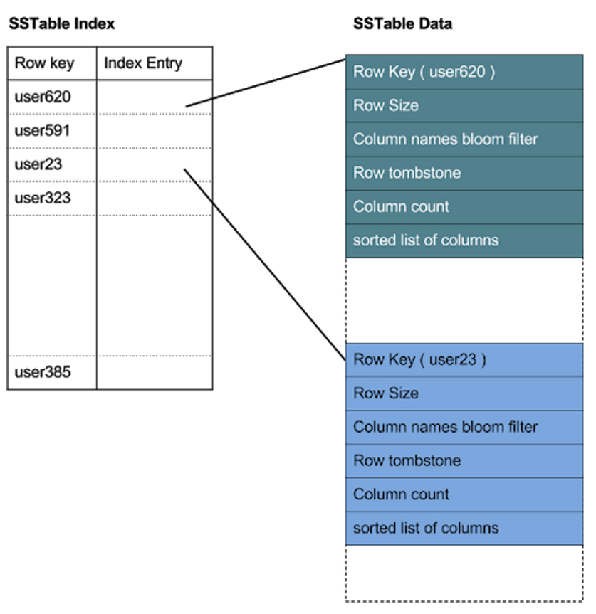
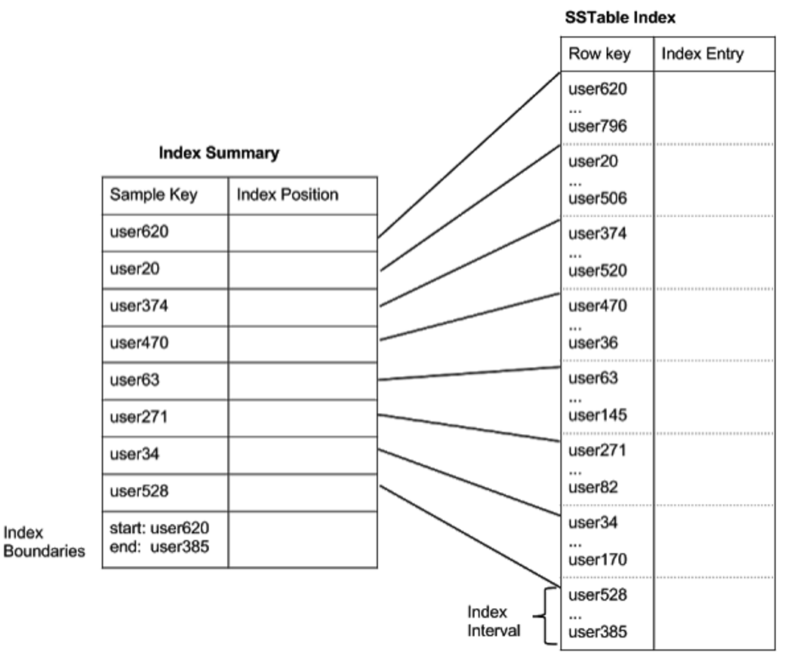
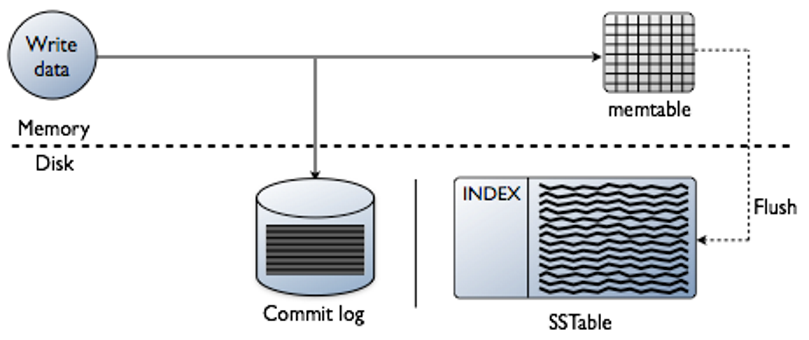
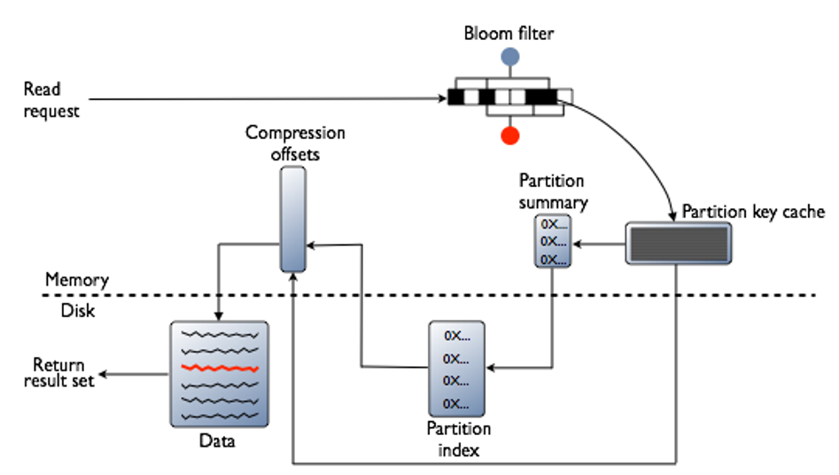
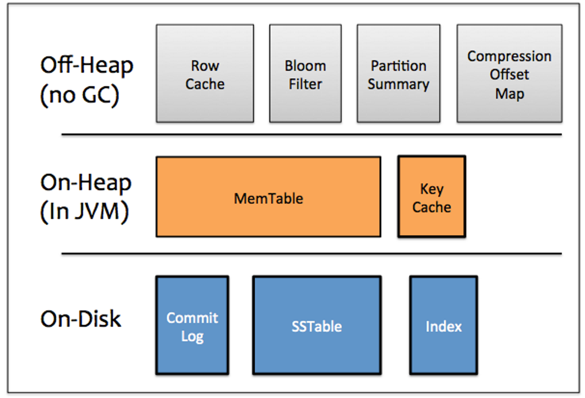

# 1. 介绍下CS底层存储结构

Cassandra底层存储结构分为**逻辑存储**和**物理存储**两个层面。

**逻辑存储结构（4层模型）**：

- **Keyspace（键空间）**：最顶层的逻辑容器，类似关系型数据库中的"数据库"。定义**复制策略(ReplicationStrategy)**和**复制因子(ReplicationFactor)**，控制数据在集群中的分布方式和冗余数量
- **ColumnFamily（列族/表）**：Keyspace下的数据集合，类似关系型数据库中的"表"，但更加稀疏灵活。同一ColumnFamily的不同Row可以拥有不同的列集合，空列不占用存储空间。本质上是一个 **Map里面套Map** 的结构——外层Map通过 **RowKey** 索引，内层Map通过 **ColumnKey** 索引
- **Row（行）**：在CQL中，Row由**完整主键**（分区键 + 聚类列）唯一标识。**一个分区键下可以有多个Row**，通过聚类列值区分。逻辑存储模型中，所有Row平铺为内层SortedMap的条目，按`(聚类列值, column_name)`的复合键排序
- **Column（列）**：存储的基本单元，是一个**三元组（name, value, timestamp）**。name为列名，value为列值，timestamp用于冲突解决——**Cassandra默认使用最后写入者胜出(LWW)**策略，时间戳更大的值作为最新版本

整个逻辑结构可以抽象为：`SortedMap<RowKey, SortedMap<ColumnKey, Column>>`。外层按RowKey排序决定数据分布，内层按ColumnKey排序实现高效列访问。

**分区键与聚类列的不同组合**直接影响分区内的数据行数：

**只有分区键，无聚类列（一分区对应一行数据，ueserid 为 1 、 2 等）**：

```sql
CREATE TABLE user_info (
    user_id BIGINT PRIMARY KEY,
    name TEXT,
    age INT
);
```

`user_id`是唯一主键，也是分区键，没有聚类列。`user_id=1001`的整个分区里**只能有1条数据**，再插入相同`user_id`直接覆盖旧数据（Upsert）。适合用户基础档案这种**一对一**场景。

**分区键 + 聚类列（一分区多行，Cassandra的真正强项）**：

```sql
CREATE TABLE user_log (
    user_id BIGINT,
    log_time TIMESTAMP,
    content TEXT,
    PRIMARY KEY (user_id, log_time)
);
```

分区由`user_id`决定，所有`user_id=1001`的日志存在同一台机器的同一个分区内；分区内靠`log_time`区分不同行，同一分区可存任意多条数据；磁盘内部按`log_time`有序排列，范围查询极快。

```sql
INSERT INTO user_log(user_id, log_time, content) VALUES(1001, '2026-06-24 08:00', '打开首页');
INSERT INTO user_log(user_id, log_time, content) VALUES(1001, '2026-06-24 08:01', '点击商品');
INSERT INTO user_log(user_id, log_time, content) VALUES(1001, '2026-06-24 08:02', '提交订单');
```

三条数据同一个分区、三行独立数据，**互不覆盖**。

虽然一个分区能存大量行，但**官方规范建议单分区数据总量控制在100MB以内**，否则会出现节点热点、查询超时、Compaction写入放大等问题。超大时序场景一般用**复合分区键**拆分热点，例如 `PRIMARY KEY ((user_id, date), log_time)` 按用户+日期拆分为多个分区，避免单分区爆炸。


**物理存储结构**：

- **Commit Log（提交日志）**：写入操作的第一步，**顺序追加写入磁盘**，用于宕机恢复。每个写操作先写入Commit Log再写入Memtable，保证数据不丢失
- **Memtable（内存表）**：内存中的写入缓冲区，数据先写入Memtable再定期刷盘。**Memtable中的数据按ColumnKey排序**，达到阈值后转化为不可变的SSTable刷入磁盘
- **SSTable（有序字符串表）**：**不可变的持久化文件**，一旦写入就不再修改，定期通过Compaction合并清理。内部数据按**分区键和聚类列**排序组织，采用**LSM-Tree**结构。每个SSTable包含Data.db、Index.db、Summary.db、Filter.db（布隆过滤器）等多个组件文件
- **Bloom Filter（布隆过滤器）**：每个SSTable对应一个布隆过滤器，**快速判断RowKey是否存在于该SSTable中**，若判定不存在则跳过查找，大幅减少磁盘IO
- **Compaction**：后台周期性将多个小SSTable合并成大SSTable，**清理标记删除的数据(Tombstone)**，合并相同RowKey的多版本，减少SSTable数量提升读性能

**写入路径**：写请求 → Commit Log顺序写入 → Memtable写入 → 定期Flush生成SSTable → 后台Compaction合并

**读取路径**：读请求 → 检查Bloom Filter跳过不包含目标数据的SSTable → 读取Memtable → 读取多个SSTable（由新到旧） → 按时间戳合并最新版本返回

# 2. RowKey和分区键关系

RowKey和分区键（Partition Key）本质上是**同一概念在不同层面的叫法**：

- **RowKey**是Cassandra**逻辑存储模型**中的术语，即 `SortedMap<RowKey, SortedMap<ColumnKey, Column>>` 中外层Map的Key，用于**唯一标识一行数据**
- **分区键(Partition Key)** 是CQL层面定义主键时**决定数据分布到哪个节点**的部分，通过一致性哈希计算确定目标节点

**对应关系**：CQL中定义 `PRIMARY KEY ((pk1, pk2), ck1, ck2)` 时，**分区键的组合值构成逻辑模型中的RowKey**，聚类列(Clustering Column)则参与构成内层SortedMap的排序。

**关键区别**：

- 在旧版Thrift API中直接使用RowKey术语，CQL引入后用Partition Key替代，语义更清晰
- RowKey包含**所有用于索引和分布的信息**，在逻辑模型中直接对应分区键，不包含聚类列
- **同一分区键下可以有多个Row**吗？在CQL语义中，每个Row由**完整主键**（分区键+聚类列）唯一标识，但底层存储中**同一分区键的数据物理上连续存储在一起**，内层按聚类列+列名排序组织

**示例说明**：

- 定义表：`PRIMARY KEY ((user_id), timestamp)`，其中`user_id`是分区键，`timestamp`是聚类列
- 逻辑存储模型表现为：`SortedMap<user_id, SortedMap<(timestamp, column_name), value>>`
- 多个Row（不同timestamp）共享同一个`user_id`分区键时，它们在底层物理上**存储在同一个分区**内，按`timestamp`排序

**关键澄清**：在CQL中，Row是**按完整主键（分区键+聚类列）定义的**，不是一个RowKey只对应一个Row。一个分区键下有多少个不同的聚类列值组合，就有多少个Row。但在存储层，这些Row被**打平存储**在同一个分区的内层SortedMap中，CQL层面的一行对应存储层内的一组`(聚类列值, column_name)`条目

# 3. CS存储结构与MySQL区别

以**用户订单历史**为例，对比同一数据在Cassandra和MySQL中的存储方式。

**CQL表定义**：

```sql
CREATE TABLE user_orders (
    user_id text,
    order_time timestamp,
    order_id text,
    amount double,
    status text,
    PRIMARY KEY ((user_id), order_time)
);
```

插入两条数据：

```sql
INSERT INTO user_orders (user_id, order_time, order_id, amount, status)
VALUES ('user-001', '2024-01-01T10:00:00Z', 'ORD-001', 99.9, 'paid');
INSERT INTO user_orders (user_id, order_time, order_id, amount, status)
VALUES ('user-001', '2024-01-01T11:30:00Z', 'ORD-002', 199.0, 'shipped');
```

**Cassandra逻辑存储结构（SortedMap视角）**：

```
SortedMap<"user-001", SortedMap<ColumnKey, Column>>

内层SortedMap展开：
{
  (10:00:00, order_id)   → {name: order_id,   value: ORD-001,  timestamp: T1}
  (10:00:00, amount)     → {name: amount,     value: 99.9,     timestamp: T1}
  (10:00:00, status)     → {name: status,     value: paid,     timestamp: T1}
  (11:30:00, order_id)   → {name: order_id,   value: ORD-002,  timestamp: T2}
  (11:30:00, amount)     → {name: amount,     value: 199.0,    timestamp: T2}
  (11:30:00, status)     → {name: status,     value: shipped,  timestamp: T2}
}
```

物理上所有`user_id=user-001`的数据**存储在同一个节点的同一个分区内**，内层按`(order_time, column_name)`的复合键排序后连续存储为SSTable。

> **注意：逻辑模型 vs 物理存储**——上图中的`{name: order_id}`等是逻辑示意，物理存储不会重复存储列名字符串。Cassandra在SSTable中通过**列名索引(Column Name Index)**将列名映射为紧凑的整型ID，每个分区内列名只存一次；聚类列值（如`order_time`）采用**前缀压缩/差值编码**；加上64KB块的Snappy/LZ4压缩，**列名重复的额外开销极小**。

**MySQL等价的存储方式**：

```sql
CREATE TABLE user_orders (
    user_id VARCHAR(50),
    order_time DATETIME,
    order_id VARCHAR(50),
    amount DECIMAL(10,2),
    status VARCHAR(20),
    PRIMARY KEY (user_id, order_time)
);
```

InnoDB行存储物理布局：

```
聚簇索引 B+树 Leaf Page:
  Row1: user-001 | 10:00:00 | ORD-001 | 99.9  | paid
  Row2: user-001 | 11:30:00 | ORD-002 | 199.0 | shipped
```

**核心区别**：

- **底层存储引擎**：MySQL InnoDB使用**B+Tree**聚簇索引，数据按主键排序存储在B+树的Leaf Page中，写入时原地更新、可能触发页分裂和随机IO；Cassandra使用**LSM-Tree**（Memtable + SSTable），写入先追加到内存Memtable，刷盘后生成不可变的SSTable，全程顺序IO无原地更新。逻辑上Cassandra可以理解为 `SortedMap<RowKey, SortedMap<ColumnKey, Column>>`，但物理上并不是一个全局Map，而是多个SSTable文件的分区存储
- **稀疏性与动态列**：MySQL每行固定4个业务列（order_id, amount, status, 等），即使某列为NULL也占用行格式标记位；Cassandra中**不存在NULL列**，只存储实际写入的Column。更关键的是Cassandra支持**动态添加列**——如果新增一个字段`coupon_code`，只需在写入时带上即可生效，无需改表，旧行自动不包含此列
- **Schema变更**：MySQL要新增列需执行`ALTER TABLE`，大表可能阻塞DML；Cassandra**直接写入新列名**即可，同一表内新旧行的列集合互不影响
- **物理连续性**：MySQL按**行**连续存储，读取一行时一次IO获取全部列；Cassandra按**分区键**连续存储，同一用户的所有订单物理上集中存放（同一个分区内），查询用户订单历史时非常高效（单分区扫描）
- **版本控制**：Cassandra每个Column自带时间戳（T1/T2），天然支持多版本冲突解决（LWW）；MySQL依赖行级MVCC，无列级版本概念

**动态列示例**——第三个订单新增`coupon_code`字段：

```sql
INSERT INTO user_orders (user_id, order_time, order_id, amount, status, coupon_code)
VALUES ('user-001', '2024-01-01T14:00:00Z', 'ORD-003', 59.9, 'paid', 'SPRING2024');
```

Cassandra存储表示只多了一条Column记录，前两个订单的SSTable不受影响：

```
  (14:00:00, order_id)    → {name: order_id,    value: ORD-003,    timestamp: T3}
  (14:00:00, amount)      → {name: amount,      value: 59.9,       timestamp: T3}
  (14:00:00, status)      → {name: status,      value: paid,       timestamp: T3}
  (14:00:00, coupon_code) → {name: coupon_code, value: SPRING2024, timestamp: T3}
```

MySQL则必须先`ALTER TABLE`添加`coupon_code`列，且**ORD-001和ORD-002的该列值均为NULL**，仍然占用存储标记位。

# 4. 介绍下SSTable的原理

SSTable（Sorted Strings Table）是Cassandra**持久化存储的核心单元**，本质是一个**按键排序的、不可变的、持久化的key-value map**，其中key和value都是任意字节数组。SSTable源自Google Bigtable论文，Cassandra借鉴并扩展了其设计。

**SSTable不是一个文件，而是由多个组件文件组成**：

- **Data.db**：实际数据文件，按排序顺序存储每一行的数据，包含RowKey、数据大小、列名布隆过滤器、行墓碑、列数、已排序的列字段
- **Index.db**：主键索引文件，Index 文件实际上就是 Key 的一个索引文件。记录每个RowKey及其在Data.db中的起始偏移位置。Index文件是**稠密索引**——每一行一个索引条目，查找时先在Index中二分定位RowKey，再按偏移读取Data
- **Summary.db**：Index的**稀疏抽样**，将Index中的RowKey按固定间隔采样（默认每128个索引条目取一个），加载到内存中用于快速定位Index的搜索范围。相比全量Index加载到内存，Summary大幅降低内存占用
- **Filter.db**：Bloom Filter的序列化结果，用于**快速判断RowKey是否可能存在于该SSTable中**。若判定不存在则跳过该SSTable的磁盘IO，大幅提升读取性能
- **CompressionInfo.db**：存储压缩信息，包含每个数据块的未压缩长度、块偏移量等。Cassandra支持按块压缩（每个块独立压缩），读取时只需解压目标块而非整个文件
- **Statistics.db**：SSTable内容的统计元数据，如最小/最大时间戳、行数、墓碑数、压缩率等
- **TOC.txt**：目录文件，列出该SSTable包含的所有组件文件列表，Cassandra启动时通过TOC加载组件
- **Digest / CRC**：数据完整性校验文件（CRC32、Adler32等），用于检测数据损坏



**内部存储结构**：Data.db内部按**块(Block)**组织，每个块默认**64KB**（可配置）。数据按RowKey排序后写入块中，一个块包含多个Row。Index.db对每个RowKey记录其在Data.db中的偏移，加载到内存时只加载Summary（稀疏采样），Index在需要时按Summary定位范围后部分加载。

**不可变性的设计原因**：

- **并发控制简单**：SSTable一旦写入不再修改，读操作无需加锁，写操作直接追加新SSTable，不存在读写冲突
- **崩溃恢复友好**：写入完成前若崩溃，直接丢弃该SSTable即可；写入完成后生成的文件内容完整一致，无需重做日志恢复
- **Compaction统一管理**：数据清理、去重、合并等操作统一由Compaction后台异步完成，不影响前台写入

**读取路径**：查询一个RowKey时，按SSTable由新到旧的顺序，先检查Bloom Filter → 命中后从Summary定位Index范围 → Index精确找到偏移 → 读取Data.db中的目标块 → 解压（开启压缩时）→ 返回数据。跨多个SSTable的结果按时间戳合并返回最新版本。

**相比哈希存储引擎的优势**：

- **内存占用低**：
  - 哈希引擎需要稠密索引（每条数据一个索引条目）全部加载到内存；
  - SSTable使用稀疏索引（Summary采样），内存占用大幅减少
- **区间查询高效**：
  - SSTable数据按键排序，天然支持范围扫描和排序遍历；
  - 哈希引擎按哈希散列，区间查询需要全表扫描
- **顺序IO友好**：
  - 写入和Compaction均为顺序追加，无随机IO；
  - 哈希引擎在磁盘维护索引时会产生大量随机IO

# 5. 读时底层是如何读取的

Cassandra的读路径采用**逐层过滤、逐步精确**的流水线设计，目标是**用最少的内存和磁盘IO定位到目标数据**。读请求需要将**活跃Memtable**和**多个SSTable**的结果合并后返回。

Cassandra在读取路径上分几个阶段处理数据，去发现数据存储在哪，从memtable中的数据开始，到SSTables结束；\* 检查memtable \* 检查行缓存，如果开启了的话 \* 检查布隆过滤器 \* 检查分区key缓存，如果开启了的话 \* 如果在分区key缓存中找到分区键，则直接转到压缩偏移量map;如果没有找到，则检查
分区摘要。如果检查了分区摘要，那么将访问分区索引 \* 使用压缩偏移量map定位磁盘上的数据 \* 从磁盘上sstable中获取数据

**整体读路径（按顺序）**：

Memtable检查 → Row Cache检查（可选） → Bloom Filter过滤 → Partition Key Cache检查（可选） → Partition Summary定位 → Partition Index精确定位 → Compression Offset Map映射磁盘位置 → SSTable数据读取 → 多版本合并返回



**逐层详解**：

**1. 检查Memtable**：

Memtable是每个表专用的**堆内写缓冲区**，保存最近写入但尚未刷盘的数据。读请求**首先检查Memtable**中是否存在目标分区的数据。如果命中，数据与后续SSTable的结果按时间戳合并。**Memtable中的数据是最新的**，因此优先读取。

**2. 检查Row Cache（可选，默认关闭）**：

Row Cache缓存**完整的行数据**到**堆外内存**，使用LRU淘汰策略。如果Row Cache命中，直接跳过后续所有步骤返回数据，**节省两次磁盘寻道**。但Row Cache**不是直写式的**——对该行发生写操作时，整行缓存立即失效，下次读到时重新缓存。Row Cache适合**读密集型（95%+读）**场景，写密集型场景会因频繁缓存失效导致性能下降，不建议开启。通过表配置`caching`控制：`NONE` / `KEYS_ONLY` / `ROWS_ONLY` / `ALL`。

**3. 检查Bloom Filter**：

每个SSTable对应一个**堆外内存**的Bloom Filter。Bloom Filter是一个**概率性数据结构**，可以**确定SSTable不包含某个分区**（100%准确排除），但无法确定一定包含（可能误报）。当Bloom Filter判定"不存在"时，直接跳过该SSTable，大幅减少无效磁盘IO。误报率可通过Bloom Filter大小调节，**10亿个分区约占用1-2GB内存**。

**4. 检查Partition Key Cache（可选）**：

Partition Key Cache缓存**分区键及其在SSTable中的偏移位置**，存储在**堆外内存**，使用可配置的内存量。如果命中，**直接跳到Compression Offset Map**定位磁盘数据，无需经过Partition Summary和Partition Index。Key Cache对**冷启动读取**的改善尤为明显——预热后命中率高，大幅减少磁盘寻道。

**5. 查询Partition Summary**：

Partition Summary是Partition Index的**稀疏采样**，存储在**堆外内存**。Partition Index包含所有分区键，而Summary按固定间隔采样（默认每128个键取一个），例如有100个分区键、采样间隔20，Summary只存pk001、pk020、pk040...共5个键及其在Index中的位置。查询pk027时，Summary告知pk020之后，将扫描范围从100个缩小到`pk020-pk040`之间的20个键。采样间隔通过`index_interval`配置，**间隔越小内存占用越大、定位越精确**；内存上限通过`index_summary_capacity_in_mb`配置，默认为堆大小的5%。

**6. 查询Partition Index**：

Partition Index存储在**磁盘**上（每个SSTable的Index.db），是**稠密的全量索引**，记录每个分区键在Data.db中的偏移量。根据Summary缩小范围后，Partition Index执行一次**二分查找和顺序读取**，精确找到目标分区键的偏移位置。如果搜索到了Partition Index这一步，**需要两次磁盘寻道**——一次读Index找偏移，一次读Data取数据。

**7. 查询Compression Offset Map**：

Compression Offset Map存储在**堆外内存**，记录每个压缩块的偏移量和未压缩位置映射。当Cassandra启用压缩（默认开启，LZ4/Snappy/Zstd），SSTable数据按**64KB块**分别压缩存储，`Index.db`中记录的偏移是**未压缩数据的偏移**。Compression Offset Map将未压缩偏移映射到实际压缩块的磁盘位置。如果目标分区跨越多个压缩块，需要解压所有相关块——因为压缩算法不能从块中间开始解压。压缩块越小，定位越精确但压缩率越低，可根据分区大小调优。**每TB压缩数据，Compression Offset Map约增长1-3GB内存**。

**8. 从SSTable读取数据**：

定位到磁盘上的压缩块后，读取并解压，获取实际的行数据。如果目标数据跨多个SSTable，Cassandra将**活跃Memtable中的数据和所有相关SSTable的数据按时间戳合并**，返回最新版本。若开启Row Cache，合并后的结果会回填入Row Cache供后续查询使用。

**关键设计特点**：

- **分层降级**：每一层都尝试避免进入下一层（更慢的层），Row Cache命中完全跳过磁盘，Bloom Filter排除不包含数据的SSTable，Summary缩小索引扫描范围
- **堆外内存优先**：Row Cache、Bloom Filter、Key Cache、Summary、Compression Offset Map均使用**堆外内存**，减少JVM GC压力
- **压缩友好**：默认开启块压缩，Compression Offset Map在内存中维护压缩块偏移，以额外CPU解码换更高效的磁盘IO和页缓存利用率



# 6. CS底层如何写入的

写入路径分为五个阶段：**Coordinator分发** → **Commit Log持久化** → **Memtable写入** → **Flush生成SSTable** → **后台Compaction**。全程顺序IO，无原地更新。

**1. Coordinator分发写请求**：

- Coordinator根据分区键计算一致性哈希，确定目标副本节点（数量取决于RF）。**Coordinator本身可能根本不是该分区的副本节点**，它只负责转发和聚合结果
- 向所有副本节点并发发送写请求，**每个副本节点先写Commit Log再写Memtable**，完成后向Coordinator返回ack
- Coordinator收集到足够数量的ack后才向客户端返回成功。**Commit Log写成功不等于写成功**，而是**副本节点完成Commit Log + Memtable写入并回复ack，且ack数量达到CL要求**
- CL等级：**ANY**（任意节点接收请求即可，哪怕只是存了Hint还未实际写入）、**ONE**（任一副本确认，最常用）、**QUORUM**（RF/2+1个副本确认，兼顾一致性与可用性）、**ALL**（全部确认，一个副本不可用即失败）
- 如果副本节点未在指定时间内响应（默认**2秒**rpc_timeout），Coordinator返回超时异常，但仍在后台保存Hint

**2. Commit Log写入**：

- 节点收到写请求后，**先顺序追加到Commit Log**，再写入Memtable。Commit Log保证即使节点宕机，数据也可在重启后从Commit Log恢复
- Commit Log在所有表之间共享，按段组织，每段默认**64MB**
- 写入模式：
  - **periodic模式**（默认）：定时fsync到磁盘（默认每10秒），吞吐高但节点崩溃时可能丢失少量数据
  - **batch模式**：每次写操作后立即fsync，吞吐显著降低但保证零数据丢失
- Commit Log占用的空间超过`commitlog_total_space_in_mb`阈值时，触发最旧的Memtable flush，flush完成后对应Commit Log段被删除

**3. Memtable写入与Flush**：

- Memtable是**每个表独立**的内存数据结构，按分区键排序存放，本质是一个**写回缓存（write-back cache）**
- 容量通过`memtable_heap_space_in_mb`（堆内）或`memtable_offheap_space_in_mb`（堆外）配置
- Flush触发条件：
  - Memtable达到配置上限
  - Commit Log空间超过阈值
  - 手动执行`nodetool flush`或`nodetool drain`（flush后断开节点连接，常用于重启）
- **Flush过程**：将Memtable中排好序的数据顺序写入磁盘，生成不可变的SSTable，同时创建**分区索引（Partition Index）**将token映射到磁盘位置
- 如果等待flush的数据超过`memtable_cleanup_threshold`，Cassandra**阻塞写操作**直到flush完成腾出空间
- 节点重启时重放Commit Log，将未flush的写操作恢复到Memtable；重启前建议手动flush，减少Commit Log重放时间

**4. SSTable持久化**：

- SSTable一旦生成即**不可变**，后续写操作只会生成新的SSTable，同一分区的数据可能分布在多个SSTable中
- 每个SSTable由多个组件文件组成：
  - **Data.db**：实际的行数据，按分区键排序，块压缩存储（默认LZ4，64KB一块）
  - **Index.db**：稠密索引，记录每个分区键在Data.db中的偏移位置
  - **Summary.db**：Index的稀疏采样（默认每128个键取一个），常驻堆外内存，用于快速定位Index搜索范围
  - **Filter.db**：Bloom Filter序列化结果，**快速判断分区键是否可能存在于该SSTable中**
  - **CompressionInfo.db**：各压缩块的未压缩长度、块偏移等信息
  - **Statistics.db**：统计元数据——行数、时间戳范围、墓碑数、压缩率等
  - **TOC.txt**：该SSTable所有组件文件的清单
  - **CRC / Digest**：数据完整性校验文件
- Cassandra为每个表创建独立子目录，支持将不同表软链接到不同物理磁盘（如SSD），实现I/O隔离和冷热分层存储

**5. Hinted Handoff（写失败处理）**：

- 当副本节点因宕机、网络故障或长时间GC暂停不可用时，Coordinator将写请求保存为**Hint**
- Hint包含目标节点ID、Hint ID（time UUID）和数据，每**10秒**写入磁盘一次，防止内存积累过多
- Gossip检测到目标节点恢复后，Coordinator回放Hint中的写请求，完成后删除Hint文件
- 若目标节点宕机超过`max_hint_window_in_ms`（默认**3小时**），Coordinator停止写入新Hint，认为该节点长期离线
- 多个节点同时宕机时，Coordinator可能积累大量Hint；达到上限后抛出**OverloadedException**拒绝新写请求

**6. Compaction（后台合并）**：

- Compaction在后台将多个小SSTable合并为大SSTable，**清理Tombstone（标记删除）**，合并同一分区的多版本数据
- 主要策略：**SizeTieredCompactionStrategy（STCS，默认）**、**LeveledCompactionStrategy（LCS，读优化）**、**TimeWindowCompactionStrategy（TWCS，时序场景专用）**
- Compaction带来**写放大**，LCS写放大高于STCS但读性能更好，TWCS写放大最小

**关键设计思想**：

- **顺序IO最大化**：Commit Log追加 + Memtable内存写入 + SSTable顺序刷盘，全程无原地更新、无随机IO
- **写优先**：写入性能远高于读取，适合写多读少场景
- **最终一致性**：写入完成后副本间可能短暂不一致，通过Read Repair和Hinted Handoff最终收敛一致


# 7. CS比MySQL适合什么场景，能替代MySQL吗

Cassandra和MySQL的**适用场景完全不同**，不是替代关系而是互补关系。**Cassandra不能替代MySQL**。

**Cassandra的适用场景（写多读少、海量写入）**：

- **时序与日志场景**：用户行为日志、IoT设备上报、监控指标采集，写入量每秒百万级，Cassandra LSM-Tree引擎全程顺序IO，写入远超MySQL B+Tree
- **写多读少且无强事务需求**：Cassandra写入是内存 + 顺序IO，几乎无锁，**写入吞吐可水平扩展**；MySQL B+Tree写入涉及B+Tree分裂、随机IO和行锁，写入成为瓶颈
- **多DC部署、跨地域容灾**：Cassandra原生支持跨DC复制，写请求自动分发到多DC，无需中间件；MySQL跨DC需要主从复制或中间件层
- **Schema灵活、动态列**：Cassandra写时无需提前定义列，同一表不同行列集合不同，适合字段不确定的数据写入；MySQL必须先ALTER TABLE加列

**MySQL的适用场景（读多写少、复杂查询、强事务）**：

- **核心交易系统**：订单、支付、账户余额，需要**ACID事务**和行级强一致性，Cassandra不支持跨分区事务，LWT性能差且受限
- **复杂关联查询**：多表JOIN、子查询、GROUP BY、窗口函数，Cassandra不支持JOIN，只能在应用层做
- **读多写少场景**：MySQL B+Tree在静态数据上的**点查和范围查延迟极低**；Cassandra读路径需要合并多个SSTable，Bloom Filter + Index多步查找，读延迟比MySQL高且不稳定
- **数据量可控（单表千万\~亿级）**：MySQL单表性能优秀，运维成熟；Cassandra更适合百TB到PB级

**关键对比**：

- **写入**：Cassandra >> MySQL（LSM-Tree顺序IO vs B+Tree随机IO + 行锁）
- **点查**：MySQL > Cassandra（B+Tree深度3-4层，一次IO定位；Cassandra需合并多个SSTable、经过Bloom Filter + Index多步）
- **复杂查询**：MySQL >> Cassandra（MySQL支持JOIN/子查询，Cassandra不支持）
- **事务**：MySQL >> Cassandra（MySQL完整ACID，Cassandra只有行级原子性）
- **水平扩展**：Cassandra >> MySQL（Cassandra加节点自动rebalance；MySQL需分库分表中间件）
- **多DC**：Cassandra原生支持，MySQL需额外方案

**结论**：

- Cassandra是**写优化的分布式键值存储**，适合海量写入、水平扩展、多DC、无强事务需求
- MySQL是**读优化的关系型数据库**，适合强事务、复杂查询、存量数据高效读取
- 不能也不应替代MySQL，实际架构中常**两者并用**——Cassandra存海量时序/日志数据，MySQL存核心交易和关系型数据

# 8. CS为什么对写性能好

Cassandra写性能好的核心原因在于**LSM-Tree架构 + 无SQL引擎开销 + 全程顺序IO + 写后异步持久化**四个方面。

**1. 无SQL引擎和事务锁开销**：

- RDBMS处理每个写请求需要SQL解析、语义优化、执行计划生成、行锁管理、事务日志、MVCC版本维护等一系列操作，**每条SQL都有一整套开销链条**
- Cassandra没有SQL解析层（CQL很薄，本质是key-value API），**无事务、无行锁、无MVCC版本管理**。写操作只是简单追加，不涉及任何加锁和冲突检测（冲突通过时间戳LWW解决，无需锁）

**2. LSM-Tree：全程顺序IO，无随机写入**：

- 写入路径：写Commit Log（**顺序追加**）→ 写Memtable（**纯内存**）→ Flush生成SSTable（**批量顺序写盘**）
- 对比MySQL InnoDB B+Tree：更新一行需要**随机IO**定位数据页、写Undo/Redo Log、可能触发**页分裂**和**索引随机写**
- Cassandra**全程无原地更新、无随机IO**，所有磁盘操作都是**串行顺序追加**，这是写性能远超MySQL的根本原因

**3. 写后快速返回（异步持久化）**：

- 写请求写入Memtable后即认为"写入完成"，无需等待SSTable刷盘。客户端在**Commit Log + Memtable完成后就可返回**（取决于Consistency Level），整个路径在毫秒级
- Commit Log采用**periodic fsync**（默认每10秒），批量刷盘，大幅减少磁盘IO次数。代价是节点宕机可能丢失最后10秒内的数据
- Flush到SSTable在后台异步执行，不阻塞前台写入（除非Memtable积压超过`memtable_cleanup_threshold`）

**4. 无锁并发**：

- SSTable**不可变**，读取无锁，写入直接追加新文件，不存在读写冲突
- 每行数据自带**时间戳**，冲突时最后写入者胜出（LWW），无需分布式锁或行级锁
- 同一分区下多个Row的写入互不影响，因为是不同的聚类列值

**5. SSD友好，抑制写放大**：

- LSM-Tree的**批量顺序写入**非常适合SSD特性。SSD随机写性能差且有写放大（Write Amplification），Cassandra将随机写转化为顺序写，**大幅降低SSD的写放大因子**，延长SSD寿命
- 虽然后台Compaction也有写放大，但相比B+Tree的随机写放大，LSM-Tree的写放大更可控且对SSD更友好

**6. 多级缓存补偿读性能**：

- Cassandra设计上**牺牲部分读性能换取最大写入能力**，但通过多级缓存显著改善了读路径：Bloom Filter排除不相关SSTable、Key Cache跳过索引查找、Row Cache缓存整行、Summary内存索引快速定位。因此**基于RowKey的点查性能并不差**
- 读时合并多个SSTable + Memtable的结果，按时间戳返回最新版本

**关键权衡**：

- **写放大**：Compaction将多个小SSTable合并为大SSTable会产生写放大，LeveledCompactionStrategy写放大更高但读性能更好
- **读路径复杂**：读请求需要检查Memtable + 多个SSTable，经过Bloom Filter → Summary → Index → 解压多步，延迟比B+Tree高且不稳定
- **但不影响Cassandra作为写优化存储的定位**——它追求的是**海量写入吞吐**而非单次写入低延迟，后者是MySQL的强项

