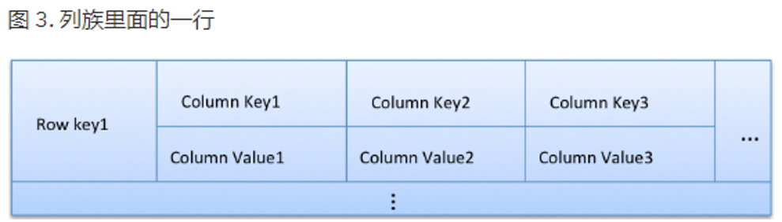

# 1. 介绍下Cassandra底层存储结构

Cassandra底层存储结构分为**逻辑存储**和**物理存储**两个层面。

**逻辑存储结构（4层模型）**：

- **Keyspace（键空间）**：最顶层的逻辑容器，类似关系型数据库中的"数据库"。定义**复制策略(ReplicationStrategy)**和**复制因子(ReplicationFactor)**，控制数据在集群中的分布方式和冗余数量
- **ColumnFamily（列族/表）**：Keyspace下的数据集合，类似关系型数据库中的"表"，但更加稀疏灵活。同一ColumnFamily的不同Row可以拥有不同的列集合，空列不占用存储空间。本质上是一个 **Map里面套Map** 的结构——外层Map通过 **RowKey** 索引，内层Map通过 **ColumnKey** 索引
- **Row（行）**：表示一个数据对象，由**唯一RowKey**和一组**有序的Column**组成。RowKey用于定位数据所在的分区，通过一致性哈希算法决定该Row存储在哪个节点
- **Column（列）**：存储的基本单元，是一个**三元组（name, value, timestamp）**。name为列名，value为列值，timestamp用于冲突解决——**Cassandra默认使用最后写入者胜出(LWW)**策略，时间戳更大的值作为最新版本

整个逻辑结构可以抽象为：`SortedMap<RowKey, SortedMap<ColumnKey, Column>>`。外层按RowKey排序决定数据分布，内层按ColumnKey排序实现高效列访问。



**物理存储结构**：

- **Commit Log（提交日志）**：写入操作的第一步，**顺序追加写入磁盘**，用于宕机恢复。每个写操作先写入Commit Log再写入Memtable，保证数据不丢失
- **Memtable（内存表）**：内存中的写入缓冲区，数据先写入Memtable再定期刷盘。**Memtable中的数据按ColumnKey排序**，达到阈值后转化为不可变的SSTable刷入磁盘
- **SSTable（有序字符串表）**：**不可变的持久化文件**，一旦写入就不再修改，定期通过Compaction合并清理。内部数据按**分区键和聚类列**排序组织，采用**LSM-Tree**结构。每个SSTable包含Data.db、Index.db、Summary.db、Filter.db（布隆过滤器）等多个组件文件
- **Bloom Filter（布隆过滤器）**：每个SSTable对应一个布隆过滤器，**快速判断RowKey是否存在于该SSTable中**，若判定不存在则跳过查找，大幅减少磁盘IO
- **Compaction**：后台周期性将多个小SSTable合并成大SSTable，**清理标记删除的数据(Tombstone)**，合并相同RowKey的多版本，减少SSTable数量提升读性能

**写入路径**：写请求 → Commit Log顺序写入 → Memtable写入 → 定期Flush生成SSTable → 后台Compaction合并

**读取路径**：读请求 → 检查Bloom Filter跳过不包含目标数据的SSTable → 读取Memtable → 读取多个SSTable（由新到旧） → 按时间戳合并最新版本返回

# 2. RowKey和分区键的关系是什么

RowKey和分区键（Partition Key）本质上是**同一概念在不同层面的叫法**：

- **RowKey**是Cassandra**逻辑存储模型**中的术语，即 `SortedMap<RowKey, SortedMap<ColumnKey, Column>>` 中外层Map的Key，用于**唯一标识一行数据**
- **分区键(Partition Key)** 是CQL层面定义主键时**决定数据分布到哪个节点**的部分，通过一致性哈希计算确定目标节点

**对应关系**：CQL中定义 `PRIMARY KEY ((pk1, pk2), ck1, ck2)` 时，**分区键的组合值构成逻辑模型中的RowKey**，聚类列(Clustering Column)则参与构成内层SortedMap的排序。

**关键区别**：

- 在旧版Thrift API中直接使用RowKey术语，CQL引入后用Partition Key替代，语义更清晰
- RowKey包含**所有用于索引和分布的信息**，在逻辑模型中直接对应分区键，不包含聚类列
- **同一分区键下可以有多个Row**吗？在CQL语义中，每个Row由**完整主键**（分区键+聚类列）唯一标识，但底层存储中**同一分区键的数据物理上连续存储在一起**，内层按聚类列+列名排序组织

**示例说明**：

- 定义表：`PRIMARY KEY ((user_id), timestamp)`，其中`user_id`是分区键，`timestamp`是聚类列
- 逻辑存储模型表现为：`SortedMap<user_id, SortedMap<(timestamp, column_name), value>>`
- 多个Row（不同timestamp）共享同一个`user_id`分区键时，它们在底层物理上**存储在同一个分区**内，按`timestamp`排序

# 3. CS存储结构与MySQL的区别

以**用户订单历史**为例，对比同一数据在Cassandra和MySQL中的存储方式。

**CQL表定义**：

```sql
CREATE TABLE user_orders (
    user_id text,
    order_time timestamp,
    order_id text,
    amount double,
    status text,
    PRIMARY KEY ((user_id), order_time)
);
```

插入两条数据：

```sql
INSERT INTO user_orders (user_id, order_time, order_id, amount, status)
VALUES ('user-001', '2024-01-01T10:00:00Z', 'ORD-001', 99.9, 'paid');
INSERT INTO user_orders (user_id, order_time, order_id, amount, status)
VALUES ('user-001', '2024-01-01T11:30:00Z', 'ORD-002', 199.0, 'shipped');
```

**Cassandra逻辑存储结构（SortedMap视角）**：

```
SortedMap<"user-001", SortedMap<ColumnKey, Column>>

内层SortedMap展开：
{
  (10:00:00, order_id)   → {name: order_id,   value: ORD-001,  timestamp: T1}
  (10:00:00, amount)     → {name: amount,     value: 99.9,     timestamp: T1}
  (10:00:00, status)     → {name: status,     value: paid,     timestamp: T1}
  (11:30:00, order_id)   → {name: order_id,   value: ORD-002,  timestamp: T2}
  (11:30:00, amount)     → {name: amount,     value: 199.0,    timestamp: T2}
  (11:30:00, status)     → {name: status,     value: shipped,  timestamp: T2}
}
```

物理上所有`user_id=user-001`的数据**存储在同一个节点的同一个分区内**，内层按`(order_time, column_name)`的复合键排序后连续存储为SSTable。

**MySQL等价的存储方式**：

```sql
CREATE TABLE user_orders (
    user_id VARCHAR(50),
    order_time DATETIME,
    order_id VARCHAR(50),
    amount DECIMAL(10,2),
    status VARCHAR(20),
    PRIMARY KEY (user_id, order_time)
);
```

InnoDB行存储物理布局：

```
聚簇索引 B+树 Leaf Page:
  Row1: user-001 | 10:00:00 | ORD-001 | 99.9  | paid
  Row2: user-001 | 11:30:00 | ORD-002 | 199.0 | shipped
```

**核心区别**：

- **稀疏性与动态列**：MySQL每行固定4个业务列（order_id, amount, status, 等），即使某列为NULL也占用行格式标记位；Cassandra中**不存在NULL列**，只存储实际写入的Column。更关键的是Cassandra支持**动态添加列**——如果新增一个字段`coupon_code`，只需在写入时带上即可生效，无需改表，旧行自动不包含此列
- **Schema变更**：MySQL要新增列需执行`ALTER TABLE`，大表可能阻塞DML；Cassandra**直接写入新列名**即可，同一表内新旧行的列集合互不影响
- **物理连续性**：MySQL按**行**连续存储，读取一行时一次IO获取全部列；Cassandra按**分区键**连续存储，同一用户的所有订单物理上集中存放，查询用户订单历史时非常高效（单分区扫描）
- **版本控制**：Cassandra每个Column自带时间戳（T1/T2），天然支持多版本冲突解决（LWW）；MySQL依赖行级MVCC，无列级版本概念
- **写入方式**：Cassandra是**append-only**追加写入SSTable，写入路径无随机IO；MySQL InnoDB是B+树原地更新，写入可能触发随机IO和页分裂

**动态列示例**——第三个订单新增`coupon_code`字段：

```sql
INSERT INTO user_orders (user_id, order_time, order_id, amount, status, coupon_code)
VALUES ('user-001', '2024-01-01T14:00:00Z', 'ORD-003', 59.9, 'paid', 'SPRING2024');
```

Cassandra存储表示只多了一条Column记录，前两个订单的SSTable不受影响：

```
  (14:00:00, order_id)    → {name: order_id,    value: ORD-003,    timestamp: T3}
  (14:00:00, amount)      → {name: amount,      value: 59.9,       timestamp: T3}
  (14:00:00, status)      → {name: status,      value: paid,       timestamp: T3}
  (14:00:00, coupon_code) → {name: coupon_code, value: SPRING2024, timestamp: T3}
```

MySQL则必须先`ALTER TABLE`添加`coupon_code`列，且**ORD-001和ORD-002的该列值均为NULL**，仍然占用存储标记位。

