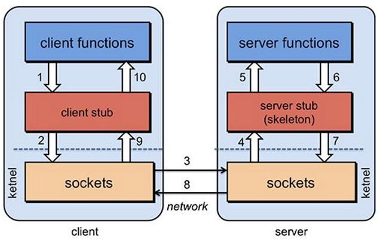
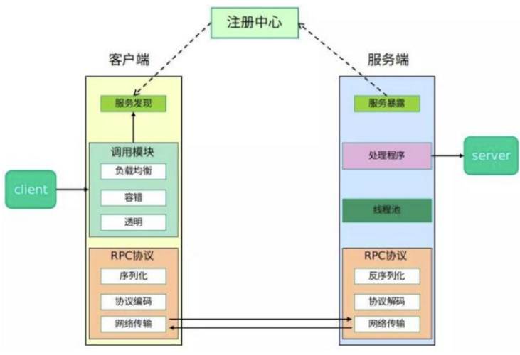
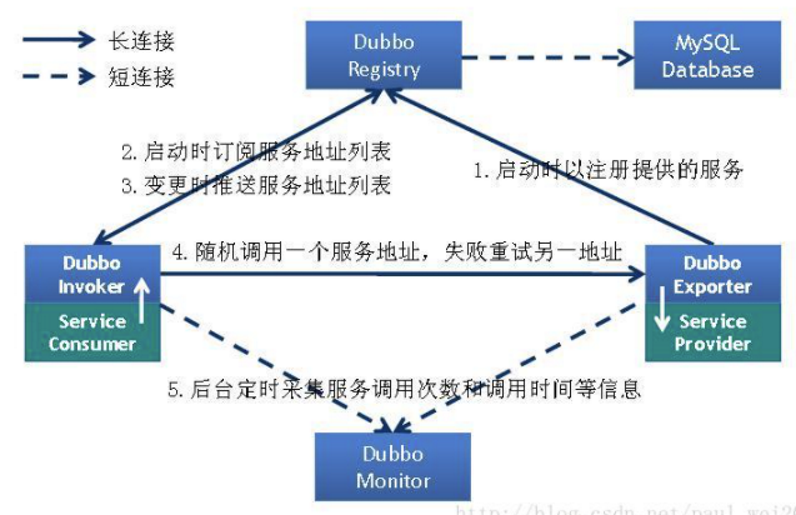
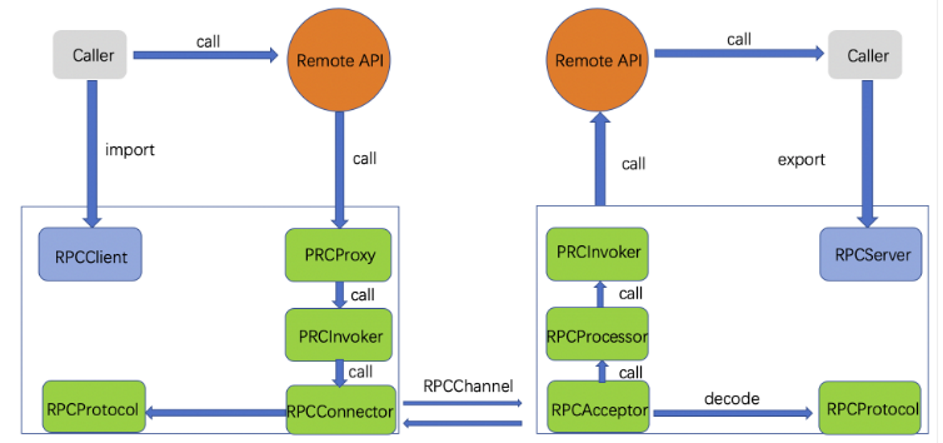
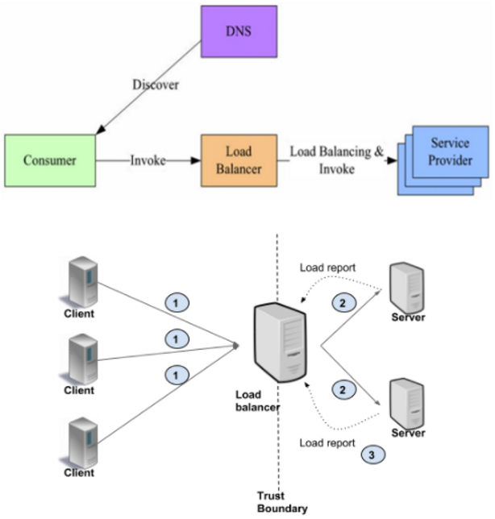
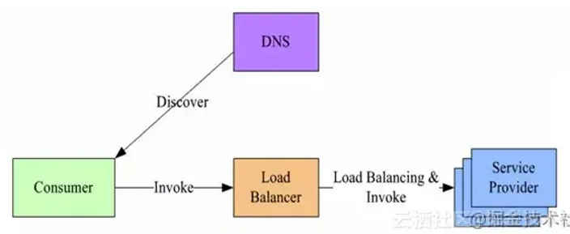
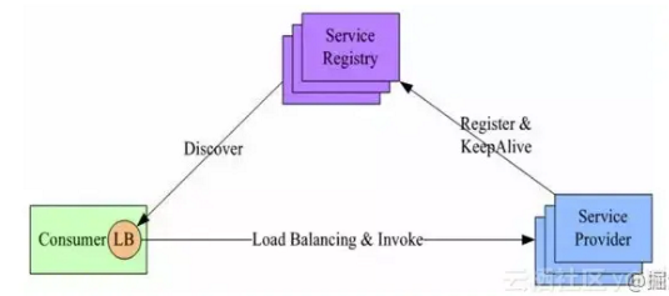
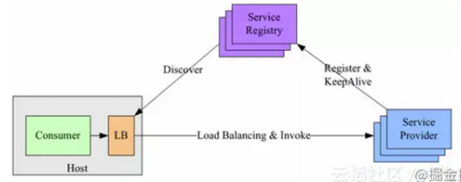
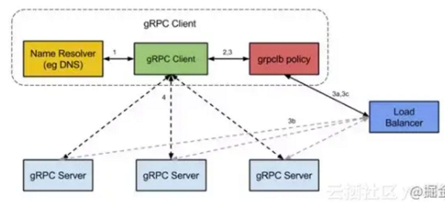

# 1. 什么是RPC

**核心回答：** RPC（Remote Procedure Call，远程过程调用），它是一种通过网络从远程计算机程序上请求服务，而不需要了解底层网络技术的协议。也就是说，有两台服务器 A、B，一个应用部署在 A 服务器上，想要调用 B 服务器上应用提供的方法。由于不在同一个内存空间，不能直接调用，需要通过网络来表达调用的语义和传达调用的数据。

**补充说明：**

- RPC 协议假定某些传输协议的存在，如 TCP 或 UDP，为通信程序之间携带信息数据
- 在 OSI 网络通信模型中，RPC 跨越了传输层和应用层
- RPC 使得开发包括网络分布式多程序在内的应用程序更加容易
- 现在业界有很多开源的优秀 RPC 框架，例如 Spring Cloud、Dubbo、Thrift、gRPC 等

# 2. RPC工作原理

**核心回答：** RPC 的设计由 **Client、Client stub、Network、Server stub、Server** 五个部分组成：

- **Client**：服务的调用方，用来发起服务调用
- **Client stub**：把调用的方法和参数序列化（因为要在网络中传输，必须把对象转变成字节）
- **Network**：将序列化后的信息传输到 Server stub
- **Server stub**：把这些信息反序列化
- **Server**：服务的提供者，最终调用的就是 Server 提供的方法

**调用流程：**

1. Client 像调用本地服务似的调用远程服务
2. Client stub 接收到调用后，将方法、参数序列化
3. 客户端通过 sockets 将消息发送到服务端
4. Server stub 收到消息后进行解码（将消息对象反序列化）
5. Server stub 根据解码结果调用本地的服务
6. 本地服务执行（对于服务端来说是本地执行），并将结果返回给 Server stub
7. Server stub 将返回结果打包成消息（将结果消息对象序列化）
8. 服务端通过 sockets 将消息发送到客户端
9. Client stub 接收到结果消息，并进行解码（将结果消息反序列化）
10. 客户端得到最终结果

**同步调用与异步调用：**

- **同步调用**：客户方等待调用执行完成并返回结果
- **异步调用**：客户方调用后不用等待执行结果返回，但依然可以通过回调通知等方式获取返回结果；若客户方不关心调用返回结果，则变成**单向异步调用**，单向调用不用返回结果
- 异步和同步的区分在于：**是否等待服务端执行完成并返回结果**

# 3. 如何实现RPC调用

**核心回答：** user（client 端）想发起一个远程调用时，实际是通过**本地调用 user-stub** 来完成的，user-stub 负责编解码，真正的调用通过 RPC 框架转发到远端执行。

**调用过程：**

1. user（client 端）想发起一个远程调用时，实际是通过本地调用 user-stub
2. user-stub 负责将调用的接口、方法和参数通过约定的协议规范进行编码
3. 通过本地的 RPCRuntime 实例传输到远端的实例
4. 远端 RPCRuntime 实例收到请求后，交给 server-stub 进行解码
5. server-stub 解码后发起本地端调用，调用结果再返回给 user 端

**RPC 框架的核心组件：**

- **RpcServer / RpcClient（导出与引入）**：服务方通过 RpcServer 去导出（export）远程接口方法，客户方通过 RpcClient 去引入（import）远程接口方法
- **RpcProxy（代理）**：客户方像调用本地方法一样去调用远程接口方法，RPC 框架提供接口的代理实现，实际的调用将委托给代理 RpcProxy
- **RpcInvoker（执行者）**：代理封装调用信息，并将调用转交给 RpcInvoker 去实际执行
- **RpcConnector / RpcChannel（连接器 / 通道）**：在客户端的 RpcInvoker 通过连接器 RpcConnector 去维持与服务端的通道 RpcChannel，并使用 RpcProtocol 执行协议编码（encode），将编码后的请求消息通过通道发送给服务方
- **RpcAcceptor / RpcProcessor（接收器 / 处理器）**：RPC 服务端接收器 RpcAcceptor 接收客户端的调用请求，同样使用 RpcProtocol 执行协议解码（decode）；解码后的调用信息传递给 RpcProcessor 去控制处理调用过程，最后再委托调用给 RpcInvoker 去实际执行并返回调用结果

# 4. 服务注册发现

**核心回答：** 在分布式系统中，服务调用方要发起远程调用，首先需要知道服务提供方的地址，这就引入了**服务注册与发现**机制：

- **服务注册**：服务提供方启动时，把接口、IP 等元数据注册到注册中心
- **服务发现**：服务调用方启动时，从注册中心查找并订阅服务提供方的地址
- 注册中心还要能感知服务的上下线，常见实现有 zookeeper、eureka、consul、etcd 等

**以 dubbo 为例的服务引用过程：**

- 解析 `<dubbo:reference/>` 时会实例化 ReferenceBean 对象，实例对象后同样会调用 afterPropertiesSet 方法，最终会调用 RegistryProtocol 的 doRefer() 方法
- 通过该方法连接到注册中心，获取所有可用的 Provider，再根据负载均衡策略选取一个 Provider 进行调用

**服务注册：**

- 在服务提供方启动的时候，将对外暴露的接口注册到注册中心内，注册中心将这个服务节点的 IP 和接口等连接信息保存下来
- 为了检测服务端的有效状态，一般会建立**双向心跳机制**
- 服务提供者注册到注册中心的元数据包含：服务名、监听地址、监听协议、权重、吞吐率等

**服务订阅：**

- 在服务调用方启动的时候，客户端去注册中心查找并订阅服务提供方的 IP，然后缓存到本地，并用于后续的远程调用
- 如果注册中心信息发生变化，一般会采用**推送**的方式做更新
- 获取元数据可以有两种实现方式：**pull**（自己去注册中心取）、**push**（注册中心主动告诉我）

**常见的注册中心：**

- 目前主要的注册中心可以借助 zookeeper、eureka、consul、etcd 等开源框架实现
- 互联网公司也会因为自身业务的特性自研，如美团点评自研的 MNS、新浪微博自研的 vintage

**如何判断机器是否可用：**

- **传统方式**：通过 Ping 某个主机来实现，Ping 得通说明对方是可用的，相反是不可用的
- **ZK 方式**：让所有的机器都注册一个临时节点，判断一个机器是否可用，只需要判断这个节点在 ZK 中是否存在，不需要直接去连接需要检查的机器，降低了系统的复杂度

**服务发现主要涵盖两个方面：**

- 客户端获取服务元数据
- 自动剔除失效的服务（感知服务的下线）

**感知服务的下线：**

服务上线时自然要注册到注册中心，但下线时也得从注册中心中摘除。注册是一个主动的行为，这没有特别要注意的地方，但服务下线却是一个值得思考的问题。服务下线包含了**主动下线**和**系统宕机等异常方式的下线**，感知下线常见有两种方案：

1. **临时节点 + 长连接（zookeeper）**：
   - zookeeper 中存在持久化节点和临时节点的概念：持久化节点一经创建，只要不主动删除，便会一直持久化存在；临时节点的生命周期则是和客户端的连接同生共死的
   - 应用连接到 zookeeper 时创建一个临时节点，使用长连接维持会话，这样无论何种方式服务发生下线，zookeeper 都可以感知到，进而删除临时节点
   - zookeeper 的这一特性和服务下线的需求契合得比较好，所以临时节点被广泛应用

2. **主动下线 + 心跳检测（eureka）**：
   - 并不是所有注册中心都有临时节点的概念，另外一种感知服务下线的方式是主动下线
   - 在 eureka 中，会有 eureka-server 和 eureka-client 两个角色，其中 eureka-server 保存注册信息，地位等同于 zookeeper；当 eureka-client 需要关闭时，会发送一个通知给 eureka-server，从而让 eureka-server 摘除自己这个节点
   - 问题：如果仅仅只有主动下线这一个手段，一旦 eureka-client 非正常下线（如断电、断网），eureka-server 便会一直存在一个已经下线的服务节点，一旦被其他服务发现进而调用，便会带来问题
   - 解决：给 eureka-server 增加一个**心跳检测**功能，它会对服务提供者进行探测，比如每隔 30s 发送一个心跳，如果三次心跳结果都没有返回值，就认为该服务已下线

**注册中心的最终一致性（AP 方案）：**

- 可以牺牲 CP（强制一致性），而选择 AP（最终一致性）
- 要求最终一致性，我们可以考虑采用**消息总线机制**：注册数据可以全量缓存在每个注册中心内存中，通过消息总线来同步数据
- 消息总线的流程：
  1. 当有服务上线，注册中心节点收到注册请求，服务列表数据发生变化，会生成一个消息，推送给消息总线，每个消息都有整体递增的版本
  2. 消息总线会主动推送消息到各个注册中心，同时注册中心也会定时拉取消息
  3. 对于获取到的消息，在消息回放模块里面回放，只接受大于本地版本号的消息，小于本地版本号的消息直接丢弃，从而实现最终一致性
  4. 消费者订阅可以从注册中心内存拿到指定接口的全部服务实例，并缓存到消费者的内存里面
  5. 采用推拉模式，消费者可以及时地拿到服务实例增量变化情况，并和内存中的缓存数据进行合并

# 5. 负载均衡

**核心回答：** 一个服务通常会部署多个实例，**负载均衡**就是如何从多个服务 Provider 组成的集群中挑选出一个进行调用的策略。另外，为减少上线风险，会选择**灰度发布**的方式发布应用实例，比如可以先发布部分实例观察是否存在异常，后续再根据使用的情况，选择发布更多实例或是回滚已经上线的实例。

**负载均衡策略（以 Dubbo 为例）：**

1. **Random LoadBalance（随机）**：
   - 随机，按权重设置随机概率
   - 在一个截面上碰撞的概率高，但调用量越大分布越均匀，而且按概率使用权重后也比较均匀，有利于动态调整提供者权重
2. **RoundRobin LoadBalance（轮询）**：
   - 轮询，按公约后的权重设置轮询比率
   - 存在慢的提供者累积请求的问题：比如第二台机器很慢，但没挂，当请求调到第二台时就卡在那，久而久之，所有请求都卡在调到第二台上
3. **LeastActive LoadBalance（最少活跃调用数）**：
   - 最少活跃调用数，相同活跃数的随机，活跃数指调用前后计数差
   - 使慢的提供者收到更少请求，因为越慢的提供者的调用前后计数差会越大
4. **ConsistentHash LoadBalance（一致性 Hash）**：
   - 一致性 Hash，相同参数的请求总是发到同一提供者
   - 当某一台提供者挂掉时，原本发往该提供者的请求，基于虚拟节点平摊到其它提供者，不会引起剧烈变动
   - 缺省只对第一个参数 Hash，如果要修改，请配置 `<dubbo:parameter key="hash.arguments" value="0,1" />`
   - 缺省用 160 份虚拟节点，如果要修改，请配置 `<dubbo:parameter key="hash.nodes" value="320" />`

**负载均衡的分类：**

1. **按作用范围分**：服务端负载均衡和客户端负载均衡。服务端负载均衡又按照实现方式的不同可以划分为软件负载均衡和硬件负载均衡，nginx 便是典型的软件负载均衡
2. **按 OSI 层级分**：
   - **二层负载均衡（MAC）**：根据 OSI 模型分的二层负载，一般是用虚拟 MAC 地址方式，外部对虚拟 MAC 地址请求，负载均衡接收后分配后端实际的 MAC 地址响应
   - **三层负载均衡（IP）**：一般采用虚拟 IP 地址方式，外部对虚拟 IP 地址请求，负载均衡接收后分配后端实际的 IP 地址响应（即一个 IP 对一个 IP 的转发，端口全放开）
   - **四层负载均衡（TCP）**：在三层负载均衡的基础上，即从第四层"传输层"开始，使用"IP + 端口"接收请求，再转发到对应的机器
   - **七层负载均衡（HTTP）**：从第七层"应用层"开始，根据虚拟的 URL 或 IP、主机名接收请求，再转向相应的处理服务器

**RPC 的负载均衡为什么不用硬件负载均衡或四层代理：**

- 搭建负载均衡设备或 TCP/IP 四层代理，需要额外成本
- 请求流量都经过负载均衡设备，多经过一次网络传输，会额外浪费一些性能
- 负载均衡添加节点和摘除节点一般都要手动添加，当大批量扩容和下线时，会有大量的人工操作，"服务发现"在操作上是个问题
- 在服务治理的时候，针对不同接口服务、服务的不同分组，负载均衡策略是需要可配的，如果大家都经过这一个负载均衡设备，就不容易根据不同的场景来配置不同的负载均衡策略了

**负载均衡的实现方式：**

负载均衡的实现方式主要有两类：**代理模型（集中式 LB / 服务端负载均衡）**和**客户端负载均衡**；其中客户端负载均衡又有两种具体实现：**进程内 LB（Balancing-aware Client）**和**独立 LB 进程（External Load Balancing Service）**。

1. **代理模型（集中式 LB / 服务端负载均衡）**：
   - **原理**：客户端并不知道服务端的存在，它所有的请求都打到代理服务，由代理服务去分发到服务端，并且实现公平的负载算法。客户机可能不可信，这种情况通过用户面向用户的服务，类似于 nginx 将请求分发到后端机器
   
   
   
   - **缺点**：客户端不知道后端的存在，且客户端不可信，此模型还会增加 RPC 的延迟，而且代理服务会影响服务本身的吞吐量
   - **优点**：客户端不需要过多的改造，在中间层做监控等拦截操作非常容易
   - **实现方式（L3/L4 与 L7）**：代理负载均衡可以是 L3/L4（传输级别）或 L7（应用程序级别）：
     - 在 L3/L4 中，服务器终止 TCP 连接并打开另一个连接到所选的后端
     - L7 只是在客户端连接到服务端连接之间搞一个应用来做中间人
     - L3/L4 级别的负载均衡按设计只做很少的处理，与 L7 级别的负载均衡相比延迟会更少，而且更便宜，因为它消耗更少的资源
     - 在 L7（应用程序级）负载均衡中，负载均衡服务终止并解析协议，可以检查每个请求并根据请求内容分配后端，这就意味着监控、拦截等操作可以非常方便快捷地做在这里
   - **L3/L4 vs L7 的选择**：
     1. 这些连接之间的 RPC 负载变化很大：建议使用 L7
     2. 存储或计算相关性很重要：建议使用 L7，并使用 cookie 或类似的路由请求来纠正服务端
     3. 设备资源少（缺钱）：建议使用 L3/L4
     4. 对延迟要求很严格（就是要快）：L3/L4
   
   
   
   - **集中式 LB 举例**：在服务消费者和服务提供者之间有一个独立的 LB，通常是专门的硬件设备如 F5，或者基于软件如 LVS、HAproxy 等实现。LB 上有所有服务的地址映射表，通常由运维配置注册。当服务消费方调用某个目标服务时，它向 LB 发起请求，由 LB 以某种策略（比如轮询 Round-Robin）做负载均衡后将请求转发到目标服务。LB 一般具备健康检查能力，能自动摘除不健康的服务实例
   - **集中式 LB 的主要问题**：
     1. 单点问题：所有服务调用流量都经过 LB，当服务数量和调用量大的时候，LB 容易成为瓶颈，且一旦 LB 发生故障就会影响整个系统
     2. 服务消费方、提供方之间增加了一级，有一定性能开销

2. **客户端负载均衡——进程内 LB（Balancing-aware Client）**：
   - **原理**：客户端知道有多个后端服务，由客户端去选择服务端。这种"较重的客户端"把更多的负载均衡逻辑放在客户端中，例如可以包含许多用于从列表中选择服务器的负载均衡策略（轮询、随机等），还要负责跟踪可用的服务器；客户端通常还需要集成其他基础设施，如服务发现、名称解析、配额管理等
   - **服务器列表的来源**：在此模型中，服务器列表可以在客户端中静态配置，也可以由名称解析系统提供、由外部负载均衡器等提供；在任何情况下，客户端都负责从列表中选择首选服务器
   - **优点**：高性能，因为消除了第三方的交互
   - **缺点**：会使客户端的代码大大复杂化：客户端需要跟踪服务器负载和健康情况，维护负载均衡策略（这些策略可能相当复杂）；有些时候还需要以多种语言实现和维护负载均衡策略，而且客户端需要被信任是靠谱的客户端
   
   
   
   - **实现方式**：针对代理模型的不足，此方案将 LB 的功能集成到服务消费方进程里，也被称为软负载或者客户端负载方案。服务提供方启动时，首先将服务地址注册到服务注册表，同时定期报心跳到服务注册表以表明服务的存活状态（相当于健康检查）；服务消费方要访问某个服务时，它通过内置的 LB 组件向服务注册表查询，同时缓存并定期刷新目标服务地址列表，然后以某种负载均衡策略选择一个目标服务地址，最后向目标服务发起请求。LB 和服务发现能力被分散到每一个服务消费者的进程内部，同时服务消费方和服务提供方之间是直接调用，没有额外开销，性能比较好
   - **主要问题**：
     1. 开发成本：该方案将服务调用方集成到客户端的进程里头，如果有多种不同的语言栈，就要配合开发多种不同的客户端，有一定的研发和维护成本
     2. 升级复杂：生产环境中，后续如果要对客户库进行升级，势必要求服务调用方修改代码并重新发布，升级较复杂

3. **客户端负载均衡——独立 LB 进程（External Load Balancing Service）**：
   
   
   
   - **原理**：该方案是针对进程内 LB 的不足而提出的一种折中方案，原理和进程内 LB 方案基本类似。不同之处是将 LB 和服务发现功能从进程内移出来，变成主机上的一个独立进程。主机上的一个或者多个服务要访问目标服务时，他们都通过同一主机上的独立 LB 进程做服务发现和负载均衡
   - **优点**：该方案也是一种分布式方案，没有单点问题：一个 LB 进程挂了只影响该主机上的服务调用方；服务调用方和 LB 之间是进程内调用，性能好；同时该方案还简化了服务调用方，不需要为不同语言开发客户库，LB 的升级不需要服务调用方改代码
   - **主要问题**：部署较复杂，环节多，出错调试排查问题不方便

**RPC 框架的负载均衡实现示例：**

1. **gRPC 服务发现及负载均衡实现**：
   
   
   
   - **基本实现原理**：
     1. 服务启动后，gRPC 客户端向命名服务器发出名称解析请求，名称将解析为一个或多个 IP 地址，每个 IP 地址标示它是服务器地址还是负载均衡器地址，以及标示要使用哪个客户端负载均衡策略或服务配置
     2. 客户端实例化负载均衡策略：如果解析返回的地址是负载均衡器地址，则客户端将使用 grpclb 策略，否则客户端使用服务配置请求的负载均衡策略
     3. 负载均衡策略为每个服务器地址创建一个子通道（channel）
     4. 当有 RPC 请求时，负载均衡策略决定哪个子通道（即 gRPC 服务器）将接收请求，当可用服务器为空时客户端的请求将被阻塞
   - **结合服务发现组件**：根据 gRPC 官方提供的设计思路，基于进程内 LB 方案（即上面第 2 种方案，阿里开源的服务框架 Dubbo 也是采用类似机制），结合分布式一致组件（如 Zookeeper、Consul、Etcd），可找到 gRPC 服务发现和负载均衡的可行解决方案

2. **Dubbo 服务发现**：
   - 服务订阅通常有 pull 和 push 两种方式：pull 模式需要客户端定时向注册中心拉取配置，而 push 模式采用注册中心主动推送数据给客户端
   - dubbo zk 注册中心采用的是事件通知与客户端拉取方式：服务第一次订阅的时候将会拉取对应目录下全量数据，然后在订阅的节点注册一个 watcher；一旦目录节点下发生任何数据变化，zk 将会通过 watcher 通知客户端；客户端接到通知后，将会重新拉取该目录下全量数据，并重新注册 watcher。利用这个模式，dubbo 服务就可以做到服务的动态发现
