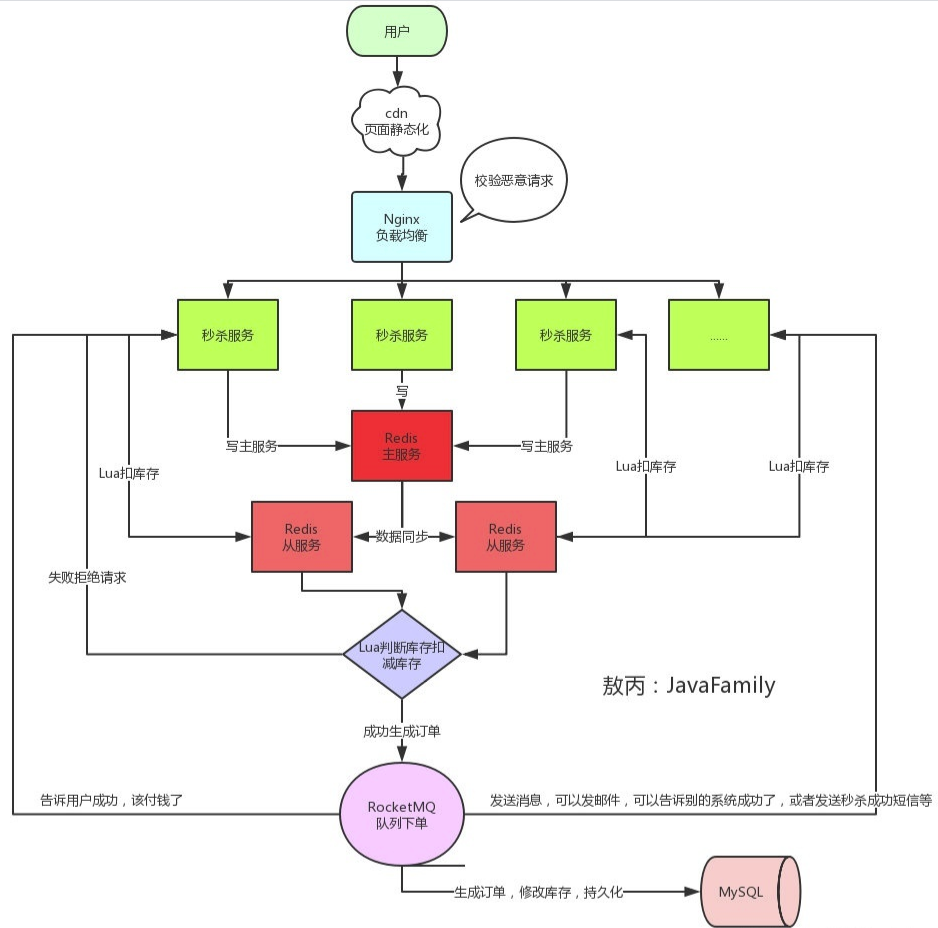
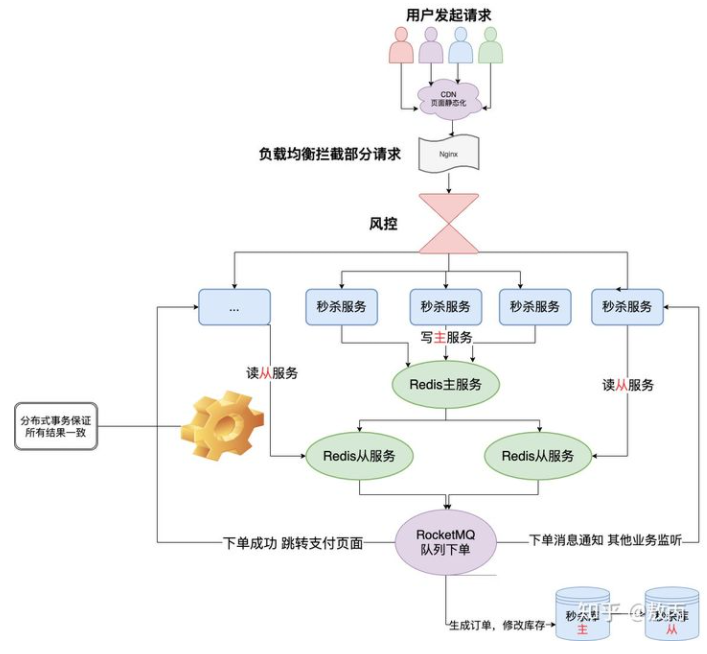

## 1. 秒杀场景主要面临哪些问题？

- **高并发**：时间极短、瞬间用户量大，大量请求直接涌入可能导致缓存雪崩、击穿、穿透，DB 可能直接挂掉
- **超卖**：选择强化 CAP 中的 A、P，在某种程度上弱化 C，数据弱一致性导致超卖；但本质不是 CAP 的问题，**容量、并发、扩展性都不是牺牲一致性的理由，成本与收益的权衡才是**
- **恶意请求**：黑客、黄牛用多台机器、脚本模拟大量请求提高抢购成功率
- **链接暴露**：黑客查看页面请求地址，或内部开发知道地址提前抢购

## 2. 秒杀系统的核心设计思路是什么？

**核心思路：在保证业务逻辑不变的前提下，把 100 台服务器都扛不住的问题，简化为 1 台服务器都能轻松扛住的问题。** 秒杀不是要服务所有人，而是"雇几十个业务员搬出抽奖箱，让所有人抽奖——拿到奖券的才有资格继续购买流程"。

**确保足够的算力把大多数请求挡回去就够了**，不应该把无效请求漏到后方对服务器造成冲击。绝大多数事务会被挡回去，返回"您没有资格参与"。仅仅挡回去而已，不需要事务支持也不需要数据一致。

**大企业不允许在前端或 DNS 丢弃请求，必须在服务器处理**，因为涉及日志审计、记录用户行为、大数据分析等。

## 3. 秒杀系统的整体架构如何设计？

- **业务隔离**：秒杀服务器与网站其他服务器完全隔离，防止流量过大带着其他服务一起挂，配置高的服务器都用于秒杀
- **CDN/反向代理**：最前端页面被 CDN 或反向代理缓存
- **限流**：服务器只能承受一定流量（如 10W），高于阈值直接返回失败
- **降级**：秒杀页面并发高到一定程度时，断开某些接口查询（推荐、相似物品、历史价格等），减少服务器返回时间
- **熔断**：某些接口大于流量或并发峰值直接返回失败，或返回默认数据（如某些产品一直有货）
- **负载均衡**：分发到 Web 服务器
- **队列**：Web 服务器进入队列，通过队列筛选、控制队列数量减少系统开销
- **统一缓存计数器**：Redis 中有一份库存，抢的逻辑只抢 Redis，利用原子特性保证同时只有一个线程操作库存
- **异步处理**：秒杀结束后，通过日志 + Worker 计算剩余库存，使用 MQ 推送下单信息至各系统（订单、库存、发货等），最终写入数据库
- **最终一致性**：不要求数据库中与前台库存实时一致，**只要保证最终落表的数据正确即可**

## 4. 库存数据如何管理？

- **写入 Redis 的时机**：秒杀活动创建/维护时写入 Redis
- **扣减策略**：下单锁定库存，支付减库存
- **下单锁库存的问题**：超时订单需要释放库存
- **付款减库存的问题**：下单数量可能超过库存总数导致超卖
- **库存写入数据库**：定时任务同步 Redis 数据写回数据库

## 5. 下单减库存和支付减库存各有什么优缺点？

- **付款减库存**（如某猫超市）：
  - 优点：防止吊单不付款，即使有大量未付款订单也不影响库存，有十个人付款后商品下架
  - 缺点：付款慢的用户订单失败需重新下单，容易失去秒杀商品，用户体验较差

- **下单减库存**（如某号店、某牛网）：
  - 优点：用户体验好，下单即锁定商品
  - 缺点：大批用户下单不付款，商品提前下架，商家一件都没卖出去

**超卖问题取决于什么时候减库存**，如果是下单之前减库存，且始终从库存中心的 DB 减库存，超卖基本不会出现。

## 6. 如何防止商品被超卖？

- **缓存原子操作**：把库存数据放入缓存中，利用缓存的原子特性保证同时只有一个线程操作库存
- **预留库存**：当库存数量低于定义的预留值，直接返回前端库存扣减完毕，避免超卖
- **下单前扣减**：下单前减库存，且始终从一个系统（库存中心 DB）减库存，超卖基本不会出现
- **最终一致性兜底**：通过秒杀日志 + Worker 异步落表，保证最终数据正确

## 7. 秒杀系统如何进行限流？

限制手段包括：

- **队列筛选**：无论什么方案，最终都是用队列来筛选，同时控制队列数量减少系统开销。以 12306 为例，以前是同步抢票，现在改成队列，点进去就排队，隔离了并发与业务
- **令牌桶限流**
- **在中间件前面限制流量**，保证打到缓存数据库的流量不会造成雪崩
- **业务隔离**、降级、熔断配合使用

## 8. 为什么秒杀系统要用队列？

大批并发进来，不能全部放进去加锁处理，**瞬时百万写请求 Redis 都扛不住，何况 MySQL**。队列的作用：

- 隔离并发与业务处理
- 只有排进队的请求才进入业务处理层
- 控制队列长度，超出的直接挡回

## 9. 防止超卖的设计细节有哪些？

- Redis 原子扣减保证单线程操作库存
- 下单锁定库存，支付时真正扣减
- 预留库存水位，低于水位直接返回售罄
- 秒杀日志 + Worker 异步计算，MQ 推送至各系统落库，最终保证数据正确
- **容量、并发、扩展性都不是牺牲一致性的理由，成本与收益的权衡才是**
