## 1. 什么是Feed流？主要有哪些类型？

Feed流指大拇指不断下滑手机屏幕，信息不断涌现的浏览方式。大多数Feed流产品包含两种类型：

- **基于算法**：动态推荐（如今日头条、抖音短视频）
- **基于关注**：社交/好友关系（如微信朋友圈、知乎关注页），通常按时间线排序

## 2. 读扩散（拉模式）的原理、优缺点和适用场景？

**原理**：每个发布者有发件箱（我发布的内容）。粉丝读Feed流时，系统拿到粉丝关注的所有人，遍历他们的发件箱取出帖子，再按发布时间排序展示。

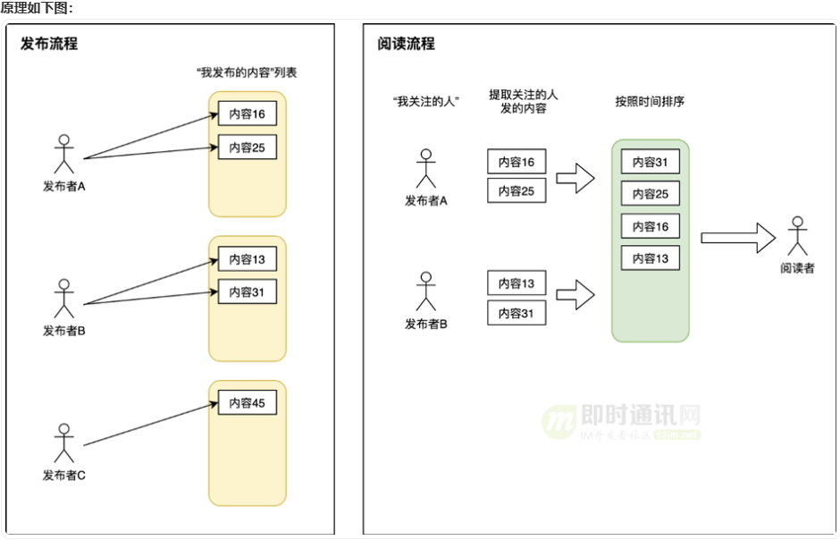

每次读操作扩散为N次读操作（N=关注人数）+ 一次聚合操作，称为**读扩散**。

**优点**：底层存储简单，无空间浪费。

**缺点**：
- 每次读操作非常重，关注人多时开销极大
- 分页不方便，实时聚合方式下滑到靠后页码很麻烦

**适用场景**：关注人数少且刷Feed流不频繁的场景。

## 3. 写扩散（推模式）的原理、优缺点和适用场景？

**背景**：大多数Feed流产品读写比约**100:1**，刷Feed流的请求远多于发布请求，读扩散不适合大多数场景。

**原理**：每个用户有发件箱和收件箱。发布者发帖时，除写入自己发件箱外，还遍历所有粉丝，往粉丝收件箱投放一份相同内容。阅读者直接从自己收件箱读取即可。

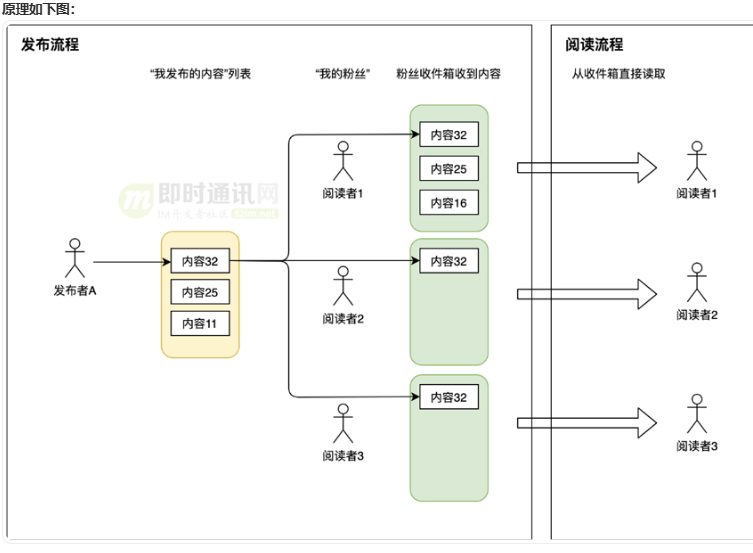

每次发帖扩散为M次写操作（M=粉丝数），称为**写扩散**。

**优点**：通过数据冗余（一篇帖子存储M份副本），提升阅读者体验，读操作极轻。

**缺点**：
- 发帖背后涉及大量写操作，粉丝量极大时不可行
- 异步投递可能导致粉丝延迟看到内容

**适用场景**：好友量不大的场景。微信朋友圈即写扩散模式，好友上限**5000人**，发一条朋友圈最多扩散到5000次写操作，异步任务性能好时完全无问题。

## 4. 读写混合（推拉结合）模式的原理和场景？

综合读扩散与写扩散的优点，区分场景动态调整策略。

**原理**：
- 粉丝量超大（大V）发帖时：写入自己发件箱，只推送给**活跃粉丝**的收件箱
- 粉丝量小的普通用户发帖时：采用写扩散方式
- 活跃用户登录时：直接从收件箱读取
- 非活跃用户登录时：读收件箱 + 遍历所关注大V的发件箱聚合展示，展示完后判断是否有必要升级为活跃用户

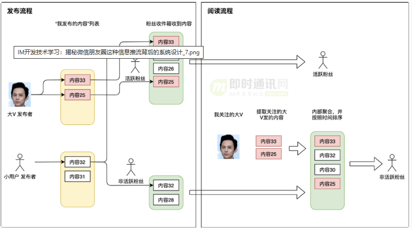

**优缺点对比**：

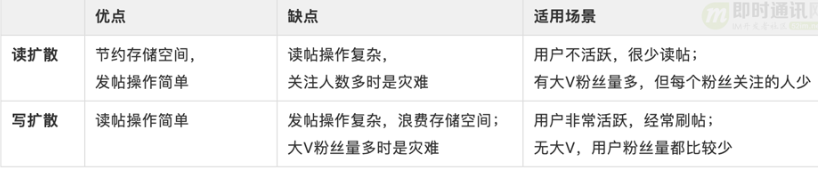

**缺点**：系统机制非常复杂，项目初期用户规模较小时不建议一步到位采用此模式。

**关键设计判断**：
- 哪些用户属于大V → 粉丝量作为指标
- 哪些用户属于活跃粉丝 → 最近登录时间等

即使混合模式，每个阅读者关注人数也要设上限（如微博限**2000人**），否则全站关注者的读扩散场景会压垮系统。

## 5. Feed流分页有什么问题？如何解决？

**问题**：Feed流是动态列表，内容随时间变化。使用传统 `page_size + page_num` 分页，两页之间如果有新增或删除内容，会导致错位（同一内容在两页重复出现或遗漏）。

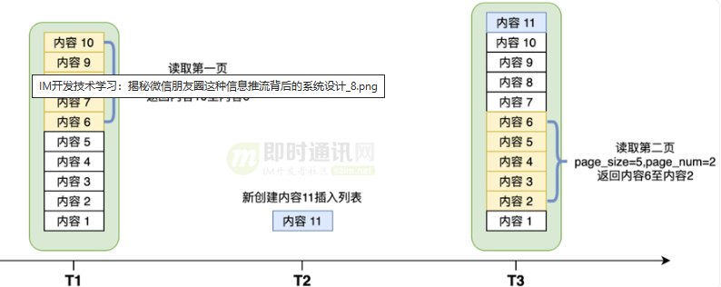

**解决方案**：使用 `last_id`（上一页最后一条内容ID）代替 `page_num`。前端读取下一页时传入 `last_id`，后台找到该数据后偏移 `page_size` 条返回。

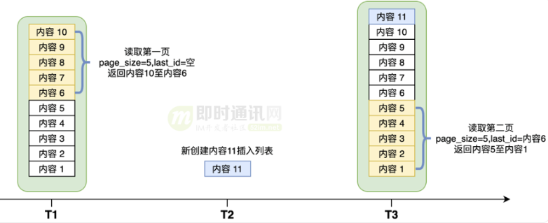

**关键条件**：`last_id` 对应数据不可被**硬删除**，否则无法确认偏移量。应采用**软删除**方式（置标志位）。

软删除问题：找到 `last_id` 偏移后如果有被删数据，可能凑不足 `page_size` 条。解决：继续往下找，或与前端约定允许返回少于 `page_size` 条。

## 6. 直播场景中状态变化的Feed流如何设计？

以某直播工具为例，直播场次有三种状态：**预告中**、**直播中**、**回放**。排序规则：

- 正在直播中的场次排最前，预告中排中间，回放排最后
- 同状态下按时间排序

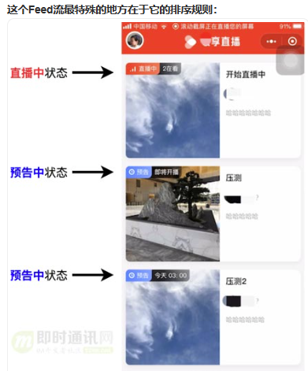

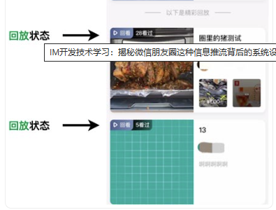

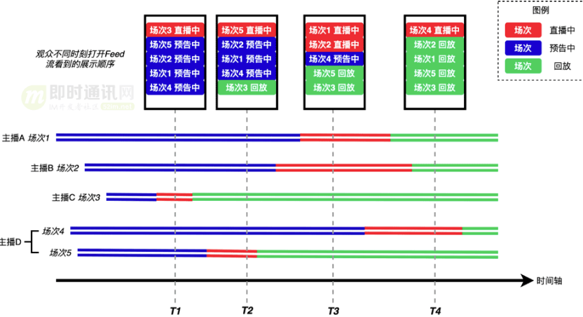

例如T1时刻打开页面，场次3在最上方，其余场次预告中按预计开播时间排序；T2时刻场次5开播变为最上方，场次3结束后排到最后。如果T1拉取第一页后盯着页面直到T4再拉第二页，last_id对应的内容可能因状态变化而错位。

**难点**：状态转变导致Feed流顺序动态变化，写扩散无法实现（每次状态变化扩散为海量写操作）。微博可以写扩散是因为微博发出后不再有影响排序的状态转变。

**方案**：
- **预告中和直播中**：采用**读扩散**方式
- **回放**：采用**写扩散**方式（进入回放后不再有状态转变）

**实现**：三种事件（创建直播、开播、结束直播）全部通过监听队列异步处理。

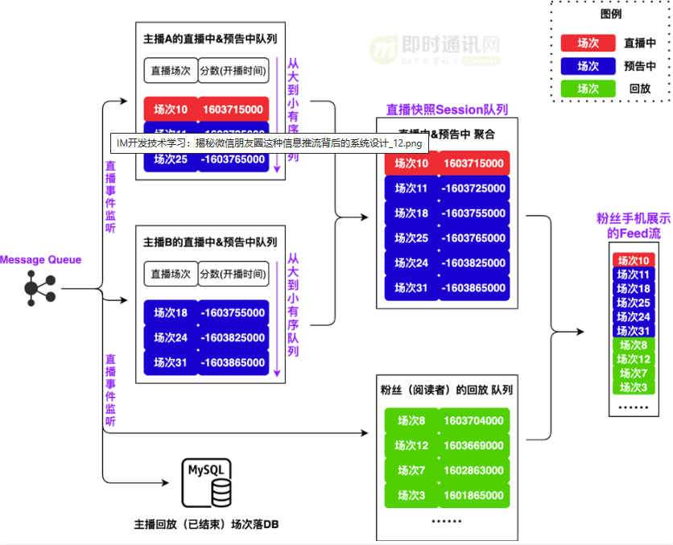

为每个主播维护一个**直播中+预告中**的优先级队列：
- 创建直播 → 加入队列，得分为开播时间戳的相反数（负数为预告状态）
- 开播 → 修改得分为开播时间戳（正数为直播中状态）
- 结束直播 → 异步投递回放到每个观众的收件箱

**小技巧**：预告中按开播时间从小到大排序，得分为负后排序规则统一为从大到小。聚合时负分（预告）排正分（直播中）之后。

## 7. 直播间状态不一致问题如何通过快照解决？

T1拉取第一页，T4拉取第二页时，直播状态可能已变化，导致两页状态展示不统一。

**解决方案**：采用**快照**方式。用户拉取第一页Feed流时，依据当前时间将所有直播中和预告中场次建立快照，用 `session_id` 标识。后续分页从快照读取，快照读完后用回放队列补充。

前端分页参数共4个：

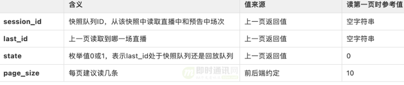

`session_id` 为空时表示用户拉取第一页，需重新构建快照。

**session_id 取值策略**：
- 不考虑多端登录 → 直接用系统用户ID
- 考虑多端登录 → session_id 包含端信息
- 不心疼内存 → 随机字符串 + 足够长的过期时间

## 8. 直播Feed流设计的性能如何？

系统计算量最大时刻是拉取第一页构建快照。线上数据：关注**不到10个主播**的观众（绝大多数场景），拉取第一页QPS可达**1.5万**，综合QPS更高。优化方向：拉取第一页时只获取前10条直接返回，将构建快照改为异步。

## 9. 几乎所有基于时间线和关注关系的Feed流都离不开哪三种基本设计模式？

1. **读扩散（拉模式）**
2. **写扩散（推模式）**
3. **读写混合（推拉结合模式）**

具体到实际业务中，可能会有状态流转影响排序、广告接入、特别关注、热点话题等复杂因素，需要根据业务需求变通。
