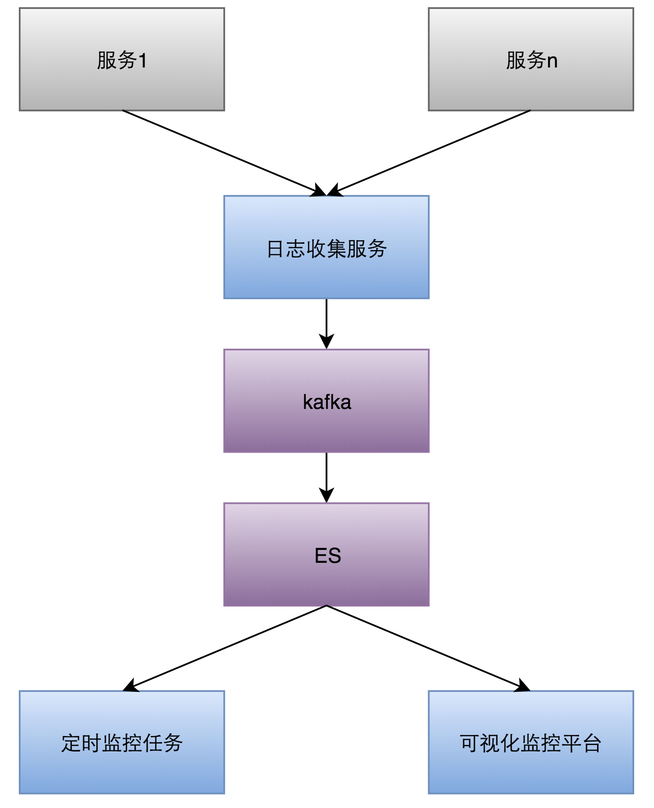
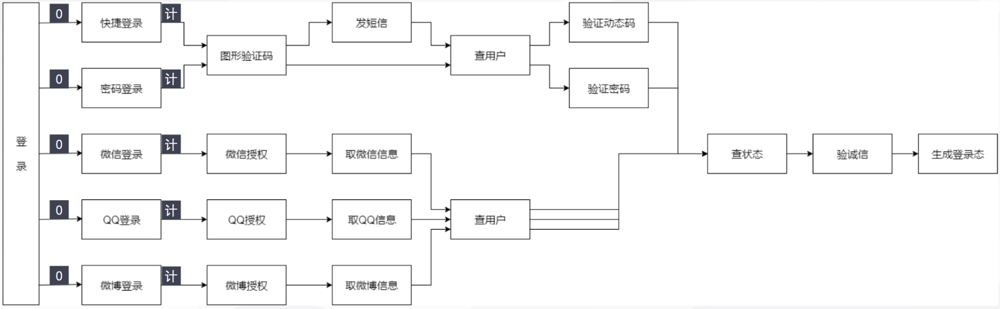
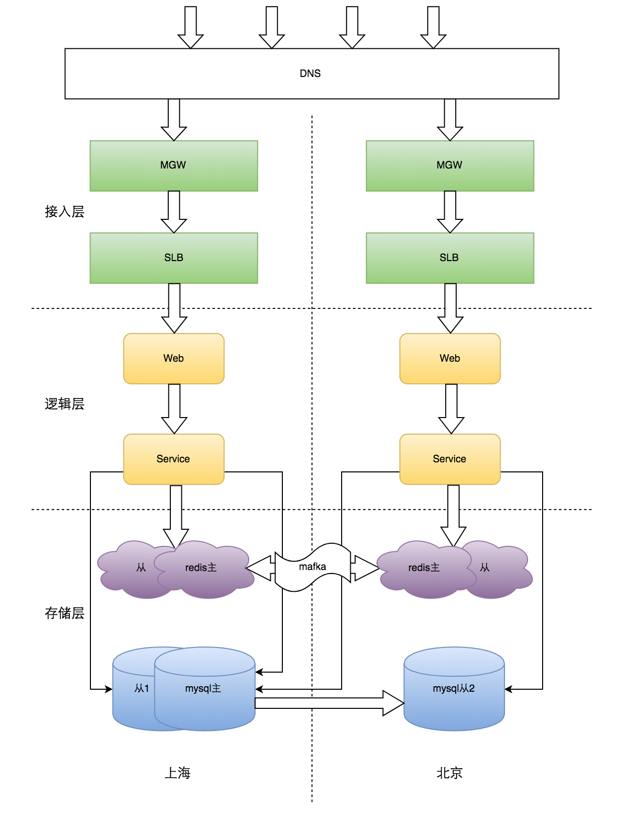
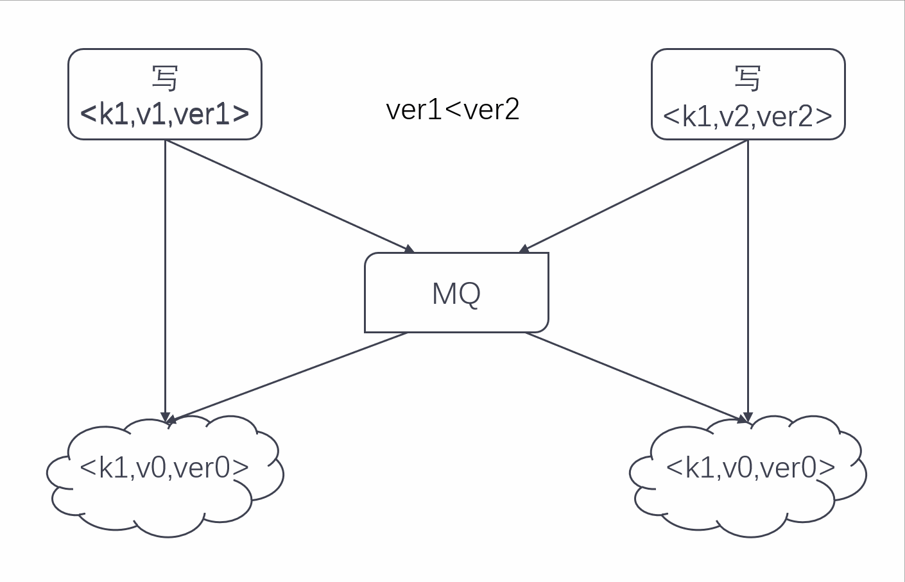
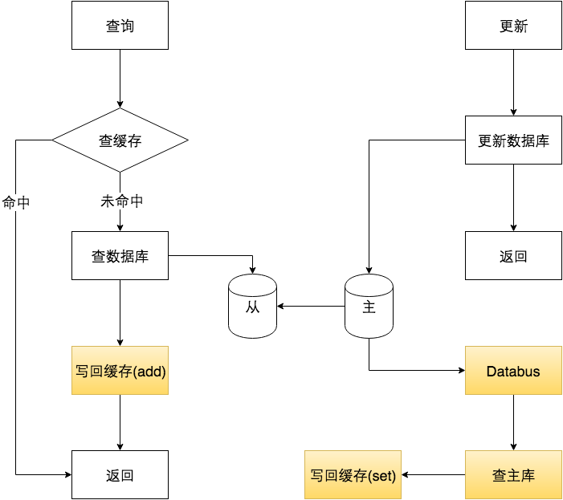
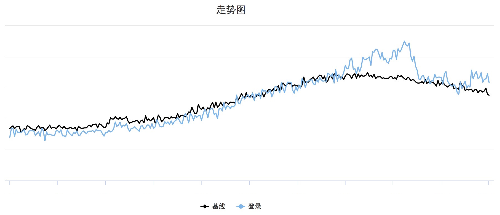
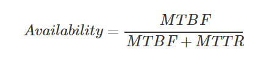
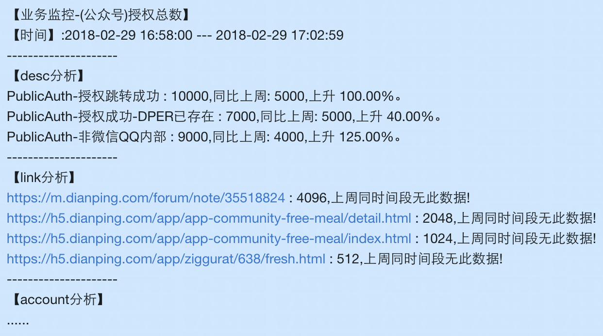

# 登录和账号系统设计

# 1. 手机号+短信验证码登录方案有哪些特征？需要注意什么问题？

**特征**：
- 短信验证码具有**时效性和随机性**，类似动态密码，避免密码被破解
- 不需要用户记忆强密码，降低复杂度，提高登录效率
- 对未注册用户**首次登录即静默注册**，简化注册流程

**注意事项**：
- 必须同时提供其他登录方式（如密码登录、第三方登录），不能仅依赖短信验证码
- 弱信号/欠费时可能出现短信高延迟或收不到；服务商问题也会导致短信延迟或发送异常
- 短信验证码服务成本高，用户规模大时是一笔可观支出
- 手机号回收存在账号安全风险，用户换号后重新绑定流程繁琐

# 2. 如何设计手机号+短信验证码登录的安全方案？

**防恶意调用（防刷）**：
- 前端发送验证码前要求输入**图形验证码**，防止自动化脚本
- 调用云服务对用户IP、时间、手机号、User-Agent等数据分析，对异常用户强制图形验证码
- 前端按钮点击后进入**倒计时状态**（如120s），倒计时内不可重复发送
- 后端限制同一手机号发送频率（如每分钟最多1次）

**防暴力破解**：
- 前端尝试一定次数后，要求输入图形验证码才能进行登录验证
- 后端Redis记录手机号+尝试次数，超过阈值后该手机号**临时锁定**，不能再进行验证码校验

**验证码安全存储**：
- 短信验证码**不能写入日志系统**，防止泄露
- 验证码存Redis，设置有效期（如5分钟），同时保留用户有效期内收到的多个验证码均有效
- 用户登录成功后，立即清除Redis中该手机号的验证码记录

**网络不畅通处理**：
- 用户可能在验证码有效期内多次请求，多个验证码在有效期内都应该能登录系统，不能后一个覆盖前一个

# 3. 如何设计一套高可用的账号系统？

从三个维度入手：**业务监控、柔性可用、异地多活**。

**1. 业务监控**（服务未动，监控先行）
- 区分系统监控与业务监控：系统监控关注CPU、内存等指标；业务监控关注**登录总数、成功数、失败分布、用户地区、App版本、浏览器类型、Referer、机房**等
- 使用**ElasticSearch**存储多维业务日志，方便按任意维度聚合分析
- 根据历史业务曲线计算**基线**，当前值超过基线阈值即触发告警
- 每条告警附带**维度分析**，直接给出失败原因，提升定位速度

**2. 柔性可用**
- 整体架构上做**服务拆分**，缩小故障影响范围
- 对下游依赖做**资源隔离**（如Hystrix/Rhino），根据最近时间窗口失败率自动熔断降级
- 对非关键路径服务故障做**自动降级**：使用备用存储（如Cellar缓存中间件作为Redis的备选）
- 对关键路径服务故障，**减少受影响用户数**：在登录入口展示降级提示，引导用户使用其他登录方式

**3. 异地多活**
- 解决跨城专线故障导致的账号服务不可用问题
- 目标：任何一地故障，另一地可提供完整服务；两地同时对外服务

# 4. 账号系统的异地多活方案如何设计？

**设计原则**：
- 北上任何一地故障，另一地可提供**完整服务**
- 两地**同时对外提供服务**，确保随时可用
- 遵循**BASE原则**，确保数据最终一致

**数据库方案**：
- 账号系统**读多写少**（读写比350:1），采用**一主多从**数据库部署方案，优先解决读多活
- 各地服务**就近读取**本地从库，写入走主库

**Redis方案**：
- 不能使用主从模式：Redis主从同步在专线抖动时会尝试全量同步，拖垮主库并阻塞专线，形成**雪崩效应**
- 采用**双主模式**，两地Redis各自可写，自行解决数据同步问题

**路由策略**：
- DNS开启**智能解析**，SLB开启**同城策略**，RPC**默认就近访问**
- 用户请求从每一层路由都就近接入

# 5. 异地多活场景下Redis双主的数据同步方案如何实现？

**同步通道**：
- 使用**MQ（Mafka，类Kafka）**作为可靠数据中转，保证数据不丢
- 对每个key做**一致性散列**映射到同一个partition，保证单key操作有序

**写冲突解决**：
- 借鉴**Raft协议**思想：设置主节点排序，冲突时以排在最前面的节点为准
- 设计**版本号**（long型整数）：高位表示数据源顺序，冲突时版本号大的覆盖小的，保证最终一致

**写并发同步过程**：两地写入各自Redis，通过MQ同步变更，携带版本号，冲突时比较版本号覆盖。

**缓存同步优化**：
- 纯缓存数据（可从DB回源）不需全量同步
- 缓存加载用`add`（不存在才添加），更新用`set`（存在则覆盖），避免脏数据
- 使用**Databus**监听DB变更日志，只同步DB变化部分，减少缓存同步开销
- 定时任务**scan两地数据**做对比统计，发现不一致及时修复

# 6. 业务监控的基线告警如何运作？

- 系统根据历史业务曲线自动计算出**基线**
- 当前数据与基线对比，**超出设定阈值**即触发告警
- 告警附带**多维分析结果**（如失败原因、地区分布、版本分布），帮助快速定位问题
- 注意：**告警频次需要控制**，过多告警会稀释警惕性。不可因告警多就关掉告警，应优化告警规则

# 7. 衡量系统可用性的指标有哪些？

两个关键指标：
- **MTBF（Mean Time Between Failure）**：平均多长时间不出故障
- **MTTR（Mean Time To Recovery）**：出故障后的平均恢复时间

系统可用性 = MTBF / (MTBF + MTTR)，即常说的"几个9"。

提升可用性的两条路径：**延长MTBF**（做冗余、异地多活）或**缩短MTTR**（完善监控、快速发现和恢复）。

# 8. 柔性可用中如何实现登录入口的自适应降级？

- 每个登录入口关联一个**计数器**，关键节点不可用时计数器+1，恢复时-1
- 每个计数器对应一个**标志位**（计数器>0时标志位=1，否则=0）
- 根据各标志位组合确定当前可用登录方式，在登录页展示不同文案
- 示例：手机快捷登录挂了，提示用户使用密码登录或第三方登录

# 9. 账号高可用设计的总结与最佳实践？

- 高可用需要**持续性投入**与维护，建议每月做一次**容灾演练**
- 高可用不仅体现在重点项目上，更体现在**日常开发**的每行代码、每个方案、每次线上改动中
- 任何小Bug都可能引发大故障，让前期努力付诸东流
- 高可用应成为**思维方式**，而非一次性工程

