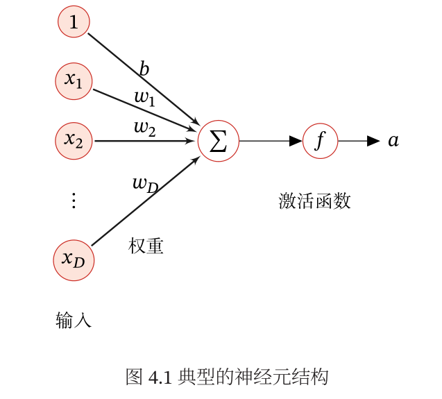

# 1. 神经元是什么

**神经元是神经网络中的基本计算单元**，概念上模拟了生物神经元。

在神经网络中，一个"神经元"就是：

```
一个神经元 = 计算单元 → 输出一个数字（标量）

它做的事情：
  1. 接收多个输入 × 对应权重 → 加权求和
  2. 加上偏置
  3. 通过激活函数输出一个数字
```

**拆开看神经元里面有什么**：

```
一个神经元本身 ≈ 一个带参数的函数 f(x) = σ(Wx + b)
  ├── 权重 W（多个数字）    ← 控制每个输入的"重要程度"
  ├── 偏置 b（一个数字）    ← 控制神经元的"激活门槛"
  └── 激活函数 σ           ← 引入非线性变换
```

**容易混淆的地方**：画图时，每个圆圈里写一个数字，很多人以为"神经元 = 那个数字"。实际上**那个数字是神经元在当前输入下的输出值（激活值）**，不是神经元本身。神经元是产生这个数字的**计算单元**，包含它自己的参数和运算规则。

全连接层的例子：

```
输入层（4个神经元） → 隐藏层（3个神经元）

x1 ──w11──→
x2 ──w12──→  n1 = σ(w11·x1 + w12·x2 + w13·x3 + w14·x4 + b1)
x3 ──w13──→
x4 ──w14──→
```

每个 `n1`、`n2`、`n3` 就是一个神经元，输出一个数字。

在 CNN 中，"神经元"指的是**特征图上的一个格子**：

```
卷积核在图像上滑动，每个位置产生一个输出值

输入图像         卷积核          输出特征图（每个格子就是一个"神经元"）
┌─────────┐    ┌─────┐        ┌────┬────┬────┐
│  │  │  │    │ a │ b │ c │    │ 10 │ 25 │ 18 │  ← 每个数字是该位置的输出值
│  │  │  │  × │ d │ e │ f │ →  ├────┼────┼────┤
│  │  │  │    │ g │ h │ i │    │ 32 │ 45 │ 27 │
└─────────┘    └─────┘        ├────┼────┼────┤
                               │ 12 │ 23 │ 15 │
                               └────┴────┴────┘
```

**每个格子对应一个神经元在该位置的输出值**，它"看到"的是输入图像上一个局部区域（感受野），输出的是该区域和卷积核的匹配程度。

**一句话总结：神经元就是一个"数值计算单元"** — 本身包含权重 W、偏置 b 和激活函数 σ，接收多个输入，做加权求和 + 激活，**输出一个数字**。在全连接层中每个神经元连接所有输入，在 CNN 中每个神经元只连接局部区域。神经元不是那个数字本身，而是**产生这个数字的计算单元**。



# 2. 层是什么，为什么有多层

**层是神经网络中的基本组成单元，每一层由一组神经元构成**。每一层做的事情可以拆解为两步：

1. **线性变换**：$y = Wx + b$（加权求和 + 偏置）
2. **非线性变换**：$a = \sigma(y)$（激活函数，如 ReLU、GELU）

**直观理解**：一层 = 一个"处理车间" — 接收上一道工序的半成品，做一次加工，输出新的半成品给下一道工序。每个车间里有多个工人（神经元）同时干活。

**单层能力有限**：单层（不含激活函数）只能解决线性问题，等价于用一条直线做分类。像 XOR（异或）这种简单非线性问题都解决不了：

```
XOR 问题：两个输入，相同输出 0，不同输出 1
  (0,0)→0,  (0,1)→1,  (1,0)→1,  (1,1)→0

用一条直线分不开这四个点：
  1 ↑  ①    ①
    |   ↖   ↙
    |     ①    ①   ← 无论怎么画直线，总有一个点被分错
  0 +——————→
    0       1
```

**多层解决复杂问题**：每一层都在前一层的基础上做更高层次的抽象。把简单特征组合成复杂特征：

```
输入"一张猫的图片"：

第1层：检测边缘、线条、颜色块
  → 输出：像素级的纹理特征

第2层：组合边缘，检测形状（圆、角、弧线）
  → 输出：形状特征

第3层：组合形状，检测部件（耳朵、眼睛、鼻子）
  → 输出：语义部件

第4层+：组合部件，识别整体（这是一只猫）
  → 输出：高级语义
```

这个过程就像搭积木：底层是单个积木块（边缘），中间层把积木拼成零件（形状），高层把零件组装成完整物体（猫）。

**层数越深 → 抽象层次越高 → 能表达的函数越复杂**。

**核心原因：激活函数引入了非线性**。如果只有线性变换没有激活函数，叠多少层都等价于 1 层：

```
只有线性变换（没有激活函数）：
  第1层：y₁ = W₁x + b₁
  第2层：y₂ = W₂y₁ + b₂ = W₂(W₁x + b₁) + b₂ = W₂W₁x + (W₂b₁ + b₂)
  第3层：y₃ = W₃y₂ + b₃ = W₃(W₂W₁x + W₂b₁ + b₂) + b₃ = (W₃W₂W₁)x + (W₃W₂b₁ + W₃b₂ + b₃)

看到规律了吗？不管叠多少层，最终形式都是 y = W_eff·x + b_eff，仍然是一个线性函数。
等价于只有一个"超级层"在做 y = Wx + b。
```

**激活函数打破了这个限制**。加入 ReLU、GELU 等激活函数后：

```
第1层：a₁ = σ(W₁x + b₁)        ← 非线性变换后的结果
第2层：a₂ = σ(W₂a₁ + b₂)        ← 对非线性结果再做变换
第3层：a₃ = σ(W₃a₂ + b₃)        ← 逐层叠加，表达能力越来越强
```

每一层都在一个**已经非线性变换过**的结果上再做变换，表达能力逐层叠加。这就是为什么多层比单层强 — 多层可以表达更复杂的函数映射关系。

**用一个编程的类比帮助理解**：

```
单层网络 = 一个函数 y = f(x)，能表达的关系有限
多层网络 = 函数组合 y = f₃(f₂(f₁(x)))，f₁ 的输出是 f₂ 的输入
        就像编程中把多个小函数组合成一个复杂功能
```

**面试常问**：

- **层数越多越好吗？** 不是。太多层会导致两个问题：1）**退化（degradation）** — 层数超过某个阈值后，训练误差反而上升，这不是过拟合，而是优化更难了；2）**梯度消失** — 反向传播时梯度逐层衰减，浅层几乎学不到东西。这就是 **ResNet 残差连接**要解决的问题 — 通过"跳层连接"让梯度可以直接传到浅层。
- **LLM 通常多少层？** LLaMA 7B 有 32 层，LLaMA 70B 有 80 层，GPT-4 推测有 120+ 层。 **层数越多，模型的抽象能力越强，但训练也越困难。**
- **为什么不用一层超级宽的？** 深层比宽层更参数高效。道理很简单：深层通过逐层组合（如先检测边缘再组合成形状），用更少的参数就能表达复杂的函数。如果用一层超级宽的，需要把所有可能的特征组合都列出来，参数会爆炸。好比写代码：用 10 个小函数组合实现一个功能，比写一个 1000 行的巨型函数更简洁高效。

# 3. 多层神经网络中每层是什么内容

每一层里只有三样东西：

```
第 N 层 = 一组神经元
每个神经元 = 权重 W + 偏置 b + 激活函数 σ
                 ↑          ↑         ↑
             连接强度     阈值     非线性
```

具体来说：

- **一堆神经元**：每个神经元存着一组权重 $W$ 和一个偏置 $b$
- **一个激活函数**：所有神经元共享同一类激活函数（比如全是 ReLU）

**没有什么神秘的东西** — 没有"知识"、没有"规则"、没有"语义"。每一层就是在做数学运算：$output = \sigma(Wx + b)$。

**关键不是单层的内容，而是层的组合效应**。每一层都在对上一层的输出做**一次变换**：

```
输入（原始数据）
  ↓
第1层变换 ──→ 提取低级特征（边缘、纹理、颜色块）
  ↓
第2层变换 ──→ 组合低级特征，提取中级特征（形状、纹理组合）
  ↓
第3层变换 ──→ 组合中级特征，提取高级特征（物体部件、语义概念）
  ↓
第4层变换 ──→ 组合高级特征，做出决策（"这是一只猫"）
```

**直观类比：军队指挥链**

```
一层层传递信息，逐级抽象：

底层士兵（第1层）：
  "我看到了一个绿色像素" → 上报

班长（第2层）：
  "多个绿色像素连在一起，像条弧线" → 上报

排长（第3层）：
  "几条弧线组成了一个圆形轮廓" → 上报

连长（第4层）：
  "圆形轮廓+绿色+纹理 → 这可能是片叶子" → 上报

团长（第5层）：
  "很多叶子+枝干 → 这是一棵树" → 输出结论
```

**每一层都不知道整体在做什么**，它只负责对输入做一次简单的数学变换。但层层叠加后，低级信息被逐步抽象为高级语义。

**核心要点**：

- **单层内容很简单**：就是一组 $Wx + b$ 的运算
- **多层产生了抽象**：每一层在前一层的基础上做更高层次的组合
- **层数决定抽象能力**：层数越深，能表达的抽象层次越高
- **没有"中央控制器"**：没有哪个模块在指挥全局，完全是逐层前向传播的结果

# 4. 前向传播和后向传播

**前向传播（Forward Propagation）**

**定义**：数据从输入层开始，逐层向前计算，最终得到输出结果的过程。

过程：

1. 输入数据 $x$ 传入网络
2. 每层进行线性变换 $z = Wx + b$，再经过激活函数 $a = \sigma(z)$
3. 逐层计算直到输出层，得到预测值 $\hat{y}$
4. 用损失函数计算预测值和真实值的误差 $L(\hat{y}, y)$

简单说就是 **"给输入，算输出"**。

**后向传播（Backward Propagation）**

**定义**：从输出层开始，反向逐层计算损失函数对各层参数的梯度，用于更新参数的过程。

过程：

1. 计算输出层的误差（损失对输出的梯度）
2. 利用**链式法则**，将误差从输出层反向传播到每一层
3. 计算每一层参数 $W, b$ 的梯度 $\frac{\partial L}{\partial W}, \frac{\partial L}{\partial b}$
4. 用梯度下降法更新参数：$W = W - \eta \frac{\partial L}{\partial W}$

简单说就是 **"算误差，调参数"**。

**关键区别**

| 维度 | 前向传播 | 后向传播 |
| --- | --- | --- |
| 方向 | 输入 → 输出 | 输出 → 输入 |
| 计算内容 | 预测值 | 梯度 |
| 依赖 | 当前参数 | 前向传播的输出 + 链式法则 |
| 更新参数 | 不更新 | 更新 |

**一句话总结**：前向传播算结果，后向传播算梯度 — 两者交替进行，每轮后向传播更新完参数，下一轮前向传播的结果就会更接近真实值。

## 具体计算示例（一个完整的前向+后向过程）

用一个极简网络走一遍完整计算，帮助你理解整个过程到底在做什么。

### 网络结构

```
输入层（2个输入） → 隐藏层（2个神经元，Sigmoid激活） → 输出层（1个神经元，无激活）

网络参数（随机初始化的值）：
  隐藏层权重 W₁ = [0.15, 0.20; 0.25, 0.30]  （2×2 矩阵）
  隐藏层偏置 b₁ = [0.35, 0.35]
  输出层权重 W₂ = [0.40, 0.45]              （1×2 矩阵）
  输出层偏置 b₂ = [0.60]

训练数据：
  输入 x = [0.05, 0.10]                      （两个数值）
  真实标签 y = [0.01]                         （目标输出）
```

### 第一步：前向传播

**从输入到隐藏层**：

```
隐藏层神经元1：
  z₁ = 0.15×0.05 + 0.25×0.10 + 0.35 = 0.0075 + 0.025 + 0.35 = 0.3825
  a₁ = σ(z₁) = 1 / (1 + e^(-0.3825)) = 0.5945

隐藏层神经元2：
  z₂ = 0.20×0.05 + 0.30×0.10 + 0.35 = 0.01 + 0.03 + 0.35 = 0.3900
  a₂ = σ(z₂) = 1 / (1 + e^(-0.3900)) = 0.5963

隐藏层输出：a_hidden = [0.5945, 0.5963]
```

**从隐藏层到输出层**：

```
输出层神经元：
  z₃ = 0.40×0.5945 + 0.45×0.5963 + 0.60 = 0.2378 + 0.2683 + 0.60 = 1.1061
  ŷ = z₃（线性输出，无激活函数）= 1.1061
```

**计算损失**（均方误差 MSE）：

```
L = ½(ŷ - y)² = ½(1.1061 - 0.01)² = ½ × 1.2011 = 0.6006
```

此时损失 = 0.6006，说明预测值 1.1061 离真实值 0.01 很远，参数需要调整。

### 第二步：反向传播

从输出层开始，反向计算每个参数对损失的"贡献度"（梯度）。

**输出层权重 W₂ 的梯度**：

```
∂L/∂W₂₁ = ∂L/∂ŷ × ∂ŷ/∂W₂₁

∂L/∂ŷ = ŷ - y = 1.1061 - 0.01 = 1.0961      ← 损失对输出的导数
∂ŷ/∂W₂₁ = a₁ = 0.5945                        ← 输出对权重的导数

所以 ∂L/∂W₂₁ = 1.0961 × 0.5945 = 0.6516

同理 ∂L/∂W₂₂ = 1.0961 × a₂ = 1.0961 × 0.5963 = 0.6536
     ∂L/∂b₂  = 1.0961 × 1 = 1.0961
```

**隐藏层权重 W₁ 的梯度**（使用链式法则继续往回传）：

```
先把输出层的误差传到隐藏层：
  ∂L/∂a₁ = ∂L/∂ŷ × W₂₁ = 1.0961 × 0.40 = 0.4384
  ∂L/∂a₂ = ∂L/∂ŷ × W₂₂ = 1.0961 × 0.45 = 0.4932

Sigmoid 激活函数的导数：σ'(z) = σ(z) × (1 - σ(z))
  σ'(z₁) = 0.5945 × (1 - 0.5945) = 0.2411
  σ'(z₂) = 0.5963 × (1 - 0.5963) = 0.2407

然后计算 W₁ 的梯度：
  ∂L/∂W₁₁₁ = ∂L/∂a₁ × σ'(z₁) × x₁ = 0.4384 × 0.2411 × 0.05 = 0.0053
  ∂L/∂W₁₁₂ = ∂L/∂a₁ × σ'(z₁) × x₂ = 0.4384 × 0.2411 × 0.10 = 0.0106
  ∂L/∂W₁₂₁ = ∂L/∂a₂ × σ'(z₂) × x₁ = 0.4932 × 0.2407 × 0.05 = 0.0059
  ∂L/∂W₁₂₂ = ∂L/∂a₂ × σ'(z₂) × x₂ = 0.4932 × 0.2407 × 0.10 = 0.0119
```

### 第三步：更新参数

假设学习率 η = 0.5：

```
输出层：
  W₂₁(新) = 0.40 - 0.5 × 0.6516 = 0.0742
  W₂₂(新) = 0.45 - 0.5 × 0.6536 = 0.1232
  b₂(新)  = 0.60 - 0.5 × 1.0961 = 0.0520

隐藏层：
  W₁₁₁(新) = 0.15 - 0.5 × 0.0053 = 0.1474
  W₁₁₂(新) = 0.25 - 0.5 × 0.0106 = 0.2447
  W₁₂₁(新) = 0.20 - 0.5 × 0.0059 = 0.1971
  W₁₂₂(新) = 0.30 - 0.5 × 0.0119 = 0.2941
  b₁(新)    = 0.35 - 0.5 × 0.0135 = 0.3433（取平均梯度近似）
```

### 第四步：验证更新效果

用更新后的参数再做一次前向传播：

```
隐藏层：
  z₁(新) = 0.1474×0.05 + 0.1971×0.10 + 0.3433 = 0.0074 + 0.0197 + 0.3433 = 0.3704
  a₁(新) = σ(0.3704) = 0.5916
  
  z₂(新) = 0.2447×0.05 + 0.2941×0.10 + 0.3433 = 0.0122 + 0.0294 + 0.3433 = 0.3849
  a₂(新) = σ(0.3849) = 0.5951

输出层：
  ŷ(新) = 0.0742×0.5916 + 0.1232×0.5951 + 0.0520 = 0.0439 + 0.0733 + 0.0520 = 0.1692

新损失：L(新) = ½(0.1692 - 0.01)² = ½ × 0.0253 = 0.0127
```

**损失从 0.6006 降到了 0.0127**，下降约 98%。一次更新就让预测从 1.1061 逼近到了 0.1692，离目标 0.01 更近了。

这就是训练的全部秘密：**每次前向传播算出预测值 → 算损失 → 反向传播算梯度 → 更新参数 → 下一次前向传播结果更准确**。重复几万到几百万次，损失逐渐降到接近 0，网络就"学会"了。

### 关键认识

- **前向传播**不复杂，就是逐层做矩阵乘法 + 激活函数
- **反向传播**也不神秘，就是用链式法则求导，一层层往回算梯度
- **梯度**告诉你"往哪个方向调参数能让损失减小"
- 整个过程没有"智能"，纯粹是数学 — 链式法则 + 梯度下降的机械重复

# 5. 神经元怎么知道自己的权重和偏置

答案：**一开始不知道，是训练过程中学出来的。**

**初始状态：随机**。训练开始前，所有权重 $W$ 和偏置 $b$ 都是**随机初始化**的。通常从正态分布或均匀分布中采样一个小随机数：

```
初始时：
  神经元1：W = [0.023, -0.015, 0.091, ...]  b = 0.000
  神经元2：W = [-0.042, 0.033, -0.007, ...]  b = 0.000
  神经元3：W = [0.011, -0.062, 0.028, ...]   b = 0.000

全是随机数，没有任何意义。
```

这个阶段的网络输出完全是噪声。

**训练过程：梯度下降告诉它怎么调**。训练时每一轮迭代做三件事：

```
1. 前向传播：用当前 W,b 计算输出 → 得到预测值
2. 计算损失：预测值和真实值的差距（比如分类错了）
3. 反向传播：计算每个 W,b 对误差的"贡献度"（梯度）

然后更新：
  新 W = 旧 W - 学习率 × 梯度
  新 b = 旧 b - 学习率 × 梯度
```

**核心思想**：梯度告诉神经元"往哪个方向调能减小误差"。

**直观理解**：想象你在一个漆黑的山谷中（损失函数曲面），目标是走到最低点（最小误差）：

```
你（一个参数 W）站在山坡上
脚底下感觉坡度（梯度 = 导数值）
坡度的方向告诉你：往左走能下降，往右走会上升
于是你朝下坡方向迈一步（更新参数）

每走一步重新感受坡度 → 再走一步 → ...
最终走到谷底（找到最优参数）
```

**每个神经元不知道"正确答案"**，它只知道"往这个方向调一点，最后的误差会变小"。所有的神经元都在做同样的事 — 各自朝减小误差的方向微调自己的参数。

**整个过程没有"中央分配"**：

```
不是：  中央大脑分配权重 → 告诉每个神经元该是多少
而是：  每个神经元各自试错 → 根据反馈调整 → 整体误差最小化
```

最后，几亿个神经元的参数在训练结束时恰好排列成一种模式，让整个网络能正确识别图像、理解语言 — 但这些参数本身没有任何一个"知道"自己在做什么，它们只是在数学上恰好组成了一个有效的函数映射。

**所以回答你的问题：神经元不是"知道"自己的权重是多少，而是被训练过程"调整"到那个值的。**

# 6. 模型架构和参数的关系

用盖房子的类比最好理解：

**架构决定"有多少参数"以及"参数之间怎么连接"，训练决定"参数的值是多少"。**

**架构（Architecture）** = 蓝图设计

- 有多少层（Layer）、每层多少神经元（Dimension/Hidden Size）
- 用什么结构（Transformer、CNN、RNN）
- 用什么激活函数（ReLU、GELU）、用什么注意力机制（MHA、MQA、GQA）
- 架构一旦确定，**参数的个数就固定了**（比如 7B、72B、236B 就是在说这个）

**参数（Parameters）** = 蓝图里每个构件的具体尺寸数值

- 就是权重矩阵 $W$ 和偏置 $b$ 中的每一个具体数值
- 架构固定后，参数的值还是**随机初始化的**（通常是正态分布采样）
- 训练过程（前向+后向传播）就是不断调整这些数值，让它们从"随机数"变成"有用的数"

具体例子：

```
架构定义：
  - 线性层：y = Wx + b
    - 输入 768 维，输出 4096 维

这决定了：
  - W 的形状是 [4096, 768]，共有 4096×768 = 3,145,728 个参数
    - b 的形状是 [4096]，共有 4096 个参数
    - 总参数 = 3,149,824 个（固定不变）

训练做的事：
  - 这 300 多万个数值从随机值开始
    - 通过前向+后向传播，逐步调整到合适的值
```

**面试中常考的延伸**：

- **参数量一样但架构不同**：效果可能天差地别（比如 MoE 架构用更少的激活参数达到更好效果）
- **架构决定上限，训练决定下限**：好的架构 + 烂的训练 = 烂模型；烂架构 + 好的训练 = 烂模型
- **DeepSeek 开源的是参数值**：架构论文里已经公开了，但花了 $5M+ 训练出来的参数值直接开放下载

# 7. 激活函数：定义、作用、类型与选择

## 激活函数是什么

**激活函数是加在每一层线性变换之后的非线性函数**，记作 $\sigma(z)$。每一层的完整计算流程是：

```
每一层的完整计算：output = σ(Wx + b)
                    ↑       ↑
               激活函数   线性变换
```

一个神经元内部做的事情：先对输入做**加权求和 + 偏置**（线性变换），再通过**激活函数**输出一个非线性结果。激活函数就是夹在线性变换后面的"非线性门"。

## 为什么需要激活函数

**没有激活函数，多层神经网络等价于单层线性变换**：

```
第1层：output₁ = W₁x + b₁
第2层：output₂ = W₂(output₁) + b₂ = W₂W₁x + W₂b₁ + b₂
第3层：output₃ = W₃(output₂) + b₃ = (W₃W₂W₁)x + (W₃W₂b₁ + W₃b₂ + b₃)

→ 最终形式：y = W_eff·x + b_eff（仍然是线性函数）
→ 叠100层和叠1层表达能力一样
```

这意味着没有激活函数的神经网络：

- 只能解决线性问题（能用一条直线分类的问题）
- XOR（异或）这种简单非线性问题都解决不了
- 层数再多也没有意义

**加上激活函数后**，激活函数在线性变换后面加了一个**非线性门**：

```
ReLU(x) = max(0, x)    →  把负数全部截断为0
GELU(x) ≈ x · Φ(x)     →  保留负数的部分信息
```

有了这个非线性门，多层就不再等价于一层了：

```
第1层：output₁ = σ(W₁x + b₁)
第2层：output₂ = σ(W₂·output₁ + b₂)    ← 对非线性结果再做变换
第3层：output₃ = σ(W₃·output₂ + b₃)
```

每一层都在一个**已经非线性变换过**的结果上再做变换，表达能力逐层叠加。

**类比帮助理解**：

```
Wx + b  = 画笔（只能画直线）
激活函数 = 让手抖一下（直线变曲线）
多层叠加 = 无数条曲线组合，能画出任何形状
```

**没有激活函数，再多层也只能画直线。有了激活函数，才能逼近任意复杂函数。** 这就是激活函数在神经网络中的核心作用。数学上这叫**通用近似定理（Universal Approximation Theorem）** — 一个带非线性激活函数的足够宽的网络，可以逼近任意连续函数到任意精度。

## 激活函数有哪些类型及区别

**Sigmoid**

$$
\sigma(x) = \frac{1}{1 + e^{-x}}
$$

- 输出范围 **(0, 1)**
- 把任意输入压缩到 0~1 之间，适合做概率输出
- 缺点：输入很大或很小时梯度接近 0（**梯度消失**），训练深层网络时信号传不回去
- 输出不是零中心的，会影响下一层训练效率

**Tanh**

$$
\tanh(x) = \frac{e^x - e^{-x}}{e^x + e^{-x}}
$$

- 输出范围 **(-1, 1)**
- 零中心，解决了 Sigmoid 的输出偏移问题
- 但同样有**梯度消失**问题（饱和区梯度也接近 0）

**ReLU（最经典）**

$$
\text{ReLU}(x) = \max(0, x)
$$

- 正区间梯度恒为 **1**，负区间输出 0
- **解决了梯度消失** — 正数部分的梯度不会衰减
- 计算极快（只需比较大小）
- 缺点：负区间输出为 0，某些神经元可能永远不再激活（**Dead ReLU**）
- 是 CNN 时代的标配

**Leaky ReLU / PReLU**

$$
\text{Leaky ReLU}(x) = \max(\alpha x, x)
$$

- 负区间不再是 0，而是给了一个小斜率（如 0.01）
- 解决 Dead ReLU 问题
- PReLU 把 $\alpha$ 也作为可学习的参数

**GELU（LLM 标配）**

$$
\text{GELU}(x) = x \cdot \Phi(x)
$$

- 比 ReLU 更**平滑**，保留了负区间的部分信息
- BERT、GPT 等主流 LLM 都在用
- 训练更稳定，效果更好

**Swish / SiLU**

$$
\text{Swish}(x) = x \cdot \sigma(x)
$$

- 和 GELU 类似，平滑且非单调
- 在深层网络中效果优于 ReLU

**对比总结**

| 激活函数 | 输出范围 | 梯度消失 | 计算速度 | 适用场景 |
| --- | --- | --- | --- | --- |
| Sigmoid | (0, 1) | 严重 | 慢 | 二分类输出层 |
| Tanh | (-1, 1) | 严重 | 慢 | 早年 RNN |
| ReLU | [0, ∞) | 无 | 极快 | CNN、MLP 隐藏层 |
| Leaky ReLU | (-∞, ∞) | 无 | 快 | 解决 Dead ReLU |
| GELU | (-∞, ∞) | 无 | 中等 | **Transformer/LLM** |
| Swish | (-∞, ∞) | 无 | 中等 | 深层网络 |

**演进趋势**：Sigmoid/Tanh → ReLU → GELU/Swish。现代 LLM 几乎全部使用 GELU 或其变体 SwiGLU，因为平滑的梯度在深层 Transformer 中训练更稳定。

## 怎么选择激活函数

**经验法则：**

1. **隐藏层默认用 ReLU** — 简单、快、梯度不消失，CNN 和 MLP 首选
2. **深层网络 / Transformer 用 GELU** — 平滑梯度，训练更稳定
3. **输出层看任务类型**（见下表）
4. **如果你不确定，就选别人验证过的** — 不要自己创新

**每个架构只有一个激活函数吗？不是。一个架构里通常有多个激活函数，不同位置可能用不同的。**

```
以分类模型为例：
  ┌─────────────────────────────────────────┐
  │  卷积层 → ReLU                           │  ← 隐藏层用 ReLU
  │  卷积层 → ReLU                           │
  │  全连接层 → ReLU                         │
  │  全连接层 → Softmax/Sigmoid             │  ← 输出层用不同的
  └─────────────────────────────────────────┘
```

输出层的选择：

| 任务 | 输出层激活函数 | 原因 |
| --- | --- | --- |
| 二分类 | Sigmoid | 输出 0~1 的概率 |
| 多分类 | Softmax | 输出各类概率，总和为 1 |
| 回归 | 无（线性） | 输出任意实数 |

**MobileNet 用的什么激活函数？**

**MobileNetV1 用的是 ReLU6**：

$$
\text{ReLU6}(x) = \min(\max(0, x), 6)
$$

就是把 ReLU 的输出再限制到 6 以下。

**为什么用 ReLU6 而不是 ReLU？** MobileNet 是为移动端设计的，模型要量化（从 float32 转为 int8）才能跑在手机芯片上。ReLU 输出理论上可以无限大，而 ReLU6 把输出限制在 0~6 之间，**量化时精度损失更小**。

**MobileNetV2/V3** 也延续了 ReLU6，但在 bottleneck 结构中会先用线性激活（即不使用激活函数），这是倒残差结构的设计。

**简单总结**：

- 大部分 CNN 隐藏层 → **ReLU**
- Transformer/LLM 隐藏层 → **GELU 或 SwiGLU**
- 移动端模型（MobileNet 等）→ **ReLU6**
- 输出层 → **Sigmoid / Softmax / 线性**
- **同一个架构里隐藏层通常统一，输出层单独选**

# 8. 卷积核是什么

**卷积核就是一个小矩阵**，通常 3×3 或 1×1，是卷积层中真正"干活"的东西。

```
一个 3×3 的卷积核：
┌─────────────┐
│  0.1  -0.2  0.3 │
│ -0.4   0.5  -0.6 │
│  0.7  -0.8   0.9 │
└─────────────┘

这就是 9 个可学习的参数（权重）
```

**它做了什么**：卷积核在输入上滑动，每个位置做**点积**：

```
输入图像区域（3×3）        卷积核（3×3）
  10  20  30               0.1  -0.2  0.3
  40  50  60      ·        -0.4  0.5  -0.6    =  10×0.1 + 20×(-0.2) + ...
  70  80  90               0.7  -0.8  0.9

点积结果 = 一个数字，填到输出特征图的对应位置
```

**卷积核的本质：一个模式检测器**。它和图像某个区域越相似，点积结果越大。

**每个卷积核检测一种特征**：

```
垂直边缘检测核：
  -1  0  1
  -1  0  1      →  对垂直边缘响应大，对水平边缘不响应
  -1  0  1

水平边缘检测核：
  -1 -1 -1
   0  0  0      →  对水平边缘响应大
   1  1  1

模糊核（平均）：
  1/9  1/9  1/9
  1/9  1/9  1/9   →  每个位置取周围平均值，图像变模糊
  1/9  1/9  1/9
```

上面的例子是**手工设计的**。训练时，卷积核的参数（那 9 个数字）**从随机值开始，通过反向传播自动学习**，最终自己变成能检测某种有用特征的滤波器。

**卷积核和神经元的关系**：回到之前说的"每个神经元存着一组权重 W"：

```
全连接层的神经元：
  每个神经元有 1 组权重 W，连接所有输入

卷积层的卷积核：
  每个卷积核就是 1 组权重 W（比如 3×3=9 个），但它在整个输入上滑动
  一个卷积核 = 一个"神经元"，但权值共享
```

**总结**：

- **卷积核 = 一个小权重矩阵**，是卷积层最基本的参数单元
- **每个卷积核检测一种特征**（边缘、纹理、颜色等）
- **多个卷积核 = 多个通道**，每个通道对应一种特征的响应图
- **训练前随机初始化，训练后自动学会检测有用的特征**

# 9. CNN 中每个卷积核相同吗，有什么区别

**每个卷积核是不同的**。虽然它们结构相同（都是 3×3×3 的权重矩阵），但**权重值不同**，最终**检测的特征也不同**。

## 初始状态：所有卷积核不同

在训练开始之前，每个卷积核的权重是用**不同的随机值**初始化的：

```python
# 64 个卷积核，每个 3×3×3，都是随机初始化的
# 核 #1: [0.12, -0.34, 0.56, ...]  ← 随机值
# 核 #2: [-0.78, 0.23, -0.45, ...]  ← 不同的随机值
# 核 #3: [0.67, -0.12, 0.89, ...]   ← 不同的随机值
```

### 为什么不能初始化为相同的值？

如果所有卷积核初始值相同，会出现**对称性问题**：

```
所有卷积核初始值一样：
  核 #1: [0.1, 0.1, 0.1, ...]
  核 #2: [0.1, 0.1, 0.1, ...]  ← 和核 #1 一样

前向传播：所有卷积核输出相同的特征图
反向传播：所有卷积核收到相同的梯度
更新后：所有卷积核仍然相同！

→ 64 个卷积核 = 1 个卷积核的效果
→ 白费了 63 倍的计算量
```

这就像让 64 个人用完全相同的视角去看同一张图，结果 64 个人看到的东西一模一样，没有任何意义。

## 训练过程中：每个卷积核走向不同

由于初始随机值不同，在反向传播中每个卷积核收到的**梯度**也不同，导致它们朝着不同的方向更新：

```
输入图片：一只橘猫

核 #1 初始偏好在输入左上角响应 → 反向传播后，它学会检测"橘色色块"
核 #2 初始偏好在输入中间响应 → 反向传播后，它学会检测"圆形轮廓"
核 #3 初始偏好在输入右下角响应 → 反向传播后，它学会检测"纹理"

初始的微小差异，在训练过程中被不断放大。
```

## 训练后：每个卷积核检测不同的特征

### 第一层卷积核：低级特征

| 卷积核类型 | 检测内容 | 说明 |
| --- | --- | --- |
| 边缘检测核 | 水平、垂直、对角边缘 | 权重呈条纹状分布 |
| 颜色检测核 | 红、绿、蓝色块 | 权重呈纯色块分布 |
| 纹理检测核 | 点状、网格状纹理 | 权重呈格点状分布 |
| 角点检测核 | L 形、T 形角点 | 权重呈特定形状分布 |

### 深层卷积核：高级特征

到了网络深处，卷积核检测的是更抽象、更语义化的特征：

| 卷积核类型 | 检测内容 |
| --- | --- |
| 人脸检测核 | 人脸轮廓、眼睛、嘴巴 |
| 物体部件核 | 车轮、窗户、手柄 |
| 场景特征核 | 室内、室外、天空 |

### 同一个卷积核在不同输入上的响应

```
卷积核 #17（检测"眼睛"）：
  输入猫图片 → 在眼睛位置输出大值 ✓
  输入车图片 → 没有输出 ✗
  输入房子图片 → 没有输出 ✗

卷积核 #32（检测"车轮"）：
  输入猫图片 → 没有输出 ✗
  输入车图片 → 在车轮位置输出大值 ✓
  输入房子图片 → 没有输出 ✗
```

**每个卷积核有自己"喜欢"的模式。** 当输入中出现它偏好的模式时，它在那个位置的输出值就很大。

## 类比总结

把 64 个卷积核想象成 64 个**不同专业的侦探**，去调查同一张照片：

| 侦探 | 专业领域 | 关注的点 |
| --- | --- | --- |
| 侦探 A | 边缘专家 | "这里有一条清晰的边界线" |
| 侦探 B | 颜色专家 | "这片区域是红色的" |
| 侦探 C | 纹理专家 | "这块有毛茸茸的质感" |
| 侦探 D | 形状专家 | "这个轮廓是圆形的" |
| ... | ... | ... |

他们各自独立调查，然后把自己的发现写在一张纸上。最后把 64 张纸叠在一起，就得到了对这张照片**全面、多角度的分析报告**。

**每个侦探（卷积核）都不同，因为他们关注的特征不同。** 这也正是 CNN 强大的原因——用多个不同的特征检测器并行工作，覆盖各种可能的特征模式。

# 10. 卷积核的数量怎么确定，每个卷积核需要在图片上都扫描一遍吗

## 卷积核的数量怎么确定

卷积核的数量 = 该层的**输出通道数**，决定了这一层能检测多少种不同的特征模式。

### 设计原则

**1. 逐层递增是基本规律**

```
Conv1:   64 个卷积核    → 检测边缘、颜色等低级特征
Conv2:  128 个卷积核    → 检测纹理、图案等中级特征
Conv3:  256 个卷积核    → 检测物体部件等高级特征
Conv4:  512 个卷积核    → 检测类别语义等更抽象的特征
```

越深的层，需要越多的卷积核，因为需要识别的特征模式越来越多样化和抽象化。

**2. 经典网络的参考**

| 网络 | 各层卷积核数量 | 设计理念 |
| --- | --- | --- |
| VGG-16 | 64 → 128 → 256 → 512 → 512 | 每次池化后翻倍 |
| ResNet-50 | 64 → 256 → 512 → 1024 → 2048 | 瓶颈结构，实际计算量更小 |
| MobileNet | 32 → 64 → 128 → 256 → 512 → 1024 | 轻量化，起步小 |
| EfficientNet-B0 | 32 → 16 → 24 → 40 → 80 → 112 → 192 → 320 → 1280 | 用 NAS 搜索出来的 |

**3. 实际选择的思路**

和选择神经元数量一样，没有公式，但有经验法则：

- **2 的幂次**：32、64、128、256、512、1024 —— 利于 GPU 对齐
- **第一层通常 64 起步**：输入图片不复杂可以 32，复杂可以 128
- **每次池化后翻倍**：空间尺寸减半，通道数翻倍，保持计算量平稳
- **看任务复杂度**：10 分类用 512 够用，1000 分类需要 1024+
- **看资源限制**：移动端从 32 起步，服务器端从 64 起步

**4. 瓶颈设计**

从 ResNet 开始，网络引入了瓶颈设计，不是简单逐层翻倍：

```
一个 ResNet 的瓶颈块：
  256 通道 → 1×1 卷积 → 64 通道（压缩）
         → 3×3 卷积 → 64 通道（特征提取）
         → 1×1 卷积 → 256 通道（还原）
```

这里实际提取特征的卷积核只有 **64 个**，但通过先降维再升维，计算量大幅减少，同时保持了通道数。

## 每个卷积核需要在图片上都扫描一遍吗

**是的，每个卷积核都要在输入上完整扫描一遍。**

### 具体过程

假设输入是 32×32×3 的图片，这一层有 64 个卷积核（每个 3×3×3）：

```
卷积核 #1：从输入左上角开始，滑动扫描整张图片
           → 输出 1 张完整的 32×32 特征图

卷积核 #2：也从输入左上角开始，滑动扫描整张图片
           → 输出 1 张完整的 32×32 特征图

...以此类推...

卷积核 #64：也从输入左上角开始，滑动扫描整张图片
             → 输出 1 张完整的 32×32 特征图

最终：64 张特征图叠在一起 → 输出 32×32×64
```

### 关键：每个卷积核的"视角"不同

虽然每个卷积核都在同一张输入上扫描，但**每个卷积核的权重不同**，所以它们"看到"的东西不同：

- 卷积核 #1 的权重可能被训练成检测**水平边缘**
- 卷积核 #2 的权重可能被训练成检测**垂直边缘**
- 卷积核 #3 的权重可能被训练成检测**红色色块**

就像派 64 个人同时观察同一张图片，每个人关注不同的方面，然后把所有人的发现叠在一起，就得到了对图片的**多角度、多层次**的理解。

### 并行计算

虽然理论上每个卷积核依次扫描，但 GPU 实际执行时是**高度并行化**的：

- 64 个卷积核同时对不同位置做计算
- 甚至不同卷积核之间也是并行的
- 所以卷积核数量多不会线性增加推理时间（在一定范围内）

# 11. 卷积核和神经元的关系

**卷积核就是一个神经元，但它的连接方式是"局部连接 + 权值共享"。**

**从神经元的角度理解卷积核**：一个神经元 = 一组权重 W + 偏置 b + 激活函数。

```
全连接层的神经元：
  每个神经元有自己的 W（连接所有输入）
  
  输入 x1 ──w1──┐
  输入 x2 ──w2──┤     output = σ(w1x1 + w2x2 + w3x3 + b)
  输入 x3 ──w3──┘

卷积核（卷积层的"神经元"）：
  一个卷积核也有一组 W，但只连接局部区域
  
  输入区域 ──w11──┐
  输入区域 ──w12──┤     output = σ(w11x1 + w12x2 + ... + b)
  输入区域 ──w13──┘     （只连接 3×3 局部区域）
```

**关键区别**：

| 维度 | 全连接神经元 | 卷积核（卷积神经元） |
| --- | --- | --- |
| 连接范围 | 连接所有输入 | 只连接局部区域 |
| 权值共享 | 不共享，每个位置有自己的权重 | **共享**，同一个核滑遍全图 |
| 输出 | 一个数字 | 一张特征图（多个数字） |
| 参数量 | 极大 | 极小 |

**具体看**：

**全连接层**：一个神经元 → 输出 1 个数字

```
神经元1 → 数字1
神经元2 → 数字2
神经元3 → 数字3
```

**卷积层**：一个卷积核 → 输出一张特征图（很多数字）

```
一个卷积核（一个"神经元"）：
  在图像上滑动，每个位置产生一个输出
  ┌────┬────┬────┬────┐
  │ 12 │ 25 │ 18 │ 30 │  ← 这些都是同一个卷积核的输出
  ├────┼────┼────┼────┤
  │ 32 │ 45 │ 27 │ 15 │
  ├────┼────┼────┼────┤
  │ 12 │ 23 │ 15 │ 28 │
  └────┴────┴────┴────┘
```

**所以：一个卷积核 = 一个神经元，但它在空间上被复制了多次。** 每一次复制就是一次"权值共享"。

**直观类比**：

```
全连接神经元 = 一个岗位，只管自己的一亩三分地，每个岗位的人不同
卷积核 = 一个标准作业流程，所有工位都用同一个流程操作

用同一个流程（同一组权重）在不同位置（不同工位）做同样的操作
这就是权值共享
```

**输出特征图上的每个格子是什么**：输出特征图上的**每个格子**，就是卷积核（这个神经元）在**该位置的响应值**：

```
特征图上的格子(0,0) = 卷积核对输入左上角 3×3 区域的响应
特征图上的格子(0,1) = 卷积核对输入向右滑动 1 步后的 3×3 区域的响应
...

每个格子代表"这个神经元认为该区域有多像它要检测的模式"
```

# 12. CNN 中为什么卷积能提取特征

核心在于卷积的**局部连接 + 权值共享**机制。

**卷积提取特征的本质**：卷积操作就是一个**滑动窗口匹配器**：用一个小的"模板"（卷积核）在整个图像上滑动，每个位置计算模板和该区域像素的点积。

点积的本质是**衡量相似度** — 模板和该区域越像，输出值越大。

**具体例子**：一个 **3×3 的边缘检测核**：

```
卷积核（检测垂直边缘）：
[-1  0  1]
[-1  0  1]
[-1  0  1]

如果图像某个区域是"左边暗、中间过渡、右边亮"（垂直边缘）：
[10  50  90]         点积 = 10×(-1) + 50×0 + 90×1
[10  50  90]    →    + 10×(-1) + 50×0 + 90×1    = 240（高响应）
[10  50  90]          + 10×(-1) + 50×0 + 90×1

如果图像该区域是"均匀颜色"（没有边缘）：
[50  50  50]         点积 = 50×(-1) + 50×0 + 50×1
[50  50  50]    →    + 50×(-1) + 50×0 + 50×1    = 0（低响应）
[50  50  50]          + 50×(-1) + 50×0 + 50×1
```

**结果**：卷积核滑动完后，输出的特征图中，边缘位置的值大，平坦区域的值小 — 边缘就被"提取"出来了。

**卷积的三大特性**：

| 特性 | 含义 | 好处 |
| --- | --- | --- |
| **局部连接** | 每个神经元只连接输入的一小块区域 | 捕捉局部特征（边缘、纹理），大幅减少参数量 |
| **权值共享** | 同一个卷积核滑遍全图 | 检测同一种特征，不管出现在哪里，进一步压缩参数 |
| **多层堆叠** | 低层检测边缘 → 中层检测形状 → 高层检测物体 | 从低级到高级的层次化特征 |

**为什么比全连接好**：全连接层每个像素和每个神经元都连接，有两个根本问题：

**问题一：没有空间局部性**
一个像素和它旁边的像素高度相关，但和远处的像素几乎无关。全连接层给所有连接分配同样的权重自由度，浪费大量参数去学习"远处像素没有关联"这件事。卷积天然只关注局部，正好契合了图像中"相邻像素相关"的规律。

**问题二：参数量爆炸**

```
输入 224×224×3 的图片，第一层 1000 个神经元：

全连接层：
  每个神经元连接 224×224×3 = 150,528 个输入
  1000 个神经元 = 150,528 × 1000 ≈ 1.5 亿个参数

卷积层（用 64 个 3×3 卷积核，same padding）：
  每个卷积核 3×3×3 + 1 = 28 个参数
  64 个卷积核 = 28 × 64 = 1,792 个参数

差距：1.5 亿 vs 1,792，相差约 8 万倍
```

**具体看一个例子**：假设输入是 32×32×3 的图片，输出 32×32×64 的特征图：

```
全连接方式：
  W 的形状 = [输出, 输入] = [32×32×64, 32×32×3]
  ≈ 32,768 × 3,072 ≈ 1 亿个参数

卷积方式（3×3 卷积核，same padding）：
  64 个卷积核，每个 3×3×3 = 27 个权重 + 1 个偏置
  = 64 × 28 = 1,792 个参数
```

卷积通过**局部连接**减少每个神经元的输入数量，再通过**权值共享**让同一组权重在所有位置复用，两者叠加使参数量降低了几个数量级，同时恰好契合了图像的天然属性。

# 13. CNN局部连接和权重共享详解

## 核心区别对比

| 对比维度 | 全连接层（FC） | 卷积层（Conv） |
| --- | --- | --- |
| **连接方式** | 每个输出和**所有**输入相连 | 每个输出只和**局部区域**相连 |
| **权重共享** | 每个连接有**独立的**权重 | **同一组权重**在所有位置共享 |
| **参数量** | 巨大 | 很少 |
| **空间结构** | 输入展平成一维向量，**丢失空间信息** | 保留输入的**空间结构**（宽×高） |
| **平移不变性** | 不具备 | 天然具备 |
| **输入尺寸** | 必须固定 | 可以任意（通过 GAP 等） |

## 从一张图看区别

局部连接和权重共享是 CNN 的两大核心特性，两者共同作用使得 CNN 能以极少的参数高效处理图像数据。

## 先理解"连接"是什么

在神经网络里，"连接"就是**一个权重**。

```
全连接中，一个神经元：
  输入 x₁ → 权重 w₁ → 相乘
  输入 x₂ → 权重 w₂ → 相乘
  ...
  输入 xₙ → 权重 wₙ → 相乘
  → 求和 → 输出

有多少个输入，就有多少个连接（权重）。
```

所以 **"连接" = "权重"**。

## 局部连接 —— 每个神经元只看一小块

### 全连接的视角

```
输入是 32×32 的图片（展平后 1024 个值）
每个神经元需要看全部 1024 个值
```

每个神经元要把整张图都看完才能做判断：

```
         ← 32 像素 →
        ┌────────────┐
        │            │
        │   整张图    │  ← 这个神经元要看完整个图
        │            │
        └────────────┘
              ↓
        神经元输出 1 个值
```

**问题**：一个边缘只占 3×3 的区域，为什么要看整张图？

### 卷积的视角

每个卷积核只连接一个 3×3 的局部区域：

```
当前位置：只看 3×3 区域
  ┌──────┐
  │ ■ ■ ■│
  │ ■ ■ ■│  ← 只关注这 9 个像素
  │ ■ ■ ■│
  └──────┘
      ↓
  神经元输出 1 个值
```

**关键**：每个神经元不需要知道整张图的信息，只需要看自己的那一个小窗口就够了。

### 类比

想象你在一个黑暗的房间里，只能用手电筒看一幅巨大的壁画：

- **全连接**：你打开所有的灯，一次性看完整幅画，然后把所有细节都记住
- **卷积（局部连接）**：你拿着手电筒，一次只看一小块区域，从左到右、从上到下扫描

检测壁画上的"线条"只需要看局部就够了，不需要同时看远处的天空。

## 权重共享 —— 所有位置用同一组权重

### 没有权重共享会怎样

假设没有权重共享，每个位置用独立的权重：

```
位置 (0,0)：权重 w₀₀_₁, w₀₀_₂, ..., w₀₀_₉  ← 独立的 9 个权重
位置 (0,1)：权重 w₀₁_₁, w₀₁_₂, ..., w₀₁_₉  ← 另一组独立的 9 个权重
...

32×32 的位置，每个位置 9 个权重：32×32×9 = 9216 个权重
```

这其实就是一个**局部连接但不共享权重**的网络。

### 有了权重共享之后

```
所有位置用同一组权重：
w₁, w₂, w₃, w₄, w₅, w₆, w₇, w₈, w₉

位置 (0,0)：w₁×x₁ + w₂×x₂ + ... + w₉×x₉
位置 (0,1)：w₁×x₁ + w₂×x₂ + ... + w₉×x₉  ← 同样的权重
位置 (0,2)：w₁×x₁ + w₂×x₂ + ... + w₉×x₉  ← 同样的权重
```

**总权重：9 个，和位置无关。**

### 为什么可以共享权重？

因为**特征具有平移不变性**。检测"水平边缘"这组权重，在图片的任何位置都应该能检测出"水平边缘"。

```
图片左上角有一个水平边缘：
  ┌──────┐
  │ 0 0 0│
  │ 1 1 1│  ← 上白下黑 → 水平边缘
  │ 0 0 0│
  └──────┘
  权重检测 → 输出值很大 ✓

图片右下角也有一个水平边缘：
      ┌──────┐
      │ 0 0 0│
      │ 1 1 1│  ← 也是上白下黑 → 水平边缘
      │ 0 0 0│
      └──────┘
  同一个权重检测 → 输出值也很大 ✓
```

如果用不同组的权重，左上角学到了一组"水平边缘检测器"，右下角还得重新学一组，这是**巨大的浪费**。

### 类比

把卷积核想象成一个**印章**：

```
印章上的图案 = 卷积核的权重

你在纸上盖一个章 → 得到一个图案
你在纸的另一个位置盖同一个章 → 得到同样的图案
你换了位置再盖 → 还是同样的图案
```

**印章只有一个，但可以在任何位置使用。** 这就是权重共享。

## 两者缺一不可

| 组合 | 是否局部连接 | 是否权重共享 | 结果 |
| --- | --- | --- | --- |
| ❌ 不局部 + ❌ 不共享 | 每个神经元看整张图 | 每个位置独立权重 | 全连接层 |
| ✅ 局部 + ❌ 不共享 | 每个神经元看 3×3 | 每个位置独立权重 | 参数还是很多，没有平移不变性 |
| ✅ 局部 + ✅ 共享 | 每个神经元看 3×3 | 所有位置共享权重 | 卷积层 ✅ |

从参数量的角度看：

```
输入 32×32，卷积核 3×3，输出 32×32

全连接（不局部 + 不共享）：1024 × 1024 = 1,048,576 个参数
局部不共享：32×32 × 9 = 9,216 个参数
局部 + 共享（卷积）：9 个参数

卷积的参数量 = 全连接的 0.0008%
```

从平移不变性的角度看：

```
全连接：
  左上角出现一个猫 → 学习一组权重来识别"左上角的猫"
  右下角出现一个猫 → 需要另一组权重来识别"右下角的猫"
  换个位置 → 又得学

卷积：
  左上角出现一个猫 → 卷积核检测到猫
  右下角出现一个猫 → 同一个卷积核检测到猫
  无论猫在哪里 → 同一个卷积核都能检测
```

**局部连接**解决的是"每个神经元不需要看整张图"的问题。因为图像的局部相关性，只看一个小窗口就够了，这大大减少了每个神经元的连接数。

**权重共享**解决的是"同一个特征不需要在不同位置重复学习"的问题。因为平移不变性，一组权重可以在整个图像上复用，这进一步大幅减少了参数量。

**两者叠加的效果**：参数量从全连接的百万级降到了卷积的几十级，同时让网络具备了平移不变性——这就是 CNN 能够成功处理图像数据的根本原因。

# 14. 通道数是什么

**通道数 = 用了多少个卷积核 = 提取了多少种不同的特征。**

**直观理解**：

```
输入图片（RGB 三通道）：
  ┌────────────┐
  │  R 通道     │  ← 红色通道
  │  G 通道     │  ← 绿色通道
  │  B 通道     │  ← 蓝色通道
  └────────────┘

所以输入通道数 = 3（RGB）
```

**卷积操作**：

```
输入图像（3 通道）     4 个卷积核             输出特征图（4 通道）
                          ┌──┐
                          │K1│──→ 特征图1（检测边缘）
   ┌─────┐                ├──┤
   │3通道│    卷积        │K2│──→ 特征图2（检测纹理）
   │输入  │    ──────→    ├──┤
   │     │                │K3│──→ 特征图3（检测颜色块）
                          ├──┤
                          │K4│──→ 特征图4（检测角点）
                          └──┘
```

**每个卷积核检测一种特征**。4 个卷积核 → 4 个通道的输出，每个通道对应一种特征的响应图。

**通道数的演变（以 VGG16 为例）**：

```
输入：224 × 224 × 3    （RGB 3 通道）
  ↓
conv1：224 × 224 × 64  （64 个卷积核，提取 64 种低级特征）
  ↓
conv2：112 × 112 × 128 （128 个卷积核，提取更多特征）
  ↓
conv3：56 × 56 × 256   （256 个卷积核）
  ↓
conv4：28 × 28 × 512   （512 个卷积核）
  ↓
conv5：14 × 14 × 512   （512 个卷积核）
  ↓
全连接：4096 → 4096 → 1000（分类数）
```

**规律**：通道数逐层增加（64→128→256→512），空间尺寸逐层减小（224→112→56→28→14）。这是 CNN 的经典设计模式 — **压缩空间维度，扩展特征维度**。

**为什么通道数要逐层增加**：

```
底层（通道少）：检测简单特征（边缘、颜色、纹理）
  需要的基础特征类型不多 → 64 个通道就够了

中层（通道增多）：组合低级特征成中级特征（形状、图案）
  组合方式更多 → 需要更多通道

高层（通道最多）：检测高级语义（眼睛、轮子、窗户）
  需要区分大量不同的高级概念 → 需要更多通道
```

**通道数的设计原则**：

通道数不是随意定的，有以下几个经验法则：

**1. 2 的幂次**
通道数几乎永远是 2 的幂次：32、64、128、256、512、1024。这有利于 GPU 内存对齐和计算加速。

**2. 逐层递增**
随着网络加深，通道数逐渐增多。每次池化后通常翻倍（64→128→256→512），因为空间尺寸减半，需要更多通道来编码更丰富的特征。

**3. 参考经典设计**

| 网络 | 通道数序列 | 设计理念 |
| --- | --- | --- |
| VGG-16 | 64 → 128 → 256 → 512 → 512 | 每次池化后翻倍 |
| ResNet-50 | 64 → 256 → 512 → 1024 → 2048 | 瓶颈结构，实际计算量更小 |
| MobileNet | 32 → 64 → 128 → 256 → 512 → 1024 | 轻量化，起步小 |

**4. 看任务和资源**

- 简单任务（MNIST 手写识别）：第一层 32 个通道就够了
- 复杂任务（ImageNet 1000 分类）：第一层 64-128 个通道
- 移动端：从 32 起步
- 服务器端：从 64-128 起步

**一句话总结**：**通道数 = 该层用了多少个卷积核 = 提取了多少种不同的特征**。通道数越多，该层能捕捉的特征类型越丰富。CNN 中通道数从少到多，对应特征从简单到复杂。具体数值参考经典设计并结合任务复杂度调整。

# 15. 通道数和尺寸的关系

**通道数和空间尺寸成反比 — 通道数增加，空间尺寸减小。**

具体看 VGG16 的例子：

```
输入：  224 × 224 × 3      ← 空间大，通道少（3）
  ↓ conv1 (64个卷积核)
        224 × 224 × 64     ← 空间不变，通道变多
  ↓ pool（2×2 池化）
        112 × 112 × 64     ← 空间减半
  ↓ conv2 (128个卷积核)
        112 × 112 × 128    ← 空间不变，通道翻倍
  ↓ pool
        56 × 56 × 128      ← 空间减半
  ↓ conv3 (256个卷积核)
        56 × 56 × 256
  ↓ pool
        28 × 28 × 256
  ↓ conv4 (512个卷积核)
        28 × 28 × 512
  ↓ pool
        14 × 14 × 512
  ↓ conv5 (512个卷积核)
        14 × 14 × 512
  ↓ pool
        7 × 7 × 512        ← 空间最小，通道最多
  ↓ 全连接层
        4096 → 1000
```

**为什么这样设计**：

**空间维度缩小**（由池化和步长卷积引起）：

- 下采样让特征图变小，减少计算量
- 同时让每个像素"看到"更大的原始区域（感受野增大）
- 从检测"局部纹理"过渡到检测"整体物体"

**通道维度增加**：

- 需要更多通道来编码更丰富的特征类型
- 浅层只需要几十种边缘检测器，深层需要几百种语义检测器

**用数据说话**：

```
        空间像素数        通道数        总数据量
输入：  224×224 = 50,176   × 3    =    150,528
conv1： 224×224 = 50,176   × 64   =  3,211,264
conv2： 112×112 = 12,544   × 128  =  1,605,632
conv3： 56×56   = 3,136    × 256  =    802,816
conv4： 28×28   = 784      × 512  =    401,408
conv5： 14×14   = 196      × 512  =    100,352
最后：  7×7     = 49       × 512  =     25,088
```

通道数增加了 170 倍（3→512），但空间缩小了 1024 倍（224×224→7×7），总数据量反而**逐层减少**，不会爆炸。

**一句话**：**空间越来越小（下采样），通道越来越多（特征丰富化）**，两者此消彼长，总计算量可控。这就是 CNN 经典的"压缩-扩展"设计模式。

# 16. 1×1 卷积的作用是什么

1×1 卷积是指卷积核大小为 **1×1** 的卷积层。虽然看起来只是"一个像素"，但它在 CNN 中有非常重要的作用。

## 1×1 卷积的计算方式

和普通卷积一样，1×1 卷积也考虑**跨通道**的信息：

```
输入特征图：32×32×256
1×1 卷积核：1×1×256（深度必须和输入通道数一致）
输出：32×32×1（每个位置是 256 个通道的加权组合）

如果有 64 个这样的卷积核：
输入：32×32×256
64 个 1×1×256 卷积核
输出：32×32×64
```

**关键理解**：1×1 卷积虽然没有提取空间特征（因为只看一个像素），但它做了**跨通道的信息融合**——把同一位置所有通道的值加权组合。

## 三大核心作用

### 作用一：降维和升维（改变通道数）

这是 1×1 卷积最常用的作用。

```
降维：256 通道 → 64 通道
  输入 32×32×256
  64 个 1×1 卷积核
  输出 32×32×64
  参数量：64 × (1×1×256 + 1) = 16,448

升维：64 通道 → 256 通道
  输入 32×32×64
  256 个 1×1 卷积核
  输出 32×32×256
  参数量：256 × (1×1×64 + 1) = 16,640
```

**在瓶颈结构中的应用**（以 ResNet 为例）：

```
直接做 3×3 卷积（256→256）：
  参数量：256 × (3×3×256 + 1) = 589,824

瓶颈结构（256→64→64→256）：
  1×1 降维：64 × (1×1×256 + 1) = 16,448
  3×3 卷积：64 × (3×3×64 + 1) = 36,928
  1×1 升维：256 × (1×1×64 + 1) = 16,640
  总参数量：70,016

节省了约 8 倍的计算量！
```

### 作用二：跨通道信息交互

1×1 卷积对同一位置的所有通道做**加权求和**，相当于在通道维度上做了一个"全连接"：

```
输入位置 (i,j) 处的 256 个通道值：c₁, c₂, c₃, ..., c₂₅₆
1×1 卷积核的 256 个权重：w₁, w₂, w₃, ..., w₂₅₆

输出 = w₁c₁ + w₂c₂ + ... + w₂₅₆c₂₅₆ + b

这相当于：把 256 个通道的信息融合成一个新的值
```

多个 1×1 卷积核相当于多个不同的融合方式，每个核学习一种通道组合模式。

### 作用三：增加非线性

1×1 卷积后面通常跟着激活函数（ReLU），所以：

```
输入 → 1×1 Conv → ReLU → 输出
```

即使不改变通道数，加一个 1×1 卷积也能增加网络的**非线性表达能力**，而参数量增加极小。

## 1×1 卷积的参数量和计算量

```
输入 32×32×256，输出 32×32×64：

1×1 卷积：
  参数量：64 × (1×1×256 + 1) = 16,448
  计算量：16,448 × 32×32 ≈ 1680 万

3×3 卷积：
  参数量：64 × (3×3×256 + 1) = 147,520
  计算量：147,520 × 32×32 ≈ 1.5 亿

1×1 的参数和计算量大约是 3×3 的 1/9
```

## 在经典网络中的应用

| 网络 | 1×1 卷积的使用方式 |
| --- | --- |
| **Network in Network（2013）** | 首次提出 1×1 卷积，作为微型网络 |
| **GoogLeNet / Inception** | 在 Inception 模块中用 1×1 降维，大幅减少计算量 |
| **ResNet** | 瓶颈块中用 1×1 先降维后升维 |
| **MobileNet** | 深度可分离卷积中的逐点卷积（就是 1×1 卷积） |
| **SENet** | 用全局平均池化 + 1×1 卷积做通道注意力 |

## 总结

```
1×1 卷积 = 不改变空间尺寸，只改变通道数的卷积
  → 降维：减少通道数，减少计算量
  → 升维：增加通道数，增强表达能力
  → 融合：跨通道信息交互
  → 非线性：增加激活函数层数
  → 参数量极小（只有 3×3 的 1/9）
```

# 17. CNN感受野（Receptive Field）是什么

## 定义

**感受野是 CNN 中某个神经元在输入图像上"看到"的区域大小。**

更准确地说：**输出特征图上的一个像素点，对应到输入图像上的区域大小。**

```
浅层神经元的感受野小 → 只能看到局部细节
深层神经元的感受野大 → 能看到更大的上下文
```

## 直观理解

```
输入图像：
┌────────────────────────────────┐
│                                │
│  第一层卷积核 3×3：            │
│  ┌─────┐                      │
│  │ ■ ■ ■ │  ← 只看 3×3 区域    │
│  │ ■ ■ ■ │                     │
│  │ ■ ■ ■ │                     │
│  └─────┘                      │
│                                │
│  第二层在第一层基础上：         │
│  ┌─────────┐                  │
│  │ ■ ■ ■ ■ ■ │  ← 看的范围更大  │
│  │ ■ ■ ■ ■ ■ │                  │
│  │ ■ ■ ■ ■ ■ │                  │
│  │ ■ ■ ■ ■ ■ │                  │
│  │ ■ ■ ■ ■ ■ │                  │
│  └─────────┘                  │
│                                │
│  第三层：感受野更大            │
│  ┌─────────────┐              │
│  │   ...        │              │
│  └─────────────┘              │
└────────────────────────────────┘
```

**形象类比**：

- **第一层**：用放大镜看照片，看到的是像素级的细节（边缘、纹理）
- **第二层**：用正常眼睛看，看到的是局部图案（眼睛、鼻子）
- **第三层**：退后几步看，看到的是整张脸

## 感受野的计算

### 公式

感受野的计算是从**最后一层往前推**的：

```
对于第 n 层，感受野大小 = 第 n-1 层的感受野 + (卷积核大小 - 1) × 第 n-1 层的步长累积
```

更常用的递推公式：

```
r_n = r_{n-1} + (k_n - 1) × s_{prev}
```

其中：

- `r_n`：第 n 层的感受野大小
- `k_n`：第 n 层的卷积核大小
- `s_{prev}`：前面所有层的步长乘积

### 计算示例

**VGG-16 的感受野计算**（全部 3×3 卷积，stride=1；池化 2×2，stride=2）：

```
初始：r₀ = 1（输入层，一个像素）

Conv1 (3×3, s=1)：r₁ = 1 + (3-1)×1 = 3
Conv2 (3×3, s=1)：r₂ = 3 + (3-1)×1 = 5
Pool1 (2×2, s=2)：r₃ = 5 + (2-1)×1×1 = 6
  （步长累积 s_prev = 1×1×2 = 2）

Conv3 (3×3, s=1)：r₄ = 6 + (3-1)×2 = 10
Conv4 (3×3, s=1)：r₅ = 10 + (3-1)×2 = 14
Pool2 (2×2, s=2)：r₆ = 14 + (2-1)×2×1×1×2 = 18
  （步长累积 s_prev = 2×1×1×2 = 4）

... 继续堆叠 ...

最后一层：感受野 ≈ 196（几乎覆盖整个 224×224 输入）
```

**关键观察**：虽然每个卷积核只有 3×3，但通过堆叠，深层神经元的感受野可以覆盖整个图像。

### 影响感受野的因素

| 因素 | 对感受野的影响 |
| --- | --- |
| **卷积核大小** | 越大，感受野增长越快 |
| **层数（深度）** | 越深，感受野越大 |
| **步长** | 步长越大，感受野增长越快 |
| **空洞卷积（Dilated Conv）** | 可以在不增加参数的情况下扩大感受野 |

## 为什么感受野重要

**原因一：决定神经元能看到多少上下文**

```
检测"眼睛"的神经元：
  感受野太小（只覆盖 3×3）→ 只能看到几个像素，无法识别眼睛
  感受野适中（覆盖 30×30）→ 能看到眼睛周围的完整区域
  感受野太大（覆盖整个图像）→ 能看到全局，但可能忽略局部细节
```

**原因二：解释为什么需要深层网络**

单层 3×3 卷积的感受野只有 3×3，只能看到边缘。要识别"人脸"，需要感受野覆盖整个脸部。这就是为什么需要堆叠多层——**每层都在前一层的基础上扩大感受野**。

**原因三：指导网络设计**

```
如果任务需要大范围上下文（如图像分割）：
  → 需要足够深的网络或空洞卷积来扩大感受野

如果任务只需要局部信息（如边缘检测）：
  → 浅层网络就够了，不需要堆太多层
```

## 空洞卷积（Dilated Convolution）

空洞卷积是一种在不增加参数的情况下**指数级扩大感受野**的方法：

```
普通 3×3 卷积：感受野 3×3
空洞率=2 的 3×3 卷积：感受野 5×5（但参数还是 9 个）
空洞率=4 的 3×3 卷积：感受野 9×9（参数还是 9 个）
```

```
┌───────────┐
│ ● ○ ● ○ ● │  ← 空洞卷积（dilation=2）
│ ○ ○ ○ ○ ○ │     每个"●"是一个采样点
│ ● ○ ● ○ ● │     中间跳过了像素
│ ○ ○ ○ ○ ○ │     感受野 = 5×5
│ ● ○ ● ○ ● │     参数量 = 9（和 3×3 一样）
└───────────┘
```

**应用场景**：语义分割（DeepLab 系列）、需要大感受野但不想增加参数的场景。

# 18. Padding 和 Stride 是什么，有什么作用

Padding 和 Stride 是卷积层的两个重要超参数，它们控制着输出特征图的尺寸和卷积核扫描的方式。

## Padding（填充）

### 是什么

Padding 是在输入特征图的**四周补上额外的像素**（通常补 0），然后再进行卷积操作。

```
没有 Padding（valid padding）：
输入 5×5，卷积核 3×3，stride=1
输出尺寸 = 3×3（边缘丢失）

有 Padding（same padding）：
输入 5×5 补一圈 0 → 变成 7×7，卷积核 3×3，stride=1
输出尺寸 = 5×5（和输入一样大）
```

### 两种模式

**Valid Padding（不填充）**：

```
输入：32×32
3×3 卷积核，stride=1，无 padding
输出：30×30
每个方向损失了 2 个像素（左右各 1，上下各 1）
```

**Same Padding（填充至相同尺寸）**：

```
输入：32×32
3×3 卷积核，stride=1，padding=1（补 1 圈 0）
输出：32×32
输出尺寸和输入相同
```

### 作用

**作用一：保持空间尺寸不变**
如果不加 padding，每次卷积后特征图都会缩小。多层堆叠后，特征图会变得非常小，导致信息丢失严重。Same padding 可以让卷积层不改变尺寸，只在池化层进行下采样。

**作用二：保护边缘信息**
输入边缘的像素在 valid padding 中只被卷积核覆盖一次，而中间的像素会被覆盖多次。这意味着边缘信息被"低估"了。Padding 让边缘像素也能被多次覆盖：

```
输入边缘的一个像素：
  valid padding：卷积核只覆盖 1 次 → 边缘信息丢失
  same padding：补 0 后，边缘像素变成"内部"，被覆盖多次 → 边缘信息保留
```

### 输出尺寸计算公式

```
输出尺寸 = ⌊(输入尺寸 - 卷积核大小 + 2 × padding) / stride⌋ + 1
```

举例：

```
输入 32×32，卷积核 3×3，stride=1，padding=1：
  输出 = (32 - 3 + 2×1) / 1 + 1 = 32 ✓

输入 32×32，卷积核 3×3，stride=2，padding=0：
  输出 = (32 - 3 + 0) / 2 + 1 = 15.5 → 向下取整 = 15

输入 32×32，卷积核 5×5，stride=1，padding=2：
  输出 = (32 - 5 + 2×2) / 1 + 1 = 32 ✓
```

**常见的 padding 设置**：

- 卷积核 3×3，same padding → padding=1
- 卷积核 5×5，same padding → padding=2
- 卷积核 7×7，same padding → padding=3

规律：`padding = (kernel_size - 1) / 2` 即可保持输入输出尺寸相同。

## Stride（步长）

### 是什么

Stride 是卷积核每次滑动时**移动的步数**。

```
Stride=1：卷积核每次向右/向下移动 1 个像素
  ┌─────┬─────┬─────┬─────┐
  │←1步→│←1步→│←1步→│     │
  └─────┴─────┴─────┴─────┘

Stride=2：卷积核每次向右/向下移动 2 个像素
  ┌─────┐   ┌─────┐   ┌─────┐
  │←2步→│   │←2步→│   │     │
  └─────┘   └─────┘   └─────┘
```

### 作用

**作用一：控制下采样速率**
Stride=2 时，输出特征图的宽高大约减半。这是一种**替代池化层**的下采样方式。

**作用二：减少计算量**
Stride 越大，卷积核滑动的次数越少，计算量越小。

### Stride=1 和 Stride=2 的对比

```
输入 7×7，卷积核 3×3，padding=0：

Stride=1：
  水平滑动 5 次，垂直滑动 5 次
  输出尺寸：5×5
  计算量：5×5 = 25 次卷积

Stride=2：
  水平滑动 3 次，垂直滑动 3 次
  输出尺寸：3×3
  计算量：3×3 = 9 次卷积（不到 stride=1 的一半）
```

### 现代 CNN 中的实践

**早期 CNN（LeNet、AlexNet、VGG）**：

- 使用 Stride=1 保持尺寸，用池化层做下采样
- 模式：`Conv(stride=1) → Pool` 反复堆叠

**现代 CNN（ResNet、GoogLeNet）**：

- 部分卷积层用 Stride=2 替代池化层
- 模式：`Conv(stride=2)` 直接做下采样

**使用 stride 卷积替代池化的好处**：

- 下采样的同时**可以学习**（池化没有可学习参数）
- 减少一层操作，网络更简洁
- 实践表明效果通常不差于池化

# 19. CNN 由哪些层组成，整体架构是什么样的

CNN（卷积神经网络）的架构可以分为两大阶段：**特征提取阶段（卷积基）** 和 **分类决策阶段（分类头）**。

**整体架构总览**：

```
输入图片
  ┌─────┐
  │ 图片 │  32×32×3
  └──┬──┘
     ↓
╔══════════════════════════════════════════════════════╗
║            特征提取阶段（卷积基）                      ║
║                                                      ║
║  ┌──────────┐   ┌────────┐   ┌──────────┐          ║
║  │ 卷积层    │ → │ 激活层  │ → │ 池化层   │          ║
║  │ (Conv)   │   │ (ReLU) │   │ (Pool)  │   × N 次  ║
║  └──────────┘   └────────┘   └──────────┘          ║
║       ↓                                              ║
║  特征图逐渐变小、变深                                  ║
║  (例: 32×32×3 → 16×16×64 → 8×8×128 → 4×4×256)     ║
╚══════════════════════════════════════════════════════╝
     ↓
╔══════════════════════════════════════════════════════╗
║            分类/决策阶段（分类头）                      ║
║                                                      ║
║  ┌──────────┐   ┌────────┐   ┌──────────┐          ║
║  │ 展平/GAP │ → │ 全连接  │ → │ Softmax  │          ║
║  │ (Flatten)│   │ (FC)   │   │ (输出)   │          ║
║  └──────────┘   └────────┘   └──────────┘          ║
║       ↓                                              ║
║  分类结果（猫、狗、车...）                             ║
╚══════════════════════════════════════════════════════╝
     ↓
  ┌──────┐
  │ 输出  │  如 [0.1, 0.8, 0.05, 0.05]
  └──────┘
```

**核心规律**：

```
特征提取阶段：
  空间尺寸（宽×高）逐渐减半：32 → 16 → 8 → 4
  通道数逐渐翻倍：3 → 64 → 128 → 256 → 512
  浅层学低级特征（边缘、纹理），深层学高级特征（物体、语义）

分类决策阶段：
  GAP → FC → Softmax
```

## 逐层详解

### 一、输入层（Input Layer）

```
┌───────────────────────┐
│       输入层           │
│                       │
│  宽 × 高 × 通道数      │
│  32 × 32 × 3         │
└───────────────────────┘
```

| 项目 | 说明 |
| --- | --- |
| **作用** | 接收原始数据输入 |
| **关键部件** | 像素矩阵（数值 0-255 或归一化到 0-1） |
| **重要参数** | 宽、高、通道数 |
| **示例** | RGB 图片：32×32×3，灰度图：28×28×1 |

### 二、卷积层（Convolutional Layer）

```
┌─────────────────────────────────────────┐
│             卷积层                        │
│                                         │
│  卷积核 #1  ──→  特征图 #1              │
│  卷积核 #2  ──→  特征图 #2              │
│  ...                                     │
│  卷积核 #N  ──→  特征图 #N              │
│                                         │
│  输入: C₁ 个通道 → 输出: C₂ 个通道       │
└─────────────────────────────────────────┘
```

| 项目 | 说明 |
| --- | --- |
| **作用** | **提取局部特征**，检测边缘、纹理、形状等模式 |
| **关键部件** | **卷积核（Filter/Kernel）**：可学习的权重矩阵，通常 3×3 或 1×1 |
| **关键部件** | **特征图（Feature Map）**：卷积核扫描后的输出，每个值代表该位置和卷积核的匹配程度 |
| **关键概念** | **局部连接**：每个神经元只看局部区域 |
| **关键概念** | **权重共享**：同一组权重在所有位置复用 |
| **超参数** | `kernel_size`（卷积核大小，如 3×3）、`stride`（步长，如 1） |
| **超参数** | `padding`（填充，如 'same'/'valid'）、`out_channels`（卷积核个数） |

> **一句话**：用 N 个不同的卷积核在输入上滑动扫描，提取 N 种不同的特征。

### 三、激活层（Activation Layer）

```
┌──────────────────────┐
│      激活层           │
│                      │
│  输入 → ReLU → 输出   │
│                      │
│  f(x) = max(0, x)    │
│                      │
│  负数 → 0            │
│  正数 → 不变          │
└──────────────────────┘
```

| 项目 | 说明 |
| --- | --- |
| **作用** | **引入非线性**，让网络能学习复杂函数 |
| **关键部件** | **ReLU**：`f(x) = max(0, x)`，最常用 |
| **备选** | Sigmoid（二分类输出层）、Tanh、Leaky ReLU、GELU |
| **特点** | 计算简单，缓解梯度消失，加速收敛 |

> **一句话**：没有激活函数，多层卷积叠加还是线性变换，和一层没区别。

### 四、池化层（Pooling Layer）

```
┌─────────────────────────┐
│        池化层            │
│                         │
│  ┌──┬──┐    ┌────┐     │
│  │1 │2 │    │  4 │     │
│  ├──┼──┤ →  │    │     │
│  │3 │4 │    └────┘     │
│  └──┴──┘               │
│  2×2 窗口               │
│  stride=2               │
│                         │
│  尺寸减半，通道数不变      │
└─────────────────────────┘
```

| 项目 | 说明 |
| --- | --- |
| **作用** | **降采样**，压缩特征图尺寸，减少计算量 |
| **关键部件** | **池化窗口**（通常 2×2，stride=2） |
| **类型** | **最大池化（Max Pooling）**：取窗口最大值，最常用 |
| **类型** | **平均池化（Average Pooling）**：取窗口平均值 |
| **特点** | 无可学习参数，增强平移不变性 |

> **一句话**：把特征图缩小一半，保留最显著特征，扔掉冗余信息。

### 五、展平层 / 全局平均池化

```
Flatten 方式：                    GAP 方式：
┌────────────────────┐          ┌────────────────────┐
│  4×4×256           │          │  4×4×256           │
│       ↓            │          │       ↓            │
│  4096 个值（1D）    │          │  每个通道取平均值    │
│       ↓            │          │       ↓            │
│  接全连接层         │          │  256 个值（1D）     │
└────────────────────┘          │       ↓            │
                                 │  接全连接层         │
                                 └────────────────────┘
```

| 项目 | 展平（Flatten） | 全局平均池化（GAP） |
| --- | --- | --- |
| **作用** | 将 2D 特征图转成 1D 向量 | 将每个通道压缩成 1 个值 |
| **参数** | 无 | 无 |
| **输出** | 通道数 × 宽 × 高 | 通道数 |
| **优缺点** | 参数量大，易过拟合 | 参数为 0，天然正则化 |
| **使用** | VGG、AlexNet 等经典网络 | ResNet、GoogLeNet 等现代网络 |

> **一句话**：把卷积提取的特征从"空间格式"转成"向量格式"，方便全连接层做分类决策。

### 六、全连接层（Fully Connected Layer）

```
┌──────────────────────────────────────┐
│             全连接层                   │
│                                      │
│  输入 ─┬── 权重 w₁ ── 神经元          │
│        ├── 权重 w₂ ── 神经元          │
│        ├── 权重 w₃ ── 神经元          │
│        └── 权重 wₙ ── 神经元          │
│                                      │
│  每个输出连接所有输入                   │
│  权重独立，不共享                       │
└──────────────────────────────────────┘
```

| 项目 | 说明 |
| --- | --- |
| **作用** | **特征组合与分类决策**，将卷积特征映射到类别 |
| **关键部件** | **神经元**：每个神经元有独立权重 |
| **关键概念** | **全局连接**：每个输出连接所有输入 |
| **特点** | 参数量巨大（通常占网络 80-90% 参数） |

> **一句话**：把卷积提取的所有特征综合起来，做出最终的分类判断。

### 七、输出层（Output Layer）

```
┌──────────────────────┐
│       输出层          │
│                      │
│  Softmax 分类：       │
│  [2.0, 1.0, 0.1]     │
│       ↓              │
│  [0.66, 0.24, 0.10]  │
│                      │
│  猫: 66%              │
│  狗: 24%              │
│  车: 10%              │
└──────────────────────┘
```

| 项目 | 说明 |
| --- | --- |
| **作用** | 输出最终预测结果 |
| **分类任务** | **Softmax**：输出概率分布（各类概率之和为 1） |
| **二分类** | **Sigmoid**：输出 0-1 之间的概率 |
| **回归任务** | **Linear**：直接输出数值 |

> **一句话**：把全连接层的输出转换成最终的预测结果。

## 现代 CNN 的额外组件

### Batch Normalization（批归一化层）

```
位置：卷积层之后，激活函数之前（或之后）

作用：
  1. 加速训练收敛
  2. 缓解梯度消失/爆炸
  3. 有一定的正则化效果

关键部件：γ（缩放参数）、β（偏移参数），均为可学习参数
```

### Dropout（随机丢弃层）

```
位置：全连接层之前

作用：防止过拟合
原理：训练时随机丢弃一部分神经元（置为 0）

关键参数：dropout rate（丢弃率，如 0.5）
```

### Skip Connection（跳跃连接 / 残差连接）

```
位置：跨越多层连接

作用：
  1. 解决梯度消失，训练更深的网络
  2. 让梯度可以直接流过

典型使用：ResNet 的残差块
```

## 完整架构示例：ResNet-50

```
输入 224×224×3
    ↓
Conv1 (7×7, 64, stride=2)       →  112×112×64
    ↓
BatchNorm + ReLU
    ↓
MaxPool (3×3, stride=2)         →  56×56×64
    ↓
┌─────────────────────────────────────┐
│  残差块 × 3  (通道: 64→256)         │  →  56×56×256
│  Conv(1×1, 64) → Conv(3×3, 64)     │
│  → Conv(1×1, 256) + Skip Connect   │
├─────────────────────────────────────┤
│  残差块 × 4  (通道: 128→512)        │  →  28×28×512
├─────────────────────────────────────┤
│  残差块 × 6  (通道: 256→1024)       │  →  14×14×1024
├─────────────────────────────────────┤
│  残差块 × 3  (通道: 512→2048)       │  →  7×7×2048
└─────────────────────────────────────┘
    ↓
Global Average Pooling               →  2048
    ↓
FC (1000) + Softmax                  →  1000 类概率
```

可以看到，CNN 的整体设计遵循一个清晰的模式：**空间尺寸逐渐减半，通道数逐渐翻倍**。卷积层和池化层负责从输入中提取层次化的特征，全连接层（或 GAP）负责将特征转化为最终的分类决策。

# 20. 32×32×3 和 3×3×3 分别是什么含义，怎么计算

## 32×32×3 —— 输入图片的含义

```
32 × 32 × 3
 │    │    │
 │    │    └── 通道数（Channel）：RGB 三个颜色通道
 │    │
 │    └────── 高度（Height）：32 个像素
 │
 └─────────── 宽度（Width）：32 个像素
```

可以想象成一个**三维的数据立方体**：

```
        通道 3（蓝色）
         ↑
    ┌──────────┐
    │          │   ← 通道 2（绿色）
    │          │
    │  32×32   │
    │  像素网格 │
    │          │   ← 通道 1（红色）
    └──────────┘
    ← 32 像素 →
```

- **宽和高**：32×32 = 1024 个像素点
- **通道 3**：每个像素点有 3 个值（R 值、G 值、B 值），分别放在 3 个通道中
- **总数据量**：32 × 32 × 3 = **3072 个数值**

> 就像一张彩色照片被拆成红、绿、蓝三张"灰度图"叠在一起。

## 3×3×3 —— 卷积核的含义

```
3 × 3 × 3
 │    │    │
 │    │    └── 深度（Depth）= 3，必须和输入通道数一致
 │    │
 │    └────── 卷积核高度：3 个像素
 │
 └─────────── 卷积核宽度：3 个像素
```

同样是一个三维的小立方体：

```
        深度 3（对应输入通道 3）
         ↑
    ┌──────┐
    │3×3   │  ← 深度 2（对应输入通道 2）
    │ 网格  │
    │      │  ← 深度 1（对应输入通道 1）
    └──────┘
    ← 3 像素 →
```

### 为什么深度必须是 3？

因为**卷积核要和输入在通道维度上匹配**。输入有 3 个通道，卷积核也必须要有 3 层深度，这样才能同时看到 RGB 三个通道的信息。

### 卷积核里有什么？

每个小格子里是一个**可学习的权重参数**，总共：3×3×3 = **27 个权重 + 1 个偏置 = 28 个参数**

## 卷积核在输入上怎么扫描

卷积核 3×3×3 在输入 32×32×3 上滑动。关键理解：**虽然卷积核是三维的，但滑动只在宽和高两个方向上进行。**

### 每次计算

卷积核在某个位置，和输入上对应的一块 3×3×3 区域做**逐元素相乘再求和**：

```
输入上 3×3×3 区域（27 个数）
      ×
卷积核 3×3×3（27 个权重）
      ↓
  27 个乘积求和 + 偏置
      ↓
  输出 1 个数值
```

### 扫描过程

```
第一次：卷积核放在输入左上角 (0,0) → 计算 → 输出 1 个值
第二次：向右滑动 1 步（stride=1）→ 计算 → 输出 1 个值
第三次：再向右滑 1 步 → 计算 → 输出 1 个值
...
扫完一行后，向下滑动 1 步，从行首开始继续
...
最后一次：卷积核放在右下角 → 计算 → 输出最后一个值
```

假设 padding='same'，stride=1：

- 水平方向滑动 32 次，垂直方向滑动 32 次
- 总共计算：32 × 32 = **1024 次**
- 每次输出 1 个值，所以这个卷积核的输出是 **32×32 的特征图**

## 扩展到 64 个卷积核

上面讲的只是 **1 个**卷积核的过程。这一层有 64 个卷积核，所以：

```
卷积核 #1（3×3×3）→ 在输入上扫描 → 输出 32×32 特征图 #1
卷积核 #2（3×3×3）→ 在输入上扫描 → 输出 32×32 特征图 #2
...
卷积核 #64（3×3×3）→ 在输入上扫描 → 输出 32×32 特征图 #64
```

**64 张 32×32 的特征图叠在一起 = 输出 32×32×64**

### 输入输出变化总结

```
输入：32 × 32 × 3
        ↓  用 64 个 3×3×3 卷积核（stride=1, padding='same'）
输出：32 × 32 × 64
```

| 维度 | 输入 | 输出 | 变化原因 |
| --- | --- | --- | --- |
| 宽 | 32 | 32 | padding='same' 保持尺寸不变 |
| 高 | 32 | 32 | padding='same' 保持尺寸不变 |
| 通道 | 3 | **64** | **64 个卷积核 → 64 个输出通道** |

### 参数量计算

```
每个卷积核：3×3×3 + 1（偏置）= 28 个参数
64 个卷积核：28 × 64 = 1,792 个参数
```

对比全连接层同样输入输出的参数量：

```
全连接层：3072 × 32768 ≈ 1 亿个参数
```

差距就在这里，卷积通过局部连接和权重共享将参数量降低了几个数量级。

# 21. CNN 有全连接层吗

**经典 CNN 有全连接层，但现代 CNN 逐渐在摆脱它。**

## 经典 CNN：最后几层是 FC 层

在 LeNet、AlexNet、VGG 这些经典网络中，架构是这样的：

```
输入 → [Conv → ReLU → Pool] × N → 展平(Flatten) → FC → FC → Softmax → 输出
```

比如 VGG-16 的最后几层：

```
7×7×512 的特征图
    ↓ 展平
7×7×512 = 25,088 个值
    ↓
FC(4096) → ReLU → Dropout     ← 全连接层
    ↓
FC(4096) → ReLU → Dropout     ← 全连接层
    ↓
FC(1000) → Softmax             ← 输出层（也是全连接）
```

**全连接层在这里的作用**：把卷积层提取到的高层特征进行组合，最终映射到分类结果。

卷积层输出的特征图是**空间分布**的——每个通道的每个位置代表"某个特征出现在某个位置"。而分类任务最终只需要**"这张图是什么"**的全局判断。全连接层的作用就是把这种空间分布的特征**整合**成一个全局的类别决策。

## 现代 CNN：用全局平均池化替代 FC 层

从 **Network in Network（2013）** 和 **GoogLeNet（2014）** 开始，一个重要的变化出现了：

```
输入 → [Conv → ReLU] × N → 全局平均池化(GAP) → Softmax → 输出
```

**全局平均池化（Global Average Pooling, GAP）**：

```
输入特征图：7×7×512
    ↓
对每个通道，计算整个 7×7 空间上的平均值
    ↓
输出：512 个值（每个通道一个平均值）
    ↓
直接接 Softmax 做分类
```

### GAP 相比 FC 的优势

| 对比项 | FC 层 | GAP |
| --- | --- | --- |
| **参数量** | 极大（VGG 的 FC 层占全部参数的 \~90%） | **0 个可学习参数** |
| **过拟合风险** | 高，需要 Dropout 等正则化 | 低，天然正则化 |
| **对输入尺寸的要求** | 必须固定输入尺寸（因为 FC 的权重数量固定） | **任意尺寸输入** |
| **可解释性** | 黑盒 | 每个通道对应一种特征，平均后反映该特征的全局强度 |

### 现代架构的实践

| 网络 | 分类头 | 参数量 |
| --- | --- | --- |
| VGG-16 | 3 层 FC（4096→4096→1000） | \~138M（FC 占 \~123M） |
| ResNet-50 | GAP → 1000 FC | \~25M（FC 占 \~2M） |
| GoogLeNet | GAP → 1000 FC | \~7M |
| MobileNet | GAP → 1000 FC | \~4M |

**可以看到，从 ResNet 开始，全连接层基本被压缩到只剩最后一层输出层，中间的 FC 层全部被 GAP 替代了。**

## 总结

> **CNN 可以有全连接层，但不是必须的。**
>
> 经典 CNN（AlexNet、VGG）在最后使用多层 FC 来组合特征做分类，但这些 FC 层占据了绝大部分参数量，容易过拟合。
>
> 现代 CNN（ResNet、GoogLeNet、MobileNet）用 **全局平均池化（GAP）** 替代了中间的 FC 层，只在最后保留一个 FC 作为输出层。这样参数量大幅减少，还能支持任意尺寸的输入。
>
> 所以准确地说：**CNN 的核心是卷积层，全连接层只是一个可选的"头"**。对于分类任务，最后的输出层通常是 FC（接 Softmax），但如果做目标检测或分割，输出头可能是卷积层而非 FC。

# 22. CNN、RNN、Transformer 是什么

三者都是**架构**，但属于不同粒度。

| 概念 | 类别 | 说明 |
| --- | --- | --- |
| CNN | **架构/模型家族** | 以卷积层为核心的网络结构 |
| RNN | **架构/模型家族** | 以循环层为核心的网络结构 |
| Transformer | **架构/模型家族** | 以自注意力为核心的网络结构 |

**为什么是架构，不是层也不是算法**：

**不是"层"**：层（Layer）是更细粒度的组件，比如：

- CNN 由**卷积层** + 池化层 + 全连接层组成
- RNN 由**循环层** + 全连接层组成
- Transformer 由**自注意力层** + FFN层 + LayerNorm层组成

**不是"算法"**：算法指梯度下降、反向传播、Adam 优化器等训练方法。CNN/RNN/Transformer 都可以用同样的算法训练。

**是"架构"**：定义了"用什么层、怎么连接、数据怎么流动"的整体设计。

**三者对比**：

```
          核心层          擅长                典型模型
CNN       卷积层          图像/空间数据        ResNet、VGG、YOLO
RNN       循环层          序列/时间数据        LSTM、GRU
Transformer 自注意力层    序列+并行            BERT、GPT、ViT
```

**现代趋势**：Transformer 逐渐统一了 NLP 和 CV 领域 — 它用自注意力替代了 CNN 的卷积和 RNN 的循环，且支持并行计算，训练效率远高于 RNN。

# 23. Transformer自注意力和 CNN 的核心区别是什么

## 自注意力是什么

**自注意力（Self-Attention）让每个位置关注所有位置，根据内容相关性动态聚合信息。**

具体来说，自注意力为输入序列中的每个元素计算一个输出，这个输出是所有输入元素的加权求和，权重由元素之间的"相关性"动态决定。

```
输入：Token A, Token B, Token C, Token D

计算 Token B 的输出时：
  1. 计算 B 和 A 的相关性 → 权重 0.1
  2. 计算 B 和 B 的相关性 → 权重 0.5
  3. 计算 B 和 C 的相关性 → 权重 0.3
  4. 计算 B 和 D 的相关性 → 权重 0.1
  5. 输出 = 0.1×A + 0.5×B + 0.3×C + 0.1×D（加权求和）
```

**权重是动态计算的**，通过 Query 和 Key 的点积算出注意力分数，再经 Softmax 归一化得到权重。

## 自注意力和 CNN 的核心区别

| 对比维度 | CNN 卷积 | Transformer 自注意力 |
| --- | --- | --- |
| **感受野** | 局部（由卷积核大小决定，如 3×3） | **全局**（每个位置关注所有位置） |
| **权重生成方式** | **固定权重**（训练后不变，与输入无关） | **动态权重**（随输入内容变化，依赖 Query-Key 匹配度） |
| **归纳偏置** | **强局部先验**（假设相邻像素相关） | **弱先验**（几乎只有位置编码的偏置） |
| **参数量** | 少（权重共享，局部连接） | 多（Q/K/V 三个投影矩阵） |
| **计算复杂度** | O(N)（线性于像素数） | O(N²)（平方于序列长度） |
| **平移等变性** | 天然具备 | 需要位置编码来模拟 |
| **数据效率** | 小数据上表现好（强先验） | 大数据上表现好（弱先验，需大量数据学习结构） |

### 区别 1：感受野 — 局部 vs 全局

**CNN 的感受野是局部的**，由卷积核大小决定（3×3、5×5、7×7）。每个神经元只看输入上一个小窗口：

```
CNN 卷积核（3×3）：
  Token B 只看它周围 3×3 的区域：
    ┌───┬───┬───┐
    │ A │ B │ C │
    ├───┼───┼───┤
    │ D │ E │ F │
    ├───┼───┼───┤
    │ G │ H │ I │
    └───┴───┴───┘
  → B 的输出只依赖 A~I 这 9 个位置
```

**自注意力的感受野是全局的**，每个位置直接关注序列中所有位置：

```
自注意力：
  Token B 关注所有 Token：
    A ──相关性──→┐
    B ──相关性──→┤
    C ──相关性──→├─→ B 的输出 = f(所有 Token)
    D ──相关性──→┤
    ...          ┘
  → B 的输出依赖整个序列
```

**CNN 需要堆叠多层才能看到全局**：3×3 卷积堆 N 层，感受野是 2N+1。比如堆 50 层 3×3 卷积，感受野才 101。而自注意力一层就能看到全局。

### 区别 2：权重生成 — 固定 vs 动态

**这是最本质的区别。**

**CNN 的卷积核权重是固定的**：

```
训练完成后，卷积核的 9 个权重就定死了：
  核 #1: [0.1, -0.2, 0.3, -0.4, 0.5, -0.6, 0.7, -0.8, 0.9]

无论输入什么图片，这个核都用同一组权重做点积：
  → 输入"猫"：用这套权重计算
  → 输入"狗"：还用这套权重计算
  → 卷积核不会因为输入变化而改变自己的权重
```

这意味着 CNN 的卷积核是**内容无关的检测器** — 它检测的是固定的模式（水平边缘、垂直边缘等）。

**自注意力的权重是动态计算的**：

```
自注意力的权重不是固定的参数，而是由输入本身计算出来的：

  对于每个输入 xᵢ：
    Queryᵢ = W_Q · xᵢ          ← 根据当前输入计算
    Keyⱼ   = W_K · xⱼ          ← 根据被关注的目标计算
    权重ᵢⱼ  = Softmax(Queryᵢ · Keyⱼ)  ← 权重完全取决于输入内容

  同样的 W_Q、W_K 参数：
    → 输入"猫"时：Q 和 K 的值不同，注意力权重聚焦在"眼睛"、"毛发"上
    → 输入"车"时：Q 和 K 的值不同，注意力权重聚焦在"车轮"、"车灯"上
    → 权重随输入动态变化！
```

这意味着自注意力是**内容感知的** — 每个位置会根据"它正在看什么内容"来决定关注谁。

**类比帮助理解**：

```
CNN 卷积核 = 一个固定的模板，不管看什么图片，都用同一个模板去比
  就像拿一个"圆形检测器"在图片上滑动，圆形出现的地方响应大
  但它不会因为图片内容是猫还是车而改变自己的检测策略

自注意力 = 一个智能的"注意力分配器"，根据当前内容动态决定关注哪里
  就像读一句话时：
  "它"这个词 → 注意力会聚焦在前面提到的那个名词上
  "吃"这个词 → 注意力会关注"谁在吃"和"吃什么"
  关注的对象随上下文动态变化
```

### 区别 3：归纳偏置 — 强先验 vs 弱先验

**CNN 有很强的归纳偏置**：

- **局部性**：假设相邻像素才相关（通过局部连接编码）
- **平移不变性**：特征出现在哪里都一样（通过权重共享编码）
- **层次性**：低级特征组合成高级特征（通过层叠卷积编码）

这些偏置让 CNN **在小数据上表现好**，因为网络"天生就知道"图像的结构规律，不需要大量数据去学。

**自注意力的归纳偏置很弱**：

- 没有局部性先验（每个位置平等对待所有位置）
- 没有平移不变性（需要位置编码来弥补）
- 没有层次性（堆叠层是学习出来的，不是设计出来的）

弱先验的好处是**在数据足够大时能学到更灵活的表示** — 不局限于局部特征，能捕捉长距离依赖和复杂模式。代价是**需要大量数据**来学习结构。

**数据规模的影响**：

```
小数据（ImageNet 1M 图片）：
  CNN（ResNet-50）：78% 准确率（强先验帮助大）
  Transformer（ViT）：76% 准确率（弱先验，数据不够，不如 CNN）

大数据（JFT-300M 图片）：
  CNN（ResNet-50）：效果提升有限（强先验成为瓶颈）
  Transformer（ViT）：88% 准确率（弱先验，数据足够，学出更好的表示）
```

### 区别 4：计算复杂度

**CNN 是线性复杂度 O(N)**：卷积核在输入上滑动，每个位置的计算量固定，总计算量正比于输入像素数。适合处理高分辨率图像（如 1024×1024）。

**自注意力是平方复杂度 O(N²)**：每个位置要和所有位置计算相关性，序列长度为 N 时，需要计算 N² 个注意力分数。处理高分辨率图像时计算量爆炸（256×256 的图像展平后有 65,536 个 token，注意力矩阵 65,536² ≈ 43 亿）。

### 区别 5：平移等变性

**CNN 天然具备平移等变性**：物体在图像中移动，卷积核输出的特征图也跟着移动，只是位置变了，数值不变。这是因为卷积核的权重在整个图像上共享。

**自注意力不具备平移等变性**：自注意力是**置换等变的**（permutation equivariant）— 如果输入的顺序变了，输出也按同样的顺序变。为了模拟平移等变性，需要加位置编码（Positional Encoding），告诉模型"哪个位置在哪"。

### 总结

**自注意力和 CNN 最核心的区别**：

自注意力用**动态权重**实现**全局感受野** — 每个位置根据输入内容，动态决定关注所有位置中的哪些。这种机制非常灵活，能捕捉长距离依赖和复杂模式，但需要大量数据且计算成本高。

CNN 用**固定权重**实现**局部感受野** — 每个卷积核是一组固定的模板，在输入上滑动检测特定模式。这种机制计算高效、数据高效，但感受野有限，需要深层堆叠才能看到全局。

**现代趋势是两者融合**：

```
ConvNeXt：用 CNN 架构 + Transformer 的设计理念（GELU、LayerNorm）
MobileViT：在 CNN 中嵌入 Transformer 块，兼顾局部和全局
MaxViT：用分块注意力模拟 CNN 的局部-全局层次结构

核心思路：CNN 擅长局部特征提取，Transformer 擅长全局关系建模
两者互补，不是谁取代谁
```

# 24. 梯度消失和梯度爆炸是什么

## 是什么

**梯度消失（Vanishing Gradient）**：在反向传播过程中，梯度从输出层向输入层逐层衰减，导致浅层网络的参数几乎无法更新。

**梯度爆炸（Exploding Gradient）**：在反向传播过程中，梯度逐层放大，导致参数更新过大，网络不稳定。

```
反向传播的梯度变化：
                  梯度消失                  梯度爆炸
输出层：         梯度 ≈ 1                   梯度 ≈ 1
第 N-1 层：      梯度 ≈ 0.1                 梯度 ≈ 3
第 N-2 层：      梯度 ≈ 0.01                梯度 ≈ 9
第 N-3 层：      梯度 ≈ 0.001               梯度 ≈ 27
...              梯度趋近于 0                 梯度指数级增长
第 1 层：        梯度 ≈ 0（学不到东西）       梯度 ≈ ∞（参数爆炸）
```

## 产生原因

### 根本原因：链式法则的连乘效应

反向传播使用链式法则计算梯度，每一层的梯度依赖于下一层的梯度乘以本层的导数：

```
∂L/∂W₁ = ∂L/∂y × ∂y/∂zₙ × ∂zₙ/∂a_{n-1} × ... × ∂z₂/∂a₁ × ∂a₁/∂W₁

每一层乘一个因子，如果每层因子都小于 1 → 梯度消失
每一层乘一个因子，如果每层因子都大于 1 → 梯度爆炸
```

### 具体原因

**原因一：激活函数的选择**

```
Sigmoid 函数的导数：
  σ(x) = 1 / (1 + e^(-x))
  σ'(x) = σ(x) × (1 - σ(x))

Sigmoid 导数的值域：(0, 0.25]
  当输入很大或很小时，导数接近 0
  每过一层，梯度至少乘以 ≤0.25 的数
  5 层后：0.25^5 ≈ 0.001（梯度几乎消失）
```

| 激活函数 | 导数范围 | 对梯度的影响 |
| --- | --- | --- |
| Sigmoid | (0, 0.25] | 严重梯度消失 |
| Tanh | (0, 1] | 仍有梯度消失 |
| ReLU | 0 或 1 | **正区间梯度恒为 1，不衰减** |
| Leaky ReLU | α 或 1 | 正区间梯度为 1 |

**原因二：权重初始化不当**

```
如果初始化权重太大：
  每层输出值很大 → 经过激活函数（Sigmoid）进入饱和区
  → 导数接近 0 → 梯度消失

如果初始化权重太小：
  每层输出值很小 → 梯度逐层衰减 → 梯度消失
```

**原因三：网络太深**

层数越多，链式法则中的乘数越多，梯度消失或爆炸的风险越大。这就是为什么在 ResNet 出现之前，网络很难超过 20 层。

## 表现和影响

### 梯度消失的表现

```
训练时：
  - 浅层的参数几乎不更新（接近初始值）
    - 深层的参数在更新，但浅层没动
    - 网络相当于只有深层在起作用，层数多但没有意义

现象：
  - 训练损失下降非常慢或停滞
    - 浅层权重的范数（大小）远小于深层
    - 网络增加层数但性能不提升，甚至下降
```

### 梯度爆炸的表现

```
训练时：
  - 参数更新幅度巨大
    - 损失变成 NaN 或 Inf
    - 模型输出不稳定

现象：
  - 训练损失突然飙升
    - 权重值变得非常大
    - 梯度范数异常大
```

## 解决方案

### 解决梯度消失

**方案一：使用 ReLU 激活函数**

ReLU 在正区间的梯度恒为 1，梯度通过时不会衰减：

```
Sigmoid：梯度 × 0.25 → 每层衰减
ReLU：梯度 × 1 → 不衰减
```

这是最根本的解决方案之一。现代网络几乎全部使用 ReLU 或其变体。

**方案二：残差连接（Skip Connection）**

ResNet 的核心创新。让梯度可以直接"跳过"某些层：

```
普通网络：
  x → Conv → ReLU → Conv → ReLU → y
  梯度必须逐层传播

残差网络：
  x → Conv → ReLU → Conv → ReLU → + → y
  |_________________________________↑
  梯度可以直接跳过两层传播（恒等映射的梯度为 1）
```

残差连接使得训练 100+ 层的网络成为可能。

**方案三：Batch Normalization**

将每层的输入标准化到均值为 0、方差为 1 的分布，避免激活函数进入饱和区：

```
不加 BN：输入分布可能偏移到 Sigmoid 的饱和区 → 梯度消失
加 BN：输入分布被拉回 0 附近 → Sigmoid 导数较大 → 梯度正常
```

**方案四：合适的权重初始化**

使用 Xavier 初始化（Sigmoid/Tanh）或 He 初始化（ReLU），保持各层输出的方差稳定。

### 解决梯度爆炸

**方案一：梯度裁剪（Gradient Clipping）**

设定一个阈值，当梯度的范数超过阈值时，将梯度缩放到阈值范围内：

```
if ||g|| > threshold:
    g = g × threshold / ||g||
```

这是 RNN 和 Transformer 训练中常用的方法。

**方案二：权重正则化**

L1/L2 正则化限制权重的大小，防止权重过大导致梯度爆炸。

**方案三：Batch Normalization**

限制每层输出的范围，间接控制梯度大小。

## 总结

| 对比 | 梯度消失 | 梯度爆炸 |
| --- | --- | --- |
| **原因** | 链式连乘中因子 < 1 | 链式连乘中因子 > 1 |
| **主要触发** | Sigmoid/Tanh、深层网络 | 权重初始化过大、深层网络 |
| **表现** | 浅层不学习、损失不下降 | 损失 NaN、参数爆炸 |
| **主要解决方案** | ReLU、残差连接、BN | 梯度裁剪、BN、正则化 |

# 25. 权重初始化方法

## 为什么权重初始化很重要

### 不能全零初始化

如果所有权重初始化为相同的值（比如全 0），会出现**对称性问题**：

```
假设所有 W = 0：
  前向传播：所有神经元输出相同
  反向传播：所有神经元收到相同梯度
  更新后：所有神经元的权重仍然相同

无论有多少个神经元，它们都在学习同样的东西
网络的"容量"被浪费了
```

**所以初始化必须打破对称性**——让不同神经元的初始权重不同。

### 初始化不当的问题

```
初始化权重太大：
  → 每层输出值很大
  → 经过 Sigmoid/Tanh 进入饱和区
  → 梯度接近 0 → 梯度消失
  → 或者梯度爆炸

初始化权重太小：
  → 每层输出值很小
  → 逐层衰减
  → 深层接收到的信号趋近于 0
  → 梯度消失

初始化刚好合适：
  → 各层输出的方差保持稳定
  → 梯度能正常传播
  → 网络能有效学习
```

## 常见初始化方法

### 随机初始化（最简单的）

从均匀分布或正态分布中采样小随机数：

```
W ∼ Uniform(-0.01, 0.01)
或
W ∼ Normal(0, 0.01)
```

**问题**：这个"0.01"对不同的网络结构不通用。层数多了梯度照样消失或爆炸。

### Xavier / Glorot 初始化

2010 年 Xavier Glorot 提出，目标是**让每层输出的方差保持一致**。

```
对于激活函数为 Sigmoid/Tanh 的网络：

W ∼ Uniform(-√(6/(n_in + n_out)), √(6/(n_in + n_out)))

或正态分布版本：
W ∼ Normal(0, √(2/(n_in + n_out)))

其中：
  n_in = 该层的输入神经元数量
  n_out = 该层的输出神经元数量
```

**原理**：保持前向和反向传播时信号的方差稳定，避免逐层衰减或放大。

### He 初始化（Kaiming 初始化）

2015 年何恺明提出，专门针对 **ReLU 激活函数**。

```
对于激活函数为 ReLU 的网络：

W ∼ Normal(0, √(2/n_in))

或均匀分布版本：
W ∼ Uniform(-√(6/n_in), √(6/n_in))
```

**为什么 He 初始化比 Xavier 更适合 ReLU？**

```
ReLU 会把一半的输入（负数）置为 0
所以实际传递的方差减半
He 初始化将方差乘 2 来补偿这个衰减

Xavier 假设激活函数是对称的（如 Tanh/Sigmoid）
ReLU 不对称（只有正数通过）
所以需要调整
```

### 各种初始化的对比

| 初始化方法 | 分布 | 适用激活函数 | 核心思想 |
| --- | --- | --- | --- |
| 随机小值 | Normal(0, 0.01) | 通用 | 简单但不稳定 |
| Xavier/Glorot | Normal(0, √(2/(n_in+n_out))) | **Sigmoid、Tanh** | 保持方差稳定 |
| He/Kaiming | Normal(0, √(2/n_in)) | **ReLU、Leaky ReLU** | 补偿 ReLU 的方差衰减 |
| LeCun | Normal(0, √(1/n_in)) | SELU | 保持方差为 1 |
| Orthogonal | 正交矩阵 | RNN、LSTM | 避免 RNN 梯度问题 |

## 偏置（bias）的初始化

偏置通常初始化为 0：

```
b = 0
```

因为偏置的对称性不影响学习——即使所有偏置为 0，权重已经打破了对称性。

**特殊情况**：

- 使用 ReLU 时，可以初始化偏置为 0.01，避免一开始就 Dead ReLU
- 但实践中几乎都直接用 0

## 现代框架中的默认初始化

| 框架 | 默认初始化 |
| --- | --- |
| PyTorch（nn.Linear） | He 初始化（Kaiming Uniform） |
| PyTorch（nn.Conv2d） | He 初始化（Kaiming Uniform） |
| TensorFlow（Dense） | Glorot Uniform（Xavier） |
| TensorFlow（Conv2D） | Glorot Uniform |

**所以大多数情况下，你不需要手动设置初始化**——框架已经选好了合适的默认值。但理解背后的原理有助于排查训练不收敛的问题。

## 总结

```
权重初始化 = 给模型一个"好的起点"
  → 打破对称性（不能全 0）
  → 保持方差稳定（不消失不爆炸）

选择原则：
  Sigmoid/Tanh → Xavier 初始化
  ReLU → He 初始化（Kaiming 初始化）
  RNN → Orthogonal 初始化

偏置：初始化为 0
```

# 26. Batch Normalization 是什么，有什么作用

## 是什么

**Batch Normalization（批归一化，简称 BN）** 是对神经网络中每一层的输入进行标准化处理，使其均值为 0、方差为 1，然后再通过可学习的参数进行缩放和平移。

## BN 的计算过程

### 训练阶段

BN 在每一层（通常是卷积层之后、激活函数之前）对**一个 batch 的数据**做以下操作：

```
输入：一个 batch 的数据 B = {x₁, x₂, ..., xₘ}
（m 是 batch size）

步骤 1：计算 batch 的均值和方差
  μ_B = (1/m) × Σxᵢ
  σ²_B = (1/m) × Σ(xᵢ - μ_B)²

步骤 2：标准化
  x̂ᵢ = (xᵢ - μ_B) / √(σ²_B + ε)
  （ε 是一个很小的数，防止除零）

步骤 3：缩放和平移（可学习参数）
  yᵢ = γ × x̂ᵢ + β
  （γ 是缩放参数，β 是平移参数，都是可学习的）
```

### 关键理解

标准化（步骤 2）让数据分布变成 **均值为 0、方差为 1** 的标准正态分布。

但这样可能会**限制网络的表达能力**——如果网络本来需要一个均值为 2、方差为 0.5 的分布才能更好地提取特征呢？

所以步骤 3 引入了可学习的参数 γ 和 β，让网络自己决定**最合适的分布**：

```
如果 γ=√(σ²_B+ε), β=μ_B，则 BN 退化为恒等映射
（网络可以学习"不要标准化"）

如果 γ=1, β=0，则 BN 保持标准正态分布
（网络可以选择"保持标准化"）

网络可以在两者之间学习到最适合的分布
```

### 推理阶段

训练完成后，BN 使用**全局的均值和方差**（训练时滑动平均累积的），而不是 batch 的统计量：

```
推理时：
  y = γ × (x - μ_running) / √(σ²_running + ε) + β

μ_running：训练过程中累积的全局均值
σ²_running：训练过程中累积的全局方差
```

**为什么推理时不用 batch 的统计量？**

- 推理时可能 batch size = 1（单张图片）
- 单个样本的均值和方差没有统计意义
- 所以使用训练集整体的统计量

## BN 放在哪里

通常放在 **卷积层之后、激活函数之前**：

```
标准顺序：Conv → BN → ReLU → Pool

不是：Conv → ReLU → BN → Pool（BN 放在激活之后效果差）
```

**为什么放在 Conv 之后、ReLU 之前？**

```
Conv → BN → ReLU：
  BN 对 Conv 的线性输出（Wx+b）做标准化
  然后 ReLU 截断负数
  这样 BN 能有效控制进入 ReLU 的数据分布

Conv → ReLU → BN：
  ReLU 已经截断了负数
  BN 标准化的数据分布已经变形
  效果不如先 BN 再 ReLU
```

## BN 的作用

### 作用一：加速训练收敛

没有 BN 时，每一层输入的分布会随着前面层的参数变化而不断变化（**Internal Covariate Shift**）。这导致网络需要不断适应新的分布，训练速度慢。

加 BN 后，每层输入的分布被稳定下来，网络可以更快地收敛：

```
没有 BN：每层输入分布不断变化 → 学习率要设小 → 训练慢
有 BN：每层输入分布稳定 → 可以用更大学习率 → 训练快 2-10 倍
```

### 作用二：缓解梯度消失/爆炸

BN 将数据拉回激活函数的非饱和区：

```
对于 Sigmoid 函数：
  饱和区（输入很大或很小）：导数 ≈ 0 → 梯度消失
  非饱和区（输入在 0 附近）：导数较大 → 梯度正常

BN 将输入标准化到 0 附近 → 避开饱和区 → 梯度正常传播
```

对于 ReLU，BN 也有帮助：

- 避免过多的负值进入 ReLU 导致 Dead ReLU
- 稳定梯度分布

### 作用三：有一定的正则化效果

每个 batch 的均值和方差都有微小差异，相当于给网络引入了**噪声**：

```
batch 1 的均值：0.02，方差：0.98
batch 2 的均值：-0.01，方差：1.03
batch 3 的均值：0.03，方差：0.95
...

这些微小的差异起到了类似 Dropout 的正则化效果
```

**注意**：BN 的正则化效果是**附带作用**，不是主要目的。正则化强度不如专门的 Dropout。

### 作用四：允许使用更大的学习率

BN 稳定了每层的输出分布，使得网络对学习率不那么敏感：

```
没有 BN：学习率 0.01 可能发散，0.001 可能太慢
有 BN：学习率 0.1 也能稳定训练
```

## BN 的局限性

| 局限 | 原因 | 解决方案 |
| --- | --- | --- |
| **依赖 batch size** | BN 需要 batch 的统计量，batch size 太小（如 2、4）时统计不准确 | Layer Normalization、Group Normalization |
| **训练和推理不一致** | 训练用 batch 统计量，推理用全局统计量，两套逻辑 | 无 |
| **不适用于 RNN** | RNN 的序列长度变化导致统计量不稳定 | Layer Normalization |
| **对序列长度敏感** | 变长序列中，短的序列统计量不准 | Layer Normalization |

### BN vs LN（Layer Normalization）

| 对比 | Batch Normalization | Layer Normalization |
| --- | --- | --- |
| **归一化维度** | 对 **batch 维度**做归一化 | 对 **特征维度**做归一化 |
| **适用场景** | CNN（固定尺寸的视觉任务） | RNN、Transformer（变长序列） |
| **batch size 要求** | 需要足够大的 batch size | 不依赖 batch size |
| **训练推理差异** | 有差异 | 无差异（训练推理一致） |

```
BN 的归一化方向：对同一个特征，跨样本归一化
  batch 样本 1: [a₁, b₁, c₁, ...]
  batch 样本 2: [a₂, b₂, c₂, ...]  → 对 a 列做归一化
  batch 样本 3: [a₃, b₃, c₃, ...]

LN 的归一化方向：对同一个样本，跨特征归一化
  batch 样本 1: [a₁, b₁, c₁, ...]  → 对样本 1 的特征做归一化
```

## 总结

```
Batch Normalization = 对每层的输入做标准化
  训练时：用当前 batch 的均值和方差
  推理时：用训练集累积的全局均值和方差

核心作用：
  1. 加速训练收敛（最主要的作用）
  2. 缓解梯度消失/爆炸
  3. 附带正则化效果
  4. 允许更大的学习率

位置：Conv → BN → ReLU（卷积层之后、激活之前）
局限：依赖 batch size，不适用于 RNN/Transformer
```

# 27. 优化器：SGD、Momentum、Adam、AdamW

## 什么是优化器

**优化器（Optimizer）** 是使用梯度来更新模型参数的算法。它决定了：

- 参数更新的**方向**（沿着梯度反方向）
- 参数更新的**步长**（学习率）

## SGD（随机梯度下降）

### 基本原理

SGD 是最基本的优化器。每次迭代，沿着梯度反方向更新参数：

```
θ_{t+1} = θ_t - η × g_t

其中：
  θ_t = 当前参数
  η = 学习率（learning rate）
  g_t = 当前梯度
```

### 优点和缺点

**优点**：

- 简单直观
- 每个参数用同样的学习率
- 在凸优化问题上有理论保证

**缺点**：

- **收敛慢**：在梯度较小的方向（平坦区域）更新极慢
- **震荡**：在梯度方向不一致时，会在最优点附近来回震荡
- **学习率难调**：太大不收敛，太小收敛慢
- **容易陷入局部最优**或鞍点

```
SGD 在沟壑中的表现：
  等高线图：
    方向 1（陡峭）：梯度大 → 更新快 → 反复震荡
    方向 2（平坦）：梯度小 → 更新慢 → 几乎不动
    
    更新轨迹：
    ╱╲╱╲╱╲╱╲╱╲╱╲╱╲╱╲  → 沿着沟壁来回震荡
    →→→→→→→→→→→→→→→   → 沿沟底缓慢前进
```

## SGD + Momentum（动量）

### 基本原理

Momentum 引入了**物理中的惯性概念**——更新方向不仅看当前梯度，还看上一次更新的方向：

```
v_t = α × v_{t-1} + η × g_t
θ_{t+1} = θ_t - v_t

其中：
  v_t = 当前速度（动量）
  α = 动量系数（通常 0.9）
  η = 学习率
  g_t = 当前梯度
```

### Momentum 如何解决 SGD 的问题

**震荡方向互相抵消**：

```
在沟壑中来回震荡：
  第一次更新方向：↗
  第二次更新方向：↘
  动量累积：↗ + ↘ ≈ →（震荡抵消，沿正确方向加速）
  
  Momentum 的更新轨迹：
  →→→→→→→→→→→→→→→   → 沿沟底稳定前进（不再震荡）
```

**平坦区域加速**：

```
在梯度很小的平坦区域：
  SGD：每次更新极小 → 几乎不动
  Momentum：动量累积 → 保持速度 → 冲过平坦区域
```

### 优点

- 收敛更快，震荡更小
- 能"冲过"局部极小值和鞍点
- 实现简单，计算量几乎不变

## Adam（Adaptive Moment Estimation）

### 基本原理

Adam 结合了 Momentum 和**自适应学习率**两个思想。它为每个参数维护两个状态：

```
1. 动量（一阶矩）：记录梯度方向的历史
2. 自适应学习率（二阶矩）：记录梯度大小的历史

更新过程：
  m_t = β₁ × m_{t-1} + (1-β₁) × g_t        ← 动量估计
  v_t = β₂ × v_{t-1} + (1-β₂) × g_t²       ← 自适应学习率估计
  
  m̂_t = m_t / (1 - β₁^t)                     ← 偏差修正
  v̂_t = v_t / (1 - β₂^t)
  
  θ_{t+1} = θ_t - η × m̂_t / (√v̂_t + ε)     ← 参数更新
```

### Adam 的关键特性

**自适应学习率**：

- 梯度大的参数 → 学习率自动变小（防止震荡）
- 梯度小的参数 → 学习率自动变大（加速更新）

```
参数 A（梯度一直很大）：
  v_t 很大 → √v_t 很大 → 学习率 η/√v_t 很小
  → 更新步长小，防止震荡

参数 B（梯度一直很小）：
  v_t 很小 → √v_t 很小 → 学习率 η/√v_t 很大
  → 更新步长大，加速收敛
```

**默认超参数**（通常不需要调整）：

- `η`（学习率）：0.001
- `β₁`：0.9（动量衰减率）
- `β₂`：0.999（自适应学习率衰减率）
- `ε`：1e-8

### Adam 的优点

- **自适应学习率**：不需要手动调整每个参数的学习率
- **收敛快**：结合了 Momentum 和自适应学习率
- **超参数鲁棒**：默认参数在大多数任务上表现良好
- **适用广泛**：CNN、RNN、Transformer 都能用

### Adam 的缺点

**泛化性不如 SGD + Momentum**：

- Adam 在某些任务（如图像分类）上，最终测试准确率略低于精心调参的 SGD
- 原因：自适应学习率可能导致模型收敛到"更宽"的极小值，但泛化性略差

**对学习率的 warmup 要求**：

- 训练初期，v_t 很小，导致学习率很大，可能不稳定
- 需要 learning rate warmup（前几步逐渐增大学习率）

## AdamW（Adam with Decoupled Weight Decay）

### AdamW 解决了什么问题

**Adam 中的权重衰减实现有问题。**

在 SGD 中，L2 正则化（权重衰减）和梯度下降是分开的：

```
SGD with weight decay：
  θ = θ - η × (g + λ × θ)    ← 梯度和正则化一起更新
  = θ - η × g - η × λ × θ
```

但在 Adam 中，权重衰减被**耦合**进了自适应学习率中：

```
Adam with L2 regularization：
  g' = g + λ × θ              ← 梯度 + 正则化
  m = β₁×m + (1-β₁)×g'        ← 动量估计包含正则化项
  v = β₂×v + (1-β₂)×(g')²     ← 自适应学习率也受正则化影响
  
  正则化项 λ×θ 也经过了自适应学习率缩放
  这不正确——权重衰减不应该被自适应学习率影响
```

### AdamW 的解决方案

**将权重衰减和梯度下降解耦**：

```
AdamW：
  m_t = β₁ × m_{t-1} + (1-β₁) × g_t         ← 只用梯度，不含正则化
  v_t = β₂ × v_{t-1} + (1-β₂) × g_t²
  
  θ_{t+1} = θ_t - η × m̂_t/(√v̂_t + ε) - η × λ × θ_t
                                                  ↑
                                        权重衰减单独处理
                                        不经过自适应学习率
```

### 效果

- AdamW 的泛化性明显优于 Adam
- 超参数对权重衰减的敏感度更低
- **目前是训练 Transformer（BERT、GPT 等）的默认优化器**

## 优化器演进总结

```
SGD（1951）
  → 问题：震荡、收敛慢、难调参
  ↓
SGD + Momentum（1986）
  → 改进：加速收敛，减少震荡
  → 问题：所有参数共享学习率
  ↓
AdaGrad（2011）
  → 改进：自适应学习率
  → 问题：学习率单调递减到 0
  ↓
RMSProp（2012）
  → 改进：滑动平均解决学习率消失
  ↓
Adam（2014）
  → 改进：Momentum + RMSProp 结合
  → 问题：权重衰减实现有误，泛化略差
  ↓
AdamW（2017）
  → 改进：解耦权重衰减，泛化更好
  → 现状：Transformer/BERT/GPT 的默认选择
```

## 实际使用建议

| 场景 | 推荐优化器 | 原因 |
| --- | --- | --- |
| **CNN 图像分类** | SGD + Momentum（0.9） | 泛化性好，配合学习率调度效果稳定 |
| **Transformer 训练** | **AdamW** | 默认选择，收敛快，泛化好 |
| **LLM 预训练** | AdamW | 业界标准 |
| **Fine-tuning** | Adam / AdamW | 收敛快，不需要太多调参 |
| **GAN 训练** | Adam | 对不稳定训练鲁棒 |
| **强化学习** | Adam | 自适应学习率适合非平稳目标 |

**一句话原则**：

- 有时间调参 → SGD + Momentum（可能达到更高的最终精度）
- 想快速出结果 → AdamW（默认参数就很好用）

# 28. 如何理解深度学习和神经网络

用两个角度来理解：

**角度一：函数逼近器（数学视角）**

**深度学习 = 用神经网络来逼近任意复杂函数。**

- 输入是一组数字（图像的像素、文本的 token、音频的采样点）
- 输出也是一组数字（分类概率、下一个词的预测分数）
- 神经网络就是 $y = f(x)$，但这个 $f$ 有**数亿甚至数千亿个参数**，能表达极其复杂的映射关系
- 训练 = 不断调整参数，让 $f(x)$ 的输出逼近真实目标 $y$

**为什么叫"深度"**：因为层数深。浅层网络（1-2层）表达能力有限，深层网络能表达更复杂的函数。

**角度二：特征自动提取器（工程视角）**

**传统编程 vs 深度学习**：

```
传统编程：  输入 + 人工设计的规则          → 输出
            (你得告诉程序怎么识别猫：
             耳朵是尖的、有胡须、会动...)

深度学习：  输入 + 大量数据                → 自动学出规则
            (给 100 万张猫图，自己总结特征)
```

**关键区别**：传统 ML 需要人工设计特征（feature engineering），深度学习**自动从数据中学出特征**，而且是从低级到高级的层次化特征。

**那"神经网络"是什么？**

神经网络是实现深度学习的**具体结构**。核心三要素：

1. **参数（权重）**：网络知道的"知识"，全部存储在 $W$ 和 $b$ 中
2. **架构**：参数如何组织和连接（CNN、RNN、Transformer）
3. **训练算法**：如何调整参数（前向传播算误差 → 后向传播算梯度 → 梯度下降更新参数）

**角度三：端到端流水线（实用视角）**

**深度学习 = 输入原始数据 → 网络自动处理 → 直接输出结果。**

```
传统方式：原始数据 → 人工预处理 → 人工设计特征 → 选择算法 → 调参 → 输出
                                              ↑
                                         最耗时、最依赖专家经验的部分

深度学习：原始数据 → 神经网络（自动特征提取 + 自动决策） → 输出
```

**关键变化**：传统方式中"特征设计"这一步最核心也最困难（需要领域专家花大量时间手工设计特征），深度学习直接把这一步省了 — 网络自己从原始数据中学出特征。

以人脸识别为例：

```
传统方式：
  专家分析 → "人脸的眼睛间距约是脸宽的1/5，鼻子在面部下1/3处..."
  → 手工设计几十个特征提取器 → 训练 SVM 分类器
  → 换一个数据集，特征可能就不管用了

深度学习：
  给 1000 万张人脸图片 → 网络自动学会：
    第一层：检测边缘和纹理
    第二层：检测眼睛、鼻子等部件
    第三层：检测人脸整体轮廓
  → 直接输出"这是张三"的概率
```

## 深度学习为什么现在才火？—— 三个关键因素的成熟

**因素一：数据**

深度学习需要海量数据才能发挥优势。2010 年代互联网爆发产生了海量数据（ImageNet 1400 万张标注图片、互联网文本语料），让深度学习有了"燃料"。

**因素二：计算能力**

深度学习需要大量计算。GPU 的并行计算能力让训练时间从"几百年"缩短到"几天"：

```
用 CPU 训练 AlexNet（2012年）：需要 2-3 个月
用 GPU 训练 AlexNet（2012年）：需要 5-6 天
用 TPU 训练 GPT-3（2020年）：需要几千张卡并行跑几周
```

**因素三：算法突破**

关键算法的改进让深层网络真正可训练：

```
2006年：深度信念网络（Hinton）— 逐层预训练，证明深层网络可训练
2012年：AlexNet + ReLU + Dropout + GPU — ImageNet 大幅胜出，CNN 时代开启
2014年：Adam 优化器 — 自适应学习率，减少调参工作量
2015年：Batch Normalization — 解决内部协变量偏移，加速收敛
2015年：ResNet 残差连接 — 解决退化问题，可以训练 100+ 层网络
2017年：Transformer + 自注意力 — 统一 NLP 和 CV
```

**三者缺一不可**：没有大数据 → 网络学不到泛化特征（过拟合）；没有 GPU → 训练时间无法接受；没有算法突破 → 深层网络训练不稳定。

## 深度学习 vs 人类学习的对比

| 对比维度 | 深度学习 | 人类学习 |
| --- | --- | --- |
| **数据需求** | 需要海量标注数据（百万级） | 少量样本就能学习（几个例子） |
| **学习方式** | 前向传播 + 反向传播（数学优化） | 观察 + 推理 + 经验积累 |
| **泛化能力** | 容易过拟合，分布外泛化弱 | 强泛化能力，能从类比中学习 |
| **可解释性** | 黑盒，难以解释"为什么这样判断" | 能解释自己的推理过程 |
| **持续学习** | 灾难性遗忘（学新任务会忘旧任务） | 持续学习能力 |
| **能耗** | 训练 GPT-4 耗电数万度 | 人脑仅约 20W |

**为什么深度学习仍然成功了**：虽然在很多方面不如人类，但深度学习在特定任务上（图像分类、文本生成、棋类游戏）可以做到超越人类的水平，而且可以**大规模复制** — 训练一个模型后可以部署到数百万台服务器上。

## 一句话总结

**深度学习是一种用深层神经网络自动从数据中学习特征和映射关系的方法。** 它的核心优势是不需要人工设计规则 — 给足够多的数据，网络自己学会"怎么看懂一张图"、"怎么理解一句话"。

之前的所有概念（层、参数、激活函数、前向/后向传播、卷积核、通道数等）都是这个框架下的具体组件。

# 29. 深度学习神经网络有哪些分类，按用途 + 结构划分

**按结构划分有九大类，按用途划分覆盖九大任务领域。下面先按结构展开，再按用途做映射。**

**按结构划分**

**1. 前馈神经网络（FNN / MLP）**

最基本的结构，数据从输入层逐层向前流动到输出层，没有反馈连接。多层感知机（MLP）就是由多个全连接层堆叠而成。

**关键特征**：

- 全连接结构，每层所有神经元连接到下一层所有神经元
- 单向传播，没有循环或记忆
- 通用近似定理保证理论上可以逼近任意连续函数

**典型应用**：分类器接在 CNN 或 Transformer 末端做最终决策、推荐系统中的深度交叉网络

**局限性**：参数量大，没有空间或时序的先验知识

**2. 卷积神经网络（CNN）**

以卷积层为核心，通过卷积核在输入上滑动提取局部特征。之前第9-13题已经详细讲过。

**关键特征**：

- **局部连接**：每个神经元只连接输入的局部区域
- **权值共享**：同一个卷积核滑遍全图，大幅减少参数量
- **层次化特征提取**：低层检测边缘纹理，中层检测形状，高层检测语义物体
- **平移不变性**：物体出现在哪里都能被检测到

**典型应用**：图像分类（ResNet、EfficientNet）、目标检测（YOLO、Faster R-CNN）、图像分割（U-Net）、人脸识别、医学影像分析

**3. 循环神经网络（RNN / LSTM / GRU）**

以循环层为核心的序列模型，每个时间步的隐藏状态既接收当前输入，也接收上一时间步的隐藏状态，形成"记忆"。

**关键特征**：

- **时序依赖**：能建模序列数据中的前后依赖关系
- **隐状态传递**：信息沿着时间步逐级传递
- LSTM 引入输入门、遗忘门、输出门解决长程依赖问题
- GRU 是 LSTM 的简化版，合并了门控单元

**典型应用**：机器翻译（Seq2Seq + Attention）、语音识别（早期方案）、时间序列预测、文本生成

**局限性**：序列化计算导致训练慢，长距离依赖仍有困难， **逐渐被 Transformer 取代**

**4. Transformer**

以自注意力机制为核心，完全抛弃循环结构，让每个位置直接关注所有位置。2017年提出后彻底改变了深度学习格局。

**关键特征**：

- **自注意力**：每个 token 与所有 token 计算注意力权重，捕获全局依赖
- **并行计算**：所有位置同时处理，训练效率远高于 RNN
- **位置编码**：用位置编码注入序列顺序信息
- **堆叠结构**：由多头注意力 + FFN + LayerNorm 组成

**典型应用**：NLP 几乎所有任务（BERT、GPT、LLaMA）、图像分类（ViT）、目标检测（DETR）、多模态（CLIP、GPT-4V）

**为什么统治了深度学习**：自注意力提供了灵活的全局建模能力，并行计算使大规模训练成为可能，Scaling Law 表明随着参数和数据增加性能持续提升。

**5. 生成对抗网络（GAN）**

由生成器和判别器两个网络组成，通过对抗训练互相博弈。

**关键特征**：

- **生成器**：从随机噪声生成假样本
- **判别器**：区分真实样本和生成样本
- **对抗训练**：生成器试图骗过判别器，判别器试图不被骗，两者交替训练直到纳什均衡
- 生成样本质量极高，但训练不稳定，容易模式崩塌

**典型应用**：图像生成（StyleGAN、BigGAN）、图像超分辨率（SRGAN）、图像风格迁移（CycleGAN）、数据增强

**6. 变分自编码器（VAE）**

由编码器和解码器组成的生成模型，但不同于普通自编码器，VAE 对隐变量施加概率约束。

**关键特征**：

- **编码器**：将输入映射到隐空间的概率分布（均值 + 方差）
- **解码器**：从隐空间采样重建输入
- **重参数化技巧**：从分布采样时使梯度可传播
- 损失函数 = 重建损失 + KL 散度（正则化隐空间）
- 生成的样本多样性好，但清晰度不如 GAN

**典型应用**：图像生成、异常检测（重建误差大的样本为异常）、表示学习、数据压缩

**7. 图神经网络（GNN）**

专门处理图结构数据的神经网络，通过消息传递机制在节点间聚合信息。

**关键特征**：

- **消息传递**：每个节点聚合邻居节点的信息来更新自己的表示
- **图卷积**：将卷积操作扩展到非欧几里得空间
- **置换不变性**：对节点顺序不敏感
- 常见变体：GCN、GraphSAGE、GAT（图注意力网络）

**典型应用**：分子性质预测、推荐系统（用户-物品二部图）、社交网络分析、知识图谱推理、药物发现

**8. 扩散模型（Diffusion）**

通过逐步添加噪声破坏数据，再学习逆向去噪过程来生成数据。2020年后崛起，目前是生成领域的主流。

**关键特征**：

- **前向过程**：逐步对数据加高斯噪声，直到变成纯噪声
- **逆向过程**：学习逐步去噪，从噪声恢复数据
- **马尔可夫链**：每一步只依赖前一步的状态
- 核心是预测噪声的 U-Net 网络
- 支持条件控制（文本引导、类别引导）

**典型应用**：文生图（Stable Diffusion、DALL-E、Midjourney）、文生视频（Sora）、图像修复、超分辨率、蛋白质结构生成

**为什么现在火**：生成质量超越 GAN，训练更稳定，且能很好地与文本条件结合。

**9. 状态空间模型（SSM / Mamba）**

从控制论中的状态空间模型演化而来，将序列建模为隐状态随时间演化的过程。2023年 Mamba 提出后受到关注。

**关键特征**：

- **线性时变系统**：用状态方程描述序列演化
- **选择性机制**：Mamba 让参数依赖输入，实现类似注意力的内容感知
- **线性复杂度**：序列长度线性计算，比 Transformer 的二次复杂度更高效

**典型应用**：长序列建模（基因组、音频）、语言模型（Mamba 系列）

**各架构的当前发展情况**

**1. FNN/MLP** — 作为基础组件嵌入所有现代架构（CNN 分类头、Transformer FFN、推荐系统），未被替代。

**2. CNN** — 视觉领域仍是主流，尤其在移动端和小数据场景。但 ViT 在大数据下已超越 CNN，当前趋势是 CNN 和 Transformer 融合（ConvNeXt、MobileViT）。替代路径：ResNet → ViT。

**3. RNN/LSTM** — 被替代最彻底的架构。NLP 领域基本被 Transformer 完全取代，仅在时序预测、流式应用、边缘设备等小规模场景仍有使用。新项目基本默认选 Transformer。

**4. Transformer** — 当前绝对主流，统治 NLP 并持续向视觉、语音、多模态、推荐系统扩展。发展方向：高效注意力（Flash Attention）、MoE 化、长上下文。

**5. GAN** — 图像生成领域已被扩散模型取代（质量更高、训练更稳定、条件控制更自然）。仍在图像翻译（CycleGAN）和实时生成场景有优势。

**6. VAE** — 生成质量被 GAN 和扩散模型超越，但在表示学习、异常检测、隐空间操作方面仍有独特价值。趋势：作为组件嵌入更大模型（如 Stable Diffusion 的 latent encoder）。

**7. GNN** — 图数据领域不可替代，持续演进（GCN → GAT → Graph Transformer），在推荐系统、分子发现、知识图谱等领域持续落地。

**8. 扩散模型** — 当前生成领域主流，统治文生图（Stable Diffusion、DALL-E 3），向视频（Sora）、3D、音频快速扩展。发展方向：加速采样（LCM、Flow Matching）、架构演进（U-Net → DiT）。

**9. SSM/Mamba** — 新兴挑战者，线性复杂度优势在长序列场景（基因组、音频）巨大。目前语言建模能力仍略逊 Transformer，混合架构（Mamba-Transformer）是趋势。

**按用途划分**

**1. 图像分类** — 判断图像属于哪个类别。主流架构：CNN（ResNet、EfficientNet）、Transformer（ViT）。输出：类别概率分布。

**2. 目标检测** — 定位图像中的物体并识别其类别。主流架构：CNN（YOLO、Faster R-CNN）、Transformer（DETR）。输出：边界框坐标 + 类别。

**3. 图像分割** — 对每个像素进行分类（语义分割/实例分割）。主流架构：CNN（U-Net、DeepLab）、Transformer（SegFormer）。输出：与输入同尺寸的分割图。

**4. 自然语言处理** — 文本分类、翻译、问答、生成等。主流架构：Transformer（BERT、GPT）、RNN/LSTM（传统方案）。输出：分类标签或文本序列。

**5. 语音识别** — 将语音信号转为文本。主流架构：Transformer（Conformer）、CNN（DeepSpeech）、RNN/LSTM（传统）。

**6. 生成模型** — 生成新的数据样本。主流架构：Diffusion（图像/视频生成）、GAN（图像生成）、Transformer（文本生成）、VAE。

**7. 推荐系统** — 预测用户对物品的偏好。主流架构：MLP（DeepFM）、GNN（PinSage）、Transformer（BST）。

**8. 多模态** — 同时处理多种类型的数据。主流架构：Transformer（CLIP、GPT-4V）。

**9. 强化学习** — 智能体通过与环境交互学习最优策略。主流架构：CNN（处理视觉输入）、MLP、Transformer（Decision Transformer）。

**架构与用途映射**

| 用途 | 首选架构 | 典型模型 |
| --- | --- | --- |
| 图像分类 | CNN、Transformer | ResNet、ViT |
| 目标检测 | CNN、Transformer | YOLO、DETR |
| 图像分割 | CNN、Transformer | U-Net、SegFormer |
| 自然语言处理 | Transformer | GPT、BERT |
| 语音识别 | Transformer | Conformer、Whisper |
| 生成模型 | Diffusion、GAN、Transformer | Stable Diffusion、StyleGAN、GPT |
| 推荐系统 | MLP、GNN | DeepFM、PinSage |
| 多模态 | Transformer | CLIP、GPT-4V |
| 强化学习 | CNN、MLP、Transformer | DQN、Decision Transformer |

**整体趋势总结**

**架构演变历程**：

```
2012-2015：CNN 统治视觉，RNN/LSTM 统治序列
2015-2017：Attention 开始融入 Seq2Seq 模型
2017-2020：Transformer 统一 NLP，开始渗透视觉
2020-2023：Transformer 几乎统一所有领域（ViT、GPT、DALL-E）
2023-现在：Diffusion 统治生成，Mamba 挑战 Transformer 的长序列效率
```

**核心原则**：

- **结构决定先验**：CNN 给空间局部性先验，RNN 给时序先验，Transformer 给全局交互先验。选择架构就是选择你希望模型利用什么样的数据规律。
- **用途决定架构**：图像相关首选 CNN 或 ViT，文本相关首选 Transformer，生成任务看质量需求（Diffusion > GAN > VAE）。
- **没有银弹**：Transformer 虽然强大，但在计算效率（长序列）、可解释性、小数据场景下仍不是最优选择。

