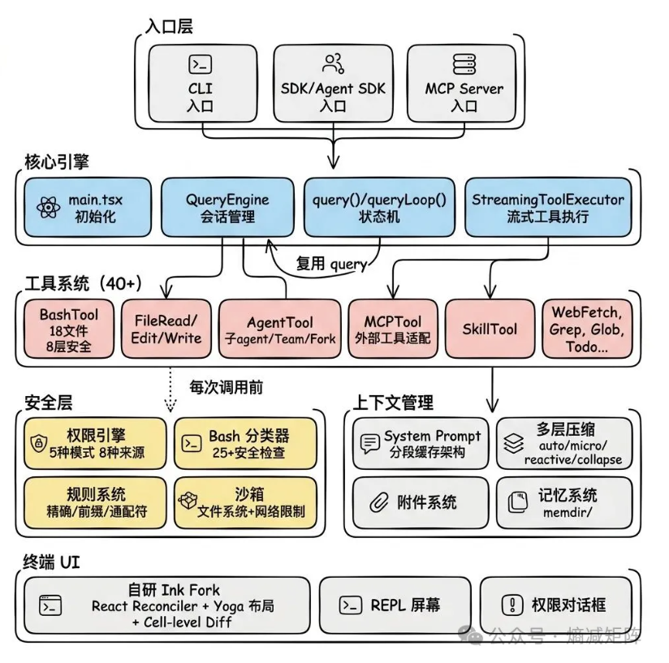
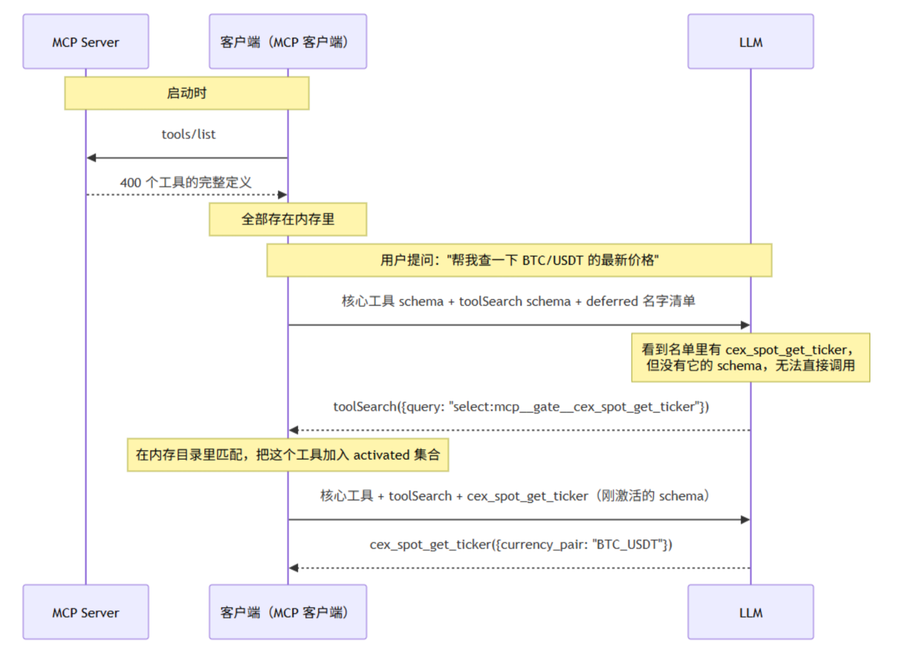
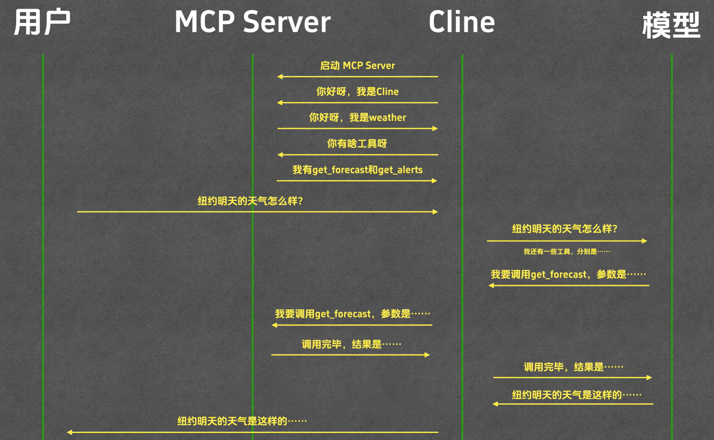

# 1. Claude Code 关键概念分析

> 基于 Anthropic 官方文档（code.claude.com/docs）整理，更新至 2026 年 7 月

---

## 一、概念总览

| 概念 | 一句话定义 |
| --- | --- |
| **Tool** | Claude 可调用的原子操作（读/写/执行/搜索等），是 Claude 具备行动能力的基础 |
| **Command** | 会话中通过 `/` 触发的操作，包括内置硬编码命令和 Skills |
| **Skill** | `SKILL.md` 文件中的 prompt 剧本，告诉 Claude 如何完成特定任务 |
| **Memory** | 跨会话持久化知识的机制：CLAUDE.md（你写的）+ Auto memory（Claude 自己写的） |
| **Subagent** | 独立上下文窗口中运行的专用 AI 助手，有自己的 prompt 和工具集 |
| **MCP** | 开放标准协议，用于连接外部数据源和服务，给 Claude 提供新工具 |
| **Hook** | 生命周期特定点自动执行的用户定义处理器（确定性的自动化） |
| **Loop** | 会话内的定时重复执行机制（`/loop`） |
| **Rules** | `.claude/rules/*.md` 中的模块化指令文件，支持路径作用域 |
| **Agent Teams** | 多个独立 Claude Code 会话协同工作，Agent 间可互相通信 |
| **Plugin** | Skill + Subagent + Hook + MCP 的打包单元，可分发的扩展包 |
| **Goal** | 设置完成条件，Claude 自动持续工作直到条件满足 |
| **Dynamic Workflows** | JavaScript 脚本编排大量 Subagent 在后台执行 |
| **Routines** | 云端长期运行的自动化任务（定式/事件/API 触发） |
| **Artifact** | 从会话发布的实时交互网页，可分享或公开 |

---

## 二、各概念独立分析

---

### 1. Tool（工具）

| 维度 | 说明 |
| --- | --- |
| **是什么** | Claude 可以调用的**原子操作**。读文件、写文件、执行命令、搜索代码、发请求等。总共约 35 个内置工具 |
| **为什么需要** | Tools 是 Claude **具备行动能力的基础**。没有 tools，Claude 只能输出文本建议（聊天 AI）；有了 tools，它可以直接修改代码、运行测试、部署 |
| **谁触发** | **Claude 自己**（在 agentic loop 中自主决定调用哪个 tool） |
| **怎么触发** | Claude 在推理时决定 → 生成 tool call → 系统执行 → 结果返回给 Claude 继续推理 |
| **什么时候触发** | Agentic loop 中的"take action"阶段，Claude 认为需要执行某个操作时 |
| **什么场景使用** | 一切涉及实际操作的时候：读代码、改文件、git 操作、搜索、web 请求、创建 subagent 等 |
| **如何使用** | 用户不直接调用 tools。用户通过 prompt 表达需求，Claude 自行选择合适的 tool |
| **典型举例** | `Read`、`Edit`、`Write`、`Bash`、`Grep`、`Glob`、`WebSearch`、`Agent`（启动 subagent）、`Workflow`（启动 workflow） |

**关键细节**：部分 tool 需要权限审批（如 `Edit`、`Write`、`Bash`），部分不需要（如 `Read`、`Grep`、`Glob`）。可在 settings 中用 `allow`/`deny`/`ask` 规则控制每个 tool 的行为。

**完整 Tool 列表**：

| Tool | 用途 | 需要权限 |
| --- | --- | --- |
| `Read` | 读取文件内容 | ❌ |
| `Edit` | 精确编辑文件 | ✅ |
| `Write` | 创建新文件 | ✅ |
| `Bash` | 执行 Shell 命令 | ✅（部分只读命令免审批） |
| `Grep` | 搜索文件内容 | ❌ |
| `Glob` | 按模式查找文件 | ❌ |
| `WebSearch` | 网页搜索 | ✅ |
| `WebFetch` | 获取 URL 内容 | ✅ |
| `Agent` | 启动 Subagent | ❌ |
| `Workflow` | 运行 Dynamic Workflow | ✅ |
| `Artifact` | 发布交互网页 | ✅ |
| `Skill` | 执行 Skill | ✅ |
| `AskUserQuestion` | 向用户提问 | ❌ |
| `EnterPlanMode` | 进入计划模式 | ❌ |
| `ExitPlanMode` | 提交计划退出计划模式 | ✅ |
| `EnterWorktree` | 创建/进入 git worktree | ✅ |
| `ExitWorktree` | 退出 worktree | ❌ |
| `NotebookEdit` | 修改 Jupyter notebook | ✅ |
| `PowerShell` | 执行 PowerShell 命令 | ✅ |
| `PushNotification` | 发送桌面/手机通知 | ❌ |
| `SendMessage` | 向 Agent team 成员发消息 | ❌ |
| `SendUserFile` | 向用户发送文件 | ❌ |
| `CronCreate` | 创建定时任务 | ❌ |
| `CronDelete` | 删除定时任务 | ❌ |
| `CronList` | 列出定时任务 | ❌ |
| `RemoteTrigger` | 创建/管理 Routines | ❌ |
| `ReportFindings` | 报告代码审查结果 | ❌ |
| `TaskCreate`/`List`/`Get`/`Stop`/`Update` | 任务管理 | ❌ |
| `ToolSearch` | 搜索延迟加载的 MCP 工具 | ❌ |

---

### 2. Command（命令）

| 维度 | 说明 |
| --- | --- |
| **是什么** | 会话中通过 `/` 触发的操作。包括**内置命令**（CLI 中硬编码的固定逻辑）和 **Skills**（prompt 驱动） |
| **为什么需要** | 提供快捷方式来控制会话行为，无需用自然语言描述意图 |
| **谁触发** | **用户**输入 `/xxx` |
| **怎么触发** | 用户在 prompt 开头输入 `/xxx`，可带参数。文本跟在命令名后面成为参数 |
| **什么时候触发** | 用户需要执行特定操作时（切换模型、清空上下文、审查代码等） |
| **什么场景使用** | 会话控制、模型切换、代码审查、上下文管理等 |
| **如何使用** | 直接在对话中输入 `/命令名 [参数]` |

**内置命令 vs Skills（都通过** `/` 触发）对比：

| 对比维度 | 内置命令 | Skill（作为命令使用时） |
| --- | --- | --- |
| 逻辑来源 | CLI 二进制硬编码 | Claude 执行的 prompt 剧本 |
| 行为特征 | 固定、可预测 | 灵活、随上下文变化 |
| 能否自动触发 | ❌ 只能手动 | ✅ 可手动也可自动 |
| 谁能创建 | 仅 Anthropic | 任何人 |
| 举例 | `/clear`, `/model`, `/exit` | `/code-review`, `/debug`, `/batch` |

**完整 Command 分类**：

```
所有 /xxx 入口
├── 内置命令（固定逻辑，硬编码在 CLI）
│   ├── 会话控制: /clear, /compact, /exit, /cd, /resume, /rewind
│   ├── 模型: /model, /effort
│   ├── 上下文: /context, /cost, /usage, /status
│   ├── 配置: /init, /memory, /config, /permissions
│   ├── 工具: /mcp, /agents, /plugins, /hooks
│   └── 其他: /help, /btw, /voice, /radio, /teleport, /goal
│
├── Bundled Skills（prompt 剧本，随 CLI 内置）
│   ├── 代码: /code-review, /security-review, /review
│   ├── 调试: /debug, /doctor, /batch
│   ├── 运行: /run, /verify, /run-skill-generator
│   ├── 循环: /loop
│   └── 其他: /claude-api, /plan
│
├── 用户自定义 Skills（`.claude/skills/<name>/SKILL.md`）
│   └── /deploy, /docker-debug, /summarize-changes 等
│
└── Bundled Workflows（JavaScript 脚本编排）
    └── /deep-research
```

---

### 3. Skill（技能）

| 维度 | 说明 |
| --- | --- |
| **是什么** | 一个 `SKILL.md` 文件，包含 YAML frontmatter + Markdown 指令。是**给 Claude 看的 prompt 剧本**，告诉 Claude 怎样完成特定任务 |
| **为什么需要** | ① 将重复性工作流标准化、可复用、可分享；② 避免每次手动输入相同的多步指令；③ 遵循 [Agent Skills](https://agentskills.io) 开放标准，跨 AI 工具通用；④ Skill 的 body 只在使用时加载，不浪费上下文 |
| **谁触发** | **两种方式**：① **用户**手动 `/skill-name`；② **Claude 自动匹配**（根据 description 字段判断是否与当前任务相关） |
| **怎么触发** | ① 手动输入 `/技能名`；② Claude 在处理用户请求时，自动从 skill 目录加载匹配的 skill |
| **什么时候触发** | ① 用户明确要求时；② Claude 发现当前任务与某个 skill 的 description 匹配时自动加载 |
| **什么场景使用** | 任何有固定流程的重复性工作：代码审查流程、部署步骤、调试规范、项目初始化等 |
| **如何使用** | 创建 skill 文件 → Claude 自动加载或手动 `/name` 调用 |

**Skill 的额外能力**（相比旧 Custom Commands）：

| 能力 | 说明 |
| --- | --- |
| **目录结构** | 可附带 templates/scripts/references 等支持文件 |
| **Frontmatter 控制** | 控制触发方式、调用者、运行模型等 |
| **动态上下文注入** | `!` 命令\`\` 在加载时动态执行并填入输出 |
| **自动匹配触发** | Claude 根据 description 自动判断是否加载 |
| **链式调用** | 最多 6 个串联：`/skill-a /skill-b do XYZ` |
| **Subagent 执行** | 设置 `subagent: true` 在独立上下文中运行 |
| **Plugin 命名空间** | `plugin-name:skill-name`，避免冲突 |
| **可打包进 Plugin** | 通过 marketplace 分发 |

**Skill Frontmatter 字段**：

```yaml
---
description: 当用户遇到 Docker 问题时使用     # 描述，用于自动匹配
invoke: manual                                 # optional/manual，控制是否允许Claude自动触发
subagent: true                                 # 在 subagent 中运行
model: opus                                    # 指定模型
disable-model-invocation: true                 # 禁止 Claude 自动加载
---
```

**Skill 存储位置**：

| 位置 | 路径 | 适用范围 |
| --- | --- | --- |
| 组织级 | Managed Settings | 整个组织 |
| 用户级 | `~/.claude/skills/<name>/SKILL.md` | 所有项目 |
| 项目级 | `.claude/skills/<name>/SKILL.md` | 当前项目 |
| 插件级 | `<plugin>/skills/<name>/SKILL.md` | 启用插件的场景 |
| 嵌套（monorepo） | `<pkg>/.claude/skills/<name>/SKILL.md` | 子目录 |

---

### 4. Memory（记忆系统）

| 维度 | 说明 |
| --- | --- |
| **是什么** | 跨会话持久化知识的机制，包含两部分：**CLAUDE.md**（你写的指令）+ **Auto memory**（Claude 自己写的笔记） |
| **为什么需要** | 每个会话从空白上下文开始，必须有一种方式把项目知识、编码规范、你的偏好带到新会话中 |
| **谁触发** | **系统自动加载**，无需用户或 Claude 主动触发 |
| **怎么触发** | 会话启动时，Claude Code 自动扫描目录树加载 CLAUDE.md，并从 `~/.claude/projects/<repo>/memory/` 加载 auto memory |
| **什么时候触发** | ① 会话启动时自动加载；② Compaction 后重新加载；③ Claude 在会话中主动读写 auto memory |
| **什么场景使用** | 项目规范（缩进风格、命名规则）、架构说明、常用命令、环境配置 |

**CLAUDE.md vs Auto memory 对比**：

| 对比维度 | CLAUDE.md | Auto memory |
| --- | --- | --- |
| **作者** | **你**（人类） | **Claude**（AI 自己） |
| **存储位置** | 项目根 `./CLAUDE.md` 或用户级 `~/.claude/CLAUDE.md` | `~/.claude/projects/<repo>/memory/` |
| **内容范围** | 项目约定、架构、命令 | Claude 从对话中积累的关于项目的知识 |
| **更新方式** | 你手动编辑（或 `/memory` 命令） | Claude 在对话中自动写入 |
| **压缩后** | ✅ 保留，从磁盘重新加载 | ✅ 保留，从磁盘重新加载 |
| **大小限制** | 无限制（但精简效果更好） | 前 200 行或 25KB 加载，超出部分按需读取 |
| **加载顺序** | 从文件系统根到工作目录 | 启动时加载 index 文件 |

**Memory 加载层次**（目录树遍历）：

```
从当前工作目录向上扫描每个目录：
  foo/bar/ 中执行 claude
  → 加载 /foo/CLAUDE.md（如果有）
  → 加载 /foo/CLAUDE.local.md
  → 加载 /foo/bar/CLAUDE.md
  → 加载 /foo/bar/CLAUDE.local.md
  也扫描子目录中的 CLAUDE.md，在读写文件时按需加载
```

---

### 5. Subagent（子代理）

| 维度 | 说明 |
| --- | --- |
| **是什么** | 在**独立上下文窗口**中运行的专用 AI 助手。有自己的 system prompt、工具权限、上下文窗口 |
| **为什么需要** | ① **保护主会话上下文**：把大量搜索/日志/文件内容隔离在子会话中，只返回摘要；② **并行工作**：多个 subagent 可同时运行（v2.1.198+ 默认后台运行）；③ **专业化**：为不同任务定制不同 prompt 和工具集 |
| **谁触发** | **Claude 主代理**（在 agentic loop 中通过 `Agent` tool 触发） |
| **怎么触发** | Claude 自主决定需要 subagent → 调用 `Agent` tool → 传入任务描述和配置 → subagent 独立执行 → 返回结果摘要 |
| **什么时候触发** | Claude 认为某个子任务适合隔离处理时：深度研究、大规模重构、独立验证等 |
| **什么场景使用** | 代码库范围搜索、独立验证测试结果、多角度研究、隔离高风险操作 |
| **如何使用** | ① 使用内置 subagent（Explore、Plan、General-purpose）；② 自定义 subagent（`.claude/agents/<name>.md`）；③ 在 skill 中设置 `subagent: true` |

**内置 Subagent**：

| 名称 | 用途 |
| --- | --- |
| **Explore** | 探索代码库、搜索模式、理解项目结构 |
| **Plan** | 在计划模式下设计方案 |
| **General-purpose** | 通用任务委托 |

**自定义 Subagent 示例**：

```markdown
# .claude/agents/security-reviewer.md
---
name: security-reviewer
description: 专门进行安全代码审查
model: opus
tools: [Read, Bash]
---

你是一名资深安全工程师。审查代码时关注：
- SQL 注入、XSS、命令注入
- 认证/授权缺陷
- 密钥硬编码
- 不安全的反序列化
```

---

### 6. MCP（Model Context Protocol）

| 维度 | 说明 |
| --- | --- |
| **是什么** | 一个**开放标准协议**，用于将 AI 工具连接到外部数据源和服务。MCP 服务器给 Claude 提供新的 tool |
| **为什么需要** | Claude 内置工具只能操作文件系统和 shell。要连接数据库、Jira、Slack、GitHub API、浏览器等外部服务，需要 MCP |
| **谁触发** | **Claude 主代理**（在 agentic loop 中把 MCP 提供的工具当作普通 tool 调用） |
| **怎么触发** | MCP 服务器注册新的 tool → Claude 在推理时看到这些 tool → 像调用内置 tool 一样调用它们 |
| **什么时候触发** | Claude 认为需要外部服务时（查 Jira ticket、查数据库、操作 GitHub PR 等） |
| **什么场景使用** | 数据库查询、GitHub 操作、Slack 通知、Jira 管理、浏览器自动化、Kubernetes 操作等 |
| **如何使用** | `claude mcp add <name> -- <command>` 或编辑 `.mcp.json` 配置文件 |

**MCP 作用域**：

| 作用域 | 存储位置 | 适用场景 |
| --- | --- | --- |
| `-s user`（全局） | `~/.claude.json` | 所有项目都可用 |
| `-s local`（个人） | `.claude/settings.local.json` | 仅当前项目（gitignored） |
| `-s project`（团队） | `.claude/settings.json` | 当前项目（git 跟踪） |

**MCP Tool Search**：启动时只加载 MCP 工具名称，Claude 决定用哪个时才加载完整 schema。节省上下文。自动启用。

---

### 7. Hook（钩子）

| 维度 | 说明 |
| --- | --- |
| **是什么** | 在 Claude Code 生命周期特定点**自动执行**的用户定义处理器。支持 Shell 命令、HTTP 端点、MCP tool、LLM prompt、Subagent |
| **为什么需要** | 提供**确定性的自动化**——有些事必须每次发生（比如保存后格式化代码），不能依赖 LLM 自己决定是否要做 |
| **谁触发** | **系统自动触发**（在固定的生命周期点） |
| **怎么触发** | 配置 `.claude/settings.json` 中的 hooks 字段，定义事件 + 匹配器 + 处理器 |
| **什么时候触发** | 在 8 个预定义的生命周期事件点 |
| **什么场景使用** | 保存后自动格式化、危险命令拦截、完成后发通知、会话启动加载环境 |
| **如何使用** | 在 settings.json 中配置 |

**8 个 Hook 事件**：

| Hook 事件 | 触发时机 | 典型用途 |
| --- | --- | --- |
| `UserPromptSubmit` | 用户发送 prompt 之前 | 输入校验、日志 |
| `PreToolUse` | 工具执行之前 | 安全门禁，拦截危险命令（exit 2 = 阻止） |
| `PostToolUse` | 工具执行之后 | 自动格式化、运行 linter |
| `Notification` | 权限请求或输入等待时 | 桌面通知、提醒 |
| `Stop` | Claude 回复完成后 | 完成日志、状态更新 |
| `SubagentStop` | Subagent 完成时 | Agent 编排 |
| `PreCompact` | 上下文压缩之前 | 备份会话记录 |
| `SessionStart` | 会话开始时 | 加载开发上下文 |

**Hook 配置示例**：

```json
{
  "hooks": {
    "PostToolUse": [{
      "matcher": "Write(*.py)",
      "hooks": [{"type": "command", "command": "ruff check --fix $CLAUDE_FILE_PATHS"}]
    }],
    "PreToolUse": [{
      "matcher": "Bash",
      "hooks": [{"type": "command", "command": "if echo \"$CLAUDE_TOOL_INPUT\" | grep -q 'rm -rf'; then echo 'Blocked!' && exit 2; fi"}]
    }],
    "Stop": [{
      "hooks": [{"type": "command", "command": "echo 'Claude finished' >> /tmp/claude.log"}]
    }]
  }
}
```

**Hook vs Skill 本质区别**：

| 维度 | Hook | Skill |
| --- | --- | --- |
| **执行方式** | **确定性执行**（匹配就运行） | **建议性执行**（Claude 决定是否遵循） |
| **谁控制** | **你控制**是否执行 | **Claude 控制**是否执行 |
| **逻辑类型** | Shell 命令 / HTTP / 固定逻辑 | 自然语言指令 |
| **适合什么** | **必须做的事**（安全门禁、格式化） | **参考性流程**（审查步骤、调试流程） |
| **Claude 感知** | Claude 不直接"知道" hook 存在 | Claude 读取并理解 skill 内容 |
| **举例** | "每次写 Python 文件后自动 ruff 格式化" | "当用户问 Docker 问题时按以下步骤排查" |

---

### 8. Loop（循环）

| 维度 | 说明 |
| --- | --- |
| **是什么** | 会话内的**定时重复执行**机制。通过 `/loop` 命令触发，让 Claude 按间隔重复执行某个 prompt |
| **为什么需要** | 需要在会话保持期间定期检查某些状态（部署状态、CI 结果、PR 评论），而不是一直手动刷新 |
| **谁触发** | **用户**手动 `/loop` |
| **怎么触发** | 输入 `/loop [间隔] [prompt]` |
| **什么时候触发** | 当你在一个会话中需要定期执行检查时 |
| **什么场景使用** | 轮询部署进度、定期审查 PR、内置维护 prompt 自动处理未完成工作 |
| **如何使用** | `/loop`（无参=内置维护prompt + Claude 自选间隔）、`/loop 5m`（固定间隔）、`/loop 5m check status`（固定间隔+自定义prompt） |

**/loop 的三种形态**：

| 提供参数 | 示例 | 行为 |
| --- | --- | --- |
| 间隔 + prompt | `/loop 5m check deploy` | 每 5 分钟执行一次指定 prompt |
| 仅 prompt | `/loop check deploy` | Claude 自选间隔（1分钟\~1小时）执行 |
| 无参数 / 仅间隔 | `/loop` 或 `/loop 15m` | 执行内置维护 prompt，自动处理未完成工作 |

**内置维护 prompt 做的事**（按优先级）：

1. 继续对话中未完成的工作
2. 处理当前分支的 PR：审查评论、失败的 CI、合并冲突
3. 清理工作：bug 搜索、代码简化（没有待办时）

---

### 9. Rules（规则文件）

| 维度 | 说明 |
| --- | --- |
| **是什么** | `.claude/rules/*.md` 中的模块化指令文件，是 CLAUDE.md 的补充 |
| **为什么需要** | 当 CLAUDE.md 太长时，按主题拆分成多个规则文件更清晰。支持 **path 作用域**，只在读某个目录/文件时才加载，节省上下文 |
| **谁触发** | **系统自动加载** |
| **怎么触发** | Claude 读某个文件时，触发路径匹配的 rule 文件自动注入上下文 |
| **什么时候触发** | ① 会话启动时加载所有无 path 限制的 rule；② 读文件时加载 path 匹配的 rule |
| **什么场景使用** | 将大型 monorepo 中的不同模块规则分开 |
| **如何使用** | 在 `.claude/rules/` 下创建 `.md` 文件，带可选的 `paths:` frontmatter |

**示例**：

```markdown
# .claude/rules/api-rules.md
---
paths:
  - "src/api/**/*.ts"
---
# API 开发规范
- 所有接口使用 JWT 鉴权
- 返回格式统一为 { code, data, message }
```

**CLAUDE.md vs Rules vs Skill 对比**：

| 维度 | CLAUDE.md | Rules | Skill |
| --- | --- | --- | --- |
| **加载时机** | 每次会话全量加载 | 按路径匹配加载 | 需要时加载（手动/自动匹配） |
| **内容类型** | 永远相关的项目知识 | 按文件类型的规范 | 特定任务的流程指导 |
| **上下文成本** | 每次都消耗 | 匹配路径时才消耗 | 使用时才消耗 |
| **适合场景** | 项目架构、常用命令 | Python 规范、API 规范 | 部署流程、调试步骤 |

---

### 10. Agent Teams（代理团队）

| 维度 | 说明 |
| --- | --- |
| **是什么** | 多个**独立的 Claude Code 会话**协同工作，由一个 team lead 协调，Agent 之间可以互相发消息 |
| **为什么需要** | 当单个会话不够用时（需要多个独立上下文窗口同时工作），或者需要多个专用 Agent 协作完成复杂任务 |
| **谁触发** | **用户**（启用 + 创建 team） |
| **怎么触发** | 设置 `CLAUDE_CODE_EXPERIMENTAL_AGENT_TEAMS=1` → 会话中让 Claude 创建 team → 分配任务 |
| **什么时候触发** | 需要多个独立 Agent 长期协作的重大任务 |
| **什么场景使用** | 大型重构（一个 agent 改前端、一个改后端、一个改测试） |
| **⚠️ 实验性** | 默认关闭，需要显式启用 |
| **与 Subagent 区别** | 你可以直接与 team 成员对话；Subagent 只能向父级报告 |

---

### 11. Plugin（插件）

| 维度 | 说明 |
| --- | --- |
| **是什么** | Skill + Subagent + Hook + MCP 的**打包单元**。一个完整的可分发扩展包 |
| **为什么需要** | ① **分发**：把一组相关的技能打包分享给团队/社区；② **命名空间**：避免命名冲突（`plugin-name:skill-name`）；③ **版本管理**：有版本号，可控更新 |
| **谁触发** | 取决于包含什么——skill 部分用户/Claude、hook 部分系统、subagent 部分 Claude |
| **怎么触发** | 安装后自动生效（hook）或通过 `/plugin-name:skill-name` 调用（skill） |
| **什么时候触发** | 安装了插件后一直有效 |
| **什么场景使用** | 团队共享工具集、从 marketplace 安装社区插件 |
| **如何使用** | `claude --plugin-dir ./my-plugin` 或通过 marketplace 安装 |

**Plugin 目录结构**：

```
my-plugin/
├── .claude-plugin/
│   └── plugin.json          # 清单：name, description, version, author
├── skills/
│   └── hello/
│       └── SKILL.md          # 命名空间为 /my-plugin:hello
├── agents/                   # 自定义 subagent
├── hooks/                    # hook 配置
└── mcp/                      # MCP 服务器配置
```

---

### 12. Goal（目标）

| 维度 | 说明 |
| --- | --- |
| **是什么** | 设置一个**完成条件**，Claude 自动持续工作直到条件满足。每次 turn 结束后用小模型检查条件是否达成 |
| **为什么需要** | 对于需要多个连续步骤的任务，你不需要每步都手动确认。设定"所有测试通过"后，Claude 会自己迭代直到通过 |
| **谁触发** | **用户**输入 `/goal` |
| **怎么触发** | 在对话中输入 `/goal <完成条件>` |
| **什么时候触发** | 当你有一个明确的、可验证的完成标准时 |
| **什么场景使用** | "迁移模块到新 API 直到所有编译通过"、"实现设计文档直到所有验收标准达成" |
| **如何使用** | 先给 Claude 任务，然后 `/goal 所有测试通过` → Claude 自动迭代直到测试通过 |

**Goal vs Loop vs Routines 对比**：

| 维度 | /loop | /goal | Routines |
| --- | --- | --- | --- |
| 触发方式 | `/loop [间隔] [prompt]` | `/goal <条件>` | claude.ai 配置或 `/schedule` |
| 停止条件 | **永不停止**（除非手动） | **条件达成自动停止** | 配置决定（一次/重复） |
| 运行位置 | **会话内** | **会话内** | **Anthropic 云端** |
| 计算机关闭 | ❌ 停止 | ❌ 停止 | ✅ 持续运行 |

---

### 13. Dynamic Workflows（动态工作流）

| 维度 | 说明 |
| --- | --- |
| **是什么** | JavaScript 脚本编排 Subagent 在后台执行。Claude 写脚本，runtime 执行 |
| **为什么需要** | 当任务需要几十到几百个 agent、超出了普通 subagent 的协调能力时。脚本可复现、可审查 |
| **谁触发** | **用户**（通过 `/deep-research` 或让 Claude 创建 workflow） |
| **怎么触发** | Claude 调用 `Workflow` tool |
| **什么时候触发** | 需要大规模自动化时 |
| **什么场景使用** | 全代码库 bug 扫描、500 文件迁移、多来源交叉验证研究 |
| **内置 Workflow** | `/deep-research` — 多角度搜索、获取来源、交叉验证 → 生成引用报告 |

**Subagent vs Agent Teams vs Workflows 对比**：

| 维度 | Subagent | Agent Teams | Dynamic Workflows |
| --- | --- | --- | --- |
| 运行位置 | 主会话内独立上下文 | **独立会话** | 独立运行环境 |
| 通信方式 | 仅上报父级 | Agent 间可互发消息 | 通过脚本变量 |
| 规模 | 几个/次 | 数个长期运行 | 几十到几百个/次 |
| 可重复性 | 子定义可复用 | 团队定义可复用 | **脚本本身可完全复现** |
| 用户交互 | 不能直接交互 | 可直接与任一成员对话 | 不能直接交互 |
| 适用场景 | 隔离子任务 | 长期协作项目 | 大规模自动化审计/迁移 |

---

### 14. Routines（例程）

| 维度 | 说明 |
| --- | --- |
| **是什么** | 保存的 Claude Code 配置（prompt + 仓库 + MCP 连接），在 Anthropic 云端自动运行 |
| **为什么需要** | Loop 只能在会话打开时运行。Routines 关机也能跑 |
| **谁触发** | 触发方式有三种：**定时**（cron）、**API**（HTTP POST）、**GitHub 事件**（PR/release） |
| **怎么触发** | 在 claude.ai/code/routines 配置，或 CLI 中用 `/schedule` |
| **什么时候触发** | 按设定时间/事件自动触发 |
| **什么场景使用** | 每天自动代码审查、每晚自动依赖更新、PR 自动评论、API 触发式部署检查 |
| **⚠️ 状态** | Research Preview |

---

## 三、核心概念关系图

```
用户输入
    │
    ├── 以 "/" 开头 → Command（内置）或 Skill（手动调用）
    │
    └── 自然语言
        │
        ├── 系统自动加载 Memory / Rules（跨会话记忆）
        │
        └── Claude 启动 Agentic Loop
                │
                ├── 读取上下文 ←── CLAUDE.md / Auto memory / Rules
                │
                ├── 决定用什么 Tool
                │   ├── 内置 Tool（Read/Edit/Bash/Grep/...）
                │   ├── MCP Tool（数据库/Jira/...）← 通过 MCP 协议注册
                │   ├── Agent Tool → 启动 Subagent（独立上下文执行）
                │   ├── Workflow Tool → 启动 Dynamic Workflow（脚本编排）
                │   └── Skill Tool → 执行 Skill（prompt 剧本）
                │
                ├── Tool 执行前 → Hook（PreToolUse，拦截检查）
                ├── Tool 执行后 → Hook（PostToolUse，格式化）
                │
                ├── 自动匹配 → Skill（按 description 自动加载）
                │
                └── Turn 结束后 → Hook（Stop，发通知）
                    │
                    ├── 检查 /goal 条件？→ 未达成则继续下一轮
                    └── 有 /loop 定时任务？→ 时间到再执行

独立于会话外运行：
    ├── Routines（云端长期运行，关机不中断）
    ├── Plugin（打包分发 skill + hook + subagent + MCP）
    └── Agent Teams（多独立会话，Agent 间可通信）
```

---

## 四、相似概念深度对比矩阵

### 4.1 Skill vs Command vs MCP

这三个最容易混淆，因为它们都扩展了 Claude 的能力：

| 维度 | Skill | Command（内置） | MCP |
| --- | --- | --- | --- |
| **本质** | **Prompt 剧本**（指令集） | **硬编码逻辑** | **外部工具注册** |
| **运行方式** | 加载到 Claude 上下文中，Claude 用自己的工具执行 | CLI 直接执行固定逻辑 | 注册新 tool 给 Claude 调用 |
| **扩展方向** | 告诉 Claude **"怎么做"**（流程） | 告诉系统 **"做什么"**（操作） | 给 Claude **"新能力"**（新工具） |
| **谁能创建** | 任何人 | 仅 Anthropic | 任何人 |
| **触发方式** | 手动 `/` 或 自动匹配 | 仅手动 `/` | Claude 自动调用（像内置 tool 一样） |
| **跨工具兼容** | ✅ Agent Skills 开放标准 | ❌ Claude Code 私有 | ✅ MCP 开放标准 |
| **何时用** | 需要**标准化工作流**时 | 需要**控制会话行为**时 | 需要**连接外部服务**时 |

**场景决策树**：

```
你想做什么？
├── 控制会话行为（清空/切换模型/退出）→ Command（内置）
├── 指导 Claude 按特定流程做事
│   ├── 简单流程 → Skill（手动或自动触发）
│   └── 需要外部数据/API → Skill + 动态上下文注入
├── 给 Claude 连接外部服务
│   ├── 数据库/API/Jira/Slack → MCP
│   └── 需要打包多个能力分发 → Plugin
└── 让某些事每次都发生（安全/格式化）→ Hook
```

### 4.2 CLAUDE.md vs Skill vs Rules

这三个都是"给 Claude 信息"的机制：

| 维度 | CLAUDE.md | Skill | Rules |
| --- | --- | --- | --- |
| **加载时机** | **每次会话启动**全量加载 | **需要时才加载**（按需） | **按路径匹配加载** |
| **内容类型** | 永远相关的项目知识 | 特定任务的流程指导 | 按文件类型/路径的规范 |
| **上下文成本** | 每次都消耗（所以保持精简） | 仅使用时消耗 | 匹配路径时才消耗 |
| **适合场景** | 项目架构、常用命令、编码规范 | 部署流程、调试步骤、代码审查 | Python 规范、API 规范 |
| **谁写** | 你 | 你 | 你 |

**选择建议**：

- 如果每条信息**每次会话都需要** → CLAUDE.md
- 如果信息**只在特定任务需要** → Skill（自动或手动触发）
- 如果信息**只在读特定类型文件时需要** → Rules（path-scoped）

### 4.3 Subagent vs Agent Teams vs Workflows

| 维度 | Subagent | Agent Teams | Dynamic Workflows |
| --- | --- | --- | --- |
| **规模** | 少数几个/次 | 数个长期运行 | 几十到几百个/次 |
| **隔离级别** | 独立上下文 | **独立会话** | 独立运行环境 |
| **通信方式** | 仅向父级报告 | Agent 间双向通信 | 通过脚本变量 |
| **可重复性** | 子定义可复用 | 团队定义可复用 | **脚本可完全复现** |
| **能否与你交互** | ❌ 不能直接对话 | ✅ 可直接与任一成员对话 | ❌ |
| **适合场景** | 隔离探索性任务 | 长期协作大项目 | 大规模自动化审计/迁移 |
| **谁编排** | Claude 自主决定 | Team lead agent | **脚本本身** |

### 4.4 Hook vs Skill

| 维度 | Hook | Skill |
| --- | --- | --- |
| **执行方式** | **确定性执行**（匹配就运行） | **建议性执行**（Claude 决定是否遵循） |
| **谁控制** | **你控制**是否执行 | **Claude 控制**是否执行 |
| **逻辑类型** | Shell 命令 / HTTP / 固定逻辑 | 自然语言指令 |
| **适合什么** | **必须做的事**（安全门禁、格式化） | **参考性流程**（审查步骤、调试流程） |
| **Claude 感知** | Claude 不直接"知道" hook 存在 | Claude 读取并理解 skill 内容 |
| **举例** | "每次写 Python 文件后自动 ruff 格式化" | "当用户问 Docker 问题时按以下步骤排查" |

### 4.5 Loop vs Goal vs Routines

| 维度 | /loop | /goal | Routines |
| --- | --- | --- | --- |
| **触发方式** | 用户 `/loop` | 用户 `/goal <条件>` | claude.ai 配置或 `/schedule` |
| **停止条件** | **不自动停止** | **条件达成自动停止** | 配置决定 |
| **运行位置** | **会话内** | **会话内** | **Anthropic 云端** |
| **计算机关闭** | ❌ 停止 | ❌ 停止 | ✅ 持续运行 |
| **适合场景** | 会话中定期轮询 | 自动迭代直到完成 | 持续运行的自动化任务 |

---

## 五、版本演进关键变更

| 旧名称 | 新名称 | 说明 |
| --- | --- | --- |
| Custom Commands | **Skills** | `.claude/commands/` 仍兼容，但 Skills 功能更丰富 |
| Slash Commands | **Commands** | "Slash"从产品文案中移除 |
| Headless mode | **Non-interactive mode** | 同一 `-p` 参数，行为相同 |
| `TodoWrite` tool | **TaskCreate/List/Get/Stop/Update** | 更完整的任务管理工具集 |

---

## 六、概念速查表

| 概念 | 本质 | 触发者 | 触发方式 | 加载/运行时机 | 配置位置 |
| --- | --- | --- | --- | --- | --- |
| **Tool** | 原子操作 | Claude | Agentic loop 自主决定 | 每次需要时 | 内置，不可配置 |
| **Command**（内置） | 硬编码逻辑 | 用户 | `/xxx` 手动输入 | 用户需要时 | 内置 |
| **Skill** | Prompt 剧本 | 用户 / Claude | 手动 `/` 或自动匹配 | 需要时按需加载 | `.claude/skills/` |
| **CLAUDE.md** | 你写的记忆 | 系统 | 自动加载 | 每次会话启动 | `./CLAUDE.md` |
| **Auto memory** | Claude 写的记忆 | 系统 / Claude | 自动加载 + 自动写入 | 启动时 + 对话中 | `~/.claude/projects/` |
| **Rules** | 路径作用域指令 | 系统 | 按路径自动加载 | 读匹配文件时 | `.claude/rules/` |
| **Subagent** | 独立上下文 Agent | Claude | 调用 `Agent` tool | Claude 决定需要时 | `.claude/agents/` |
| **MCP** | 外部工具注册 | Claude | 像内置 tool 一样调用 | Claude 需要外部服务时 | `.mcp.json` |
| **Hook** | 确定性自动化 | 系统 | 生命周期事件触发 | 固定事件点 | `settings.json` |
| **Loop** | 会话内定时任务 | 用户 | `/loop` 命令 | 设定间隔重复 | 会话中配置 |
| **Goal** | 条件驱动执行 | 用户 | `/goal <条件>` | 条件未达成持续执行 | 会话中配置 |
| **Agent Teams** | 多会话协作 | 用户 | 环境变量 + 创建 team | 需要时 | 实验性功能 |
| **Plugin** | 能力打包单元 | 取决于内容 | 安装后自动/手动 | 安装后持续有效 | 独立目录 |
| **Workflows** | 脚本编排 Subagent | 用户 | Claude 调用 `Workflow` tool | 大规模自动化时 | 脚本 |
| **Routines** | 云端自动化 | 定时/API/GitHub | 自动触发 | 设定时间/事件 | claude.ai |
| **Artifact** | 实时交互网页 | Claude | 调用 `Artifact` tool | 需要可视化输出时 | 内置 |

---

## 七、架构



# 2. Agent 上下文是什么？

## 上下文的本质

上下文是 LLM 的**工作记忆**：Claude Code 每次向模型发请求时，都会把当前能"看到"的全部信息打包进这一次请求。模型本身**没有持久记忆**，它的所有回答都只基于当次请求中的上下文内容。上下文窗口宝贵——它是有限资源，窗口内信息的质量直接决定回答质量。

## 上下文窗口大小

- Claude 模型标准是 **200K tokens** 上下文窗口
- 部分新模型（如 Sonnet 4/4.5 系列）支持 **1M tokens** 扩展上下文（beta 能力，需显式开启）
- Claude Code 的实际上限取决于当前配置的模型

## 上下文的组成

一次请求里实际装了五部分内容：

1. **系统提示词与工具定义**：Claude Code 的核心指令，以及全部可用工具（Read、Bash、Edit 等）的 schema 描述

**CLAUDE.md 体系**：项目根目录、用户级 `~/.claude/CLAUDE.md`、按目录嵌套的 CLAUDE.md，会话启动时注入

1. **会话历史**：用户消息、助手回复、每次工具调用及其返回结果（文件内容、命令输出）——这是**上下文膨胀的主要来源**
2. **环境信息**：工作目录、git 状态（分支、变更文件）、平台信息、当前日期
3. **系统提醒（system-reminder）**：harness 注入的时效性信息，如文件被修改的通知、可用技能列表

## 上下文快满时怎么办

1. **自动压缩（auto-compact）**：接近窗口上限时自动触发，把此前的对话历史总结成摘要，用"摘要 + 摘要后新产生的上下文"继续工作
2. `/compact` 手动压缩：可带聚焦指令，如 `/compact 重点保留数据库设计部分`，比被动等自动压缩更可控
3. `/clear` 彻底清空：开始新任务时使用，会话历史清零，CLAUDE.md 等配置重新加载
4. **用量警告**：上下文使用接近上限时，界面会显示警告提示

## 提示缓存（Prompt Caching）

- Claude Code 自动利用 API 的提示缓存：把请求中**静态的前缀部分**（系统提示词、工具定义、CLAUDE.md、早期对话）缓存起来
- 默认缓存 TTL 为 **5 分钟**，命中缓存的部分大幅降低成本和延迟
- 推论：频繁 `/clear` 或大幅切换上下文会让缓存失效，响应变慢、成本变高

## 子代理的上下文包含什么（实测验证）

子代理拥有**独立的全新上下文窗口**，经实证测试，其组成是：

- **包含**：自己的系统提示词（由 agent 类型定义）+ **完整的 CLAUDE.md 体系** + 环境/git 信息 + 主会话传入的任务 prompt
- **不包含**：主会话的会话历史（用户消息、工具调用结果、读过的文件内容）

实测结论：测试子代理能准确引用项目 CLAUDE.md 原文；且 0 次工具调用就消耗约 **18K tokens**——这是"系统提示词 + 工具定义 + CLAUDE.md + 环境信息"的**基础上下文开销**，每个子代理都要付一遍。

两个推论：

- CLAUDE.md 是主会话和**每个子代理**的"基础税"，写得越精简，所有上下文都受益
- 子代理中间的探索过程（读文件、跑命令）不占主会话上下文，只回传最终结论——这是大型任务中**保护主上下文的关键手段**（触发机制详见 # 8. Subagent介绍）

## 上下文管理最佳实践

- **CLAUDE.md 保持精简高密**：它每次请求都占上下文，写通用结论，细节放具体文件里按需读取
- **任务切换用** `/clear`：避免无关历史占用窗口
- **大探索交给子代理**：读文件、搜代码的脏活在子上下文里做，主会话只留结论
- **长会话主动** `/compact`：在关键节点带聚焦指令压缩

# 3. Tool 机制介绍

## 3.1 Tool 是什么？为什么需要 Tool？

**Tool（工具）** 是 Agent 可以调用的外部函数/API，本质上是 **大模型与外部世界交互的桥梁**。Tools 是连接大语言模型（LLM）与现实世界的“感官”与“肢体”

**为什么需要 Tool？** 大模型本身有几个天然局限：

- **知识截止**：训练数据有截止日期，不知道最新信息
- **无法执行精确计算**：数学计算、字符串处理等容易出错
- **无法感知实时状态**：不知道当前时间、天气、股票价格
- **无法操作外部系统**：不能查数据库、调 API、读写文件、执行命令
- **无法采取实际行动**：不能发送邮件、创建工单、部署代码

**例子**：用户问"帮我查下今天北京的天气"——模型再强，不调用天气 API 它不可能知道。Tool 就是让模型能"伸手"去做这些事。

---

## 3.2 有哪些常见的 Tool？

按功能分类：

| 类别 | 示例 | 作用 |
| --- | --- | --- |
| **信息检索** | WebSearch, WebFetch, 数据库查询 | 获取实时/外部信息 |
| **文件操作** | Read, Write, Edit, 文件搜索 | 读写修改文件系统 |
| **代码执行** | Bash, Python 解释器, NotebookEdit | 运行代码、执行命令 |
| **网络请求** | HTTP GET/POST, API 调用 | 与外部服务交互 |
| **工具链** | Git 操作, Docker, 云服务 CLI | 开发运维操作 |
| **通信** | SendMessage, PushNotification | Agent 间通信、通知用户 |
| **编排** | Agent（启动 Subagent）, Workflow | 任务分解与并行执行 |
| **结构化输出** | 定义 JSON Schema | 让模型输出结构化数据 |

---

## 3.3 Agent / 大模型怎么知道有哪些 Tool？

这是通过 **注册（Registration）+ 注入（Injection）** 机制实现的，分两个层面：

### 3.3.1 注册（Registration）

Tool 在系统启动时注册到 Agent 框架中，每个 Tool 的元信息包括：

- **名称**（name）：唯一标识
- **描述**（description）：自然语言描述，**这是最重要的部分**，模型靠它判断何时调用
- **参数 Schema**（parameters / inputSchema）：JSON Schema 格式的参数定义
- **返回值定义**（return type）

### 3.3.2 注入（Injection）

**每次调用大模型时**，所有可用 Tool 的定义（名称 + 描述 + 参数 Schema）被序列化后**拼入 API 请求的** `tools` 参数一起发给大模型。大模型看到的**只是工具的"说明书"，不是工具的实现代码**——它只知道这个工具叫啥、能干啥、需要什么参数，不知道背后怎么实现的。

---

## 3.4 大模型怎么决定调用哪个 Tool？（Function Calling 原理）

这是通过 **Function Calling（函数调用）** 机制实现的，核心流程分为 **6 个步骤**：

### Step 1：注册与注入

开发者把工具描述放在 API 的 `tools` 参数里传给模型，每个工具包含 `name`、`description`、`parameters`（参数 Schema）：

```json
{
  "model": "gpt-4",
  "messages": [{"role": "user", "content": "北京天气"}],
  "tools": [
    {
      "type": "function",
      "function": {
        "name": "get_weather",
        "description": "查询天气",
        "parameters": {
          "type": "object",
          "properties": {
            "city": {"type": "string"}
          },
          "required": ["city"]
        }
      }
    }
  ]
}
```

### Step 2：模型匹配与切换模式

模型在推理时，看到用户请求（如"北京天气"），通过 `description` 匹配到 `get_weather` 工具。关键机制是：模型在训练时学会了一个**特殊 token**，表示"接下来我要输出工具调用"。这个 token 触发模型从"自然语言生成模式"切换到 **"工具调用模式"**，输出结构化的 JSON 而不是自然语言。

### Step 3：API 返回 Tool Call（这样可以准确返回格式化的Json信息，如果用提示词约束，大模型会遗忘，返回不标准的json格式）

API 返回的 response 中，`content` 为 `null`，取而代之的是 `tool_calls` 字段， **包含调用的工具名称和参数** ：

这一步最关键的是参数提取，大模型分析后知道调用哪个Tool，如果直接返回给agent，没有参数agent也无法调用，还需要大模型知道这个函数用哪些参数，大模型才能提取参数，告诉agent 调用哪个方法，参数是什么，agent才能调用。

**所以如果tools参数中没有工具的完整 schema信息，大模型无法进行方法调用**

```json
{
  "choices": [{
    "message": {
      "role": "assistant",
      "content": null,
      "tool_calls": [{
        "id": "call_abc123",
        "type": "function",
        "function": {
          "name": "get_weather",
          "arguments": "{\"city\": \"北京\"}"
        }
      }]
    }
  }]
}
```

### Step 4：框架拦截与执行

Agent **框架检测到** `tool_calls`**，拦截它，解析出工具名称和参数，去调用真实的 API/函数。**

### Step 5：结果回传

把 API 返回的结果以 tool role 塞回给模型：

```json
{
  "role": "tool",
  "tool_call_id": "call_abc123",
  "content": "北京，25°C，晴"
}
```

**OpenAI** 用 `role: "tool"`，**Anthropic** 用 `role: "user"` + `content[].tool_result`，但底层逻辑完全一致。

### Step 6：模型整合回复

模型看到工具返回的结果，继续推理，最终用自然语言回复用户："北京今天 25 度，天气晴朗。"

### OpenAI 与 Anthropic 的关键差异

| 维度 | OpenAI | Anthropic (Claude) |
| --- | --- | --- |
| API 参数名 | `tools` | `tools` |
| 参数中的参数字段 | `parameters` | `input_schema` |
| 输出字段 | `tool_calls[].function` | `content[].tool_use` |
| 参数格式 | `arguments` (JSON string) | `input` (JSON object) |
| 结果回传 | `role: tool` | `role: user` + `tool_result` |

但**底层原理完全一样**——都是把工具定义传给模型，模型输出结构化的调用指令，系统拦截执行，结果喂回去。

---

## 3.5 Tool 由谁触发？什么时候触发？

整个流程可以用这个图表示：

```
用户请求
    ↓
大模型推理 ──→ 决定需要调用工具
    ↓
输出 Tool Call 特殊格式响应
    ↓
Agent 框架拦截 → 解析 → 查找注册表 → 执行实际函数
    ↓
工具执行结果返回给大模型
    ↓
大模型整合后回复用户
```

**触发者：大模型（LLM）**

- 大模型**决定**要不要调用工具、调用哪个、传什么参数
- 这是通过 Function Calling 机制实现的，模型在生成文本时可以选择输出 Tool Call 格式

**执行者：Agent 框架（Runtime）**

- Agent 框架**执行**实际工具函数
- 框架负责解析模型输出的 Tool Call、调用对应函数、传参、拿回结果

**触发时机：**

- 模型在生成回复时，如果判断需要外部信息或操作才能回答用户，就会触发 Tool Call
- 一个对话中可以多次调用工具，也可以同时调用多个工具（并行调用）

**比喻理解**：

> 大模型就像一个**项目经理**，他知道团队里有哪些工程师（工具）、每个工程师会什么（描述），但他自己不干活。当任务需要时，他在任务单上写"张三做 XX 事"（Tool Call），然后**Agent 框架就是行政**，拿着任务单去找对应的工程师干活，把结果汇报给项目经理。

---

## 3.6 Agent 框架的作用

**没有 Agent 框架时**，你需要手动做这一切：

- 手动传 `tools` 参数 → 手动检测 `tool_calls` → 手动调真实 API → 手动把结果塞回去 → 手动写循环

**有 Agent 框架时**（如 Claude Code、LangChain、AutoGen），框架自动化了这个循环：

- Claude Code 自动传 `tools` 参数（Read、Edit、Bash 等）
- → 自动拦截 `tool_use`
- → 自动执行真实的 Read/Edit/Bash
- → 自动把结果塞回去
- → 自动循环

你看不到这个循环，因为框架替你做了。

## 为什么 Tool 不能中途动态增删？

### 最根本的原因：API 是无状态的

大模型 API 本质上**没有"会话"概念**——每次请求都是独立的，模型从零开始推理，不记得上一次请求传了什么工具、调用了哪些函数。

**例子**：如果第一次传了 tools，第二次不传，会发生什么？

```
第1次请求：
  messages: ["北京天气"]
  tools: [get_weather, get_stock, ...]
  → 模型输出 tool_call(get_weather)

第2次请求（把结果带回去）：
  messages: [
    "北京天气",
    tool_call(get_weather),
    tool_result("25°C")
  ]
  tools: []  ← 这次没传工具
  → 模型输出：纯文本回复
  → 模型以为工具被收回了，不会再调用了
```

模型看到 `tools` 为空，就认为自己"没有工具可用"，后面的推理只会生成文本，不会输出 tool call。所以你必须在**每一轮请求中都全量重发**完整的 tools 列表。

---

### 技术上其实可以动态增删，但有几个问题

**问题一：模型不知道 tools 变了**

假设你第一次传了 `[get_weather, get_stock]`，第二次改成 `[get_weather, send_email]`。模型看到 tools 变了，但它不知道你为什么变。它不会意识到"哦，用户去掉了股票工具，加了邮件工具"。它只会按新的 tools 列表推理。

如果之前的对话历史里模型已经输出过 `get_stock` 的调用，但 tools 列表里没有 `get_stock` 了，这就产生了**不一致**——历史提到一个不存在的工具。

**问题二：训练时 tools 是固定的**

模型在训练阶段，函数调用微调数据中，每个样本的 tools 列表是固定的。模型学到的模式是：

```
系统消息 + tools 定义 + 用户消息 → 输出 tool call 或文本
```

如果 tools 在中间变了，模型**没有对应的训练数据**来学习"如何处理 tools 变更"。

**问题三：Prompt Caching 依赖 tools 不变**

Anthropic 和 OpenAI 的 prompt caching 机制，要求 tools 参数在连续请求中不变才能命中缓存。如果每次变，就**永远 cache miss**，每次都要重新计算 tools 部分，token 成本反而更高。

---

### 技术上确实可以动态增删，但没什么好处

如果你自己写代码，完全可以在每次请求时传不同的 tools：

```
第1次：tools = [A, B, C]
第2次：tools = [A, D, E]
第3次：tools = [A]
```

模型会照常工作——它只根据当前请求的 tools 列表做推理。但问题是：

- 如果去掉了某个 tool，而历史对话中模型已经调过它——**不会报错，但后续模型不会再调**
- 如果新增了某个 tool，模型会看到它，但因为没有历史上下文告诉模型"这个工具是新加的"，**模型可能会在不太合适的时机去调它**
- 如果改了某个 tool 的 schema，之前对话中的 tool_call 参数**可能跟新的 schema 不匹配**

所以不是"不行"，而是**"做了也没什么好处，反而有风险"**。标准做法就是每次都传全部 tools。

---

### 大模型框架是怎么处理的？

像 Claude Code 这样的 Agent 框架，做法是：

1. **核心工具每次都全量传**：Read、Edit、Bash 等核心工具，每次都出现在 tools 参数中，保证稳定性
2. **可变部分通过 Tool Search 按需加载**：MCP 工具启动时只传名字，用到时再传完整 schema。用一个永远存在的"搜索工具"来动态发现其他工具，底层的 tools 参数依然是会话开始时固定的那个集合
3. **Skill 不走 tools 参数**：Skill 本质是提示词文本，不是工具定义，通过文件系统按需加载，不占用 tools 列表

这样既保证了稳定性（核心工具永远在），又节省了上下文（非核心工具按需加载）。

---

### 一句话总结

不是技术上不能动态增删 tools，而是**模型的无状态设计和训练对齐方式**决定了"每次传完整的 tools"是最可靠的做法。动态增删会导致模型行为不一致、无法利用 prompt caching、而且没有实际好处。变通方案是 **Tool Search**（按名加载）和 **Skill**（不走 tools 参数），在保持工具可用性的同时节省上下文。

---

## 3.7 MCP 是 Tool 的一种吗？

**不是。MCP 不是 Tool，而是一种协议/标准。**

准确的关系是这样的：

```
MCP 协议 (Model Context Protocol)
  ├── 定义了如何提供 Tool
  ├── 定义了如何提供 Resource（数据资源）
  └── 定义了如何提供 Prompt（模板提示词）
```

**MCP Server** 通过 MCP 协议对外暴露 Tool，但 MCP 本身不是 Tool。

**类比理解**：

> **Tool** 就像一个个具体的电器——电饭煲、洗衣机、电视机。
> **MCP** 就像国家标准的**三孔插座协议**——它规定了怎么供电、怎么插拔、怎么通信。
> 你可以在 MCP 插座上插各种 Tool 电器，但插座本身不是电器。

具体区别：

|  | Tool | MCP |
| --- | --- | --- |
| **本质** | 一个可调用的函数 | 一个通信协议标准 |
| **作用** | 执行具体操作（读文件、搜网页） | 标准化 Tool 的注册、发现、调用方式 |
| **例子** | `Read`, `WebSearch`, `Bash` | MCP Server 通过 MCP 协议暴露 `Read` 等工具 |

**所以在 Claude Code 里：** `Read`、`Edit`、`Bash` 这些是 **Tool**，它们是通过 **MCP 协议**暴露给 Agent 的，但 MCP 本身不是 Tool。


MCP tool 和内置 tool 在结构上没有区别，都是名字 + 描述 + JSON Schema。区别只在于是谁提供的：内置 tool 是产品代码里写死的，MCP tool 是外部 server 动态注册的。

接入 GitHub MCP server，Agent 就能创建 issue、合并 PR；接入一个数据库 MCP server，Agent 就能执行 SQL 查询。会话启动时 client 连接 GitHub MCP server，`tools/list` 拉回 30 个工具的完整定义


---

## 3.8 Skill 能作为 Tool 吗？

**不能。Skill 不是 Tool，它们处于完全不同的层面。但是ClaudeCode有skill tool，用来触发使用哪个Skill。**

核心区别在于**是否通过 Function Calling 机制调用**：

| 维度 | Tool | Skill |
| --- | --- | --- |
| **调用方式** | Function Calling（模型输出 Tool Call） | 注入 System Prompt / 修改指令 |
| **触发者** | 大模型自主决定调用 | 用户主动输入 `/skill名` 触发 |
| **参数传递** | 有参数 Schema，结构化传参 | 无参数 Schema，自然语言传参 |
| **返回值** | 有结构化返回值，喂回模型 | 执行后直接输出结果给用户 |
| **注册方式** | 注册 name + description + parameters | 定义指令文本 + 触发关键词 |

**Skill 的本质**：是一段预定义的**指令/提示词模板**，当用户输入 `/skill名` 时，这段指令被加载到当前对话上下文中，**改变模型的行为方式**。它不是通过 Function Calling 机制调用的。

**为什么不能当 Tool 用？**

- Tool 需要大模型在推理时**自主判断"要不要调用"**——模型看到用户说"查天气"，匹配到 `get_weather` 的描述，决定调用它
- Skill 需要用户**主动输入触发**——模型不会在推理时突然决定"哦，我该加载一个 Skill"

---

## 3.9 可以自己创建 Tool 吗？

**可以。** 创建自定义 Tool 是 Agent 开发中最核心的扩展能力。不同场景下方式不同：

### 在 Claude Code 中创建自定义 Tool

通过 **MCP Server** 添加自定义 Tool：

```javascript
// my-mcp-server.js — 一个最简单的 MCP Server
import { Server } from '@modelcontextprotocol/sdk/server/index.js'

const server = new Server({
  name: 'my-custom-tools',
  version: '1.0.0'
}, {
  capabilities: { tools: {} }
})

// 注册一个 Tool
server.setRequestHandler('tools/list', async () => ({
  tools: [{
    name: 'send_email',
    description: '发送邮件',
    inputSchema: {
      type: 'object',
      properties: {
        to: { type: 'string', description: '收件人邮箱' },
        subject: { type: 'string', description: '邮件主题' },
        body: { type: 'string', description: '邮件正文' }
      },
      required: ['to', 'subject']
    }
  }]
}))

// 实现 Tool 的执行逻辑
server.setRequestHandler('tools/call', async (request) => {
  if (request.params.name === 'send_email') {
    const { to, subject, body } = request.params.arguments
    // 调用真实的邮件 API...
    return { content: [{ type: 'text', text: '邮件发送成功' }] }
  }
})
```

然后在 Claude Code 的配置中声明：

```json
{
  "mcpServers": {
    "my-custom-tools": {
      "command": "node",
      "args": ["path/to/my-mcp-server.js"]
    }
  }
}
```

### 在 OpenAI API 中创建自定义 Tool

直接在 API 调用时定义：

```python
import openai

tools = [
    {
        "type": "function",
        "function": {
            "name": "get_stock_price",
            "description": "查询股票实时价格",
            "parameters": {
                "type": "object",
                "properties": {
                    "symbol": {"type": "string", "description": "股票代码"}
                },
                "required": ["symbol"]
            }
        }
    }
]

response = openai.chat.completions.create(
    model="gpt-4",
    messages=[{"role": "user", "content": "苹果股价多少？"}],
    tools=tools
)
```

### 在 LangChain 中创建

```python
from langchain.tools import tool

@tool
def get_stock_price(symbol: str) -> str:
    """查询股票实时价格"""
    import yfinance as yf
    stock = yf.Ticker(symbol)
    price = stock.history(period="1d")["Close"].iloc[-1]
    return f"{symbol} 当前价格: ${price:.2f}"
```

### 创建一个 Tool 需要什么？

无论哪种方式，都需要提供**三个核心信息**：

| 要素 | 作用 | 例子 |
| --- | --- | --- |
| **name** | 唯一标识，模型用它来引用 | `"get_stock_price"` |
| **description** | **最重要的**——模型靠它判断何时调用 | `"查询股票实时价格"` |
| **parameters/inputSchema** | 参数定义，模型知道传什么参数 | `{ symbol: "AAPL" }` |

**description 的质量直接决定模型会不会正确调用这个 Tool。** 描述得越清晰，模型在推理时越能准确匹配。

### 总结

| 平台/框架 | 创建方式 | 复杂度 |
| --- | --- | --- |
| **Claude Code** | 写 MCP Server | 中 |
| **OpenAI API** | 直接传 tools 参数 | 低 |
| **LangChain** | `@tool` 装饰器 | 低 |
| **AutoGen** | 注册函数对象 | 低 |

**核心不变：** 不管用什么方式，本质都是注册 name + description + parameters，让大模型在推理时能发现并调用它。

---

## 3.10 Tools优化 Tool Search

tool search 是一个用于“按需加载工具定义”的内置工具。默认情况下，所有工具的完整定义（名字 + 描述 + JSON Schema）都会放进每次请求的 tools 数组里。tool search 改变了这个策略： **只在系统提示里放一份工具名字清单，不放完整定义；当模型判断需要调用某个工具时，先通过内置的 toolSearch 工具加载该工具的完整 schema，下一轮再执行调用。**

模型仍然知道有哪些工具——系统提示里列出了所有工具的名字。但每个工具的完整定义（描述 + JSON Schema）不会预先放进请求，而是等模型实际要调用时再加载。

按需加载具体如何实现， **主要有以下几个步骤：**

**第一步：** 客户端照常从 MCP server 全量拿到工具。

tools/list 接口还是全量返回。客户端启动时从每个 MCP server 拉到所有工具的完整定义——名字、描述、JSON Schema——全部存在本地内存里。这一步和没有 tool search 时完全一样。

**第二步：** 只把工具名字告诉模型。

完整的工具 schema 不放进请求的 tools 数组。工具名字按 server 分组，写在 **系统提示** 的 ## Deferred Tools 段里。模型每轮都能看到这份名字清单，知道有哪些工具可用，但看不到每个工具接受什么参数。

**第三步：** 给模型一个内置的 toolSearch 工具。

当模型需要调用某个 deferred 工具时，它先调用 toolSearch，传入关键词或工具名。客户端在内存里的工具目录上做匹配，把命中 **的工具加入下一轮请求的 tools 数组。** 模型在下一轮就能像调任何普通工具一样调用它。

这里有两种方式告知搜索的Tool的schema信息

- **第二轮注册，** 模型调用 ToolSearch 拿到 schema → Agent 框架在下一轮请求中 **动态添加到 tools 参数**  → 模型在下一轮看到这个工具，正常调用。
- **泛化调用工具** （更常见的做法），不动态修改 tools 参数，而是额外注册一个泛化的"执行工具"，专门执行通过 ToolSearch 发现的工具：

Claude Code 采用的是方式一的变体——即 Deferred Tools（延迟加载工具）

**toolSearch 支持两种调用方式：关键词搜索和精确匹配。**

这个逻辑写在 toolSearch 工具自身的 description 里如果已经知道名字，优先用 select:；不确定名字时，用关键词描述能力。 实际使用中，模型大多数情况会走 select:，因为它能直接从名单里看到工具名。关键词搜索是模型对工具名不确定时的备选路径

**方式一：关键词搜索。**

模型不确定工具的确切名字时使用。客户端拿 query 参数和每个工具的预处理文本做关键词匹配，按得分排序，返回前几个。

**方式二：select: 精确匹配。**

模型直接传 select:工具名，客户端按名字精确查找，不需要打分。

模型怎么知道确切的工具名？因为系统提示的 ## Deferred Tools 段里列出了所有 deferred 工具的完整名字。模型每轮都能看到这份名单，只要它在名单里找到了目标工具名，就可以直接用 select: 加载。




## 3.11 一句话总结

Tool 是大模型连接外部世界的接口，通过 Function Calling 机制——模型根据工具描述输出结构化调用指令，Agent 框架拦截执行并将结果喂回模型完成循环——让大模型从"只能说话"变成"能做事"。

# 4. skill介绍和使用

## Skill是什么？

Skill 的核心设计：渐进式加载信息公开

Skill 怎么触发？

Skill 放在哪里？

如何构建自己的skill

构建一个优秀的skill 注意事项，

一个skill执行完后，skill详细内容还会在上下文中吗，会剔出吗

skill 和提示词有什么区别？

skill 的内容确实就是提示词，这个没错。但区别不在内容，在加载方式。提示词是一股脑全塞进上下文的，skill 走的是渐进式披露，分层按需加载。平时上下文里只常驻一行描述，模型自己判断这活用得上了，正文才会被注入进来，更细的参考文档还能再懒一层，真用到才去读。所以我的理解是，提示词是知识本身，skill 是知识的加载策略。


<span style="white-space: pre;" class="text-only">skill的meta信息，也是放到tool参数中的吗</span>


<span style="white-space: pre;" class="text-only">为什么 Skill 不直接用 tool 的机制？</span>


# 5. MCP介绍

## MCP是什么


## 为什么需要MCP，解决什么问题


## MCP工作流程

todo

协议流程

MCP协议握手过程



## MCP有哪些模式，有什么区别，如何选择

stdio 模式和SSE模式

## 大模型如何知道有哪些MCP

todo


MCP Server服务器


## 一个MCP服务 进程必须一直在吗

## **为什么MCP不能延迟加载？底层原因是什么，为什么Skill可以？**

核心结论

- **MCP 工具是模型的"动作能力"**：模型调用工具的本质是生成一个符合预先注册的 JSON Schema 的结构化输出，工具定义必须先于调用出现在 API 请求的 `tools` 参数里——**先注册、才能调用**是硬约束
- **Skill 是模型的"知识/流程文本"**：加载 Skill 就是往上下文追加一段文本，模型读到就能照做。文本什么时候注入都行，天然支持用多少加载多少

## MCP 为什么不能渐进加载（底层原因）

### 1. Function Calling 机制决定"先注册后调用"

- 模型调用工具的本质：基于本次 API 请求 `tools` 参数里的工具定义（名称 + 描述 + JSON Schema），生成一个符合 schema 的 `tool_use` 结构化输出块
- 模型**只能调用请求中已注册的工具**：即使凭工具名猜到了要调哪个工具，也无法保证参数名、类型、必填项与注册的 schema 一致，生成不了可被执行的合法调用
- 形成**鸡生蛋问题**：要渐进加载，得先知道要用哪个工具；但模型看不到未加载工具的 schema，就没办法正确发起调用

### 2. MCP 协议本身没有渐进披露设计

- MCP 的抽象是：server 声明能力，client 初始化握手后通过 `tools/list` 拉取全部工具定义（协议支持 cursor 分页，但必须拉全，**没有按名查询/搜索单个工具的能力**）
- 协议只有 `notifications/tools/list_changed` 变更通知，用于告知工具列表整体变化，同样不涉及"模型按需索要单个工具 schema"
- 渐进披露是"模型 + 宿主"层的优化，不在协议设计范围内

### 3. 工程层面：tools 位于上下文最前端，中途变动代价大

- LLM API 是无状态的，每轮请求都要**全量重发** tools 列表
- prompt 缓存前缀的顺序是 tools → system → messages，tools 在最前端，中途增删工具会让**其后的缓存全部失效**，延迟和成本明显上升，所以宿主默认策略就是会话开始时固定全量注册
- 全量注册的代价：每个工具定义约几百 token，接几个 server 就是上万甚至数万 token；工具过多还会降低模型选工具的准确率（**工具混淆**）

## 为什么 Skill 可以渐进加载

1. **Skill 本质是提示词文本，不是执行契约**：SKILL.md 是 Markdown 指令文档，生效方式是**被模型读到**，而不是被结构化调用，文本注入时机完全自由
2. **三级渐进披露设计**：
   1. 启动时只注入每个 skill 的 name + description 元数据（每个几十 token）
   2. 触发时模型判断相关，才把 SKILL.md 全文加载进上下文
   3. SKILL.md 引用的 references、脚本按需读取，脚本甚至可以只执行、内容不进上下文
3. **加载动作复用现有机制**：加载 Skill 用的是 1 个固定注册的 Skill 工具（本质是读文件），用 1 个固定工具 + 元数据清单撬动 N 个能力包的按需加载，不需要 API 层任何新能力

## 举例：用户说"帮我把 GitHub issue #42 关掉"

### MCP 路线

1. 会话启动时 client 连接 GitHub MCP server，`tools/list` 拉回 30 个工具的完整定义，其中一个如下：

```json
{
  "name": "close_issue",
  "description": "Close an issue in a GitHub repository",
  "inputSchema": {
    "type": "object",
    "properties": {
      "owner":        { "type": "string",  "description": "仓库所有者" },
      "repo":         { "type": "string",  "description": "仓库名" },
      "issue_number": { "type": "integer", "description": "issue 编号" }
    },
    "required": ["owner", "repo", "issue_number"]
  }
}
```

1. 这一个工具约 100\~150 token，30 个工具就是数千 token，描述更复杂、数量更多的场景合计可到数万 token——用户还没说话上下文已被吃掉一截，且之后每轮请求都原样携带
2. 模型要输出 `tool_use: close_issue { "owner": "feiya1314", "repo": "SimpleTest", "issue_number": 42 }`，必须严格照着 `inputSchema` 才知道参数叫 `issue_number` 而不是 `number`、类型是整数、还必须带 `owner` 和 `repo`——**schema 就是模型生成调用的模板**

### 反证：假设 MCP 只加载工具名会发生什么

假设启动时上下文只放一行工具名清单 `create_issue, close_issue, add_comment, ...`：

- 模型猜得到要用 `close_issue`，但**不知道参数格式**：是 `issue_number` 还是 `number`？要不要 `owner`？类型是数字还是字符串？
- 瞎猜参数 → 参数名或类型对不上，调用直接失败
- 让模型主动请求"先加载 schema" → 多一轮往返，且"请求加载工具"这个动作本身也需要一个已注册的工具来承载

这就是鸡生蛋：**模型只有先看到 schema 才能正确调用，渐进加载却要求它先想调用再看到 schema**。

### Skill 路线

1. 启动时上下文只有一行元数据：`github-workflow: GitHub issue/PR 的日常处理流程`（30\~50 token）
2. 模型判断相关，调用 Skill 工具，系统把 SKILL.md 全文读进上下文
3. SKILL.md 里就是一段普通文字："关闭 issue 使用 `gh issue close <编号>` 执行；关闭前先向用户确认……"
4. 模型读完照做，全程没有任何"注册"动作——模型天生就会读文字、按文字行动

## 本质区别

- **工具调用是"解码时的硬约束"**：schema 必须先进上下文，模型注意力必须覆盖它，才能生成合法调用（部分推理引擎还会在解码层直接做 schema 约束）
- **指令遵循是"读取时的软约束"**：文本什么时候进上下文都行，读到即生效
- 生活化类比：**MCP 工具像遥控器上的按键**，按键必须物理存在才按得下去；**Skill 像菜谱**，只需知道书名和一句话简介，要做哪道菜抽出来翻开读就行

## 延伸：MCP 后来怎么补上渐进加载的

"不能"是默认架构下的结论，引入**间接层**就能做到：

1. **Tool Search / 延迟加载（deferred tools）**：上下文只放工具名清单，模型通过一个固定注册的"搜索工具"按需拉取目标工具的完整 schema（Claude Code 的 ToolSearch 就是这个思路）
2. **Code Execution with MCP**：把 MCP 工具包装成代码 API 文件树，模型写代码、按需 import 用到的工具，本质就是借鉴了 Skill 基于文件系统的渐进披露思路

## MCP使用注意

配置文件里可写入 20\~30 个 MCP，但**单次项目启用不超过 10 个，活跃工具总数控制在 80 个以内**

# 6. MCP和Skill 区别

[00:31] 这意味着 Agent Skill 已经超越了
[00:34] Claude 单一产品的范畴
[00:35] 正在演变为 AI Agent 领域的一个通用设计模式
[00:40] 那么这个让大厂纷纷跟进的 Agent Skill
[00:43] 到底是解决了什么核心痛点
[00:45] 它和我们熟悉的 MCP
[00:47] 又有着怎样的区别和联系呢
[00:49] 今天这期视频
[00:50] 我们就分几个部分
[00:52] 彻底讲清楚这个 Agent Skill
[00:54] 首先从 Agent Skill 的概念出发
[00:56] 给大家讲明白它到底是个什么东西
[00:59] 接着给大家演示一下它的基本使用方法
[01:02] 在了解了基本用法之后
[01:04] 我们再来看看它的高级用法
[01:06] 高级用法一共包含两块
[01:08] 分别是 Reference 和 Script
[01:11] 最后我会把 Agent Skill 和 MCP 做个比较
[01:14] 告诉你到底应该选哪一个
[01:16] 好了话不多说
[01:17] 让我们直接开始
[01:20] 哦，不好意思，只是想证明自己不是 AI
[01:23] 那我们现在真的要开始了
[01:28] 那什么是 Agent Skill 呢
[01:30] 用最通俗的话来讲
[01:31] Agent Skill 其实就是一个大模型
[01:33] 可以随时翻阅的说明文档
[01:36] 举个例子
[01:37] 比如你想要做一个智能客服
[01:39] 可以在 Skill 里面明确交代
[01:41] 遇到投诉得先安抚用户的情绪
[01:43] 而且不得随意承诺
[01:45] 再比如你想要做会议总结
[01:47] 可以直接在 Skill 里面规定
[01:49] 必须要按照参会人员
[01:51] 议题、决定这个格式
[01:53] 来输出总结的内容
[01:54] 这样一来
[01:55] 就不用每次对话都去重复粘贴
[01:57] 那一长串的要求了
[01:59] 大模型自己翻翻这个说明文档
[02:01] 就知道该怎么干活了
[02:03] 当然说明文档只是一个
[02:04] 为了方便理解的简化说法
[02:07] 实际上 Agent Skill 能做的事情
[02:09] 要远比这个强大
[02:10] 它的高级功能我们待会儿就会讲到
[02:13] 不过在目前的起步阶段
[02:15] 你就把它当成是一个说明文档就行
[02:17] 下面我就用会议总结这个实际的场景
[02:20] 带大家看看它到底是怎么使用的
[02:25] 这里我们使用 Claude Code
[02:27] 来演示如何使用 Agent Skill
[02:29] 要想使用 Agent Skill
[02:30] 那当然是要先创建一个了
[02:32] 根据 Claude Code 的要求
[02:34] 我们需要在用户目录下的
[02:36] .claude/skill 文件夹
[02:38] 创建我们的 Agent Skill
[02:40] 所以就让我们先进入到这个文件夹中
[02:43] 然后执行 mkdir 会议总结助手
[02:46] 来创建一个文件夹
[02:47] 这个文件夹的名字
[02:49] 就代表了我们 Agent Skill 的名字
[02:51] 然后使用 VS Code 来打开这个文件夹
[02:54] 这样的话我们编辑文件会更方便一些
[02:57] 打开这个文件夹后
[02:58] 我们在里面创建一个叫做 [skill.md](http://skill.md) 的文件
[03:02] 然后填好这个文件的具体内容
[03:05] 就是这样了
[03:06] 每一个 Agent Skill 都需要有这么一个文件
[03:09] 它用来描述这个 Agent Skill 的名称
[03:11] 能干什么事
[03:12] 以及怎么干这个事情的
[03:14] 比如我们这里要创建的 Agent Skill
[03:16] 就是用于总结会议录音内容的
[03:18] 它的 [skill.md](http://skill.md) 一共分为两部分
[03:21] 头部的这几行
[03:22] 被两段短横线包起来的是叫做元数据
[03:25] 英文叫做 Metadata
[03:27] 这一层就只写了 name 和 description 这两个属性
[03:30] name 是 Agent Skill 的名称
[03:32] 必须与文件夹的名字相同
[03:34] name 的下面是 description
[03:36] 它代表这个 Agent Skill 的描述
[03:38] 主要是向大模型说明
[03:40] 这个 Agent Skill 是用来干什么的
[03:41] 再看下面剩余的部分
[03:43] 这个就是具体的 Agent Skill 的说明了
[03:47] 官方把这一部分叫做指令
[03:49] 对应的英文是 Instruction
[03:52] 这一部分就是在详细描述
[03:53] 模型需要遵循的规则
[03:55] 比如说你看这里
[03:57] 我规定了它必须要总结参会人员
[04:00] 议题和决定这几个方面的内容
[04:05] 为了确保它真的理解了
[04:06] 我这里还举了一个例子
[04:08] 输入的是会议的录音内容
[04:09] 然后输出的就是我们所需要的格式了
[04:13] 好现在我们的 Agent Skill 应该是做好了
[04:17] 对就是这么简单
[04:18] 就是一个说明文档
[04:20] 下面我们打开 Claude Code 来验货
[04:23] 首先随便找一个空目录
[04:25] 打开 Claude Code
[04:26] 然后输入下面这个问题
[04:29] 你有哪些 Agent Skill
[04:33] Claude Code 给我们回答了
[04:35] 可以看出它已经发现了我们写好的 Agent Skill
[04:37] 然后我们来看看
[04:38] Claude Code 是怎么使用这个 Agent Skill 的
[04:41] 我们输入请求
[04:42] 总结以下会议的内容
[04:44] 然后粘贴一段会议录音文本
[04:46] 回车
[04:47] 让我们看看 Claude Code 会如何应付我们这个问题
[04:52] 好 Claude Code 有反应了
[04:54] 大家注意看屏幕这里
[04:55] Claude Code 并没有直接开始瞎编
[04:58] 它根据我的指令
[04:59] 意识到了这事归我们刚才上传的那个 Agent Skill 管
[05:03] 所以它是在向我询问
[05:05] 能不能使用这个 Agent Skill
[05:07] 那我们当然是同意了
[05:09] 同意之后
[05:10] 它就开始读取我们写的那个会议总结助手了
[05:13] 主要就是读取其中的那个 [skill.md](http://skill.md) 文件
[05:16] 让我们稍作等待
[05:18] 好结果出来了
[05:20] 参会人员、议题、决定
[05:22] 三点都清清楚楚
[05:24] 这完全符合我们在 skill 里面定的规矩
[05:27] 这个就是 Agent Skill 的基础用法了
[05:31] 是不是很简单
[05:32] 现在你知道了如何创建和使用 Agent Skill
[05:35] 那不妨让我们想想刚才到底发生了什么
[05:38] 首先整个流程中一共有三个角色
[05:41] 用户、Claude Code
[05:43] 以及 Claude Code 背后所使用的大模型
[05:45] 在我们的例子里，这个就是 Claude 模型
[05:48] 流程一开始的时候，用户会输入请求
[05:51] 此时 Claude Code 会把用户的请求
[05:53] 连同所有 Skill 的名称和描述
[05:56] 一起发给大模型
[05:57] 注意这里只带了名称和描述
[06:00] 也就是我们前面所说的 Skill 元数据层
[06:03] 虽然说我们之前只演示了一个 Skill
[06:06] 但是你可以想象一下
[06:07] 哪怕你装了十几个 Skill
[06:09] 此时的大模型也只是在看一份轻量级的目录
[06:13] 因为毕竟只有名称和描述嘛
[06:15] 在接到了用户请求
[06:16] 和每一个 Skill 的名称描述后
[06:19] 大模型会发现用户的请求
[06:21] 可以使用会议总结助手这个 Agent Skill 来解决
[06:25] 此时它就会把这个信息告诉 Claude Code
[06:28] Claude Code 接到大模型的响应之后
[06:30] 会去会议总结助手那个目录里面
[06:32] 读取完整的 [skill.md](http://skill.md) 正文
[06:35] 对这个时候读取的才是 [skill.md](http://skill.md) 的全部内容
[06:39] 之前就只是名称和描述
[06:41] 而且要注意
[06:42] 它只读取了会议总结助手这一个 Agent Skill 的内容
[06:46] 在拿到了会议总结助手的 [skill.md](http://skill.md) 内容后
[06:49] Claude Code 会把用户的请求
[06:51] 和完整的 [skill.md](http://skill.md) 内容发给大模型
[06:54] 大模型会根据 [skill.md](http://skill.md) 的要求来生成响应
[06:58] 并且把响应发给 Claude Code
[07:00] Claude Code 进而会把这个响应发回给用户
[07:04] 这样用户就可以看到结果了
[07:06] 这就引出了 Agent Skill 的第一个核心机制
[07:08] 按需加载
[07:10] 虽然 Skill 的名字和描述是始终对模型可见的
[07:13] 但具体的指令内容
[07:15] 只有在这个 Skill 被选中之后
[07:17] 才会被加载进来给模型看
[07:19] 这就节省了很多的 Token 了
[07:26] 前面我们讲了
[07:27] 一开始 Claude Code 会把所有 Agent Skill 的名称和描述
[07:30] 都给到模型
[07:32] 比如说什么爆款文案 Skill
[07:34] 会议总结 Skill
[07:35] 数据分析 Skill 等等
[07:37] 模型呢会从中选择一个
[07:39] 之后只有选中的那个 Skill 的 [SKILL.md](http://SKILL.md) 文件才会给到模型
[07:44] 说白了呢就是按需加载
[07:46] 这个呢已经很省 Token 了
[07:48] 但是它还不够极致
[07:50] 大家试想一下
[07:52] 我们的会议总结助手可能会越来越高级
[07:55] 我们希望它不仅是简单复述
[07:57] 而是能够提供更有价值的补充说明
[08:00] 比如说当会议决定要花钱时
[08:03] 它能直接在总结里标注是否符合财务合规
[08:07] 当涉及到合同时
[08:08] 它能够提示法务风险
[08:10] 这样大家在看会议总结的时候
[08:13] 就不需要再去翻规章制度
[08:15] 一眼就能看到这些关键的补充信息
[08:18] 这就非常方便了
[08:19] 但问题在于
[08:21] Skill 能做这些事情的前提是
[08:23] 它要把相关的财务规定和法律条文
[08:25] 都写到 [skill.md](http://skill.md) 文件里
[08:28] 这些文件可能会非常长
[08:30] 都写进去的话
[08:31] [skill.md](http://skill.md) 文件就会变得无比的臃肿
[08:34] 哪怕只是开个简单的早会
[08:36] 都要被迫加载一堆根本用不上的财务和法律废话
[08:40] 浪费模型资源
[08:42] 那能不能做到按需中的按需呢
[08:45] 比如说只有当会议内容真的聊到了钱
[08:48] Claude Code 才会把财务规定加载给模型看
[08:52] 其实这个也是可以的
[08:54] Agent Skill 提供了 Reference 的概念
[08:57] 干的就是这个活
[08:58] 让我们来试一下
[09:00] 首先我们来给它加一个文件
[09:02] 也就是 Agent Skill 术语里面的 Reference
[09:04] 我们把这个文件叫做集团财务手册
[09:08] 里面写明了各种费用的报销标准
[09:10] 比如说住宿补贴 500 一晚
[09:12] 餐饮费人均 300 一晚之类的
[09:14] 然后在原来的 [skill.md](http://skill.md) 文件里面
[09:16] 新增一个财务提醒规则
[09:18] 里面写明仅在提到钱、预算、采购、费用的时候触发
[09:23] [触发的时候需要读取集团财务手册.md](http://xn--hwq28azxy8a0a497bi6xrwg0j4b6x2bv5a52ow5dfv0c0ya.md) 这个文件
[09:27] 根据文件内容指出会议决定中的金额是否超标
[09:30] 并明确审批人
[09:32] 这就可以了
[09:33] 我们回到 Claude Code 这里再试一下
[09:36] 这次我们的请求仍然是
[09:38] 总结下这个会议的内容
[09:40] 不过这次使用的会议内容稍微换了一下
[09:43] 这段对话我们就不是看了
[09:45] 你只需要知道在这段对话里面
[09:47] 老陈让小李订 1200 一晚的酒店
[09:50] 这涉及到了钱
[09:52] 按道理来说
[09:53] Claude Code 应该触发我们刚才新增的财务提醒规则
[09:56] 让我们看看 Claude Code 能不能意识到这一点
[09:59] 首先 Claude Code 意识到了这个请求
[10:01] 跟我们的会议总结助手相关联
[10:04] 请求使用这个 Agent Skill
[10:06] 我们同意
[10:09] 然后它意识到了这个会议跟钱相关
[10:12] 根据 [skill.md](http://skill.md) 文件的指示
[10:14] 它请求读取集团财务手册这个文件
[10:17] 用于查看里面的财务合规信息
[10:19] 这个我们也同意
[10:23] 最后它根据实际的会议内容生成了总结
[10:27] 可以看出总结中不仅包含参会人员
[10:29] 议题、决定等基本信息
[10:32] 还包含了财务提醒
[10:33] 这完美符合我们的需求
[10:35] 这个就是 Reference 的核心逻辑了
[10:38] 在 Agent Skill 的体系里面
[10:39] [集团财务手册.md](http://xn--26q2z85h4zoxg6cbdm.md) 这个文件就是个典型的 Reference
[10:44] 请大家记住它的特性
[10:46] 它是条件触发的
[10:48] 在刚才的例子里面
[10:50] 只有当 Claude Code 读取完 [skill.md](http://skill.md) 文件
[10:53] 判断出需要查账时才会去加载这个文件
[10:56] 反过来说
[10:57] 如果这是一个跟钱无关的技术复盘会
[11:00] 那么这个财务文件就只会躺在硬盘里面
[11:03] 绝不会占用哪怕一个 Token 的上下文
[11:06] 好讲完了 Reference
[11:07] 接下来我们来讲讲如何让 Agent Skill 跑代码
[11:11] 毕竟查资料只是第一步
[11:13] 能直接动手运行代码帮我们把活干了
[11:15] 这才是真正的自动化
[11:17] 这就用到了 Agent Skill 的另一大能力 Script
[11:26] 让我们在文件夹里面创建一个 Python 脚本
[11:28] 文件名就叫做 [upload.py](http://upload.py)
[11:30] 用于上传文件
[11:32] 之后我们填好这个代码文件的内容
[11:35] 然后我们来到 [skill.md](http://skill.md) 这个文件里
[11:38] 再加上一段关于上传规则的描述
[11:43] 如果用户提到了上传、同步
[11:45] 或者是发送到服务器这样的字眼
[11:47] 你必须运行 [upload.py](http://upload.py) 脚本
[11:49] 将总结内容上传到服务器
[11:51] 然后我们来到 Claude Code 这边输入请求
[11:55] 总结下这个会议的内容
[11:56] 并把它上传到服务器中
[11:58] 然后我们粘贴会议内容
[12:01] 跟之前一样
[12:02] Claude Code 意识到了这个请求
[12:04] 与我们的会议总结助手相关
[12:06] 所以它请求使用这个 Agent Skill
[12:08] 我们同意
[12:10] 然后它把会议的总结内容输出了出来
[12:13] 并准备上传到服务器中
[12:14] 它请求执行 [upload.py](http://upload.py) 文件来实现这个功能
[12:18] 我们也同意
[12:22] 好上传成功
[12:24] 而且 Claude Code 还把上传相关的一些信息也展示了出来
[12:28] 非常棒
[12:29] 这里面有个小插曲大家注意一下
[12:32] 我这次所使用的会议内容跟钱其实没什么关系
[12:36] 所以 Claude Code 也并没有去读取集团财务手册那个文件
[12:40] 结果中也没有财务提醒相关的内容
[12:43] 这正好印证了我前面所说的观点
[12:46] Reference 是按需加载的
[12:48] 如果用户没有提到与 Reference 相关的内容
[12:50] 那 Claude Code 是不会去读取它的
[12:53] 这样就达到了节省上下文 Token 的目的
[12:56] 好让我们再回到代码执行部分
[12:58] 注意看这里
[12:59] Claude Code 申请执行这个 [upload.py](http://upload.py) 文件
[13:03] 它并没有去读取这个文件
[13:06] 没错 Agent Skill 里面的代码只会被执行
[13:08] 不会被读取
[13:10] 这就意味着哪怕你的脚本写了一万行复杂的业务逻辑
[13:14] 它消耗的模型上下文也几乎是零
[13:17] Claude Code 只关心脚本的运行方法和运行结果
[13:20] 至于这个脚本的内容
[13:22] 它可以说是毫不在意
[13:24] 所以虽然 Reference 和 Script 都属于 Agent Skill 的高级功能
[13:28] 但是它们对于模型上下文的影响其实是截然不同的
[13:32] Reference 是读
[13:33] 它会把内容加载到上下文里面
[13:36] 所以是会消耗 Token 的
[13:38] Script 是跑
[13:40] 它只会被执行
[13:41] 不会占用模型的上下文
[13:43] 讲到这里
[13:44] 我们需要停下来稍微做个总结
[13:46] 聊一聊 Agent Skill 的渐进式披露机制
[13:52] Agent Skill 的设计其实是一个精密的渐进式披露结构
[13:56] 这个结构里面一共有三层
[13:58] 每一层的加载机制都不太一样
[14:00] 第一层是元数据层
[14:02] 这里有所有的 Agent Skill 的名称和描述
[14:05] 它们是始终加载的
[14:07] 相当于大模型里面的目录
[14:09] 大模型每次回答前都会看一下这一层的信息
[14:12] 然后决定用户的问题是否与某个 Agent Skill 相匹配
[14:16] 第二层是指令层
[14:17] 对应 [skill.md](http://skill.md) 文件里面
[14:19] 除了名称和描述之外其余的部分
[14:22] 只有当大模型发现用户的问题
[14:24] 与某个 Agent Skill 相匹配的时候
[14:26] 它才会去加载这一层的内容
[14:28] 所以我们称这一层为按需加载
[14:31] 第三层是资源层
[14:33] 这个是最深的一层
[14:34] 它一共是包含 Reference 和 Script 两方面的内容
[14:38] 其实按照官方最新的规范
[14:39] 应该还有一个组成部分叫做 Asset
[14:41] 不过我看了一下
[14:43] 它跟 Reference 的定义似乎有部分重叠
[14:45] 因此我们这里先忽略它
[14:48] 好我们刚才例子里面的
[14:49] 集团财务手册和 [upload.py](http://upload.py) 脚本就属于这一层
[14:53] 只有当模型发现用户问题
[14:55] 与财务或者上传相关的时候
[14:57] 它才会去加载这一层的内容
[14:59] 这就相当于是在按需加载的指令层基础上
[15:02] 又做了一次按需加载
[15:04] 所以我们可以称它为按需中的按需加载
[15:07] 当然这是我起的名字
[15:08] Reference 和 Script 的加载方式其实不太一样
[15:11] Reference 是被读取的
[15:14] Claude Code 会把对应文件的内容
[15:15] 放到模型的上下文中
[15:17] 以供回答时参考
[15:19] 而 Script 是被执行的
[15:21] Claude Code 根本就不会去看代码的内容
[15:24] 它只关心代码的执行结果
[15:26] 当然这个也不是铁律
[15:28] 如果你没有把代码的执行方法说清楚
[15:31] Claude Code 还是有可能去通过看一下代码的
[15:33] 毕竟跑不下去了嘛
[15:34] 这样的话就会占用模型的上下文了
[15:37] 所以还是请大家写 Skill 的时候
[15:39] 尽可能把一切都解释清楚
[15:45] 那聊完了 Agent Skill 的用法
[15:47] 很多朋友可能会有种似曾相识的感觉
[15:50] Agent Skill 好像是跟 MCP 有点像啊
[15:52] 本质上都是让模型去连接和操作外部世界
[15:55] 既然功能重叠
[15:57] 那我们到底应该用哪一个呢
[15:59] 关于这个问题
[16:00] Anthropic 官方写过一篇相关的文章来解释
[16:03] 核心观点就一句话
[16:05] 就在这里
[16:07] MCP connects Claude to data
[16:09] Skills teach Claude what to do with that data
[16:11] 这句话可以说是直接点明了 MCP 与 Agent Skill 的区别
[16:15] 它其实就是在说
[16:17] MCP 给大模型供给数据
[16:19] 比如说查询昨天的销售记录
[16:21] 读取订单的物流状态等等
[16:24] 而 Skill 是教会大模型如何处理这些数据的
[16:27] 比如说会议总结必须要有个议题啊
[16:30] 汇报文档必须要包含具体的数据啊等等
[16:33] 到这里有些同学可能就会问了
[16:36] 不对啊
[16:37] Agent Skill 里面也能写代码
[16:39] 我直接在 Agent Skill 里面写连接数据的逻辑不就好了吗
[16:42] 这样就不需要 MCP 了
[16:44] Agent Skill 就直接把这两个活都给干了
[16:47] 确实 Agent Skill 也能连数据
[16:49] 功能上与 MCP 有所重叠
[16:52] 但是能干并不代表适合干
[16:55] 这就好像是瑞士军刀也能切菜
[16:57] 但没有人会这么干
[16:58] 我们这个场景其实也是这样
[17:01] MCP 本质上是一个独立运行的程序
[17:03] 而 Agent Skill 本质上是一段说明文档
[17:06] 它们的本质不同
[17:07] 决定了适合的场景也是不同的
[17:10] Agent Skill 更适合跑一些轻量的脚本
[17:12] 处理简单的逻辑
[17:14] 在代码执行方面
[17:15] Agent Skill 的安全性和稳定性都不及 MCP
[17:19] 所以大家还是要根据场景选择合适的工具
[17:22] 甚至在很多的场景下
[17:24] 我们需要把 Agent Skill 和 MCP 结合起来一起使用

# 7. CLI如何替代MCP

# 7. command介绍

command和skill的关系

command和subagent的关系


# 8. Subagent介绍

agents 怎么触发的

由主 Claude Agent 自主触发

Subagent 不是由用户直接触发的，而是由 主 Claude Agent（你正在对话的这个 AI） 在 agentic loop 中自主决定何时需要启动一个 subagent。

触发机制详解

┌──────────┬─────────────────────────────────────────────────────────────────────────────────────────────────────────────────┐
│   维度   │                                                      说明                                                       │
├──────────┼─────────────────────────────────────────────────────────────────────────────────────────────────────────────────┤
│ 谁触发   │ 主 Claude Agent（通过 Agent tool）                                                                              │
├──────────┼─────────────────────────────────────────────────────────────────────────────────────────────────────────────────┤
│ 触发方式 │ Claude 在推理过程中决定 → 调用 Agent tool → 传入任务描述和配置 → subagent 在独立上下文窗口中执行 → 返回结果摘要 │
├──────────┼─────────────────────────────────────────────────────────────────────────────────────────────────────────────────┤
│ 触发条件 │ Claude 认为某个子任务适合隔离处理时                                                                             │
└──────────┴─────────────────────────────────────────────────────────────────────────────────────────────────────────────────┘

具体触发场景

Claude 会在以下情况主动触发 subagent：

1. 深度代码库搜索 — 避免把大量搜索结果塞满主会话上下文
2. 大规模重构 — 隔离高风险操作，主 agent 继续其他工作
3. 独立验证/审查 — 让 subagent 从不同角度验证结果是否正确
4. 多角度研究 — 同时启动多个 subagent 并行研究不同方向
5. 隔离处理 — 某些任务需要独立的 prompt 和工具集

触发时传递的参数

当 Claude 调用 Agent tool 时，会传入：

{
"description": "简短的任务描述",
"prompt": "详细的子任务指令",
"subagent_type": "explore | plan | general-purpose",  // 指定类型
"model": "sonnet | opus",  // 可选，指定模型
"run_in_background": true,  // v2.1.198+ 默认后台运行
"isolation": "worktree"  // 可选，创建独立的 git worktree
}

Subagent 的三种定义方式

┌──────────────────┬──────────────────────────────────┬────────────────────────────────┐
│       方式       │               说明               │              示例              │
├──────────────────┼──────────────────────────────────┼────────────────────────────────┤
│ 内置类型         │ Claude Code 自带                 │ Explore、Plan、General-purpose │
├──────────────────┼──────────────────────────────────┼────────────────────────────────┤
│ 自定义 Agent     │ 在 .claude/agents/.md 定义 │ 自定义 prompt、工具集、模型    │
├──────────────────┼──────────────────────────────────┼────────────────────────────────┤
│ Skill + subagent │ Skill 设置 subagent: true        │ Skill 在独立上下文中运行       │
└──────────────────┴──────────────────────────────────┴────────────────────────────────┘

自定义 Agent 定义示例

.claude/agents/[security-reviewer.md](http://security-reviewer.md)

name: security-reviewer
description: 专门进行安全代码审查
model: opus
tools: [Read, Bash]

你是一名资深安全工程师。审查代码时关注：

- SQL 注入、XSS、命令注入
- 认证/授权缺陷
- 密钥硬编码

从代码层面看：Agent Tool 的定义

从你的文档中可以看到，Agent tool 是约 35 个内置 tool 之一，不需要权限审批（❌），这意味着 Claude 可以随时自主决定启动 subagent，无需用户每次确认。

总结一句话

Subagent 由主 Claude Agent 在推理过程中自主决定触发，通过调用 Agent tool 将子任务发送到独立上下文窗口执行，以保护主会话上下文不被大量中间结果污染，同时支持并行处理提升效率。

# 9. Rules介绍

# 10. Hooks介绍

Hooks如何触发，如何保证一定会触发的

hooks中需要调用大模型吗？

什么情况应该用hooks

如何自定义hooks


# 11. OpenCode 与 Claude Code 对应的概念？

## 一句话结论

OpenCode 在概念体系上几乎是 Claude Code 的开源复刻加扩展：上下文管理、Skills、MCP、Subagents、Rules、Hooks **全部有对应物**，且直接兼容 Claude Code 的文件约定；唯一没有内建的是 **Memory 自动积累机制**。

## 概念对照表

| 概念 | Claude Code | OpenCode 对应物 | 差异要点 |
| --- | --- | --- | --- |
| **上下文管理** | auto-compact、`/compact`、`/clear` | 自动压缩（隐藏 compaction agent）+ `/compact`（别名 `/summarize`）+ `/new` 新会话 | 多了 `compaction.prune`（自动清理旧工具输出）和 `compaction.reserved`（预留 token 缓冲）配置 |
| **Skills** | `.claude/skills/<name>/SKILL.md` | 同样的 **SKILL.md 标准**，通过原生 `skill` 工具按需加载 | 搜索路径更多（`.opencode/skills/` 等），且**直接兼容** `.claude/skills/` 和 `.agents/skills/` |
| **MCP** | 本地/远程 MCP server | 同样支持本地 + 远程，配在 `opencode.json` 的 `mcp` 字段 | 功能基本一致；官方同样警告 MCP 工具会快速吃掉上下文 |
| **Subagents** | Agent 工具 + `.claude/agents/*.md` | **primary agents**（Build/Plan，Tab 键切换）+ **subagents**（General/Explore/Scout，@ 提及调用） | Plan 主代理 ≈ Claude Code 的 plan mode；都可自定义 prompt、模型、工具权限 |
| **Rules** | `CLAUDE.md` 体系 | `AGENTS.md`（项目级 + 全局），`/init` 自动生成 | 无 AGENTS.md 时**回退兼容 CLAUDE.md**；`instructions` 配置可引用 `.cursor/rules/*` 甚至远程 URL |
| **Hooks** | settings.json 配 shell 命令钩子 | **Plugin 机制**：JS/TS 代码订阅事件 | 实现方式差异最大，见下文 |
| **Memory** | 内建持久记忆目录 | ❌ **无内建对应物** | 最接近的是全局 AGENTS.md，但那是人写的规则，不是 agent 自动积累的记忆 |
| **Slash commands** | skills 即命令 | `.opencode/commands/*.md` 自定义命令，可覆盖内建命令 | 命令与 skill 是两个独立机制 |

## 关键实现差异

### Hook 机制：配置 vs 代码

- **Claude Code**：在 settings.json 声明式配置 shell 命令，事件触发时执行
- **OpenCode**：写 JS/TS 插件文件放 `.opencode/plugins/`（或发 npm 包），返回 hooks 对象；事件体系更细，有 `tool.execute.before/after`、`session.compacted`、`permission.asked`、`file.edited` 等 20 多种，且能**直接改写工具参数**（官方示例：bash 执行前自动对命令做 escape）

### 模型中立性

OpenCode 是 provider 中立的（Claude、GPT、Gemini、本地模型均可），上下文窗口大小取决于所选模型；Claude Code 绑定 Anthropic 模型体系。

### 明确的 Claude Code 兼容策略

OpenCode 把兼容作为官方特性：CLAUDE.md、`.claude/skills/` 都能直接复用，还提供 `OPENCODE_DISABLE_CLAUDE_CODE` 系列环境变量来关闭，迁移成本基本为零。

### OpenCode 独有的能力

- LSP 集成、custom-tools（自定义工具）、细粒度权限系统、TUI 主题、GitHub/GitLab agent、ACP（IDE 协议）、server/SDK 模式

## 一句话总结

先给结论（概念几乎全有、Memory 除外），再讲两个最有区分度的差异：**Hook 从"配 shell 命令"升级为"写代码插件"**，以及 **OpenCode 的模型中立和 Claude Code 兼容策略**，最后点出 Memory 缺失正好引出下一题。

# 12. OpenCode 为什么不内置 Memory？如何实现？

## 先纠正前提：不是无法实现

Memory 在 OpenCode 里不是"做不了"，而是"没做成内置功能"。社区已经用现有扩展机制做出了至少 4 种方案：

- **opencode-claude-memory**：插件，直接复刻 Claude Code 的 memory 机制
- **opencode-episodic-memory**：插件，只读索引 OpenCode 自己的会话数据库，本地 embedding 做语义搜索，监听 `session.idle` 事件自动重建索引
- **Vestige**：本地 MCP memory server，存项目决策、偏好、历史修复方案
- **opencode-project-memory**：项目级记忆插件

官方 feature request（issue #16077）至今仍是 open 状态，社区还在讨论设计方案——这说明是"还没做"，不是"拒绝做"。

## 为什么不内置：设计理念分析

官方从未发表过"拒绝 memory"的声明（更早的同类 issue #8043 是 60 天无活动被机器人自动关闭的）。从架构设计和 issue 历史可以推断三点：

### 1. 可组合原语优先，而非功能内置

OpenCode 的核心设计是把一切做成扩展点：插件（JS/TS 代码）、MCP（工具）、skills（指令）、AGENTS.md（规则）。Memory 恰好可以用这些原语**组合**出来——4 个社区方案全是插件/MCP 实现、零改动核心就是证明。甚至连标题生成、上下文压缩这种基础能力，OpenCode 都实现为"隐藏 agent"而非硬编码逻辑。理念是**核心保持精简，功能由生态生长**。

### 2. 模型中立的代价

Claude Code 敢内置 memory，是因为 Anthropic 同时控制模型和系统提示词，能保证记忆提取与召回的质量。OpenCode 要服务能力参差的多类模型（Claude、GPT、Gemini、本地小模型），内置"自动提取记忆"很难在所有模型上保证效果——社区 issue 的标题就直接点明了这个难点："model-agnostic memory layer"。

### 3. 关键洞察：memory 本质是"约定"而非"机制"

Claude Code 的 memory 并没有黑科技——它就是**一个 markdown 目录 + 系统提示词里的一段使用说明**（写记忆、维护索引、按需召回）。既然是约定，任何"能把指令注入上下文"的工具都能复刻，不一定需要官方内置。

## 如何实现：四种方案（成本从低到高）

### 方案1：AGENTS.md 纯指令法（零代码，今天就能用）

既然 memory 是约定，直接在全局 `~/.config/opencode/AGENTS.md` 里写下这套约定：

```markdown
## Memory
你有一个持久记忆目录 ~/.config/opencode/memory/：
- 把值得长期记住的事实写成独立的 .md 文件
- 维护 MEMORY.md 作为一行式索引
- 开始任务时先读索引，召回相关记忆
```

AGENTS.md 每次会话都进上下文，agent 就会照做——这正是 Claude Code memory 的完整实现原理。**缺点**：纯靠模型自觉，没有自动化和强制保证。

### 方案2：Plugin 法（自动化，推荐）

用插件事件把"约定"变成"机制"：

1. 监听 `session.idle` 或 `session.compacted` 事件，触发记忆提取，写入 memory 文件
2. 监听 `session.created`，把 memory 索引注入提示
3. 用 `tool.execute.before/after` 补充记忆读写工具

`opencode-claude-memory` 就是这个思路的现成实现。

### 方案3：MCP 法（外部记忆服务）

接入现成的 memory MCP server（Vestige、官方知识图谱 memory server、cognee 等），记忆变成 agent 可调用的 save/search 工具。

- **优点**：结构化存储加语义检索，跨工具通用
- **缺点**：MCP 工具定义本身吃上下文（OpenCode 文档明确警告过）

### 方案4：语义索引法（RAG 思路）

`opencode-episodic-memory` 的路线：不维护人工筛选的记忆文件，直接对**历史会话数据库建向量索引**，agent 语义搜索"我上次是怎么解决这类问题的"。这把 memory 从"精心整理的笔记"变成"可检索的经历"，是另一类设计取舍。

## 一句话总结

OpenCode 没有内置 memory 不是能力缺陷，而是"精简核心 + 插件生态"设计理念的体现；memory 的本质是**上下文注入约定**，可以从零代码（AGENTS.md）到插件自动化、MCP 服务、语义索引分四个层级实现。这题的核心考点是理解"**agent 能力 = 上下文工程**"这个第一性原理。

# 13. AGENTS.md

用户claude.md和项目claude.md区别

# 14. 记忆系统

<https://zhuanlan.zhihu.com/p/2028587453972320705>

# 15. Prompt提示词工程


# 16. 上下文工程


# 17. Harness驾驭工程


# 18. Loop循环工程

