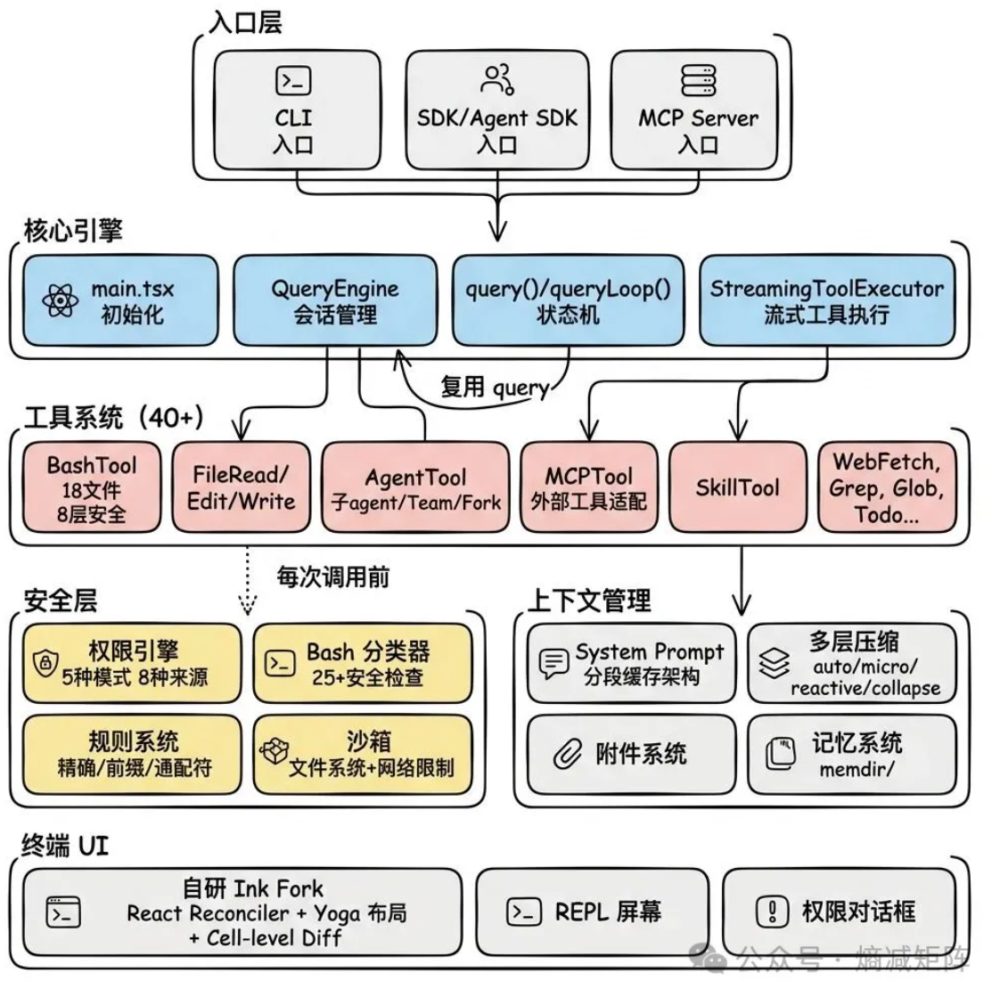

# 1. 流式输出的原理

# 2. SSE和websocket区别

# 3. Skill管理

第一层：常驻的只有「书脊」
Claude Code 启动后，会把所有 skill 的名字和描述拼成一份清单，跟着系统提醒（system-reminder）一起送进上下文。注意，只有名字和描述，正文一个字都不带。

这份清单长这样。

\- style-check: 检查代码是否符合团队风格规范...

- pdf: 处理 PDF 文件的技能。当用户需要读取...
- commit: 根据暂存区变更生成规范的提交信息...

整份 skill 清单的预算，只有上下文窗口的 1%。按 20 万 token 的窗口算，就是 2000 个 token 左右。第二行是单条描述的硬上限，250 个字符，超了直接截断

你写的 description 再天花乱坠，进清单时最多留 250 字符，这份清单只用来做「发现」，正文反正调用时会完整加载，描述写太长纯属浪费第一轮的 token。

如果用户装了两百个 skill，1% 都装不下了怎么办？

源码里有一套完整的降级方案。先尝试全量描述，超预算就按剩余空间把每条描述等比截短，再不行就走最极端的路线，第三方 skill 只留名字，描述全砍。

bundledIndices 指的是官方内置 skill，它们的描述永远不被截断，饿死也是先饿第三方。亲儿子待遇，源码从不说谎。

第二层：选中了，才把整本书抽出来
当模型判断当前任务需要某个 skill（怎么判断的下一节细说），它会发起一次调用，这时候 SKILL.md 的完整正文才被读进来，注入当前对话。

注入的方式也很有意思。你以为会塞进系统提示词？错，它包装成一条用户消息（user message），直接插进了对话流。

为什么走 user message 而不是改 system prompt？你可以想想。

系统提示词在整个会话里是要反复使用的，改动它会导致提示词缓存（Prompt Cache）大面积失效，每轮都重新计费。而追加一条消息是纯增量，前面的缓存一点不伤。这又是一个「抠 token 抠到骨子里」的细节。

第三层：附录，连第二层都懒得进
还记得 pdf skill 目录里那几个 reference.md 和脚本吗？它们在第二层注入时依然不会被加载。

SKILL.md 正文里只是留了几句指路的话，「表单填写这种复杂操作，先阅读 forms.md」。模型读到这句，真遇到表单任务，才会自己动手把那个文件 Read 进来。

Claude 是怎么知道该用哪个 skill 的？

把那份「书脊清单」摆在模型眼前，然后相信模型自己能看懂。

模型每轮生成回复之前，反正都要通读一遍上下文。清单就在里面躺着，用户的需求也在里面躺着，「这个需求跟哪行描述对得上」，这不就是语言模型最擅长的阅读理解吗？

所以那行 description 的分量，比你想象中重得多。它就是 skill 的唯一广告位。源码里能看到，这行广告是由两个字段拼出来的。

description 说清「我是干什么的」，可选的 when_to_use 字段补一句「什么时候该用我」。两句拼一起，就是模型做判断的全部依据。广告词写得含糊，你的 skill 就会在清单里坐一辈子冷板凳。

光靠模型自觉还不够。模型有时候会「想起来但懒得用」，看到匹配的 skill，却自己顺手把活干了。为了治这个毛病，SkillTool 的工具说明里写了一段措辞相当强硬的指令。

When askillmatchestheuser's request, this is a
BLOCKINGREQUIREMENT: invoketherelevantSkilltool
BEFOREgeneratinganyotherresponseaboutthe task

只要有 skill 跟用户请求匹配上，调用它就是一票否决级的硬性要求，必须先调 skill 再说别的。后面还跟了一句「绝不允许嘴上提到 skill 却不真正调用」

它的检索不用向量库，用的是让模型自己 grep。记忆也不用向量库，用的是让模型自己读写 Markdown。现在选 skill，还是不用向量库。

这背后是一个非常一致的哲学，能靠模型自身理解力解决的问题，绝不外挂一套额外系统。外挂系统看着专业，但每挂一个，就多一处能出故障的地方，多一摊要维护的东西，还得天天操心「检索不准怎么办」。而模型的阅读理解能力，是随着模型升级白嫖变强的。

这套「纯靠读」的方案也有软肋。skill 数量真到几百个、描述行被截得只剩名字的时候，匹配准确率肯定会掉。不过对绝大多数装几十个 skill 的用户来说，这个天花板还远碰不到。

你敲的 /命令 和 skill，其实是同一个东西

/commit、/review-pr 这种。你有没有想过，这些命令和 skill 是什么关系？

我原本以为是两套独立系统。翻完源码发现，好家伙，它们压根就是同一个东西。

在源码内部，slash command 和 skill 已经统一成了一套 Command 体系。用的是同一个数据结构，加载和执行走的也全是同一条路。SkillTool 的工具说明里甚至直接挑明了。用户嘴里的「斜杠命令」，就是 skill 的另一个名字。

一个 skill 天生有两个触发入口。人可以敲 /名字 手动触发，模型可以在判断匹配时自主触发。第二节演示的手动挡和自动挡，走的就是这两个入口，殊途同归。

这两个入口还各配了一个开关，都写在 frontmatter 里。

第一个开关叫 disable-model-invocation。设为 true 之后，模型就不许自主调用这个 skill 了，只有人手敲才能触发。源码里对应一段拦截逻辑，模型敢调就直接报错弹回去。

什么场景用它？危险操作。比如你写了个「一键发布上线」的 skill，你肯定不希望模型觉得「时机成熟」就自己发布了，这种必须留给人来扣扳机。

第二个开关反过来，叫 user-invocable。设为 false，这个 skill 就从斜杠命令菜单里消失，人敲不出来，只有模型能调。

这个又是什么场景？纯背景知识类的 skill。比如「本项目的数据库表结构说明」，它不是一个「动作」，人敲它没有意义，但模型干活时随时可能需要翻它。

skill 的正文不是写死的，里面还能玩出两个动态花样。

第一个花样，接收参数。

正文里可以写 $ARGUMENTS 占位符。用户敲 /style-check 只查命名问题 的时候，「只查命名问题」这串话会被原样填进占位符的位置。模型自主调用时同样可以传参。

第二个花样更猛，执行命令。

正文里可以用 !\`命令\` 的语法嵌一段 shell 命令。skill 被调用的那一刻，Claude Code 会先把这条命令跑了，把输出结果填进正文，再把填好的成品交给模型。

风格检查 skill 升个级，你立刻能感受到威力。给正文加一行。

待检查的代码如下：

!\`cat $ARGUMENTS\`

现在敲 /style-check UserService.java，Claude Code 会先执行 cat UserService.java 把代码读出来，直接怼进 prompt。模型睁眼一看，检查清单和待检查的代码已经并排摆好了，一步到位。

官方的 /commit 命令也是这么玩的，正文里嵌了 !\`git diff\`，调用瞬间把你的代码变更抓进上下文，模型看着真实的 diff 写提交信息。

要是有人在网上发了个带恶意命令的 skill 呢？

源码里对此有一道明确的防线。

来自 MCP 服务器的远程 skill，永远不执行正文里嵌的命令。源码注释写得很直接，MCP skill 是远程内容，不可信。只有你本地目录里的 skill 才享受动态展开的待遇，毕竟本地文件是你自己放进去的，出了事也怪不着别人。

skill 都是从哪里冒出来的？

加上代码其他位置注册的来源，skill 总共有五个来处。

一是官方内置，随 Claude Code 发行自带的那批，比如前面提过的 commit。二是用户级，你家目录 \~/.claude/skills/ 里的，走到哪跟到哪。三是项目级，项目仓库 .claude/skills/ 里的，只在这个项目里生效。四是插件，随安装的插件打包带来的。五是 MCP，远程服务器动态提供的。

skill 放在项目的 .claude/skills/ 目录里，意味着它会跟着代码一起进 git 仓库。新同事克隆项目的那一刻，团队沉淀的所有「操作手册」自动就位。部署流程怎么走、评审要盯哪些点，这些以前靠口口相传的东西，现在全在仓库里躺着。

以前这些东西写在 wiki 里，写完就烂。现在它们是能被 agent 直接执行的活文档，谁用谁更新，这是我觉得 skill 对团队协作最实在的改变。

撞名了怎么办？项目级和用户级各有一个 style-check 呢？

源码的处理简单直接，扫描按固定顺序进行，同一个文件身份先到先得，后来的重名直接跳过并记一条日志。项目级排在用户级后面加载，所以别指望在项目里「覆盖」用户级的同名 skill，起名的时候错开才是正道。

怎么写好一个 skill？

第一条，description 按广告词的标准写，重点写「什么时候用我」。

第四节说过，description 是 skill 的唯一广告位，模型全靠它做匹配，而且进清单时最多保留 250 个字符。这几乎逼着你放弃功能罗列，把最宝贵的字数花在触发场景上。

对比感受一下。「这是一个功能强大的代码质量工具，支持多种语言」，这种写法模型根本不知道什么时候该翻你的牌子。换成「检查代码是否符合团队风格规范。当用户要求检查代码风格、评审代码时使用」，动词全是用户嘴里会说出来的词，一对就上。

第二条，SKILL.md 管今天，references 管细节。

渐进式披露的第三层是留给你主动利用的。SKILL.md 只写高频主干流程，把低频的、超长的细节拆到 references 目录，正文里留一句指路的话就行。这样第二层注入时又轻又准，细节等模型真需要时自己去翻。

一个糙但好用的标准，SKILL.md 超过 500 行，就该考虑动刀拆附录了。

第三条，重复劳动写成脚本，别让模型每次现想。

如果 skill 里有一步是固定的机械操作，比如某种固定格式的转换，与其在正文里教模型「第一步第二步第三步」，不如直接写个脚本放进 scripts 目录，正文里一句「执行这个脚本」。

模型现想是有失败率的，今天想对了明天可能想歪。脚本没有失败率，跑一万次一个样。所以能固化成脚本的就别让模型现想，这是写 skill 最重要的手感。

# 4. 上下文管理

<https://lintsinghua.github.io/#ch07>

# 5. 记忆管理

<https://lintsinghua.github.io/#ch06>

# RAG

