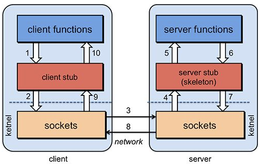
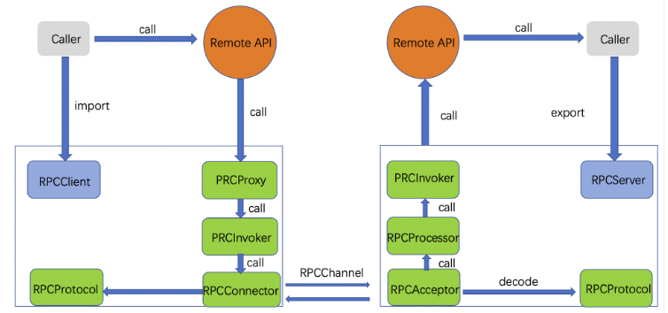
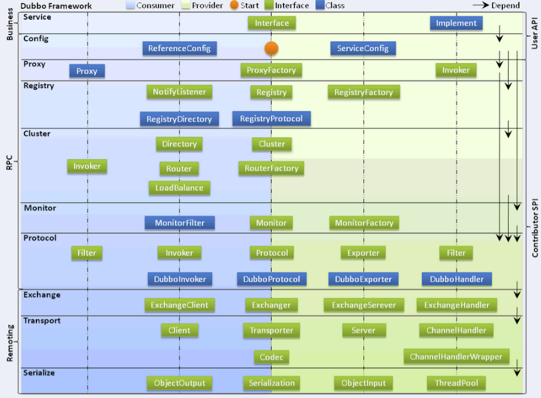
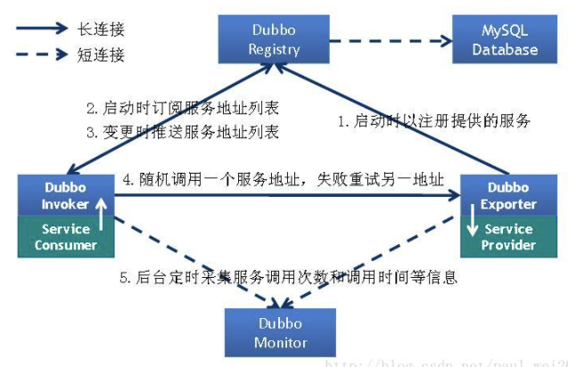

## 1. 什么是RPC？

RPC（Remote Procedure Call）即远程过程调用，是一种通过网络从远程计算机程序上请求服务，而不需要了解底层网络技术的协议。两台服务器A、B，应用部署在A上想调用B上的方法，由于不在一个内存空间不能直接调用，需要通过网络来表达调用的语义和传达调用的数据。

RPC协议假定某些传输协议的存在（如TCP或UDP），为通信程序之间携带信息数据。在OSI网络通信模型中，RPC跨越了传输层和应用层。业界常用的RPC框架有 **Dubbo**、**Spring Cloud**、**Thrift**、**gRPC** 等。

**RPC架构组件：**

RPC由 **Client**、**Client stub**、**Network**、**Server stub**、**Server** 五部分组成：
- **Client**：调用远程服务的调用方
- **Client stub**：将调用的方法和参数**序列化**（对象转字节）
- **Network**：传输序列化后的数据
- **Server stub**：将接收到的数据**反序列化**
- **Server**：服务的提供者，执行实际方法

## 2. RPC的工作原理是什么？

RPC的完整调用流程分为10步：

1. **Client** 像调用本地服务一样调用远程服务
2. **Client stub** 接收到调用后，将方法、参数**序列化**
3. 客户端通过 sockets 将消息发送到服务端
4. **Server stub** 收到消息后进行**解码（反序列化）**
5. **Server stub** 根据解码结果调用本地的服务
6. 本地服务执行并将结果返回给 Server stub
7. **Server stub** 将返回结果**打包成消息（序列化）**
8. 服务端通过 sockets 将消息发送到客户端
9. **Client stub** 接收到结果消息并**解码（反序列化）**
10. 客户端得到最终结果

## 3. RPC有哪些调用方式？

RPC调用分为两种方式：

- **同步调用**：客户方等待调用执行完成并返回结果
- **异步调用**：客户方调用后不用等待执行结果返回，可以通过**回调通知**等方式获取返回结果；若客户方不关心返回结果，则为**单向异步调用**（无需返回结果）

异步和同步的核心区别在于**是否等待服务端执行完成并返回结果**。

## 4. RPC的设计难点有哪些？

RPC框架设计的主要难点：

- **协议选择**：选择高效的通信协议（如Dubbo协议、HTTP/2等）
- **序列化方式**：默认使用 **Hessian** 序列化，此外还有 **Protobuf**、Kryo、JSON 等

## 5. Dubbo的分层架构是怎样的？

Dubbo框架采用分层架构设计，共10个层次，从上到下依次为：

1. **服务接口层（Service）**：与业务逻辑相关，设计对应的接口和实现
2. **配置层（Config）**：对外配置接口，以 `ServiceConfig` 和 `ReferenceConfig` 为中心
3. **服务代理层（Proxy）**：服务接口透明代理，生成客户端 Stub 和服务器端 Skeleton，扩展接口为 **ProxyFactory**
4. **服务注册层（Registry）**：封装服务地址的注册与发现，以**服务URL**为中心，扩展接口为 RegistryFactory、Registry、RegistryService
5. **集群层（Cluster）**：封装多个提供者的**路由**及**负载均衡**，以 **Invoker** 为中心，扩展接口为 Cluster、Directory、Router、LoadBalance
6. **监控层（Monitor）**：RPC调用次数和调用时间监控，以 Statistics 为中心
7. **远程调用层（Protocol）**：封装RPC调用，以 Invocation 和 Result 为中心。**Protocol** 是服务域，负责 Invoker 的暴露、引用和生命周期管理；**Invoker** 是Dubbo的核心模型，代表一个可执行体
8. **信息交换层（Exchange）**：封装请求响应模式，**同步转异步**，以 Request 和 Response 为中心
9. **网络传输层（Transport）**：抽象 **Mina** 和 **Netty** 为统一接口，以 Message 为中心
10. **数据序列化层（Serialize）**：可复用的序列化工具体系

## 6. RPC和SOA、SOAP、REST有什么区别？

- **SOA（面向服务架构）**：一种架构思想，将应用拆分为服务，通过服务间的契约（接口）进行通信
- **SOAP**：基于XML的通信协议，重量级，依赖WSDL定义接口，常用于企业级系统集成
- **REST**：基于HTTP的轻量级架构风格，资源导向，使用GET/POST/PUT/DELETE操作资源
- **RPC**：远程过程调用框架，更关注方法级别调用，支持多种协议和序列化方式

## 7. 如何实现一个RPC框架？

实现一个RPC框架的核心步骤：

1. **定义接口和协议**：确定通信协议（TCP/HTTP）、序列化方式（Hessian/Protobuf）
2. **服务导出（export）**：服务端通过 RpcServer 导出远程接口方法，注册到注册中心
3. **服务引入（import）**：客户端通过 RpcClient 引入远程接口，生成**代理实现**
4. **代理调用**：客户端调用时通过代理（RpcProxy）封装调用信息，委托 RpcInvoker 执行
5. **网络传输**：客户端 RpcInvoker 通过 RpcConnector 维持与服务器的 RpcChannel，使用 RpcProtocol 编码并发送
6. **服务端接收**：RpcAcceptor 接收请求，RpcProtocol 解码，传递给 RpcProcessor 处理，最终由 RpcInvoker 执行并返回

## 8. Dubbo中的URL是什么？

Dubbo以**URL**作为配置信息的统一载体，服务注册、服务发现、服务调用等环节都通过URL来传递配置信息。URL中包含协议、主机、端口、路径及各种参数，是Dubbo框架中**贯穿各层的核心模型**。
