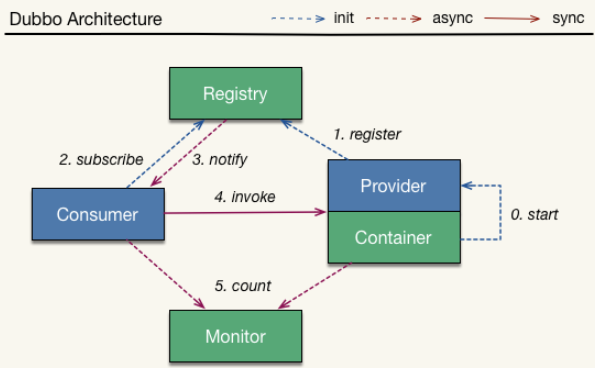
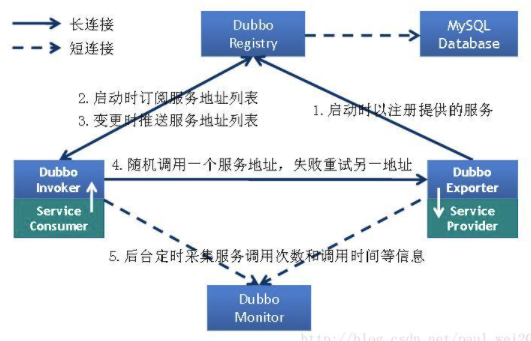

## 1. 简述Dubbo服务暴露（发布）的流程

`<dubbo:service/>` 标签被解析为 **ServiceBean**，ServiceBean 实现了 **InitializingBean** 和 **ApplicationListener**：

1. **afterPropertiesSet()**：类加载完成后依次解析 `<dubbo:provider/>`、`<dubbo:application/>`、`<dubbo:module/>`、`<dubbo:registry/>`、`<dubbo:monitor/>`、`<dubbo:protocol/>` 标签
2. **onApplicationEvent()**：Spring 容器初始化时调用，触发服务暴露
3. ServiceBean 继承 ServiceConfig，其 **export()** 方法完成暴露逻辑。若设置了 **delay** 参数，则启动守护线程 sleep 后再 doExport
4. **doExport()** 检查参数，包括泛化调用、本地实现、本地存根、本地伪装、配置项（application、registry、protocol 等）
5. 针对每个协议、每个注册中心组装 URL
6. 若 scope=none 则不暴露；若 scope=local 或未配置则进行**本地暴露**（使用 injvm 伪协议，不开启端口，JVM 内直接关联，执行 Dubbo Filter 链）
7. 若 scope=remote 或未配置则进行**远程暴露**：通过具体协议暴露后，将服务节点注册到注册中心。服务注册本质是将服务配置数据写入 ZK 的 **providers** 节点下
8. 在服务提供者节点树中创建 **configurators** 节点，设置 **OverrideListener** 监听器。若通过 Dubbo 管理系统设置动态参数，则通知监听器重新生成 URL，有变化则重新暴露

服务暴露完成后返回 **Exporter**，其 unexport() 方法在服务下线时清理资源。

## 2. Dubbo的服务注册与发现是如何实现的？

服务注册与发现涵盖两个核心方面：**客户端获取服务元数据** 和 **自动剔除失效服务**。

- **服务注册**：服务提供方启动时，将对外暴露的接口元数据（服务名、监听地址、协议、权重等）注册到注册中心。一般会建立**双向心跳机制**检测服务端的有效状态
- **服务订阅**：服务调用方启动时，去注册中心查找并订阅服务提供方的 IP，缓存到本地用于远程调用。注册中心信息变化时通过**推送方式**更新。获取元数据有 **pull**（主动去取）和 **push**（注册中心主动通知）两种方式

## 3. ZooKeeper作为注册中心有什么特点？对比其他注册中心

**ZooKeeper 的特点**：
- **强一致性（CP）**：集群每个节点数据更新时通知所有节点同步执行，保证强一致，但会牺牲性能
- 支持**持久节点**（需主动删除）和**临时节点**（生命周期与会话绑定，适合感知服务上下线）

**主流注册中心对比**：

| Feature | Consul | ZooKeeper | etcd | Eureka |
|---|---|---|---|---|
| 服务健康检查 | 服务状态、内存、硬盘等 | 长连接 keepalive（弱） | 连接心跳 | 可配支持 |
| 多数据中心 | 支持 | — | — | — |
| KV 存储 | 支持 | 支持 | 支持 | — |
| 一致性 | raft | paxos | raft | — |
| CAP | CA | CP | CP | AP |
| 接口 | HTTP/DNS | 客户端 | HTTP/gRPC | HTTP |
| Watch | 全量/支持 long polling | 支持 | long polling | long polling/大部分增量 |
| 安全 | ACL/HTTPS | ACL | HTTPS | — |

若注重性能，可考虑 **AP 模式（最终一致）** 的注册中心，如 Nacos、Eureka。

## 4. 注册中心如何感知服务下线？

服务下线分**主动下线**和**异常下线**，感知方式有两种：

- **临时节点 + 长连接（ZK 方式）**：应用连接 ZK 时创建临时节点，使用长连接维持会话。无论何种方式下线，ZK 都能感知并删除临时节点，精准契合服务下线需求
- **主动下线 + 心跳检测（Eureka 方式）**：客户端关闭时主动通知 Server 摘除节点。但对断电、断网等异常下线，Server 会保留已下线节点，需增加心跳检测——如每 30s 探测一次，三次无响应则判定服务已下线

## 5. 如何实现注册中心数据的最终一致性？

可以牺牲强一致性（CP），选择**最终一致性（AP）**，采用**消息总线机制**：

1. 注册数据全量缓存在每个注册中心内存中，通过消息总线同步数据
2. 服务上线时，注册中心收到请求，服务列表变化，生成一条**整体递增版本号**的消息推送到消息总线
3. 消息总线主动推送到各注册中心，注册中心也会定时拉取
4. **消息回放模块**只接受大于本地版本号的消息，小于的丢弃，实现最终一致性
5. 消费者从注册中心内存获取接口的全部服务实例，并缓存到本地内存
6. 采用**推拉模式**，消费者及时拿到服务实例增量变化，与本地缓存合并

## 6. 什么是服务降级？常见的降级方案有哪些？

**服务降级**：当服务器压力剧增时，根据业务情况和流量有策略地降级某些服务或页面，释放服务器资源保证核心任务正常运行。

常见降级方案：
- **服务接口拒绝服务**：页面可访问，但添加删除提示服务器繁忙，页面内容从 Varnish 或 CDN 获取
- **页面拒绝服务**：页面提示服务繁忙暂停，跳转到 Varnish 或 Nginx 静态页面
- **延迟持久化**：页面访问照常，但涉及变更的操作稍晚才能看到结果，数据记录到异步队列或 log，服务恢复后执行
- **随机拒绝服务**：服务接口随机拒绝让用户重试（用户体验不佳，目前较少采用）

## 7. 什么是服务熔断？熔断器如何设计？

**服务熔断**：当某个目标服务调用慢或大量超时时，熔断该服务的调用，后续请求不再调用目标服务，直接返回，快速释放资源。目标服务恢复后恢复调用。

**熔断器设计三模块**：
- **熔断请求判断算法**：使用无锁循环队列计数，默认维护 10 个 bucket（每 1 秒一个），记录成功、失败、超时、拒绝状态。默认错误率超过 **50%** 且 10 秒内超过 **20 个请求**时进行拦截
- **熔断恢复机制**：对被熔断的请求，每隔 **5s** 允许部分请求通过，若请求都健康（RT < 250ms）则恢复
- **熔断报警**：熔断请求打日志，异常请求超过设定阈值则报警

## 8. 服务熔断和服务降级的区别与联系？

**相同点**：
- 都是为防止系统整体缓慢或崩溃采取的技术手段
- 最终表现类似，用户均感受到某些功能不可用
- 粒度一般为服务级别
- **自治性要求高**：熔断基于策略自动触发；降级需开关预置、配置中心等手段

**区别**：
- **触发原因不同**：降级从**整体负荷**考虑；熔断由**某个下游服务故障**引起
- **管理层次不同**：降级有业务层级之分（从最外围服务开始）；熔断是框架级处理，每个微服务无层级之分
- **实现位置不同**：降级在**客户端**实现（fallback 返回缺省值），与服务端无关；熔断在服务端处理
