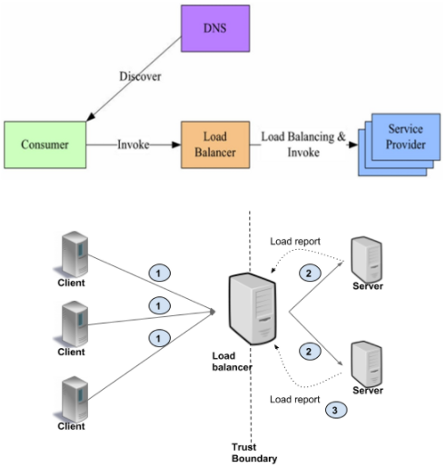
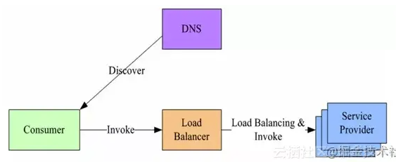
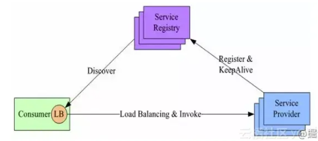
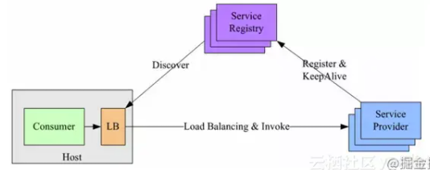
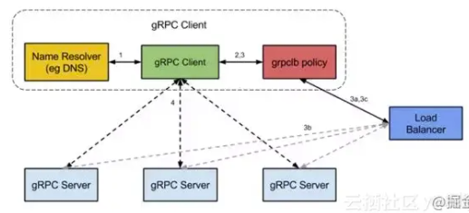

## 1. 常见的负载均衡策略有哪些？

**核心回答：** 常见负载均衡策略包括**随机（Random）、轮询（RoundRobin）、最少活跃调用（LeastActive）、一致性哈希（ConsistentHash）**。

**原理分析：**

1. **随机（Random）**：按权重设置随机概率。调用量越大分布越均匀，有利于动态调整提供者权重。Dubbo默认使用此策略。
2. **轮询（RoundRobin）**：按公约后的权重设置轮询比率。存在慢提供者累积请求的问题：慢的节点未挂但请求卡住，久而久之所有请求都可能被阻塞。
3. **最少活跃调用（LeastActive）**：活跃数指调用前后计数差，越慢的提供者计数差越大，收到更少请求，实现**慢节点自动降权**。
4. **一致性哈希（ConsistentHash）**：相同参数的请求总是发到同一提供者。提供者挂掉时，基于虚拟节点将请求平摊到其他提供者，不会引起剧烈变动。缺省对第一个参数Hash，缺省160份虚拟节点。

**延展思考：**
策略选择需结合业务场景：无状态服务优先随机/轮询；缓存类服务用一致性哈希提高命中率；需根据服务能力差异配置加权策略。

## 2. 负载均衡如何按OSI模型分层分类？

**核心回答：** 按OSI模型可分为**二层（MAC）、三层（IP）、四层（TCP）、七层（HTTP）**负载均衡。

**原理分析：**

1. **二层负载均衡（MAC）**：通过虚拟MAC地址方式，负载均衡接收请求后分配后端实际MAC地址响应。
2. **三层负载均衡（IP）**：通过虚拟IP地址方式，外部对VIP请求，负载均衡分配后端实际IP地址响应（IP对IP转发，端口全放开）。
3. **四层负载均衡（TCP）**：在传输层使用**IP+端口**接收请求，转发到对应机器。性能高但无法理解应用层协议。
4. **七层负载均衡（HTTP）**：在应用层根据虚拟URL、主机名等接收请求，转向相应处理服务器。灵活性高可做更多业务策略。

**场景选择：**

- 设备资源少或延迟要求严格：优先L3/L4
- 连接间负载变化大或需存储/计算相关性：优先L7

## 3. 为什么RPC框架一般不采用硬件负载均衡或四层代理？

**核心回答：** RPC框架通常采用**客户端负载均衡**而不是硬件负载均衡或四层代理，主要原因包括成本、性能、服务发现和策略可配性。

**原理分析：**

1. **额外成本**：搭建负载均衡设备或TCP/IP四层代理需要额外硬件和运维成本。
2. **性能损耗**：请求流量都经过负载均衡设备，多一次网络传输浪费性能。
3. **服务发现困难**：添加和摘除节点通常需手动操作，大批量扩容下线时效率低。
4. **策略灵活性问题**：不同接口、不同分组的负载均衡策略不同，集中经过一个设备不易按需配置。

## 4. 服务端负载均衡和客户端负载均衡有什么区别？

**核心回答：** 服务端负载均衡（集中式LB）通过独立代理分发请求；客户端负载均衡由调用方自行选择服务端。客户端负载均衡又分为**进程内LB**和**独立LB进程**两种。

**原理分析：**

**1. 代理模式（集中式LB）**

客户端所有请求打到代理服务，由代理分发到服务端。可以是L3/L4（传输级别）或L7（应用级别）。

- **L3/L4**：服务器终止TCP连接并打开另一个连接到所选后端，延迟少、资源消耗低
- **L7**：负载均衡服务终止并解析协议，可检查每个请求并根据内容分配后端，监控拦截方便
- 优点：客户端无需改造，中间层做监控拦截非常容易
- 缺点：增加RPC延迟，代理服务影响吞吐量

具体实现上，LB（如F5、LVS、HAproxy）上有服务地址映射表，由运维配置注册。

主要问题：
1. **单点问题**：所有流量经过LB，量大时LB成为瓶颈，一旦故障影响整个系统
2. **性能开销**：服务消费方与提供方之间增加一级

**2. 进程内LB（Balancing-aware Client）**

将LB功能集成到服务消费方进程里，也被称为**软负载**或**客户端负载方案**。

- 服务提供方启动时将地址注册到服务注册表，定期心跳保活
- 服务消费方通过内置LB组件查询服务注册表，缓存并定期刷新地址列表
- 按负载均衡策略选择一个目标服务地址直接调用

- 优点：高性能，消除了第三方交互，服务消费方与提供方直接调用无额外开销
- 缺点：多语言栈需开发多种客户端，客户库升级需修改代码重新发布

**3. 独立LB进程（External Load Balancing Service）**

将LB和服务发现从进程内移出来，变成主机上的一个**独立进程**。

- 优点：无单点问题（一个LB进程挂了只影响本机），进程内调用性能好，不需要为不同语言开发客户端，LB升级无需服务调用方改代码
- 缺点：部署较复杂，环节多，排查问题不方便

## 5. gRPC的负载均衡是如何实现的？

**核心回答：** gRPC采用**进程内LB方案**，通过命名解析、负载均衡策略和子通道机制实现服务发现和负载均衡。

**原理分析：**

1. **名称解析**：gRPC客户端向命名服务器发起名称解析请求，将名称解析为IP地址列表，每个IP标示是服务器地址还是负载均衡器地址。
2. **负载均衡策略选择**：如果解析返回的是负载均衡器地址，客户端使用grpclb策略；否则使用服务配置指定的策略。
3. **子通道创建**：负载均衡策略为每个服务器地址创建一个子通道（channel）。
4. **请求路由**：RPC请求时，负载均衡策略决定哪个子通道（即gRPC服务器）接收请求。可用服务器为空时请求被阻塞。

**延展思考：**
结合分布式一致组件（Zookeeper、Consul、Etcd）可实现完整服务发现方案。Dubbo也采用类似机制。

## 6. Dubbo的服务发现机制是怎样的？

**核心回答：** Dubbo采用**事件通知与客户端拉取**相结合的方式，基于Zookeeper的Watcher机制实现动态服务发现。

**原理分析：**

1. **服务订阅**：客户端首次订阅时拉取对应目录下**全量数据**。
2. **注册Watcher**：在订阅的节点注册一个watcher。
3. **变更通知**：目录节点数据变化时，ZK通过watcher通知客户端。
4. **重新拉取**：客户端接到通知后重新拉取该目录下全量数据，并重新注册watcher。

**服务订阅方式对比：**

- **Pull模式**：客户端定时向注册中心拉取配置
- **Push模式**：注册中心主动推送数据给客户端
- **Dubbo方案**：结合两者优势，首次全量拉取+变更事件通知触发重新拉取

## 7. Dubbo的负载均衡如何配置？

**核心回答：** Dubbo支持在**Provider端、Consumer端、服务级别、方法级别**多维度配置负载均衡策略，默认使用随机策略。

**配置方式：**

- **服务端服务级别**：`<dubbo:service interface="..." loadbalance="roundrobin" />`
- **客户端服务级别**：`<dubbo:reference interface="..." loadbalance="roundrobin" />`
- **服务端方法级别**：`<dubbo:service interface="..."><dubbo:method name="..." loadbalance="roundrobin"/></dubbo:service>`
- **客户端方法级别**：`<dubbo:reference interface="..."><dubbo:method name="..." loadbalance="roundrobin"/></dubbo:reference>`

**延展思考：**
一致性Hash策略的Dubbo配置：`<dubbo:parameter key="hash.arguments" value="0,1" />`可修改Hash参数，`<dubbo:parameter key="hash.nodes" value="320" />`可修改虚拟节点数。

## 8. LVS、Nginx、HAProxy负载均衡器各有什么特点？

**核心回答：** LVS、Nginx、HAProxy是三种主流软件负载均衡器，分别适用于不同场景。

**原理分析：**

**LVS特点：**

- 基于**四层**网络协议，抗负载能力强，对硬件要求低
- 配置性低，减少人为出错
- 应用范围广，不仅对Web服务，还可对MySQL等做负载均衡
- 需虚拟IP（VIP），需向IDC多申请一个IP

**Nginx特点：**

- 工作在**七层**，可针对HTTP应用做分流策略（域名、目录结构）
- 安装配置简单，测试方便
- 支撑高并发，吞吐上万并发
- 支持端口检测故障，自动将失败请求提交到其他节点（但不支持URL检测）
- **异步处理**请求，帮助后端节点减轻负载
- 默认三种调度算法：**轮询、weight、ip_hash**，支持第三方fair和url_hash
- 支持HTTP和Email，适用范围相对较小

**HAProxy特点：**

- 工作在**七层**
- 支持Session保持、Cookie引导
- 支持URL检测后端服务器故障
- 支持**动态加权轮循、加权源地址哈希、加权URL哈希、加权参数哈希**等算法
- 效率上比Nginx有更出色的负载均衡速度
- 可对MySQL做负载均衡

**一句话总结：**
LVS四层高性能适合入口流量分发，Nginx七层灵活配置适合HTTP应用，HAProxy效率高适合需要URL检测和数据库负载均衡的场景。
