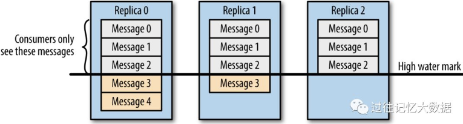

## 1. Kafka如何保证消息不丢失？

Kafka要保证消息不丢失有两个核心条件：一是只对**已提交的消息（committed message）**做持久化保证，即生产者提交消息到broker并等到多个broker确认后才算提交成功；二是必须保证有足够broker正常工作（N个broker中至少1个存活）。

从三个端分别看：

- **生产者端丢失**：`producer.send(msg)`是异步的，网络抖动或消息不合规会导致发送失败。使用`producer.send(msg, callback)`并设置合理的**retries**（推荐3以上）和重试间隔可避免。
- **Broker端丢失**：Leader宕机时未同步的数据可能丢失。
  - 设置`acks=all`：所有副本都接收到才算成功
  - 设置`replication.factor >= 3`：保证每个分区至少3个副本
  - 设置`min.insync.replicas > 1`：消息至少写入2个副本才算成功。注意保证`replication.factor > min.insync.replicas`（推荐`replication.factor = min.insync.replicas + 1`）
  - 设置`unclean.leader.election.enable = false`：Leader故障时不从同步落后的follower中选Leader
- **消费者端丢失**：消费者拉取消息后自动提交offset但还没消费完就挂掉。**解决办法是关闭自动提交offset，在真正消费完消息后再手动提交offset**。

## 2. Kafka如何保证消息不重复消费？

消费者手动提交offset会导致"先消费后提交"，如果消费完但未提交offset就挂掉，重启后会重复消费。**通过保证消费的幂等性来解决**：

- **数据库唯一键约束**：利用主键或唯一索引防止重复插入
- **先查后写**：先根据主键查一下，有数据则update而非insert
- **Redis去重**：消息中带全局唯一ID（如订单ID），消费前查Redis是否已处理
- **消息状态表**：建一张消息消费记录表，生产者发送前先入库（状态为待消费），消费者通过主键ID查询状态，处理后更新为已消费

**重复消费不可怕，可怕的是没考虑重复消费后怎么保证幂等性。**

## 3. Kafka如何保证幂等性？

幂等性解决**数据重复和数据乱序**问题。Kafka在0.11版引入了**幂等型Producer**和**事务型Producer**。

**启用幂等Producer**：设置`enable.idempotence=true`，此时`acks`强制为`all`。**单会话幂等**：开启幂等后通过**PID + Sequence Number**实现去重。每个Producer初始化时被分配一个唯一的**PID**（对用户不可见），每个`<Topic, Partition>`维护一个从0开始单调递增的**Sequence Number**。Broker端缓存Sequence Number，收到消息时校验：

- 序号比Broker缓存大1 → 接受
- 序号大一以上（乱序） → 拒绝，抛出`InvalidSequenceNumber`
- 序号小于等于缓存值（重复） → 丢弃，抛出`DuplicateSequenceNumber`

所以：**at least once + 幂等 = exactly once**

**幂等性的局限性**：
- 只能保证**单会话内**不丢不重，Producer挂掉重启后会分配新PID，无法获取之前的状态信息
- 只能保证**单个Partition内**的幂等，不能跨多个Topic-Partition
- **`MAX_IN_FLIGHT_REQUESTS_PER_CONNECTION`需≤5**，因为Server端每个PID在每个Topic-Partition上只缓存最近5个batch数据

**跨会话、跨多个Topic-Partition的幂等需要使用Kafka事务**。

## 4. Kafka如何保证消息顺序？

Kafka**只能保证Partition内的有序**，Partition间无法保证有序。

**生产端**：发送消息时可指定(topic, partition, key)。指定**partition**则所有消息发往同一partition；指定**key**（如order id），具有相同key的消息通过`abs(hash(主键)) % partition_num`路由到同一partition。实际场景中，要保证同一订单的操作顺序不乱，根据订单主键/用户ID决定分区即可。

**消费端**：Kafka保证**一个Partition只能被同一个Consumer Group内的一个Consumer消费**，但Consumer内部建议单线程消费，否则多线程会引入乱序问题。

优点：减少consumer与broker通信开销，保证partition内有序。缺点：无法让同一group内的consumer均匀消费数据。

## 5. Kafka如何保证数据一致性？

通过**High Water Mark（HW）机制**和**ISR机制**保证数据一致性。一致性定义：若某条消息对client可见，那么即使Leader挂了，在新Leader上数据依然可被读到。

**HW机制**：
- **HW（高水位）**：取Partition对应的ISR中最小的LEO作为HW，**Consumer最多只能消费到HW所在的位置**
- **LEO（Log End Offset）**：replica中下一条待写入消息的offset
- 对于Leader新写入的消息，Consumer不能立刻消费，Leader会等待该消息**被所有ISR中的replica同步后更新HW**，此时消息才能被Consumer消费
- 这样确保了如果Leader Broker失效，消息仍可从新选举的Leader获取
- HW机制类似**木桶原理**：未被足够多副本复制的消息被认为是"不安全的"，如果Consumer读到Message4后Leader挂了，新Leader没有Message4，就破坏了一致性
- 延迟可通过`replica.lag.time.max.ms`配置

**ISR（In-Sync Replicas）机制**：维护所有同步的、可用的副本列表。节点存活条件：①维持和ZooKeeper的会话；②如果是从节点，复制不能太落后（包括数据复制落后和时间相差过大）。

**副本与Leader不同步的原因**：
- **慢副本**：I/O瓶颈导致follower追加速度慢于拉取速度
- **卡住副本**：GC暂停或follower失效，停止拉取请求
- **新启动副本**：增加副本因子时，新follower需赶上leader日志后才加入ISR

## 6. Kafka如何保证数据可靠性？

通过**副本机制、ACK参数、ISR机制、Partition Recovery机制**保证。

**Partition Recovery机制**：每个Partition在磁盘记录一个**RecoveryPoint**（已flush到磁盘的最大offset）。当Broker故障重启时，先读取RecoveryPoint，找到包含该点的segment及之后的segment（可能未完全flush），调用segment的recover重新读取消息并重建索引。优点：①以segment为单位管理数据，方便生命周期管理；②加快恢复速度，只需恢复未flush的segment；③通过index二分查找快速定位消息。

**Broker的三种offset**：
- **base offset**：起始位移，replica中第一条消息的offset
- **HW**：高水印值，副本中最新一条已提交消息的位移
- **LEO**：日志末端位移，replica中下一条待写入消息的offset

HW之前的才是可被外界访问的数据，LEO标示follower的同步进度。

## 7. Kafka事务是什么？如何实现？

Kafka事务与数据库事务类似，指一系列的**Producer生产消息和消费消息提交Offsets的操作在一个事务中**，即原子性操作——同时成功或同时失败。

**启用事务**：设置`transactional.id`为一个指定字符串（有意义的事务名称），同时设置`enable.idempotence=true`。

**事务能做到的保证**：
- 跨会话的幂等性写入：即使中间故障，恢复后依然可保持幂等
- 跨会话的事务恢复：应用实例挂了，下一个实例可保证上一个事务完成（commit或abort）
- 跨多个Topic-Partition的幂等性写入：要么全部写入成功，要么全部失败

**事务API**（`Producer`接口）：
- `initTransactions()` - 初始化
- `beginTransaction()` - 开启事务
- `sendOffsetsToTransaction()` - 提交消费offset
- `commitTransaction()` - 提交事务
- `abortTransaction()` - 中止事务

**事务实现原理**：
1. **查找TransactionCoordinator**：通过`transaction_id`哈希计算partition，找到该partition的leader即为TransactionCoordinator
2. **获取PID**：开启事务时，Producer Client调用`initTransactions()`向TransactionCoordinator发起`InitPidRequest`获取PID
3. **开启事务**：`beginTransaction()`将客户端本地事务状态转为`IN_TRANSACTION`，发送第一条消息后TransactionCoordinator才认为事务已开启
4. **Consume-Process-Produce Loop**：典型的消费-处理-生产场景
5. **提交或中断事务**：调用`commitTransaction()`或`abortTransaction()`

**Consumer端限制**：Consumer端很难保证一个已commit的事务的所有消息都被消费，因为compacted topic可能覆盖、旧segment可能过期清除、Consumer可通过seek跳转位置、Consumer可能未订阅所有涉及的Partition。

**幂等是事务的基础**：幂等提供了单会话单Partition Exactly-Once语义，事务在此基础上实现了跨Partition和跨会话的原子性保证。
